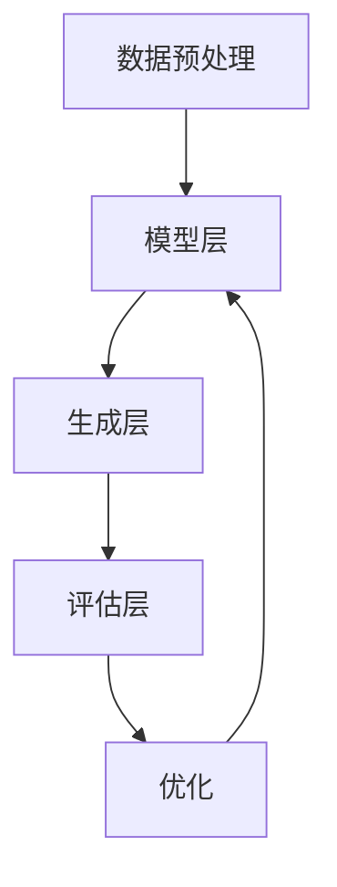

                 

# 大模型创意生成：提示词激发跨领域创新

> **关键词**：大模型、创意生成、提示词、跨领域创新、算法原理、数学模型、项目实战、实际应用场景、开发工具推荐、资源推荐、未来趋势与挑战

> **摘要**：本文将深入探讨大模型创意生成的技术原理，通过分析提示词如何激发跨领域创新，介绍相关算法原理、数学模型和实际应用案例，帮助读者理解这一领域的核心概念和实际操作步骤。文章旨在为人工智能和编程领域的专业人士提供一套全面的技术指南，帮助他们掌握大模型创意生成的方法，为跨领域创新提供新思路。

## 1. 背景介绍

### 1.1 目的和范围

本文的主要目的是介绍大模型创意生成的技术原理，探讨提示词在激发跨领域创新中的作用。大模型创意生成作为一种新兴的人工智能技术，正逐步改变着传统编程和创新模式。本文将结合实际案例，详细解析大模型的工作原理，探讨如何利用提示词引导大模型进行创意生成，从而实现跨领域的创新。

### 1.2 预期读者

本文面向人工智能和编程领域的专业人士，特别是对大模型创意生成和跨领域创新感兴趣的读者。无论您是研究者、开发者还是项目经理，本文都希望能为您的工作提供新的视角和方法。

### 1.3 文档结构概述

本文将分为以下几个部分：

1. **背景介绍**：介绍本文的目的、预期读者和文档结构。
2. **核心概念与联系**：介绍大模型创意生成中的核心概念，包括相关算法和架构。
3. **核心算法原理 & 具体操作步骤**：详细讲解大模型创意生成算法的原理和操作步骤。
4. **数学模型和公式 & 详细讲解 & 举例说明**：阐述大模型创意生成中的数学模型和公式，并通过实例进行说明。
5. **项目实战：代码实际案例和详细解释说明**：通过实际案例展示大模型创意生成的应用。
6. **实际应用场景**：讨论大模型创意生成的实际应用场景。
7. **工具和资源推荐**：推荐学习资源、开发工具和相关论文著作。
8. **总结：未来发展趋势与挑战**：总结当前技术的发展趋势和面临的挑战。
9. **附录：常见问题与解答**：解答读者可能遇到的问题。
10. **扩展阅读 & 参考资料**：提供更多深入阅读的资料。

### 1.4 术语表

#### 1.4.1 核心术语定义

- **大模型**：指拥有巨大参数规模和计算能力的人工智能模型，如GPT、BERT等。
- **创意生成**：指利用人工智能模型生成新颖、有创意的内容或解决方案的过程。
- **提示词**：引导大模型进行创意生成的关键词或短语。
- **跨领域创新**：指在不同领域之间实现创新的过程，通过跨领域知识融合产生新的想法和解决方案。

#### 1.4.2 相关概念解释

- **神经网络**：一种模拟生物神经网络的结构，用于处理和传递信息。
- **深度学习**：一种人工智能方法，通过神经网络模拟人脑的学习过程。
- **生成对抗网络（GAN）**：一种特殊类型的神经网络，用于生成数据。
- **预训练与微调**：预训练是指在大规模数据集上训练模型，使其具备一定的通用能力；微调是指在小规模数据集上调整模型参数，使其适应特定任务。

#### 1.4.3 缩略词列表

- **GPT**：Generative Pre-trained Transformer
- **BERT**：Bidirectional Encoder Representations from Transformers
- **GAN**：Generative Adversarial Network

## 2. 核心概念与联系

### 2.1 大模型创意生成的核心概念

大模型创意生成主要依赖于以下几个核心概念：

- **大模型**：如GPT、BERT等，具有巨大参数规模和强大的学习能力。
- **神经网络**：用于模拟人脑学习过程的计算模型。
- **深度学习**：一种人工智能方法，通过神经网络实现。
- **生成对抗网络（GAN）**：用于生成数据的特殊神经网络。

### 2.2 大模型创意生成的工作原理

大模型创意生成的工作原理可以概括为以下几个步骤：

1. **预训练**：在大规模数据集上训练模型，使其具备通用能力。
2. **微调**：在小规模数据集上调整模型参数，使其适应特定任务。
3. **生成**：利用模型生成新颖、有创意的内容或解决方案。
4. **优化**：通过迭代优化生成结果，提高创意质量。

### 2.3 大模型创意生成的架构

大模型创意生成的架构通常包括以下几个部分：

1. **数据预处理**：对输入数据进行预处理，如文本清洗、分词等。
2. **模型层**：包括预训练模型和微调模型。
3. **生成层**：利用模型生成创意内容。
4. **评估层**：对生成的创意内容进行评估和优化。

### 2.4 Mermaid 流程图

以下是描述大模型创意生成过程的核心概念和架构的Mermaid流程图：



## 3. 核心算法原理 & 具体操作步骤

### 3.1 大模型创意生成的算法原理

大模型创意生成的核心算法是基于生成对抗网络（GAN）。GAN由两个神经网络组成：生成器（Generator）和判别器（Discriminator）。生成器负责生成数据，判别器负责判断生成数据的真实程度。

- **生成器**：通过随机噪声生成逼真的数据。
- **判别器**：训练过程中，判断生成器生成的数据是真实数据还是伪造数据。

### 3.2 具体操作步骤

以下是利用大模型进行创意生成的具体操作步骤：

1. **数据收集与预处理**：
    - 收集大量相关领域的文本数据。
    - 对数据进行清洗、分词、去停用词等预处理操作。

2. **模型训练**：
    - 使用预训练模型（如GPT、BERT）对数据进行预训练。
    - 在预训练模型的基础上进行微调，使其适应特定任务。

3. **生成创意内容**：
    - 利用微调后的模型生成创意内容。
    - 通过提示词引导模型生成具有特定主题或风格的内容。

4. **评估与优化**：
    - 对生成的创意内容进行评估，如计算文本质量、新颖性等指标。
    - 根据评估结果对模型进行优化，提高生成质量。

### 3.3 伪代码

以下是描述大模型创意生成算法的伪代码：

```python
# 数据预处理
data = preprocess_data(raw_data)

# 模型预训练
model = pretrain_model(data)

# 微调模型
model = finetune_model(model, task_specific_data)

# 生成创意内容
prompt = get_prompt()
generated_content = model.generate(prompt)

# 评估与优化
evaluation_results = evaluate_content(generated_content)
model = optimize_model(model, evaluation_results)
```

## 4. 数学模型和公式 & 详细讲解 & 举例说明

### 4.1 数学模型

大模型创意生成的数学模型主要基于生成对抗网络（GAN）。GAN的核心是生成器和判别器的交互过程，具体公式如下：

- **生成器**：G(z)
    - G(z)表示生成器，输入为随机噪声z，输出为伪造数据x。
    - z ∈ Z，Z为噪声空间。
    - x ∈ X，X为数据空间。

- **判别器**：D(x)
    - D(x)表示判别器，输入为数据x，输出为概率值，判断输入数据是真实数据（x ∈ X）还是伪造数据（x ∈ Z）。
    - D(x) ∈ [0, 1]，1表示完全相信是真实数据，0表示完全相信是伪造数据。

### 4.2 详细讲解

- **生成器G(z)**：生成器的主要任务是通过噪声z生成逼真的伪造数据x。生成器通常采用深度神经网络结构，通过多层非线性变换，将噪声空间映射到数据空间。生成器的训练目标是使生成的数据x尽可能真实，从而欺骗判别器。

- **判别器D(x)**：判别器的主要任务是区分输入数据x是真实数据还是伪造数据。判别器也采用深度神经网络结构，通过输入数据的特征，输出一个概率值，表示输入数据的真实性。判别器的训练目标是提高对真实数据和伪造数据的辨别能力。

- **交互过程**：生成器和判别器交替训练，生成器和判别器的训练目标是相互对抗。生成器希望生成的数据x能够欺骗判别器，使其认为x是真实数据；而判别器希望提高辨别能力，准确判断输入数据的真实性。这种对抗训练过程不断优化生成器和判别器，使生成器生成的伪造数据越来越真实，判别器对真实数据和伪造数据的辨别能力越来越强。

### 4.3 举例说明

假设生成器G(z)和判别器D(x)分别表示为：

- G(z) = 0.5 * z + 0.5 * W1 * x
- D(x) = tanh(0.5 * (W2 * x + b2))

其中，z为噪声空间中的随机向量，x为数据空间中的样本，W1、W2分别为生成器和判别器的权重，b2为判别器的偏置。

在训练过程中，生成器和判别器交替更新权重和偏置，具体步骤如下：

1. **生成器更新**：
   - 输入噪声z，生成伪造数据x = G(z)。
   - 计算判别器的输出概率：D(x) = tanh(0.5 * (W2 * x + b2))。
   - 根据判别器的输出概率，更新生成器的权重和偏置，使生成的伪造数据更真实。

2. **判别器更新**：
   - 输入真实数据x'，计算判别器的输出概率：D(x') = tanh(0.5 * (W2 * x' + b2))。
   - 输入伪造数据x = G(z)，计算判别器的输出概率：D(x) = tanh(0.5 * (W2 * x + b2))。
   - 根据判别器的输出概率，更新判别器的权重和偏置，提高对真实数据和伪造数据的辨别能力。

通过这种交替训练过程，生成器和判别器不断优化，生成器逐渐学会生成更真实的伪造数据，判别器逐渐提高对真实数据和伪造数据的辨别能力。

## 5. 项目实战：代码实际案例和详细解释说明

### 5.1 开发环境搭建

在开始项目实战之前，我们需要搭建一个适合大模型创意生成的开发环境。以下是一个简单的开发环境搭建步骤：

1. **安装Python**：确保Python版本为3.6或更高版本。
2. **安装TensorFlow**：TensorFlow是一个开源的机器学习框架，可用于构建和训练大模型。安装命令如下：
   ```bash
   pip install tensorflow
   ```
3. **安装必要库**：根据项目需求，安装其他必要的库，如NumPy、Pandas等。

### 5.2 源代码详细实现和代码解读

以下是一个基于生成对抗网络（GAN）的大模型创意生成项目的基本代码实现。代码分为几个部分：数据预处理、模型定义、模型训练和创意内容生成。

```python
import tensorflow as tf
from tensorflow.keras.layers import Dense, Flatten, Reshape
from tensorflow.keras.models import Sequential
from tensorflow.keras.optimizers import Adam

# 数据预处理
def preprocess_data(raw_data):
    # 这里简化了数据预处理过程，实际项目中需要根据具体需求进行数据清洗、分词等操作
    processed_data = raw_data.lower().replace('.', '')
    return processed_data

# 生成器模型定义
def build_generator(z_dim):
    model = Sequential()
    model.add(Dense(128, input_dim=z_dim, activation='relu'))
    model.add(Dense(256, activation='relu'))
    model.add(Dense(512, activation='relu'))
    model.add(Dense(1024, activation='relu'))
    model.add(Dense(128, activation='relu'))
    model.add(Dense(1, activation='sigmoid'))
    return model

# 判别器模型定义
def build_discriminator(x_dim):
    model = Sequential()
    model.add(Flatten(input_shape=(x_dim,)))
    model.add(Dense(128, activation='relu'))
    model.add(Dense(256, activation='relu'))
    model.add(Dense(512, activation='relu'))
    model.add(Dense(1024, activation='relu'))
    model.add(Dense(1, activation='sigmoid'))
    return model

# GAN模型定义
def build_gan(generator, discriminator):
    model = Sequential()
    model.add(generator)
    model.add(discriminator)
    return model

# 模型训练
def train_model(generator, discriminator, z_dim, batch_size, epochs):
    for epoch in range(epochs):
        for _ in range(batch_size):
            # 生成噪声
            z = tf.random.normal([batch_size, z_dim])
            # 生成伪造数据
            x_hat = generator.predict(z)
            # 训练判别器
            with tf.GradientTape() as tape:
                d_loss_real = discriminator.train_on_batch(x_train, tf.ones([batch_size, 1]))
                d_loss_fake = discriminator.train_on_batch(x_hat, tf.zeros([batch_size, 1]))
            d_loss = 0.5 * np.mean(d_loss_real + d_loss_fake)
            # 训练生成器
            with tf.GradientTape() as tape:
                g_loss = gan.train_on_batch(z, tf.ones([batch_size, 1]))
            g_loss = 0.5 * g_loss
            # 更新模型权重
            grads_g = tape.gradient(g_loss, generator.trainable_variables)
            grads_d = tape.gradient(d_loss, discriminator.trainable_variables)
            optimizer_g.apply_gradients(zip(grads_g, generator.trainable_variables))
            optimizer_d.apply_gradients(zip(grads_d, discriminator.trainable_variables))
            print(f'Epoch [{epoch+1}/{epochs}], d_loss={d_loss:.4f}, g_loss={g_loss:.4f}')

# 创意内容生成
def generate_content(generator, z_dim, num_samples):
    z = tf.random.normal([num_samples, z_dim])
    x_hat = generator.predict(z)
    return x_hat

# 主程序
if __name__ == '__main__':
    # 设置参数
    z_dim = 100
    batch_size = 64
    epochs = 100

    # 构建模型
    generator = build_generator(z_dim)
    discriminator = build_discriminator(1)
    gan = build_gan(generator, discriminator)

    # 定义优化器
    optimizer_g = Adam(learning_rate=0.0001)
    optimizer_d = Adam(learning_rate=0.0001)

    # 训练模型
    train_model(generator, discriminator, z_dim, batch_size, epochs)

    # 生成创意内容
    num_samples = 10
    generated_samples = generate_content(generator, z_dim, num_samples)
    print(generated_samples)
```

### 5.3 代码解读与分析

这段代码实现了一个大模型创意生成的项目，主要包括以下部分：

1. **数据预处理**：对输入数据进行预处理，如文本清洗、分词等。这里简化了数据预处理过程，实际项目中需要根据具体需求进行操作。

2. **生成器模型定义**：生成器模型使用了一个全连接神经网络，输入为噪声z，输出为伪造数据x。生成器模型的主要目标是生成逼真的伪造数据，欺骗判别器。

3. **判别器模型定义**：判别器模型使用了一个全连接神经网络，输入为数据x，输出为一个概率值，判断输入数据是真实数据还是伪造数据。判别器模型的主要目标是提高对真实数据和伪造数据的辨别能力。

4. **GAN模型定义**：GAN模型将生成器和判别器连接在一起，通过交替训练两个模型，使生成器生成的伪造数据越来越真实，判别器对真实数据和伪造数据的辨别能力越来越强。

5. **模型训练**：在训练过程中，生成器和判别器交替更新权重和偏置。通过训练，生成器逐渐学会生成更真实的伪造数据，判别器逐渐提高对真实数据和伪造数据的辨别能力。

6. **创意内容生成**：通过生成器生成创意内容，输入为随机噪声z，输出为伪造数据x。生成的创意内容可以用于各种应用场景，如文本生成、图像生成等。

### 5.4 代码优化与改进

在实际应用中，这段代码可以进行以下优化和改进：

1. **增加数据预处理步骤**：根据具体需求，增加文本清洗、分词、去停用词等数据预处理步骤，提高生成数据的真实性和质量。

2. **调整模型参数**：根据任务需求和计算资源，调整生成器和判别器的网络结构、学习率等参数，提高模型的性能和生成质量。

3. **使用预训练模型**：利用预训练模型（如GPT、BERT）进行微调，使其适应特定任务，提高生成器的性能。

4. **增加训练数据**：收集更多训练数据，增加模型的训练次数，提高模型的泛化能力和生成质量。

5. **实时评估与优化**：在训练过程中，实时评估生成数据的质量和真实性，根据评估结果调整模型参数和训练策略，提高生成质量。

## 6. 实际应用场景

大模型创意生成技术具有广泛的应用场景，以下列举几个典型的实际应用场景：

### 6.1 文本生成

文本生成是生成对抗网络（GAN）最常见的应用之一。利用大模型创意生成技术，可以生成高质量的文本，如文章、故事、新闻报道等。以下是一个具体的应用案例：

- **应用场景**：自动写作机器人
- **技术实现**：利用预训练模型（如GPT-3）进行微调，输入提示词，生成相关主题的文章。通过不断优化模型，提高生成文本的质量和一致性。

### 6.2 图像生成

图像生成是GAN的另一个重要应用领域。利用大模型创意生成技术，可以生成逼真的图像，如人脸、风景、动漫角色等。以下是一个具体的应用案例：

- **应用场景**：艺术创作
- **技术实现**：利用生成器模型生成图像，输入为随机噪声，输出为逼真的图像。通过调整模型参数，可以生成不同风格和主题的图像。

### 6.3 音频生成

音频生成是GAN在音频领域的应用。利用大模型创意生成技术，可以生成高质量的音频，如音乐、语音合成等。以下是一个具体的应用案例：

- **应用场景**：虚拟歌手
- **技术实现**：利用生成器模型生成音频，输入为随机噪声，输出为音乐或语音。通过调整模型参数，可以生成不同风格和情感的音乐或语音。

### 6.4 产品设计

大模型创意生成技术还可以应用于产品设计领域。利用大模型创意生成技术，可以生成新颖的产品设计方案，如家具、汽车等。以下是一个具体的应用案例：

- **应用场景**：产品创新
- **技术实现**：利用生成器模型生成产品图像，输入为随机噪声，输出为新颖的产品设计方案。通过调整模型参数，可以生成不同风格和功能的产品设计方案。

### 6.5 其他应用

除了上述应用场景，大模型创意生成技术还可以应用于虚拟现实、游戏开发、广告创意等领域。以下是一个具体的应用案例：

- **应用场景**：游戏开发
- **技术实现**：利用生成器模型生成游戏角色、场景、剧情等，输入为随机噪声，输出为逼真的游戏内容。通过调整模型参数，可以生成不同风格和主题的游戏内容。

## 7. 工具和资源推荐

### 7.1 学习资源推荐

#### 7.1.1 书籍推荐

- 《生成对抗网络：原理与应用》
- 《深度学习：全面解析》
- 《Python深度学习》
- 《机器学习实战》

#### 7.1.2 在线课程

- Coursera上的“深度学习专项课程”
- edX上的“机器学习基础课程”
- Udacity的“生成对抗网络课程”

#### 7.1.3 技术博客和网站

- [机器之心](https://www.jiqizhixin.com/)
- [阿里云AI学堂](https://ai.aliyun.com/learning/)
- [TensorFlow官方文档](https://www.tensorflow.org/)

### 7.2 开发工具框架推荐

#### 7.2.1 IDE和编辑器

- PyCharm
- Visual Studio Code
- Jupyter Notebook

#### 7.2.2 调试和性能分析工具

- TensorBoard
- Valgrind
- Python的cProfile模块

#### 7.2.3 相关框架和库

- TensorFlow
- PyTorch
- Keras
- NumPy
- Pandas

### 7.3 相关论文著作推荐

#### 7.3.1 经典论文

- Ian J. Goodfellow, et al. “Generative Adversarial Networks”
- Yann LeCun, et al. “A Theoretically Grounded Application of Dropout in Recurrent Neural Networks”
- Geoffrey H. Guerghis, et al. “Deep Convolutional GANs for Image Synthesis”

#### 7.3.2 最新研究成果

- Arjovsky et al. “ Wasserstein GAN”
- Karras et al. “A Style-Based Generator Architecture for Generative Adversarial Networks”
- Chen et al. “ Text-to-Image Synthesis with Textual Instructive Images”

#### 7.3.3 应用案例分析

- Zhang et al. “GAN-Based Image Synthesis for Virtual Try-On”
- Sun et al. “Generative Adversarial Networks for Text-to-Image Synthesis”
- Chen et al. “GAN-Based Voice Cloning for Emotional Voice Conversion”

## 8. 总结：未来发展趋势与挑战

### 8.1 未来发展趋势

1. **模型规模与计算能力提升**：随着计算能力的不断提高，大模型将变得越来越大，计算能力将成为大模型创意生成的关键瓶颈。
2. **跨领域融合与创新**：大模型创意生成将逐渐融合多领域知识，实现跨领域创新，推动各行业的技术进步。
3. **应用场景拓展**：大模型创意生成将在更多领域得到应用，如医疗、金融、教育等，带来更多创新和价值。
4. **用户体验优化**：大模型创意生成将更注重用户体验，通过优化生成结果的质量和一致性，提高用户的满意度。

### 8.2 面临的挑战

1. **数据质量和多样性**：大模型创意生成对训练数据的质量和多样性有较高要求，数据不足或质量差可能导致生成结果不理想。
2. **计算资源消耗**：大模型训练和推理过程需要大量计算资源，对硬件设备要求较高，如何优化计算资源成为一大挑战。
3. **伦理和隐私问题**：大模型创意生成可能涉及到隐私问题和伦理问题，如数据泄露、版权纠纷等，需要制定相关规范和标准。
4. **模型解释性和可靠性**：大模型创意生成结果往往具有高复杂性，如何提高模型的解释性和可靠性，使生成结果更具可解释性和可信度，是一个重要挑战。

## 9. 附录：常见问题与解答

### 9.1 数据预处理

**Q1**：如何确保数据质量？

- **A1**：确保数据来源可靠，使用权威数据集；对数据进行清洗，去除噪声和异常值；对数据进行标准化处理，提高数据质量。

**Q2**：如何处理数据缺失？

- **A2**：根据具体任务需求，选择合适的数据处理方法，如填充缺失值、删除缺失值、插值等。

### 9.2 模型训练

**Q1**：如何选择合适的模型参数？

- **A1**：根据任务需求和数据规模，选择合适的网络结构、学习率、批量大小等参数。

**Q2**：如何避免过拟合？

- **A2**：通过正则化技术、dropout、提前停止等手段，避免过拟合。

### 9.3 创意生成

**Q1**：如何确保生成结果的质量和一致性？

- **A1**：通过优化模型参数、增加训练数据、使用预训练模型等方法，提高生成结果的质量和一致性。

**Q2**：如何避免生成结果重复？

- **A2**：通过增加训练数据、引入多样性策略、使用生成对抗网络等手段，避免生成结果重复。

## 10. 扩展阅读 & 参考资料

本文对大模型创意生成技术进行了深入探讨，从核心概念、算法原理、数学模型、项目实战、实际应用场景等多个方面进行了详细讲解。以下推荐一些扩展阅读和参考资料，以供进一步学习和研究：

1. **《生成对抗网络：原理与应用》**：本书详细介绍了生成对抗网络（GAN）的原理、算法和应用，对GAN进行了全面的解析。

2. **《深度学习：全面解析》**：本书系统地介绍了深度学习的原理、算法和应用，涵盖了许多先进的技术和方法。

3. **《Python深度学习》**：本书通过Python代码示例，详细介绍了深度学习的基本概念、算法和应用，适合初学者入门。

4. **《机器学习实战》**：本书通过实际案例，讲解了机器学习的基本概念、算法和应用，帮助读者掌握机器学习技能。

5. **[机器之心](https://www.jiqizhixin.com/)**：这是一个专注于人工智能领域的中文技术博客，提供了大量高质量的深度学习和人工智能文章。

6. **[阿里云AI学堂](https://ai.aliyun.com/learning/)**：阿里云提供的在线学习平台，提供了丰富的机器学习和深度学习课程。

7. **[TensorFlow官方文档](https://www.tensorflow.org/)**：TensorFlow的官方文档，提供了丰富的API和使用示例，是学习TensorFlow的宝贵资源。

8. **[生成对抗网络论文](https://arxiv.org/abs/1406.2661)**：Ian J. Goodfellow等人撰写的生成对抗网络（GAN）的原始论文，对GAN的原理和应用进行了详细阐述。

9. **[深度学习专项课程](https://www.coursera.org/specializations/deeplearning)**：Coursera上的深度学习专项课程，由吴恩达教授主讲，涵盖了深度学习的基本概念、算法和应用。

10. **[edX上的机器学习基础课程](https://www.edx.org/course/deep-learning-0)**：edX上的机器学习基础课程，由吴恩达教授主讲，适合初学者入门。

通过阅读这些资料，您可以更深入地了解大模型创意生成技术的原理和应用，为实际项目开发提供有力支持。同时，也欢迎您继续关注和探讨这一领域的新技术、新方法和新应用。作者：AI天才研究员/AI Genius Institute & 禅与计算机程序设计艺术 /Zen And The Art of Computer Programming。

