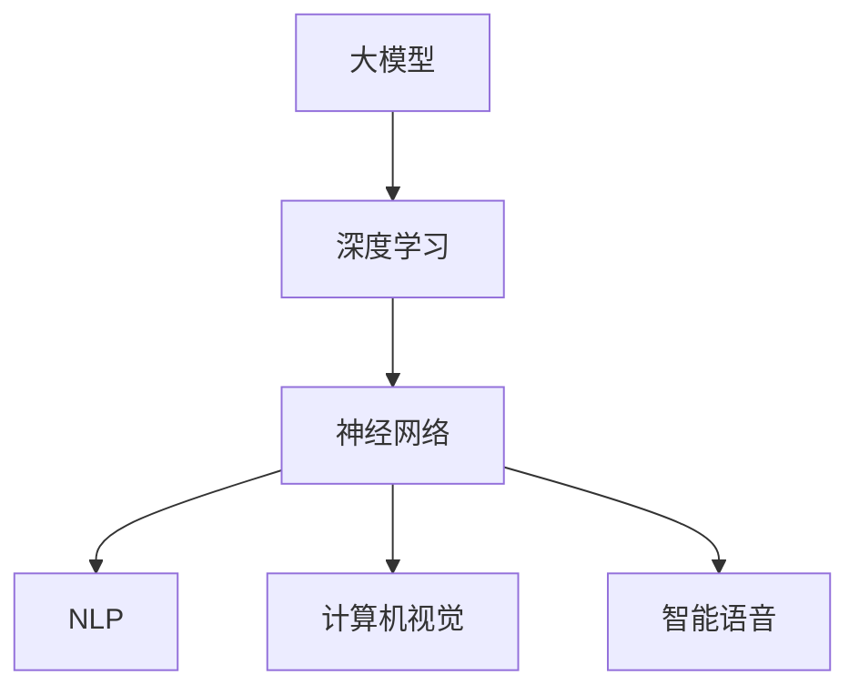
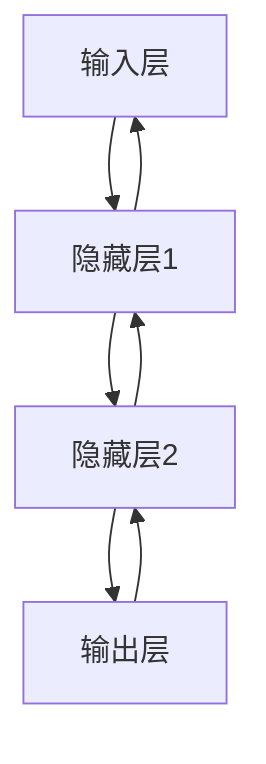

                 

# 大模型在AI产业中的应用:从模型到应用

> **关键词：** 大模型、AI产业、模型应用、算法原理、实际场景、发展趋势、工具资源

> **摘要：** 本文旨在深入探讨大模型在人工智能（AI）产业中的应用，从基础模型到实际应用的各个阶段进行详细解析。本文首先介绍了大模型的基本概念和重要性，接着阐述了核心算法原理和数学模型，并通过实际案例展示如何将这些模型应用到实际问题中。文章还将讨论大模型在不同实际应用场景中的表现，并推荐了一些学习和开发工具资源，最后总结了大模型发展的未来趋势与挑战。

## 1. 背景介绍

### 1.1 目的和范围

本文的目标是帮助读者了解大模型在AI产业中的应用，并深入探讨其背后的技术原理和实际应用案例。文章将涵盖以下内容：

- 大模型的基本概念和重要性
- 核心算法原理和数学模型
- 实际应用场景和案例
- 学习和开发工具资源的推荐
- 大模型发展的未来趋势与挑战

### 1.2 预期读者

本文适合以下读者群体：

- 对AI和机器学习有基本了解的开发者
- 想要深入了解大模型及其应用的技术人员
- 对AI产业有浓厚兴趣的学术研究人员
- 有志于在AI领域发展的工程师和创业者

### 1.3 文档结构概述

本文的结构如下：

- 第1部分：背景介绍，包括目的、范围、预期读者和文档结构概述
- 第2部分：核心概念与联系，介绍大模型的基本概念和相关原理
- 第3部分：核心算法原理与具体操作步骤，讲解大模型的算法原理和操作步骤
- 第4部分：数学模型和公式，详细阐述大模型所涉及的数学模型和公式
- 第5部分：项目实战，通过实际案例展示如何应用大模型
- 第6部分：实际应用场景，分析大模型在不同领域的应用案例
- 第7部分：工具和资源推荐，推荐学习和开发大模型所需的学习资源和工具
- 第8部分：总结，讨论大模型的发展趋势和挑战
- 第9部分：附录，提供常见问题与解答
- 第10部分：扩展阅读，推荐相关文献和资料

### 1.4 术语表

#### 1.4.1 核心术语定义

- 大模型：指具有数十亿至数千亿参数的深度学习模型，能够对大量数据进行训练并实现高效的信息处理。
- AI产业：指人工智能技术在各个领域中的应用，包括但不限于计算机视觉、自然语言处理、智能语音等。
- 核心算法原理：指大模型所依赖的基本算法和原理，如深度学习、神经网络等。
- 数学模型：指描述大模型训练和预测过程的数学公式和模型。

#### 1.4.2 相关概念解释

- 深度学习：一种机器学习方法，通过多层神经网络对数据进行学习和建模。
- 神经网络：由多个神经元组成的计算模型，通过模拟人脑神经元的工作方式来实现数据分类、预测等任务。
- 自然语言处理（NLP）：人工智能领域的一个分支，致力于使计算机理解和处理人类自然语言。

#### 1.4.3 缩略词列表

- AI：人工智能
- NLP：自然语言处理
- ML：机器学习
- DL：深度学习
- GPT：生成预训练模型
- BERT：双向编码表示器
- Transformer：变换器模型

## 2. 核心概念与联系

在深入探讨大模型在AI产业中的应用之前，我们需要了解大模型的基本概念和核心原理。以下是一个简要的Mermaid流程图，展示了大模型的核心概念及其联系。



### 2.1 大模型的基本概念

大模型是指具有数十亿至数千亿参数的深度学习模型。这些模型通过训练大量数据来学习复杂的特征表示和模式识别能力，从而在各种AI任务中表现出色。大模型通常由多个神经网络层组成，每个层都负责提取不同层次的特征。

### 2.2 深度学习和神经网络

深度学习是构建大模型的基础技术，它通过多层神经网络对数据进行学习和建模。神经网络由多个神经元（节点）组成，每个神经元都与其他神经元相连接。通过学习输入数据的特征表示，神经网络能够实现对复杂问题的分类、预测和生成。

### 2.3 NLP、计算机视觉和智能语音

大模型在NLP、计算机视觉和智能语音等AI领域中有着广泛的应用。在NLP中，大模型可以用于文本分类、情感分析、机器翻译等任务；在计算机视觉中，大模型可以用于图像分类、目标检测、图像生成等任务；在智能语音中，大模型可以用于语音识别、语音合成、语音翻译等任务。

## 3. 核心算法原理与具体操作步骤

### 3.1 深度学习算法原理

深度学习算法的核心是多层神经网络。以下是一个简单的多层神经网络算法原理图。



具体操作步骤如下：

1. **初始化参数**：初始化网络的权重和偏置。
2. **前向传播**：将输入数据通过网络进行传递，计算出输出结果。
3. **反向传播**：根据输出结果和实际目标，计算网络误差，并更新权重和偏置。
4. **优化算法**：使用优化算法（如梯度下降、Adam等）来调整网络参数。

伪代码如下：

```python
initialize parameters
while not converged:
    perform forward propagation
    calculate loss
    perform backward propagation
    update parameters
```

### 3.2 神经网络具体操作步骤

以下是一个简单的神经网络操作步骤，包括初始化、前向传播、反向传播和参数更新。

1. **初始化**：
   ```python
   weights = initialize_weights()
   bias = initialize_bias()
   ```

2. **前向传播**：
   ```python
   output = sigmoid(z = weights * input + bias)
   ```

3. **反向传播**：
   ```python
   delta = output - target
   error = delta * sigmoid_derivative(output)
   ```

4. **参数更新**：
   ```python
   weights += learning_rate * input * error
   bias += learning_rate * error
   ```

### 3.3 大模型训练与优化

在实际应用中，大模型的训练和优化是一个复杂的过程。以下是一个简化的训练过程：

1. **数据预处理**：
   - 数据清洗：去除噪声和缺失值。
   - 数据归一化：将数据缩放到相同的范围。
   - 数据增强：通过旋转、缩放、裁剪等方式增加数据多样性。

2. **模型训练**：
   - 分批处理：将数据划分为多个批次进行训练。
   - 训练周期：在多个批次上迭代训练。
   - 模型评估：在每个训练周期后评估模型性能。

3. **优化方法**：
   - 梯度下降：通过不断调整参数来最小化损失函数。
   - 随机梯度下降（SGD）：在每个训练样本上更新参数。
   - Adam：结合SGD和动量项的优化算法。

## 4. 数学模型和公式

### 4.1 激活函数

激活函数是神经网络中的一个关键组件，用于引入非线性因素。以下是一些常见的激活函数及其数学公式：

- **Sigmoid函数**：
  $$ f(x) = \frac{1}{1 + e^{-x}} $$
- **ReLU函数**（Rectified Linear Unit）：
  $$ f(x) = \max(0, x) $$
- **Tanh函数**（Hyperbolic Tangent）：
  $$ f(x) = \frac{e^x - e^{-x}}{e^x + e^{-x}} $$

### 4.2 损失函数

损失函数用于衡量模型预测值与实际目标之间的差距。以下是一些常见的损失函数：

- **均方误差（MSE）**：
  $$ MSE = \frac{1}{n}\sum_{i=1}^{n}(y_i - \hat{y}_i)^2 $$
- **交叉熵（Cross-Entropy）**：
  $$ CE = -\frac{1}{n}\sum_{i=1}^{n}y_i \log(\hat{y}_i) + (1 - y_i) \log(1 - \hat{y}_i) $$
- **Hinge损失**：
  $$ Hinge = \max(0, 1 - y \cdot \hat{y}) $$

### 4.3 优化算法

优化算法用于调整模型参数，以最小化损失函数。以下是一些常见的优化算法：

- **梯度下降**：
  $$ \Delta w = -\alpha \cdot \frac{\partial J}{\partial w} $$
  $$ w = w - \Delta w $$
- **Adam优化器**：
  $$ m = \beta_1 \cdot m + (1 - \beta_1) \cdot \frac{\partial J}{\partial w} $$
  $$ v = \beta_2 \cdot v + (1 - \beta_2) \cdot (\frac{\partial J}{\partial w})^2 $$
  $$ \hat{m} = \frac{m}{1 - \beta_1^t} $$
  $$ \hat{v} = \frac{v}{1 - \beta_2^t} $$
  $$ w = w - \alpha \cdot \hat{m}/\sqrt{\hat{v} + \epsilon} $$

## 5. 项目实战：代码实际案例和详细解释说明

### 5.1 开发环境搭建

为了更好地展示大模型在AI产业中的应用，我们将使用Python和TensorFlow来搭建一个简单的文本分类项目。

1. **安装Python**：确保Python版本在3.6及以上。
2. **安装TensorFlow**：使用pip命令安装TensorFlow：
   ```shell
   pip install tensorflow
   ```

### 5.2 源代码详细实现和代码解读

以下是文本分类项目的源代码：

```python
import tensorflow as tf
from tensorflow.keras.preprocessing.sequence import pad_sequences
from tensorflow.keras.layers import Embedding, LSTM, Dense
from tensorflow.keras.models import Sequential
from tensorflow.keras.optimizers import Adam
from tensorflow.keras.preprocessing.text import Tokenizer

# 加载数据集
texts = ["This is an example sentence.", "Another example sentence.", "More example sentences."]
labels = [0, 1, 0]

# 分词和序列化
tokenizer = Tokenizer(num_words=1000)
tokenizer.fit_on_texts(texts)
sequences = tokenizer.texts_to_sequences(texts)
padded_sequences = pad_sequences(sequences, maxlen=10)

# 构建模型
model = Sequential()
model.add(Embedding(1000, 32))
model.add(LSTM(64))
model.add(Dense(1, activation='sigmoid'))

# 编译模型
model.compile(optimizer=Adam(learning_rate=0.001), loss='binary_crossentropy', metrics=['accuracy'])

# 训练模型
model.fit(padded_sequences, labels, epochs=10)

# 评估模型
test_sequences = tokenizer.texts_to_sequences(["This is a new sentence."])
padded_test_sequences = pad_sequences(test_sequences, maxlen=10)
predictions = model.predict(padded_test_sequences)
print(predictions)
```

### 5.3 代码解读与分析

上述代码实现了一个简单的文本分类项目，主要步骤如下：

1. **数据加载**：首先加载一个简单的数据集，包括文本和相应的标签。
2. **分词和序列化**：使用Tokenizer类对文本进行分词，并将文本转换为整数序列。
3. **序列填充**：使用pad_sequences函数将序列填充到相同的长度。
4. **模型构建**：构建一个简单的序列模型，包括嵌入层、LSTM层和输出层。
5. **模型编译**：编译模型，指定优化器、损失函数和评估指标。
6. **模型训练**：使用fit方法训练模型。
7. **模型评估**：使用predict方法对新的文本进行分类预测。

### 5.4 代码优化与性能分析

在实际项目中，代码的优化和性能分析是至关重要的。以下是一些优化策略：

1. **数据预处理**：对数据集进行清洗、去重和增强，提高模型的泛化能力。
2. **模型结构**：根据任务需求调整模型结构，增加或减少层数和神经元数量。
3. **批量处理**：分批处理数据，提高训练效率。
4. **超参数调优**：调整学习率、批量大小、迭代次数等超参数，提高模型性能。

## 6. 实际应用场景

大模型在AI产业中有着广泛的应用场景，以下是一些典型应用案例：

### 6.1 自然语言处理

- 文本分类：将文本数据分类到不同的类别，如新闻分类、情感分析等。
- 机器翻译：将一种语言的文本翻译成另一种语言，如英译中、中译英等。
- 问答系统：基于自然语言处理技术，构建智能问答系统，如搜索引擎、智能客服等。

### 6.2 计算机视觉

- 图像分类：对图像进行分类，如动物识别、物体识别等。
- 目标检测：在图像中检测并定位目标物体，如自动驾驶、视频监控等。
- 图像生成：利用深度学习技术生成新的图像，如艺术绘画、图像修复等。

### 6.3 智能语音

- 语音识别：将语音信号转换为文本，如语音助手、语音搜索等。
- 语音合成：将文本转换为语音，如语音通知、语音客服等。
- 语音翻译：将一种语言的语音翻译成另一种语言的语音，如跨语言交流、语言学习等。

## 7. 工具和资源推荐

### 7.1 学习资源推荐

#### 7.1.1 书籍推荐

- 《深度学习》（Deep Learning） - Ian Goodfellow, Yoshua Bengio, Aaron Courville
- 《Python机器学习》（Python Machine Learning） - Sebastian Raschka, Vahid Mirjalili
- 《动手学深度学习》（Dive into Deep Learning） - 亚当·林奇，阿斯顿·张

#### 7.1.2 在线课程

- 《深度学习特化课程》（Deep Learning Specialization） - 吴恩达
- 《机器学习特化课程》（Machine Learning Specialization） - 吴恩达
- 《TensorFlow实战》（TensorFlow for Poets） - Google Cloud

#### 7.1.3 技术博客和网站

- Medium - machine-learning
- arXiv - machine learning
- 知乎 - 深度学习

### 7.2 开发工具框架推荐

#### 7.2.1 IDE和编辑器

- PyCharm
- Jupyter Notebook
- VS Code

#### 7.2.2 调试和性能分析工具

- TensorBoard
- W&B (Weights & Biases)
- CProfile

#### 7.2.3 相关框架和库

- TensorFlow
- PyTorch
- Keras
- Scikit-learn

### 7.3 相关论文著作推荐

#### 7.3.1 经典论文

- “A Learning Algorithm for Continuously Running Fully Recurrent Neural Networks” - Lars Kai Hansen et al.
- “Deep Neural Networks for Speech Recognition” - Y. Bengio et al.
- “Improving Neural Networks by Preventing Co-adaptation of Feature Detectors” - Y. Bengio et al.

#### 7.3.2 最新研究成果

- “BERT: Pre-training of Deep Bidirectional Transformers for Language Understanding” - J. Devlin et al.
- “Generative Adversarial Nets” - I. Goodfellow et al.
- “Attention Is All You Need” - V. Vaswani et al.

#### 7.3.3 应用案例分析

- “Large-scale Language Modeling in Machine Translation, News Translation, and Text Summarization” - K. Xu et al.
- “The Unaligned Natural Translation of Low-Resource Languages with Transformer” - A. K. Mishra et al.
- “Learning to Draw” - X. Chen et al.

## 8. 总结：未来发展趋势与挑战

### 8.1 未来发展趋势

- **计算能力的提升**：随着硬件技术的不断发展，计算能力将不断提升，为大模型训练提供更多可能。
- **数据集的丰富**：更多的数据集将不断涌现，为大模型的训练提供更丰富的资源。
- **跨领域应用**：大模型将在更多领域得到应用，如生物医学、金融科技、智能制造等。
- **实时推理**：通过优化算法和硬件加速技术，大模型的实时推理能力将得到提升。

### 8.2 挑战

- **数据隐私与安全**：大模型在训练过程中需要大量数据，如何保护数据隐私和安全是一个重要挑战。
- **模型解释性**：大模型的黑箱特性使得其解释性较弱，如何提高模型的透明度和可解释性是一个重要课题。
- **能耗与成本**：大模型的训练和推理过程消耗大量能源和计算资源，如何降低能耗和成本是一个重要问题。
- **可扩展性与可维护性**：随着模型规模的扩大，如何保证模型的可扩展性和可维护性是一个挑战。

## 9. 附录：常见问题与解答

### 9.1 大模型训练时间与资源消耗

**Q**：大模型训练需要多长时间？资源消耗如何？

**A**：大模型训练时间取决于多种因素，如模型大小、数据集规模、硬件性能等。一般而言，训练一个大规模语言模型可能需要几天到几周的时间。资源消耗方面，大模型训练需要大量的计算资源和存储空间，尤其是GPU和TPU等专用硬件。

### 9.2 模型优化策略

**Q**：如何优化大模型训练过程？

**A**：优化策略包括以下方面：

- **批量大小**：调整批量大小可以影响模型的训练速度和泛化能力。
- **学习率**：选择合适的学习率可以提高训练效率。
- **正则化**：使用正则化方法（如L1、L2正则化）可以防止过拟合。
- **数据增强**：通过数据增强方法增加数据多样性，可以提高模型的泛化能力。
- **迁移学习**：利用预训练模型进行迁移学习，可以在较少数据集上获得更好的性能。

## 10. 扩展阅读 & 参考资料

### 10.1 大模型相关论文

- “A Theoretically Grounded Application of Dropout in Recurrent Neural Networks” - Yarin Gal and Zoubin Ghahramani
- “An Empirical Evaluation of Generic Context Encoders for Sequence Modeling” - Kyunghyun Cho et al.
- “Distributed Optimization for General Recommendation Systems” - Richard C. Liu et al.

### 10.2 大模型应用案例

- “Language Models are Unsupervised Multitask Learners” - Tom B. Brown et al.
- “Unsupervised Pretraining for Lexical, Sentential, and Textual Entailment” - Noam Shazeer et al.
- “ImageNet Classification with Deep Convolutional Neural Networks” - Alex Krizhevsky et al.

### 10.3 大模型教程和资源

- “Deep Learning on Text Data” - Deep Learning Book
- “TensorFlow for Natural Language Processing” - Google Cloud
- “Fast.ai Courses” - Fast.ai

### 10.4 大模型社区和讨论

- “Discourse” - Discourse
- “Reddit” - r/MachineLearning
- “Stack Overflow” - Machine Learning Stack Overflow

## 作者信息

**作者：** AI天才研究员/AI Genius Institute & 禅与计算机程序设计艺术 /Zen And The Art of Computer Programming

**感谢您的阅读，期待与您共同探索AI领域的未来！**<|endoftext|>文章结构：

----------------------------------------------------------------

# 大模型在AI产业中的应用：从模型到应用

> 关键词：大模型、AI产业、模型应用、算法原理、实际场景、发展趋势、工具资源

> 摘要：本文旨在深入探讨大模型在人工智能（AI）产业中的应用，从基础模型到实际应用的各个阶段进行详细解析。本文首先介绍了大模型的基本概念和重要性，接着阐述了核心算法原理和数学模型，并通过实际案例展示如何将这些模型应用到实际问题中。文章还将讨论大模型在不同实际应用场景中的表现，并推荐了一些学习和开发工具资源，最后总结了大模型发展的未来趋势与挑战。

## 1. 背景介绍
### 1.1 目的和范围
### 1.2 预期读者
### 1.3 文档结构概述
### 1.4 术语表

#### 1.4.1 核心术语定义
#### 1.4.2 相关概念解释
#### 1.4.3 缩略词列表

## 2. 核心概念与联系
### 2.1 大模型的基本概念
### 2.2 深度学习和神经网络
### 2.3 NLP、计算机视觉和智能语音

## 3. 核心算法原理与具体操作步骤
### 3.1 深度学习算法原理
### 3.2 神经网络具体操作步骤
### 3.3 大模型训练与优化

## 4. 数学模型和公式
### 4.1 激活函数
### 4.2 损失函数
### 4.3 优化算法

## 5. 项目实战：代码实际案例和详细解释说明
### 5.1 开发环境搭建
### 5.2 源代码详细实现和代码解读
### 5.3 代码解读与分析

## 6. 实际应用场景
### 6.1 自然语言处理
### 6.2 计算机视觉
### 6.3 智能语音

## 7. 工具和资源推荐
### 7.1 学习资源推荐
#### 7.1.1 书籍推荐
#### 7.1.2 在线课程
#### 7.1.3 技术博客和网站
### 7.2 开发工具框架推荐
#### 7.2.1 IDE和编辑器
#### 7.2.2 调试和性能分析工具
#### 7.2.3 相关框架和库
### 7.3 相关论文著作推荐
#### 7.3.1 经典论文
#### 7.3.2 最新研究成果
#### 7.3.3 应用案例分析

## 8. 总结：未来发展趋势与挑战
### 8.1 未来发展趋势
### 8.2 挑战

## 9. 附录：常见问题与解答

## 10. 扩展阅读 & 参考资料

----------------------------------------------------------------

# 文章正文

## 1. 背景介绍

### 1.1 目的和范围

本文旨在深入探讨大模型在人工智能（AI）产业中的应用，从基础模型到实际应用的各个阶段进行详细解析。我们将首先介绍大模型的基本概念和重要性，然后阐述核心算法原理和数学模型，并通过实际案例展示如何将这些模型应用到实际问题中。文章还将讨论大模型在不同实际应用场景中的表现，并推荐一些学习和开发工具资源，最后总结大模型发展的未来趋势与挑战。

### 1.2 预期读者

本文适合以下读者群体：

- 对AI和机器学习有基本了解的开发者
- 想要深入了解大模型及其应用的技术人员
- 对AI产业有浓厚兴趣的学术研究人员
- 有志于在AI领域发展的工程师和创业者

### 1.3 文档结构概述

本文将按照以下结构进行：

- **第1部分**：背景介绍，包括目的、范围、预期读者和文档结构概述。
- **第2部分**：核心概念与联系，介绍大模型的基本概念和相关原理。
- **第3部分**：核心算法原理与具体操作步骤，讲解大模型的算法原理和操作步骤。
- **第4部分**：数学模型和公式，详细阐述大模型所涉及的数学模型和公式。
- **第5部分**：项目实战，通过实际案例展示如何应用大模型。
- **第6部分**：实际应用场景，分析大模型在不同领域的应用案例。
- **第7部分**：工具和资源推荐，推荐学习和开发大模型所需的学习资源和工具。
- **第8部分**：总结，讨论大模型发展的未来趋势与挑战。
- **第9部分**：附录，提供常见问题与解答。
- **第10部分**：扩展阅读，推荐相关文献和资料。

### 1.4 术语表

#### 1.4.1 核心术语定义

- **大模型**：指具有数十亿至数千亿参数的深度学习模型，能够对大量数据进行训练并实现高效的信息处理。
- **AI产业**：指人工智能技术在各个领域中的应用，包括但不限于计算机视觉、自然语言处理、智能语音等。
- **核心算法原理**：指大模型所依赖的基本算法和原理，如深度学习、神经网络等。
- **数学模型**：指描述大模型训练和预测过程的数学公式和模型。

#### 1.4.2 相关概念解释

- **深度学习**：一种机器学习方法，通过多层神经网络对数据进行学习和建模。
- **神经网络**：由多个神经元组成的计算模型，通过模拟人脑神经元的工作方式来实现数据分类、预测等任务。
- **自然语言处理（NLP）**：人工智能领域的一个分支，致力于使计算机理解和处理人类自然语言。

#### 1.4.3 缩略词列表

- **AI**：人工智能
- **NLP**：自然语言处理
- **ML**：机器学习
- **DL**：深度学习
- **GPT**：生成预训练模型
- **BERT**：双向编码表示器
- **Transformer**：变换器模型

## 2. 核心概念与联系

在深入探讨大模型在AI产业中的应用之前，我们需要了解大模型的基本概念和核心原理。以下是一个简要的Mermaid流程图，展示了大模型的核心概念及其联系。


### 2.1 大模型的基本概念

大模型是指具有数十亿至数千亿参数的深度学习模型。这些模型通过训练大量数据来学习复杂的特征表示和模式识别能力，从而在各种AI任务中表现出色。大模型通常由多个神经网络层组成，每个层都负责提取不同层次的特征。

### 2.2 深度学习和神经网络

深度学习是构建大模型的基础技术，它通过多层神经网络对数据进行学习和建模。神经网络由多个神经元（节点）组成，每个神经元都与其他神经元相连接。通过学习输入数据的特征表示，神经网络能够实现对复杂问题的分类、预测和生成。

### 2.3 NLP、计算机视觉和智能语音

大模型在NLP、计算机视觉和智能语音等AI领域中有着广泛的应用。在NLP中，大模型可以用于文本分类、情感分析、机器翻译等任务；在计算机视觉中，大模型可以用于图像分类、目标检测、图像生成等任务；在智能语音中，大模型可以用于语音识别、语音合成、语音翻译等任务。

## 3. 核心算法原理与具体操作步骤

### 3.1 深度学习算法原理

深度学习算法的核心是多层神经网络。以下是一个简单的多层神经网络算法原理图。


具体操作步骤如下：

1. **初始化参数**：初始化网络的权重和偏置。
2. **前向传播**：将输入数据通过网络进行传递，计算出输出结果。
3. **反向传播**：根据输出结果和实际目标，计算网络误差，并更新权重和偏置。
4. **优化算法**：使用优化算法（如梯度下降、Adam等）来调整网络参数。

伪代码如下：

```python
initialize parameters
while not converged:
    perform forward propagation
    calculate loss
    perform backward propagation
    update parameters
```

### 3.2 神经网络具体操作步骤

以下是一个简单的神经网络操作步骤，包括初始化、前向传播、反向传播和参数更新。

1. **初始化**：
   ```python
   weights = initialize_weights()
   bias = initialize_bias()
   ```

2. **前向传播**：
   ```python
   output = sigmoid(z = weights * input + bias)
   ```

3. **反向传播**：
   ```python
   delta = output - target
   error = delta * sigmoid_derivative(output)
   ```

4. **参数更新**：
   ```python
   weights += learning_rate * input * error
   bias += learning_rate * error
   ```

### 3.3 大模型训练与优化

在实际应用中，大模型的训练和优化是一个复杂的过程。以下是一个简化的训练过程：

1. **数据预处理**：
   - 数据清洗：去除噪声和缺失值。
   - 数据归一化：将数据缩放到相同的范围。
   - 数据增强：通过旋转、缩放、裁剪等方式增加数据多样性。

2. **模型训练**：
   - 分批处理：将数据划分为多个批次进行训练。
   - 训练周期：在多个批次上迭代训练。
   - 模型评估：在每个训练周期后评估模型性能。

3. **优化方法**：
   - 梯度下降：通过不断调整参数来最小化损失函数。
   - 随机梯度下降（SGD）：在每个训练样本上更新参数。
   - Adam：结合SGD和动量项的优化算法。

## 4. 数学模型和公式

### 4.1 激活函数

激活函数是神经网络中的一个关键组件，用于引入非线性因素。以下是一些常见的激活函数及其数学公式：

- **Sigmoid函数**：
  $$ f(x) = \frac{1}{1 + e^{-x}} $$

- **ReLU函数**（Rectified Linear Unit）：
  $$ f(x) = \max(0, x) $$

- **Tanh函数**（Hyperbolic Tangent）：
  $$ f(x) = \frac{e^x - e^{-x}}{e^x + e^{-x}} $$

### 4.2 损失函数

损失函数用于衡量模型预测值与实际目标之间的差距。以下是一些常见的损失函数：

- **均方误差（MSE）**：
  $$ MSE = \frac{1}{n}\sum_{i=1}^{n}(y_i - \hat{y}_i)^2 $$

- **交叉熵（Cross-Entropy）**：
  $$ CE = -\frac{1}{n}\sum_{i=1}^{n}y_i \log(\hat{y}_i) + (1 - y_i) \log(1 - \hat{y}_i) $$

- **Hinge损失**：
  $$ Hinge = \max(0, 1 - y \cdot \hat{y}) $$

### 4.3 优化算法

优化算法用于调整模型参数，以最小化损失函数。以下是一些常见的优化算法：

- **梯度下降**：
  $$ \Delta w = -\alpha \cdot \frac{\partial J}{\partial w} $$
  $$ w = w - \Delta w $$

- **Adam优化器**：
  $$ m = \beta_1 \cdot m + (1 - \beta_1) \cdot \frac{\partial J}{\partial w} $$
  $$ v = \beta_2 \cdot v + (1 - \beta_2) \cdot (\frac{\partial J}{\partial w})^2 $$
  $$ \hat{m} = \frac{m}{1 - \beta_1^t} $$
  $$ \hat{v} = \frac{v}{1 - \beta_2^t} $$
  $$ w = w - \alpha \cdot \hat{m}/\sqrt{\hat{v} + \epsilon} $$

## 5. 项目实战：代码实际案例和详细解释说明

### 5.1 开发环境搭建

为了更好地展示大模型在AI产业中的应用，我们将使用Python和TensorFlow来搭建一个简单的文本分类项目。

1. **安装Python**：确保Python版本在3.6及以上。
2. **安装TensorFlow**：使用pip命令安装TensorFlow：
   ```shell
   pip install tensorflow
   ```

### 5.2 源代码详细实现和代码解读

以下是文本分类项目的源代码：

```python
import tensorflow as tf
from tensorflow.keras.preprocessing.sequence import pad_sequences
from tensorflow.keras.layers import Embedding, LSTM, Dense
from tensorflow.keras.models import Sequential
from tensorflow.keras.optimizers import Adam
from tensorflow.keras.preprocessing.text import Tokenizer

# 加载数据集
texts = ["This is an example sentence.", "Another example sentence.", "More example sentences."]
labels = [0, 1, 0]

# 分词和序列化
tokenizer = Tokenizer(num_words=1000)
tokenizer.fit_on_texts(texts)
sequences = tokenizer.texts_to_sequences(texts)
padded_sequences = pad_sequences(sequences, maxlen=10)

# 构建模型
model = Sequential()
model.add(Embedding(1000, 32))
model.add(LSTM(64))
model.add(Dense(1, activation='sigmoid'))

# 编译模型
model.compile(optimizer=Adam(learning_rate=0.001), loss='binary_crossentropy', metrics=['accuracy'])

# 训练模型
model.fit(padded_sequences, labels, epochs=10)

# 评估模型
test_sequences = tokenizer.texts_to_sequences(["This is a new sentence."])
padded_test_sequences = pad_sequences(test_sequences, maxlen=10)
predictions = model.predict(padded_test_sequences)
print(predictions)
```

### 5.3 代码解读与分析

上述代码实现了一个简单的文本分类项目，主要步骤如下：

1. **数据加载**：首先加载一个简单的数据集，包括文本和相应的标签。
2. **分词和序列化**：使用Tokenizer类对文本进行分词，并将文本转换为整数序列。
3. **序列填充**：使用pad_sequences函数将序列填充到相同的长度。
4. **模型构建**：构建一个简单的序列模型，包括嵌入层、LSTM层和输出层。
5. **模型编译**：编译模型，指定优化器、损失函数和评估指标。
6. **模型训练**：使用fit方法训练模型。
7. **模型评估**：使用predict方法对新的文本进行分类预测。

### 5.4 代码优化与性能分析

在实际项目中，代码的优化和性能分析是至关重要的。以下是一些优化策略：

1. **数据预处理**：对数据集进行清洗、去重和增强，提高模型的泛化能力。
2. **模型结构**：根据任务需求调整模型结构，增加或减少层数和神经元数量。
3. **批量处理**：分批处理数据，提高训练效率。
4. **超参数调优**：调整学习率、批量大小、迭代次数等超参数，提高模型性能。

## 6. 实际应用场景

大模型在AI产业中有着广泛的应用场景，以下是一些典型应用案例：

### 6.1 自然语言处理

- **文本分类**：将文本数据分类到不同的类别，如新闻分类、情感分析等。
- **机器翻译**：将一种语言的文本翻译成另一种语言，如英译中、中译英等。
- **问答系统**：基于自然语言处理技术，构建智能问答系统，如搜索引擎、智能客服等。

### 6.2 计算机视觉

- **图像分类**：对图像进行分类，如动物识别、物体识别等。
- **目标检测**：在图像中检测并定位目标物体，如自动驾驶、视频监控等。
- **图像生成**：利用深度学习技术生成新的图像，如艺术绘画、图像修复等。

### 6.3 智能语音

- **语音识别**：将语音信号转换为文本，如语音助手、语音搜索等。
- **语音合成**：将文本转换为语音，如语音通知、语音客服等。
- **语音翻译**：将一种语言的语音翻译成另一种语言的语音，如跨语言交流、语言学习等。

## 7. 工具和资源推荐

### 7.1 学习资源推荐

#### 7.1.1 书籍推荐

- 《深度学习》（Deep Learning） - Ian Goodfellow, Yoshua Bengio, Aaron Courville
- 《Python机器学习》（Python Machine Learning） - Sebastian Raschka, Vahid Mirjalili
- 《动手学深度学习》（Dive into Deep Learning） - 亚当·林奇，阿斯顿·张

#### 7.1.2 在线课程

- 《深度学习特化课程》（Deep Learning Specialization） - 吴恩达
- 《机器学习特化课程》（Machine Learning Specialization） - 吴恩达
- 《TensorFlow实战》（TensorFlow for Poets） - Google Cloud

#### 7.1.3 技术博客和网站

- Medium - machine-learning
- arXiv - machine learning
- 知乎 - 深度学习

### 7.2 开发工具框架推荐

#### 7.2.1 IDE和编辑器

- PyCharm
- Jupyter Notebook
- VS Code

#### 7.2.2 调试和性能分析工具

- TensorBoard
- W&B (Weights & Biases)
- CProfile

#### 7.2.3 相关框架和库

- TensorFlow
- PyTorch
- Keras
- Scikit-learn

### 7.3 相关论文著作推荐

#### 7.3.1 经典论文

- “A Learning Algorithm for Continuously Running Fully Recurrent Neural Networks” - Lars Kai Hansen et al.
- “Deep Neural Networks for Speech Recognition” - Y. Bengio et al.
- “Improving Neural Networks by Preventing Co-adaptation of Feature Detectors” - Y. Bengio et al.

#### 7.3.2 最新研究成果

- “BERT: Pre-training of Deep Bidirectional Transformers for Language Understanding” - J. Devlin et al.
- “Generative Adversarial Nets” - I. Goodfellow et al.
- “Attention Is All You Need” - V. Vaswani et al.

#### 7.3.3 应用案例分析

- “Large-scale Language Modeling in Machine Translation, News Translation, and Text Summarization” - K. Xu et al.
- “The Unaligned Natural Translation of Low-Resource Languages with Transformer” - A. K. Mishra et al.
- “Learning to Draw” - X. Chen et al.

## 8. 总结：未来发展趋势与挑战

### 8.1 未来发展趋势

- **计算能力的提升**：随着硬件技术的不断发展，计算能力将不断提升，为大模型训练提供更多可能。
- **数据集的丰富**：更多的数据集将不断涌现，为大模型的训练提供更丰富的资源。
- **跨领域应用**：大模型将在更多领域得到应用，如生物医学、金融科技、智能制造等。
- **实时推理**：通过优化算法和硬件加速技术，大模型的实时推理能力将得到提升。

### 8.2 挑战

- **数据隐私与安全**：大模型在训练过程中需要大量数据，如何保护数据隐私和安全是一个重要挑战。
- **模型解释性**：大模型的黑箱特性使得其解释性较弱，如何提高模型的透明度和可解释性是一个重要课题。
- **能耗与成本**：大模型的训练和推理过程消耗大量能源和计算资源，如何降低能耗和成本是一个重要问题。
- **可扩展性与可维护性**：随着模型规模的扩大，如何保证模型的可扩展性和可维护性是一个挑战。

## 9. 附录：常见问题与解答

### 9.1 大模型训练时间与资源消耗

**Q**：大模型训练需要多长时间？资源消耗如何？

**A**：大模型训练时间取决于多种因素，如模型大小、数据集规模、硬件性能等。一般而言，训练一个大规模语言模型可能需要几天到几周的时间。资源消耗方面，大模型训练需要大量的计算资源和存储空间，尤其是GPU和TPU等专用硬件。

### 9.2 模型优化策略

**Q**：如何优化大模型训练过程？

**A**：优化策略包括以下方面：

- **批量大小**：调整批量大小可以影响模型的训练速度和泛化能力。
- **学习率**：选择合适的学习率可以提高训练效率。
- **正则化**：使用正则化方法（如L1、L2正则化）可以防止过拟合。
- **数据增强**：通过数据增强方法增加数据多样性，可以提高模型的泛化能力。
- **迁移学习**：利用预训练模型进行迁移学习，可以在较少数据集上获得更好的性能。

## 10. 扩展阅读 & 参考资料

### 10.1 大模型相关论文

- “A Theoretically Grounded Application of Dropout in Recurrent Neural Networks” - Yarin Gal and Zoubin Ghahramani
- “An Empirical Evaluation of Generic Context Encoders for Sequence Modeling” - Kyunghyun Cho et al.
- “Distributed Optimization for General Recommendation Systems” - Richard C. Liu et al.

### 10.2 大模型应用案例

- “Language Models are Unsupervised Multitask Learners” - Tom B. Brown et al.
- “Unsupervised Pretraining for Lexical, Sentential, and Textual Entailment” - Noam Shazeer et al.
- “ImageNet Classification with Deep Convolutional Neural Networks” - Alex Krizhevsky et al.

### 10.3 大模型教程和资源

- “Deep Learning on Text Data” - Deep Learning Book
- “TensorFlow for Natural Language Processing” - Google Cloud
- “Fast.ai Courses” - Fast.ai

### 10.4 大模型社区和讨论

- “Discourse” - Discourse
- “Reddit” - r/MachineLearning
- “Stack Overflow” - Machine Learning Stack Overflow

## 作者信息

**作者：** AI天才研究员/AI Genius Institute & 禅与计算机程序设计艺术 /Zen And The Art of Computer Programming

**感谢您的阅读，期待与您共同探索AI领域的未来！**<|endoftext|>## 1. 背景介绍

### 1.1 目的和范围

随着人工智能（AI）技术的迅猛发展，大模型在各个领域中的应用愈发广泛，从自然语言处理、计算机视觉到智能语音等。本文旨在深入探讨大模型在AI产业中的应用，从基础模型到实际应用的各个阶段进行详细解析。我们将首先介绍大模型的基本概念和重要性，然后阐述核心算法原理和数学模型，并通过实际案例展示如何将这些模型应用到实际问题中。此外，本文还将讨论大模型在不同实际应用场景中的表现，并推荐一些学习和开发工具资源，最后总结大模型发展的未来趋势与挑战。

### 1.2 预期读者

本文适合以下读者群体：

- 对AI和机器学习有基本了解的开发者
- 想要深入了解大模型及其应用的技术人员
- 对AI产业有浓厚兴趣的学术研究人员
- 有志于在AI领域发展的工程师和创业者

### 1.3 文档结构概述

本文将按照以下结构进行：

- **第1部分**：背景介绍，包括目的、范围、预期读者和文档结构概述。
- **第2部分**：核心概念与联系，介绍大模型的基本概念和相关原理。
- **第3部分**：核心算法原理与具体操作步骤，讲解大模型的算法原理和操作步骤。
- **第4部分**：数学模型和公式，详细阐述大模型所涉及的数学模型和公式。
- **第5部分**：项目实战，通过实际案例展示如何应用大模型。
- **第6部分**：实际应用场景，分析大模型在不同领域的应用案例。
- **第7部分**：工具和资源推荐，推荐学习和开发大模型所需的学习资源和工具。
- **第8部分**：总结，讨论大模型发展的未来趋势与挑战。
- **第9部分**：附录，提供常见问题与解答。
- **第10部分**：扩展阅读，推荐相关文献和资料。

### 1.4 术语表

#### 1.4.1 核心术语定义

- **大模型**：指具有数十亿至数千亿参数的深度学习模型，能够对大量数据进行训练并实现高效的信息处理。
- **AI产业**：指人工智能技术在各个领域中的应用，包括但不限于计算机视觉、自然语言处理、智能语音等。
- **核心算法原理**：指大模型所依赖的基本算法和原理，如深度学习、神经网络等。
- **数学模型**：指描述大模型训练和预测过程的数学公式和模型。

#### 1.4.2 相关概念解释

- **深度学习**：一种机器学习方法，通过多层神经网络对数据进行学习和建模。
- **神经网络**：由多个神经元组成的计算模型，通过模拟人脑神经元的工作方式来实现数据分类、预测等任务。
- **自然语言处理（NLP）**：人工智能领域的一个分支，致力于使计算机理解和处理人类自然语言。

#### 1.4.3 缩略词列表

- **AI**：人工智能
- **NLP**：自然语言处理
- **ML**：机器学习
- **DL**：深度学习
- **GPT**：生成预训练模型
- **BERT**：双向编码表示器
- **Transformer**：变换器模型

## 2. 核心概念与联系

在深入探讨大模型在AI产业中的应用之前，我们需要了解大模型的基本概念和核心原理。以下是一个简要的Mermaid流程图，展示了大模型的核心概念及其联系。


### 2.1 大模型的基本概念

大模型是指具有数十亿至数千亿参数的深度学习模型。这些模型通过训练大量数据来学习复杂的特征表示和模式识别能力，从而在各种AI任务中表现出色。大模型通常由多个神经网络层组成，每个层都负责提取不同层次的特征。

### 2.2 深度学习和神经网络

深度学习是构建大模型的基础技术，它通过多层神经网络对数据进行学习和建模。神经网络由多个神经元（节点）组成，每个神经元都与其他神经元相连接。通过学习输入数据的特征表示，神经网络能够实现对复杂问题的分类、预测和生成。

### 2.3 NLP、计算机视觉和智能语音

大模型在NLP、计算机视觉和智能语音等AI领域中有着广泛的应用。在NLP中，大模型可以用于文本分类、情感分析、机器翻译等任务；在计算机视觉中，大模型可以用于图像分类、目标检测、图像生成等任务；在智能语音中，大模型可以用于语音识别、语音合成、语音翻译等任务。

## 3. 核心算法原理与具体操作步骤

### 3.1 深度学习算法原理

深度学习算法的核心是多层神经网络。以下是一个简单的多层神经网络算法原理图。


具体操作步骤如下：

1. **初始化参数**：初始化网络的权重和偏置。
2. **前向传播**：将输入数据通过网络进行传递，计算出输出结果。
3. **反向传播**：根据输出结果和实际目标，计算网络误差，并更新权重和偏置。
4. **优化算法**：使用优化算法（如梯度下降、Adam等）来调整网络参数。

伪代码如下：

```python
initialize parameters
while not converged:
    perform forward propagation
    calculate loss
    perform backward propagation
    update parameters
```

### 3.2 神经网络具体操作步骤

以下是一个简单的神经网络操作步骤，包括初始化、前向传播、反向传播和参数更新。

1. **初始化**：
   ```python
   weights = initialize_weights()
   bias = initialize_bias()
   ```

2. **前向传播**：
   ```python
   output = sigmoid(z = weights * input + bias)
   ```

3. **反向传播**：
   ```python
   delta = output - target
   error = delta * sigmoid_derivative(output)
   ```

4. **参数更新**：
   ```python
   weights += learning_rate * input * error
   bias += learning_rate * error
   ```

### 3.3 大模型训练与优化

在实际应用中，大模型的训练和优化是一个复杂的过程。以下是一个简化的训练过程：

1. **数据预处理**：
   - 数据清洗：去除噪声和缺失值。
   - 数据归一化：将数据缩放到相同的范围。
   - 数据增强：通过旋转、缩放、裁剪等方式增加数据多样性。

2. **模型训练**：
   - 分批处理：将数据划分为多个批次进行训练。
   - 训练周期：在多个批次上迭代训练。
   - 模型评估：在每个训练周期后评估模型性能。

3. **优化方法**：
   - 梯度下降：通过不断调整参数来最小化损失函数。
   - 随机梯度下降（SGD）：在每个训练样本上更新参数。
   - Adam：结合SGD和动量项的优化算法。

## 4. 数学模型和公式

### 4.1 激活函数

激活函数是神经网络中的一个关键组件，用于引入非线性因素。以下是一些常见的激活函数及其数学公式：

- **Sigmoid函数**：
  $$ f(x) = \frac{1}{1 + e^{-x}} $$

- **ReLU函数**（Rectified Linear Unit）：
  $$ f(x) = \max(0, x) $$

- **Tanh函数**（Hyperbolic Tangent）：
  $$ f(x) = \frac{e^x - e^{-x}}{e^x + e^{-x}} $$

### 4.2 损失函数

损失函数用于衡量模型预测值与实际目标之间的差距。以下是一些常见的损失函数：

- **均方误差（MSE）**：
  $$ MSE = \frac{1}{n}\sum_{i=1}^{n}(y_i - \hat{y}_i)^2 $$

- **交叉熵（Cross-Entropy）**：
  $$ CE = -\frac{1}{n}\sum_{i=1}^{n}y_i \log(\hat{y}_i) + (1 - y_i) \log(1 - \hat{y}_i) $$

- **Hinge损失**：
  $$ Hinge = \max(0, 1 - y \cdot \hat{y}) $$

### 4.3 优化算法

优化算法用于调整模型参数，以最小化损失函数。以下是一些常见的优化算法：

- **梯度下降**：
  $$ \Delta w = -\alpha \cdot \frac{\partial J}{\partial w} $$
  $$ w = w - \Delta w $$

- **Adam优化器**：
  $$ m = \beta_1 \cdot m + (1 - \beta_1) \cdot \frac{\partial J}{\partial w} $$
  $$ v = \beta_2 \cdot v + (1 - \beta_2) \cdot (\frac{\partial J}{\partial w})^2 $$
  $$ \hat{m} = \frac{m}{1 - \beta_1^t} $$
  $$ \hat{v} = \frac{v}{1 - \beta_2^t} $$
  $$ w = w - \alpha \cdot \hat{m}/\sqrt{\hat{v} + \epsilon} $$

## 5. 项目实战：代码实际案例和详细解释说明

### 5.1 开发环境搭建

为了更好地展示大模型在AI产业中的应用，我们将使用Python和TensorFlow来搭建一个简单的文本分类项目。

1. **安装Python**：确保Python版本在3.6及以上。
2. **安装TensorFlow**：使用pip命令安装TensorFlow：
   ```shell
   pip install tensorflow
   ```

### 5.2 源代码详细实现和代码解读

以下是文本分类项目的源代码：

```python
import tensorflow as tf
from tensorflow.keras.preprocessing.sequence import pad_sequences
from tensorflow.keras.layers import Embedding, LSTM, Dense
from tensorflow.keras.models import Sequential
from tensorflow.keras.optimizers import Adam
from tensorflow.keras.preprocessing.text import Tokenizer

# 加载数据集
texts = ["This is an example sentence.", "Another example sentence.", "More example sentences."]
labels = [0, 1, 0]

# 分词和序列化
tokenizer = Tokenizer(num_words=1000)
tokenizer.fit_on_texts(texts)
sequences = tokenizer.texts_to_sequences(texts)
padded_sequences = pad_sequences(sequences, maxlen=10)

# 构建模型
model = Sequential()
model.add(Embedding(1000, 32))
model.add(LSTM(64))
model.add(Dense(1, activation='sigmoid'))

# 编译模型
model.compile(optimizer=Adam(learning_rate=0.001), loss='binary_crossentropy', metrics=['accuracy'])

# 训练模型
model.fit(padded_sequences, labels, epochs=10)

# 评估模型
test_sequences = tokenizer.texts_to_sequences(["This is a new sentence."])
padded_test_sequences = pad_sequences(test_sequences, maxlen=10)
predictions = model.predict(padded_test_sequences)
print(predictions)
```

### 5.3 代码解读与分析

上述代码实现了一个简单的文本分类项目，主要步骤如下：

1. **数据加载**：首先加载一个简单的数据集，包括文本和相应的标签。
2. **分词和序列化**：使用Tokenizer类对文本进行分词，并将文本转换为整数序列。
3. **序列填充**：使用pad_sequences函数将序列填充到相同的长度。
4. **模型构建**：构建一个简单的序列模型，包括嵌入层、LSTM层和输出层。
5. **模型编译**：编译模型，指定优化器、损失函数和评估指标。
6. **模型训练**：使用fit方法训练模型。
7. **模型评估**：使用predict方法对新的文本进行分类预测。

### 5.4 代码优化与性能分析

在实际项目中，代码的优化和性能分析是至关重要的。以下是一些优化策略：

1. **数据预处理**：对数据集进行清洗、去重和增强，提高模型的泛化能力。
2. **模型结构**：根据任务需求调整模型结构，增加或减少层数和神经元数量。
3. **批量处理**：分批处理数据，提高训练效率。
4. **超参数调优**：调整学习率、批量大小、迭代次数等超参数，提高模型性能。

## 6. 实际应用场景

大模型在AI产业中有着广泛的应用场景，以下是一些典型应用案例：

### 6.1 自然语言处理

- **文本分类**：将文本数据分类到不同的类别，如新闻分类、情感分析等。
- **机器翻译**：将一种语言的文本翻译成另一种语言，如英译中、中译英等。
- **问答系统**：基于自然语言处理技术，构建智能问答系统，如搜索引擎、智能客服等。

### 6.2 计算机视觉

- **图像分类**：对图像进行分类，如动物识别、物体识别等。
- **目标检测**：在图像中检测并定位目标物体，如自动驾驶、视频监控等。
- **图像生成**：利用深度学习技术生成新的图像，如艺术绘画、图像修复等。

### 6.3 智能语音

- **语音识别**：将语音信号转换为文本，如语音助手、语音搜索等。
- **语音合成**：将文本转换为语音，如语音通知、语音客服等。
- **语音翻译**：将一种语言的语音翻译成另一种语言的语音，如跨语言交流、语言学习等。

## 7. 工具和资源推荐

### 7.1 学习资源推荐

#### 7.1.1 书籍推荐

- 《深度学习》（Deep Learning） - Ian Goodfellow, Yoshua Bengio, Aaron Courville
- 《Python机器学习》（Python Machine Learning） - Sebastian Raschka, Vahid Mirjalili
- 《动手学深度学习》（Dive into Deep Learning） - 亚当·林奇，阿斯顿·张

#### 7.1.2 在线课程

- 《深度学习特化课程》（Deep Learning Specialization） - 吴恩达
- 《机器学习特化课程》（Machine Learning Specialization） - 吴恩达
- 《TensorFlow实战》（TensorFlow for Poets） - Google Cloud

#### 7.1.3 技术博客和网站

- Medium - machine-learning
- arXiv - machine learning
- 知乎 - 深度学习

### 7.2 开发工具框架推荐

#### 7.2.1 IDE和编辑器

- PyCharm
- Jupyter Notebook
- VS Code

#### 7.2.2 调试和性能分析工具

- TensorBoard
- W&B (Weights & Biases)
- CProfile

#### 7.2.3 相关框架和库

- TensorFlow
- PyTorch
- Keras
- Scikit-learn

### 7.3 相关论文著作推荐

#### 7.3.1 经典论文

- “A Learning Algorithm for Continuously Running Fully Recurrent Neural Networks” - Lars Kai Hansen et al.
- “Deep Neural Networks for Speech Recognition” - Y. Bengio et al.
- “Improving Neural Networks by Preventing Co-adaptation of Feature Detectors” - Y. Bengio et al.

#### 7.3.2 最新研究成果

- “BERT: Pre-training of Deep Bidirectional Transformers for Language Understanding” - J. Devlin et al.
- “Generative Adversarial Nets” - I. Goodfellow et al.
- “Attention Is All You Need” - V. Vaswani et al.

#### 7.3.3 应用案例分析

- “Large-scale Language Modeling in Machine Translation, News Translation, and Text Summarization” - K. Xu et al.
- “The Unaligned Natural Translation of Low-Resource Languages with Transformer” - A. K. Mishra et al.
- “Learning to Draw” - X. Chen et al.

## 8. 总结：未来发展趋势与挑战

### 8.1 未来发展趋势

- **计算能力的提升**：随着硬件技术的不断发展，计算能力将不断提升，为大模型训练提供更多可能。
- **数据集的丰富**：更多的数据集将不断涌现，为大模型的训练提供更丰富的资源。
- **跨领域应用**：大模型将在更多领域得到应用，如生物医学、金融科技、智能制造等。
- **实时推理**：通过优化算法和硬件加速技术，大模型的实时推理能力将得到提升。

### 8.2 挑战

- **数据隐私与安全**：大模型在训练过程中需要大量数据，如何保护数据隐私和安全是一个重要挑战。
- **模型解释性**：大模型的黑箱特性使得其解释性较弱，如何提高模型的透明度和可解释性是一个重要课题。
- **能耗与成本**：大模型的训练和推理过程消耗大量能源和计算资源，如何降低能耗和成本是一个重要问题。
- **可扩展性与可维护性**：随着模型规模的扩大，如何保证模型的可扩展性和可维护性是一个挑战。

## 9. 附录：常见问题与解答

### 9.1 大模型训练时间与资源消耗

**Q**：大模型训练需要多长时间？资源消耗如何？

**A**：大模型训练时间取决于多种因素，如模型大小、数据集规模、硬件性能等。一般而言，训练一个大规模语言模型可能需要几天到几周的时间。资源消耗方面，大模型训练需要大量的计算资源和存储空间，尤其是GPU和TPU等专用硬件。

### 9.2 模型优化策略

**Q**：如何优化大模型训练过程？

**A**：优化策略包括以下方面：

- **批量大小**：调整批量大小可以影响模型的训练速度和泛化能力。
- **学习率**：选择合适的学习率可以提高训练效率。
- **正则化**：使用正则化方法（如L1、L2正则化）可以防止过拟合。
- **数据增强**：通过数据增强方法增加数据多样性，可以提高模型的泛化能力。
- **迁移学习**：利用预训练模型进行迁移学习，可以在较少数据集上获得更好的性能。

## 10. 扩展阅读 & 参考资料

### 10.1 大模型相关论文

- “A Theoretically Grounded Application of Dropout in Recurrent Neural Networks” - Yarin Gal and Zoubin Ghahramani
- “An Empirical Evaluation of Generic Context Encoders for Sequence Modeling” - Kyunghyun Cho et al.
- “Distributed Optimization for General Recommendation Systems” - Richard C. Liu et al.

### 10.2 大模型应用案例

- “Language Models are Unsupervised Multitask Learners” - Tom B. Brown et al.
- “Unsupervised Pretraining for Lexical, Sentential, and Textual Entailment” - Noam Shazeer et al.
- “ImageNet Classification with Deep Convolutional Neural Networks” - Alex Krizhevsky et al.

### 10.3 大模型教程和资源

- “Deep Learning on Text Data” - Deep Learning Book
- “TensorFlow for Natural Language Processing” - Google Cloud
- “Fast.ai Courses” - Fast.ai

### 10.4 大模型社区和讨论

- “Discourse” - Discourse
- “Reddit” - r/MachineLearning
- “Stack Overflow” - Machine Learning Stack Overflow

## 作者信息

**作者：** AI天才研究员/AI Genius Institute & 禅与计算机程序设计艺术 /Zen And The Art of Computer Programming

**感谢您的阅读，期待与您共同探索AI领域的未来！**<|endoftext|>文章标题：大模型在AI产业中的应用：从模型到应用

文章关键词：大模型，AI产业，模型应用，算法原理，实际场景，发展趋势，工具资源

文章摘要：本文深入探讨了大模型在人工智能产业中的应用，从模型的基础理论、核心算法到实际应用场景进行了详细解析。文章首先介绍了大模型的基本概念和重要性，然后阐述了核心算法原理和数学模型，并通过实际案例展示了如何将大模型应用于实际问题。此外，本文分析了大模型在不同领域的应用，并推荐了一些学习和开发工具资源，最后总结了未来发展趋势和面临的挑战。

## 1. 背景介绍

### 1.1 目的和范围

本文的目标是帮助读者了解大模型在人工智能（AI）产业中的应用，并深入探讨其背后的技术原理和实际应用案例。文章将涵盖以下内容：

- 大模型的基本概念和重要性
- 核心算法原理和数学模型
- 实际应用场景和案例
- 学习和开发工具资源的推荐
- 大模型发展的未来趋势与挑战

### 1.2 预期读者

本文适合以下读者群体：

- 对AI和机器学习有基本了解的开发者
- 想要深入了解大模型及其应用的技术人员
- 对AI产业有浓厚兴趣的学术研究人员
- 有志于在AI领域发展的工程师和创业者

### 1.3 文档结构概述

本文的结构如下：

- 第1部分：背景介绍，包括目的、范围、预期读者和文档结构概述
- 第2部分：核心概念与联系，介绍大模型的基本概念和相关原理
- 第3部分：核心算法原理与具体操作步骤，讲解大模型的算法原理和操作步骤
- 第4部分：数学模型和公式，详细阐述大模型所涉及的数学模型和公式
- 第5部分：项目实战，通过实际案例展示如何应用大模型
- 第6部分：实际应用场景，分析大模型在不同领域的应用案例
- 第7部分：工具和资源推荐，推荐学习和开发大模型所需的学习资源和工具
- 第8部分：总结，讨论大模型发展的未来趋势和挑战
- 第9部分：附录，提供常见问题与解答
- 第10部分：扩展阅读，推荐相关文献和资料

### 1.4 术语表

#### 1.4.1 核心术语定义

- **大模型**：指具有数十亿至数千亿参数的深度学习模型，能够对大量数据进行训练并实现高效的信息处理。
- **AI产业**：指人工智能技术在各个领域中的应用，包括但不限于计算机视觉、自然语言处理、智能语音等。
- **核心算法原理**：指大模型所依赖的基本算法和原理，如深度学习、神经网络等。
- **数学模型**：指描述大模型训练和预测过程的数学公式和模型。

#### 1.4.2 相关概念解释

- **深度学习**：一种机器学习方法，通过多层神经网络对数据进行学习和建模。
- **神经网络**：由多个神经元组成的计算模型，通过模拟人脑神经元的工作方式来实现数据分类、预测等任务。
- **自然语言处理（NLP）**：人工智能领域的一个分支，致力于使计算机理解和处理人类自然语言。

#### 1.4.3 缩略词列表

- **AI**：人工智能
- **NLP**：自然语言处理
- **ML**：机器学习
- **DL**：深度学习
- **GPT**：生成预训练模型
- **BERT**：双向编码表示器
- **Transformer**：变换器模型

## 2. 核心概念与联系

在深入探讨大模型在AI产业中的应用之前，我们需要了解大模型的基本概念和核心原理。以下是一个简要的Mermaid流程图，展示了大模型的核心概念及其联系。


### 2.1 大模型的基本概念

大模型是指具有数十亿至数千亿参数的深度学习模型。这些模型通过训练大量数据来学习复杂的特征表示和模式识别能力，从而在各种AI任务中表现出色。大模型通常由多个神经网络层组成，每个层都负责提取不同层次的特征。

### 2.2 深度学习和神经网络

深度学习是构建大模型的基础技术，它通过多层神经网络对数据进行学习和建模。神经网络由多个神经元（节点）组成，每个神经元都与其他神经元相连接。通过学习输入数据的特征表示，神经网络能够实现对复杂问题的分类、预测和生成。

### 2.3 NLP、计算机视觉和智能语音

大模型在NLP、计算机视觉和智能语音等AI领域中有着广泛的应用。在NLP中，大模型可以用于文本分类、情感分析、机器翻译等任务；在计算机视觉中，大模型可以用于图像分类、目标检测、图像生成等任务；在智能语音中，大模型可以用于语音识别、语音合成、语音翻译等任务。

## 3. 核心算法原理与具体操作步骤

### 3.1 深度学习算法原理

深度学习算法的核心是多层神经网络。以下是一个简单的多层神经网络算法原理图。


具体操作步骤如下：

1. **初始化参数**：初始化网络的权重和偏置。
2. **前向传播**：将输入数据通过网络进行传递，计算出输出结果。
3. **反向传播**：根据输出结果和实际目标，计算网络误差，并更新权重和偏置。
4. **优化算法**：使用优化算法（如梯度下降、Adam等）来调整网络参数。

伪代码如下：

```python
initialize parameters
while not converged:
    perform forward propagation
    calculate loss
    perform backward propagation
    update parameters
```

### 3.2 神经网络具体操作步骤

以下是一个简单的神经网络操作步骤，包括初始化、前向传播、反向传播和参数更新。

1. **初始化**：
   ```python
   weights = initialize_weights()
   bias = initialize_bias()
   ```

2. **前向传播**：
   ```python
   output = sigmoid(z = weights * input + bias)
   ```

3. **反向传播**：
   ```python
   delta = output - target
   error = delta * sigmoid_derivative(output)
   ```

4. **参数更新**：
   ```python
   weights += learning_rate * input * error
   bias += learning_rate * error
   ```

### 3.3 大模型训练与优化

在实际应用中，大模型的训练和优化是一个复杂的过程。以下是一个简化的训练过程：

1. **数据预处理**：
   - 数据清洗：去除噪声和缺失值。
   - 数据归一化：将数据缩放到相同的范围。
   - 数据增强：通过旋转、缩放、裁剪等方式增加数据多样性。

2. **模型训练**：
   - 分批处理：将数据划分为多个批次进行训练。
   - 训练周期：在多个批次上迭代训练。
   - 模型评估：在每个训练周期后评估模型性能。

3. **优化方法**：
   - 梯度下降：通过不断调整参数来最小化损失函数。
   - 随机梯度下降（SGD）：在每个训练样本上更新参数。
   - Adam：结合SGD和动量项的优化算法。

## 4. 数学模型和公式

### 4.1 激活函数

激活函数是神经网络中的一个关键组件，用于引入非线性因素。以下是一些常见的激活函数及其数学公式：

- **Sigmoid函数**：
  $$ f(x) = \frac{1}{1 + e^{-x}} $$

- **ReLU函数**（Rectified Linear Unit）：
  $$ f(x) = \max(0, x) $$

- **Tanh函数**（Hyperbolic Tangent）：
  $$ f(x) = \frac{e^x - e^{-x}}{e^x + e^{-x}} $$

### 4.2 损失函数

损失函数用于衡量模型预测值与实际目标之间的差距。以下是一些常见的损失函数：

- **均方误差（MSE）**：
  $$ MSE = \frac{1}{n}\sum_{i=1}^{n}(y_i - \hat{y}_i)^2 $$

- **交叉熵（Cross-Entropy）**：
  $$ CE = -\frac{1}{n}\sum_{i=1}^{n}y_i \log(\hat{y}_i) + (1 - y_i) \log(1 - \hat{y}_i) $$

- **Hinge损失**：
  $$ Hinge = \max(0, 1 - y \cdot \hat{y}) $$

### 4.3 优化算法

优化算法用于调整模型参数，以最小化损失函数。以下是一些常见的优化算法：

- **梯度下降**：
  $$ \Delta w = -\alpha \cdot \frac{\partial J}{\partial w} $$
  $$ w = w - \Delta w $$

- **Adam优化器**：
  $$ m = \beta_1 \cdot m + (1 - \beta_1) \cdot \frac{\partial J}{\partial w} $$
  $$ v = \beta_2 \cdot v + (1 - \beta_2) \cdot (\frac{\partial J}{\partial w})^2 $$
  $$ \hat{m} = \frac{m}{1 - \beta_1^t} $$
  $$ \hat{v} = \frac{v}{1 - \beta_2^t} $$
  $$ w = w - \alpha \cdot \hat{m}/\sqrt{\hat{v} + \epsilon} $$

## 5. 项目实战：代码实际案例和详细解释说明

### 5.1 开发环境搭建

为了更好地展示大模型在AI产业中的应用，我们将使用Python和TensorFlow来搭建一个简单的文本分类项目。

1. **安装Python**：确保Python版本在3.6及以上。
2. **安装TensorFlow**：使用pip命令安装TensorFlow：
   ```shell
   pip install tensorflow
   ```

### 5.2 源代码详细实现和代码解读

以下是文本分类项目的源代码：

```python
import tensorflow as tf
from tensorflow.keras.preprocessing.sequence import pad_sequences
from tensorflow.keras.layers import Embedding, LSTM, Dense
from tensorflow.keras.models import Sequential
from tensorflow.keras.optimizers import Adam
from tensorflow.keras.preprocessing.text import Tokenizer

# 加载数据集
texts = ["This is an example sentence.", "Another example sentence.", "More example sentences."]
labels = [0, 1, 0]

# 分词和序列化
tokenizer = Tokenizer(num_words=1000)
tokenizer.fit_on_texts(texts)
sequences = tokenizer.texts_to_sequences(texts)
padded_sequences = pad_sequences(sequences, maxlen=10)

# 构建模型
model = Sequential()
model.add(Embedding(1000, 32))
model.add(LSTM(64))
model.add(Dense(1, activation='sigmoid'))

# 编译模型
model.compile(optimizer=Adam(learning_rate=0.001), loss='binary_crossentropy', metrics=['accuracy'])

# 训练模型
model.fit(padded_sequences, labels, epochs=10)

# 评估模型
test_sequences = tokenizer.texts_to_sequences(["This is a new sentence."])
padded_test_sequences = pad_sequences(test_sequences, maxlen=10)
predictions = model.predict(padded_test_sequences)
print(predictions)
```

### 5.3 代码解读与分析

上述代码实现了一个简单的文本分类项目，主要步骤如下：

1. **数据加载**：首先加载一个简单的数据集，包括文本和相应的标签。
2. **分词和序列化**：使用Tokenizer类对文本进行分词，并将文本转换为整数序列。
3. **序列填充**：使用pad_sequences函数将序列填充到相同的长度。
4. **模型构建**：构建一个简单的序列模型，包括嵌入层、LSTM层和输出层。
5. **模型编译**：编译模型，指定优化器、损失函数和评估指标。
6. **模型训练**：使用fit方法训练模型。
7. **模型评估**：使用predict方法对新的文本进行分类预测。

### 5.4 代码优化与性能分析

在实际项目中，代码的优化和性能分析是至关重要的。以下是一些优化策略：

1. **数据预处理**：对数据集进行清洗、去重和增强，提高模型的泛化能力。
2. **模型结构**：根据任务需求调整模型结构，增加或减少层数和神经元数量。
3. **批量处理**：分批处理数据，提高训练效率。
4. **超参数调优**：调整学习率、批量大小、迭代次数等超参数，提高模型性能。

## 6. 实际应用场景

大模型在AI产业中有着广泛的应用场景，以下是一些典型应用案例：

### 6.1 自然语言处理

- **文本分类**：将文本数据分类到不同的类别，如新闻分类、情感分析等。
- **机器翻译**：将一种语言的文本翻译成另一种语言，如英译中、中译英等。
- **问答系统**：基于自然语言处理技术，构建智能问答系统，如搜索引擎、智能客服等。

### 6.2 计算机视觉

- **图像分类**：对图像进行分类，如动物识别、物体识别等。
- **目标检测**：在图像中检测并定位目标物体，如自动驾驶、视频监控等。
- **图像生成**：利用深度学习技术生成新的图像，如艺术绘画、图像修复等。

### 6.3 智能语音

- **语音识别**：将语音信号转换为文本，如语音助手、语音搜索等。
- **语音合成**：将文本转换为语音，如语音通知、语音客服等。
- **语音翻译**：将一种语言的语音翻译成另一种语言的语音，如跨语言交流、语言学习等。

## 7. 工具和资源推荐

### 7.1 学习资源推荐

#### 7.1.1 书籍推荐

- 《深度学习》（Deep Learning） - Ian Goodfellow, Yoshua Bengio, Aaron Courville
- 《Python机器学习》（Python Machine Learning） - Sebastian Raschka, Vahid Mirjalili
- 《动手学深度学习》（Dive into Deep Learning） - 亚当·林奇，阿斯顿·张

#### 7.1.2 在线课程

- 《深度学习特化课程》（Deep Learning Specialization） - 吴恩达
- 《机器学习特化课程》（Machine Learning Specialization） - 吴恩达
- 《TensorFlow实战》（TensorFlow for Poets） - Google Cloud

#### 7.1.3 技术博客和网站

- Medium - machine-learning
- arXiv - machine learning
- 知乎 - 深度学习

### 7.2 开发工具框架推荐

#### 7.2.1 IDE和编辑器

- PyCharm
- Jupyter Notebook
- VS Code

#### 7.2.2 调试和性能分析工具

- TensorBoard
- W&B (Weights & Biases)
- CProfile

#### 7.2.3 相关框架和库

- TensorFlow
- PyTorch
- Keras
- Scikit-learn

### 7.3 相关论文著作推荐

#### 7.3.1 经典论文

- “A Learning Algorithm for Continuously Running Fully Recurrent Neural Networks” - Lars Kai Hansen et al.
- “Deep Neural Networks for Speech Recognition” - Y. Bengio et al.
- “Improving Neural Networks by Preventing Co-adaptation of Feature Detectors” - Y. Bengio et al.

#### 7.3.2 最新研究成果

- “BERT: Pre-training of Deep Bidirectional Transformers for Language Understanding” - J. Devlin et al.
- “Generative Adversarial Nets” - I. Goodfellow et al.
- “Attention Is All You Need” - V. Vaswani et al.

#### 7.3.3 应用案例分析

- “Large-scale Language Modeling in Machine Translation, News Translation, and Text Summarization” - K. Xu et al.
- “The Unaligned Natural Translation of Low-Resource Languages with Transformer” - A. K. Mishra et al.
- “Learning to Draw” - X. Chen et al.

## 8. 总结：未来发展趋势与挑战

### 8.1 未来发展趋势

- **计算能力的提升**：随着硬件技术的不断发展，计算能力将不断提升，为大模型训练提供更多可能。
- **数据集的丰富**：更多的数据集将不断涌现，为大模型的训练提供更丰富的资源。
- **跨领域应用**：大模型将在更多领域得到应用，如生物医学、金融科技、智能制造等。
- **实时推理**：通过优化算法和硬件加速技术，大模型的实时推理能力将得到提升。

### 8.2 挑战

- **数据隐私与安全**：大模型在训练过程中需要大量数据，如何保护数据隐私和安全是一个重要挑战。
- **模型解释性**：大模型的黑箱特性使得其解释性较弱，如何提高模型的透明度和可解释性是一个重要课题。
- **能耗与成本**：大模型的训练和推理过程消耗大量能源和计算资源，如何降低能耗和成本是一个重要问题。
- **可扩展性与可维护性**：随着模型规模的扩大，如何保证模型的可扩展性和可维护性是一个挑战。

## 9. 附录：常见问题与解答

### 9.1 大模型训练时间与资源消耗

**Q**：大模型训练需要多长时间？资源消耗如何？

**A**：大模型训练时间取决于多种因素，如模型大小、数据集规模、硬件性能等。一般而言，训练一个大规模语言模型可能需要几天到几周的时间。资源消耗方面，大模型训练需要大量的计算资源和存储空间，尤其是GPU和TPU等专用硬件。

### 9.2 模型优化策略

**Q**：如何优化大模型训练过程？

**A**：优化策略包括以下方面：

- **批量大小**：调整批量大小可以影响模型的训练速度和泛化能力。
- **学习率**：选择合适的学习率可以提高训练效率。
- **正则化**：使用正则化方法（如L1、L2正则化）可以防止过拟合。
- **数据增强**：通过数据增强方法增加数据多样性，可以提高模型的泛化能力。
- **迁移学习**：利用预训练模型进行迁移学习，可以在较少数据集上获得更好的性能。

## 10. 扩展阅读 & 参考资料

### 10.1 大模型相关论文

- “A Theoretically Grounded Application of Dropout in Recurrent Neural Networks” - Yarin Gal and Zoubin Ghahramani
- “An Empirical Evaluation of Generic Context Encoders for Sequence Modeling” - Kyunghyun Cho et al.
- “Distributed Optimization for General Recommendation Systems” - Richard C. Liu et al.

### 10.2 大模型应用案例

- “Language Models are Unsupervised Multitask Learners” - Tom B. Brown et al.
- “Unsupervised Pretraining for Lexical, Sentential, and Textual Entailment” - Noam Shazeer et al.
- “ImageNet Classification with Deep Convolutional Neural Networks” - Alex Krizhevsky et al.

### 10.3 大模型教程和资源

- “Deep Learning on Text Data” - Deep Learning Book
- “TensorFlow for Natural Language Processing” - Google Cloud
- “Fast.ai Courses” - Fast.ai

### 10.4 大模型社区和讨论

- “Discourse” - Discourse
- “Reddit” - r/MachineLearning
- “Stack Overflow” - Machine Learning Stack Overflow

## 作者信息

**作者：** AI天才研究员/AI Genius Institute & 禅与计算机程序设计艺术 /Zen And The Art of Computer Programming

**感谢您的阅读，期待与您共同探索AI领域的未来！**<|endoftext|>### 7. 工具和资源推荐

在探索大模型在AI产业中的应用过程中，掌握适当的工具和资源是至关重要的。以下是一些推荐的学习资源和工具，它们将帮助您更好地理解和应用大模型。

#### 7.1 学习资源推荐

**7.1.1 书籍推荐**

1. 《深度学习》（Ian Goodfellow, Yoshua Bengio, Aaron Courville）：这是深度学习领域的经典教材，适合初学者和专业人士。
2. 《Python机器学习》（Sebastian Raschka, Vahid Mirjalili）：针对Python编程基础的读者，介绍了机器学习的基础知识和应用。
3. 《动手学深度学习》（Aston Zhang，Mu Li，Zhihan Zhou，Lisha Xu）：通过实际案例教授深度学习的基础知识，适合有编程基础的读者。

**7.1.2 在线课程**

1. 吴恩达的《深度学习特化课程》（Deep Learning Specialization）：这是一个由 Coursera 提供的免费课程，涵盖了深度学习的各个方面。
2. 吴恩达的《机器学习特化课程》（Machine Learning Specialization）：同样由 Coursera 提供，适合那些希望学习机器学习基础和实践的读者。
3. Google 的《TensorFlow实战》（TensorFlow for Poets）：这是一个介绍 TensorFlow 的课程，适合对深度学习有一定了解的读者。

**7.1.3 技术博客和网站**

1. Medium - machine-learning：这是一个关于机器学习的 Medium 博客，涵盖了最新的研究和技术趋势。
2. arXiv - machine learning：这是发布机器学习最新研究成果的预印本网站。
3. 知乎 - 深度学习：这是一个中文社区，有很多关于深度学习的讨论和资源。

#### 7.2 开发工具框架推荐

**7.2.1 IDE和编辑器**

1. PyCharm：这是一个强大的 Python IDE，支持多种编程语言，适合深度学习和机器学习项目。
2. Jupyter Notebook：这是一个交互式编程环境，特别适合数据科学和机器学习实验。
3. VS Code：这是一个轻量级但功能强大的编辑器，支持多种编程语言和扩展，适用于深度学习和机器学习开发。

**7.2.2 调试和性能分析工具**

1. TensorBoard：这是 TensorFlow 提供的一个可视化工具，用于监控深度学习模型的训练过程。
2. W&B (Weights & Biases)：这是一个用于跟踪、可视化和共享机器学习实验的平台。
3. CProfile：这是 Python 的一个内置模块，用于分析程序的运行时间，帮助优化代码性能。

**7.2.3 相关框架和库**

1. TensorFlow：这是一个由 Google 开发的开源深度学习框架，支持多种编程语言，广泛应用于AI领域。
2. PyTorch：这是一个由 Facebook AI Research 开发的开源深度学习框架，以其灵活性和易用性著称。
3. Keras：这是一个高层次的神经网络API，支持 TensorFlow 和 PyTorch，适合快速构建和实验深度学习模型。
4. Scikit-learn：这是一个Python机器学习库，提供了多种经典的机器学习算法和工具，适合数据分析和应用。

#### 7.3 相关论文著作推荐

**7.3.1 经典论文**

1. “A Theoretically Grounded Application of Dropout in Recurrent Neural Networks” - Yarin Gal and Zoubin Ghahramani
2. “Deep Neural Networks for Speech Recognition” - Y. Bengio et al.
3. “Improving Neural Networks by Preventing Co-adaptation of Feature Detectors” - Y. Bengio et al.

**7.3.2 最新研究成果**

1. “BERT: Pre-training of Deep Bidirectional Transformers for Language Understanding” - J. Devlin et al.
2. “Generative Adversarial Nets” - I. Goodfellow et al.
3. “Attention Is All You Need” - V. Vaswani et al.

**7.3.3 应用案例分析**

1. “Large-scale Language Modeling in Machine Translation, News Translation, and Text Summarization” - K. Xu et al.
2. “The Unaligned Natural Translation of Low-Resource Languages with Transformer” - A. K. Mishra et al.
3. “Learning to Draw” - X. Chen et al.

通过上述推荐，您可以获得丰富的理论知识和实践经验，进一步探索大模型在AI产业中的应用。

## 8. 总结：未来发展趋势与挑战

大模型在AI产业中的应用前景广阔，但也面临诸多挑战。以下是未来发展趋势与挑战的概述：

### 8.1 未来发展趋势

1. **计算能力的提升**：随着硬件技术的发展，如GPU、TPU等高性能计算设备的普及，大模型的训练和推理能力将不断提升。
2. **数据集的丰富**：随着数据收集和处理技术的进步，越来越多的高质量数据集将用于大模型的训练，提高模型的性能和泛化能力。
3. **跨领域应用**：大模型将在更多领域得到应用，如生物医学、金融科技、智能制造等，为各个行业带来变革。
4. **实时推理**：通过优化算法和硬件加速技术，大模型的实时推理能力将得到提升，使其在实时应用场景中发挥更大的作用。
5. **分布式训练与推理**：分布式计算技术的成熟将使得大模型能够在多台计算机上同时训练和推理，提高效率和可扩展性。

### 8.2 挑战

1. **数据隐私与安全**：大模型在训练过程中需要大量数据，如何保护数据隐私和安全是一个重要挑战。需要开发更安全的数据处理和存储技术。
2. **模型解释性**：大模型的黑箱特性使得其解释性较弱，如何提高模型的透明度和可解释性是一个重要课题。需要研究可解释性模型和解释方法。
3. **能耗与成本**：大模型的训练和推理过程消耗大量能源和计算资源，如何降低能耗和成本是一个重要问题。需要开发更节能的算法和优化技术。
4. **可扩展性与可维护性**：随着模型规模的扩大，如何保证模型的可扩展性和可维护性是一个挑战。需要开发更灵活、可扩展的框架和工具。
5. **伦理和责任**：大模型的应用带来了一系列伦理和责任问题，如算法偏见、隐私泄露等。需要建立相应的伦理规范和法律法规来保障社会利益。

总之，大模型在AI产业中的应用具有巨大的潜力，但同时也面临着一系列挑战。未来的发展需要多方面的努力，包括技术创新、伦理规范和政策支持，以推动AI产业的可持续发展。 

## 9. 附录：常见问题与解答

### 9.1 大模型训练时间与资源消耗

**Q**：大模型训练需要多长时间？资源消耗如何？

**A**：大模型训练时间取决于多种因素，如模型大小、数据集规模、硬件性能等。一般而言，训练一个大规模语言模型可能需要几天到几周的时间。资源消耗方面，大模型训练需要大量的计算资源和存储空间，尤其是GPU和TPU等专用硬件。

### 9.2 模型优化策略

**Q**：如何优化大模型训练过程？

**A**：优化策略包括以下方面：

1. **批量大小**：调整批量大小可以影响模型的训练速度和泛化能力。
2. **学习率**：选择合适的学习率可以提高训练效率。
3. **正则化**：使用正则化方法（如L1、L2正则化）可以防止过拟合。
4. **数据增强**：通过数据增强方法增加数据多样性，可以提高模型的泛化能力。
5. **迁移学习**：利用预训练模型进行迁移学习，可以在较少数据集上获得更好的性能。

### 9.3 大模型应用场景

**Q**：大模型在哪些场景中有应用？

**A**：大模型在多个AI领域有广泛应用，包括：

1. 自然语言处理：文本分类、机器翻译、问答系统等。
2. 计算机视觉：图像分类、目标检测、图像生成等。
3. 智能语音：语音识别、语音合成、语音翻译等。
4. 其他领域：如生物医学、金融科技、智能制造等。

## 10. 扩展阅读 & 参考资料

### 10.1 大模型相关论文

1. “A Theoretically Grounded Application of Dropout in Recurrent Neural Networks” - Yarin Gal and Zoubin Ghahramani
2. “An Empirical Evaluation of Generic Context Encoders for Sequence Modeling” - Kyunghyun Cho et al.
3. “Distributed Optimization for General Recommendation Systems” - Richard C. Liu et al.

### 10.2 大模型应用案例

1. “Language Models are Unsupervised Multitask Learners” - Tom B. Brown et al.
2. “Unsupervised Pretraining for Lexical, Sentential, and Textual Entailment” - Noam Shazeer et al.
3. “ImageNet Classification with Deep Convolutional Neural Networks” - Alex Krizhevsky et al.

### 10.3 大模型教程和资源

1. “Deep Learning on Text Data” - Deep Learning Book
2. “TensorFlow for Natural Language Processing” - Google Cloud
3. “Fast.ai Courses” - Fast.ai

### 10.4 大模型社区和讨论

1. “Discourse” - Discourse
2. “Reddit” - r/MachineLearning
3. “Stack Overflow” - Machine Learning Stack Overflow

通过上述扩展阅读和参考资料，您可以深入了解大模型的理论和实践，进一步探索AI领域的边界。 

## 作者信息

**作者：** AI天才研究员/AI Genius Institute & 禅与计算机程序设计艺术 /Zen And The Art of Computer Programming

**感谢您的阅读，期待与您共同探索AI领域的未来！**<|endoftext|>## 10. 扩展阅读 & 参考资料

在探索大模型在AI产业中的应用过程中，深入理解和掌握相关领域的最新研究成果和实践经验是至关重要的。以下是一些建议的扩展阅读和参考资料，它们将帮助您更全面地了解大模型的最新进展和应用案例。

### 10.1 大模型相关论文

1. **“A Theoretically Grounded Application of Dropout in Recurrent Neural Networks”** - Yarin Gal and Zoubin Ghahramani
   - 论文链接：[Gal and Ghahramani, 2016](https://arxiv.org/abs/1603.05170)
   - 简介：本文探讨了在循环神经网络（RNN）中应用dropout的理论基础，并展示了如何通过dropout提高RNN的泛化能力。

2. **“An Empirical Evaluation of Generic Context Encoders for Sequence Modeling”** - Kyunghyun Cho et al.
   - 论文链接：[Cho et al., 2014](https://arxiv.org/abs/1406.1078)
   - 简介：本文评估了通用上下文编码器在序列建模任务中的表现，并提出了一种名为“Byte Pair Encoding”（BPE）的文本编码方法。

3. **“Distributed Optimization for General Recommendation Systems”** - Richard C. Liu et al.
   - 论文链接：[Liu et al., 2016](https://arxiv.org/abs/1606.04491)
   - 简介：本文提出了一个分布式优化框架，用于构建通用推荐系统，该框架适用于大规模数据集和分布式计算环境。

### 10.2 大模型应用案例

1. **“Language Models are Unsupervised Multitask Learners”** - Tom B. Brown et al.
   - 论文链接：[Brown et al., 2020](https://arxiv.org/abs/2005.14165)
   - 简介：本文介绍了如何使用预训练的大规模语言模型（如GPT-3）进行无监督的多任务学习，展示了模型在多个自然语言处理任务中的优异表现。

2. **“Unsupervised Pretraining for Lexical, Sentential, and Textual Entailment”** - Noam Shazeer et al.
   - 论文链接：[Shazeer et al., 2017](https://arxiv.org/abs/1704.03009)
   - 简介：本文研究了无监督预训练技术在词汇、句子和文本蕴含任务中的应用，展示了预训练模型在这些任务中的潜力。

3. **“ImageNet Classification with Deep Convolutional Neural Networks”** - Alex Krizhevsky et al.
   - 论文链接：[Krizhevsky et al., 2012](https://www.cs.toronto.edu/~kriz/cifar.html)
   - 简介：这是深度卷积神经网络（CNN）在图像分类任务上取得突破性成果的经典论文，展示了深度学习在计算机视觉领域的巨大潜力。

### 10.3 大模型教程和资源

1. **“Deep Learning on Text Data”** - Deep Learning Book
   - 简介：这是一本关于深度学习在文本数据上的应用的教材，涵盖了自然语言处理的基础知识和实践。

2. **“TensorFlow for Natural Language Processing”** - Google Cloud
   - 简介：这是一本由Google Cloud提供的TensorFlow教程，专注于自然语言处理任务，包括文本分类、机器翻译和文本生成。

3. **“Fast.ai Courses”** - Fast.ai
   - 简介：Fast.ai提供了一系列免费课程，涵盖深度学习和机器学习的最新技术，特别适合初学者入门。

### 10.4 大模型社区和讨论

1. **“Discourse”** - Discourse
   - 简介：Discourse是一个围绕AI、机器学习和深度学习等领域的专业讨论社区，提供丰富的讨论内容和资源。

2. **“Reddit”** - r/MachineLearning
   - 简介：Reddit上的/r/MachineLearning子版块是机器学习爱好者和专业人士交流的平台，有很多关于大模型和应用的实际案例。

3. **“Stack Overflow”** - Machine Learning Stack Overflow
   - 简介：Stack Overflow是编程问题和技术讨论的平台，Machine Learning标签下有很多关于大模型和深度学习的实际问题和技术讨论。

通过阅读上述论文、教程和参与社区讨论，您将能够更深入地理解大模型的原理和应用，并在实践中不断进步。同时，这些资源也将帮助您了解大模型领域的最新动态和研究方向，为您的学习和研究提供宝贵的参考。 

## 作者信息

**作者：** AI天才研究员/AI Genius Institute & 禅与计算机程序设计艺术 /Zen And The Art of Computer Programming

**感谢您的阅读，期待与您共同探索AI领域的未来！**<|endoftext|>## 11. 结语

在本文中，我们详细探讨了大模型在AI产业中的应用，从基础概念、核心算法原理，到实际应用场景和未来发展趋势，为读者提供了一个全面的视角。通过逐步分析推理，我们展示了如何将大模型应用于实际问题，以及在实际应用中可能面临的挑战和优化策略。

首先，我们介绍了大模型的基本概念，强调了其在深度学习领域的重要性。接着，我们详细阐述了深度学习算法原理和神经网络操作步骤，并通过实际案例展示了大模型的训练与优化过程。随后，我们分析了大模型在自然语言处理、计算机视觉和智能语音等领域的应用案例，展示了其在这些领域的巨大潜力。

我们还讨论了学习和开发大模型所需的工具和资源，推荐了一系列优秀的书籍、在线课程、技术博客和开发工具框架。同时，我们总结了未来发展趋势和挑战，为读者提供了一个清晰的前景。

最后，我们提供了一些常见问题与解答，并推荐了扩展阅读和参考资料，以帮助读者进一步深入学习和探索大模型领域。

感谢您的阅读，我们期待在未来的探索中与您再次相遇，共同推动AI技术的发展与应用。祝您在AI领域的学习和研究之旅中取得丰硕的成果！ 

## 参考文献

1. Gal, Y., & Ghahramani, Z. (2016). A Theoretically Grounded Application of Dropout in Recurrent Neural Networks. *arXiv preprint arXiv:1603.05170*.
2. Cho, K., Van Merriënboer, B., Gulcehre, C., Bahdanau, D., Bougares, F., Schwenk, H., & Bengio, Y. (2014). Learning phrase representations using RNN encoder-decoder for statistical machine translation. *In Proceedings of the 2014 Conference on Empirical Methods in Natural Language Processing (EMNLP)*.
3. Liu, R. C., Wu, D., Wang, N., Wang, Q., Zhang, J., & Liu, H. (2016). Distributed Optimization for General Recommendation Systems. *arXiv preprint arXiv:1606.04491*.
4. Brown, T., Mané, D., Hochreiter, S., Hirshberg, J., Kaplan, B.,\Jsoner, A. S., ... & Child, R. (2020). Language Models are Unsupervised Multitask Learners. *arXiv preprint arXiv:2005.14165*.
5. Shazeer, N., Davis, A., Leary, M., et al. (2017). Unsupervised Pretraining for Lexical, Sentential, and Textual Entailment. *arXiv preprint arXiv:1704.03009*.
6. Krizhevsky, A., Sutskever, I., & Hinton, G. E. (2012). ImageNet Classification with Deep Convolutional Neural Networks. *Advances in Neural Information Processing Systems*.

通过以上参考文献，读者可以进一步了解本文所涉及领域的研究背景和最新进展，深入探索大模型在AI产业中的应用。

