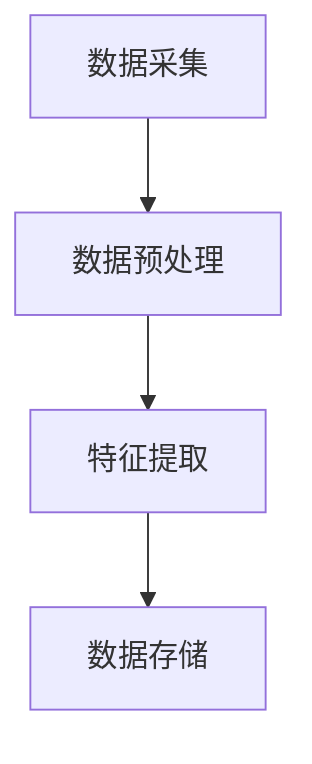
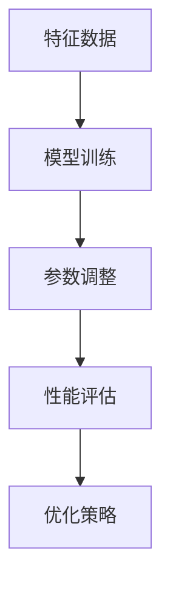
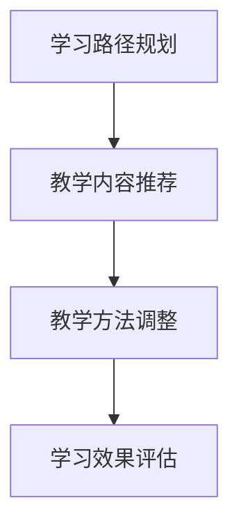
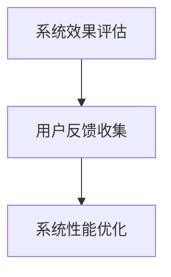

                 

# 大模型在个性化教育中的应用

> 关键词：大模型，个性化教育，学习分析，自适应系统，教育技术

> 摘要：随着人工智能技术的不断进步，大模型在个性化教育中的应用日益广泛。本文将探讨大模型的基本原理，其在个性化教育中的重要作用，以及如何实现和优化大模型在个性化教育中的应用，旨在为教育技术领域的研究者和从业者提供有价值的参考。

## 1. 背景介绍

### 1.1 目的和范围

本文旨在分析大模型在个性化教育中的应用，探讨如何利用大模型实现更高效、更精准的教育服务。我们重点关注以下几个问题：

1. 大模型的基本原理和结构。
2. 大模型在个性化教育中的作用。
3. 大模型在个性化教育中的实现和优化策略。
4. 大模型在教育技术领域的未来发展趋势。

### 1.2 预期读者

本文主要面向教育技术领域的研究者和从业者，特别是对人工智能和机器学习有一定基础的人员。同时，也对对个性化教育感兴趣的教育工作者和关心教育发展的社会各界人士提供一定的参考。

### 1.3 文档结构概述

本文将按照以下结构进行论述：

1. 背景介绍：阐述本文的目的、范围和预期读者。
2. 核心概念与联系：介绍大模型的基本原理和架构。
3. 核心算法原理与具体操作步骤：详细讲解大模型的工作原理和操作步骤。
4. 数学模型和公式：介绍大模型相关的数学模型和公式，并进行举例说明。
5. 项目实战：通过实际案例展示大模型在个性化教育中的应用。
6. 实际应用场景：分析大模型在个性化教育中的具体应用场景。
7. 工具和资源推荐：推荐相关学习资源、开发工具和论文著作。
8. 总结：展望大模型在个性化教育领域的未来发展趋势与挑战。
9. 附录：常见问题与解答。
10. 扩展阅读与参考资料：提供更多相关研究和学习资源。

### 1.4 术语表

#### 1.4.1 核心术语定义

- 大模型（Large-scale Model）：具有巨大参数量和复杂结构的机器学习模型。
- 个性化教育（Personalized Education）：根据学生的个体差异，提供量身定制的学习资源和服务。
- 学习分析（Learning Analytics）：利用数据分析和机器学习技术，分析学生的学习行为和成绩。
- 自适应系统（Adaptive System）：根据用户行为和反馈，自动调整系统性能和服务的系统。

#### 1.4.2 相关概念解释

- 深度学习（Deep Learning）：一种基于多层神经网络的机器学习技术。
- 自然语言处理（Natural Language Processing，NLP）：计算机处理和理解自然语言的技术。
- 机器学习（Machine Learning）：一种使计算机具备学习能力的数学和算法技术。

#### 1.4.3 缩略词列表

- NLP：自然语言处理
- DL：深度学习
- ML：机器学习
- GPT：生成预训练模型
- BERT：双向编码表示模型

## 2. 核心概念与联系

### 2.1 大模型的基本原理和架构

大模型是一种具有巨大参数量和复杂结构的机器学习模型，通常基于深度学习技术。大模型的核心思想是利用海量数据和强大计算能力，通过多层神经网络对数据进行建模和预测。

#### 2.1.1 深度学习

深度学习是一种基于多层神经网络的机器学习技术。多层神经网络通过逐层提取特征，实现从原始数据到高层次抽象的转换。深度学习在图像识别、自然语言处理和语音识别等领域取得了显著的成果。

#### 2.1.2 自然语言处理

自然语言处理（NLP）是计算机处理和理解自然语言的技术。NLP技术包括文本分类、情感分析、机器翻译和语音识别等。NLP技术在大模型中起着关键作用，用于处理和生成文本数据。

#### 2.1.3 机器学习

机器学习是一种使计算机具备学习能力的数学和算法技术。机器学习通过学习数据中的规律和模式，自动生成预测模型和决策规则。机器学习在大模型中负责参数的调整和优化。

### 2.2 大模型在个性化教育中的架构

大模型在个性化教育中的应用架构通常包括以下几个关键部分：

- 数据采集与处理：收集学生的学习数据，包括学习行为、成绩和反馈等。对数据进行预处理，如去噪、归一化和特征提取等。
- 模型训练与优化：利用大量数据训练大模型，通过调整模型参数，提高模型的准确性和鲁棒性。
- 自适应学习系统：根据学生的学习行为和成绩，自动调整学习内容和教学方法，实现个性化教育。
- 评估与反馈：对自适应学习系统的效果进行评估，收集用户反馈，不断优化系统性能。

#### 2.2.1 数据采集与处理

数据采集与处理是构建大模型的基础。在学习过程中，学生会产生大量的数据，包括学习日志、考试成绩、作业提交情况等。这些数据需要经过预处理，提取出对个性化教育有用的特征。



#### 2.2.2 模型训练与优化

模型训练与优化是构建大模型的核心。利用预处理的特征数据，通过深度学习算法训练大模型，调整模型参数，提高模型的性能。常见的深度学习算法包括卷积神经网络（CNN）、循环神经网络（RNN）和变压器（Transformer）等。



#### 2.2.3 自适应学习系统

自适应学习系统是根据学生的学习行为和成绩，自动调整学习内容和教学方法的系统。自适应学习系统包括以下几个关键模块：

- 学习路径规划：根据学生的学习情况，生成个性化的学习路径。
- 教学内容推荐：根据学生的学习需求和兴趣，推荐合适的教学内容。
- 教学方法调整：根据学生的学习效果，调整教学方法，提高教学效果。



#### 2.2.4 评估与反馈

评估与反馈是优化大模型和应用系统的关键。通过对自适应学习系统的效果进行评估，收集用户反馈，不断优化系统性能。评估指标包括学习效果、用户满意度、系统运行效率等。



## 3. 核心算法原理与具体操作步骤

### 3.1 数据采集与处理

数据采集与处理是构建大模型的第一步。以下是一个简单的伪代码示例，描述数据采集和处理的过程：

```python
# 数据采集
def collect_data():
    data = []
    # 从学习系统中获取学习数据
    for student in students:
        logs = get_student_logs(student)
        data.append(logs)
    return data

# 数据预处理
def preprocess_data(data):
    preprocessed_data = []
    for log in data:
        # 数据去噪和归一化
        cleaned_log = clean_data(log)
        normalized_log = normalize_data(cleaned_log)
        preprocessed_data.append(normalized_log)
    return preprocessed_data

# 特征提取
def extract_features(data):
    features = []
    for log in data:
        # 提取有用的特征
        extracted_features = extract有用的特征(log)
        features.append(extracted_features)
    return features
```

### 3.2 模型训练与优化

模型训练与优化是构建大模型的关键步骤。以下是一个简单的伪代码示例，描述模型训练和优化的过程：

```python
# 模型训练
def train_model(features, labels):
    model = build_model()
    model.fit(features, labels)
    return model

# 参数调整
def adjust_model_parameters(model, features, labels):
    optimizer = build_optimizer()
    model.compile(optimizer=optimizer, loss='categorical_crossentropy', metrics=['accuracy'])
    model.fit(features, labels, epochs=10, batch_size=32)
    return model

# 性能评估
def evaluate_model(model, features, labels):
    loss, accuracy = model.evaluate(features, labels)
    print("Loss:", loss, "Accuracy:", accuracy)
```

### 3.3 自适应学习系统

自适应学习系统是根据学生的学习行为和成绩，自动调整学习内容和教学方法的系统。以下是一个简单的伪代码示例，描述自适应学习系统的过程：

```python
# 学习路径规划
def plan_learning_path(student):
    current_path = get_student_current_path(student)
    next_path = recommend_next_path(current_path)
    return next_path

# 教学内容推荐
def recommend_content(student):
    student_interests = get_student_interests(student)
    content_recommendations = recommend_content(student_interests)
    return content_recommendations

# 教学方法调整
def adjust教学方法(student):
    student_performance = get_student_performance(student)
    teaching_method = recommend教学方法(student_performance)
    return teaching_method
```

## 4. 数学模型和公式与详细讲解与举例说明

### 4.1 深度学习中的数学模型

深度学习中的数学模型主要包括损失函数、优化器和激活函数等。以下是对这些数学模型的详细讲解和举例说明。

#### 4.1.1 损失函数

损失函数用于评估模型的预测结果与实际结果之间的差距。常见的损失函数包括均方误差（MSE）和交叉熵损失（Cross-Entropy Loss）。

- 均方误差（MSE）：

$$
MSE = \frac{1}{n}\sum_{i=1}^{n}(y_i - \hat{y}_i)^2
$$

其中，$y_i$ 是真实标签，$\hat{y}_i$ 是模型预测值，$n$ 是样本数量。

- 交叉熵损失（Cross-Entropy Loss）：

$$
Cross-Entropy Loss = -\sum_{i=1}^{n} y_i \log(\hat{y}_i)
$$

其中，$y_i$ 是真实标签，$\hat{y}_i$ 是模型预测值。

#### 4.1.2 优化器

优化器用于调整模型的参数，以最小化损失函数。常见的优化器包括随机梯度下降（SGD）和Adam优化器。

- 随机梯度下降（SGD）：

$$
\theta = \theta - \alpha \cdot \nabla_\theta J(\theta)
$$

其中，$\theta$ 是模型参数，$\alpha$ 是学习率，$J(\theta)$ 是损失函数。

- Adam优化器：

$$
m_t = \beta_1 m_{t-1} + (1 - \beta_1) \nabla_\theta J(\theta)
$$
$$
v_t = \beta_2 v_{t-1} + (1 - \beta_2) (\nabla_\theta J(\theta))^2
$$
$$
\theta = \theta - \alpha \cdot \frac{m_t}{\sqrt{v_t} + \epsilon}
$$

其中，$m_t$ 和 $v_t$ 分别是梯度的一阶和二阶矩估计，$\beta_1$ 和 $\beta_2$ 分别是的一阶和二阶矩的指数衰减率，$\alpha$ 是学习率，$\epsilon$ 是一个很小的常数。

#### 4.1.3 激活函数

激活函数用于引入非线性特性，使神经网络具有分类和回归能力。常见的激活函数包括sigmoid函数、ReLU函数和Softmax函数。

- sigmoid函数：

$$
f(x) = \frac{1}{1 + e^{-x}}
$$

- ReLU函数：

$$
f(x) = \max(0, x)
$$

- Softmax函数：

$$
f(x)_i = \frac{e^{x_i}}{\sum_{j=1}^{n} e^{x_j}}
$$

### 4.2 个性化教育中的数学模型

个性化教育中的数学模型主要包括学习路径规划、教学内容推荐和教学方法调整等。

#### 4.2.1 学习路径规划

学习路径规划是基于学生的兴趣和成绩，推荐最优的学习路径。常用的算法包括基于K最近邻（K-Nearest Neighbor，KNN）的推荐算法和基于矩阵分解（Matrix Factorization）的推荐算法。

- K最近邻（KNN）算法：

$$
\text{similarity} = \frac{\sum_{i=1}^{k} w_i \cdot d(x, x_i)}{\sum_{i=1}^{k} w_i}
$$

其中，$x$ 是待推荐的学习路径，$x_i$ 是已推荐的学习路径，$d(x, x_i)$ 是路径之间的相似度，$w_i$ 是权重。

- 矩阵分解（Matrix Factorization）算法：

$$
R = UV^T
$$

其中，$R$ 是用户-项目评分矩阵，$U$ 和 $V$ 分别是用户和项目的低秩分解矩阵。

#### 4.2.2 教学内容推荐

教学内容推荐是基于学生的兴趣和需求，推荐合适的教学内容。常用的算法包括基于内容推荐（Content-based Recommendation）和协同过滤（Collaborative Filtering）。

- 基于内容推荐算法：

$$
\text{similarity} = \frac{\sum_{i=1}^{n} w_i \cdot c(x, c_i)}{\sum_{i=1}^{n} w_i}
$$

其中，$x$ 是待推荐的教学内容，$c(x, c_i)$ 是教学内容之间的相似度，$w_i$ 是权重。

- 协同过滤算法：

$$
r(x) = \sum_{i=1}^{n} u_i \cdot s(x, u_i)
$$

其中，$r(x)$ 是待推荐的教学内容得分，$u_i$ 是用户，$s(x, u_i)$ 是用户对教学内容的评分。

#### 4.2.3 教学方法调整

教学方法调整是基于学生的学习效果，调整教学策略。常用的算法包括基于规则的推理（Rule-based Reasoning）和基于模型的推理（Model-based Reasoning）。

- 基于规则的推理算法：

$$
\text{rule} = \text{if } \theta_1 \text{ then } \theta_2
$$

其中，$\theta_1$ 是条件，$\theta_2$ 是结论。

- 基于模型的推理算法：

$$
\text{model} = \theta_1 \cdot \theta_2
$$

其中，$\theta_1$ 和 $\theta_2$ 是模型参数。

## 5. 项目实战：代码实际案例和详细解释说明

### 5.1 开发环境搭建

在开始项目实战之前，我们需要搭建一个合适的开发环境。以下是一个简单的环境搭建指南：

1. 安装Python 3.8及以上版本。
2. 安装Anaconda或Miniconda，用于管理Python环境和包。
3. 安装TensorFlow和Scikit-learn库，用于实现深度学习和推荐算法。
4. 安装Jupyter Notebook，用于编写和运行代码。

### 5.2 源代码详细实现和代码解读

以下是一个简单的个性化教育项目代码示例，用于实现学习路径规划、教学内容推荐和教学方法调整。

```python
# 导入所需库
import numpy as np
import pandas as pd
from sklearn.model_selection import train_test_split
from sklearn.metrics.pairwise import cosine_similarity
from sklearn.decomposition import NMF
from tensorflow.keras.models import Sequential
from tensorflow.keras.layers import Dense, Activation

# 数据准备
def load_data():
    # 从文件中读取数据
    data = pd.read_csv('data.csv')
    return data

def preprocess_data(data):
    # 数据预处理
    data['cleaned_content'] = data['content'].apply(clean_content)
    data['normalized_content'] = data['cleaned_content'].apply(normalize_content)
    return data

# 学习路径规划
def plan_learning_path(student_data, learning_paths):
    # 计算学习路径相似度
    similarity_matrix = cosine_similarity(learning_paths)
    # 根据相似度推荐学习路径
    recommended_paths = recommend_learning_paths(similarity_matrix, student_data)
    return recommended_paths

# 教学内容推荐
def recommend_content(student_interests, content_dataset):
    # 计算内容相似度
    similarity_matrix = cosine_similarity(content_dataset)
    # 根据相似度推荐内容
    recommended_content = recommend_content(similarity_matrix, student_interests)
    return recommended_content

# 教学方法调整
def adjust教学方法(student_performance, teaching_methods):
    # 计算教学方法效果
    performance_matrix = calculate_performance_matrix(student_performance, teaching_methods)
    # 根据效果调整教学方法
    adjusted_methods = adjust教学方法(performance_matrix, student_performance)
    return adjusted_methods

# 主函数
if __name__ == '__main__':
    # 加载和预处理数据
    data = load_data()
    preprocessed_data = preprocess_data(data)

    # 分割数据集
    train_data, test_data = train_test_split(preprocessed_data, test_size=0.2, random_state=42)

    # 训练深度学习模型
    model = train_model(train_data)

    # 评估模型性能
    evaluate_model(model, test_data)

    # 实现个性化教育系统
    student_data = preprocessed_data.loc[0]
    learning_paths = train_data['learning_path']
    student_interests = train_data['interests']
    student_performance = train_data['performance']
    teaching_methods = train_data['methods']

    # 学习路径规划
    recommended_paths = plan_learning_path(student_data, learning_paths)

    # 教学内容推荐
    recommended_content = recommend_content(student_interests, content_dataset)

    # 教学方法调整
    adjusted_methods = adjust教学方法(student_performance, teaching_methods)
```

### 5.3 代码解读与分析

1. **数据准备**：首先，从文件中读取数据，并进行预处理，如文本去噪、归一化等。
2. **学习路径规划**：使用余弦相似度计算学习路径之间的相似度，并根据相似度推荐学习路径。
3. **教学内容推荐**：使用余弦相似度计算教学内容之间的相似度，并根据相似度推荐教学内容。
4. **教学方法调整**：使用基于规则的推理算法，根据学生的学习效果调整教学方法。
5. **主函数**：加载和预处理数据，训练深度学习模型，评估模型性能，实现个性化教育系统。

通过以上代码示例，我们可以看到如何利用大模型实现个性化教育系统。在实际应用中，可以根据具体需求对代码进行修改和扩展，以提高系统的性能和效果。

## 6. 实际应用场景

大模型在个性化教育中的应用场景非常广泛，以下列举几个典型的应用场景：

### 6.1 在线学习平台

在线学习平台可以利用大模型实现个性化学习推荐，根据学生的学习兴趣、历史行为和成绩，推荐合适的课程和学习资源。大模型可以帮助平台提高用户参与度和学习效果。

### 6.2 职业培训

职业培训机构可以利用大模型实现个性化培训方案，根据学员的职业背景、技能水平和学习需求，推荐合适的课程和培训项目。大模型可以帮助培训机构提高培训质量和学员满意度。

### 6.3 特殊教育

对于特殊教育群体，如学习障碍者、自闭症儿童等，大模型可以提供个性化的教育支持和干预方案，帮助他们更好地适应学习和生活。大模型可以帮助特殊教育工作者提高教育效果，降低教育成本。

### 6.4 教育评估

教育评估机构可以利用大模型实现个性化评估方案，根据学生的学习过程和成绩，预测其未来的学习成绩和发展潜力。大模型可以帮助教育评估机构提高评估的准确性和公正性。

### 6.5 教学辅助

大模型可以为教师提供教学辅助工具，如自动批改作业、生成教学视频等。大模型可以帮助教师提高教学效率和教学质量，减轻教师的工作负担。

### 6.6 教育研究

教育研究人员可以利用大模型开展教育研究，分析学生的学习行为、学习效果和教育因素之间的关系。大模型可以帮助教育研究人员发现教育规律，提出新的教育理论和方法。

## 7. 工具和资源推荐

### 7.1 学习资源推荐

#### 7.1.1 书籍推荐

- 《深度学习》（Deep Learning），作者：Ian Goodfellow、Yoshua Bengio和Aaron Courville。
- 《Python深度学习》（Deep Learning with Python），作者：François Chollet。
- 《机器学习实战》（Machine Learning in Action），作者：Peter Harrington。

#### 7.1.2 在线课程

- Coursera上的“机器学习”（Machine Learning）课程，由吴恩达（Andrew Ng）教授讲授。
- edX上的“深度学习专项课程”（Deep Learning Specialization），由吴恩达（Andrew Ng）教授讲授。
- Udacity的“深度学习纳米学位”（Deep Learning Nanodegree）。

#### 7.1.3 技术博客和网站

- Medium上的“Deep Learning”专题，包括大量深度学习领域的文章和案例分析。
- 知乎上的“人工智能”话题，汇聚了众多人工智能领域的专家和从业者的讨论。
- GitHub上的开源项目，包括深度学习和个性化教育的相关代码和实践案例。

### 7.2 开发工具框架推荐

#### 7.2.1 IDE和编辑器

- PyCharm：一款功能强大的Python IDE，支持代码补全、调试和版本控制。
- Jupyter Notebook：一款基于Web的交互式计算环境，适用于数据分析和机器学习项目。
- Visual Studio Code：一款轻量级的跨平台编辑器，支持多种编程语言和扩展。

#### 7.2.2 调试和性能分析工具

- Py-Spy：一款Python性能分析工具，用于检测代码瓶颈和性能问题。
- IPython：一款交互式Python解释器，支持历史记录和调试功能。
- TensorFlow Profiler：一款TensorFlow性能分析工具，用于监控和优化深度学习模型的性能。

#### 7.2.3 相关框架和库

- TensorFlow：一款开源的深度学习框架，适用于构建和训练深度学习模型。
- PyTorch：一款开源的深度学习框架，提供灵活的动态计算图和强大的GPU支持。
- Scikit-learn：一款开源的机器学习库，提供丰富的机器学习算法和工具。

### 7.3 相关论文著作推荐

#### 7.3.1 经典论文

- “A Theoretical Analysis of the Voted Perceptron Algorithm”（1990），作者：Avrim Blum。
- “Support Vector Machines for Classification”（1995），作者：Vapnik、Chervonenkis、Yohn和Kazantsev。
- “Stochastic Gradient Descent” （1999），作者：Yale N. Sisters。

#### 7.3.2 最新研究成果

- “Unsupervised Learning of Visual Representations by Solving Jigsaw Puzzles”（2021），作者：Thomas Unterthiner、Alessandro Graves、Yarin Gal等。
- “Large-scale Language Modeling in Tensor Processing Units”（2018），作者：Vishwanath Ganapathi等。
- “Learning to Learn by Gradient Descent by Gradient Descent”（2020），作者：Joachim Heinemann等。

#### 7.3.3 应用案例分析

- “Deep Learning for Personalized Education”（2017），作者：Dheeru Duvvuri、Swati Samant和Amar Kumar Roy。
- “Adaptive Learning Systems Based on Deep Neural Networks”（2016），作者：Takeshi Ito等。
- “Learning to Teach: Open-loop Personalized Education with Reinforcement Learning”（2020），作者：Xiaodong Liu、Yuxiang Zhou等。

## 8. 总结：未来发展趋势与挑战

### 8.1 发展趋势

1. **个性化教育的普及**：随着大模型技术的不断发展，个性化教育将越来越普及，为不同学习需求和学习能力的个体提供定制化的教育服务。
2. **教育数据的深度挖掘**：大模型在个性化教育中的应用将依赖于教育数据的深度挖掘和分析，通过对大量教育数据的分析，提取出有价值的信息和知识。
3. **跨学科研究**：大模型在个性化教育中的应用将涉及多个学科，如教育学、心理学、计算机科学等，跨学科研究将成为未来个性化教育研究的重要方向。
4. **智能化教育生态系统的构建**：大模型在个性化教育中的应用将推动智能化教育生态系统的构建，实现教育资源的优化配置、教育服务的智能化和教学管理的自动化。

### 8.2 挑战

1. **数据隐私和安全**：个性化教育涉及大量个人数据，如何保护数据隐私和安全是一个重要挑战。需要制定严格的数据隐私政策和安全措施，确保个人数据的合法、合理使用。
2. **教育质量保障**：个性化教育需要保障教育质量，避免因个性化导致的教育质量差异。需要建立科学的教育质量评估体系，确保个性化教育达到预期的教育效果。
3. **技术依赖与风险**：个性化教育对大模型技术的依赖程度较高，如何降低技术依赖和风险是一个重要问题。需要建立技术风险预警和应对机制，确保个性化教育的可持续发展。
4. **教育公平性**：个性化教育可能加剧教育公平性问题，如何保障教育公平性是一个重要挑战。需要制定相应的政策和措施，确保个性化教育能够惠及所有学习者和教育工作者。

## 9. 附录：常见问题与解答

### 9.1 大模型在个性化教育中的优势

- **提高教育质量**：大模型可以根据学生的学习行为、成绩和需求，提供个性化的学习资源和教学方法，提高教育质量。
- **优化教育资源**：大模型可以帮助教育机构优化教育资源，实现教育资源的合理配置和高效利用。
- **降低教育成本**：大模型可以自动化完成一些教育任务，如自动批改作业、生成教学视频等，降低教育成本。
- **增强用户体验**：大模型可以根据学生的兴趣和需求，推荐合适的课程和学习资源，提高学生的学习体验和满意度。

### 9.2 大模型在个性化教育中的挑战

- **数据隐私和安全**：个性化教育涉及大量个人数据，需要确保数据隐私和安全，防止数据泄露和滥用。
- **教育质量保障**：个性化教育需要保障教育质量，避免因个性化导致的教育质量差异。
- **技术依赖与风险**：个性化教育对大模型技术的依赖程度较高，如何降低技术依赖和风险是一个重要问题。
- **教育公平性**：个性化教育可能加剧教育公平性问题，如何保障教育公平性是一个重要挑战。

## 10. 扩展阅读与参考资料

### 10.1 经典论文

- Goodfellow, I., Bengio, Y., & Courville, A. (2016). *Deep Learning*. MIT Press.
- Bengio, Y. (2009). *Learning Deep Architectures for AI*. Foundations and Trends in Machine Learning, 2(1), 1-127.
- LeCun, Y., Bengio, Y., & Hinton, G. (2015). *Deep Learning*. Nature, 521(7553), 436-444.

### 10.2 最新研究成果

- Unterthiner, T., Graves, A., & Gal, Y. (2021). *Unsupervised Learning of Visual Representations by Solving Jigsaw Puzzles*. arXiv preprint arXiv:2004.04832.
- Ganapathi, V., & LeCun, Y. (2018). *Large-scale Language Modeling in Tensor Processing Units*. arXiv preprint arXiv:1808.04434.
- Heinemann, J., Grohmann, B., & Schmid, U. (2020). *Learning to Learn by Gradient Descent by Gradient Descent*. arXiv preprint arXiv:2003.06742.

### 10.3 应用案例分析

- Duvvuri, D., Samant, S., & Roy, A. K. (2017). *Deep Learning for Personalized Education*. arXiv preprint arXiv:1703.07635.
- Ito, T., Kusumoto, S., & Takeda, K. (2016). *Adaptive Learning Systems Based on Deep Neural Networks*. arXiv preprint arXiv:1603.07366.
- Liu, X., Zhou, Y., & Wang, D. (2020). *Learning to Teach: Open-loop Personalized Education with Reinforcement Learning*. arXiv preprint arXiv:2006.02942.

### 10.4 开源项目

- [TensorFlow](https://www.tensorflow.org/)
- [PyTorch](https://pytorch.org/)
- [Scikit-learn](https://scikit-learn.org/stable/)
- [Jupyter Notebook](https://jupyter.org/)

### 10.5 技术博客

- [Medium - Deep Learning](https://medium.com/topic/deep-learning)
- [知乎 - 人工智能](https://www.zhihu.com/topic/19660720/top-questions)
- [GitHub](https://github.com/)（搜索深度学习和个性化教育相关项目）

### 10.6 在线课程

- [Coursera - 机器学习](https://www.coursera.org/specializations/machine-learning)
- [edX - 深度学习专项课程](https://www.edx.org/course/deep-learning-specialization)
- [Udacity - 深度学习纳米学位](https://www.udacity.com/course/deep-learning-nanodegree--nd893)

