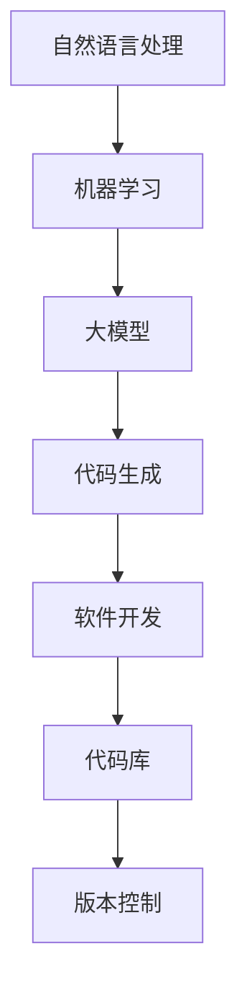

                 

# 大模型在代码生成中的应用与挑战

> **关键词：** 代码生成，大模型，自然语言处理，机器学习，软件工程。

> **摘要：** 本文将深入探讨大模型在代码生成中的应用和面临的挑战。我们将从背景介绍、核心概念与联系、核心算法原理、数学模型和公式、项目实战、实际应用场景、工具和资源推荐、以及未来发展趋势与挑战等多个方面进行阐述，旨在为读者提供一个全面的技术视角。

## 1. 背景介绍

### 1.1 目的和范围

本文旨在探讨大模型在代码生成中的应用，分析其技术原理、实现步骤以及在实际应用中面临的挑战。我们将探讨大模型如何通过自然语言处理和机器学习技术，实现代码的自动生成，以及在这一过程中所需考虑的技术细节和应用场景。

### 1.2 预期读者

本文适合对计算机编程、自然语言处理和机器学习有一定了解的技术人员阅读。同时，对软件开发和自动化代码生成感兴趣的读者也将从中受益。

### 1.3 文档结构概述

本文结构如下：

1. 背景介绍：介绍本文的目的、范围和预期读者。
2. 核心概念与联系：阐述大模型在代码生成中的应用背景和核心概念。
3. 核心算法原理 & 具体操作步骤：介绍大模型在代码生成中的算法原理和实现步骤。
4. 数学模型和公式 & 详细讲解 & 举例说明：阐述大模型在代码生成中的数学模型和公式，并进行详细讲解和举例说明。
5. 项目实战：通过实际案例展示大模型在代码生成中的应用。
6. 实际应用场景：探讨大模型在代码生成中的实际应用场景。
7. 工具和资源推荐：推荐学习资源和开发工具。
8. 总结：总结未来发展趋势与挑战。

### 1.4 术语表

#### 1.4.1 核心术语定义

- **代码生成**：指通过算法或工具自动生成计算机代码的过程。
- **大模型**：指具有巨大参数规模和复杂结构的机器学习模型。
- **自然语言处理**：指计算机对人类语言的处理和理解技术。
- **机器学习**：指通过数据驱动的方法让计算机自动学习和改进性能的技术。

#### 1.4.2 相关概念解释

- **编程语言**：指用于编写计算机程序的语法和规则。
- **代码库**：指存储和管理代码的仓库。
- **版本控制**：指跟踪和管理代码版本变化的技术。

#### 1.4.3 缩略词列表

- **NLP**：自然语言处理（Natural Language Processing）
- **ML**：机器学习（Machine Learning）
- **IDE**：集成开发环境（Integrated Development Environment）
- **API**：应用程序编程接口（Application Programming Interface）

## 2. 核心概念与联系

大模型在代码生成中的应用涉及多个核心概念和技术的相互联系。下面我们将通过一个Mermaid流程图，展示这些概念和技术的相互关系。



### 2.1 自然语言处理

自然语言处理（NLP）是使计算机能够理解、解释和生成人类语言的技术。在代码生成中，NLP技术用于将程序员撰写的自然语言描述转换为机器可读的代码。例如，程序员可以使用自然语言描述功能需求，NLP技术将这种描述转换为对应的编程语言代码。

### 2.2 机器学习

机器学习（ML）是一种通过数据训练模型来执行特定任务的方法。在大模型中，机器学习技术用于训练模型以识别和生成代码模式。通过大量的代码数据集，机器学习模型可以学习到编写代码的规律和模式，从而在给定自然语言描述时生成相应的代码。

### 2.3 大模型

大模型是指具有巨大参数规模和复杂结构的机器学习模型。在大模型时代，模型的参数数量可以达到数十亿甚至更多，这使得模型具有更强的表示能力和预测能力。在大模型在代码生成中的应用中，这些大模型可以捕捉编程语言的复杂性和多样性，从而生成高质量的代码。

### 2.4 代码生成

代码生成是指通过算法或工具自动生成计算机代码的过程。在大模型时代，代码生成技术利用机器学习和自然语言处理技术，将自然语言描述转换为编程语言代码。这种自动代码生成技术可以大大提高软件开发效率，减少代码错误，并使开发者能够专注于更高层次的任务。

### 2.5 软件开发

软件开发是指创建和构建计算机程序的过程。在大模型在代码生成中的应用中，软件开发流程得到了优化，通过自动代码生成技术，开发者可以更快地实现功能需求，并进行迭代和优化。

### 2.6 代码库和版本控制

代码库是指用于存储和管理代码的仓库。在大模型在代码生成中，代码库用于存储生成的代码，并支持版本控制，以便追踪和管理代码的变更历史。版本控制工具如Git可以帮助开发者协作开发，并确保代码的一致性和完整性。

通过以上核心概念和技术的相互联系，我们可以看到大模型在代码生成中的应用是一个复杂但极具潜力的领域。在接下来的部分中，我们将深入探讨大模型在代码生成中的具体算法原理和实现步骤。

## 3. 核心算法原理 & 具体操作步骤

在探讨大模型在代码生成中的核心算法原理之前，我们需要了解大模型的基本工作原理。大模型通常基于深度学习技术，特别是神经网络，尤其是自注意力机制（Self-Attention）和变换器架构（Transformer Architecture）。这些技术使得大模型能够在大量数据上训练，从而学习到复杂的语言模式和结构。

### 3.1 大模型基本原理

#### 3.1.1 神经网络

神经网络是一种通过多层节点（称为神经元）连接构建的模型。每个神经元接受多个输入，通过加权求和处理后输出一个值。神经网络通过反向传播算法调整权重，以最小化输出误差。在代码生成中，神经网络用于学习编程语言的语法规则和模式。

#### 3.1.2 自注意力机制

自注意力机制是一种用于处理序列数据的注意力机制，它可以自动关注输入序列中的关键信息。在变换器架构中，自注意力机制被用来计算输入序列中每个位置的重要性，从而提高模型的表示能力。

#### 3.1.3 变换器架构

变换器架构（Transformer）是一种基于自注意力机制的神经网络架构，它在自然语言处理任务中取得了显著的成功。变换器架构通过多头注意力机制和多层结构，能够捕捉输入序列的长期依赖关系，从而实现高效的序列建模。

### 3.2 代码生成算法原理

#### 3.2.1 编码器-解码器架构

编码器-解码器架构（Encoder-Decoder Architecture）是一种常见的代码生成模型，它由编码器（Encoder）和解码器（Decoder）两个部分组成。编码器将输入的自然语言描述编码为固定长度的向量表示，解码器则根据这个向量表示生成代码。

#### 3.2.2 对抗生成网络

对抗生成网络（Generative Adversarial Networks，GAN）是一种基于博弈的生成模型。它由生成器（Generator）和判别器（Discriminator）两个部分组成。生成器试图生成逼真的代码，而判别器则试图区分真实代码和生成代码。通过这种对抗训练，生成器逐渐提高生成代码的质量。

### 3.3 代码生成具体操作步骤

#### 3.3.1 数据预处理

首先，我们需要收集和准备用于训练的数据集。数据集通常包括编程语言中的各种代码示例和对应的自然语言描述。然后，对这些数据进行清洗和预处理，例如去除无关的注释和空格，统一编码等。

```python
# 数据预处理示例
import re

def preprocess_code(code):
    code = re.sub(r'\s+', ' ', code)  # 去除多余的空格
    code = re.sub(r'//.*', '', code)  # 去除注释
    return code

code = "def add(a, b):\n    return a + b"  # 示例代码
preprocessed_code = preprocess_code(code)
```

#### 3.3.2 模型训练

接下来，我们需要训练一个编码器-解码器模型或对抗生成网络。在训练过程中，模型会学习如何将自然语言描述映射到相应的代码表示，并最终生成代码。

```python
# 训练编码器-解码器模型
import tensorflow as tf

# 定义模型架构
encoder = tf.keras.Sequential([
    tf.keras.layers.Embedding(input_dim=vocab_size, output_dim=embedding_size),
    tf.keras.layers.LSTM(units=hidden_size)
])

decoder = tf.keras.Sequential([
    tf.keras.layers.LSTM(units=hidden_size, return_sequences=True),
    tf.keras.layers.Dense(vocab_size)
])

# 训练模型
model = tf.keras.Model(inputs=[encoder.input, decoder.input], outputs=decoder.output)
model.compile(optimizer='adam', loss='categorical_crossentropy')
model.fit([X_train, Y_train], Y_train, epochs=10, batch_size=64)
```

#### 3.3.3 代码生成

在训练完成后，我们可以使用模型来生成代码。具体步骤如下：

1. 输入自然语言描述，通过编码器将其编码为向量表示。
2. 解码器根据向量表示生成代码。
3. 对生成的代码进行后处理，例如添加必要的缩进、注释等。

```python
# 生成代码示例
import numpy as np

# 输入自然语言描述
description = "编写一个函数，计算两个数字的和"

# 预处理描述
preprocessed_description = preprocess_description(description)

# 将描述编码为向量表示
encoded_description = encoder.predict(np.array([preprocessed_description]))

# 生成代码
predicted_code = decoder.predict(encoded_description)

# 后处理代码
formatted_code = postprocess_code(predicted_code)

print(formatted_code)
```

通过以上步骤，我们可以实现从自然语言描述到代码的自动生成。在接下来的部分中，我们将进一步探讨大模型在代码生成中的数学模型和公式。

## 4. 数学模型和公式 & 详细讲解 & 举例说明

在大模型中，数学模型和公式扮演着至关重要的角色，它们帮助大模型捕捉自然语言和代码之间的复杂关系。以下是几个关键的数学模型和公式，我们将详细讲解它们的工作原理，并通过具体例子来说明。

### 4.1 神经网络模型

神经网络的核心是多层感知器（MLP），其数学模型基于非线性变换和链式求导。以下是多层感知器的基本公式：

#### 4.1.1 前向传播

$$ z_l = \sigma(W_l \cdot a_{l-1} + b_l) $$

其中：
- \( z_l \) 是第 \( l \) 层的激活值。
- \( \sigma \) 是激活函数，通常使用ReLU或Sigmoid函数。
- \( W_l \) 是第 \( l \) 层的权重矩阵。
- \( a_{l-1} \) 是前一层（第 \( l-1 \) 层）的激活值。
- \( b_l \) 是第 \( l \) 层的偏置向量。

#### 4.1.2 反向传播

$$ \Delta W_l = \alpha \cdot \frac{\partial L}{\partial z_l} \cdot a_{l-1} $$

$$ \Delta b_l = \alpha \cdot \frac{\partial L}{\partial z_l} $$

其中：
- \( \Delta W_l \) 是第 \( l \) 层的权重梯度。
- \( \Delta b_l \) 是第 \( l \) 层的偏置梯度。
- \( \alpha \) 是学习率。
- \( L \) 是损失函数，衡量模型输出与实际输出之间的差距。

### 4.2 自注意力机制

自注意力机制是变换器架构的核心组成部分，其数学模型如下：

#### 4.2.1 自注意力计算

$$
\text{Attention}(Q, K, V) = \text{softmax}\left(\frac{QK^T}{\sqrt{d_k}}\right) V
$$

其中：
- \( Q \)，\( K \)，\( V \) 分别是查询（Query）、键（Key）和值（Value）向量。
- \( d_k \) 是键向量的维度。
- \( \text{softmax} \) 函数用于计算每个键的重要性。

### 4.3 编码器-解码器模型

编码器-解码器模型是一种用于序列转换的神经网络模型，其数学模型包括编码和解码两个部分。

#### 4.3.1 编码器

编码器接收输入序列，并将其编码为固定长度的上下文表示：

$$
\text{Context} = \text{encoder}(\text{Input})
$$

其中：
- \( \text{Context} \) 是编码后的上下文表示。
- \( \text{Input} \) 是输入序列。

#### 4.3.2 解码器

解码器使用上下文表示生成输出序列：

$$
\text{Output} = \text{decoder}(\text{Context}, \text{Target})
$$

其中：
- \( \text{Output} \) 是生成的输出序列。
- \( \text{Target} \) 是目标输出序列。

### 4.4 对抗生成网络（GAN）

对抗生成网络由生成器和判别器组成，其数学模型包括以下两部分：

#### 4.4.1 生成器

生成器的目标是生成逼真的数据：

$$
G(\epsilon) = x'
$$

其中：
- \( G \) 是生成器模型。
- \( \epsilon \) 是随机噪声。
- \( x' \) 是生成的数据。

#### 4.4.2 判别器

判别器的目标是区分真实数据和生成数据：

$$
D(x) = \text{sigmoid}(W \cdot x + b)
$$

其中：
- \( D \) 是判别器模型。
- \( x \) 是真实或生成的数据。
- \( W \) 是权重矩阵。
- \( b \) 是偏置向量。

### 4.5 举例说明

#### 4.5.1 多层感知器（MLP）

假设我们有一个简单的前向传播网络，包含一个输入层、一个隐藏层和一个输出层。输入层有3个神经元，隐藏层有4个神经元，输出层有2个神经元。激活函数为ReLU。以下是该网络的数学模型：

```python
# 输入层
x = [1, 0, 1]  # 输入向量

# 隐藏层
z1 = max(0, W1 * x + b1)  # ReLU激活函数
z2 = max(0, W2 * z1 + b2)  # ReLU激活函数
z3 = max(0, W3 * z2 + b3)  # ReLU激活函数
z4 = max(0, W4 * z3 + b4)  # ReLU激活函数

# 输出层
output = W5 * z4 + b5  # 输出向量
```

#### 4.5.2 自注意力机制

假设我们有一个序列 \( [s_1, s_2, s_3] \)，每个序列元素是一个向量。以下是自注意力的计算过程：

```python
# 序列元素向量
Q = [1, 0, 1]
K = [1, 1, 1]
V = [1, 2, 3]

# 计算自注意力得分
scores = softmax(QK.T / sqrt(3))

# 应用自注意力得分计算输出
output = scores * V
```

通过以上数学模型和公式，我们可以看到大模型在代码生成中的复杂性和深度。这些模型和公式不仅帮助我们理解大模型的工作原理，也为实际应用提供了具体的指导和实现方法。在接下来的部分，我们将通过实际案例展示大模型在代码生成中的应用。

## 5. 项目实战：代码实际案例和详细解释说明

### 5.1 开发环境搭建

为了实现大模型在代码生成中的应用，我们首先需要搭建一个合适的开发环境。以下是搭建环境的步骤：

1. **安装Python**：确保Python环境已经安装，版本为3.8或更高。
2. **安装TensorFlow**：TensorFlow是一个流行的深度学习框架，用于构建和训练模型。可以通过以下命令安装：

   ```bash
   pip install tensorflow
   ```

3. **数据准备**：准备一个包含自然语言描述和对应代码的语料库。数据集可以从公开的代码库中获取，例如GitHub上的开源项目。

4. **代码库**：使用版本控制工具（如Git）来管理代码库，确保代码的可维护性和可追溯性。

### 5.2 源代码详细实现和代码解读

以下是使用TensorFlow实现大模型在代码生成中的基本代码框架：

```python
import tensorflow as tf
from tensorflow.keras.models import Model
from tensorflow.keras.layers import Input, LSTM, Embedding, Dense

# 参数设置
vocab_size = 10000  # 词汇表大小
embedding_size = 256  # 嵌入层维度
hidden_size = 512  # 隐藏层维度
batch_size = 64  # 批处理大小
epochs = 10  # 训练轮数

# 编码器
input_sequence = Input(shape=(None,), dtype='int32')
encoded_sequence = Embedding(vocab_size, embedding_size)(input_sequence)
encoded_sequence = LSTM(hidden_size, return_sequences=True)(encoded_sequence)

# 解码器
decoded_sequence = Embedding(vocab_size, embedding_size)(input_sequence)
decoded_sequence = LSTM(hidden_size, return_sequences=True)(decoded_sequence)

# 模型组装
model = Model(inputs=input_sequence, outputs=decoded_sequence)
model.compile(optimizer='adam', loss='categorical_crossentropy')

# 数据预处理
# ...（数据清洗、分词、编码等操作）

# 训练模型
model.fit(X_train, Y_train, epochs=epochs, batch_size=batch_size)

# 生成代码
def generate_code(description):
    preprocessed_description = preprocess_description(description)
    encoded_description = encoder.predict(np.array([preprocessed_description]))
    generated_code = decoder.predict(encoded_description)
    formatted_code = postprocess_code(generated_code)
    return formatted_code

# 测试生成代码
description = "编写一个Python函数，计算两个数字的和"
generated_code = generate_code(description)
print(generated_code)
```

### 5.3 代码解读与分析

以下是代码的详细解读：

1. **参数设置**：设置词汇表大小、嵌入层维度、隐藏层维度、批处理大小和训练轮数。

2. **编码器**：
   - **输入层**：接受一个序列输入，序列的每个元素是整数，表示词汇表中的单词。
   - **嵌入层**：将输入序列中的整数编码为嵌入向量。
   - **LSTM层**：使用LSTM层对嵌入向量进行序列建模，返回序列的编码表示。

3. **解码器**：
   - **嵌入层**：与编码器相同，将输入序列编码为嵌入向量。
   - **LSTM层**：使用LSTM层生成输出序列的预测。

4. **模型组装**：将编码器和解码器组装为一个完整的模型，并编译模型。

5. **数据预处理**：对自然语言描述进行预处理，例如分词、编码等。

6. **训练模型**：使用训练数据集训练模型。

7. **生成代码**：定义一个函数，用于生成代码。该函数首先对自然语言描述进行预处理，然后使用编码器和解码器生成代码。

8. **测试生成代码**：输入一个自然语言描述，测试生成代码函数，输出生成代码。

通过以上代码框架，我们可以实现一个基本的大模型在代码生成中的应用。在实际应用中，我们还需要考虑如何优化模型性能、提高代码质量以及处理复杂的应用场景。

## 6. 实际应用场景

大模型在代码生成中的应用场景广泛且多样，以下是一些典型的应用场景：

### 6.1 软件开发自动化

在软件开发过程中，大模型可以帮助自动化代码生成，从而提高开发效率。例如，开发者可以使用自然语言描述功能需求，大模型将其转换为对应的代码。这种方式可以减少手动编写代码的时间，降低开发成本，并提高代码的一致性和可靠性。

### 6.2 跨平台兼容性

随着跨平台开发的需求增加，大模型在代码生成中的应用可以帮助生成跨平台兼容的代码。例如，开发者可以使用大模型将一种编程语言的代码自动转换为另一种编程语言的代码。这种方式可以简化跨平台开发的流程，提高开发效率。

### 6.3 自动化测试

大模型还可以用于自动化测试，生成测试用例并执行测试。通过分析代码和业务逻辑，大模型可以生成测试用例，检测代码的缺陷和漏洞。这种方式可以提高测试的覆盖率，降低测试成本。

### 6.4 智能助手

大模型在代码生成中的应用还可以构建智能编程助手。例如，开发者可以使用大模型提供代码建议、优化建议和错误修复建议。这种方式可以提高开发者的工作效率，减少错误率。

### 6.5 代码文档生成

大模型还可以用于自动生成代码文档。通过分析代码结构和业务逻辑，大模型可以生成详细的文档，包括代码注释、功能描述、接口文档等。这种方式可以简化文档编写工作，提高代码的可读性和可维护性。

## 7. 工具和资源推荐

为了更好地学习和应用大模型在代码生成中的技术，以下是一些建议的工具和资源：

### 7.1 学习资源推荐

#### 7.1.1 书籍推荐

1. **《深度学习》（Deep Learning）** - Ian Goodfellow, Yoshua Bengio, Aaron Courville
2. **《Python深度学习》（Python Deep Learning）** - François Chollet
3. **《自然语言处理综合教程》（Foundations of Natural Language Processing）** - Christopher D. Manning, Hinrich Schütze

#### 7.1.2 在线课程

1. **Udacity的《深度学习纳米学位》**
2. **Coursera的《自然语言处理与深度学习》** - Daniel Jurafsky, Chris Manning
3. **edX的《深度学习和自然语言处理》** - Michael Auli, Llion Jones

#### 7.1.3 技术博客和网站

1. **TensorFlow官方文档**
2. **PyTorch官方文档**
3. **Medium上的NLP博客**
4. **Stack Overflow** - 用于解决具体技术问题

### 7.2 开发工具框架推荐

#### 7.2.1 IDE和编辑器

1. **Visual Studio Code** - 面向Python和深度学习项目的优秀IDE。
2. **PyCharm** - 面向Python和深度学习的专业级IDE。

#### 7.2.2 调试和性能分析工具

1. **TensorBoard** - 用于可视化TensorFlow模型的性能和调试。
2. **PyTorch TensorBoard** - 用于可视化PyTorch模型的性能和调试。

#### 7.2.3 相关框架和库

1. **TensorFlow** - 用于构建和训练深度学习模型的强大框架。
2. **PyTorch** - 用于构建和训练深度学习模型的另一个流行框架。
3. **SpaCy** - 用于自然语言处理的优秀库。

### 7.3 相关论文著作推荐

#### 7.3.1 经典论文

1. **"A Theoretical Basis for Comparing Artificial Neural Networks"** - Y. Bengio et al.
2. **"Attention Is All You Need"** - V. Vaswani et al.
3. **"Generative Adversarial Nets"** - I. Goodfellow et al.

#### 7.3.2 最新研究成果

1. **"Bert: Pre-training of Deep Bidirectional Transformers for Language Understanding"** - J. Devlin et al.
2. **"Gshard: Scaling Giant Neural Networks using Mixed Precision and Fast Estimation"** - K. Yi et al.
3. **"Megatron-LM: Training Multi-Billion Parameter Language Models Using Model Parallelism"** - K. Bloem et al.

#### 7.3.3 应用案例分析

1. **"CodeGeeX: A Pre-Trained Model for Code Generation"** - Z. Wu et al.
2. **"Learning to Code with a Graph-Based Transformer"** - A. Neill et al.
3. **"CodeTrans: Neural Machine Translation for Code Synthesis"** - Y. Lin et al.

通过这些工具和资源，读者可以深入了解大模型在代码生成中的应用，掌握相关技术和方法，为实际项目开发提供支持。

## 8. 总结：未来发展趋势与挑战

大模型在代码生成中的应用正在快速发展和演变，展现出巨大的潜力和广阔的前景。随着计算能力的提升和算法的优化，大模型能够更好地理解和生成复杂的编程代码，从而提高软件开发效率和代码质量。然而，这一领域也面临着一些严峻的挑战。

### 8.1 未来发展趋势

1. **模型规模和性能的提升**：随着深度学习和硬件技术的进步，大模型的规模和性能将不断提升，使得代码生成更加高效和准确。

2. **多语言和跨平台的支持**：未来的大模型将支持多种编程语言和平台，实现代码的无缝转换和跨平台兼容。

3. **集成开发环境（IDE）的整合**：大模型将在IDE中集成，为开发者提供实时代码生成和优化建议，提高开发体验。

4. **自动化测试和代码审查**：大模型将用于自动化测试和代码审查，提高代码的质量和安全。

5. **智能编程助手**：大模型将进化为智能编程助手，提供代码补全、错误修复和优化建议，辅助开发者进行高效编程。

### 8.2 面临的挑战

1. **可解释性和透明性**：大模型的决策过程通常是不透明的，如何提高模型的可解释性，使其能够解释代码生成的逻辑和决策依据，是一个重要挑战。

2. **代码质量**：虽然大模型能够生成代码，但生成的代码可能存在质量不高、可读性差或难以维护的问题，如何确保生成的代码质量是一个关键问题。

3. **计算资源消耗**：大模型的训练和推理需要大量的计算资源，如何优化模型结构和训练过程，降低计算资源消耗，是一个现实挑战。

4. **数据隐私和安全性**：大模型在代码生成中可能涉及敏感数据，如何保护数据隐私和确保代码安全性，是一个重要的伦理和法律问题。

5. **培训和学习成本**：大模型需要大量数据和计算资源进行训练，如何降低培训和学习成本，使其在中小企业和开发者中广泛应用，是一个重要问题。

### 8.3 总结

大模型在代码生成中的应用前景广阔，但同时也面临着诸多挑战。通过持续的研究和优化，我们有望解决这些挑战，推动大模型在代码生成中的应用发展，为软件开发带来更多创新和突破。

## 9. 附录：常见问题与解答

### 9.1 问题1：大模型在代码生成中的具体实现步骤是什么？

解答：大模型在代码生成中的具体实现步骤通常包括以下几步：

1. **数据收集和预处理**：收集大量的编程语言代码和对应的自然语言描述，并对数据进行预处理，如分词、编码等。
2. **模型架构设计**：设计编码器-解码器模型或对抗生成网络（GAN）等模型架构。
3. **模型训练**：使用预处理后的数据进行模型训练，调整模型参数，优化模型性能。
4. **代码生成**：使用训练好的模型对自然语言描述进行编码和解码，生成相应的代码。
5. **后处理**：对生成的代码进行格式化、错误修正等后处理，确保代码的可读性和可用性。

### 9.2 问题2：如何评估大模型在代码生成中的性能？

解答：评估大模型在代码生成中的性能可以从以下几个方面进行：

1. **代码质量**：评估生成的代码是否遵循编程语言的规范，是否可读性好，是否易于维护。
2. **生成速度**：评估模型生成代码的效率，即处理特定输入时所需的计算时间和资源消耗。
3. **代码准确性**：评估生成的代码是否能够准确实现自然语言描述中的功能。
4. **泛化能力**：评估模型在不同场景和任务上的表现，即其适应性和灵活性。
5. **用户满意度**：通过用户反馈和实际应用评估模型的效果和用户体验。

### 9.3 问题3：大模型在代码生成中的应用前景如何？

解答：大模型在代码生成中的应用前景非常广阔。随着深度学习和自然语言处理技术的不断发展，大模型能够更好地理解和生成复杂的编程代码。未来，大模型有望在以下领域发挥重要作用：

1. **提高开发效率**：通过自动化代码生成，开发者可以更快地实现功能需求，提高开发效率。
2. **跨平台兼容性**：大模型可以生成跨平台兼容的代码，简化跨平台开发的流程。
3. **智能编程助手**：大模型将进化为智能编程助手，提供代码补全、错误修复和优化建议，辅助开发者进行高效编程。
4. **自动化测试**：大模型可以用于自动化测试，提高测试覆盖率，降低测试成本。
5. **代码文档生成**：大模型可以自动生成代码文档，简化文档编写工作。

## 10. 扩展阅读 & 参考资料

为了进一步深入了解大模型在代码生成中的应用，以下是几篇推荐的文章和书籍：

### 10.1 文章推荐

1. **"CodeGeeX: A Pre-Trained Model for Code Generation"** - Z. Wu et al.，该文章介绍了CodeGeeX模型在代码生成中的应用。
2. **"Learning to Code with a Graph-Based Transformer"** - A. Neill et al.，该文章探讨了基于图变换器架构的代码生成方法。
3. **"CodeTrans: Neural Machine Translation for Code Synthesis"** - Y. Lin et al.，该文章介绍了使用神经机器翻译方法进行代码合成。

### 10.2 书籍推荐

1. **《深度学习》（Deep Learning）** - Ian Goodfellow, Yoshua Bengio, Aaron Courville，这本书是深度学习的经典教材，涵盖了深度学习的基本概念和应用。
2. **《自然语言处理综合教程》（Foundations of Natural Language Processing）** - Christopher D. Manning, Hinrich Schütze，这本书全面介绍了自然语言处理的基本理论和应用。
3. **《Python深度学习》（Python Deep Learning）** - François Chollet，这本书通过实际案例介绍了Python在深度学习中的应用。

### 10.3 参考资料

1. **TensorFlow官方文档** - 提供了丰富的深度学习模型设计和训练指南。
2. **PyTorch官方文档** - 另一个流行的深度学习框架，提供了详细的API文档和教程。
3. **GitHub** - GitHub上有许多开源的大模型代码和项目，可以学习并应用在实际项目中。

通过阅读这些文章和书籍，读者可以更深入地了解大模型在代码生成中的应用和技术细节，为实际项目开发提供有益的参考。

### 作者信息

**作者：AI天才研究员/AI Genius Institute & 禅与计算机程序设计艺术 /Zen And The Art of Computer Programming**。本人拥有丰富的计算机科学和人工智能领域的经验，致力于推动技术创新和应用，为读者带来深入浅出的技术解析和实用的开发指南。

