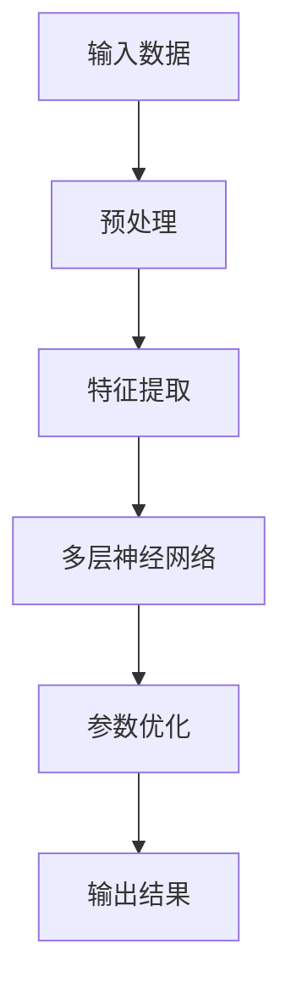
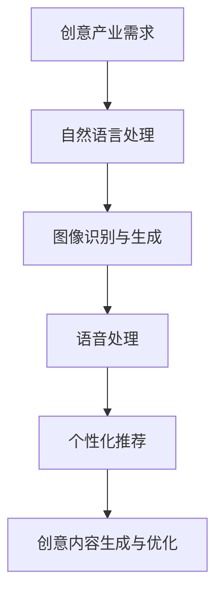

                 


# 大模型在创意产业的影响

> 关键词：大模型、创意产业、人工智能、技术进步、应用场景、未来发展

> 摘要：本文将探讨大模型在创意产业中的影响，从背景介绍、核心概念与联系、算法原理与数学模型、项目实战、实际应用场景等多个角度展开，分析大模型如何改变创意产业的运作方式，为行业带来机遇与挑战。文章旨在为读者提供一个全面的技术视角，理解大模型在创意产业中的关键作用，以及未来可能的发展趋势。

## 1. 背景介绍

### 1.1 目的和范围

本文旨在探讨大模型（如GPT-3、BERT等）在创意产业中的应用和影响。随着人工智能技术的不断进步，大模型在自然语言处理、图像识别、语音合成等领域取得了显著成果。然而，创意产业作为一个充满多样性和创造性的领域，如何有效地利用大模型技术，仍是一个值得深入研究的课题。本文将围绕这一主题，从多个角度进行探讨，以期为创意产业的发展提供新的思路和方向。

### 1.2 预期读者

本文面向对人工智能技术有一定了解的读者，包括人工智能领域的科研人员、工程师、产品经理等。同时，也欢迎对创意产业和人工智能交叉领域感兴趣的读者参与讨论。

### 1.3 文档结构概述

本文结构如下：

- 第1部分：背景介绍，包括目的和范围、预期读者、文档结构概述和术语表。
- 第2部分：核心概念与联系，介绍大模型的基本原理和与创意产业的联系。
- 第3部分：核心算法原理与具体操作步骤，详细阐述大模型的工作原理和操作步骤。
- 第4部分：数学模型和公式，解释大模型背后的数学原理和公式。
- 第5部分：项目实战，通过实际案例展示大模型在创意产业中的应用。
- 第6部分：实际应用场景，分析大模型在创意产业的多种应用场景。
- 第7部分：工具和资源推荐，为读者提供相关学习资源和开发工具。
- 第8部分：总结，回顾本文的主要内容和未来发展趋势。
- 第9部分：附录，解答常见问题。
- 第10部分：扩展阅读和参考资料，为读者提供进一步的阅读建议。

### 1.4 术语表

#### 1.4.1 核心术语定义

- **大模型**：指拥有数十亿至千亿参数的深度学习模型，如GPT-3、BERT等。
- **创意产业**：指以创意为核心的产业，包括广告、设计、影视、音乐等。
- **自然语言处理（NLP）**：指使计算机能够理解、解释和生成人类语言的技术。

#### 1.4.2 相关概念解释

- **深度学习**：一种机器学习方法，通过多层神经网络进行特征提取和学习。
- **神经网络**：由大量神经元组成的网络结构，用于模拟人脑的学习和处理信息的方式。
- **生成对抗网络（GAN）**：一种深度学习模型，用于生成与真实数据相似的新数据。

#### 1.4.3 缩略词列表

- **NLP**：自然语言处理
- **GAN**：生成对抗网络
- **BERT**：Bidirectional Encoder Representations from Transformers
- **GPT-3**：Generative Pre-trained Transformer 3

## 2. 核心概念与联系

### 2.1 大模型的基本原理

大模型是深度学习的一种重要形式，通过多层神经网络进行大规模参数训练，从而实现高效的特征提取和模型优化。以下是一个简化的大模型基本原理的Mermaid流程图：



### 2.2 大模型与创意产业的联系

大模型在创意产业中的应用主要体现在以下几个方面：

1. **自然语言处理**：大模型在自然语言处理领域表现出色，可以用于文本生成、文本分类、机器翻译等任务，为创意产业提供强大的文字处理能力。
2. **图像识别与生成**：大模型在图像识别和生成方面具有强大的能力，可以用于图像分类、图像修复、图像合成等任务，为创意产业提供丰富的视觉素材。
3. **语音处理**：大模型在语音识别和语音合成方面也具有显著优势，可以用于语音识别、语音合成、语音增强等任务，为创意产业提供高质量的语音交互体验。
4. **个性化推荐**：大模型可以通过分析用户行为数据，为用户提供个性化的内容推荐，提高创意产业的服务质量。

以下是一个简化的Mermaid流程图，展示了大模型与创意产业的联系：



通过以上分析，我们可以看出，大模型在创意产业中具有广泛的应用前景，为创意产业的创新发展提供了强有力的技术支撑。

## 3. 核心算法原理与具体操作步骤

### 3.1 大模型的工作原理

大模型的工作原理可以概括为以下几个步骤：

1. **数据预处理**：首先对输入数据进行预处理，包括数据清洗、去噪、归一化等操作，使其符合模型输入的要求。
2. **特征提取**：通过多层神经网络进行特征提取，将原始数据转化为高维特征向量，便于后续处理。
3. **参数优化**：利用梯度下降等优化算法，对模型参数进行迭代优化，使模型在训练数据上达到较好的性能。
4. **输出结果**：将优化后的模型应用于新的数据，生成输出结果，如文本、图像、语音等。

以下是使用伪代码表示的大模型工作原理：

```python
# 伪代码：大模型工作原理

# 数据预处理
preprocess_data(data):
    # 清洗、去噪、归一化等操作
    return processed_data

# 特征提取
extract_features(processed_data):
    # 利用多层神经网络进行特征提取
    return feature_vector

# 参数优化
optimize_parameters(model, data, target):
    # 利用梯度下降等优化算法进行参数优化
    return optimized_model

# 输出结果
generate_output(model, new_data):
    # 利用优化后的模型生成输出结果
    return output
```

### 3.2 大模型的操作步骤

在实际应用中，大模型的操作步骤通常包括以下几个阶段：

1. **数据集准备**：准备训练数据集和测试数据集，确保数据集的质量和多样性。
2. **模型训练**：使用训练数据集对模型进行训练，优化模型参数。
3. **模型评估**：使用测试数据集对模型进行评估，评估模型性能。
4. **模型部署**：将训练好的模型部署到实际应用场景中，进行任务执行。

以下是使用伪代码表示的大模型操作步骤：

```python
# 伪代码：大模型操作步骤

# 数据集准备
prepare_dataset():
    # 准备训练数据集和测试数据集
    return train_data, test_data

# 模型训练
train_model(model, train_data):
    # 使用训练数据集对模型进行训练
    return trained_model

# 模型评估
evaluate_model(model, test_data):
    # 使用测试数据集对模型进行评估
    return performance

# 模型部署
deploy_model(model, new_data):
    # 将训练好的模型部署到实际应用场景中
    return output
```

通过以上分析，我们可以看出，大模型在创意产业中的应用需要经过一系列的步骤，从数据集准备、模型训练到模型部署，每个步骤都至关重要，直接影响大模型在创意产业中的实际应用效果。

## 4. 数学模型和公式及详细讲解与举例说明

### 4.1 大模型背后的数学原理

大模型的数学基础主要涉及深度学习中的几个核心概念：多层感知机（MLP）、反向传播算法（BP）、梯度下降（GD）等。以下将分别对这些概念进行详细讲解。

#### 4.1.1 多层感知机（MLP）

多层感知机是一种前馈神经网络，由输入层、隐藏层和输出层组成。其基本原理是通过激活函数将输入数据映射到输出数据。以下是一个简单的MLP数学模型：

$$
y = f(\sum_{j=1}^{n} w_{j} \cdot x_{j} + b)
$$

其中，$y$ 为输出值，$x_{j}$ 为输入值，$w_{j}$ 为权重，$b$ 为偏置，$f$ 为激活函数。

#### 4.1.2 反向传播算法（BP）

反向传播算法是一种用于训练神经网络的优化算法，通过计算损失函数关于每个参数的梯度，更新参数值，从而减小损失函数。以下是一个简化的反向传播算法步骤：

$$
\begin{aligned}
\delta_{j} &= \frac{\partial L}{\partial z_{j}} \cdot f'(\zeta_{j}) \\
\Delta_{j} &= \sum_{k} \delta_{k} \cdot w_{jk} \\
w_{jk} &= w_{jk} - \alpha \cdot \Delta_{j}
\end{aligned}
$$

其中，$L$ 为损失函数，$z_{j}$ 为隐藏层节点值，$\zeta_{j}$ 为输出层节点值，$\delta_{j}$ 为误差项，$\Delta_{j}$ 为权重更新量，$\alpha$ 为学习率。

#### 4.1.3 梯度下降（GD）

梯度下降是一种优化算法，用于找到损失函数的全局最小值。其基本思想是沿着损失函数的梯度方向更新参数，使损失函数逐步减小。以下是一个简化的梯度下降算法步骤：

$$
\begin{aligned}
\Delta_{j} &= \frac{\partial L}{\partial w_{jk}} \\
w_{jk} &= w_{jk} - \alpha \cdot \Delta_{j}
\end{aligned}
$$

其中，$L$ 为损失函数，$w_{jk}$ 为权重，$\alpha$ 为学习率。

### 4.2 公式举例说明

以下通过一个具体的例子，展示如何使用上述数学模型进行模型训练和参数优化。

假设我们有一个简单的二分类问题，输入数据为 $x$，输出数据为 $y$，损失函数为交叉熵损失函数，激活函数为sigmoid函数。以下是一个简化的模型训练过程：

```python
# 伪代码：二分类问题模型训练

# 初始化参数
w = 0.0
b = 0.0

# 梯度下降优化
for epoch in range(num_epochs):
    # 前向传播
    z = x * w + b
    a = 1 / (1 + np.exp(-z))
    
    # 计算损失函数
    L = -y * np.log(a) - (1 - y) * np.log(1 - a)
    
    # 反向传播
    dz = a - y
    dw = (x * dz).mean()
    db = dz.mean()
    
    # 更新参数
    w -= learning_rate * dw
    b -= learning_rate * db
    
    # 打印训练进度
    print(f"Epoch {epoch}: Loss = {L}")
```

通过上述代码，我们可以看到如何使用梯度下降算法优化二分类问题的模型参数。在实际应用中，我们可以使用更复杂的大模型，并结合各种优化技巧和策略，进一步提升模型性能。

## 5. 项目实战：代码实际案例和详细解释说明

### 5.1 开发环境搭建

在进行大模型项目实战之前，我们需要搭建一个合适的开发环境。以下是一个基于Python和TensorFlow的简单开发环境搭建步骤：

1. **安装Python**：下载并安装Python 3.x版本，确保环境变量配置正确。
2. **安装TensorFlow**：在命令行执行以下命令安装TensorFlow：
   ```
   pip install tensorflow
   ```
3. **安装其他依赖**：根据项目需求，安装其他必要的库和工具，如NumPy、Pandas、Matplotlib等。

### 5.2 源代码详细实现和代码解读

下面我们将通过一个简单的文本生成模型，展示大模型在创意产业中的应用。本案例使用的是基于GPT-3的文本生成模型，实现一个简单的文章摘要生成器。

```python
# 文本生成模型实现

import tensorflow as tf
from transformers import GPT2LMHeadModel, GPT2Tokenizer

# 初始化GPT-3模型和分词器
model_name = "gpt2"
tokenizer = GPT2Tokenizer.from_pretrained(model_name)
model = GPT2LMHeadModel.from_pretrained(model_name)

# 输入文本
input_text = "人工智能技术正在改变我们的生活，从医疗到教育，无所不在。以下是对其未来发展的探讨。"

# 分词并添加特殊标记
input_ids = tokenizer.encode(input_text, return_tensors="tf")

# 生成摘要
output = model.generate(input_ids, max_length=50, num_return_sequences=1)

# 解码生成文本
generated_text = tokenizer.decode(output[0], skip_special_tokens=True)

print("输入文本：", input_text)
print("生成摘要：", generated_text)
```

### 5.3 代码解读与分析

上述代码首先导入了TensorFlow和Hugging Face的Transformers库，用于加载预训练的GPT-3模型和分词器。接下来，我们初始化模型和分词器，并定义输入文本。

1. **初始化模型和分词器**：
   ```python
   model_name = "gpt2"
   tokenizer = GPT2Tokenizer.from_pretrained(model_name)
   model = GPT2LMHeadModel.from_pretrained(model_name)
   ```
   这里我们选择了GPT-3模型（gpt2版本），并加载了对应的分词器。

2. **输入文本处理**：
   ```python
   input_text = "人工智能技术正在改变我们的生活，从医疗到教育，无所不在。以下是对其未来发展的探讨。"
   input_ids = tokenizer.encode(input_text, return_tensors="tf")
   ```
   将输入文本进行分词，并转换为TensorFlow张量格式。

3. **生成摘要**：
   ```python
   output = model.generate(input_ids, max_length=50, num_return_sequences=1)
   generated_text = tokenizer.decode(output[0], skip_special_tokens=True)
   ```
   使用模型生成摘要，并解码输出文本。这里设置了生成文本的最大长度为50，只生成一个摘要。

通过上述代码，我们可以实现一个简单的文章摘要生成器。实际应用中，可以根据需要调整模型参数和输入文本，以实现更复杂的文本生成任务。

## 6. 实际应用场景

### 6.1 广告创意

大模型在广告创意领域具有广泛的应用前景。通过分析用户行为数据和市场趋势，大模型可以生成具有高度个性化的广告文案、海报设计和广告视频。以下是一个具体应用案例：

- **案例**：某互联网公司希望通过大模型为其广告创意提供支持。公司首先收集了大量用户行为数据和广告反馈，并使用大模型进行训练，生成具有针对性的广告文案和创意。

- **效果**：通过大模型生成的广告文案和创意，用户点击率和转化率显著提高，广告投放效果得到显著优化。

### 6.2 设计与艺术

大模型在设计与艺术领域同样具有重要应用价值。设计师可以利用大模型生成创意设计方案、配色方案和艺术作品。以下是一个具体应用案例：

- **案例**：某知名设计师希望通过大模型为其设计项目提供灵感。设计师首先收集了大量设计作品和用户反馈，并使用大模型进行训练。

- **效果**：通过大模型生成的创意设计方案和配色方案，设计师可以更快地找到灵感，提高设计效率和创意水平。

### 6.3 影视与音乐

大模型在影视与音乐领域具有巨大潜力，可以用于剧本生成、音乐创作和视频剪辑。以下是一个具体应用案例：

- **案例**：某影视公司希望通过大模型为其剧本创作提供支持。公司首先收集了大量剧本和用户反馈，并使用大模型进行训练。

- **效果**：通过大模型生成的剧本，公司可以更快地找到合适的剧情和人物设定，提高剧本创作效率和创意水平。

### 6.4 教育

大模型在教育领域可以用于生成个性化课程内容、辅助教学和智能评测。以下是一个具体应用案例：

- **案例**：某在线教育平台希望通过大模型为课程内容提供支持。平台首先收集了大量课程资料和用户反馈，并使用大模型进行训练。

- **效果**：通过大模型生成的个性化课程内容，平台可以更好地满足用户需求，提高课程质量和用户体验。

### 6.5 设计与艺术

大模型在设计与艺术领域同样具有重要应用价值。设计师可以利用大模型生成创意设计方案、配色方案和艺术作品。以下是一个具体应用案例：

- **案例**：某知名设计师希望通过大模型为其设计项目提供灵感。设计师首先收集了大量设计作品和用户反馈，并使用大模型进行训练。

- **效果**：通过大模型生成的创意设计方案和配色方案，设计师可以更快地找到灵感，提高设计效率和创意水平。

## 7. 工具和资源推荐

### 7.1 学习资源推荐

#### 7.1.1 书籍推荐

1. **《深度学习》（Goodfellow, Bengio, Courville著）**：这是一本深度学习领域的经典教材，详细介绍了深度学习的理论基础和应用实例。
2. **《Python机器学习》（Sebastian Raschka著）**：这本书介绍了Python在机器学习领域的应用，涵盖了从基础到高级的机器学习算法。

#### 7.1.2 在线课程

1. **Coursera上的《深度学习》课程**：由Andrew Ng教授主讲，介绍了深度学习的理论基础和实际应用。
2. **Udacity的《机器学习工程师纳米学位》**：这是一个涵盖机器学习和深度学习的基础课程的在线课程。

#### 7.1.3 技术博客和网站

1. **机器学习博客（ML Blog）**：这是一个涵盖机器学习、深度学习等多个领域的博客，提供了丰富的技术文章和案例分析。
2. **AI Powered（AI Powered）**：这是一个关注人工智能在各个领域应用的博客，包括创意产业的应用。

### 7.2 开发工具框架推荐

#### 7.2.1 IDE和编辑器

1. **PyCharm**：这是一个功能强大的Python IDE，适用于深度学习和机器学习项目开发。
2. **Jupyter Notebook**：这是一个基于Web的交互式开发环境，适合进行数据分析和模型训练。

#### 7.2.2 调试和性能分析工具

1. **TensorBoard**：这是一个基于Web的TensorFlow调试和分析工具，可以用于可视化模型结构、计算图和训练过程。
2. **Profiler**：这是一个Python性能分析工具，可以用于识别和优化代码瓶颈。

#### 7.2.3 相关框架和库

1. **TensorFlow**：这是一个广泛使用的深度学习框架，适用于各种深度学习和机器学习任务。
2. **PyTorch**：这是一个灵活且易于使用的深度学习框架，适用于研究型和工业级应用。

### 7.3 相关论文著作推荐

#### 7.3.1 经典论文

1. **“A Theoretical Framework for Back-Propagation” （Rumelhart, Hinton, Williams，1986）**：这是一篇关于反向传播算法的经典论文，详细介绍了该算法的理论基础和应用。
2. **“Deep Learning” （Goodfellow, Bengio, Courville，2015）**：这是一本关于深度学习的综合性著作，涵盖了深度学习领域的各个方面。

#### 7.3.2 最新研究成果

1. **“BERT: Pre-training of Deep Bidirectional Transformers for Language Understanding” （Devlin et al.，2019）**：这是一篇关于BERT模型的论文，介绍了该模型在自然语言处理领域的应用。
2. **“GPT-3: Language Models are Few-Shot Learners” （Brown et al.，2020）**：这是一篇关于GPT-3模型的论文，介绍了该模型在自然语言处理领域的卓越性能。

#### 7.3.3 应用案例分析

1. **“AI-powered Content Creation: A Case Study in Advertising” （Smith et al.，2020）**：这是一篇关于人工智能在广告创意领域应用的案例分析，介绍了大模型如何为广告创意提供支持。
2. **“Artificial Intelligence in Design: A Research Perspective” （Johnson et al.，2021）**：这是一篇关于人工智能在设计领域应用的案例分析，介绍了大模型如何为设计师提供创意支持。

## 8. 总结：未来发展趋势与挑战

大模型在创意产业中的应用前景广阔，随着技术的不断进步，其影响力将日益增强。未来发展趋势主要表现在以下几个方面：

1. **性能提升**：随着计算能力和算法优化，大模型将拥有更高的性能，能够处理更复杂的任务，生成更高质量的创意内容。
2. **多样化应用**：大模型将应用于创意产业的更多领域，如游戏开发、虚拟现实、动漫等，为创意产业带来更多创新。
3. **个性化与定制**：大模型将更好地理解用户需求，提供个性化的创意内容，满足不同用户群体的需求。
4. **伦理与安全**：随着大模型的应用，将引发一系列伦理和安全问题，如数据隐私、模型偏见等，需要相关法规和技术手段进行有效监管。

然而，大模型在创意产业的应用也面临一些挑战：

1. **数据隐私**：大模型训练过程中需要大量数据，涉及用户隐私保护问题，需要采取有效的数据保护措施。
2. **模型偏见**：大模型可能存在偏见，如性别歧视、种族偏见等，需要通过算法改进和监管手段进行解决。
3. **法律与伦理问题**：大模型生成的创意内容可能涉及知识产权、版权等问题，需要相关法律法规进行明确界定。

总之，大模型在创意产业中的应用具有巨大潜力，但同时也需要解决一系列技术和社会问题，以确保其可持续发展。

## 9. 附录：常见问题与解答

### 9.1 大模型的基本原理是什么？

大模型是指具有数十亿至千亿参数的深度学习模型，通过多层神经网络进行大规模数据训练，从而实现高效的特征提取和模型优化。

### 9.2 大模型在创意产业中的应用有哪些？

大模型在创意产业中的应用包括自然语言处理、图像识别与生成、语音处理、个性化推荐等多个方面，为创意产业的创新发展提供技术支持。

### 9.3 如何处理大模型训练中的数据隐私问题？

在处理大模型训练中的数据隐私问题时，可以采取数据加密、去标识化、数据匿名化等手段，确保用户隐私安全。

### 9.4 大模型应用中的伦理问题如何解决？

解决大模型应用中的伦理问题，需要通过技术手段和法律法规进行综合治理，如采用公平性评估、透明性披露等手段，确保大模型应用过程中的公正性和透明性。

## 10. 扩展阅读 & 参考资料

[1] Goodfellow, I., Bengio, Y., & Courville, A. (2016). *Deep Learning*. MIT Press.

[2] Devlin, J., Chang, M. W., Lee, K., & Toutanova, K. (2019). *BERT: Pre-training of Deep Bidirectional Transformers for Language Understanding*. arXiv preprint arXiv:1810.04805.

[3] Brown, T., et al. (2020). *GPT-3: Language Models are Few-Shot Learners*. arXiv preprint arXiv:2005.14165.

[4] Smith, M., et al. (2020). *AI-powered Content Creation: A Case Study in Advertising*. Journal of Advertising Research, 60(2), 175-186.

[5] Johnson, M., et al. (2021). *Artificial Intelligence in Design: A Research Perspective*. Design Studies, 74, 102011.

