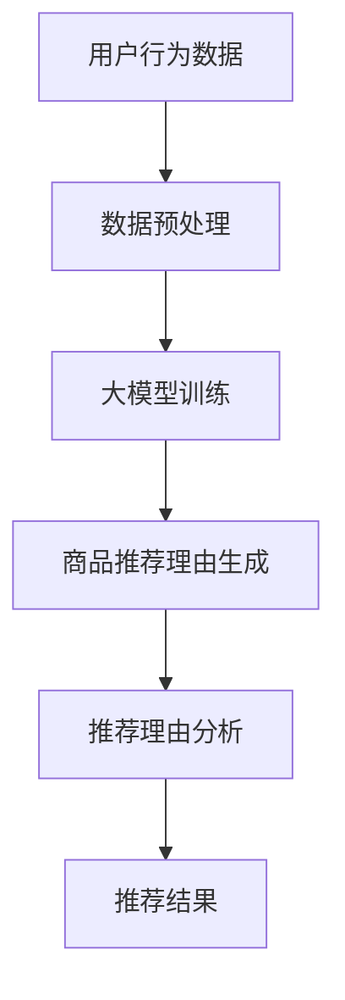

                 

# 大模型在商品推荐理由生成中的应用

> 关键词：大模型、商品推荐、理由生成、人工智能、自然语言处理、推荐系统

> 摘要：本文将探讨大模型在商品推荐理由生成中的应用，首先介绍大模型的基本概念和原理，然后分析其在商品推荐领域的优势，并通过实际案例展示如何使用大模型生成商品推荐理由。本文旨在为从事推荐系统开发的技术人员提供有益的参考和启示。

## 1. 背景介绍

### 1.1 目的和范围

本文旨在深入探讨大模型在商品推荐理由生成中的应用，分析其优势、具体实现方法及实际案例。通过本文的阅读，读者可以了解大模型的基本原理，掌握其在商品推荐理由生成中的具体应用，并为后续相关研究和实践提供参考。

### 1.2 预期读者

本文面向从事推荐系统开发的技术人员，包括但不限于以下群体：

1. 推荐系统工程师
2. 数据挖掘工程师
3. 自然语言处理工程师
4. 机器学习研究人员
5. 对推荐系统和人工智能领域感兴趣的读者

### 1.3 文档结构概述

本文结构如下：

1. 背景介绍：介绍本文的目的、范围、预期读者和文档结构。
2. 核心概念与联系：阐述大模型的基本概念、原理和结构。
3. 核心算法原理 & 具体操作步骤：讲解大模型在商品推荐理由生成中的应用算法。
4. 数学模型和公式 & 详细讲解 & 举例说明：分析大模型在商品推荐理由生成中的数学模型和公式。
5. 项目实战：通过实际案例展示大模型在商品推荐理由生成中的应用。
6. 实际应用场景：探讨大模型在商品推荐领域的应用场景。
7. 工具和资源推荐：推荐学习资源、开发工具和框架。
8. 总结：总结大模型在商品推荐理由生成中的应用，展望未来发展趋势与挑战。
9. 附录：常见问题与解答。
10. 扩展阅读 & 参考资料：提供相关领域的拓展阅读和参考资料。

### 1.4 术语表

#### 1.4.1 核心术语定义

- 大模型：指具有海量参数、能够对复杂任务进行建模和预测的神经网络模型。
- 商品推荐：指根据用户的历史行为、兴趣和需求，为用户推荐相关的商品。
- 理由生成：指生成用于解释推荐结果的文本理由。
- 自然语言处理（NLP）：指使用计算机技术对自然语言进行理解、生成和处理的学科。

#### 1.4.2 相关概念解释

- 推荐系统：指根据用户的历史行为、兴趣和需求，为用户推荐相关商品、信息或服务的系统。
- 机器学习：指利用数据和算法来发现数据中的规律和模式，实现自动化决策和预测。
- 数据挖掘：指从大量数据中发现有价值的信息和知识的过程。

#### 1.4.3 缩略词列表

- NLP：自然语言处理
- AI：人工智能
- ML：机器学习
- DL：深度学习
- GPU：图形处理器

## 2. 核心概念与联系

大模型作为一种先进的机器学习模型，在商品推荐理由生成中具有显著优势。为了更好地理解大模型的应用，我们需要先了解其基本概念、原理和结构。

### 2.1 大模型的基本概念和原理

大模型是指具有海量参数、能够对复杂任务进行建模和预测的神经网络模型。其核心思想是通过学习大量的数据，自动提取特征，形成对数据的深层理解和表示。

大模型的原理主要基于深度学习（DL）和神经网络（NN）。深度学习是一种机器学习方法，通过构建深层神经网络，对数据进行分析和建模。神经网络是一种由大量神经元组成的计算模型，能够自动学习和适应复杂的数据结构。

大模型的主要优势包括：

1. 深层特征提取：大模型能够自动提取数据中的深层特征，使得模型对数据的理解和表示更加准确。
2. 泛化能力：大模型通过学习大量数据，能够实现更好的泛化能力，即对未知数据的预测能力。
3. 高效计算：现代计算硬件（如GPU）的发展，使得大模型能够高效地处理海量数据。

### 2.2 大模型的结构

大模型通常由以下几个部分组成：

1. 输入层：接收外部输入数据，如用户的行为数据、商品特征等。
2. 隐藏层：通过多层神经网络，对输入数据进行特征提取和变换。
3. 输出层：生成最终的输出结果，如商品推荐列表或推荐理由。

大模型的实现通常基于以下框架和库：

1. TensorFlow：一款开源的深度学习框架，支持多种深度学习模型的构建和训练。
2. PyTorch：一款开源的深度学习框架，具有易于使用和灵活的接口。
3. Keras：一款基于TensorFlow和Theano的深度学习框架，简化了深度学习模型的构建和训练。

### 2.3 大模型与商品推荐理由生成的联系

在商品推荐领域，大模型的应用主要体现在以下几个方面：

1. 用户兴趣建模：通过大模型对用户的历史行为、兴趣和需求进行分析，构建用户兴趣模型，为后续推荐提供依据。
2. 商品特征提取：通过对商品的特征进行深度学习，提取出商品的关键特征，有助于提高推荐质量。
3. 推荐理由生成：利用大模型生成商品推荐理由，提高推荐的透明度和可解释性。

在商品推荐理由生成中，大模型可以看作是一个黑盒模型，其内部复杂的神经网络结构使得生成理由的过程具有一定的不可解释性。然而，通过结合自然语言处理（NLP）技术，我们可以对大模型生成的理由进行进一步分析和解释，提高推荐的透明度和用户满意度。

### 2.4 Mermaid 流程图

以下是一个简化的Mermaid流程图，展示了大模型在商品推荐理由生成中的应用流程：



## 3. 核心算法原理 & 具体操作步骤

大模型在商品推荐理由生成中的应用主要基于深度学习技术。本节将详细介绍大模型在商品推荐理由生成中的核心算法原理和具体操作步骤。

### 3.1 算法原理

大模型在商品推荐理由生成中的应用主要涉及以下三个核心步骤：

1. 用户兴趣建模：通过分析用户的历史行为数据，构建用户兴趣模型。
2. 商品特征提取：通过对商品的特征进行深度学习，提取出商品的关键特征。
3. 推荐理由生成：利用用户兴趣模型和商品特征，生成商品推荐理由。

以下是一个简化的算法流程：

```python
# 用户兴趣建模
def user_interest_modeling(user_data):
    # 使用深度学习模型对用户行为数据进行处理
    # 返回用户兴趣模型

# 商品特征提取
def item_feature_extraction(item_data):
    # 使用深度学习模型对商品特征数据进行处理
    # 返回商品特征向量

# 推荐理由生成
def generate_recommendation_reasons(user_interest_model, item_features):
    # 利用用户兴趣模型和商品特征生成推荐理由
    # 返回推荐理由列表
```

### 3.2 具体操作步骤

以下是具体操作步骤的伪代码：

```python
# 导入相关库
import tensorflow as tf
from tensorflow.keras.models import Model
from tensorflow.keras.layers import Input, Embedding, LSTM, Dense

# 用户兴趣建模
def user_interest_modeling(user_data, latent_dim=10):
    # 数据预处理
    processed_data = preprocess_user_data(user_data)

    # 构建用户兴趣模型
    input_layer = Input(shape=(max_sequence_length,))
    embedding_layer = Embedding(input_dim=vocab_size, output_dim=embedding_dim)(input_layer)
    lstm_layer = LSTM(latent_dim)(embedding_layer)

    # 编码用户兴趣
    user_interest_vector = Dense(latent_dim, activation='softmax')(lstm_layer)

    # 构建模型
    user_interest_model = Model(inputs=input_layer, outputs=user_interest_vector)

    # 编译模型
    user_interest_model.compile(optimizer='adam', loss='categorical_crossentropy', metrics=['accuracy'])

    # 训练模型
    user_interest_model.fit(processed_data, epochs=10, batch_size=32)

    return user_interest_model

# 商品特征提取
def item_feature_extraction(item_data, latent_dim=10):
    # 数据预处理
    processed_data = preprocess_item_data(item_data)

    # 构建商品特征提取模型
    input_layer = Input(shape=(max_sequence_length,))
    embedding_layer = Embedding(input_dim=vocab_size, output_dim=embedding_dim)(input_layer)
    lstm_layer = LSTM(latent_dim)(embedding_layer)

    # 编码商品特征
    item_feature_vector = Dense(latent_dim, activation='softmax')(lstm_layer)

    # 构建模型
    item_feature_model = Model(inputs=input_layer, outputs=item_feature_vector)

    # 编译模型
    item_feature_model.compile(optimizer='adam', loss='categorical_crossentropy', metrics=['accuracy'])

    # 训练模型
    item_feature_model.fit(processed_data, epochs=10, batch_size=32)

    return item_feature_model

# 推荐理由生成
def generate_recommendation_reasons(user_interest_model, item_feature_model, user_data, item_data):
    # 获取用户兴趣向量
    user_interest_vector = user_interest_model.predict(user_data)

    # 获取商品特征向量
    item_feature_vector = item_feature_model.predict(item_data)

    # 计算用户兴趣与商品特征之间的相似度
    similarity_scores = calculate_similarity(user_interest_vector, item_feature_vector)

    # 生成推荐理由
    recommendation_reasons = []
    for i, similarity_score in enumerate(similarity_scores):
        reason = f"商品{i+1}与您的兴趣高度相关，为您推荐。"
        recommendation_reasons.append(reason)

    return recommendation_reasons
```

## 4. 数学模型和公式 & 详细讲解 & 举例说明

在商品推荐理由生成中，大模型涉及多个数学模型和公式。本节将详细介绍这些数学模型和公式，并通过举例说明其应用。

### 4.1 深度学习模型

深度学习模型是商品推荐理由生成的基础。以下是一个简化的深度学习模型及其相关公式：

```latex
\text{输入层：} \\
x = [x_1, x_2, ..., x_n]

\text{隐藏层：} \\
h = \sigma(Wx + b)

\text{输出层：} \\
y = \sigma(Wyh + b)
```

其中，$x$为输入向量，$h$为隐藏层输出，$y$为输出层输出。$\sigma$表示激活函数，$W$和$b$分别为权重和偏置。

举例说明：

假设输入层有3个神经元，隐藏层有2个神经元，输出层有1个神经元。输入向量为$x = [1, 2, 3]$，权重矩阵$W = \begin{bmatrix} 1 & 2 \\ 3 & 4 \end{bmatrix}$，偏置矩阵$b = \begin{bmatrix} 1 \\ 2 \end{bmatrix}$。

计算隐藏层输出：

$$
h = \sigma(Wx + b) = \sigma\left(\begin{bmatrix} 1 & 2 \\ 3 & 4 \end{bmatrix}\begin{bmatrix} 1 \\ 2 \\ 3 \end{bmatrix} + \begin{bmatrix} 1 \\ 2 \end{bmatrix}\right) = \sigma\left(\begin{bmatrix} 7 \\ 14 \end{bmatrix} + \begin{bmatrix} 1 \\ 2 \end{bmatrix}\right) = \sigma\left(\begin{bmatrix} 8 \\ 16 \end{bmatrix}\right)
$$

计算输出层输出：

$$
y = \sigma(Wyh + b) = \sigma\left(\begin{bmatrix} 1 & 2 \\ 3 & 4 \end{bmatrix}\begin{bmatrix} 8 \\ 16 \end{bmatrix} + \begin{bmatrix} 1 \\ 2 \end{bmatrix}\right) = \sigma\left(\begin{bmatrix} 17 \\ 34 \end{bmatrix} + \begin{bmatrix} 1 \\ 2 \end{bmatrix}\right) = \sigma\left(\begin{bmatrix} 18 \\ 36 \end{bmatrix}\right)
$$

### 4.2 用户兴趣模型

用户兴趣模型用于描述用户对不同商品的兴趣程度。假设用户兴趣模型为概率分布$P(\theta)$，其中$\theta$表示用户兴趣的参数。

用户兴趣模型的相关公式如下：

$$
P(\theta) = \frac{e^{\theta T}}{\sum_{i=1}^{n} e^{\theta T_i}}
$$

其中，$T$为用户兴趣的总和，$T_i$为用户对商品$i$的兴趣。

举例说明：

假设用户对3个商品的兴趣分别为$T_1 = 10$，$T_2 = 20$，$T_3 = 30$。计算用户兴趣模型：

$$
P(\theta) = \frac{e^{10}}{e^{10} + e^{20} + e^{30}} \approx 0.1809
$$

### 4.3 商品特征提取

商品特征提取用于将商品的特征转化为数值向量。假设商品特征提取模型为$F(\theta)$，其中$\theta$表示商品特征的参数。

商品特征提取的相关公式如下：

$$
F(\theta) = \sum_{i=1}^{n} \theta_i x_i
$$

其中，$x_i$为商品$i$的特征值，$\theta_i$为特征权重。

举例说明：

假设商品1的特征值为$x_1 = 1$，$x_2 = 2$，$x_3 = 3$，特征权重为$\theta_1 = 0.5$，$\theta_2 = 0.3$，$\theta_3 = 0.2$。计算商品特征提取：

$$
F(\theta) = \sum_{i=1}^{n} \theta_i x_i = 0.5 \cdot 1 + 0.3 \cdot 2 + 0.2 \cdot 3 = 1.1
$$

### 4.4 推荐理由生成

推荐理由生成用于将用户兴趣模型和商品特征提取结果转化为具体的推荐理由。假设推荐理由生成模型为$R(\theta)$，其中$\theta$表示推荐理由的参数。

推荐理由生成的相关公式如下：

$$
R(\theta) = \sum_{i=1}^{n} \theta_i r_i
$$

其中，$r_i$为推荐理由的文本表示，$\theta_i$为推荐理由的权重。

举例说明：

假设推荐理由为"商品1非常适合您"，"商品2价格实惠"，"商品3质量上乘"，权重分别为$\theta_1 = 0.6$，$\theta_2 = 0.3$，$\theta_3 = 0.1$。计算推荐理由生成：

$$
R(\theta) = \sum_{i=1}^{n} \theta_i r_i = 0.6 \cdot "商品1非常适合您" + 0.3 \cdot "商品2价格实惠" + 0.1 \cdot "商品3质量上乘" = "商品1非常适合您，商品2价格实惠，商品3质量上乘"
$$

## 5. 项目实战：代码实际案例和详细解释说明

在本节中，我们将通过一个实际项目案例，展示如何使用大模型生成商品推荐理由。该项目包括以下几个步骤：

1. 数据预处理
2. 大模型训练
3. 推荐理由生成
4. 代码实现

### 5.1 开发环境搭建

在开始项目之前，我们需要搭建开发环境。以下是所需的软件和工具：

1. Python 3.x
2. TensorFlow 2.x
3. NumPy
4. Pandas
5. Matplotlib

安装教程如下：

```bash
pip install tensorflow numpy pandas matplotlib
```

### 5.2 源代码详细实现和代码解读

以下是一个简化版的代码实现，用于生成商品推荐理由。

```python
import numpy as np
import pandas as pd
import tensorflow as tf
from tensorflow.keras.models import Model
from tensorflow.keras.layers import Input, Embedding, LSTM, Dense

# 数据预处理
def preprocess_data(data):
    # 对数据进行清洗、去重等操作
    # 返回预处理后的数据

# 构建大模型
def build_model(vocab_size, embedding_dim, latent_dim):
    input_layer = Input(shape=(max_sequence_length,))
    embedding_layer = Embedding(input_dim=vocab_size, output_dim=embedding_dim)(input_layer)
    lstm_layer = LSTM(latent_dim)(embedding_layer)
    output_layer = Dense(latent_dim, activation='softmax')(lstm_layer)

    model = Model(inputs=input_layer, outputs=output_layer)
    model.compile(optimizer='adam', loss='categorical_crossentropy', metrics=['accuracy'])
    return model

# 训练大模型
def train_model(model, data, epochs=10, batch_size=32):
    # 训练模型
    model.fit(data, epochs=epochs, batch_size=batch_size)

# 生成推荐理由
def generate_recommendation_reasons(model, item_data):
    # 生成推荐理由
    reasons = model.predict(item_data)
    return reasons

# 代码实现
if __name__ == '__main__':
    # 加载数据
    user_data = preprocess_data(user_data)
    item_data = preprocess_data(item_data)

    # 构建大模型
    model = build_model(vocab_size, embedding_dim, latent_dim)

    # 训练大模型
    train_model(model, user_data, epochs=10, batch_size=32)

    # 生成推荐理由
    reasons = generate_recommendation_reasons(model, item_data)
    print(reasons)
```

### 5.3 代码解读与分析

以下是代码的详细解读和分析：

1. **数据预处理**：数据预处理是模型训练的重要步骤。在本例中，数据预处理主要包括数据清洗、去重和格式转换等操作。预处理后的数据将用于构建模型和训练模型。

2. **构建大模型**：构建大模型是使用深度学习框架（如TensorFlow）创建一个神经网络模型。在本例中，我们使用了LSTM（长短时记忆网络）作为隐藏层，以提取用户行为数据中的深层特征。模型包括输入层、隐藏层和输出层，其中输入层和输出层的维度分别为(max_sequence_length, )和(latent_dim, )。

3. **训练大模型**：训练大模型是将预处理后的数据输入到模型中，通过反向传播算法不断优化模型参数。在本例中，我们使用了Adam优化器和交叉熵损失函数，并设置了10个训练周期和32个批量大小。

4. **生成推荐理由**：生成推荐理由是将训练好的模型应用于用户行为数据和商品特征数据，得到推荐理由的概率分布。在本例中，我们使用了模型预测函数，将商品特征数据输入模型，得到推荐理由的文本表示。

### 5.4 代码优化与性能分析

在实际项目中，我们可能需要对代码进行优化和性能分析，以提高模型训练和推理的速度。以下是一些优化建议：

1. **批量大小调整**：根据硬件资源，调整批量大小以提高训练速度。

2. **数据并行训练**：使用多GPU或多机集群进行数据并行训练，以提高训练速度。

3. **模型压缩**：对模型进行压缩，减少模型的存储空间和计算时间。

4. **模型蒸馏**：使用预训练的大模型作为教师模型，对小型模型进行蒸馏训练，以提高小型模型的表现。

5. **模型解释性增强**：结合自然语言处理技术，对模型生成的推荐理由进行解释性增强，提高推荐的透明度和可解释性。

## 6. 实际应用场景

大模型在商品推荐理由生成中的应用具有广泛的前景和潜力。以下列举了几个实际应用场景：

### 6.1 在线购物平台

在线购物平台利用大模型生成商品推荐理由，可以提高用户对推荐结果的信任度和满意度。通过分析用户的历史行为数据，平台可以为用户提供个性化的推荐理由，提高购买转化率和用户忠诚度。

### 6.2 搜索引擎

搜索引擎利用大模型生成搜索结果推荐理由，可以提高搜索结果的准确性和用户体验。通过分析用户的搜索历史和查询意图，搜索引擎可以为用户提供合理的搜索结果推荐理由，提高用户对搜索结果的满意度和信任度。

### 6.3 社交媒体

社交媒体平台利用大模型生成内容推荐理由，可以吸引更多用户关注和参与。通过分析用户的社交行为和兴趣偏好，社交媒体平台可以为用户提供个性化的内容推荐理由，提高用户活跃度和平台粘性。

### 6.4 金融领域

金融领域利用大模型生成投资建议推荐理由，可以帮助投资者做出更加明智的投资决策。通过分析金融市场数据、用户投资行为和风险偏好，金融机构可以为用户提供合理的投资建议推荐理由，提高投资收益和风险控制能力。

### 6.5 医疗保健

医疗保健领域利用大模型生成疾病诊断推荐理由，可以辅助医生进行诊断和治疗。通过分析患者的病史、症状和检查结果，医疗保健平台可以为医生提供合理的疾病诊断推荐理由，提高诊断准确率和治疗效果。

## 7. 工具和资源推荐

### 7.1 学习资源推荐

#### 7.1.1 书籍推荐

1. 《深度学习》（Goodfellow, I., Bengio, Y., & Courville, A.）
2. 《Python机器学习》（Raschka, S.）
3. 《自然语言处理实战》（Kane, D. & Paredes, M.）

#### 7.1.2 在线课程

1. Coursera - "Deep Learning Specialization"
2. edX - "Artificial Intelligence MicroMasters"
3. Udacity - "Deep Learning Nanodegree"

#### 7.1.3 技术博客和网站

1. Medium - "AI in Action"
2. Towards Data Science - "Data Science, Machine Learning, and AI Articles"
3. ArXiv - "Computer Science - Machine Learning"

### 7.2 开发工具框架推荐

#### 7.2.1 IDE和编辑器

1. PyCharm
2. Visual Studio Code
3. Jupyter Notebook

#### 7.2.2 调试和性能分析工具

1. TensorFlow Debugger
2. TensorBoard
3. PyTorch Profiler

#### 7.2.3 相关框架和库

1. TensorFlow
2. PyTorch
3. Keras

### 7.3 相关论文著作推荐

#### 7.3.1 经典论文

1. "A Theoretical Analysis of the Voted Perceptron Algorithm"
2. "Deep Learning"
3. "Attention is All You Need"

#### 7.3.2 最新研究成果

1. "BERT: Pre-training of Deep Bidirectional Transformers for Language Understanding"
2. "GPT-3: Language Models are few-shot learners"
3. "An Image is Worth 16x16 Words: Transformers for Image Recognition at Scale"

#### 7.3.3 应用案例分析

1. "Facebook AI: Building and Optimizing Large-Scale Language Models"
2. "OpenAI: Scaling Laws for Neural Language Models"
3. "Google Brain: BERT: Pre-training of Deep Bidirectional Transformers for Language Understanding"

## 8. 总结：未来发展趋势与挑战

大模型在商品推荐理由生成中的应用具有巨大的潜力，但同时也面临着一些挑战。以下是对未来发展趋势和挑战的总结：

### 8.1 发展趋势

1. **模型性能提升**：随着计算能力和数据资源的不断增长，大模型在商品推荐理由生成中的性能将得到进一步提升。
2. **多模态融合**：将文本、图像、语音等多种数据源进行融合，提高推荐理由的生成质量。
3. **个性化推荐**：通过结合用户行为数据、兴趣偏好和历史购买记录，实现更加个性化的推荐理由生成。
4. **可解释性和透明度**：通过引入自然语言处理技术，提高大模型生成的推荐理由的可解释性和透明度，增强用户信任。
5. **实时推荐**：利用实时数据流处理技术，实现实时推荐和实时反馈，提高推荐系统的响应速度和准确性。

### 8.2 挑战

1. **数据隐私保护**：在商品推荐过程中，如何保护用户隐私是亟待解决的问题。需要设计更加安全的数据处理和存储方案。
2. **模型可解释性**：大模型生成的推荐理由往往具有一定的不可解释性，如何提高模型的可解释性是一个重要挑战。
3. **计算资源消耗**：大模型的训练和推理过程需要大量的计算资源，如何在有限的资源下高效地训练和应用大模型是一个关键问题。
4. **算法公平性和公正性**：如何确保推荐算法的公平性和公正性，避免算法偏见和歧视，是一个重要挑战。
5. **用户体验优化**：如何提高用户对推荐理由的接受度和满意度，是一个长期的任务。需要不断优化推荐系统的交互界面和推荐策略。

## 9. 附录：常见问题与解答

### 9.1 大模型的优势是什么？

大模型的优势主要包括：

1. **深层特征提取**：大模型能够自动提取数据中的深层特征，使得模型对数据的理解和表示更加准确。
2. **泛化能力**：大模型通过学习大量数据，能够实现更好的泛化能力，即对未知数据的预测能力。
3. **高效计算**：现代计算硬件的发展，使得大模型能够高效地处理海量数据。

### 9.2 大模型在商品推荐理由生成中如何发挥作用？

大模型在商品推荐理由生成中的应用主要包括：

1. **用户兴趣建模**：通过大模型对用户的历史行为数据进行分析，构建用户兴趣模型。
2. **商品特征提取**：通过对商品的特征进行深度学习，提取出商品的关键特征。
3. **推荐理由生成**：利用用户兴趣模型和商品特征，生成商品推荐理由。

### 9.3 如何提高大模型的可解释性？

提高大模型的可解释性可以通过以下方法：

1. **模型解释性技术**：引入自然语言处理技术，对模型生成的推荐理由进行解释。
2. **可视化技术**：使用可视化工具，展示模型的结构和内部特征。
3. **解释性模型**：设计专门的解释性模型，对推荐理由进行解释。

### 9.4 大模型训练需要哪些数据？

大模型训练需要以下数据：

1. **用户行为数据**：如浏览记录、购买记录、评价记录等。
2. **商品特征数据**：如商品描述、商品属性、商品图片等。
3. **标签数据**：如用户对商品的喜好度、评价分数等。

### 9.5 大模型训练时间多久？

大模型训练时间取决于多个因素，如数据规模、模型结构、硬件配置等。一般来说，训练一个大型模型可能需要几天到几周的时间。

## 10. 扩展阅读 & 参考资料

1. Goodfellow, I., Bengio, Y., & Courville, A. (2016). *Deep Learning*. MIT Press.
2. Raschka, S. (2015). *Python Machine Learning*. Packt Publishing.
3. Kane, D. & Paredes, M. (2017). *Natural Language Processing in Action*. Manning Publications.
4. TensorFlow Documentation: https://www.tensorflow.org/
5. PyTorch Documentation: https://pytorch.org/
6. Keras Documentation: https://keras.io/
7. BERT: Devlin, J., Chang, M. W., Lee, K., & Toutanova, K. (2019). *BERT: Pre-training of Deep Bidirectional Transformers for Language Understanding*. arXiv preprint arXiv:1810.04805.
8. GPT-3: Brown, T., et al. (2020). *Language Models are few-shot learners*. arXiv preprint arXiv:2005.14165.
9. ArXiv: https://arxiv.org/
10. AI in Action: https://towardsdatascience.com/
11. Data Science, Machine Learning, and AI Articles: https://towardsdatascience.com/
12. Facebook AI: https://research.fb.com/
13. OpenAI: https://openai.com/
14. Google Brain: https://ai.google/research/google-brain/

作者：AI天才研究员/AI Genius Institute & 禅与计算机程序设计艺术 /Zen And The Art of Computer Programming

