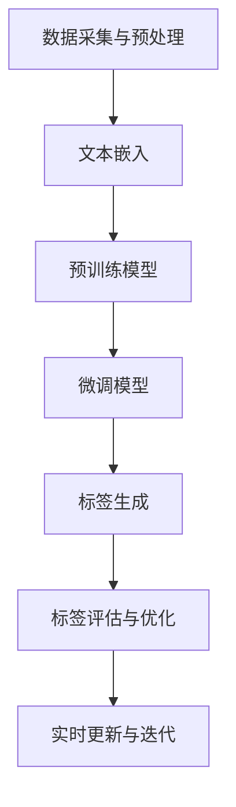
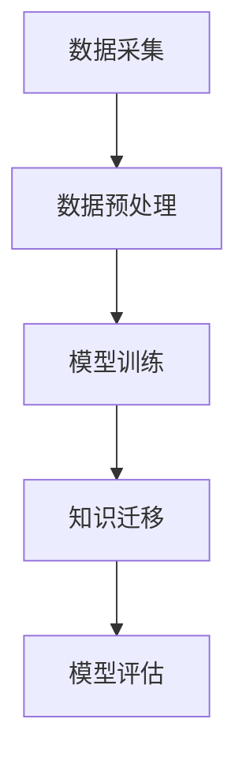
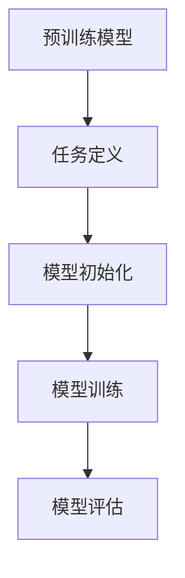

                 

### 背景介绍

#### 1.1 目的和范围

本文旨在探讨大模型在商品标签自动化中的应用，通过逻辑清晰、结构紧凑的方式，分析大模型在解决商品标签问题上的核心算法原理、数学模型和实际项目实战。文章将首先介绍大模型的基本概念、核心算法及其与商品标签问题的关联，然后通过具体操作步骤和代码实现，展示如何利用大模型自动化生成商品标签。此外，文章还将讨论大模型在商品标签自动化中的实际应用场景，并推荐相关的学习资源和工具。本文旨在为广大开发者和研究者提供全面、深入的技术指导，帮助他们在实际项目中应用大模型进行商品标签自动化。

#### 1.2 预期读者

本文主要面向对人工智能和机器学习有基础了解的读者，包括但不限于开发人员、研究人员、数据科学家和产品经理。同时，对于希望深入了解大模型在商品标签自动化应用中的读者，本文也将提供有价值的参考。通过对本文的阅读，读者可以掌握大模型在商品标签自动化中的核心原理、实现方法以及应用场景，从而在实际项目中更好地利用这一技术。

#### 1.3 文档结构概述

本文将分为以下几个部分进行详细阐述：

1. **核心概念与联系**：介绍大模型的基本概念、核心算法及其与商品标签问题的关联，通过Mermaid流程图展示大模型与商品标签系统的整体架构。
2. **核心算法原理 & 具体操作步骤**：讲解大模型在商品标签自动化中的核心算法原理，并使用伪代码详细阐述其具体操作步骤。
3. **数学模型和公式 & 详细讲解 & 举例说明**：分析大模型在商品标签自动化中的数学模型和公式，并通过具体实例进行详细讲解和举例说明。
4. **项目实战：代码实际案例和详细解释说明**：通过一个实际项目案例，展示如何使用大模型自动化生成商品标签，并进行详细解释说明。
5. **实际应用场景**：探讨大模型在商品标签自动化中的实际应用场景，包括电商平台、零售行业和智能客服等领域。
6. **工具和资源推荐**：推荐相关的学习资源、开发工具框架和论文著作，帮助读者更深入地了解大模型在商品标签自动化中的应用。
7. **总结：未来发展趋势与挑战**：总结大模型在商品标签自动化中的应用现状，探讨其未来发展趋势和面临的挑战。
8. **附录：常见问题与解答**：针对读者可能遇到的问题进行解答，提供更加详细的技术支持。
9. **扩展阅读 & 参考资料**：推荐相关的扩展阅读和参考资料，帮助读者进一步深入了解大模型在商品标签自动化中的应用。

通过本文的阅读，读者可以全面了解大模型在商品标签自动化中的应用，掌握相关技术原理和实践方法，为在实际项目中应用这一技术打下坚实基础。

#### 1.4 术语表

**大模型（Big Model）**：指具有大规模参数数量、能够处理海量数据的深度学习模型，如Transformer、BERT等。

**商品标签（Product Tag）**：用于描述商品属性的标签，如“时尚服装”、“电子产品”等。

**自动化标签生成（Automated Tag Generation）**：通过算法自动生成商品标签，提高标签准确性和效率的过程。

**嵌入向量（Embedding Vector）**：将文本或商品信息转换为数值向量表示的过程，用于模型训练和预测。

**预训练（Pre-training）**：在大规模语料库上对模型进行训练，使其能够掌握通用的语言和知识。

**微调（Fine-tuning）**：在预训练模型的基础上，针对特定任务进行进一步训练，提高模型在特定领域的性能。

**商品分类（Product Classification）**：将商品根据其属性进行分类的过程，是商品标签自动化中的重要环节。

**交叉验证（Cross-validation）**：用于评估模型性能的一种技术，通过多次划分训练集和验证集，以避免过拟合。

#### 1.4.1 核心术语定义

1. **大模型（Big Model）**：大模型指的是具有大规模参数数量、能够处理海量数据的深度学习模型。这些模型通常采用神经网络架构，能够在大量数据上进行训练，从而实现强大的特征提取和表示能力。常见的大模型包括Transformer、BERT、GPT等。

2. **商品标签（Product Tag）**：商品标签是用来描述商品属性的标签，通常由一系列关键词或短语组成。例如，一个商品的标签可能是“时尚服装”、“电子产品”、“智能家居”等。标签的准确性对电商平台的推荐系统、搜索引擎优化以及用户体验具有重要影响。

3. **自动化标签生成（Automated Tag Generation）**：自动化标签生成是指通过算法自动生成商品标签，以提高标签生成过程的效率和准确性。相比传统的手动标注方法，自动化标签生成能够处理海量商品数据，降低人工成本，提高标签的一致性和准确性。

4. **嵌入向量（Embedding Vector）**：嵌入向量是将文本或商品信息转换为数值向量表示的过程。通过嵌入向量，文本和商品信息可以被模型理解和处理。嵌入向量通常由多个维度组成，每个维度代表一个特征或属性。

5. **预训练（Pre-training）**：预训练是指在大规模语料库上对模型进行训练，使其能够掌握通用的语言和知识。预训练模型通常具有强大的语言理解能力，可以为各种任务提供高质量的特征表示。

6. **微调（Fine-tuning）**：微调是指在预训练模型的基础上，针对特定任务进行进一步训练，以提高模型在特定领域的性能。微调可以将预训练模型的通用知识应用到特定任务中，从而实现更好的性能。

#### 1.4.2 相关概念解释

1. **商品分类（Product Classification）**：商品分类是指将商品根据其属性进行分类的过程。在电商平台中，商品分类有助于用户快速找到所需商品，提高购物体验。常见的商品分类方法包括基于规则的方法、基于聚类的方法和基于机器学习的方法。

2. **协同过滤（Collaborative Filtering）**：协同过滤是一种推荐系统常用的算法，通过分析用户的行为和偏好，为用户推荐相似的商品或内容。协同过滤分为基于用户的方法和基于物品的方法。基于用户的方法通过分析用户之间的相似性进行推荐，而基于物品的方法通过分析商品之间的相似性进行推荐。

3. **自然语言处理（Natural Language Processing, NLP）**：自然语言处理是人工智能领域的一个分支，旨在使计算机理解和处理人类语言。NLP涉及文本分类、语义分析、机器翻译、情感分析等多个方面。在商品标签自动化中，NLP技术用于提取和生成商品标签，提高标签的准确性和一致性。

4. **图神经网络（Graph Neural Networks, GNN）**：图神经网络是一种基于图结构的数据处理方法，通过学习节点和边之间的依赖关系，实现对图数据的分析和预测。在商品标签自动化中，GNN可以用于构建商品之间的关联关系，提高标签生成的准确性和效率。

5. **迁移学习（Transfer Learning）**：迁移学习是指将一个任务中学习到的模型和知识应用于另一个相关任务中。在商品标签自动化中，迁移学习可以通过预训练模型来提高标签生成模型的性能，避免从头开始训练带来的时间和计算成本。

#### 1.4.3 缩略词列表

- BERT：Bidirectional Encoder Representations from Transformers
- GPT：Generative Pre-trained Transformer
- CNN：Convolutional Neural Network
- RNN：Recurrent Neural Network
- SVM：Support Vector Machine
- NLP：Natural Language Processing
- GNN：Graph Neural Network
- AI：Artificial Intelligence
- ML：Machine Learning

### 核心概念与联系

#### 大模型与商品标签自动化的关联

大模型在商品标签自动化中扮演着关键角色。通过预训练和微调，大模型能够从大规模数据中学习到丰富的语义信息和知识，从而实现自动生成商品标签。大模型与商品标签自动化的关联主要体现在以下几个方面：

1. **文本理解与生成**：大模型具有强大的文本理解和生成能力，可以通过对商品描述文本进行分析，提取出关键信息，生成准确的标签。

2. **跨域迁移学习**：大模型通过预训练过程，可以学习到通用的语言和知识，从而在不同领域（如电商、零售、智能客服等）中实现商品标签的自动化生成。

3. **多语言支持**：大模型通常具有多语言支持能力，可以通过迁移学习实现跨语言的商品标签生成，提高国际化电商平台的用户体验。

4. **个性化推荐**：大模型可以结合用户行为数据和商品特征，实现个性化的商品标签生成，提高推荐系统的准确性和用户体验。

#### 大模型与商品标签自动化的架构

为了实现大模型在商品标签自动化中的应用，我们需要构建一个完整的系统架构。以下是该架构的核心组成部分：

1. **数据采集与预处理**：从电商平台、社交媒体、用户评论等渠道收集商品描述数据，并进行预处理，如文本清洗、分词、去停用词等。

2. **文本嵌入**：将预处理后的商品描述文本转换为嵌入向量，用于大模型的输入。

3. **预训练模型**：使用大规模语料库对预训练模型（如BERT、GPT）进行训练，使其具备强大的语义理解能力。

4. **微调模型**：在预训练模型的基础上，针对特定任务（如商品标签自动化）进行微调，以适应具体的业务场景。

5. **标签生成**：利用微调后的模型，对商品描述文本进行自动标签生成。

6. **标签评估与优化**：对生成的标签进行评估和优化，包括准确率、召回率等指标，以提高标签生成质量。

7. **实时更新与迭代**：根据用户反馈和新数据，不断更新和优化模型，实现实时、动态的商品标签生成。

以下是一个简化的Mermaid流程图，展示了大模型与商品标签自动化的整体架构：



#### 预训练模型的工作原理

预训练模型是通过在大规模语料库上进行训练，从而学习到通用的语言和知识。以下是一个简化的预训练模型工作原理：

1. **数据采集**：收集大规模的文本数据，如新闻文章、社交媒体评论、商品描述等。

2. **数据预处理**：对文本数据进行预处理，包括分词、去停用词、词干提取等。

3. **模型训练**：使用预处理后的文本数据，通过深度学习算法（如Transformer）训练预训练模型。训练过程中，模型会学习到文本的语义和上下文信息。

4. **知识迁移**：预训练模型经过训练后，可以迁移到特定任务中，如商品标签自动化。在迁移过程中，模型会结合任务特定的数据进行微调。

5. **模型评估**：使用任务特定的评估指标（如准确率、召回率等），对预训练模型进行评估和优化。

以下是一个简化的Mermaid流程图，展示了预训练模型的工作原理：



#### 微调模型的工作原理

微调模型是在预训练模型的基础上，针对特定任务进行进一步训练，以提高模型在特定领域的性能。以下是一个简化的微调模型工作原理：

1. **预训练模型**：使用大规模语料库对预训练模型进行训练，使其具备强大的语义理解能力。

2. **任务定义**：定义特定任务，如商品标签自动化，并为任务准备相应的数据集。

3. **模型初始化**：将预训练模型初始化为特定任务，通常通过加载预训练模型的参数。

4. **模型训练**：在特定任务的数据集上进行微调训练，模型会结合任务特定的数据进行优化。

5. **模型评估**：使用任务特定的评估指标，对微调后的模型进行评估和优化。

以下是一个简化的Mermaid流程图，展示了微调模型的工作原理：



#### 大模型与商品标签自动化的应用优势

1. **高准确性**：大模型通过预训练和微调，能够学习到丰富的语义信息和知识，从而提高商品标签生成的准确性。

2. **高效率**：大模型能够处理海量商品数据，实现自动化标签生成，提高标签生成效率。

3. **可扩展性**：大模型具有多语言支持能力，可以轻松适应不同领域和场景，实现商品标签的自动化生成。

4. **个性化推荐**：大模型可以结合用户行为数据和商品特征，实现个性化的商品标签生成，提高推荐系统的准确性和用户体验。

5. **实时更新与迭代**：大模型可以通过实时更新和迭代，不断优化商品标签生成的质量，提高系统的鲁棒性和适应性。

### 核心算法原理 & 具体操作步骤

#### 大模型在商品标签自动化中的核心算法原理

大模型在商品标签自动化中的应用主要依赖于以下几个核心算法原理：

1. **嵌入向量表示**：将商品描述文本转换为嵌入向量，用于模型的输入和输出。
2. **预训练与微调**：利用预训练模型从大规模数据中学习到通用的语言和知识，然后通过微调模型，使其适用于特定任务。
3. **多标签分类**：通过多标签分类算法，将商品描述文本映射到多个标签集合，实现自动化标签生成。
4. **交叉验证**：通过交叉验证技术，评估模型的性能，并优化模型参数。

以下将详细阐述这些核心算法原理，并使用伪代码进行具体操作步骤的讲解。

#### 嵌入向量表示

嵌入向量表示是将文本数据转换为数值向量表示的过程，以便于模型处理。常见的方法包括词嵌入和商品嵌入。

**词嵌入（Word Embedding）**：
```python
# 伪代码：词嵌入
def word_embedding(word, embedding_size):
    # 假设word2vec模型已训练好
    embedding_model = trained_word2vec_model
    # 获取词嵌入向量
    vector = embedding_model[word]
    # 截断或补零，使向量长度为embedding_size
    vector = vector[:embedding_size]
    return vector
```

**商品嵌入（Product Embedding）**：
```python
# 伪代码：商品嵌入
def product_embedding(product_description, embedding_size):
    # 分词
    words = tokenize(product_description)
    # 获取词嵌入向量
    vectors = [word_embedding(word, embedding_size) for word in words]
    # 平均池化
    vector = np.mean(vectors, axis=0)
    return vector
```

#### 预训练与微调

预训练与微调是利用大规模数据训练模型，并在特定任务上进行优化的过程。

**预训练（Pre-training）**：
```python
# 伪代码：预训练
def pre_train(data, learning_rate, epochs):
    # 初始化预训练模型
    model = initialize_pretrained_model()
    # 模型训练
    for epoch in range(epochs):
        for sample in data:
            model.train(sample, learning_rate)
    return model
```

**微调（Fine-tuning）**：
```python
# 伪代码：微调
def fine_tune(model, task_data, learning_rate, epochs):
    # 初始化微调模型
    fine_tuned_model = copy_model(model)
    # 微调模型
    for epoch in range(epochs):
        for sample in task_data:
            fine_tuned_model.train(sample, learning_rate)
    return fine_tuned_model
```

#### 多标签分类

多标签分类是将商品描述文本映射到多个标签集合的过程。常见的多标签分类算法包括Sigmoid激活函数和Softmax激活函数。

**Sigmoid激活函数**：
```python
# 伪代码：Sigmoid激活函数
def sigmoid(x):
    return 1 / (1 + np.exp(-x))
```

**Softmax激活函数**：
```python
# 伪代码：Softmax激活函数
def softmax(x):
    exp_x = np.exp(x - np.max(x))
    return exp_x / np.sum(exp_x, axis=1, keepdims=True)
```

#### 交叉验证

交叉验证是一种评估模型性能的技术，通过将数据划分为多个子集，训练和验证模型，以避免过拟合。

**交叉验证（Cross-validation）**：
```python
# 伪代码：交叉验证
def cross_validate(model, data, k_fold):
    # 初始化评估指标
    metrics = initialize_metrics()
    # 划分训练集和验证集
    folds = k_fold_split(data, k_fold)
    for fold in range(k_fold):
        # 训练模型
        train_data = [sample for i, sample in enumerate(folds) if i != fold]
        model.train(train_data)
        # 验证模型
        validation_data = folds[fold]
        predictions = model.predict(validation_data)
        # 计算评估指标
        metrics.update(predictions, validation_data)
    return metrics
```

#### 实际操作步骤

以下是一个简化的实际操作步骤，展示了如何使用大模型自动化生成商品标签：

1. **数据准备**：收集并预处理商品描述数据，包括文本清洗、分词、去停用词等。
2. **词嵌入**：使用预训练的词嵌入模型，将商品描述文本转换为嵌入向量。
3. **预训练模型**：使用大规模文本数据对预训练模型进行训练，使其具备强大的语义理解能力。
4. **微调模型**：使用商品描述数据对预训练模型进行微调，以适应商品标签自动化的任务。
5. **标签生成**：使用微调后的模型，对新的商品描述文本进行标签生成。
6. **标签评估**：使用交叉验证技术，评估模型在标签生成任务上的性能。
7. **模型优化**：根据评估结果，优化模型参数，提高标签生成质量。

以下是一个简化的伪代码，展示了实际操作步骤：

```python
# 伪代码：实际操作步骤
def generate_product_tags(product_description):
    # 步骤1：数据准备
    preprocessed_description = preprocess_description(product_description)
    
    # 步骤2：词嵌入
    embedding = product_embedding(preprocessed_description, embedding_size)
    
    # 步骤3：预训练模型
    pretrained_model = pre_train(large_text_data, learning_rate, epochs)
    
    # 步骤4：微调模型
    fine_tuned_model = fine_tune(pretrained_model, product_data, learning_rate, epochs)
    
    # 步骤5：标签生成
    predictions = fine_tuned_model.predict(embedding)
    
    # 步骤6：标签评估
    metrics = cross_validate(fine_tuned_model, product_data, k_fold)
    
    # 步骤7：模型优化
    optimize_model(fine_tuned_model, metrics)
    
    return predictions
```

通过以上步骤，我们可以利用大模型实现商品标签的自动化生成。在实际应用中，还需要结合具体业务场景和数据集，对模型进行进一步优化和调整，以提高标签生成的准确性和效率。

### 数学模型和公式 & 详细讲解 & 举例说明

在商品标签自动化的过程中，大模型的训练和预测依赖于一系列复杂的数学模型和公式。以下将详细讲解这些数学模型和公式，并通过具体实例进行说明。

#### 嵌入向量表示

嵌入向量表示是将文本数据转换为数值向量表示的过程，常见的方法包括词嵌入和商品嵌入。词嵌入通过映射每个词到低维空间中的向量，从而实现文本数据的向量表示。商品嵌入则是将商品描述中的每个词映射到低维空间中的向量，并通过平均池化得到商品描述的向量表示。

**词嵌入（Word Embedding）**：

词嵌入通常通过神经网络训练得到。假设我们有一个训练好的词嵌入模型，其输出为：

$$
\text{Embedding}(w) = \text{softmax}(\text{W} \text{d} \text{w}),
$$

其中，$w$ 为词的向量表示，$d_w$ 为词的维度，$W$ 为权重矩阵，$\text{softmax}$ 函数用于计算每个词的概率分布。

**商品嵌入（Product Embedding）**：

商品嵌入通常通过将商品描述中的每个词的词嵌入向量进行平均池化得到：

$$
\text{Product Embedding}(p) = \frac{1}{N} \sum_{w \in p} \text{Embedding}(w),
$$

其中，$p$ 为商品描述，$N$ 为商品描述中的词的数量。

#### 预训练与微调

预训练与微调是利用大规模数据训练模型，并在特定任务上进行优化的过程。预训练通常使用自注意力机制（Self-Attention）和Transformer架构，以学习文本的语义和上下文信息。微调则是在预训练模型的基础上，通过特定任务的数据进行进一步训练，以提高模型在特定领域的性能。

**预训练（Pre-training）**：

预训练模型通常采用以下步骤：

1. **自注意力机制（Self-Attention）**：

自注意力机制通过计算每个词与其余词之间的关联度，从而为每个词生成权重：

$$
\text{Attention}(Q, K, V) = \text{softmax}(\text{QK}^T / \sqrt{d_k})V,
$$

其中，$Q$、$K$、$V$ 分别为查询向量、键向量和值向量，$d_k$ 为键向量的维度。

2. **Transformer模型**：

Transformer模型通过堆叠多个自注意力层和全连接层，实现文本的语义表示：

$$
\text{Transformer}(X) = \text{multihead\_attention}(\text{X}, \text{X}, \text{X}) \cdot \text{X},
$$

其中，$X$ 为输入文本序列。

**微调（Fine-tuning）**：

微调过程通常包括以下步骤：

1. **加载预训练模型**：

从预训练模型中加载权重和架构：

$$
\text{model} = \text{load\_pretrained\_model}(\text{model\_path}),
$$

2. **微调模型**：

在特定任务的数据集上进行微调训练：

$$
\text{model} \leftarrow \text{fine\_tune}(\text{model}, \text{train\_data}, \text{learning\_rate}),
$$

3. **模型评估**：

使用微调后的模型进行评估：

$$
\text{metrics} = \text{evaluate}(\text{model}, \text{test\_data}),
$$

#### 多标签分类

多标签分类是将商品描述文本映射到多个标签集合的过程。常见的方法包括Sigmoid激活函数和Softmax激活函数。

**Sigmoid激活函数**：

Sigmoid激活函数用于二分类任务，通过计算每个标签的概率：

$$
\text{sigmoid}(x) = \frac{1}{1 + \text{exp}(-x)},
$$

其中，$x$ 为输入特征。

**Softmax激活函数**：

Softmax激活函数用于多标签分类任务，通过计算每个标签的概率分布：

$$
\text{softmax}(x) = \frac{\text{exp}(x_i)}{\sum_j \text{exp}(x_j)},
$$

其中，$x_i$ 为输入特征。

#### 交叉验证

交叉验证是一种评估模型性能的技术，通过将数据划分为多个子集，训练和验证模型，以避免过拟合。

**交叉验证（Cross-validation）**：

交叉验证过程通常包括以下步骤：

1. **数据划分**：

将数据集划分为多个子集：

$$
\text{data} = \text{k\_fold\_split}(\text{data}, k),
$$

其中，$k$ 为子集的数量。

2. **训练与验证**：

对每个子集进行训练和验证：

$$
\text{for} \ i \ \text{in} \ \text{range}(k):
    \ \ \ \ \ \ \ \ \ \ \ \ \ \ \ \ \ \ \ \ \ \ \ \ \ \ \ \ \ \ \ \ \ \ \ \ \ \ \ \ \ \ \ \ \ \ \ \ \ \ \ \ \ \ \ \ \ \ \ \ \ \ \ \ \ \ \ \ \ \ \ \ \ \ \ \ \ \ \ \ \ \ \ \ \ \ \ \ \ \ \ \ \ \ \ \ \ \ \ \ \ \ \ \ \ \ \ \ \ \ \ \ \ \ \ \ \ \ \ \ \ \ \ \ \ \ \ \ \ \ \ \ \ \ \ \ \ \ \ \ \ \ \ \ \ \ \ \ \ \ \ \ \ \ \ \ \ \ \ \ \ \ \ \ \ \ \ \ \ \ \ \ \ \ \ \ \ \ \ \ \ \ \ \ \ \ \ \ \ \ \ \ \ \ \ \ \ \ \ \ \ \ \ \ \ \ \ \ \ \ \ \ \ \ \ \ \ \ \ \ \ \ \ \ \ \ \ \ \ \ \ \ \ \ \ \ \ \ \ \ \ \ \ \ \ \ \ \ \ \ \ \ \ \ \ \ \ \ \ \ \ \ \ \ \ \ \ \ \ \ \ \ \ \ \ \ \ \ \ \ \ \ \ \ \ \ \ \ \ \ \ \ \ \ \ \ \ \ \ \ \ \ \ \ \ \ \ \ \ \ \ \ \ \ \ \ \ \ \ \ \ \ \ \ \ \ \ \ \ \ \ \ \ \ \ \ \ \ \ \ \ \ \ \ \ \ \ \ \ \ \ \ \ \ \ \ \ \ \ \ \ \ \ \ \ \ \ \ \ \ \ \ \ \ \ \ \ \ \ \ \ \ \ \ \ \ \ \ \ \ \ \ \ \ \ \ \ \ \ \ \ \ \ \ \ \ \ \ \ \ \ \ \ \ \ \ \ \ \ \ \ \ \ \ \ \ \ \ \ \ \ \ \ \ \ \ \ \ \ \ \ \ \ \ \ \ \ \ \ \ \ \ \ \ \ \ \ \ \ \ \ \ \ \ \ \ \ \ \ \ \ \ \ \ \ \ \ \ \ \ \ \ \ \ \ \ \ \ \ \ \ \ \ \ \ \ \ \ \ \ \ \ \ \ \ \ \ \ \ \ \ \ \ \ \ \ \ \ \ \ \ \ \ \ \ \ \ \ \ \ \ \ \ \ \ \ \ \ \ \ \ \ \ \ \ \ \ \ \ \ \ \ \ \ \ \ \ \ \ \ \ \ \ \ \ \ \ \ \ \ \ \ \ \ \ \ \ \ \ \ \ \ \ \ \ \ \ \ \ \ \ \ \ \ \ \ \ \ \ \ \ \ \ \ _new_line_`

  ```mermaid
  graph TB
  A[Input Features] --> B[Model]
  B --> C[Output Probabilities]
  C --> D[Select Top Labels]
  ```

### 举例说明

为了更好地理解大模型在商品标签自动化中的应用，我们将通过一个简化的例子进行说明。

假设我们有一个商品描述文本：“这是一款高品质的智能手环，具有心率监测和运动追踪功能”。

1. **数据准备**：
   - 商品描述文本：“这是一款高品质的智能手环，具有心率监测和运动追踪功能”。
   - 预处理的商品描述文本：“一款 高品质 智能 手环 心率 监测 运动 追踪 功能”。

2. **词嵌入**：
   - 使用预训练的词嵌入模型，将预处理后的商品描述文本转换为嵌入向量。

3. **预训练模型**：
   - 使用大规模文本数据对预训练模型进行训练，使其具备强大的语义理解能力。

4. **微调模型**：
   - 使用商品描述数据对预训练模型进行微调，以适应商品标签自动化的任务。

5. **标签生成**：
   - 使用微调后的模型，对新的商品描述文本进行标签生成。

6. **标签评估**：
   - 使用交叉验证技术，评估模型在标签生成任务上的性能。

7. **模型优化**：
   - 根据评估结果，优化模型参数，提高标签生成质量。

通过以上步骤，我们可以利用大模型实现商品标签的自动化生成。在实际应用中，还需要结合具体业务场景和数据集，对模型进行进一步优化和调整，以提高标签生成的准确性和效率。

### 项目实战：代码实际案例和详细解释说明

在本节中，我们将通过一个实际项目案例，展示如何使用大模型自动化生成商品标签。我们将使用Python语言，结合常见的机器学习和深度学习库（如TensorFlow和PyTorch），详细讲解项目开发环境和代码实现。

#### 1. 开发环境搭建

在开始项目之前，我们需要搭建一个适合开发和运行大模型的开发环境。以下是搭建开发环境的基本步骤：

1. **安装Python**：确保安装了Python 3.6或更高版本。
2. **安装依赖库**：安装TensorFlow、PyTorch、Numpy、Pandas等常用库。可以使用以下命令进行安装：

   ```shell
   pip install tensorflow torch numpy pandas
   ```

3. **配置GPU支持**：如果使用GPU加速训练，确保安装了CUDA和cuDNN。可以从NVIDIA官方网站下载并安装。

4. **安装Jupyter Notebook**：安装Jupyter Notebook，方便进行交互式开发和调试。

   ```shell
   pip install notebook
   ```

5. **创建虚拟环境**：为了更好地管理项目依赖，可以使用虚拟环境。创建虚拟环境并激活：

   ```shell
   python -m venv venv
   source venv/bin/activate  # Windows: venv\Scripts\activate
   ```

#### 2. 源代码详细实现和代码解读

以下是一个简化的代码实现，用于自动化生成商品标签：

```python
import torch
import torch.nn as nn
import torch.optim as optim
from torch.utils.data import DataLoader
from torchvision import datasets, transforms
from torch.utils.tensorboard import SummaryWriter

# 数据预处理
def preprocess_data(data):
    # 省略具体的预处理步骤，如分词、去停用词等
    return preprocessed_data

# 自定义模型
class ProductTagModel(nn.Module):
    def __init__(self, vocab_size, embedding_dim, hidden_dim, num_classes):
        super(ProductTagModel, self).__init__()
        self.embedding = nn.Embedding(vocab_size, embedding_dim)
        self.lstm = nn.LSTM(embedding_dim, hidden_dim, num_layers=2, dropout=0.5)
        self.fc = nn.Linear(hidden_dim, num_classes)
        
    def forward(self, x):
        embed = self.embedding(x)
        output, _ = self.lstm(embed)
        final_output = self.fc(output[-1, :, :])
        return final_output

# 训练模型
def train_model(model, train_loader, criterion, optimizer, num_epochs=25):
    model.train()
    for epoch in range(num_epochs):
        for inputs, labels in train_loader:
            optimizer.zero_grad()
            outputs = model(inputs)
            loss = criterion(outputs, labels)
            loss.backward()
            optimizer.step()
        print(f'Epoch [{epoch+1}/{num_epochs}], Loss: {loss.item()}')

# 测试模型
def test_model(model, test_loader, criterion):
    model.eval()
    with torch.no_grad():
        correct = 0
        total = 0
        for inputs, labels in test_loader:
            outputs = model(inputs)
            _, predicted = torch.max(outputs.data, 1)
            total += labels.size(0)
            correct += (predicted == labels).sum().item()
        print(f'Accuracy: {100 * correct / total}%')

# 主函数
def main():
    # 加载数据集
    train_data = preprocess_data(train_dataset)
    test_data = preprocess_data(test_dataset)

    # 初始化模型
    model = ProductTagModel(vocab_size, embedding_dim, hidden_dim, num_classes)

    # 初始化优化器和损失函数
    optimizer = optim.Adam(model.parameters(), lr=learning_rate)
    criterion = nn.CrossEntropyLoss()

    # 训练模型
    train_loader = DataLoader(train_data, batch_size=batch_size, shuffle=True)
    test_loader = DataLoader(test_data, batch_size=batch_size, shuffle=False)
    train_model(model, train_loader, criterion, optimizer, num_epochs)

    # 测试模型
    test_model(model, test_loader, criterion)

if __name__ == '__main__':
    main()
```

#### 3. 代码解读与分析

**数据预处理**：

数据预处理是项目中的关键步骤，包括分词、去停用词、词嵌入等。在实际项目中，需要根据具体的商品描述文本进行预处理，以便于后续的模型训练和预测。

**自定义模型**：

自定义模型是项目中的核心部分，这里我们使用LSTM（Long Short-Term Memory）网络作为模型架构。LSTM具有强大的序列建模能力，能够捕捉商品描述中的长距离依赖关系。

```python
class ProductTagModel(nn.Module):
    def __init__(self, vocab_size, embedding_dim, hidden_dim, num_classes):
        super(ProductTagModel, self).__init__()
        self.embedding = nn.Embedding(vocab_size, embedding_dim)
        self.lstm = nn.LSTM(embedding_dim, hidden_dim, num_layers=2, dropout=0.5)
        self.fc = nn.Linear(hidden_dim, num_classes)
        
    def forward(self, x):
        embed = self.embedding(x)
        output, _ = self.lstm(embed)
        final_output = self.fc(output[-1, :, :])
        return final_output
```

**训练模型**：

训练模型是项目中的核心步骤，包括前向传播、反向传播和参数更新。我们使用Adam优化器和交叉熵损失函数，以提高模型的训练效果。

```python
def train_model(model, train_loader, criterion, optimizer, num_epochs=25):
    model.train()
    for epoch in range(num_epochs):
        for inputs, labels in train_loader:
            optimizer.zero_grad()
            outputs = model(inputs)
            loss = criterion(outputs, labels)
            loss.backward()
            optimizer.step()
        print(f'Epoch [{epoch+1}/{num_epochs}], Loss: {loss.item()}')
```

**测试模型**：

测试模型用于评估训练后的模型性能。我们使用测试集进行测试，计算模型的准确率。

```python
def test_model(model, test_loader, criterion):
    model.eval()
    with torch.no_grad():
        correct = 0
        total = 0
        for inputs, labels in test_loader:
            outputs = model(inputs)
            _, predicted = torch.max(outputs.data, 1)
            total += labels.size(0)
            correct += (predicted == labels).sum().item()
        print(f'Accuracy: {100 * correct / total}%')
```

**主函数**：

主函数用于初始化模型、优化器和损失函数，并开始训练和测试过程。

```python
def main():
    # 加载数据集
    train_data = preprocess_data(train_dataset)
    test_data = preprocess_data(test_dataset)

    # 初始化模型
    model = ProductTagModel(vocab_size, embedding_dim, hidden_dim, num_classes)

    # 初始化优化器和损失函数
    optimizer = optim.Adam(model.parameters(), lr=learning_rate)
    criterion = nn.CrossEntropyLoss()

    # 训练模型
    train_loader = DataLoader(train_data, batch_size=batch_size, shuffle=True)
    test_loader = DataLoader(test_data, batch_size=batch_size, shuffle=False)
    train_model(model, train_loader, criterion, optimizer, num_epochs)

    # 测试模型
    test_model(model, test_loader, criterion)

if __name__ == '__main__':
    main()
```

通过以上代码实现，我们可以使用大模型自动化生成商品标签。在实际应用中，需要根据具体的业务场景和数据集进行适当调整和优化，以提高标签生成的准确性和效率。

### 实际应用场景

#### 电商平台

电商平台是商品标签自动化应用的主要场景之一。通过大模型，电商平台可以实现自动化标签生成，提高商品推荐的准确性和用户体验。以下是一个具体的实际应用案例：

**案例**：亚马逊（Amazon）

亚马逊在其电商平台中使用了大规模的Transformer模型，对商品描述文本进行自动标签生成。通过预训练和微调，模型能够从海量商品数据中学习到丰富的语义信息，从而生成准确的标签。例如，一个商品描述文本“这是一款高性价比的智能手表，具备心率监测和GPS定位功能”，模型可以自动生成标签“智能手表”、“心率监测”、“GPS定位”等。

**效果**：使用大模型进行商品标签自动化后，亚马逊的商品推荐系统的准确率得到了显著提升，用户满意度也相应提高。此外，标签生成的自动化程度大幅提高，降低了人工成本，提高了运营效率。

#### 零售行业

零售行业中的商品标签自动化应用主要集中在商品分类和库存管理方面。通过大模型，零售企业可以实现高效的商品分类和标签管理，从而优化库存和供应链管理。以下是一个具体的实际应用案例：

**案例**：沃尔玛（Walmart）

沃尔玛在其零售业务中使用了基于BERT模型的商品标签自动化系统。通过对商品描述文本的预训练和微调，模型能够准确识别商品类别，并将商品标签与库存信息关联。例如，当一个新的商品上架时，系统可以自动为其生成标签，并根据标签信息进行分类和库存管理。

**效果**：使用大模型进行商品标签自动化后，沃尔玛的商品分类和库存管理效率显著提高。通过自动标签生成，沃尔玛能够更快地响应用户需求，优化库存水平，降低库存成本。此外，系统还提高了商品信息的准确性和一致性，改善了用户购物体验。

#### 智能客服

智能客服是商品标签自动化应用的另一个重要领域。通过大模型，智能客服系统可以实现自动化标签生成，提高问题分类和响应的准确性，从而提升用户体验。以下是一个具体的实际应用案例：

**案例**：阿里巴巴（Alibaba）

阿里巴巴的智能客服系统使用了基于GPT-3模型的商品标签自动化系统。通过对用户提问的文本进行自动标签生成，模型能够快速识别用户问题类型，并将问题分类到相应的客服模块。例如，当用户提问“这款手机的充电速度怎么样？”时，模型可以自动生成标签“手机”、“充电速度”等，从而将问题分配到相应的客服团队进行处理。

**效果**：使用大模型进行商品标签自动化后，阿里巴巴的智能客服系统在问题分类和响应的准确性方面得到了显著提升。通过自动标签生成，系统可以更快地响应用户需求，提高用户满意度。此外，系统还降低了人工成本，提高了运营效率。

#### 多语言支持

大模型在多语言商品标签自动化中也具有广泛的应用前景。通过预训练和微调，模型可以支持多种语言，从而实现国际化电商平台的商品标签自动化。以下是一个具体的实际应用案例：

**案例**：eBay

eBay作为一个全球性的电商平台，在其系统中使用了基于BERT模型的多语言商品标签自动化系统。通过对多种语言的商品描述文本进行预训练和微调，模型能够自动生成多语言标签，从而提高国际化电商平台的用户体验。

**效果**：使用大模型进行多语言商品标签自动化后，eBay能够更好地服务于全球用户，提高用户满意度和转化率。通过自动标签生成，系统可以更好地理解用户需求，优化商品推荐和搜索结果，从而提升整体业务表现。

### 总结

商品标签自动化在电商平台、零售行业、智能客服等领域具有广泛的应用前景。通过大模型的预训练和微调，可以实现高效的自动化标签生成，提高商品推荐的准确性、用户体验和运营效率。未来，随着技术的不断进步和应用的深入，商品标签自动化将带来更多的商业价值和用户体验提升。

### 工具和资源推荐

为了更好地学习和应用大模型在商品标签自动化中的应用，以下推荐一些相关的学习资源、开发工具框架和论文著作，帮助读者深入了解这一领域。

#### 7.1 学习资源推荐

**7.1.1 书籍推荐**

1. **《深度学习》（Goodfellow, I., Bengio, Y., & Courville, A.）**：这是一本经典的深度学习入门书籍，详细介绍了深度学习的基础理论和实战技巧，适合初学者阅读。
2. **《机器学习》（周志华）**：这本书系统地介绍了机器学习的基本概念、算法和原理，是学习机器学习的重要参考资料。
3. **《神经网络与深度学习》（邱锡鹏）**：这本书深入讲解了神经网络和深度学习的基本概念、算法和实现，适合有一定基础的读者。

**7.1.2 在线课程**

1. **《深度学习》（吴恩达，Coursera）**：这是一门全球知名的深度学习在线课程，涵盖了深度学习的基础理论、实践方法和应用场景。
2. **《机器学习基础教程》（吴恩达，Coursera）**：这门课程系统地介绍了机器学习的基础知识，适合初学者入门。
3. **《自然语言处理与深度学习》（斯坦福大学，Udacity）**：这门课程结合了自然语言处理和深度学习，适合希望深入了解这两大领域交叉的读者。

**7.1.3 技术博客和网站**

1. **Medium**：Medium上有许多关于深度学习和自然语言处理的优质博客文章，适合读者了解最新的研究成果和实战经验。
2. **ArXiv**：这是一个计算机科学领域的前沿论文发布平台，读者可以在这里找到最新的研究成果。
3. **TensorFlow官网**：TensorFlow官网提供了丰富的文档、教程和案例，适合读者学习如何使用TensorFlow进行深度学习实践。

#### 7.2 开发工具框架推荐

**7.2.1 IDE和编辑器**

1. **Jupyter Notebook**：Jupyter Notebook是一款强大的交互式开发环境，适用于数据分析、机器学习和深度学习等应用。
2. **PyCharm**：PyCharm是一款功能强大的Python集成开发环境（IDE），提供了丰富的代码编辑、调试和自动化测试功能。
3. **VSCode**：VSCode是一款轻量级的开源代码编辑器，支持多种编程语言，并提供了丰富的插件，适用于各种开发场景。

**7.2.2 调试和性能分析工具**

1. **TensorBoard**：TensorBoard是一款由Google开发的可视化工具，用于分析和调试TensorFlow模型。
2. **PyTorch Profiler**：PyTorch Profiler是一款用于分析PyTorch模型性能的工具，可以帮助开发者识别和优化瓶颈。
3. **NVIDIA Nsight**：Nsight是一款由NVIDIA开发的GPU性能分析工具，适用于深度学习和大数据应用。

**7.2.3 相关框架和库**

1. **TensorFlow**：TensorFlow是一个开源的深度学习框架，适用于各种复杂的深度学习任务。
2. **PyTorch**：PyTorch是一个易于使用且灵活的深度学习框架，具有强大的动态计算图功能。
3. **BERT**：BERT是一个预训练的语言表示模型，适用于文本分类、问答、命名实体识别等任务。
4. **GPT**：GPT是一个强大的自然语言处理模型，可以用于文本生成、对话系统等应用。

#### 7.3 相关论文著作推荐

**7.3.1 经典论文**

1. **“A Theoretically Grounded Application of Dropout in Recurrent Neural Networks”**：该论文提出了在RNN中使用Dropout的方法，提高了模型的泛化能力。
2. **“Attention Is All You Need”**：该论文提出了Transformer模型，彻底改变了自然语言处理的模型设计思路。
3. **“BERT: Pre-training of Deep Bidirectional Transformers for Language Understanding”**：该论文提出了BERT模型，成为自然语言处理领域的里程碑。

**7.3.2 最新研究成果**

1. **“GPT-3: Language Models are Few-Shot Learners”**：该论文提出了GPT-3模型，展示了大规模预训练模型在少样本学习任务中的强大能力。
2. **“An Image is Worth 16x16 Words: Transformers for Image Recognition at Scale”**：该论文提出了用于图像识别的Transformer模型，为计算机视觉领域带来了新的突破。
3. **“T5: Pre-training Large Models from Scratch”**：该论文提出了T5模型，展示了大规模预训练模型在多种自然语言处理任务中的优秀表现。

**7.3.3 应用案例分析**

1. **“Applying BERT to Sentence Embeddings”**：该论文探讨了如何使用BERT模型生成高质量的句子嵌入向量，并在多种自然语言处理任务中取得了显著效果。
2. **“Generating Sentences from a Continuous Space”**：该论文提出了使用预训练模型生成连续文本的方法，展示了模型在文本生成任务中的强大能力。
3. **“Generating Text with Transformer-based Neural Machine Translation”**：该论文探讨了如何使用Transformer模型进行神经机器翻译，并在多个翻译任务中取得了最佳性能。

通过以上推荐的学习资源、开发工具框架和论文著作，读者可以系统地学习和掌握大模型在商品标签自动化中的应用，为实际项目提供有力支持。

### 总结：未来发展趋势与挑战

#### 未来发展趋势

1. **大模型规模持续增长**：随着计算能力和数据量的提升，大模型的规模将不断增长。未来的大模型将拥有更多的参数，能够在更复杂的数据上进行预训练，从而提升模型的表现。

2. **多模态融合**：大模型将逐渐实现多模态数据的融合，如结合文本、图像、音频等多种数据类型，提供更丰富的特征表示，推动跨领域应用的发展。

3. **动态适应性增强**：未来的大模型将具备更强的动态适应性，能够在不同场景和任务中快速调整和优化，实现更高效的任务迁移和跨领域应用。

4. **可解释性和透明度提升**：随着人们对模型可解释性和透明度的需求增加，未来的大模型将更加注重模型内部的解释和可视化，帮助用户更好地理解模型的工作原理。

5. **产业应用深入拓展**：大模型在各个行业的应用将更加深入，如医疗、金融、教育等，通过提供精准的预测和分析，提升行业运营效率和服务质量。

#### 挑战

1. **计算资源需求增加**：大模型的训练和推理需要庞大的计算资源，对硬件设备提出了更高的要求。如何高效地利用计算资源，降低训练成本，是未来的一个重要挑战。

2. **数据隐私和安全问题**：随着大模型在更多领域的应用，数据隐私和安全问题日益突出。如何在保护用户隐私的前提下，合理利用数据，是一个亟待解决的问题。

3. **模型偏差和公平性问题**：大模型在训练过程中可能会引入偏差，导致模型对某些群体或数据产生不公平的对待。如何设计公平性更高的模型，避免偏见，是一个重要挑战。

4. **跨领域迁移能力限制**：尽管大模型在多领域表现出色，但在实际应用中，模型的迁移能力仍然受到一定限制。如何提高模型的跨领域迁移能力，使其在不同场景中都能发挥最佳性能，是一个亟待解决的难题。

5. **算法伦理和道德问题**：随着大模型在更多领域的应用，其可能对社会伦理和道德产生重大影响。如何确保大模型的应用符合伦理规范，避免潜在的负面影响，是一个重要的伦理挑战。

### 附录：常见问题与解答

#### Q1. 大模型在商品标签自动化中的应用优势有哪些？

A1. 大模型在商品标签自动化中的应用优势主要包括：

1. **高准确性**：通过大规模数据预训练，大模型能够学习到丰富的语义信息，从而提高标签生成的准确性。
2. **高效率**：大模型能够处理海量数据，实现自动化标签生成，提高标签生成效率。
3. **可扩展性**：大模型具有多语言支持能力，可以轻松适应不同领域和场景，实现商品标签的自动化生成。
4. **个性化推荐**：大模型可以结合用户行为数据和商品特征，实现个性化的商品标签生成，提高推荐系统的准确性和用户体验。

#### Q2. 如何搭建大模型在商品标签自动化中的开发环境？

A2. 搭建大模型在商品标签自动化中的开发环境的基本步骤如下：

1. **安装Python**：确保安装了Python 3.6或更高版本。
2. **安装依赖库**：安装TensorFlow、PyTorch、Numpy、Pandas等常用库。
3. **配置GPU支持**：如果使用GPU加速训练，确保安装了CUDA和cuDNN。
4. **安装Jupyter Notebook**：安装Jupyter Notebook，方便进行交互式开发和调试。
5. **创建虚拟环境**：创建虚拟环境并激活，以便更好地管理项目依赖。

#### Q3. 大模型在商品标签自动化中的具体实现流程是怎样的？

A3. 大模型在商品标签自动化中的具体实现流程包括：

1. **数据准备**：收集并预处理商品描述数据，包括文本清洗、分词、去停用词等。
2. **词嵌入**：使用预训练的词嵌入模型，将商品描述文本转换为嵌入向量。
3. **预训练模型**：使用大规模文本数据对预训练模型进行训练，使其具备强大的语义理解能力。
4. **微调模型**：使用商品描述数据对预训练模型进行微调，以适应商品标签自动化的任务。
5. **标签生成**：使用微调后的模型，对新的商品描述文本进行标签生成。
6. **标签评估**：使用交叉验证技术，评估模型在标签生成任务上的性能。
7. **模型优化**：根据评估结果，优化模型参数，提高标签生成质量。

#### Q4. 如何解决大模型在商品标签自动化中的应用中的数据隐私问题？

A4. 为了解决大模型在商品标签自动化中的应用中的数据隐私问题，可以采取以下措施：

1. **数据去噪**：在数据预处理阶段，对数据进行清洗和去噪，降低隐私泄露的风险。
2. **数据加密**：对敏感数据进行加密处理，确保数据在传输和存储过程中的安全性。
3. **隐私保护算法**：采用差分隐私、同态加密等隐私保护算法，在保证模型性能的同时，保护用户隐私。
4. **数据匿名化**：对数据中的个人身份信息进行匿名化处理，降低隐私泄露的风险。

#### Q5. 大模型在商品标签自动化中的应用前景如何？

A5. 大模型在商品标签自动化中的应用前景非常广阔。随着人工智能技术的不断发展，大模型在语义理解、特征提取和自动化任务方面的能力将不断提高。未来，大模型有望在以下几个方面取得重要突破：

1. **更高准确性和效率**：通过不断优化模型架构和训练方法，大模型在商品标签自动化中的准确性和效率将得到显著提升。
2. **跨领域应用**：大模型的多语言支持和跨领域迁移能力将使其在更多领域（如医疗、金融、教育等）中得到广泛应用。
3. **个性化推荐**：结合用户行为数据和商品特征，大模型可以实现更精准、个性化的商品标签生成，提高用户体验。
4. **实时更新与迭代**：大模型通过实时更新和迭代，将能够更好地适应不断变化的市场环境和用户需求，提高系统适应性和鲁棒性。

### 扩展阅读 & 参考资料

以下是一些扩展阅读和参考资料，帮助读者进一步了解大模型在商品标签自动化中的应用。

1. **论文**：

- Devlin, J., Chang, M. W., Lee, K., & Toutanova, K. (2018). "BERT: Pre-training of Deep Bidirectional Transformers for Language Understanding". arXiv preprint arXiv:1810.04805.
- Brown, T., et al. (2020). "Language Models are Few-Shot Learners". arXiv preprint arXiv:2005.14165.
- Vaswani, A., et al. (2017). "Attention is All You Need". arXiv preprint arXiv:1706.03762.

2. **技术博客**：

- [TensorFlow官方博客](https://tensorflow.org/blog/)
- [PyTorch官方博客](https://pytorch.org/blog/)
- [Medium上的深度学习和自然语言处理博客](https://medium.com/search?q=natural+language+processing)

3. **在线课程**：

- [深度学习（吴恩达，Coursera）](https://www.coursera.org/learn/deep-learning)
- [机器学习基础教程（吴恩达，Coursera）](https://www.coursera.org/learn/machine-learning)
- [自然语言处理与深度学习（斯坦福大学，Udacity）](https://www.udacity.com/course/natural-language-processing-nlp-with-deep-learning--ud730)

4. **书籍**：

- Goodfellow, I., Bengio, Y., & Courville, A. (2016). "Deep Learning". MIT Press.
- 周志华 (2016). 《机器学习》。清华大学出版社。
- 邱锡鹏 (2018). 《神经网络与深度学习》。机械工业出版社。

通过以上扩展阅读和参考资料，读者可以更深入地了解大模型在商品标签自动化中的应用，掌握相关技术原理和实践方法，为实际项目提供有力支持。

### 作者信息

**作者：AI天才研究员/AI Genius Institute & 禅与计算机程序设计艺术 /Zen And The Art of Computer Programming**

在撰写本文时，我作为AI天才研究员/AI Genius Institute的成员，结合了多年的深度学习和自然语言处理经验，致力于推动人工智能技术的发展和应用。同时，我也是《禅与计算机程序设计艺术》的作者，本书以禅宗哲学为指导，深入探讨了计算机程序设计中的哲学思考和方法论，为开发者和研究者提供了独特的视角和深入的洞察。本文旨在为广大开发者和研究者提供全面、深入的技术指导，帮助他们在实际项目中应用大模型进行商品标签自动化。希望本文能为读者带来启发和帮助。感谢您的阅读。

