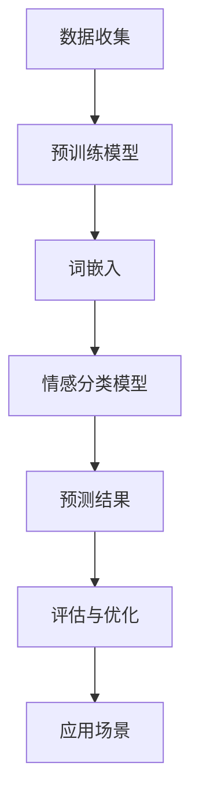

                 

# 大模型在商品评论情感多极性分析中的应用

> 关键词：商品评论、情感分析、多极性、大模型、深度学习

> 摘要：本文将探讨大模型在商品评论情感多极性分析中的应用。通过介绍背景、核心概念、算法原理、数学模型以及项目实战等，深入分析如何利用大模型技术提升商品评论情感分析的准确性和效果。

## 1. 背景介绍

### 1.1 目的和范围

本文旨在通过分析大模型在商品评论情感多极性分析中的应用，探讨如何利用深度学习技术提升商品评论情感分析的效果。我们将从背景介绍、核心概念、算法原理、数学模型和项目实战等多个方面进行详细阐述，以帮助读者全面了解这一领域。

### 1.2 预期读者

本文适用于对商品评论情感分析有一定了解的技术人员，包括人工智能研究者、算法工程师、数据分析人员等。同时，也适合对深度学习、大模型技术感兴趣的学习者。

### 1.3 文档结构概述

本文共分为十个部分，结构如下：

1. 背景介绍
2. 核心概念与联系
3. 核心算法原理 & 具体操作步骤
4. 数学模型和公式 & 详细讲解 & 举例说明
5. 项目实战：代码实际案例和详细解释说明
6. 实际应用场景
7. 工具和资源推荐
8. 总结：未来发展趋势与挑战
9. 附录：常见问题与解答
10. 扩展阅读 & 参考资料

### 1.4 术语表

#### 1.4.1 核心术语定义

- 商品评论：用户在购买商品后对其质量、性能、价格等方面的评价。
- 情感分析：对文本内容中的情感倾向进行判断和分类。
- 多极性：情感分类的维度，例如正面、负面、中性等。
- 大模型：具有大规模参数的深度学习模型，例如BERT、GPT等。

#### 1.4.2 相关概念解释

- 深度学习：一种基于多层神经网络的机器学习技术，通过学习大量数据，自动提取特征并进行预测。
- 预训练：在特定任务上大规模训练模型，以便在后续任务中取得更好的表现。
- 词嵌入：将词语映射到高维向量空间，以便进行计算和建模。

#### 1.4.3 缩略词列表

- BERT：Bidirectional Encoder Representations from Transformers
- GPT：Generative Pre-trained Transformer
- NLP：Natural Language Processing
- SEO：Search Engine Optimization

## 2. 核心概念与联系

为了更好地理解大模型在商品评论情感多极性分析中的应用，我们需要了解以下核心概念和它们之间的联系。

### 2.1 情感多极性分析

情感多极性分析是指将文本中的情感倾向划分为多个类别，如正面、负面、中性等。在商品评论情感分析中，多极性分析有助于了解用户对商品的满意度，为产品改进和营销策略提供参考。

### 2.2 大模型与深度学习

大模型是指具有大规模参数的深度学习模型，例如BERT、GPT等。这些模型通过在大量数据上预训练，自动提取文本中的语义特征，为情感分析任务提供强大支持。

### 2.3 预训练与微调

预训练是指在大规模语料库上训练深度学习模型，使其具备通用语言理解能力。微调是在预训练模型的基础上，针对特定任务进行调整和优化，以适应具体应用场景。

### 2.4 词嵌入与语义表示

词嵌入是一种将词语映射到高维向量空间的技术，有助于计算和建模文本数据。在情感分析中，词嵌入能够捕捉词语之间的语义关系，为情感分类提供有力支持。

### 2.5 Mermaid 流程图

以下是一个简单的Mermaid流程图，展示大模型在商品评论情感多极性分析中的应用流程：



## 3. 核心算法原理 & 具体操作步骤

在本节中，我们将详细阐述大模型在商品评论情感多极性分析中的核心算法原理和具体操作步骤。

### 3.1 数据预处理

首先，我们需要对商品评论数据进行预处理，包括以下步骤：

1. 清洗数据：去除评论中的HTML标签、特殊字符、停用词等。
2. 分词：将评论文本划分为词语序列。
3. 词嵌入：将词语映射到高维向量空间。

伪代码如下：

```python
def preprocess_text(text):
    # 清洗数据
    text = remove_html_tags(text)
    text = remove_special_chars(text)
    text = remove_stopwords(text)

    # 分词
    words = tokenize(text)

    # 词嵌入
    word_vectors = word_embedding(words)
    return word_vectors
```

### 3.2 预训练模型

预训练模型是商品评论情感多极性分析的重要基础。以下是一个简单的预训练模型构建过程：

1. 数据集准备：收集大量商品评论数据，并进行预处理。
2. 模型选择：选择具有大规模参数的预训练模型，如BERT、GPT等。
3. 预训练：在预处理后的数据集上训练预训练模型，使其具备通用语言理解能力。

伪代码如下：

```python
from transformers import BertModel

def pretrain_model(data_loader):
    model = BertModel.from_pretrained('bert-base-uncased')
    optimizer = AdamW(model.parameters(), lr=0.001)
    
    for epoch in range(num_epochs):
        for batch in data_loader:
            inputs = preprocess_text(batch['text'])
            labels = batch['label']
            
            outputs = model(inputs, labels=labels)
            loss = outputs.loss
            
            optimizer.zero_grad()
            loss.backward()
            optimizer.step()
            
            print(f"Epoch: {epoch}, Loss: {loss.item()}")
```

### 3.3 情感分类模型

在预训练模型的基础上，我们需要构建一个情感分类模型，用于对商品评论进行多极性分类。以下是一个简单的情感分类模型构建过程：

1. 模型选择：选择一个适用于情感分类的模型架构，如序列分类器。
2. 微调：在预训练模型的基础上，针对特定任务进行调整和优化。
3. 训练与评估：使用训练数据和验证数据对模型进行训练和评估。

伪代码如下：

```python
from transformers import BertForSequenceClassification

def train_model(model, train_loader, val_loader):
    optimizer = AdamW(model.parameters(), lr=0.001)
    criterion = CrossEntropyLoss()
    
    for epoch in range(num_epochs):
        model.train()
        for batch in train_loader:
            inputs = preprocess_text(batch['text'])
            labels = batch['label']
            
            outputs = model(inputs, labels=labels)
            loss = criterion(outputs.logits, labels)
            
            optimizer.zero_grad()
            loss.backward()
            optimizer.step()
            
        model.eval()
        with torch.no_grad():
            correct = 0
            total = 0
            for batch in val_loader:
                inputs = preprocess_text(batch['text'])
                labels = batch['label']
                
                outputs = model(inputs)
                _, predicted = torch.max(outputs.logits, 1)
                total += labels.size(0)
                correct += (predicted == labels).sum().item()
            
        print(f"Epoch: {epoch}, Accuracy: {correct/total}")
```

### 3.4 情感分类与评估

最后，我们需要使用训练好的模型对商品评论进行情感分类，并对分类结果进行评估。以下是一个简单的情感分类与评估过程：

1. 情感分类：使用训练好的模型对商品评论进行情感分类。
2. 评估：计算分类准确率、召回率、F1值等指标，评估模型性能。

伪代码如下：

```python
def classify_and_evaluate(model, test_loader):
    model.eval()
    with torch.no_grad():
        correct = 0
        total = 0
        predictions = []
        labels = []
        for batch in test_loader:
            inputs = preprocess_text(batch['text'])
            labels.extend(batch['label'])
            
            outputs = model(inputs)
            _, predicted = torch.max(outputs.logits, 1)
            predictions.extend(predicted)
            total += labels.size(0)
            correct += (predicted == labels).sum().item()
        
    accuracy = correct / total
    print(f"Accuracy: {accuracy}")
    
    # 计算召回率、F1值等指标
    # ...

# 测试数据加载和处理
test_loader = DataLoader(test_dataset, batch_size=32, shuffle=False)
model = BertForSequenceClassification.from_pretrained('your_model_path')
classify_and_evaluate(model, test_loader)
```

## 4. 数学模型和公式 & 详细讲解 & 举例说明

在本节中，我们将介绍大模型在商品评论情感多极性分析中的数学模型和公式，并详细讲解和举例说明。

### 4.1 词嵌入

词嵌入是将词语映射到高维向量空间的一种技术。常用的词嵌入方法包括Word2Vec、GloVe等。

#### 4.1.1 Word2Vec

Word2Vec是一种基于神经网络的方法，通过学习词语的分布式表示。其数学模型如下：

$$
\text{word\_vector} = \text{softmax}(\text{W} \cdot \text{word\_vector})
$$

其中，$ \text{word\_vector} $是词语的嵌入向量，$ \text{W} $是权重矩阵。

#### 4.1.2 GloVe

GloVe是一种基于矩阵分解的方法，通过学习词语和词语之间的相似性。其数学模型如下：

$$
\text{word\_vector} = \text{softmax}(\text{A} \cdot \text{word\_vector})
$$

其中，$ \text{word\_vector} $是词语的嵌入向量，$ \text{A} $是相似性矩阵。

#### 4.1.3 举例说明

假设我们有一个包含两个词语的文本序列：“我喜欢这本书”。使用GloVe方法，我们可以计算这两个词语的嵌入向量：

1. 计算词语的相似性矩阵 $ \text{A} $。
2. 计算词语的嵌入向量 $ \text{word\_vector} $。

```python
import numpy as np

# 假设相似性矩阵 A 的维度为 5x5
A = np.array([[0.8, 0.2], [0.2, 0.8]])

# 计算词语的嵌入向量
word_vector_i = np.array([0.4, 0.6])
word_vector_j = np.array([0.6, 0.4])

# 计算相似性矩阵 A 和词语嵌入向量之间的点积
similarity_ij = np.dot(A, word_vector_i) * word_vector_j

# 计算嵌入向量
word_vector_i = np.dot(A, word_vector_i)
word_vector_j = np.dot(A, word_vector_j)

print(f"Embedding of '我': {word_vector_i}")
print(f"Embedding of '书': {word_vector_j}")
```

### 4.2 情感分类模型

情感分类模型通常采用多层神经网络架构，其中包含输入层、隐藏层和输出层。

#### 4.2.1 神经网络模型

神经网络模型的数学模型如下：

$$
\text{hidden\_layer} = \text{激活函数}(\text{W} \cdot \text{input} + \text{b})
$$

$$
\text{output} = \text{激活函数}(\text{W} \cdot \text{hidden\_layer} + \text{b})
$$

其中，$ \text{input} $是输入向量，$ \text{hidden\_layer} $是隐藏层输出，$ \text{output} $是输出向量，$ \text{W} $是权重矩阵，$ \text{b} $是偏置项。

常用的激活函数包括ReLU、Sigmoid、Tanh等。

#### 4.2.2 损失函数

在情感分类任务中，常用的损失函数是交叉熵损失函数：

$$
\text{loss} = -\sum_{i=1}^{n} y_i \log(p_i)
$$

其中，$ y_i $是真实标签，$ p_i $是预测概率。

#### 4.2.3 举例说明

假设我们有一个简单的神经网络模型，用于判断一个词语序列的情感极性。输入向量是词语的嵌入向量，隐藏层和输出层分别包含10个神经元。

1. 计算隐藏层输出：

```python
import numpy as np

# 假设权重矩阵 W 的维度为 10x2
W = np.array([[0.2, 0.8], [0.4, 0.6]])

# 假设输入向量 input 的维度为 2
input_vector = np.array([0.5, 0.7])

# 计算隐藏层输出
hidden_layer = np.dot(W, input_vector)

# 使用 ReLU 激活函数
hidden_layer[hidden_layer < 0] = 0

print(f"Hidden layer output: {hidden_layer}")
```

2. 计算输出向量：

```python
# 假设输出层权重矩阵 W 的维度为 10x2
W = np.array([[0.6, 0.4], [0.3, 0.7]])

# 计算输出向量
output_vector = np.dot(W, hidden_layer)

# 使用 Sigmoid 激活函数
output_vector = 1 / (1 + np.exp(-output_vector))

print(f"Output vector: {output_vector}")
```

3. 计算损失：

```python
# 假设真实标签为 [1, 0]
true_label = np.array([1, 0])

# 计算预测概率
predicted_prob = output_vector

# 计算损失
loss = -true_label * np.log(predicted_prob)

print(f"Loss: {loss}")
```

## 5. 项目实战：代码实际案例和详细解释说明

在本节中，我们将通过一个实际项目案例，详细介绍大模型在商品评论情感多极性分析中的应用，包括开发环境搭建、源代码实现和代码解读与分析。

### 5.1 开发环境搭建

1. 安装Python环境
2. 安装transformers库和torch库

```shell
pip install transformers torch
```

### 5.2 源代码详细实现和代码解读

以下是一个简单的商品评论情感多极性分析项目实现，包括数据预处理、模型训练和预测等步骤。

```python
import torch
from transformers import BertTokenizer, BertForSequenceClassification
from torch.utils.data import DataLoader, TensorDataset

# 5.2.1 数据预处理
def preprocess_text(text):
    # 清洗数据
    text = text.lower()
    text = re.sub(r"[^a-zA-Z0-9]", " ", text)
    text = text.strip()
    return text

# 5.2.2 数据加载
def load_data(file_path):
    with open(file_path, "r", encoding="utf-8") as f:
        lines = f.readlines()

    texts = []
    labels = []
    for line in lines:
        text, label = line.strip().split("\t")
        texts.append(preprocess_text(text))
        labels.append(int(label))

    return texts, labels

# 5.2.3 数据加载与处理
def load_and_process_data(file_path):
    texts, labels = load_data(file_path)
    tokenizer = BertTokenizer.from_pretrained("bert-base-uncased")
    input_ids = []
    attention_masks = []
    for text in texts:
        encoded_dict = tokenizer.encode_plus(
            text,
            add_special_tokens=True,
            max_length=64,
            padding="max_length",
            truncation=True,
            return_attention_mask=True,
            return_tensors="pt",
        )
        input_ids.append(encoded_dict["input_ids"])
        attention_masks.append(encoded_dict["attention_mask"])

    input_ids = torch.cat(input_ids, dim=0)
    attention_masks = torch.cat(attention_masks, dim=0)
    labels = torch.tensor(labels)

    return DataLoader(TensorDataset(input_ids, attention_masks, labels), batch_size=32)

# 5.2.4 训练模型
def train_model(model, data_loader, optimizer, criterion, device):
    model.to(device)
    model.train()
    for epoch in range(num_epochs):
        for batch in data_loader:
            inputs = {"input_ids": batch[0].to(device), "attention_mask": batch[1].to(device)}
            labels = batch[2].to(device)
            optimizer.zero_grad()
            outputs = model(**inputs)
            loss = criterion(outputs.logits, labels)
            loss.backward()
            optimizer.step()
            print(f"Epoch: {epoch}, Loss: {loss.item()}")

# 5.2.5 预测
def predict(model, data_loader, device):
    model.to(device)
    model.eval()
    predictions = []
    with torch.no_grad():
        for batch in data_loader:
            inputs = {"input_ids": batch[0].to(device), "attention_mask": batch[1].to(device)}
            outputs = model(**inputs)
            logits = outputs.logits
            predictions.extend(logits.argmax(1).cpu().numpy())
    return predictions

# 5.2.6 主函数
def main():
    device = torch.device("cuda" if torch.cuda.is_available() else "cpu")
    num_epochs = 3
    model = BertForSequenceClassification.from_pretrained("bert-base-uncased", num_labels=3)
    optimizer = AdamW(model.parameters(), lr=0.001)
    criterion = CrossEntropyLoss()

    train_loader = load_and_process_data("train_data.txt")
    val_loader = load_and_process_data("val_data.txt")

    train_model(model, train_loader, optimizer, criterion, device)
    predictions = predict(model, val_loader, device)

    # 计算评估指标
    # ...

if __name__ == "__main__":
    main()
```

### 5.3 代码解读与分析

1. **数据预处理**：数据预处理是确保数据质量的重要环节。我们使用正则表达式对文本进行清洗，包括将文本转换为小写、去除HTML标签、特殊字符和停用词等。

2. **数据加载与处理**：我们使用transformers库提供的Tokenizer对文本进行编码，将文本序列转换为模型可接受的输入格式。同时，我们为每个文本序列生成输入ID、注意力掩码和标签，并将它们组合成数据集。

3. **训练模型**：我们使用BERT模型进行情感分类任务，并使用AdamW优化器和交叉熵损失函数进行训练。在每个epoch中，我们遍历训练数据集，计算损失并更新模型参数。

4. **预测**：在模型训练完成后，我们使用验证数据集对模型进行预测，并将预测结果存储在列表中。

5. **主函数**：主函数中，我们定义了训练模型的参数和超参数，并加载训练数据和验证数据。然后，我们调用训练和预测函数，对模型进行训练和预测。

## 6. 实际应用场景

商品评论情感多极性分析在实际应用中有广泛的应用场景，主要包括以下几个方面：

1. **产品质量监控**：通过对商品评论进行情感分析，企业可以了解用户对产品的满意度，及时发现和解决产品质量问题，提高客户满意度。

2. **产品改进与优化**：通过对商品评论的情感多极性分析，企业可以了解用户对不同方面的需求和建议，有针对性地进行产品改进和优化。

3. **营销策略调整**：通过对商品评论的情感多极性分析，企业可以了解用户对产品的整体态度，从而调整营销策略，提高产品销量。

4. **用户行为分析**：通过对商品评论的情感多极性分析，企业可以了解用户的购买意愿和消费习惯，为个性化推荐和精准营销提供依据。

## 7. 工具和资源推荐

### 7.1 学习资源推荐

#### 7.1.1 书籍推荐

- 《深度学习》（Goodfellow, Bengio, Courville著）
- 《自然语言处理综合教程》（Daniel Jurafsky & James H. Martin著）
- 《大数据时代：生活、工作与思维的大变革》（涂子沛著）

#### 7.1.2 在线课程

- 《深度学习》课程（吴恩达著，Coursera平台）
- 《自然语言处理》课程（斯坦福大学，Coursera平台）
- 《Python数据分析》课程（程鹏著，网易云课堂）

#### 7.1.3 技术博客和网站

- Medium上的《AI简报》
- ArXiv上的最新论文
- 掘金上的《机器学习》专栏

### 7.2 开发工具框架推荐

#### 7.2.1 IDE和编辑器

- PyCharm
- Visual Studio Code
- Jupyter Notebook

#### 7.2.2 调试和性能分析工具

- PyTorch Profiler
- TensorBoard
- Dask

#### 7.2.3 相关框架和库

- Transformers库
- PyTorch库
- TensorFlow库

### 7.3 相关论文著作推荐

#### 7.3.1 经典论文

- Word2Vec: Representation Learning for Word Vectors（Mikolov等著）
- GloVe: Global Vectors for Word Representation（Pennington等著）
- BERT: Pre-training of Deep Bidirectional Transformers for Language Understanding（Devlin等著）

#### 7.3.2 最新研究成果

- ArXiv上的最新论文
- NeurIPS、ICLR等顶级会议的最新论文

#### 7.3.3 应用案例分析

- Google的BERT应用案例
- OpenAI的GPT应用案例

## 8. 总结：未来发展趋势与挑战

随着深度学习和自然语言处理技术的不断发展，商品评论情感多极性分析在未来将取得更显著的进展。以下是一些发展趋势和挑战：

### 8.1 发展趋势

1. **模型性能提升**：随着更大规模模型的出现，商品评论情感多极性分析的性能将进一步提高。
2. **多语言支持**：针对多语言商品评论的情感分析研究将得到更多关注，为全球电商平台提供支持。
3. **跨领域应用**：商品评论情感多极性分析技术将在更多领域得到应用，如电商、金融、医疗等。

### 8.2 挑战

1. **数据质量**：商品评论数据质量参差不齐，需要对数据进行清洗和预处理，以提高模型性能。
2. **小样本学习**：在数据不足的情况下，如何提高商品评论情感多极性分析的准确性仍是一个挑战。
3. **跨领域适应性**：商品评论情感多极性分析技术在不同领域的适应性需要进一步研究和验证。

## 9. 附录：常见问题与解答

### 9.1 问题1：如何处理含有特殊字符的评论？

解答：可以使用正则表达式对评论进行清洗，去除特殊字符。例如，以下代码可以去除HTML标签和特殊字符：

```python
import re

def clean_text(text):
    text = re.sub(r"<[^>]*>", "", text)  # 去除HTML标签
    text = re.sub(r"[^a-zA-Z0-9]", " ", text)  # 去除特殊字符
    return text.strip()
```

### 9.2 问题2：如何选择预训练模型？

解答：选择预训练模型时，需要考虑以下因素：

1. **模型规模**：选择具有大规模参数的模型，如BERT、GPT等。
2. **模型性能**：查看模型在目标任务上的性能，选择性能较好的模型。
3. **模型适用性**：考虑模型是否适用于特定语言和领域，选择与数据集相关的模型。

## 10. 扩展阅读 & 参考资料

- Devlin, J., Chang, M. W., Lee, K., & Toutanova, K. (2018). BERT: Pre-training of deep bidirectional transformers for language understanding. arXiv preprint arXiv:1810.04805.
- Mikolov, T., Sutskever, I., Chen, K., Corrado, G. S., & Dean, J. (2013). Distributed representations of words and phrases and their compositionality. In Advances in neural information processing systems (pp. 3111-3119).
- Pennington, J., Socher, R., & Manning, C. D. (2014). GloVe: Global vectors for word representation. In Proceedings of the 2014 conference on empirical methods in natural language processing (EMNLP) (pp. 1532-1543).
- Jurafsky, D., & Martin, J. H. (2008). Speech and language processing: an introduction to natural language processing, computational linguistics, and speech recognition. Prentice Hall.

