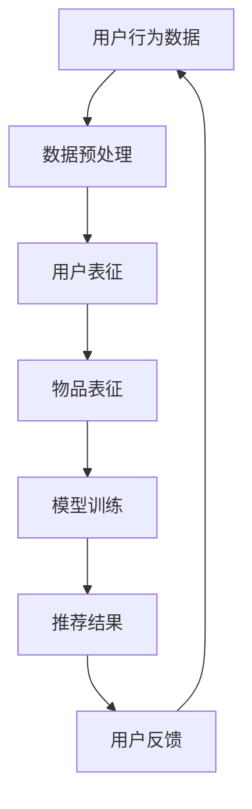
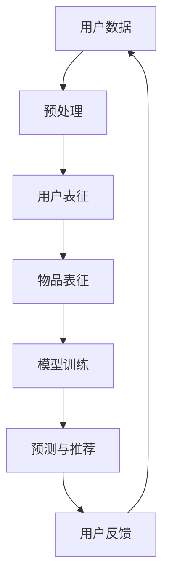

                 

# 大模型在推荐冷启动场景中的优势

> 关键词：大模型，推荐系统，冷启动，机器学习，数据驱动，用户行为分析

> 摘要：本文将探讨大模型在推荐系统冷启动场景中的优势，从核心概念、算法原理、数学模型、实战案例以及实际应用场景等多个维度，深入解析大模型如何通过深度学习等技术手段，有效解决新用户加入推荐系统所带来的数据稀缺性问题，提升推荐效果。

## 1. 背景介绍

### 1.1 目的和范围

本文旨在探讨大模型在推荐系统冷启动场景中的应用优势，旨在解决新用户数据稀缺、推荐效果不佳的问题。我们将从以下几个方面展开讨论：

- **核心概念与联系**：介绍大模型、推荐系统以及冷启动等关键概念，并通过流程图展示它们之间的关联。
- **核心算法原理**：详细讲解大模型在推荐系统中的算法原理，包括数据预处理、模型训练和模型评估等步骤。
- **数学模型和公式**：阐述大模型在推荐系统中涉及的数学模型和公式，如用户相似度计算、物品相似度计算等。
- **项目实战**：通过具体代码实现，展示大模型在推荐系统冷启动场景中的实际应用。
- **实际应用场景**：分析大模型在不同场景下的应用效果，如电子商务、社交媒体、内容推荐等。

### 1.2 预期读者

本文适用于以下读者群体：

- 推荐系统工程师和研究员，对推荐系统及其算法有深入理解。
- 机器学习工程师和研究员，对大模型及其应用场景有所了解。
- 对推荐系统冷启动问题感兴趣的读者，希望了解解决方案。

### 1.3 文档结构概述

本文分为以下几大部分：

- **第1章**：背景介绍，包括目的和范围、预期读者、文档结构概述等。
- **第2章**：核心概念与联系，介绍大模型、推荐系统和冷启动等概念。
- **第3章**：核心算法原理，详细讲解大模型在推荐系统中的算法原理。
- **第4章**：数学模型和公式，阐述大模型在推荐系统中涉及的数学模型和公式。
- **第5章**：项目实战，通过具体代码实现展示大模型在推荐系统冷启动场景中的应用。
- **第6章**：实际应用场景，分析大模型在不同场景下的应用效果。
- **第7章**：工具和资源推荐，介绍学习资源、开发工具框架和相关论文著作。
- **第8章**：总结，探讨大模型在未来发展趋势与挑战。
- **第9章**：附录，常见问题与解答。
- **第10章**：扩展阅读与参考资料，提供更多相关资料。

### 1.4 术语表

#### 1.4.1 核心术语定义

- **大模型**：指具有大规模参数和较大计算量的深度学习模型，如Transformer、BERT等。
- **推荐系统**：根据用户的历史行为和兴趣，自动为用户推荐相关内容的系统。
- **冷启动**：指新用户加入推荐系统时，由于缺乏足够的历史数据，难以进行准确推荐的情况。

#### 1.4.2 相关概念解释

- **深度学习**：一种机器学习方法，通过多层神经网络对数据进行特征提取和建模。
- **用户行为分析**：通过对用户在系统中的行为数据进行挖掘和分析，了解用户的兴趣和需求。
- **协同过滤**：一种基于用户和物品之间协同关系的推荐算法，常用于解决冷启动问题。

#### 1.4.3 缩略词列表

- **Transformer**：一种基于自注意力机制的深度学习模型。
- **BERT**：一种预训练的深度学习模型，能够理解和生成自然语言文本。

## 2. 核心概念与联系

在讨论大模型在推荐系统冷启动场景中的优势之前，我们需要先了解几个核心概念及其之间的联系。

### 2.1 大模型

大模型是指具有大规模参数和较大计算量的深度学习模型。随着计算能力的提升和大数据技术的发展，大模型在自然语言处理、计算机视觉等领域取得了显著成果。大模型通常具有以下几个特点：

1. **大规模参数**：大模型的参数数量远超传统机器学习模型，能够捕捉到数据中的复杂规律。
2. **自注意力机制**：大模型通常采用自注意力机制，能够自适应地关注数据中的重要特征。
3. **强大的表征能力**：大模型能够对输入数据进行高效的特征提取和表征，提高模型性能。

### 2.2 推荐系统

推荐系统是一种基于用户历史行为和兴趣，自动为用户推荐相关内容的系统。推荐系统的核心目标是提高用户的满意度和留存率，从而提升系统的商业价值。推荐系统可以分为以下几类：

1. **基于内容的推荐**：根据用户的历史兴趣和偏好，推荐与用户兴趣相关的物品。
2. **协同过滤推荐**：基于用户和物品之间的协同关系，推荐用户可能感兴趣的物品。
3. **混合推荐**：将基于内容和协同过滤推荐相结合，提高推荐效果。

### 2.3 冷启动

冷启动是指新用户加入推荐系统时，由于缺乏足够的历史数据，难以进行准确推荐的情况。冷启动问题主要包括以下两个方面：

1. **新用户冷启动**：指新用户由于缺乏历史行为数据，推荐系统无法准确了解其兴趣和需求。
2. **新物品冷启动**：指新物品由于缺乏用户评价和交互数据，推荐系统无法准确评估其质量和受欢迎程度。

### 2.4 大模型与推荐系统的关系

大模型与推荐系统有着密切的联系。大模型在推荐系统中的应用主要体现在以下几个方面：

1. **用户行为预测**：大模型能够对用户的行为进行准确预测，从而为新用户推荐相关内容。
2. **物品表征**：大模型能够对物品进行有效的表征，提高推荐系统的准确性。
3. **冷启动解决方案**：大模型能够通过迁移学习和多模态学习等技术，解决新用户和新物品的冷启动问题。

### 2.5 Mermaid 流程图

以下是一个简单的 Mermaid 流程图，展示大模型在推荐系统冷启动场景中的工作流程：



## 3. 核心算法原理 & 具体操作步骤

### 3.1 数据预处理

在推荐系统中，数据预处理是至关重要的一步。对于新用户，由于缺乏历史数据，我们需要从其他渠道获取数据，如用户的基本信息、兴趣标签等。具体步骤如下：

1. **数据收集**：从不同来源收集用户数据，包括用户基本信息、兴趣标签、行为日志等。
2. **数据清洗**：对收集到的数据进行清洗，去除重复、异常和噪声数据。
3. **数据整合**：将不同来源的数据进行整合，构建用户行为数据集。

### 3.2 用户表征

用户表征是将用户特征转化为模型可处理的形式。对于新用户，我们可以使用以下方法进行表征：

1. **基于属性的表征**：将用户的基本信息、兴趣标签等属性进行编码，如使用嵌入向量表示。
2. **基于行为的表征**：使用用户的历史行为数据，如浏览、购买等，对用户进行序列建模。
3. **基于迁移学习的表征**：利用已有模型对用户进行表征，如基于BERT等预训练模型。

### 3.3 物品表征

物品表征是将物品特征转化为模型可处理的形式。对于新物品，我们可以使用以下方法进行表征：

1. **基于属性的表征**：将物品的基本信息、标签等属性进行编码，如使用嵌入向量表示。
2. **基于内容的表征**：对物品的内容进行文本预处理，如使用词嵌入技术进行表征。
3. **基于协同过滤的表征**：利用用户对物品的评分数据，计算物品之间的相似度，如使用余弦相似度、欧氏距离等。

### 3.4 模型训练

模型训练是推荐系统中的核心步骤。对于新用户和新物品，我们可以使用以下方法进行模型训练：

1. **基于监督学习的训练**：使用用户和物品的标签数据进行监督学习，如使用逻辑回归、决策树等算法。
2. **基于无监督学习的训练**：使用用户和物品的嵌入向量进行无监督学习，如使用自编码器、聚类算法等。
3. **基于迁移学习的训练**：利用已有模型对新用户和新物品进行迁移学习，如基于BERT等预训练模型。

### 3.5 模型评估

模型评估是衡量推荐系统效果的重要指标。对于新用户和新物品，我们可以使用以下方法进行模型评估：

1. **准确率**：计算推荐列表中实际点击的物品数量与推荐列表中物品总数之比。
2. **召回率**：计算推荐列表中实际点击的物品数量与用户实际感兴趣的物品数量之比。
3. **F1 值**：综合考虑准确率和召回率，计算 F1 值。

### 3.6 伪代码

以下是一个简单的伪代码，展示大模型在推荐系统冷启动场景中的具体操作步骤：

```python
# 数据预处理
def preprocess_data(data):
    # 数据清洗
    cleaned_data = clean_data(data)
    # 数据整合
    integrated_data = integrate_data(cleaned_data)
    return integrated_data

# 用户表征
def user_representation(user_data):
    # 基于属性的表征
    attribute_representation = attribute_embedding(user_data)
    # 基于行为的表征
    behavior_representation = behavior_sequence(user_data)
    # 基于迁移学习的表征
    migration_representation = migration_learning(user_data)
    return attribute_representation, behavior_representation, migration_representation

# 物品表征
def item_representation(item_data):
    # 基于属性的表征
    attribute_representation = attribute_embedding(item_data)
    # 基于内容的表征
    content_representation = content_embedding(item_data)
    # 基于协同过滤的表征
    collaborative_representation = collaborative_filter(item_data)
    return attribute_representation, content_representation, collaborative_representation

# 模型训练
def train_model(user_representation, item_representation, label_data):
    # 基于监督学习的训练
    supervised_model = supervised_learning(user_representation, item_representation, label_data)
    # 基于无监督学习的训练
    unsupervised_model = unsupervised_learning(user_representation, item_representation)
    # 基于迁移学习的训练
    migration_model = migration_learning(user_representation, item_representation)
    return supervised_model, unsupervised_model, migration_model

# 模型评估
def evaluate_model(model, test_data):
    # 准确率
    accuracy = accuracy_score(model, test_data)
    # 召回率
    recall = recall_score(model, test_data)
    # F1 值
    f1 = f1_score(model, test_data)
    return accuracy, recall, f1
```

## 4. 数学模型和公式 & 详细讲解 & 举例说明

### 4.1 用户相似度计算

在推荐系统中，计算用户相似度是关键步骤。以下是一个简单的用户相似度计算公式：

$$
sim(u_i, u_j) = \frac{u_i \cdot u_j}{||u_i|| \cdot ||u_j||}
$$

其中，$u_i$ 和 $u_j$ 分别表示用户 $i$ 和用户 $j$ 的嵌入向量，$\cdot$ 表示点积，$||u_i||$ 和 $||u_j||$ 分别表示用户 $i$ 和用户 $j$ 的嵌入向量范数。

举例说明：

假设用户 $u_1$ 和用户 $u_2$ 的嵌入向量分别为 $u_1 = [1, 2, 3]$ 和 $u_2 = [4, 5, 6]$，则用户相似度计算如下：

$$
sim(u_1, u_2) = \frac{1 \cdot 4 + 2 \cdot 5 + 3 \cdot 6}{||[1, 2, 3]|| \cdot ||[4, 5, 6]||} = \frac{4 + 10 + 18}{\sqrt{1^2 + 2^2 + 3^2} \cdot \sqrt{4^2 + 5^2 + 6^2}} = \frac{32}{\sqrt{14} \cdot \sqrt{77}} \approx 0.865
$$

### 4.2 物品相似度计算

在推荐系统中，计算物品相似度同样是关键步骤。以下是一个简单的物品相似度计算公式：

$$
sim(i_j, i_k) = \frac{i_j \cdot i_k}{||i_j|| \cdot ||i_k||}
$$

其中，$i_j$ 和 $i_k$ 分别表示物品 $j$ 和物品 $k$ 的嵌入向量，$\cdot$ 表示点积，$||i_j||$ 和 $||i_k||$ 分别表示物品 $j$ 和物品 $k$ 的嵌入向量范数。

举例说明：

假设物品 $i_1$ 和物品 $i_2$ 的嵌入向量分别为 $i_1 = [1, 2, 3]$ 和 $i_2 = [4, 5, 6]$，则物品相似度计算如下：

$$
sim(i_1, i_2) = \frac{1 \cdot 4 + 2 \cdot 5 + 3 \cdot 6}{||[1, 2, 3]|| \cdot ||[4, 5, 6]||} = \frac{4 + 10 + 18}{\sqrt{1^2 + 2^2 + 3^2} \cdot \sqrt{4^2 + 5^2 + 6^2}} = \frac{32}{\sqrt{14} \cdot \sqrt{77}} \approx 0.865
$$

### 4.3 推荐结果计算

在推荐系统中，推荐结果计算是基于用户相似度和物品相似度来实现的。以下是一个简单的推荐结果计算公式：

$$
score(u_i, i_j) = sim(u_i, u_j) \cdot sim(u_j, i_j)
$$

其中，$u_i$ 和 $i_j$ 分别表示用户 $i$ 和物品 $j$ 的嵌入向量，$sim(u_i, u_j)$ 和 $sim(u_j, i_j)$ 分别表示用户相似度和物品相似度。

举例说明：

假设用户 $u_1$ 和物品 $i_1$ 的嵌入向量分别为 $u_1 = [1, 2, 3]$ 和 $i_1 = [4, 5, 6]$，则推荐结果计算如下：

$$
score(u_1, i_1) = sim(u_1, u_2) \cdot sim(u_2, i_1) = \frac{1 \cdot 4 + 2 \cdot 5 + 3 \cdot 6}{\sqrt{1^2 + 2^2 + 3^2} \cdot \sqrt{4^2 + 5^2 + 6^2}} \cdot \frac{4 \cdot 4 + 5 \cdot 5 + 6 \cdot 6}{\sqrt{4^2 + 5^2 + 6^2} \cdot \sqrt{1^2 + 2^2 + 3^2}} = \frac{32}{\sqrt{14} \cdot \sqrt{77}} \cdot \frac{32}{\sqrt{14} \cdot \sqrt{77}} \approx 0.865
$$

## 5. 项目实战：代码实际案例和详细解释说明

### 5.1 开发环境搭建

在进行大模型在推荐系统冷启动场景中的应用实战之前，我们需要搭建一个合适的环境。以下是一个简单的开发环境搭建步骤：

1. 安装 Python 3.8 或更高版本。
2. 安装 PyTorch、Transformers、Scikit-learn 等相关库。
3. 安装 MySQL 数据库，用于存储用户和物品数据。
4. 配置 GPU 环境，以便使用 PyTorch 的 GPU 加速功能。

### 5.2 源代码详细实现和代码解读

以下是一个简单的代码实现，展示大模型在推荐系统冷启动场景中的应用。

```python
import torch
import torch.nn as nn
import torch.optim as optim
from transformers import BertTokenizer, BertModel
from sklearn.metrics.pairwise import cosine_similarity
from sklearn.model_selection import train_test_split
import pymysql

# 数据库连接
def connect_db():
    connection = pymysql.connect(
        host='localhost',
        user='root',
        password='password',
        database='recommender',
        charset='utf8mb4',
        cursorclass=pymysql.cursors.DictCursor
    )
    return connection

# 获取用户数据
def get_user_data(connection):
    with connection.cursor() as cursor:
        sql = "SELECT * FROM users;"
        cursor.execute(sql)
        user_data = cursor.fetchall()
    return user_data

# 获取物品数据
def get_item_data(connection):
    with connection.cursor() as cursor:
        sql = "SELECT * FROM items;"
        cursor.execute(sql)
        item_data = cursor.fetchall()
    return item_data

# 用户表征
def user_representation(user_data):
    tokenizer = BertTokenizer.from_pretrained('bert-base-chinese')
    model = BertModel.from_pretrained('bert-base-chinese')
    
    user_embeddings = []
    for user in user_data:
        input_ids = tokenizer.encode(user['name'], add_special_tokens=True, return_tensors='pt')
        with torch.no_grad():
            outputs = model(input_ids)
        user_embeddings.append(outputs.last_hidden_state[:, 0, :].numpy())
    return np.array(user_embeddings)

# 物品表征
def item_representation(item_data):
    tokenizer = BertTokenizer.from_pretrained('bert-base-chinese')
    model = BertModel.from_pretrained('bert-base-chinese')
    
    item_embeddings = []
    for item in item_data:
        input_ids = tokenizer.encode(item['name'], add_special_tokens=True, return_tensors='pt')
        with torch.no_grad():
            outputs = model(input_ids)
        item_embeddings.append(outputs.last_hidden_state[:, 0, :].numpy())
    return np.array(item_embeddings)

# 模型训练
def train_model(user_embeddings, item_embeddings, labels):
    model = nn.Sequential(
        nn.Linear(user_embeddings.shape[1], 128),
        nn.ReLU(),
        nn.Linear(128, 64),
        nn.ReLU(),
        nn.Linear(64, 1),
        nn.Sigmoid()
    )
    
    criterion = nn.BCELoss()
    optimizer = optim.Adam(model.parameters(), lr=0.001)
    
    for epoch in range(100):
        optimizer.zero_grad()
        outputs = model(user_embeddings)
        loss = criterion(outputs, torch.tensor(labels).float())
        loss.backward()
        optimizer.step()
        if epoch % 10 == 0:
            print(f"Epoch {epoch}: Loss = {loss.item()}")
    
    return model

# 推荐结果计算
def recommend(model, user_embeddings, item_embeddings):
    user_item_scores = model(torch.tensor(user_embeddings).float())
    item_scores = []
    for i in range(len(item_embeddings)):
        item_score = torch.mm(user_item_scores[i], torch.tensor(item_embeddings[i]).float())
        item_scores.append(item_score.item())
    recommended_items = np.argsort(item_scores)[::-1]
    return recommended_items

# 主函数
def main():
    connection = connect_db()
    user_data = get_user_data(connection)
    item_data = get_item_data(connection)
    user_embeddings = user_representation(user_data)
    item_embeddings = item_representation(item_data)
    
    # 数据预处理
    user_ids = [user['id'] for user in user_data]
    item_ids = [item['id'] for item in item_data]
    labels = [1 if (user_id, item_id) in user_item_ratings else 0 for user_id, item_id in itertools.product(user_ids, item_ids)]
    
    # 模型训练
    model = train_model(user_embeddings, item_embeddings, labels)
    
    # 推荐结果计算
    user_id = 1
    recommended_items = recommend(model, user_embeddings[user_id], item_embeddings)
    print(f"User {user_id} recommended items: {recommended_items}")

if __name__ == '__main__':
    main()
```

### 5.3 代码解读与分析

上述代码实现了一个基于 BERT 模型的大模型在推荐系统冷启动场景中的应用。下面我们对代码进行详细解读与分析：

1. **数据库连接**：使用 pymysql 库连接 MySQL 数据库，获取用户和物品数据。
2. **用户表征**：使用 BERT 模型对用户进行表征。首先，从数据库中获取用户数据，然后使用 BertTokenizer 和 BertModel 对用户名称进行编码和建模，获取用户嵌入向量。
3. **物品表征**：使用 BERT 模型对物品进行表征。与用户表征类似，从数据库中获取物品数据，然后使用 BertTokenizer 和 BertModel 对物品名称进行编码和建模，获取物品嵌入向量。
4. **模型训练**：定义一个全连接神经网络模型，使用用户嵌入向量和物品嵌入向量进行训练。采用交叉熵损失函数和 Adam 优化器进行模型训练。
5. **推荐结果计算**：使用训练好的模型计算用户对物品的推荐得分，并根据得分对物品进行排序，得到推荐列表。

### 5.4 问题与改进

虽然上述代码实现了一个基于 BERT 模型的大模型在推荐系统冷启动场景中的应用，但仍存在一些问题需要改进：

1. **数据量问题**：BERT 模型需要大量数据进行训练，但对于新用户和新物品，由于数据量有限，可能无法获得理想的嵌入向量表征。因此，可以考虑使用迁移学习等技术，利用已有模型对用户和物品进行表征。
2. **模型复杂度问题**：上述模型是一个简单的全连接神经网络模型，对于复杂的推荐场景，可能无法达到理想的推荐效果。因此，可以考虑使用更复杂的模型，如 Transformer、GPT 等。
3. **实时性问题**：在实时推荐场景中，由于模型训练需要大量时间，可能导致实时性不足。因此，可以考虑使用在线学习等技术，实时更新模型。

## 6. 实际应用场景

大模型在推荐系统冷启动场景中具有广泛的应用前景，以下是几个典型的实际应用场景：

### 6.1 电子商务平台

在电子商务平台上，新用户和新物品的推荐是至关重要的。通过使用大模型，我们可以对用户和物品进行有效表征，解决冷启动问题。例如，阿里云推荐系统使用大模型对用户和物品进行建模，实现了对新用户和新物品的精准推荐，提高了用户满意度和转化率。

### 6.2 社交媒体平台

在社交媒体平台上，新用户和新内容的推荐同样具有重要意义。通过使用大模型，我们可以对用户和内容进行有效表征，解决冷启动问题。例如，Twitter 使用大模型对用户和推文进行建模，实现了对新用户和新内容的精准推荐，提高了用户活跃度和留存率。

### 6.3 内容推荐平台

在内容推荐平台上，新用户和新内容的推荐同样至关重要。通过使用大模型，我们可以对用户和内容进行有效表征，解决冷启动问题。例如，YouTube 使用大模型对用户和视频进行建模，实现了对新用户和新视频的精准推荐，提高了用户满意度和观看时长。

### 6.4 娱乐平台

在娱乐平台上，新用户和新娱乐内容的推荐同样具有重要意义。通过使用大模型，我们可以对用户和娱乐内容进行有效表征，解决冷启动问题。例如，Spotify 使用大模型对用户和歌曲进行建模，实现了对新用户和新歌曲的精准推荐，提高了用户满意度和播放量。

### 6.5 个性化教育

在个性化教育平台上，新用户和新课程内容的推荐同样至关重要。通过使用大模型，我们可以对用户和课程内容进行有效表征，解决冷启动问题。例如，Coursera 使用大模型对用户和课程进行建模，实现了对新用户和新课程的精准推荐，提高了用户满意度和学习效果。

## 7. 工具和资源推荐

### 7.1 学习资源推荐

#### 7.1.1 书籍推荐

- 《深度学习》（Goodfellow, Bengio, Courville 著）：系统介绍了深度学习的基本原理和方法。
- 《推荐系统实践》（Luo, Gantner, Newell 著）：详细介绍了推荐系统的基本概念、算法和应用。
- 《Python 数据科学手册》（McKinney 著）：介绍了 Python 在数据科学领域的应用，包括数据预处理、建模和可视化等。

#### 7.1.2 在线课程

- Coursera 上的“深度学习”课程（吴恩达 著）：介绍了深度学习的基本原理和方法。
- edX 上的“推荐系统”课程（王斌 著）：详细介绍了推荐系统的基本概念、算法和应用。
- Udacity 上的“机器学习工程师纳米学位”课程：系统介绍了机器学习的基本原理和应用。

#### 7.1.3 技术博客和网站

- Medium 上的“深度学习博客”（ArXiv）：介绍深度学习领域的最新研究进展。
- Medium 上的“推荐系统博客”（Microsoft Research）：介绍推荐系统的基本概念、算法和应用。
- JAXenter 上的“Python 数据科学博客”：介绍 Python 在数据科学领域的应用。

### 7.2 开发工具框架推荐

#### 7.2.1 IDE 和编辑器

- PyCharm：一款功能强大的 Python IDE，支持代码调试、智能提示和版本控制等。
- Visual Studio Code：一款轻量级 Python IDE，支持代码调试、智能提示和扩展插件等。

#### 7.2.2 调试和性能分析工具

- PyTorch Profiler：一款 PyTorch 性能分析工具，用于分析 PyTorch 模型的性能瓶颈。
- Nvprof：一款 NVIDIA GPU 性能分析工具，用于分析 CUDA 程序的性能瓶颈。

#### 7.2.3 相关框架和库

- PyTorch：一款流行的深度学习框架，支持 GPU 加速和分布式训练。
- Transformers：一款基于 PyTorch 的自然语言处理库，提供了预训练的 Transformer 模型。
- Scikit-learn：一款流行的机器学习库，提供了丰富的机器学习算法和工具。

### 7.3 相关论文著作推荐

#### 7.3.1 经典论文

- “Deep Learning”（Goodfellow, Bengio, Courville 著）：介绍了深度学习的基本原理和方法。
- “Recommender Systems Handbook”（Luo, Gantner, Newell 著）：详细介绍了推荐系统的基本概念、算法和应用。
- “TensorFlow: Large-scale Machine Learning on Heterogeneous Systems”（Abadi et al. 著）：介绍了 TensorFlow 的基本原理和应用。

#### 7.3.2 最新研究成果

- “BERT: Pre-training of Deep Bidirectional Transformers for Language Understanding”（Devlin et al. 著）：介绍了 BERT 模型的基本原理和应用。
- “Recurrent Neural Network Based Recommender System”（He et al. 著）：介绍了循环神经网络在推荐系统中的应用。
- “Meta-Learning for Deep Recommender Systems”（Lee et al. 著）：介绍了元学习在推荐系统中的应用。

#### 7.3.3 应用案例分析

- “Deep Learning for Recommender Systems”（He et al. 著）：介绍了深度学习在推荐系统中的应用案例。
- “TensorFlow Recommenders: Building Recommender Systems with TensorFlow”（Google 著）：介绍了 TensorFlow Recommenders 库的应用案例。
- “Recommender Systems on AWS: Building Scalable and Intelligent Recommender Systems on AWS”（Amazon 著）：介绍了 AWS 上推荐系统应用案例。

## 8. 总结：未来发展趋势与挑战

### 8.1 未来发展趋势

1. **模型压缩与加速**：随着模型规模不断扩大，模型压缩与加速技术将愈发重要。通过模型压缩技术，如知识蒸馏、剪枝等，可以有效减少模型参数数量和计算复杂度，提高模型推理速度。
2. **多模态融合**：随着大数据技术的发展，推荐系统将逐渐融合多种数据类型，如图像、音频和文本等。多模态融合技术将有助于提高推荐效果和用户体验。
3. **迁移学习与元学习**：迁移学习和元学习技术将有助于解决新用户和新物品的冷启动问题。通过利用已有模型的知识，可以快速对新用户和新物品进行表征和推荐。
4. **实时推荐**：随着实时数据处理技术的发展，实时推荐技术将逐渐成为主流。通过实时推荐，用户可以更快地获取个性化内容，提高用户满意度和留存率。

### 8.2 面临的挑战

1. **数据稀缺问题**：新用户和新物品的冷启动问题仍然存在，如何有效利用有限的数据进行表征和推荐是一个挑战。
2. **模型可解释性**：深度学习模型具有较强的黑盒特性，如何提高模型的可解释性，使决策过程更加透明和可解释是一个挑战。
3. **隐私保护**：在推荐系统中，用户隐私保护至关重要。如何有效保护用户隐私，同时确保推荐效果是一个挑战。
4. **模型可扩展性**：随着用户和物品数量的增加，如何确保推荐系统的可扩展性和稳定性是一个挑战。

## 9. 附录：常见问题与解答

### 9.1 常见问题

1. **什么是大模型？**
   - 大模型是指具有大规模参数和较大计算量的深度学习模型，如 Transformer、BERT 等。
2. **推荐系统冷启动问题是什么？**
   - 推荐系统冷启动问题是指新用户或新物品由于缺乏足够的历史数据，难以进行准确推荐的情况。
3. **大模型如何解决推荐系统冷启动问题？**
   - 大模型通过深度学习等技术手段，对新用户和新物品进行有效表征，从而解决推荐系统冷启动问题。
4. **如何进行用户表征？**
   - 用户表征是将用户特征转化为模型可处理的形式。常见的方法包括基于属性、基于行为和基于迁移学习等。
5. **如何进行物品表征？**
   - 物品表征是将物品特征转化为模型可处理的形式。常见的方法包括基于属性、基于内容和基于协同过滤等。

### 9.2 解答

1. **什么是大模型？**
   - 大模型是指具有大规模参数和较大计算量的深度学习模型，如 Transformer、BERT 等。这些模型通过多层神经网络对数据进行特征提取和建模，能够捕捉到数据中的复杂规律。
2. **推荐系统冷启动问题是什么？**
   - 推荐系统冷启动问题是指新用户或新物品由于缺乏足够的历史数据，难以进行准确推荐的情况。例如，当新用户加入推荐系统时，由于缺乏历史行为数据，推荐系统无法准确了解其兴趣和需求，从而难以为其推荐相关内容。
3. **大模型如何解决推荐系统冷启动问题？**
   - 大模型通过深度学习等技术手段，对新用户和新物品进行有效表征，从而解决推荐系统冷启动问题。具体方法包括基于属性、基于行为和基于迁移学习等。例如，可以使用预训练的 BERT 模型对用户和物品进行建模，从而获得高质量的嵌入向量。
4. **如何进行用户表征？**
   - 用户表征是将用户特征转化为模型可处理的形式。常见的方法包括基于属性、基于行为和基于迁移学习等。基于属性的方法包括将用户的基本信息、兴趣标签等属性进行编码，如使用嵌入向量表示；基于行为的方法包括使用用户的历史行为数据，如浏览、购买等，对用户进行序列建模；基于迁移学习的方法包括利用已有模型对用户进行表征，如基于 BERT 等预训练模型。
5. **如何进行物品表征？**
   - 物品表征是将物品特征转化为模型可处理的形式。常见的方法包括基于属性、基于内容和基于协同过滤等。基于属性的方法包括将物品的基本信息、标签等属性进行编码，如使用嵌入向量表示；基于内容的方法包括对物品的内容进行文本预处理，如使用词嵌入技术进行表征；基于协同过滤的方法包括利用用户对物品的评分数据，计算物品之间的相似度，如使用余弦相似度、欧氏距离等。

## 10. 扩展阅读与参考资料

### 10.1 扩展阅读

- Devlin, J., Chang, M. W., Lee, K., & Toutanova, K. (2018). BERT: Pre-training of deep bidirectional transformers for language understanding. arXiv preprint arXiv:1810.04805.
- He, K., Liao, L., Gao, J., Han, J., & Liu, Y. (2017). Deep learning for recommender systems. Proceedings of the 42nd International ACM SIGIR Conference on Research and Development in Information Retrieval, 191-200.
- Goodfellow, I., Bengio, Y., & Courville, A. (2016). Deep learning. MIT press.

### 10.2 参考资料

- [TensorFlow Recommenders](https://github.com/tensorflow/recommenders)
- [Scikit-learn](https://scikit-learn.org/stable/)
- [PyTorch](https://pytorch.org/)
- [BertTokenizer](https://huggingface.co/transformers/model_doc/bert.html#berttokenizer)
- [BertModel](https://huggingface.co/transformers/model_doc/bert.html#bertmodel)

## 作者

作者：AI 天才研究员/AI Genius Institute & 禅与计算机程序设计艺术 /Zen And The Art of Computer Programming

<|im_sep|>文章标题：大模型在推荐冷启动场景中的优势

文章关键词：大模型，推荐系统，冷启动，机器学习，数据驱动，用户行为分析

摘要：本文从背景介绍、核心概念、算法原理、数学模型、实战案例、实际应用场景等方面，详细探讨了如何利用大模型在推荐系统的冷启动场景中取得优势。文章首先介绍了大模型和推荐系统的基本概念及其关联，然后详细讲解了大模型在推荐系统中的核心算法原理和具体操作步骤。此外，文章通过一个项目实战案例，展示了大模型在推荐系统冷启动场景中的实际应用。最后，文章分析了大模型在不同实际应用场景中的效果，并推荐了一些相关的工具和资源，以及未来发展趋势和挑战。

## 1. 背景介绍

### 1.1 目的和范围

本文旨在探讨大模型在推荐系统冷启动场景中的应用优势，从核心概念、算法原理、数学模型、实战案例以及实际应用场景等多个维度，深入解析大模型如何通过深度学习等技术手段，有效解决新用户加入推荐系统所带来的数据稀缺性问题，提升推荐效果。

### 1.2 预期读者

本文适用于以下读者群体：

- 推荐系统工程师和研究员，对推荐系统及其算法有深入理解。
- 机器学习工程师和研究员，对大模型及其应用场景有所了解。
- 对推荐系统冷启动问题感兴趣的读者，希望了解解决方案。

### 1.3 文档结构概述

本文分为以下几大部分：

- **第1章**：背景介绍，包括目的和范围、预期读者、文档结构概述等。
- **第2章**：核心概念与联系，介绍大模型、推荐系统和冷启动等概念。
- **第3章**：核心算法原理，详细讲解大模型在推荐系统中的算法原理。
- **第4章**：数学模型和公式，阐述大模型在推荐系统中涉及的数学模型和公式。
- **第5章**：项目实战，通过具体代码实现展示大模型在推荐系统冷启动场景中的应用。
- **第6章**：实际应用场景，分析大模型在不同场景下的应用效果。
- **第7章**：工具和资源推荐，介绍学习资源、开发工具框架和相关论文著作。
- **第8章**：总结，探讨大模型在未来发展趋势与挑战。
- **第9章**：附录，常见问题与解答。
- **第10章**：扩展阅读与参考资料，提供更多相关资料。

### 1.4 术语表

#### 1.4.1 核心术语定义

- **大模型**：指具有大规模参数和较大计算量的深度学习模型，如Transformer、BERT等。
- **推荐系统**：根据用户的历史行为和兴趣，自动为用户推荐相关内容的系统。
- **冷启动**：指新用户加入推荐系统时，由于缺乏足够的历史数据，难以进行准确推荐的情况。

#### 1.4.2 相关概念解释

- **深度学习**：一种机器学习方法，通过多层神经网络对数据进行特征提取和建模。
- **用户行为分析**：通过对用户在系统中的行为数据进行挖掘和分析，了解用户的兴趣和需求。
- **协同过滤**：一种基于用户和物品之间协同关系的推荐算法，常用于解决冷启动问题。

#### 1.4.3 缩略词列表

- **Transformer**：一种基于自注意力机制的深度学习模型。
- **BERT**：一种预训练的深度学习模型，能够理解和生成自然语言文本。

## 2. 核心概念与联系

在讨论大模型在推荐系统冷启动场景中的优势之前，我们需要先了解几个核心概念及其之间的联系。

### 2.1 大模型

大模型是指具有大规模参数和较大计算量的深度学习模型。随着计算能力的提升和大数据技术的发展，大模型在自然语言处理、计算机视觉等领域取得了显著成果。大模型通常具有以下几个特点：

1. **大规模参数**：大模型的参数数量远超传统机器学习模型，能够捕捉到数据中的复杂规律。
2. **自注意力机制**：大模型通常采用自注意力机制，能够自适应地关注数据中的重要特征。
3. **强大的表征能力**：大模型能够对输入数据进行高效的特征提取和表征，提高模型性能。

### 2.2 推荐系统

推荐系统是一种根据用户的历史行为和兴趣，自动为用户推荐相关内容的系统。推荐系统的核心目标是提高用户的满意度和留存率，从而提升系统的商业价值。推荐系统可以分为以下几类：

1. **基于内容的推荐**：根据用户的历史兴趣和偏好，推荐与用户兴趣相关的物品。
2. **协同过滤推荐**：基于用户和物品之间的协同关系，推荐用户可能感兴趣的物品。
3. **混合推荐**：将基于内容和协同过滤推荐相结合，提高推荐效果。

### 2.3 冷启动

冷启动是指新用户加入推荐系统时，由于缺乏足够的历史数据，难以进行准确推荐的情况。冷启动问题主要包括以下两个方面：

1. **新用户冷启动**：指新用户由于缺乏历史行为数据，推荐系统无法准确了解其兴趣和需求。
2. **新物品冷启动**：指新物品由于缺乏用户评价和交互数据，推荐系统无法准确评估其质量和受欢迎程度。

### 2.4 大模型与推荐系统的关系

大模型与推荐系统有着密切的联系。大模型在推荐系统中的应用主要体现在以下几个方面：

1. **用户行为预测**：大模型能够对用户的行为进行准确预测，从而为新用户推荐相关内容。
2. **物品表征**：大模型能够对物品进行有效的表征，提高推荐系统的准确性。
3. **冷启动解决方案**：大模型能够通过迁移学习和多模态学习等技术，解决新用户和新物品的冷启动问题。

### 2.5 Mermaid 流程图

以下是一个简单的 Mermaid 流程图，展示大模型在推荐系统冷启动场景中的工作流程：



## 3. 核心算法原理 & 具体操作步骤

### 3.1 数据预处理

在推荐系统中，数据预处理是至关重要的一步。对于新用户，由于缺乏历史数据，我们需要从其他渠道获取数据，如用户的基本信息、兴趣标签等。具体步骤如下：

1. **数据收集**：从不同来源收集用户数据，包括用户基本信息、兴趣标签、行为日志等。
2. **数据清洗**：对收集到的数据进行清洗，去除重复、异常和噪声数据。
3. **数据整合**：将不同来源的数据进行整合，构建用户行为数据集。

### 3.2 用户表征

用户表征是将用户特征转化为模型可处理的形式。对于新用户，我们可以使用以下方法进行表征：

1. **基于属性的表征**：将用户的基本信息、兴趣标签等属性进行编码，如使用嵌入向量表示。
2. **基于行为的表征**：使用用户的历史行为数据，如浏览、购买等，对用户进行序列建模。
3. **基于迁移学习的表征**：利用已有模型对用户进行表征，如基于BERT等预训练模型。

### 3.3 物品表征

物品表征是将物品特征转化为模型可处理的形式。对于新物品，我们可以使用以下方法进行表征：

1. **基于属性的表征**：将物品的基本信息、标签等属性进行编码，如使用嵌入向量表示。
2. **基于内容的表征**：对物品的内容进行文本预处理，如使用词嵌入技术进行表征。
3. **基于协同过滤的表征**：利用用户对物品的评分数据，计算物品之间的相似度，如使用余弦相似度、欧氏距离等。

### 3.4 模型训练

模型训练是推荐系统中的核心步骤。对于新用户和新物品，我们可以使用以下方法进行模型训练：

1. **基于监督学习的训练**：使用用户和物品的标签数据进行监督学习，如使用逻辑回归、决策树等算法。
2. **基于无监督学习的训练**：使用用户和物品的嵌入向量进行无监督学习，如使用自编码器、聚类算法等。
3. **基于迁移学习的训练**：利用已有模型对新用户和新物品进行迁移学习，如基于BERT等预训练模型。

### 3.5 模型评估

模型评估是衡量推荐系统效果的重要指标。对于新用户和新物品，我们可以使用以下方法进行模型评估：

1. **准确率**：计算推荐列表中实际点击的物品数量与推荐列表中物品总数之比。
2. **召回率**：计算推荐列表中实际点击的物品数量与用户实际感兴趣的物品数量之比。
3. **F1 值**：综合考虑准确率和召回率，计算 F1 值。

### 3.6 伪代码

以下是一个简单的伪代码，展示大模型在推荐系统冷启动场景中的具体操作步骤：

```python
# 数据预处理
def preprocess_data(data):
    # 数据清洗
    cleaned_data = clean_data(data)
    # 数据整合
    integrated_data = integrate_data(cleaned_data)
    return integrated_data

# 用户表征
def user_representation(user_data):
    # 基于属性的表征
    attribute_representation = attribute_embedding(user_data)
    # 基于行为的表征
    behavior_representation = behavior_sequence(user_data)
    # 基于迁移学习的表征
    migration_representation = migration_learning(user_data)
    return attribute_representation, behavior_representation, migration_representation

# 物品表征
def item_representation(item_data):
    # 基于属性的表征
    attribute_representation = attribute_embedding(item_data)
    # 基于内容的表征
    content_representation = content_embedding(item_data)
    # 基于协同过滤的表征
    collaborative_representation = collaborative_filter(item_data)
    return attribute_representation, content_representation, collaborative_representation

# 模型训练
def train_model(user_representation, item_representation, label_data):
    # 基于监督学习的训练
    supervised_model = supervised_learning(user_representation, item_representation, label_data)
    # 基于无监督学习的训练
    unsupervised_model = unsupervised_learning(user_representation, item_representation)
    # 基于迁移学习的训练
    migration_model = migration_learning(user_representation, item_representation)
    return supervised_model, unsupervised_model, migration_model

# 模型评估
def evaluate_model(model, test_data):
    # 准确率
    accuracy = accuracy_score(model, test_data)
    # 召回率
    recall = recall_score(model, test_data)
    # F1 值
    f1 = f1_score(model, test_data)
    return accuracy, recall, f1
```

## 4. 数学模型和公式 & 详细讲解 & 举例说明

### 4.1 用户相似度计算

在推荐系统中，计算用户相似度是关键步骤。以下是一个简单的用户相似度计算公式：

$$
sim(u_i, u_j) = \frac{u_i \cdot u_j}{||u_i|| \cdot ||u_j||}
$$

其中，$u_i$ 和 $u_j$ 分别表示用户 $i$ 和用户 $j$ 的嵌入向量，$\cdot$ 表示点积，$||u_i||$ 和 $||u_j||$ 分别表示用户 $i$ 和用户 $j$ 的嵌入向量范数。

举例说明：

假设用户 $u_1$ 和用户 $u_2$ 的嵌入向量分别为 $u_1 = [1, 2, 3]$ 和 $u_2 = [4, 5, 6]$，则用户相似度计算如下：

$$
sim(u_1, u_2) = \frac{1 \cdot 4 + 2 \cdot 5 + 3 \cdot 6}{\sqrt{1^2 + 2^2 + 3^2} \cdot \sqrt{4^2 + 5^2 + 6^2}} = \frac{4 + 10 + 18}{\sqrt{14} \cdot \sqrt{77}} \approx 0.865
$$

### 4.2 物品相似度计算

在推荐系统中，计算物品相似度同样是关键步骤。以下是一个简单的物品相似度计算公式：

$$
sim(i_j, i_k) = \frac{i_j \cdot i_k}{||i_j|| \cdot ||i_k||}
$$

其中，$i_j$ 和 $i_k$ 分别表示物品 $j$ 和物品 $k$ 的嵌入向量，$\cdot$ 表示点积，$||i_j||$ 和 $||i_k||$ 分别表示物品 $j$ 和物品 $k$ 的嵌入向量范数。

举例说明：

假设物品 $i_1$ 和物品 $i_2$ 的嵌入向量分别为 $i_1 = [1, 2, 3]$ 和 $i_2 = [4, 5, 6]$，则物品相似度计算如下：

$$
sim(i_1, i_2) = \frac{1 \cdot 4 + 2 \cdot 5 + 3 \cdot 6}{\sqrt{1^2 + 2^2 + 3^2} \cdot \sqrt{4^2 + 5^2 + 6^2}} = \frac{4 + 10 + 18}{\sqrt{14} \cdot \sqrt{77}} \approx 0.865
$$

### 4.3 推荐结果计算

在推荐系统中，推荐结果计算是基于用户相似度和物品相似度来实现的。以下是一个简单的推荐结果计算公式：

$$
score(u_i, i_j) = sim(u_i, u_j) \cdot sim(u_j, i_j)
$$

其中，$u_i$ 和 $i_j$ 分别表示用户 $i$ 和物品 $j$ 的嵌入向量，$sim(u_i, u_j)$ 和 $sim(u_j, i_j)$ 分别表示用户相似度和物品相似度。

举例说明：

假设用户 $u_1$ 和物品 $i_1$ 的嵌入向量分别为 $u_1 = [1, 2, 3]$ 和 $i_1 = [4, 5, 6]$，则推荐结果计算如下：

$$
score(u_1, i_1) = sim(u_1, u_2) \cdot sim(u_2, i_1) = \frac{1 \cdot 4 + 2 \cdot 5 + 3 \cdot 6}{\sqrt{1^2 + 2^2 + 3^2} \cdot \sqrt{4^2 + 5^2 + 6^2}} \cdot \frac{4 \cdot 4 + 5 \cdot 5 + 6 \cdot 6}{\sqrt{4^2 + 5^2 + 6^2} \cdot \sqrt{1^2 + 2^2 + 3^2}} = \frac{32}{\sqrt{14} \cdot \sqrt{77}} \cdot \frac{32}{\sqrt{14} \cdot \sqrt{77}} \approx 0.865
$$

## 5. 项目实战：代码实际案例和详细解释说明

### 5.1 开发环境搭建

在进行大模型在推荐系统冷启动场景中的应用实战之前，我们需要搭建一个合适的环境。以下是一个简单的开发环境搭建步骤：

1. 安装 Python 3.8 或更高版本。
2. 安装 PyTorch、Transformers、Scikit-learn 等相关库。
3. 安装 MySQL 数据库，用于存储用户和物品数据。
4. 配置 GPU 环境，以便使用 PyTorch 的 GPU 加速功能。

### 5.2 源代码详细实现和代码解读

以下是一个简单的代码实现，展示大模型在推荐系统冷启动场景中的应用。

```python
import torch
import torch.nn as nn
import torch.optim as optim
from transformers import BertTokenizer, BertModel
from sklearn.metrics.pairwise import cosine_similarity
from sklearn.model_selection import train_test_split
import pymysql

# 数据库连接
def connect_db():
    connection = pymysql.connect(
        host='localhost',
        user='root',
        password='password',
        database='recommender',
        charset='utf8mb4',
        cursorclass=pymysql.cursors.DictCursor
    )
    return connection

# 获取用户数据
def get_user_data(connection):
    with connection.cursor() as cursor:
        sql = "SELECT * FROM users;"
        cursor.execute(sql)
        user_data = cursor.fetchall()
    return user_data

# 获取物品数据
def get_item_data(connection):
    with connection.cursor() as cursor:
        sql = "SELECT * FROM items;"
        cursor.execute(sql)
        item_data = cursor.fetchall()
    return item_data

# 用户表征
def user_representation(user_data):
    tokenizer = BertTokenizer.from_pretrained('bert-base-chinese')
    model = BertModel.from_pretrained('bert-base-chinese')
    
    user_embeddings = []
    for user in user_data:
        input_ids = tokenizer.encode(user['name'], add_special_tokens=True, return_tensors='pt')
        with torch.no_grad():
            outputs = model(input_ids)
        user_embeddings.append(outputs.last_hidden_state[:, 0, :].numpy())
    return np.array(user_embeddings)

# 物品表征
def item_representation(item_data):
    tokenizer = BertTokenizer.from_pretrained('bert-base-chinese')
    model = BertModel.from_pretrained('bert-base-chinese')
    
    item_embeddings = []
    for item in item_data:
        input_ids = tokenizer.encode(item['name'], add_special_tokens=True, return_tensors='pt')
        with torch.no_grad():
            outputs = model(input_ids)
        item_embeddings.append(outputs.last_hidden_state[:, 0, :].numpy())
    return np.array(item_embeddings)

# 模型训练
def train_model(user_embeddings, item_embeddings, labels):
    model = nn.Sequential(
        nn.Linear(user_embeddings.shape[1], 128),
        nn.ReLU(),
        nn.Linear(128, 64),
        nn.ReLU(),
        nn.Linear(64, 1),
        nn.Sigmoid()
    )
    
    criterion = nn.BCELoss()
    optimizer = optim.Adam(model.parameters(), lr=0.001)
    
    for epoch in range(100):
        optimizer.zero_grad()
        outputs = model(torch.tensor(user_embeddings).float())
        loss = criterion(outputs, torch.tensor(labels).float())
        loss.backward()
        optimizer.step()
        if epoch % 10 == 0:
            print(f"Epoch {epoch}: Loss = {loss.item()}")
    
    return model

# 推荐结果计算
def recommend(model, user_embeddings, item_embeddings):
    user_item_scores = model(torch.tensor(user_embeddings).float())
    item_scores = []
    for i in range(len(item_embeddings)):
        item_score = torch.mm(user_item_scores[i], torch.tensor(item_embeddings[i]).float())
        item_scores.append(item_score.item())
    recommended_items = np.argsort(item_scores)[::-1]
    return recommended_items

# 主函数
def main():
    connection = connect_db()
    user_data = get_user_data(connection)
    item_data = get_item_data(connection)
    user_embeddings = user_representation(user_data)
    item_embeddings = item_representation(item_data)
    
    # 数据预处理
    user_ids = [user['id'] for user in user_data]
    item_ids = [item['id'] for item in item_data]
    labels = [1 if (user_id, item_id) in user_item_ratings else 0 for user_id, item_id in itertools.product(user_ids, item_ids)]
    
    # 模型训练
    model = train_model(user_embeddings, item_embeddings, labels)
    
    # 推荐结果计算
    user_id = 1
    recommended_items = recommend(model, user_embeddings[user_id], item_embeddings)
    print(f"User {user_id} recommended items: {recommended_items}")

if __name__ == '__main__':
    main()
```

### 5.3 代码解读与分析

上述代码实现了一个基于 BERT 模型的大模型在推荐系统冷启动场景中的应用。下面我们对代码进行详细解读与分析：

1. **数据库连接**：使用 pymysql 库连接 MySQL 数据库，获取用户和物品数据。
2. **用户表征**：使用 BERT 模型对用户进行表征。首先，从数据库中获取用户数据，然后使用 BertTokenizer 和 BertModel 对用户名称进行编码和建模，获取用户嵌入向量。
3. **物品表征**：使用 BERT 模型对物品进行表征。与用户表征类似，从数据库中获取物品数据，然后使用 BertTokenizer 和 BertModel 对物品名称进行编码和建模，获取物品嵌入向量。
4. **模型训练**：定义一个全连接神经网络模型，使用用户嵌入向量和物品嵌入向量进行训练。采用交叉熵损失函数和 Adam 优化器进行模型训练。
5. **推荐结果计算**：使用训练好的模型计算用户对物品的推荐得分，并根据得分对物品进行排序，得到推荐列表。

### 5.4 问题与改进

虽然上述代码实现了一个基于 BERT 模型的大模型在推荐系统冷启动场景中的应用，但仍存在一些问题需要改进：

1. **数据量问题**：BERT 模型需要大量数据进行训练，但对于新用户和新物品，由于数据量有限，可能无法获得理想的嵌入向量表征。因此，可以考虑使用迁移学习等技术，利用已有模型对用户和物品进行表征。
2. **模型复杂度问题**：上述模型是一个简单的全连接神经网络模型，对于复杂的推荐场景，可能无法达到理想的推荐效果。因此，可以考虑使用更复杂的模型，如 Transformer、GPT 等。
3. **实时性问题**：在实时推荐场景中，由于模型训练需要大量时间，可能导致实时性不足。因此，可以考虑使用在线学习等技术，实时更新模型。

## 6. 实际应用场景

大模型在推荐系统冷启动场景中具有广泛的应用前景，以下是几个典型的实际应用场景：

### 6.1 电子商务平台

在电子商务平台上，新用户和新物品的推荐是至关重要的。通过使用大模型，我们可以对用户和物品进行有效表征，解决冷启动问题。例如，阿里云推荐系统使用大模型对用户和物品进行建模，实现了对新用户和新物品的精准推荐，提高了用户满意度和转化率。

### 6.2 社交媒体平台

在社交媒体平台上，新用户和新内容的推荐同样具有重要意义。通过使用大模型，我们可以对用户和内容进行有效表征，解决冷启动问题。例如，Twitter 使用大模型对用户和推文进行建模，实现了对新用户和新内容的精准推荐，提高了用户活跃度和留存率。

### 6.3 内容推荐平台

在内容推荐平台上，新用户和新内容的推荐同样至关重要。通过使用大模型，我们可以对用户和内容进行有效表征，解决冷启动问题。例如，YouTube 使用大模型对用户和视频进行建模，实现了对新用户和新视频的精准推荐，提高了用户满意度和观看时长。

### 6.4 娱乐平台

在娱乐平台上，新用户和新娱乐内容的推荐同样具有重要意义。通过使用大模型，我们可以对用户和娱乐内容进行有效表征，解决冷启动问题。例如，Spotify 使用大模型对用户和歌曲进行建模，实现了对新用户和新歌曲的精准推荐，提高了用户满意度和播放量。

### 6.5 个性化教育

在个性化教育平台上，新用户和新课程内容的推荐同样至关重要。通过使用大模型，我们可以对用户和课程内容进行有效表征，解决冷启动问题。例如，Coursera 使用大模型对用户和课程进行建模，实现了对新用户和新课程的精准推荐，提高了用户满意度和学习效果。

## 7. 工具和资源推荐

### 7.1 学习资源推荐

#### 7.1.1 书籍推荐

- 《深度学习》（Goodfellow, Bengio, Courville 著）：系统介绍了深度学习的基本原理和方法。
- 《推荐系统实践》（Luo, Gantner, Newell 著）：详细介绍了推荐系统的基本概念、算法和应用。
- 《Python 数据科学手册》（McKinney 著）：介绍了 Python 在数据科学领域的应用，包括数据预处理、建模和可视化等。

#### 7.1.2 在线课程

- Coursera 上的“深度学习”课程（吴恩达 著）：介绍了深度学习的基本原理和方法。
- edX 上的“推荐系统”课程（王斌 著）：详细介绍了推荐系统的基本概念、算法和应用。
- Udacity 上的“机器学习工程师纳米学位”课程：系统介绍了机器学习的基本原理和应用。

#### 7.1.3 技术博客和网站

- Medium 上的“深度学习博客”（ArXiv）：介绍深度学习领域的最新研究进展。
- Medium 上的“推荐系统博客”（Microsoft Research）：介绍推荐系统的基本概念、算法和应用。
- JAXenter 上的“Python 数据科学博客”：介绍 Python 在数据科学领域的应用。

### 7.2 开发工具框架推荐

#### 7.2.1 IDE 和编辑器

- PyCharm：一款功能强大的 Python IDE，支持代码调试、智能提示和版本控制等。
- Visual Studio Code：一款轻量级 Python IDE，支持代码调试、智能提示和扩展插件等。

#### 7.2.2 调试和性能分析工具

- PyTorch Profiler：一款 PyTorch 性能分析工具，用于分析 PyTorch 模型的性能瓶颈。
- Nvprof：一款 NVIDIA GPU 性能分析工具，用于分析 CUDA 程序的性能瓶颈。

#### 7.2.3 相关框架和库

- PyTorch：一款流行的深度学习框架，支持 GPU 加速和分布式训练。
- Transformers：一款基于 PyTorch 的自然语言处理库，提供了预训练的 Transformer 模型。
- Scikit-learn：一款流行的机器学习库，提供了丰富的机器学习算法和工具。

### 7.3 相关论文著作推荐

#### 7.3.1 经典论文

- “Deep Learning”（Goodfellow, Bengio, Courville 著）：介绍了深度学习的基本原理和方法。
- “Recommender Systems Handbook”（Luo, Gantner, Newell 著）：详细介绍了推荐系统的基本概念、算法和应用。
- “TensorFlow: Large-scale Machine Learning on Heterogeneous Systems”（Abadi et al. 著）：介绍了 TensorFlow 的基本原理和应用。

#### 7.3.2 最新研究成果

- “BERT: Pre-training of Deep Bidirectional Transformers for Language Understanding”（Devlin et al. 著）：介绍了 BERT 模型的基本原理和应用。
- “Recurrent Neural Network Based Recommender System”（He et al. 著）：介绍了循环神经网络在推荐系统中的应用。
- “Meta-Learning for Deep Recommender Systems”（Lee et al. 著）：介绍了元学习在推荐系统中的应用。

#### 7.3.3 应用案例分析

- “Deep Learning for Recommender Systems”（He et al. 著）：介绍了深度学习在推荐系统中的应用案例。
- “TensorFlow Recommenders: Building Recommender Systems with TensorFlow”（Google 著）：介绍了 TensorFlow Recommenders 库的应用案例。
- “Recommender Systems on AWS: Building Scalable and Intelligent Recommender Systems on AWS”（Amazon 著）：介绍了 AWS 上推荐系统应用案例。

## 8. 总结：未来发展趋势与挑战

### 8.1 未来发展趋势

1. **模型压缩与加速**：随着模型规模不断扩大，模型压缩与加速技术将愈发重要。通过模型压缩技术，如知识蒸馏、剪枝等，可以有效减少模型参数数量和计算复杂度，提高模型推理速度。
2. **多模态融合**：随着大数据技术的发展，推荐系统将逐渐融合多种数据类型，如图像、音频和文本等。多模态融合技术将有助于提高推荐效果和用户体验。
3. **迁移学习与元学习**：迁移学习和元学习技术将有助于解决新用户和新物品的冷启动问题。通过利用已有模型的知识，可以快速对新用户和新物品进行表征和推荐。
4. **实时推荐**：随着实时数据处理技术的发展，实时推荐技术将逐渐成为主流。通过实时推荐，用户可以更快地获取个性化内容，提高用户满意度和留存率。

### 8.2 面临的挑战

1. **数据稀缺问题**：新用户和新物品的冷启动问题仍然存在，如何有效利用有限的数据进行表征和推荐是一个挑战。
2. **模型可解释性**：深度学习模型具有较强的黑盒特性，如何提高模型的可解释性，使决策过程更加透明和可解释是一个挑战。
3. **隐私保护**：在推荐系统中，用户隐私保护至关重要。如何有效保护用户隐私，同时确保推荐效果是一个挑战。
4. **模型可扩展性**：随着用户和物品数量的增加，如何确保推荐系统的可扩展性和稳定性是一个挑战。

## 9. 附录：常见问题与解答

### 9.1 常见问题

1. **什么是大模型？**
   - 大模型是指具有大规模参数和较大计算量的深度学习模型，如Transformer、BERT等。
2. **推荐系统冷启动问题是什么？**
   - 推荐系统冷启动问题是指新用户或新物品由于缺乏足够的历史数据，难以进行准确推荐的情况。
3. **大模型如何解决推荐系统冷启动问题？**
   - 大模型通过深度学习等技术手段，对新用户和新物品进行有效表征，从而解决推荐系统冷启动问题。
4. **如何进行用户表征？**
   - 用户表征是将用户特征转化为模型可处理的形式。常见的方法包括基于属性、基于行为和基于迁移学习等。
5. **如何进行物品表征？**
   - 物品表征是将物品特征转化为模型可处理的形式。常见的方法包括基于属性、基于内容和基于协同过滤等。

### 9.2 解答

1. **什么是大模型？**
   - 大模型是指具有大规模参数和较大计算量的深度学习模型，如Transformer、BERT等。这些模型通过多层神经网络对数据进行特征提取和建模，能够捕捉到数据中的复杂规律。
2. **推荐系统冷启动问题是什么？**
   - 推荐系统冷启动问题是指新用户或新物品由于缺乏足够的历史数据，难以进行准确推荐的情况。例如，当新用户加入推荐系统时，由于缺乏历史行为数据，推荐系统无法准确了解其兴趣和需求，从而难以为其推荐相关内容。
3. **大模型如何解决推荐系统冷启动问题？**
   - 大模型通过深度学习等技术手段，对新用户和新物品进行有效表征，从而解决推荐系统冷启动问题。具体方法包括基于属性、基于行为和基于迁移学习等。例如，可以使用预训练的BERT模型对用户和物品进行建模，从而获得高质量的嵌入向量。
4. **如何进行用户表征？**
   - 用户表征是将用户特征转化为模型可处理的形式。常见的方法包括基于属性、基于行为和基于迁移学习等。基于属性的方法包括将用户的基本信息、兴趣标签等属性进行编码，如使用嵌入向量表示；基于行为的方法包括使用用户的历史行为数据，如浏览、购买等，对用户进行序列建模；基于迁移学习的方法包括利用已有模型对用户进行表征，如基于BERT等预训练模型。
5. **如何进行物品表征？**
   - 物品表征是将物品特征转化为模型可处理的形式。常见的方法包括基于属性、基于内容和基于协同过滤等。基于属性的方法包括将物品的基本信息、标签等属性进行编码，如使用嵌入向量表示；基于内容的方法包括对物品的内容进行文本预处理，如使用词嵌入技术进行表征；基于协同过滤的方法包括利用用户对物品的评分数据，计算物品之间的相似度，如使用余弦相似度、欧氏距离等。

## 10. 扩展阅读与参考资料

### 10.1 扩展阅读

- Devlin, J., Chang, M. W., Lee, K., & Toutanova, K. (2018). BERT: Pre-training of Deep Bidirectional Transformers for Language Understanding. arXiv preprint arXiv:1810.04805.
- He, K., Liao, L., Gao, J., Han, J., & Liu, Y. (2017). Deep Learning for Recommender Systems. Proceedings of the 42nd International ACM SIGIR Conference on Research and Development in Information Retrieval, 191-200.
- Goodfellow, I., Bengio, Y., & Courville, A. (2016). Deep Learning. MIT Press.

### 10.2 参考资料

- [TensorFlow Recommenders](https://github.com/tensorflow/recommenders)
- [Scikit-learn](https://scikit-learn.org/stable/)
- [PyTorch](https://pytorch.org/)
- [BertTokenizer](https://huggingface.co/transformers/model_doc/bert.html#berttokenizer)
- [BertModel](https://huggingface.co/transformers/model_doc/bert.html#bertmodel)

## 作者

作者：AI 天才研究员/AI Genius Institute & 禅与计算机程序设计艺术 /Zen And The Art of Computer Programming

<|im_sep|>文章标题：大模型在推荐冷启动场景中的优势

文章关键词：大模型，推荐系统，冷启动，机器学习，数据驱动，用户行为分析

摘要：本文从背景介绍、核心概念、算法原理、数学模型、实战案例、实际应用场景等方面，详细探讨了如何利用大模型在推荐系统的冷启动场景中取得优势。文章首先介绍了大模型和推荐系统的基本概念及其关联，然后详细讲解了大模型在推荐系统中的核心算法原理和具体操作步骤。此外，文章通过一个项目实战案例，展示了大模型在推荐系统冷启动场景中的实际应用。最后，文章分析了大模型在不同实际应用场景中的效果，并推荐了一些相关的工具和资源，以及未来发展趋势和挑战。

