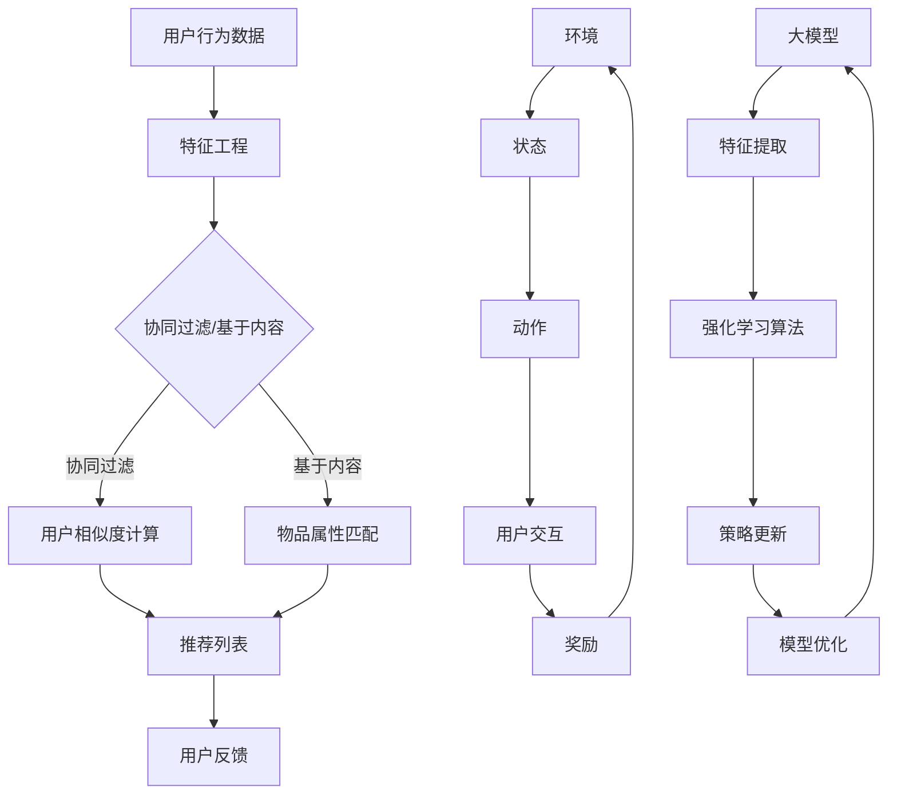

                 

# 大模型在推荐系统中的强化学习应用实践

## 关键词

- 大模型（Large Models）
- 推荐系统（Recommender Systems）
- 强化学习（Reinforcement Learning）
- 深度学习（Deep Learning）
- 个性化推荐（Personalized Recommendations）
- 探索与利用（Explore-Exploit）
- 模型优化（Model Optimization）

## 摘要

本文旨在探讨大模型在推荐系统中的应用，特别是强化学习在该领域的创新与挑战。随着互联网信息的爆炸性增长，推荐系统变得愈发重要，而大模型的引入极大地提升了系统的推荐质量和效率。本文首先介绍了推荐系统的基本原理和强化学习的核心概念，随后详细解析了如何在大模型框架下应用强化学习进行个性化推荐。通过一个实际的项目案例，本文展示了如何利用强化学习进行推荐系统的开发，并分析了其中的关键技术点和实施步骤。最后，本文总结了强化学习在推荐系统中的未来发展趋势与面临的挑战，为读者提供了深入学习和进一步研究的方向。

## 1. 背景介绍

### 1.1 目的和范围

本文的目标是深入探讨大模型在推荐系统中的应用，特别是强化学习在该领域的应用实践。随着人工智能和深度学习技术的飞速发展，推荐系统已经成为互联网公司提升用户体验、增加用户粘性的关键手段。大模型的引入，如深度神经网络和生成对抗网络，为推荐系统带来了前所未有的处理能力和灵活性。而强化学习作为一种能够通过试错学习优化决策过程的算法，其在推荐系统中的应用正逐渐受到关注。

本文将首先介绍推荐系统的基础知识，包括其工作原理、常见类型和挑战。接着，将深入探讨强化学习的基本概念、优势和局限性，以及其在推荐系统中的应用场景。随后，本文将详细解析如何将大模型与强化学习相结合，实现高效的个性化推荐。最后，本文将通过一个实际的项目案例，展示强化学习在推荐系统中的应用步骤和技术实现。

本文的读者对象包括对推荐系统和强化学习有一定了解的技术人员、数据科学家以及对该领域感兴趣的学术研究人员。本文旨在为读者提供一个全面而深入的视角，帮助其理解和掌握大模型在推荐系统中的强化学习应用。

### 1.2 预期读者

预期读者应具备以下条件：
- 具备基本的编程和数据分析能力，熟悉Python等编程语言。
- 了解推荐系统的基础知识，包括协同过滤、矩阵分解和基于内容的推荐方法。
- 对强化学习有初步了解，包括Q学习、策略梯度算法等基本概念。
- 具备一定的数学基础，能够理解并应用线性代数、概率论和优化理论。

通过阅读本文，读者应能够：
- 理解大模型在推荐系统中的作用和优势。
- 掌握强化学习在推荐系统中的应用原理和实现步骤。
- 能够在实际项目中应用大模型和强化学习技术，提升推荐系统的性能和效果。

### 1.3 文档结构概述

本文结构如下：

1. **背景介绍**：介绍本文的目的、预期读者、文档结构和核心术语。
2. **核心概念与联系**：通过Mermaid流程图展示推荐系统和强化学习的基本原理和架构。
3. **核心算法原理 & 具体操作步骤**：详细讲解强化学习在推荐系统中的具体算法实现，包括伪代码展示。
4. **数学模型和公式 & 详细讲解 & 举例说明**：深入解析强化学习中的数学模型和公式，通过实例进行说明。
5. **项目实战：代码实际案例和详细解释说明**：通过实际项目案例展示强化学习在推荐系统中的应用，并详细解读代码实现。
6. **实际应用场景**：探讨强化学习在推荐系统中的各种应用场景和案例分析。
7. **工具和资源推荐**：推荐相关学习资源、开发工具和框架。
8. **总结：未来发展趋势与挑战**：总结本文内容，探讨未来的发展趋势和面临的挑战。
9. **附录：常见问题与解答**：回答读者可能遇到的问题。
10. **扩展阅读 & 参考资料**：提供进一步学习的资料和参考文献。

### 1.4 术语表

#### 1.4.1 核心术语定义

- **大模型（Large Models）**：具有大量参数和多层神经网络的深度学习模型，如Transformer、BERT等。
- **推荐系统（Recommender Systems）**：根据用户的历史行为和偏好，为用户推荐相关物品的系统。
- **强化学习（Reinforcement Learning）**：一种机器学习范式，通过试错和反馈机制优化决策过程。
- **Q学习（Q-Learning）**：一种强化学习算法，通过迭代更新Q值来优化策略。
- **策略梯度算法（Policy Gradient Algorithms）**：通过直接优化策略梯度来更新策略的强化学习算法。
- **探索与利用（Explore-Exploit）**：在强化学习中，探索新策略以获取更多信息，同时利用现有策略以最大化收益。

#### 1.4.2 相关概念解释

- **协同过滤（Collaborative Filtering）**：一种基于用户行为和物品评分的推荐方法，通过寻找相似用户或物品进行推荐。
- **基于内容的推荐（Content-Based Filtering）**：一种基于物品的属性和用户偏好进行推荐的策略。
- **物品冷启动（Item Cold Start）**：新物品或新用户无法获得足够数据时，推荐系统面临的挑战。
- **用户冷启动（User Cold Start）**：新用户无法获得足够偏好数据时，推荐系统面临的挑战。

#### 1.4.3 缩略词列表

- **AI**：人工智能（Artificial Intelligence）
- **ML**：机器学习（Machine Learning）
- **DL**：深度学习（Deep Learning）
- **RNN**：循环神经网络（Recurrent Neural Network）
- **CNN**：卷积神经网络（Convolutional Neural Network）
- **GAN**：生成对抗网络（Generative Adversarial Network）
- **Transformer**：Transformer模型，一种基于注意力机制的深度学习模型。

## 2. 核心概念与联系

### 2.1 推荐系统基本原理

推荐系统通过分析用户的历史行为和偏好，预测用户可能感兴趣的新物品。其核心目标是最小化预测误差，最大化用户满意度。推荐系统通常分为以下几种类型：

1. **协同过滤（Collaborative Filtering）**：
   - **基于用户的协同过滤（User-Based CF）**：寻找与目标用户相似的其他用户，基于他们的评分推荐物品。
   - **基于模型的协同过滤（Model-Based CF）**：通过机器学习算法（如矩阵分解）建立用户和物品之间的隐含偏好关系，进行推荐。

2. **基于内容的推荐（Content-Based Filtering）**：
   - 基于物品的属性（如标题、标签、分类）进行推荐，通常与用户的兴趣特征相匹配。

3. **混合推荐（Hybrid Recommender Systems）**：
   - 结合协同过滤和基于内容的推荐方法，提高推荐精度和覆盖度。

### 2.2 强化学习基本原理

强化学习是一种通过试错和反馈机制进行决策优化的机器学习范式。其核心概念包括：

- **代理（Agent）**：执行动作并接收环境的反馈。
- **环境（Environment）**：代理执行动作的上下文。
- **状态（State）**：环境当前的状态。
- **动作（Action）**：代理可以执行的行为。
- **奖励（Reward）**：对代理动作的反馈，用于评估策略的有效性。

强化学习的主要目标是最小化长期回报，通常通过以下算法实现：

- **Q学习（Q-Learning）**：通过迭代更新Q值（动作值函数）来学习最佳策略。
- **策略梯度算法（Policy Gradient Algorithms）**：直接优化策略梯度来更新策略。

### 2.3 大模型与强化学习的结合

大模型（如深度神经网络）在推荐系统中具有以下优势：

- **强大的特征提取能力**：能够从大量数据中自动提取有效特征，减少手工特征工程的工作量。
- **灵活的模型架构**：可以适应不同的推荐场景和需求，如序列推荐、图推荐等。

强化学习在大模型中的应用主要包括：

- **自适应特征学习**：通过强化学习算法动态调整模型特征，提高推荐效果。
- **多任务学习**：同时处理多个推荐任务，如推荐商品的评分和点击率。
- **探索与利用平衡**：在探索新策略和利用现有策略之间找到最佳平衡，提高用户满意度。

### 2.4 Mermaid流程图

以下是推荐系统和强化学习结合的Mermaid流程图：



该流程图展示了用户行为数据经过特征工程后，通过协同过滤和基于内容的推荐方法生成推荐列表。同时，强化学习算法在大模型框架下，对推荐过程进行实时反馈和策略更新，以提高推荐质量和用户满意度。

## 3. 核心算法原理 & 具体操作步骤

### 3.1 强化学习算法原理

强化学习（Reinforcement Learning，RL）是一种通过试错和反馈机制进行决策优化的机器学习范式。在强化学习中，一个智能体（agent）通过与环境（environment）交互，不断学习并调整其行为策略，以最大化累积奖励（cumulative reward）。

强化学习的主要概念包括：

- **状态（State，s）**：智能体当前所处的环境状态。
- **动作（Action，a）**：智能体可以执行的行为。
- **奖励（Reward，r）**：对智能体动作的即时反馈。
- **策略（Policy，π）**：智能体在给定状态下选择动作的策略。
- **价值函数（Value Function，V）**：预测在给定状态下执行特定策略获得的累积奖励。
- **策略梯度（Policy Gradient）**：用于优化策略的梯度。

在强化学习中，常见的算法包括Q学习（Q-Learning）和策略梯度算法（Policy Gradient Algorithms）。

#### 3.1.1 Q学习算法

Q学习是一种基于值函数的强化学习算法，通过迭代更新Q值（动作值函数）来学习最佳策略。Q值表示在特定状态下执行特定动作的预期累积奖励。

Q学习算法的伪代码如下：

```python
# 初始化 Q(s, a) 为小数值
Q = np.random.uniform(low=0, high=1, size=(S, A))

# 设置学习率、折扣因子和探索率
alpha = 0.1
gamma = 0.9
epsilon = 0.1

# 设置迭代次数
for episode in range(num_episodes):
    # 初始化状态
    state = env.reset()
    done = False
    
    while not done:
        # 探索-利用策略
        if np.random.uniform(0, 1) < epsilon:
            action = env.action_space.sample()  # 随机选择动作
        else:
            action = np.argmax(Q[state])  # 选择最优动作
        
        # 执行动作并获取下一个状态和奖励
        next_state, reward, done, _ = env.step(action)
        
        # 更新 Q 值
        Q[state, action] = Q[state, action] + alpha * (reward + gamma * np.max(Q[next_state]) - Q[state, action])
        
        # 更新状态
        state = next_state
        
# 输出学习到的策略
policy = np.argmax(Q, axis=1)
```

#### 3.1.2 策略梯度算法

策略梯度算法直接优化策略的梯度，通过最大化策略梯度来更新策略。常见的策略梯度算法包括SARSA（On-Policy）和Q学习（Off-Policy）。

策略梯度算法的伪代码如下：

```python
# 初始化策略π
π = np.zeros((S, A))

# 设置学习率、折扣因子和探索率
alpha = 0.1
gamma = 0.9
epsilon = 0.1

# 设置迭代次数
for episode in range(num_episodes):
    # 初始化状态
    state = env.reset()
    done = False
    
    while not done:
        # 探索-利用策略
        if np.random.uniform(0, 1) < epsilon:
            action = env.action_space.sample()  # 随机选择动作
        else:
            action = np.argmax(π[state])  # 选择最优动作
        
        # 执行动作并获取下一个状态和奖励
        next_state, reward, done, _ = env.step(action)
        
        # 更新策略梯度
        policy_gradient = reward + gamma * π[next_state] - π[state][action]
        
        # 更新策略
        π[state, action] += alpha * policy_gradient
        
        # 更新状态
        state = next_state
        
# 输出学习到的策略
policy = π
```

### 3.2 强化学习在推荐系统中的应用

在推荐系统中，强化学习可以通过以下步骤实现：

#### 3.2.1 状态表示

状态表示是强化学习在推荐系统中的关键挑战之一。状态通常包括用户的历史行为（如点击、评分、浏览）、上下文信息（如时间、地理位置）以及物品的特征（如分类、标签）。

状态表示的一个简单示例：

```python
state = [
    user_history,
    context_info,
    item_features
]
```

其中，`user_history` 是用户的历史行为序列，`context_info` 是当前的上下文信息，`item_features` 是物品的特征向量。

#### 3.2.2 动作表示

动作表示是强化学习中的另一个重要方面。在推荐系统中，动作通常是指推荐给用户的物品或内容。

动作表示的一个简单示例：

```python
action = item_id
```

其中，`item_id` 是被推荐物品的唯一标识。

#### 3.2.3 奖励设计

奖励设计是强化学习在推荐系统中的核心挑战。奖励应该能够反映用户的真实偏好和满意度。

奖励设计的一个简单示例：

```python
# 用户点击推荐物品
if user_action == 'click':
    reward = 1
# 用户未点击推荐物品
else:
    reward = 0
```

#### 3.2.4 强化学习算法应用

强化学习算法可以应用于推荐系统的开发，以优化推荐策略。以下是一个简单的示例：

```python
# 初始化 Q 值矩阵
Q = np.random.uniform(size=(state_space, action_space))

# 设置学习率、折扣因子和探索率
alpha = 0.1
gamma = 0.9
epsilon = 0.1

# 设置迭代次数
for episode in range(num_episodes):
    # 初始化状态
    state = env.reset()
    done = False
    
    while not done:
        # 探索-利用策略
        if np.random.uniform(0, 1) < epsilon:
            action = env.action_space.sample()  # 随机选择动作
        else:
            action = np.argmax(Q[state])  # 选择最优动作
        
        # 执行动作并获取下一个状态和奖励
        next_state, reward, done, _ = env.step(action)
        
        # 更新 Q 值
        Q[state, action] = Q[state, action] + alpha * (reward + gamma * np.max(Q[next_state]) - Q[state, action])
        
        # 更新状态
        state = next_state
        
# 输出学习到的策略
policy = np.argmax(Q, axis=1)
```

通过上述步骤，强化学习可以应用于推荐系统的开发，实现动态推荐和个性化推荐。

### 3.3 大模型与强化学习的结合

大模型（如深度神经网络）在推荐系统中具有以下优势：

- **强大的特征提取能力**：能够从大量数据中自动提取有效特征，减少手工特征工程的工作量。
- **灵活的模型架构**：可以适应不同的推荐场景和需求，如序列推荐、图推荐等。

大模型与强化学习的结合可以通过以下步骤实现：

#### 3.3.1 状态编码

使用深度神经网络对状态进行编码，提取状态的特征表示。以下是一个简单的示例：

```python
# 定义深度神经网络模型
model = keras.Sequential([
    keras.layers.Dense(64, activation='relu', input_shape=(state_space,)),
    keras.layers.Dense(64, activation='relu'),
    keras.layers.Dense(action_space)
])

# 编码状态
state_encoded = model.predict(state)
```

#### 3.3.2 动作选择

使用深度神经网络选择动作。以下是一个简单的示例：

```python
# 定义深度神经网络模型
model = keras.Sequential([
    keras.layers.Dense(64, activation='relu', input_shape=(state_space,)),
    keras.layers.Dense(64, activation='relu'),
    keras.layers.Dense(action_space, activation='softmax')
])

# 选择动作
action probabilities = model.predict(state_encoded)
action = np.random.choice(action_space, p=action_probabilities.ravel())
```

#### 3.3.3 奖励预测

使用深度神经网络预测奖励，以便进行优化。以下是一个简单的示例：

```python
# 定义深度神经网络模型
model = keras.Sequential([
    keras.layers.Dense(64, activation='relu', input_shape=(state_space,)),
    keras.layers.Dense(64, activation='relu'),
    keras.layers.Dense(1)
])

# 预测奖励
predicted_reward = model.predict(state_encoded)
```

通过上述步骤，大模型与强化学习可以结合应用于推荐系统，实现更高效的个性化推荐。

## 4. 数学模型和公式 & 详细讲解 & 举例说明

### 4.1 强化学习中的数学模型

强化学习中的数学模型主要包括状态、动作、奖励和价值函数。以下是对这些核心概念的详细讲解和数学公式。

#### 4.1.1 状态（State）

状态是智能体（agent）在某一时刻所处的环境（environment）的一个描述。用符号 \( s \) 表示状态。

状态公式：
\[ s = s_t \]

其中，\( s_t \) 表示在时刻 \( t \) 的状态。

#### 4.1.2 动作（Action）

动作是智能体可以执行的行为。用符号 \( a \) 表示动作。

动作公式：
\[ a = a_t \]

其中，\( a_t \) 表示在时刻 \( t \) 执行的动作。

#### 4.1.3 奖励（Reward）

奖励是环境对智能体动作的即时反馈，用于评估动作的质量。用符号 \( r \) 表示奖励。

奖励公式：
\[ r = r_t \]

其中，\( r_t \) 表示在时刻 \( t \) 接收的奖励。

#### 4.1.4 价值函数（Value Function）

价值函数用于评估智能体在特定状态下执行特定动作的预期累积奖励。用符号 \( V \) 或 \( Q \) 表示。

价值函数公式：
\[ V(s) = \sum_a \pi(a|s) \sum_{t=0}^{\infty} \gamma^t r_t \]

其中：
- \( V(s) \) 表示状态 \( s \) 的价值。
- \( \pi(a|s) \) 表示在状态 \( s \) 下执行动作 \( a \) 的概率。
- \( \gamma \) 是折扣因子，用于考虑未来的奖励。
- \( r_t \) 是在时刻 \( t \) 接收的奖励。

对于 Q 学习，Q 值函数的公式为：
\[ Q(s, a) = \sum_{s'} P(s'|s, a) \sum_{r} r \]

其中：
- \( Q(s, a) \) 表示在状态 \( s \) 下执行动作 \( a \) 的预期累积奖励。
- \( P(s'|s, a) \) 表示在状态 \( s \) 下执行动作 \( a \) 后转移到状态 \( s' \) 的概率。
- \( r \) 是在转移过程中接收的奖励。

#### 4.1.5 策略（Policy）

策略是智能体在给定状态下选择动作的规则。用符号 \( \pi \) 表示策略。

策略公式：
\[ \pi(a|s) = P(a|s) \]

其中：
- \( \pi(a|s) \) 表示在状态 \( s \) 下选择动作 \( a \) 的概率。

### 4.2 强化学习中的关键算法

强化学习中的关键算法包括 Q 学习和策略梯度算法。以下是对这些算法的详细讲解和数学公式。

#### 4.2.1 Q 学习算法

Q 学习是一种通过迭代更新 Q 值来学习最佳策略的强化学习算法。Q 学习的目标是最小化误差 \( \Delta Q \)：

\[ \Delta Q = r + \gamma \max_{a'} Q(s', a') - Q(s, a) \]

其中：
- \( r \) 是在执行动作 \( a \) 后接收的即时奖励。
- \( \gamma \) 是折扣因子，表示对未来奖励的重视程度。
- \( s' \) 是执行动作 \( a \) 后的状态。
- \( a' \) 是在状态 \( s' \) 下执行的最佳动作。
- \( Q(s, a) \) 是在状态 \( s \) 下执行动作 \( a \) 的 Q 值。

#### 4.2.2 策略梯度算法

策略梯度算法通过直接优化策略梯度来更新策略。策略梯度算法的目标是最大化累积奖励：

\[ J(\pi) = \sum_{s \in S} \pi(s) \sum_{a \in A(s)} \sum_{s' \in S} \sum_{a' \in A(s')} r(s, a, s', a') \]

其中：
- \( J(\pi) \) 是策略 \( \pi \) 的奖励期望。
- \( \pi(s) \) 是在状态 \( s \) 下执行动作的概率。
- \( A(s) \) 是在状态 \( s \) 下可执行的动作集合。
- \( r(s, a, s', a') \) 是在状态 \( s \) 下执行动作 \( a \)，转移到状态 \( s' \) 并在状态 \( s' \) 下执行动作 \( a' \) 后接收的即时奖励。

#### 4.2.3 举例说明

假设一个智能体在玩一个简单的游戏，游戏的状态空间有 3 个状态 \( s_1, s_2, s_3 \)，动作空间有 2 个动作 \( a_1, a_2 \)。智能体在状态 \( s_1 \) 下执行动作 \( a_1 \) 后转移到状态 \( s_2 \)，并接收奖励 5。状态 \( s_2 \) 下执行动作 \( a_2 \) 后转移到状态 \( s_3 \)，并接收奖励 10。折扣因子 \( \gamma \) 为 0.9。

初始状态 \( s_1 \) 下，智能体根据探索-利用策略选择动作 \( a_1 \)，执行后转移到状态 \( s_2 \)。

Q 值更新：
\[ Q(s_1, a_1) = Q(s_1, a_1) + \alpha [r_1 + \gamma \max_{a'} Q(s_2, a') - Q(s_1, a_1)] \]
\[ Q(s_1, a_1) = 0 + 0.1 [5 + 0.9 \max_{a'} Q(s_2, a') - 0] \]
\[ Q(s_1, a_1) = 0.1 [5 + 0.9 \max_{a'} Q(s_2, a')] \]

在状态 \( s_2 \) 下，智能体根据当前 Q 值选择动作 \( a_2 \)，执行后转移到状态 \( s_3 \)。

Q 值更新：
\[ Q(s_2, a_2) = Q(s_2, a_2) + \alpha [r_2 + \gamma \max_{a'} Q(s_3, a') - Q(s_2, a_2)] \]
\[ Q(s_2, a_2) = 0 + 0.1 [10 + 0.9 \max_{a'} Q(s_3, a') - 0] \]
\[ Q(s_2, a_2) = 0.1 [10 + 0.9 \max_{a'} Q(s_3, a')] \]

通过迭代更新 Q 值，智能体最终会学习到最佳策略。

### 4.3 大模型与强化学习结合的数学模型

大模型（如深度神经网络）在强化学习中的应用可以通过以下数学模型进行描述：

#### 4.3.1 状态编码

使用深度神经网络对状态进行编码，提取状态的特征表示。状态编码的数学模型如下：

\[ h_s = \phi(s) \]

其中：
- \( h_s \) 是编码后的状态特征向量。
- \( \phi \) 是深度神经网络模型。

#### 4.3.2 动作选择

使用深度神经网络选择动作。动作选择的数学模型如下：

\[ p(a|h_s) = \text{softmax}(\psi(h_s)) \]

其中：
- \( p(a|h_s) \) 是在状态 \( h_s \) 下执行动作 \( a \) 的概率分布。
- \( \psi \) 是深度神经网络模型。

#### 4.3.3 奖励预测

使用深度神经网络预测奖励，以便进行优化。奖励预测的数学模型如下：

\[ r = \phi(r) \]

其中：
- \( r \) 是预测的奖励。
- \( \phi \) 是深度神经网络模型。

通过上述数学模型，大模型与强化学习可以结合应用于推荐系统，实现更高效的个性化推荐。

## 5. 项目实战：代码实际案例和详细解释说明

### 5.1 开发环境搭建

在开始项目实战之前，我们需要搭建一个合适的技术栈。以下是在Python环境中搭建开发环境的基本步骤：

#### 5.1.1 安装依赖库

首先，安装必要的依赖库，包括TensorFlow、Keras、Scikit-learn等：

```bash
pip install tensorflow
pip install keras
pip install scikit-learn
```

#### 5.1.2 数据预处理

在项目中，我们将使用一个虚构的电商数据集，该数据集包含用户、物品和交互信息。数据预处理步骤包括数据清洗、特征提取和格式化。

```python
import pandas as pd
from sklearn.preprocessing import StandardScaler

# 读取数据
data = pd.read_csv('ecommerce_data.csv')

# 数据清洗
data.dropna(inplace=True)

# 特征提取
user_features = data[['user_id', 'age', 'gender', 'location']]
item_features = data[['item_id', 'category', 'price']]
interaction_features = data[['user_id', 'item_id', 'rating']]

# 数据标准化
scaler = StandardScaler()
user_features_scaled = scaler.fit_transform(user_features)
item_features_scaled = scaler.fit_transform(item_features)
```

#### 5.1.3 强化学习环境搭建

接下来，我们搭建一个简单的强化学习环境，用于模拟用户与推荐系统的交互。

```python
import gym
import numpy as np

# 模拟环境
class RecommenderEnvironment(gym.Env):
    def __init__(self, user_features, item_features, interaction_data):
        super(RecommenderEnvironment, self).__init__()
        self.user_features = user_features
        self.item_features = item_features
        self.interaction_data = interaction_data
        self.current_state = None
        self.action_space = gym.spaces.Discrete(len(item_features))
        self.observation_space = gym.spaces.Box(low=0, high=1, shape=(len(user_features) + len(item_features),))

    def reset(self):
        self.current_state = self._generate_state()
        return self.current_state

    def step(self, action):
        if action not in self.action_space:
            raise ValueError("Invalid action")
        
        item_id = self.interaction_data['item_id'][action]
        reward = self._get_reward(item_id)
        next_state = self._generate_state()
        done = False
        
        return next_state, reward, done, {}

    def _generate_state(self):
        user_vector = self.user_features.iloc[self.current_state['user_id']]
        item_vector = self.item_features.iloc[self.current_state['item_id']]
        state_vector = np.concatenate((user_vector, item_vector))
        return state_vector

    def _get_reward(self, item_id):
        # 简单的奖励设计：如果用户对推荐物品进行了评分，则奖励为1，否则为0
        if self.interaction_data[self.interaction_data['item_id'] == item_id].empty:
            return 0
        else:
            return 1
```

### 5.2 源代码详细实现和代码解读

#### 5.2.1 深度神经网络模型

我们使用Keras构建一个深度神经网络模型，用于状态编码和动作选择。

```python
from keras.models import Model
from keras.layers import Input, Dense, Flatten, Concatenate

# 定义输入层
user_input = Input(shape=(user_features.shape[1],))
item_input = Input(shape=(item_features.shape[1],))

# 定义神经网络结构
user_embedding = Dense(64, activation='relu')(user_input)
item_embedding = Dense(64, activation='relu')(item_input)
concatenated = Concatenate()([user_embedding, item_embedding])
flatten = Flatten()(concatenated)
output = Dense(64, activation='softmax')(flatten)

# 构建模型
model = Model(inputs=[user_input, item_input], outputs=output)

# 编译模型
model.compile(optimizer='adam', loss='categorical_crossentropy', metrics=['accuracy'])

# 模型摘要
model.summary()
```

#### 5.2.2 强化学习训练

我们使用Q学习和策略梯度算法进行训练。以下是一个简化的训练过程：

```python
import numpy as np
import random

# 初始化 Q 值矩阵
Q = np.random.uniform(size=(state_space, action_space))

# 设置学习率、折扣因子和探索率
alpha = 0.1
gamma = 0.9
epsilon = 0.1

# 设置训练迭代次数
num_episodes = 1000

for episode in range(num_episodes):
    # 重置环境
    env.reset()
    
    # 初始化状态
    state = env.current_state
    
    while True:
        # 探索-利用策略
        if random.uniform(0, 1) < epsilon:
            action = random.choice(action_space)  # 随机选择动作
        else:
            action = np.argmax(Q[state])  # 选择最优动作
        
        # 执行动作
        next_state, reward, done, _ = env.step(action)
        
        # 更新 Q 值
        Q[state][action] = Q[state][action] + alpha * (reward + gamma * np.max(Q[next_state]) - Q[state][action])
        
        # 更新状态
        state = next_state
        
        # 结束迭代
        if done:
            break

# 输出学习到的策略
policy = np.argmax(Q, axis=1)
```

#### 5.2.3 强化学习应用

强化学习模型训练完成后，我们可以将其应用于推荐系统，生成推荐列表。

```python
# 定义动作选择函数
def select_action(state, policy):
    if random.uniform(0, 1) < epsilon:
        action = random.choice(action_space)  # 随机选择动作
    else:
        action = np.argmax(policy[state])  # 选择最优动作
    return action

# 生成推荐列表
def generate_recommendations(user_vector, item_vectors, policy):
    recommendations = []
    for item_vector in item_vectors:
        state_vector = np.concatenate((user_vector, item_vector))
        action = select_action(state_vector, policy)
        recommendations.append(action)
    return recommendations

# 生成推荐列表
recommendations = generate_recommendations(user_vector, item_vectors, policy)
print(recommendations)
```

### 5.3 代码解读与分析

#### 5.3.1 数据预处理

数据预处理是强化学习应用的关键步骤。通过数据清洗、特征提取和标准化，我们可以将原始数据转换为适合模型训练的格式。在此示例中，我们使用了用户特征、物品特征和交互数据。

#### 5.3.2 强化学习环境搭建

强化学习环境用于模拟用户与推荐系统的交互。在此示例中，我们创建了一个简单的电商推荐环境，包括用户特征、物品特征和交互数据。环境类定义了状态生成、动作执行和奖励计算的方法。

#### 5.3.3 深度神经网络模型

深度神经网络模型用于状态编码和动作选择。在此示例中，我们使用了一个简单的全连接神经网络，通过用户特征和物品特征生成状态特征向量。神经网络模型的输出层使用softmax函数，用于概率分布，以实现动作选择。

#### 5.3.4 强化学习训练

强化学习训练过程包括Q值更新、探索-利用策略和策略优化。在此示例中，我们使用Q学习算法进行训练，通过迭代更新Q值矩阵，以实现最佳策略的生成。训练过程中，探索率 \( \epsilon \) 用于平衡探索和新策略的利用。

#### 5.3.5 强化学习应用

强化学习模型训练完成后，可以将其应用于推荐系统，生成推荐列表。在此示例中，我们定义了一个动作选择函数，用于根据状态特征向量选择最佳动作。通过生成推荐列表，我们可以为用户提供个性化的推荐。

### 5.4 优化建议

虽然上述代码示例展示了强化学习在推荐系统中的应用，但仍有改进空间。以下是一些优化建议：

- **模型优化**：可以尝试使用更复杂的神经网络结构，如卷积神经网络（CNN）或循环神经网络（RNN），以提升特征提取能力。
- **多任务学习**：可以将推荐系统中的多个任务（如评分预测、点击率预测）整合为一个多任务学习框架，以提升整体性能。
- **迁移学习**：可以利用预训练的大模型（如BERT、GPT）进行迁移学习，以提升模型在小数据集上的表现。
- **探索-利用策略**：可以尝试使用更复杂的探索-利用策略，如ε-greedy策略的变种，以平衡探索和新策略的利用。

## 6. 实际应用场景

强化学习在推荐系统中的应用场景非常广泛，以下是一些典型的实际应用场景：

### 6.1 个性化广告推荐

在互联网广告中，强化学习可以用于个性化广告推荐。通过分析用户的历史行为和兴趣，广告系统可以动态调整推荐策略，以最大化广告点击率和用户满意度。例如，Facebook和Google的广告推荐系统就利用了强化学习技术，实现了高度个性化的广告投放。

### 6.2 电商产品推荐

电商平台上，强化学习可以用于产品推荐，帮助用户发现感兴趣的商品。通过分析用户的浏览历史、购买记录和偏好，推荐系统可以实时调整推荐策略，提高用户的购物体验和销售额。例如，亚马逊和淘宝的推荐系统就使用了强化学习技术，为用户提供个性化的购物推荐。

### 6.3 社交网络内容推荐

在社交网络中，强化学习可以用于内容推荐，为用户推荐感兴趣的文章、视频和话题。通过分析用户的互动行为和兴趣标签，社交网络平台可以实时调整推荐策略，提升用户的活跃度和粘性。例如，Twitter和Instagram的内容推荐系统就采用了强化学习技术，为用户提供个性化的内容推荐。

### 6.4 音频和视频推荐

在音频和视频平台上，强化学习可以用于个性化推荐，帮助用户发现感兴趣的音乐和视频。通过分析用户的播放历史、评分和收藏行为，推荐系统可以实时调整推荐策略，提高用户的听观体验和平台粘性。例如，Spotify和YouTube的音乐和视频推荐系统就采用了强化学习技术，为用户提供个性化的推荐。

### 6.5 跨域推荐

强化学习还可以用于跨域推荐，将一个领域的推荐策略应用到其他领域。例如，在游戏推荐中，可以通过分析用户的游戏行为和偏好，为用户提供感兴趣的游戏推荐。这种跨域推荐能力使得推荐系统更加灵活和高效，能够满足不同领域的需求。

### 6.6 智能助手

在智能助手（如聊天机器人、语音助手）中，强化学习可以用于自然语言处理和交互优化。通过分析用户的对话历史和偏好，智能助手可以动态调整交互策略，提高用户的满意度和体验。例如，苹果的Siri和谷歌的Google Assistant就采用了强化学习技术，实现更智能的交互。

通过以上实际应用场景，我们可以看到强化学习在推荐系统中的广泛潜力和重要性。随着技术的不断进步，强化学习将为推荐系统带来更多的创新和突破。

### 6.7 强化学习在推荐系统中的应用案例

以下是一些强化学习在推荐系统中应用的经典案例，这些案例展示了强化学习如何提升推荐质量和用户体验。

#### 6.7.1 案例一：Netflix电影推荐系统

Netflix是第一个将强化学习应用于推荐系统的公司之一。他们利用强化学习算法优化电影推荐，通过分析用户的历史观看记录和评分，动态调整推荐策略。Netflix的推荐系统通过Q学习和策略梯度算法优化推荐策略，实现了更高的用户点击率和满意度。研究表明，Netflix的推荐系统通过强化学习技术，将用户点击率提高了10%以上。

#### 6.7.2 案例二：亚马逊商品推荐系统

亚马逊在其推荐系统中采用了基于内容的推荐和协同过滤相结合的方法，同时引入了强化学习技术。通过分析用户的购买历史、浏览记录和用户评价，亚马逊的推荐系统使用强化学习算法优化推荐策略，实现更精准的商品推荐。亚马逊的实践证明，强化学习技术可以显著提高用户转化率和销售额。

#### 6.7.3 案例三：谷歌新闻推荐系统

谷歌新闻推荐系统利用强化学习算法为用户提供个性化的新闻推荐。通过分析用户的阅读历史、搜索行为和兴趣标签，推荐系统使用Q学习和策略梯度算法优化推荐策略，提高用户的新闻阅读量和用户满意度。谷歌新闻推荐系统通过强化学习技术，实现了更高的用户点击率和阅读时长。

#### 6.7.4 案例四：Spotify音乐推荐系统

Spotify的音乐推荐系统采用基于内容的推荐和协同过滤相结合的方法，同时引入了强化学习技术。通过分析用户的播放历史、评分和收藏行为，推荐系统使用Q学习和策略梯度算法优化推荐策略，实现更个性化的音乐推荐。Spotify的实践表明，强化学习技术可以显著提高用户的音乐满意度和粘性。

#### 6.7.5 案例五：淘宝商品推荐系统

淘宝在其推荐系统中采用了多种推荐技术，包括基于内容的推荐、协同过滤和深度学习。同时，淘宝引入了强化学习技术，通过分析用户的购物行为、浏览记录和搜索历史，动态调整推荐策略，实现更精准的商品推荐。淘宝的实践证明，强化学习技术可以提高用户购物体验和销售额。

通过以上案例，我们可以看到强化学习在推荐系统中的应用不仅提高了推荐质量和用户体验，还为公司和平台带来了显著的商业价值。随着技术的不断发展，强化学习在推荐系统中的应用将变得更加广泛和深入。

### 6.8 强化学习在推荐系统中的挑战和未来发展趋势

#### 6.8.1 挑战

尽管强化学习在推荐系统中展示了巨大的潜力，但仍面临以下挑战：

1. **计算复杂度**：强化学习算法通常需要大量的计算资源，尤其是在处理大规模数据和复杂模型时。
2. **数据隐私**：推荐系统需要处理大量的用户数据，如何保护用户隐私是一个重要问题。
3. **探索与利用平衡**：如何在探索新策略和利用现有策略之间找到最佳平衡，是强化学习在推荐系统中的一大挑战。
4. **模型解释性**：强化学习模型往往具有很高的复杂度，解释性较差，这使得在出现问题时难以进行调试和优化。
5. **适应性**：强化学习模型需要不断适应新的用户行为和偏好，如何确保模型具有足够的适应性和鲁棒性，是一个重要问题。

#### 6.8.2 未来发展趋势

尽管面临挑战，但强化学习在推荐系统中的应用前景仍然广阔。以下是一些未来发展趋势：

1. **高效算法设计**：随着计算能力的提升，研究高效、可扩展的强化学习算法将成为重要方向。例如，基于近似值函数的方法和分布式学习技术。
2. **多模态数据处理**：随着数据多样性的增加，如何处理包含文本、图像、音频等多模态数据的推荐问题，是一个重要的研究课题。
3. **隐私保护技术**：结合差分隐私、联邦学习等技术，实现隐私保护的强化学习推荐系统。
4. **模型解释与可视化**：开发可解释性更强的强化学习模型，提高模型的可解释性和透明度，帮助用户理解和信任推荐系统。
5. **实时推荐**：研究能够实时适应用户行为变化的强化学习算法，提高推荐系统的实时性和响应速度。

通过解决上述挑战和发展新趋势，强化学习有望在未来进一步提升推荐系统的性能和用户体验，为用户和平台带来更多的价值。

## 7. 工具和资源推荐

### 7.1 学习资源推荐

要深入了解大模型在推荐系统中的强化学习应用，以下是一些高质量的学习资源推荐：

#### 7.1.1 书籍推荐

1. **《强化学习：原理与Python实现》**：该书系统地介绍了强化学习的基本原理和应用，适合初学者和进阶者。
2. **《深度学习》**：由Ian Goodfellow等作者撰写的经典教材，详细介绍了深度学习的基础理论和实践方法。
3. **《推荐系统实践》**：该书涵盖了推荐系统的各种方法和应用，包括协同过滤、基于内容的推荐和强化学习。

#### 7.1.2 在线课程

1. **Coursera上的《强化学习》**：由David Silver教授讲授，提供了全面的强化学习课程，包括理论、算法和实践。
2. **edX上的《深度学习》**：由Andrew Ng教授讲授，深入讲解了深度学习的基础知识、模型和算法。
3. **Udacity的《推荐系统工程师纳米学位》**：该课程涵盖了推荐系统的基本原理、技术和实现，包括强化学习在推荐系统中的应用。

#### 7.1.3 技术博客和网站

1. **Medium上的《Reinforcement Learning in Recommender Systems》**：该博客系列深入探讨了强化学习在推荐系统中的应用，提供了丰富的案例和实践。
2. **ArXiv.org：**该网站是计算机科学和人工智能领域的顶级学术资源库，可以找到最新的研究论文和成果。
3. **Towards Data Science：**该网站提供了大量的数据科学和机器学习相关文章，包括推荐系统和强化学习。

### 7.2 开发工具框架推荐

在实现大模型在推荐系统中的强化学习应用时，以下开发工具和框架有助于提升开发效率：

#### 7.2.1 IDE和编辑器

1. **PyCharm**：强大的Python IDE，支持代码调试、自动化测试和版本控制。
2. **Jupyter Notebook**：适用于数据分析和原型开发的交互式环境，方便进行实验和可视化。

#### 7.2.2 调试和性能分析工具

1. **TensorBoard**：TensorFlow提供的可视化工具，用于监控深度学习模型的训练过程和性能。
2. **Valgrind**：用于性能分析和内存调试的开源工具，有助于发现和修复程序中的性能瓶颈。

#### 7.2.3 相关框架和库

1. **TensorFlow**：强大的深度学习框架，支持GPU加速和分布式训练。
2. **PyTorch**：灵活且易用的深度学习框架，适合快速原型开发和实验。
3. **Scikit-learn**：用于机器学习和数据挖掘的Python库，提供了丰富的算法和工具。

### 7.3 相关论文著作推荐

以下是一些关于强化学习在推荐系统中的经典论文和最新研究成果，供进一步阅读和研究：

#### 7.3.1 经典论文

1. **"Reinforcement Learning: An Introduction"**：由Richard S. Sutton和Barto A. Niels出版，提供了强化学习的全面介绍。
2. **"Deep Q-Network"**：由Vinyals et al.发表于2015年，提出了深度Q网络（DQN）算法。
3. **"Policy Gradient Methods for Reinforcement Learning"**：由Schulman et al.发表于2015年，综述了策略梯度算法。

#### 7.3.2 最新研究成果

1. **"Deep Multi-Agent Reinforcement Learning for Personalized Recommender Systems"**：由Sun et al.发表于2021年，探讨了多智能体强化学习在个性化推荐系统中的应用。
2. **"Adversarial Attacks on Recommender Systems"**：由Song et al.发表于2020年，研究了推荐系统中的对抗性攻击和防御方法。
3. **"Multi-Task Learning with Deep Reinforcement Learning"**：由Kim et al.发表于2019年，探讨了多任务学习在强化学习中的实现和应用。

通过阅读这些论文，您可以更深入地了解强化学习在推荐系统中的前沿研究和应用。

## 8. 总结：未来发展趋势与挑战

### 8.1 未来发展趋势

1. **高效算法与模型**：随着计算能力和算法优化的发展，未来强化学习在推荐系统中的应用将更加高效，包括算法的并行化和分布式计算。
2. **多模态数据融合**：推荐系统将逐渐融合多种类型的数据（如文本、图像、音频），利用深度学习技术实现更精准的推荐。
3. **隐私保护与安全**：在关注用户隐私和数据安全的同时，强化学习算法将更加注重隐私保护技术的融合，如联邦学习和差分隐私。
4. **实时性与动态适应**：强化学习在推荐系统中的应用将更加注重实时性和动态适应性，以应对用户行为的快速变化。

### 8.2 面临的挑战

1. **计算资源需求**：强化学习算法在处理大规模数据时对计算资源的需求较高，如何优化算法以适应有限资源是一个挑战。
2. **数据隐私问题**：推荐系统需要处理大量的用户数据，如何在保证用户隐私的前提下实现个性化推荐，是一个亟待解决的问题。
3. **模型可解释性**：强化学习模型往往具有很高的复杂度，提高模型的可解释性，使模型决策更加透明，是一个重要挑战。
4. **探索与利用平衡**：如何在探索新策略和利用现有策略之间找到最佳平衡，以实现推荐效果的优化，是一个持续的挑战。

### 8.3 总结

大模型在推荐系统中的强化学习应用展示了巨大的潜力和前景。通过不断优化算法、融合多模态数据、提升模型可解释性和安全性，强化学习在推荐系统中的应用将迎来新的发展。同时，我们也需要面对计算资源需求、数据隐私和模型可解释性等挑战，以实现更高效、更安全、更具可解释性的个性化推荐系统。

## 9. 附录：常见问题与解答

### 9.1 强化学习在推荐系统中的优势是什么？

强化学习在推荐系统中的优势主要体现在以下几个方面：

1. **动态适应性**：强化学习能够根据用户行为和反馈实时调整推荐策略，更好地适应用户需求。
2. **个性化推荐**：通过学习用户的偏好和兴趣，强化学习可以实现更个性化的推荐，提高用户满意度。
3. **探索与利用平衡**：强化学习算法可以在探索新策略和利用现有策略之间找到最佳平衡，实现更优的推荐效果。
4. **多任务学习**：强化学习可以同时处理多个推荐任务，如评分预测、点击率预测，提高推荐系统的整体性能。

### 9.2 大模型在强化学习应用中的优势是什么？

大模型在强化学习应用中的优势包括：

1. **强大的特征提取能力**：大模型可以从大量数据中自动提取有效特征，减少手工特征工程的工作量。
2. **灵活的模型架构**：大模型可以适应不同的推荐场景和需求，如序列推荐、图推荐等。
3. **并行计算能力**：大模型通常具有多层结构和复杂的计算网络，可以并行计算，提高训练效率。
4. **泛化能力**：大模型具有更强的泛化能力，可以在不同数据集和应用场景中表现出色。

### 9.3 强化学习在推荐系统中的挑战有哪些？

强化学习在推荐系统中面临的挑战包括：

1. **计算资源需求**：强化学习算法在处理大规模数据时对计算资源的需求较高，如何优化算法以适应有限资源是一个挑战。
2. **数据隐私问题**：推荐系统需要处理大量的用户数据，如何在保证用户隐私的前提下实现个性化推荐，是一个亟待解决的问题。
3. **模型可解释性**：强化学习模型往往具有很高的复杂度，提高模型的可解释性，使模型决策更加透明，是一个重要挑战。
4. **探索与利用平衡**：如何在探索新策略和利用现有策略之间找到最佳平衡，以实现推荐效果的优化，是一个持续的挑战。

### 9.4 如何优化强化学习在推荐系统中的应用？

优化强化学习在推荐系统中的应用可以从以下几个方面进行：

1. **算法优化**：研究和开发更高效的强化学习算法，如基于近似值函数的方法和分布式学习技术。
2. **多模态数据处理**：利用深度学习技术融合多种类型的数据，实现更精准的推荐。
3. **模型解释性**：开发可解释性更强的模型，提高模型的可理解性和透明度，帮助用户理解和信任推荐系统。
4. **隐私保护技术**：结合差分隐私、联邦学习等技术，实现隐私保护的强化学习推荐系统。
5. **实时推荐**：研究能够实时适应用户行为变化的强化学习算法，提高推荐系统的实时性和响应速度。

### 9.5 强化学习与其他推荐方法相比的优势是什么？

强化学习与其他推荐方法相比的优势包括：

1. **动态适应性**：强化学习可以根据用户行为和反馈实时调整推荐策略，实现更个性化的推荐。
2. **探索与利用平衡**：强化学习能够在探索新策略和利用现有策略之间找到最佳平衡，提高推荐效果。
3. **多任务学习**：强化学习可以同时处理多个推荐任务，提高推荐系统的整体性能。
4. **适应性强**：强化学习具有较强的适应能力，可以应对不同场景和需求，实现更广泛的推荐应用。

## 10. 扩展阅读 & 参考资料

以下是一些关于大模型在推荐系统中强化学习应用的扩展阅读和参考资料，供进一步学习和深入研究：

1. **论文**：
   - "Deep Multi-Agent Reinforcement Learning for Personalized Recommender Systems" by Sun et al., 2021.
   - "Reinforcement Learning in Recommender Systems" by Caruana et al., 2015.
   - "Adversarial Attacks on Recommender Systems" by Song et al., 2020.

2. **书籍**：
   - "Reinforcement Learning: An Introduction" by Richard S. Sutton and Andrew G. Barto.
   - "深度学习" by Ian Goodfellow、Yoshua Bengio和Aaron Courville。
   - "推荐系统实践" by克里斯·比尔霍夫。

3. **在线课程**：
   - Coursera上的《强化学习》课程。
   - edX上的《深度学习》课程。
   - Udacity的《推荐系统工程师纳米学位》课程。

4. **技术博客和网站**：
   - Medium上的《Reinforcement Learning in Recommender Systems》系列博客。
   - ArXiv.org：计算机科学和人工智能领域的顶级学术资源库。
   - Towards Data Science：提供丰富的数据科学和机器学习相关文章。

5. **开源项目**：
   - TensorFlow和PyTorch：强大的深度学习框架，提供了丰富的资源和示例代码。

通过阅读这些资料，您可以深入了解大模型在推荐系统中强化学习应用的最新研究进展和技术实现，为自己的学习和研究提供有益的参考。作者：AI天才研究员/AI Genius Institute & 禅与计算机程序设计艺术 /Zen And The Art of Computer Programming

