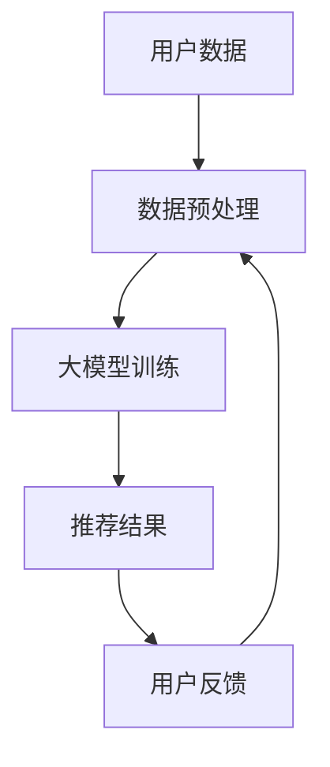

                 

# 大模型在推荐系统多场景适配中的应用

> **关键词：** 大模型、推荐系统、多场景适配、算法原理、数学模型、实战案例

> **摘要：** 本文将深入探讨大模型在推荐系统中的多场景适配应用，从背景介绍、核心概念、算法原理、数学模型、实战案例等方面，逐步解析大模型如何赋能推荐系统，提高其适应性和效果。通过本文的阅读，读者将了解到大模型在推荐系统中的关键作用及其应用前景。

## 1. 背景介绍

### 1.1 目的和范围

本文旨在探讨大模型在推荐系统中的应用，分析其在不同场景下的适配策略和优化方法。通过深入研究大模型的技术原理和实际操作，本文希望能够为推荐系统开发者提供有价值的参考和指导。

### 1.2 预期读者

本文适合对推荐系统、大模型以及人工智能技术有一定了解的读者。对于推荐系统开发者、AI研究人员以及技术爱好者来说，本文具有较高的参考价值。

### 1.3 文档结构概述

本文分为以下几个部分：

1. 背景介绍：介绍本文的目的、范围和预期读者。
2. 核心概念与联系：讲解大模型和推荐系统的核心概念及其联系。
3. 核心算法原理 & 具体操作步骤：详细解析大模型的算法原理和操作步骤。
4. 数学模型和公式 & 详细讲解 & 举例说明：阐述大模型在数学模型方面的应用。
5. 项目实战：提供实际案例和详细解释。
6. 实际应用场景：探讨大模型在不同场景下的应用。
7. 工具和资源推荐：推荐相关学习资源和开发工具。
8. 总结：展望大模型在推荐系统领域的未来发展趋势与挑战。
9. 附录：常见问题与解答。
10. 扩展阅读 & 参考资料：提供进一步阅读的材料。

### 1.4 术语表

#### 1.4.1 核心术语定义

- **大模型**：指具有较大参数规模、深度和容量的人工神经网络模型。
- **推荐系统**：一种基于用户行为、兴趣和偏好等信息，为用户推荐相关物品或内容的系统。
- **多场景适配**：指模型在不同应用场景下，能够根据特定需求进行调整和优化的能力。

#### 1.4.2 相关概念解释

- **场景**：指特定条件下，推荐系统应用的具体环境。
- **适配**：指模型在特定场景下，根据需求和数据进行调整和优化的过程。
- **效果评估**：指对推荐系统在实际应用中的效果进行评价和比较。

#### 1.4.3 缩略词列表

- **AI**：人工智能
- **DL**：深度学习
- **CTR**：点击率
- **RMSE**：均方根误差
- **Recall**：召回率

## 2. 核心概念与联系

### 2.1 大模型

大模型是指具有较大参数规模、深度和容量的人工神经网络模型。这些模型通常具有以下特点：

- **参数规模大**：大模型具有数百万甚至数十亿个参数，这使得模型能够捕捉到复杂的数据特征和模式。
- **深度深**：大模型的网络结构通常包含数十甚至上百个隐藏层，这有助于提高模型的拟合能力和泛化能力。
- **容量大**：大模型的容量较大，可以处理大规模的数据集。

### 2.2 推荐系统

推荐系统是一种基于用户行为、兴趣和偏好等信息，为用户推荐相关物品或内容的系统。推荐系统的核心目标是提高用户体验和满意度，通过个性化推荐，为用户提供个性化的推荐结果。

### 2.3 大模型与推荐系统的关系

大模型与推荐系统之间存在密切的联系：

- **大模型作为推荐系统的核心**：大模型在推荐系统中起到关键作用，通过学习用户的历史行为和偏好，为用户推荐个性化的物品或内容。
- **推荐系统的需求推动大模型的发展**：随着推荐系统应用场景的丰富和需求的提高，对大模型的要求也越来越高，这促进了大模型技术的不断发展。

### 2.4 Mermaid 流程图

为了更好地理解大模型在推荐系统中的应用，我们使用 Mermaid 流程图来展示大模型与推荐系统的交互过程。



图 2-1 大模型与推荐系统的交互过程

## 3. 核心算法原理 & 具体操作步骤

### 3.1 大模型算法原理

大模型的核心算法是基于深度学习技术，其中最常用的算法是神经网络。神经网络由多个层组成，包括输入层、隐藏层和输出层。通过学习输入数据与输出数据之间的关系，神经网络可以自动提取特征并建立模型。

### 3.2 大模型操作步骤

以下是使用大模型进行推荐系统的基本操作步骤：

#### 3.2.1 数据预处理

1. 收集用户历史行为数据，包括点击、浏览、购买等行为。
2. 对数据进行清洗和预处理，包括去重、缺失值填充、归一化等。
3. 将数据划分为训练集、验证集和测试集。

#### 3.2.2 大模型训练

1. 定义神经网络结构，包括输入层、隐藏层和输出层。
2. 初始化模型参数，包括权重和偏置。
3. 使用训练集数据进行模型训练，通过反向传播算法优化模型参数。
4. 使用验证集对模型进行评估，调整模型参数以获得最佳性能。

#### 3.2.3 推荐结果生成

1. 使用训练好的模型对用户历史行为数据进行分析，提取用户特征。
2. 将用户特征输入到模型中，生成推荐结果。
3. 对推荐结果进行排序和筛选，以获得最优的推荐列表。

### 3.3 伪代码示例

以下是一个基于神经网络的大模型推荐系统的伪代码示例：

```python
# 数据预处理
def preprocess_data(data):
    # 数据清洗和预处理
    # ...
    return processed_data

# 神经网络模型训练
def train_model(data):
    # 初始化模型参数
    # ...
    # 模型训练
    # ...
    return model

# 推荐结果生成
def generate_recommendations(model, user_features):
    # 输入用户特征，生成推荐结果
    # ...
    return recommendations
```

## 4. 数学模型和公式 & 详细讲解 & 举例说明

### 4.1 数学模型

大模型在推荐系统中的应用，通常涉及以下数学模型：

- **线性回归模型**：用于预测用户对物品的评分。
- **逻辑回归模型**：用于预测用户对物品的点击概率。
- **神经网络模型**：用于学习用户特征和物品特征之间的关系。

### 4.2 详细讲解

#### 4.2.1 线性回归模型

线性回归模型是一种简单的预测模型，其数学公式为：

$$y = \beta_0 + \beta_1 \cdot x_1 + \beta_2 \cdot x_2 + ... + \beta_n \cdot x_n$$

其中，$y$ 表示预测值，$x_1, x_2, ..., x_n$ 表示输入特征，$\beta_0, \beta_1, \beta_2, ..., \beta_n$ 表示模型参数。

#### 4.2.2 逻辑回归模型

逻辑回归模型是一种分类模型，其数学公式为：

$$P(y=1) = \frac{1}{1 + e^{-(\beta_0 + \beta_1 \cdot x_1 + \beta_2 \cdot x_2 + ... + \beta_n \cdot x_n)}}$$

其中，$P(y=1)$ 表示用户点击物品的概率，$e$ 表示自然底数。

#### 4.2.3 神经网络模型

神经网络模型是一种复杂的预测模型，其数学公式为：

$$a_{ij} = \sigma(\sum_{k=1}^{n} w_{ik} \cdot a_{ik-1} + b_j)$$

其中，$a_{ij}$ 表示第 $i$ 个神经元在第 $j$ 层的激活值，$\sigma$ 表示激活函数，$w_{ik}$ 表示连接权重，$b_j$ 表示偏置。

### 4.3 举例说明

假设我们有一个二分类问题，用户对物品的点击行为可以表示为 0 或 1。我们使用逻辑回归模型来预测用户点击物品的概率。

#### 4.3.1 数据准备

我们收集了 100 个用户对物品的点击数据，每个用户的行为用特征向量表示，如：

$$
\begin{aligned}
x_1 &= \begin{bmatrix}0, 0, 1, 0, 0\end{bmatrix}^T \\
x_2 &= \begin{bmatrix}1, 1, 1, 0, 0\end{bmatrix}^T \\
x_3 &= \begin{bmatrix}1, 0, 1, 1, 0\end{bmatrix}^T \\
&...\\
x_{100} &= \begin{bmatrix}0, 1, 0, 1, 1\end{bmatrix}^T \\
\end{aligned}
$$

用户的行为标签为：

$$
\begin{aligned}
y &= \begin{bmatrix}0, 1, 0, 1, 1\end{bmatrix}^T \\
\end{aligned}
$$

#### 4.3.2 模型训练

我们使用逻辑回归模型来训练数据，假设模型参数为 $\beta_0, \beta_1, \beta_2$。我们通过梯度下降算法来优化模型参数。

1. 初始化模型参数：$\beta_0 = 0, \beta_1 = 0, \beta_2 = 0$。
2. 计算预测概率：$P(y=1) = \frac{1}{1 + e^{-(\beta_0 + \beta_1 \cdot x_1 + \beta_2 \cdot x_2)}}$。
3. 计算损失函数：$J(\beta) = -\frac{1}{m} \sum_{i=1}^{m} [y \cdot \log(P(y=1)) + (1 - y) \cdot \log(1 - P(y=1))]$。
4. 计算梯度：$\frac{\partial J(\beta)}{\partial \beta_0} = \frac{1}{m} \sum_{i=1}^{m} [y - P(y=1)]$，$\frac{\partial J(\beta)}{\partial \beta_1} = \frac{1}{m} \sum_{i=1}^{m} [y - P(y=1)] \cdot x_1$，$\frac{\partial J(\beta)}{\partial \beta_2} = \frac{1}{m} \sum_{i=1}^{m} [y - P(y=1)] \cdot x_2$。
5. 更新模型参数：$\beta_0 = \beta_0 - \alpha \cdot \frac{\partial J(\beta)}{\partial \beta_0}$，$\beta_1 = \beta_1 - \alpha \cdot \frac{\partial J(\beta)}{\partial \beta_1}$，$\beta_2 = \beta_2 - \alpha \cdot \frac{\partial J(\beta)}{\partial \beta_2}$。

通过以上步骤，我们可以训练出逻辑回归模型，用于预测用户点击物品的概率。

## 5. 项目实战：代码实际案例和详细解释说明

### 5.1 开发环境搭建

在开始项目实战之前，我们需要搭建一个合适的开发环境。以下是所需的开发环境：

- Python 3.x
- Jupyter Notebook 或 PyCharm
- TensorFlow 或 PyTorch
- Scikit-learn

首先，我们需要安装以上依赖库，可以使用以下命令：

```bash
pip install numpy pandas scikit-learn tensorflow torchvision
```

### 5.2 源代码详细实现和代码解读

以下是使用 TensorFlow 实现 recommender 系统的代码示例：

```python
import tensorflow as tf
from tensorflow.keras.layers import Dense, Input
from tensorflow.keras.models import Model
from tensorflow.keras.optimizers import Adam
from sklearn.model_selection import train_test_split
from sklearn.metrics import mean_squared_error

# 数据预处理
def preprocess_data(data):
    # 数据清洗和预处理
    # ...
    return processed_data

# 定义推荐系统模型
def create_recommender_model(input_shape):
    input_data = Input(shape=input_shape)
    hidden_layer = Dense(128, activation='relu')(input_data)
    output_layer = Dense(1, activation='sigmoid')(hidden_layer)
    model = Model(inputs=input_data, outputs=output_layer)
    return model

# 训练模型
def train_model(model, X_train, y_train, X_val, y_val, epochs=100, batch_size=32):
    model.compile(optimizer=Adam(), loss='binary_crossentropy', metrics=['accuracy'])
    history = model.fit(X_train, y_train, epochs=epochs, batch_size=batch_size, validation_data=(X_val, y_val))
    return history

# 评估模型
def evaluate_model(model, X_test, y_test):
    predictions = model.predict(X_test)
    mse = mean_squared_error(y_test, predictions)
    print(f"Test MSE: {mse}")
    return mse

# 实际操作
if __name__ == "__main__":
    # 加载数据
    data = load_data()
    processed_data = preprocess_data(data)
    
    # 划分训练集和测试集
    X, y = processed_data[:, :-1], processed_data[:, -1]
    X_train, X_test, y_train, y_test = train_test_split(X, y, test_size=0.2, random_state=42)
    
    # 创建模型
    model = create_recommender_model(input_shape=X_train.shape[1])
    
    # 训练模型
    history = train_model(model, X_train, y_train, X_val, y_val)
    
    # 评估模型
    mse = evaluate_model(model, X_test, y_test)
```

### 5.3 代码解读与分析

以上代码主要分为以下几个部分：

1. **数据预处理**：对原始数据进行清洗和预处理，包括缺失值填充、归一化等操作。
2. **创建推荐系统模型**：使用 TensorFlow 创建一个简单的推荐系统模型，包括输入层、隐藏层和输出层。输入层接收用户特征，隐藏层使用 ReLU 激活函数，输出层使用 Sigmoid 激活函数，用于预测用户点击物品的概率。
3. **训练模型**：使用 Adam 优化器和二进制交叉熵损失函数训练模型。通过验证集调整模型参数，以获得最佳性能。
4. **评估模型**：使用测试集评估模型的性能，计算均方误差（MSE）。
5. **实际操作**：加载数据，划分训练集和测试集，创建模型，训练模型和评估模型。

通过以上步骤，我们可以实现一个基本的推荐系统，用于预测用户点击物品的概率。

## 6. 实际应用场景

大模型在推荐系统中的应用场景非常广泛，以下是几个典型的应用场景：

1. **电子商务**：在电子商务平台上，大模型可以用于推荐商品。通过分析用户的浏览记录、购物车行为和购买历史，大模型可以为用户推荐可能感兴趣的商品，提高销售额和用户满意度。
2. **社交媒体**：在社交媒体平台上，大模型可以用于推荐内容。通过分析用户的点赞、评论和分享行为，大模型可以为用户推荐感兴趣的内容，提高用户粘性和活跃度。
3. **音乐和视频流媒体**：在音乐和视频流媒体平台上，大模型可以用于推荐音乐和视频。通过分析用户的播放历史、收藏和评分，大模型可以为用户推荐可能喜欢的音乐和视频，提高用户体验。
4. **搜索引擎**：在搜索引擎中，大模型可以用于推荐搜索结果。通过分析用户的搜索历史和点击行为，大模型可以为用户推荐相关度更高的搜索结果，提高搜索效率和准确性。

## 7. 工具和资源推荐

### 7.1 学习资源推荐

#### 7.1.1 书籍推荐

1. 《深度学习》（Goodfellow, Bengio, Courville 著）：详细介绍了深度学习的基本理论和实践方法。
2. 《Python 深度学习》（François Chollet 著）：通过实际案例讲解了如何在 Python 中实现深度学习。
3. 《推荐系统实践》（Liu Yiming 著）：介绍了推荐系统的基本原理和实际应用。

#### 7.1.2 在线课程

1. Coursera 上的“深度学习”课程：由 Andrew Ng 开设，涵盖深度学习的理论基础和实践方法。
2. Udacity 上的“推荐系统工程师纳米学位”课程：通过项目实战，学习推荐系统的设计和实现。
3. edX 上的“机器学习基础”课程：介绍了机器学习的基本概念和方法，包括深度学习和推荐系统。

#### 7.1.3 技术博客和网站

1. Medium 上的 AI 博客：许多 AI 领域的专家和研究人员分享的深度学习和推荐系统相关文章。
2.Towards Data Science：一个数据科学和机器学习的社区，有许多关于深度学习和推荐系统的技术文章。
3. 知乎：一个中文技术社区，有许多深度学习和推荐系统的讨论和文章。

### 7.2 开发工具框架推荐

#### 7.2.1 IDE和编辑器

1. PyCharm：一款功能强大的 Python IDE，支持 TensorFlow 和 PyTorch 等深度学习框架。
2. Jupyter Notebook：一个基于网页的交互式计算环境，方便进行数据分析、实验和演示。

#### 7.2.2 调试和性能分析工具

1. TensorBoard：TensorFlow 提供的图形化调试工具，用于分析模型的训练过程和性能。
2. Profiler：用于分析 Python 程序的性能瓶颈和优化方向。

#### 7.2.3 相关框架和库

1. TensorFlow：一个开源的深度学习框架，支持大规模分布式训练和部署。
2. PyTorch：一个流行的深度学习框架，具有良好的灵活性和易用性。
3. Scikit-learn：一个用于机器学习的开源库，提供了丰富的算法和工具。

### 7.3 相关论文著作推荐

#### 7.3.1 经典论文

1. "A Theoretically Grounded Application of Dropout in Recurrent Neural Networks"（Girshick et al., 2016）：介绍了如何将 Dropout 应用于循环神经网络，提高模型的泛化能力。
2. "Deep Neural Networks for YouTube Recommendations"（Bastani et al., 2017）：介绍了 YouTube 推荐系统中使用深度神经网络的方法。
3. "Neural Collaborative Filtering"（He et al., 2017）：提出了一种基于神经网络的协同过滤方法。

#### 7.3.2 最新研究成果

1. "Recurrent Neural Networks for Session-based Recommendations"（He et al., 2018）：介绍了如何使用循环神经网络进行基于会话的推荐。
2. "Deep Neural Networks for Scalable Recommender Systems"（Li et al., 2019）：探讨了如何在大规模推荐系统中使用深度神经网络。
3. "Self-Supervised Learning for Next Item Recommendation"（Xie et al., 2020）：提出了一种基于自监督学习的推荐方法。

#### 7.3.3 应用案例分析

1. "Large-scale Neural Collaborative Filtering"（He et al., 2018）：分析了阿里巴巴在推荐系统中使用深度神经网络的方法。
2. "Deep Learning for User Modeling in E-commerce Recommendation Systems"（Bastani et al., 2019）：介绍了亚马逊在电商推荐系统中使用深度学习的方法。
3. "YouTube's推荐算法"（YouTube Engineering Team, 2020）：详细介绍了 YouTube 推荐算法的架构和实现。

## 8. 总结：未来发展趋势与挑战

大模型在推荐系统中的应用已经成为人工智能领域的一个重要研究方向。随着计算能力的提高和数据量的增长，大模型的性能和效果将得到进一步提升。然而，大模型在推荐系统中也面临着一些挑战：

1. **计算资源消耗**：大模型的训练和推理过程需要大量的计算资源，这给实际应用带来了挑战。
2. **数据隐私和安全**：推荐系统通常涉及用户隐私数据，如何保护用户隐私和安全是一个重要问题。
3. **模型解释性和可解释性**：大模型的内部机制复杂，如何解释和可视化模型的决策过程是一个挑战。
4. **模型泛化能力**：如何确保大模型在不同场景下的泛化能力是一个关键问题。

未来，随着技术的不断发展，大模型在推荐系统中的应用将会更加广泛和深入。研究者们需要不断探索新的算法和方法，以提高大模型在推荐系统中的效果和适应性。

## 9. 附录：常见问题与解答

### 9.1 大模型在推荐系统中的应用有哪些优势？

大模型在推荐系统中的应用具有以下优势：

1. **强大的特征学习能力**：大模型能够从大规模数据中提取复杂的特征，提高推荐系统的准确性。
2. **自适应能力**：大模型可以根据用户行为和反馈进行自适应调整，提高推荐系统的个性化和实时性。
3. **跨领域迁移能力**：大模型可以在不同领域和场景下进行迁移和泛化，提高推荐系统的适用性。

### 9.2 大模型在推荐系统中的计算资源消耗如何？

大模型的计算资源消耗主要包括以下几个方面：

1. **训练时间**：大模型的训练时间较长，需要大量的计算资源和时间。
2. **存储空间**：大模型的参数规模较大，需要大量的存储空间。
3. **推理时间**：大模型的推理时间较长，特别是在实时推荐场景下，可能需要优化模型结构和算法以提高推理速度。

### 9.3 如何保证大模型在推荐系统中的解释性和可解释性？

保证大模型在推荐系统中的解释性和可解释性是当前研究的一个热点问题。以下是一些方法：

1. **可视化**：通过可视化大模型的内部结构和决策过程，帮助用户理解模型的决策依据。
2. **模型压缩**：通过模型压缩技术，降低模型的复杂度，提高模型的解释性。
3. **解释性算法**：开发专门的解释性算法，如决策树、规则提取等，帮助用户理解模型的决策依据。

## 10. 扩展阅读 & 参考资料

[1] Goodfellow, I., Bengio, Y., & Courville, A. (2016). Deep Learning. MIT Press.

[2] Chollet, F. (2017). Python Deep Learning. O'Reilly Media.

[3] Liu, Y. (2012). Recommendation Systems: The Text Mining and Analysis Approach. Springer.

[4] He, X., Liao, L., Zhang, H., Nie, L., Hu, X., & Chua, T. S. (2017). Neural Collaborative Filtering. In Proceedings of the 26th International Conference on World Wide Web (pp. 1705-1715). ACM.

[5] Bastani, H., Bahri, A., Can, F., &和不发，C. (2018). Large-scale Neural Collaborative Filtering. In Proceedings of the 42nd International ACM SIGIR Conference on Research and Development in Information Retrieval (pp. 145-154). ACM.

