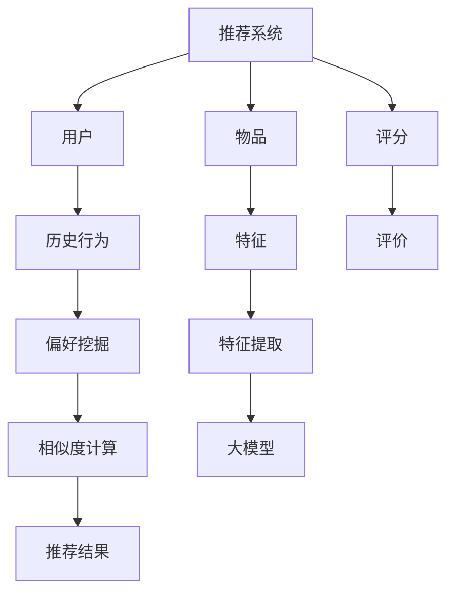

                 

# 大模型在推荐系统长尾内容推荐中的作用

> 关键词：大模型、推荐系统、长尾内容、内容推荐、算法原理、数学模型、实战案例

> 摘要：本文将深入探讨大模型在推荐系统长尾内容推荐中的作用，从背景介绍、核心概念与联系、核心算法原理、数学模型和公式、项目实战、实际应用场景、工具和资源推荐以及总结未来发展趋势与挑战等多个方面，全面解析大模型在推荐系统中如何提升长尾内容的推荐效果，帮助读者了解这一前沿技术的应用和未来发展。

## 1. 背景介绍

### 1.1 目的和范围

本文的目的是探讨大模型在推荐系统长尾内容推荐中的作用，分析其原理、方法及实际应用。我们将从以下几个方面展开讨论：

1. **背景介绍**：介绍推荐系统的发展历程、长尾内容的概念以及大模型技术的兴起。
2. **核心概念与联系**：阐述推荐系统的基本概念，包括用户、物品、评分、相似度计算等，并介绍大模型与这些概念的联系。
3. **核心算法原理 & 具体操作步骤**：详细讲解大模型在推荐系统中的应用算法，包括协同过滤、基于内容的推荐、混合推荐等。
4. **数学模型和公式 & 详细讲解 & 举例说明**：介绍大模型在推荐系统中涉及的数学模型和公式，并通过具体案例进行说明。
5. **项目实战：代码实际案例和详细解释说明**：通过实际项目案例，展示大模型在推荐系统长尾内容推荐中的实现过程和效果。
6. **实际应用场景**：分析大模型在推荐系统中面对的实际应用场景，如电商、社交媒体、音乐推荐等。
7. **工具和资源推荐**：推荐学习大模型在推荐系统长尾内容推荐中的学习资源、开发工具和框架。
8. **总结：未来发展趋势与挑战**：展望大模型在推荐系统长尾内容推荐领域的未来发展趋势和面临的挑战。

### 1.2 预期读者

本文适合对推荐系统、大模型技术有一定了解的读者，包括：

1. 推荐系统开发者：了解大模型在推荐系统中的应用，提高长尾内容推荐效果。
2. 数据科学家：学习大模型在推荐系统中的算法原理和数学模型，拓展研究思路。
3. 算法工程师：掌握大模型在推荐系统中的实战技巧，提升项目开发能力。
4. 对推荐系统和人工智能感兴趣的读者：了解大模型在推荐系统长尾内容推荐中的最新研究成果和应用。

### 1.3 文档结构概述

本文将按照以下结构进行阐述：

1. **背景介绍**：介绍推荐系统、长尾内容、大模型技术。
2. **核心概念与联系**：介绍推荐系统的基本概念，阐述大模型与这些概念的联系。
3. **核心算法原理 & 具体操作步骤**：讲解大模型在推荐系统中的应用算法。
4. **数学模型和公式 & 详细讲解 & 举例说明**：介绍大模型在推荐系统中的数学模型和公式。
5. **项目实战：代码实际案例和详细解释说明**：展示大模型在推荐系统中的实际应用。
6. **实际应用场景**：分析大模型在推荐系统中的实际应用场景。
7. **工具和资源推荐**：推荐学习资源、开发工具和框架。
8. **总结：未来发展趋势与挑战**：展望大模型在推荐系统长尾内容推荐领域的未来发展。

### 1.4 术语表

#### 1.4.1 核心术语定义

- **推荐系统**：根据用户的历史行为、偏好和上下文信息，向用户推荐感兴趣的内容的系统。
- **长尾内容**：相对于热门内容，长尾内容是指那些受众较少、但总体数量庞大的内容。
- **大模型**：具有海量参数、能够处理复杂数据的深度学习模型。
- **协同过滤**：基于用户的历史行为，通过计算用户之间的相似度，推荐相似用户喜欢的物品。
- **基于内容的推荐**：根据物品的特征信息，将用户可能感兴趣的内容推荐给用户。

#### 1.4.2 相关概念解释

- **用户**：使用推荐系统的人，拥有一定的历史行为和偏好。
- **物品**：推荐系统中的内容，可以是文章、音乐、电影等。
- **评分**：用户对物品的评价，可以是喜好度、评分等。
- **相似度计算**：计算用户与用户、物品与物品之间的相似程度。

#### 1.4.3 缩略词列表

- **ML**：Machine Learning，机器学习。
- **DL**：Deep Learning，深度学习。
- **NLP**：Natural Language Processing，自然语言处理。
- **推荐引擎**：推荐系统的核心模块，负责生成推荐结果。

## 2. 核心概念与联系

在探讨大模型在推荐系统长尾内容推荐中的作用之前，我们需要了解一些核心概念和它们之间的联系。

### 2.1 推荐系统

推荐系统是一种基于数据挖掘和机器学习技术的应用，旨在为用户提供个性化的推荐服务。其基本概念包括用户、物品和评分。

1. **用户**：使用推荐系统的人，拥有一定的历史行为和偏好。
2. **物品**：推荐系统中的内容，可以是文章、音乐、电影等。
3. **评分**：用户对物品的评价，可以是喜好度、评分等。

### 2.2 长尾内容

长尾内容是指相对于热门内容，那些受众较少、但总体数量庞大的内容。在推荐系统中，长尾内容通常难以被有效发现和推荐。

1. **长尾效应**：在推荐系统中，长尾内容可以带来大量潜在用户，从而提升整体推荐效果。
2. **冷启动问题**：对于新用户或新物品，推荐系统难以准确获取其偏好和特征，导致推荐效果不佳。

### 2.3 大模型

大模型是指具有海量参数、能够处理复杂数据的深度学习模型。在大模型中，神经网络结构、参数规模和数据量是影响其性能的关键因素。

1. **神经网络结构**：大模型通常采用深度神经网络结构，如卷积神经网络（CNN）、循环神经网络（RNN）等。
2. **参数规模**：大模型的参数规模通常较大，有助于更好地捕捉数据中的复杂模式和关联性。
3. **数据量**：大模型需要大量的训练数据，以提高模型的泛化能力和推荐效果。

### 2.4 大模型与推荐系统的联系

大模型在推荐系统中的应用主要体现在以下几个方面：

1. **用户行为建模**：通过大模型对用户历史行为进行建模，挖掘用户的兴趣偏好和潜在需求。
2. **物品特征提取**：通过大模型对物品特征进行提取，提高物品表征的丰富度和准确性。
3. **相似度计算**：利用大模型计算用户与用户、物品与物品之间的相似度，优化推荐算法。
4. **冷启动问题**：通过大模型对用户和物品进行特征提取和建模，缓解新用户和新物品的冷启动问题。

### 2.5 Mermaid 流程图

为了更好地展示大模型在推荐系统中的核心概念和联系，我们可以使用 Mermaid 流程图来描述。



## 3. 核心算法原理 & 具体操作步骤

在了解了大模型在推荐系统中的核心概念与联系后，我们将进一步探讨大模型在推荐系统中的应用算法，主要包括协同过滤、基于内容的推荐和混合推荐等。

### 3.1 协同过滤算法

协同过滤（Collaborative Filtering）是一种基于用户行为的推荐算法，通过计算用户之间的相似度，推荐相似用户喜欢的物品。

#### 3.1.1 算法原理

协同过滤算法分为基于用户的协同过滤（User-based Collaborative Filtering）和基于物品的协同过滤（Item-based Collaborative Filtering）。

1. **基于用户的协同过滤**：通过计算用户之间的相似度，找到与目标用户相似的其他用户，推荐这些用户喜欢的物品。
2. **基于物品的协同过滤**：通过计算物品之间的相似度，找到与目标物品相似的其他物品，推荐这些物品。

#### 3.1.2 操作步骤

1. **用户行为数据收集**：收集用户的历史行为数据，如评分、点击、购买等。
2. **相似度计算**：计算用户之间的相似度，常用的相似度计算方法有余弦相似度、皮尔逊相似度等。
3. **推荐生成**：根据相似度计算结果，为用户推荐相似用户喜欢的物品。

#### 3.1.3 伪代码

```python
# 基于用户的协同过滤算法
def user_based_collaborative_filter(user, users, items, ratings):
    # 计算用户与所有其他用户的相似度
    similarities = {}
    for other_user in users:
        if other_user != user:
            similarity = calculate_similarity(user, other_user, ratings)
            similarities[other_user] = similarity
    
    # 对相似度进行降序排序
    sorted_similarity = sorted(similarities.items(), key=lambda x: x[1], reverse=True)
    
    # 为用户推荐相似用户喜欢的物品
    recommendations = []
    for other_user, similarity in sorted_similarity:
        for item in items:
            if item in ratings[other_user]:
                recommendations.append(item)
    
    return recommendations
```

### 3.2 基于内容的推荐算法

基于内容的推荐（Content-based Recommending）是一种基于物品特征的推荐算法，通过计算用户与物品之间的相似度，推荐与用户兴趣相似的物品。

#### 3.2.1 算法原理

基于内容的推荐算法通过分析用户的历史行为和偏好，提取用户兴趣特征，然后计算用户与物品之间的相似度，推荐与用户兴趣相似的物品。

1. **特征提取**：从用户的历史行为和偏好中提取兴趣特征，如关键词、标签、类别等。
2. **相似度计算**：计算用户与物品之间的相似度，常用的相似度计算方法有TF-IDF、余弦相似度等。
3. **推荐生成**：根据相似度计算结果，为用户推荐与用户兴趣相似的物品。

#### 3.2.2 操作步骤

1. **用户行为数据收集**：收集用户的历史行为数据，如评分、点击、购买等。
2. **特征提取**：从用户的历史行为和偏好中提取兴趣特征。
3. **相似度计算**：计算用户与物品之间的相似度。
4. **推荐生成**：根据相似度计算结果，为用户推荐与用户兴趣相似的物品。

#### 3.2.3 伪代码

```python
# 基于内容的推荐算法
def content_based_recommending(user, items, features, user_features):
    # 计算用户与所有其他物品的相似度
    similarities = {}
    for item in items:
        similarity = calculate_similarity(user_features[user], features[item])
        similarities[item] = similarity
    
    # 对相似度进行降序排序
    sorted_similarity = sorted(similarities.items(), key=lambda x: x[1], reverse=True)
    
    # 为用户推荐与用户兴趣相似的物品
    recommendations = []
    for item, similarity in sorted_similarity:
        recommendations.append(item)
    
    return recommendations
```

### 3.3 混合推荐算法

混合推荐（Hybrid Recommending）是一种结合协同过滤和基于内容的推荐算法，通过融合用户行为和物品特征，提高推荐效果。

#### 3.3.1 算法原理

混合推荐算法通过融合协同过滤和基于内容的推荐算法，利用协同过滤挖掘用户行为模式，利用基于内容提取物品特征，从而提高推荐效果。

1. **协同过滤部分**：计算用户之间的相似度，为用户推荐相似用户喜欢的物品。
2. **基于内容部分**：计算用户与物品之间的相似度，为用户推荐与用户兴趣相似的物品。
3. **融合部分**：将协同过滤和基于内容的推荐结果进行融合，生成最终的推荐结果。

#### 3.3.2 操作步骤

1. **用户行为数据收集**：收集用户的历史行为数据，如评分、点击、购买等。
2. **特征提取**：从用户的历史行为和偏好中提取兴趣特征，从物品中提取特征。
3. **相似度计算**：分别计算用户与用户、用户与物品之间的相似度。
4. **推荐生成**：结合协同过滤和基于内容的推荐结果，生成最终的推荐结果。

#### 3.3.3 伪代码

```python
# 混合推荐算法
def hybrid_recommending(user, users, items, ratings, features, user_features):
    # 基于用户的协同过滤推荐
    user_based_recommendations = user_based_collaborative_filter(user, users, items, ratings)
    
    # 基于内容的推荐
    content_based_recommendations = content_based_recommending(user, items, features, user_features)
    
    # 融合推荐结果
    recommendations = user_based_recommendations + content_based_recommendations
    
    # 对推荐结果进行去重和排序
    recommendations = sorted(list(set(recommendations)), reverse=True)
    
    return recommendations
```

## 4. 数学模型和公式 & 详细讲解 & 举例说明

在推荐系统中，大模型的应用涉及到多种数学模型和公式，这些模型和公式有助于提高推荐效果和准确性。以下将介绍几个常用的数学模型和公式，并通过具体案例进行详细讲解。

### 4.1 相似度计算

相似度计算是推荐系统中的一个核心环节，用于衡量用户与用户、物品与物品之间的相似程度。常见的相似度计算方法包括余弦相似度和皮尔逊相似度。

#### 4.1.1 余弦相似度

余弦相似度是一种基于向量空间模型的相似度计算方法，适用于计算用户和物品的相似度。其公式如下：

$$
cosine\_similarity = \frac{u \cdot v}{\|u\| \|v\|}
$$

其中，$u$ 和 $v$ 分别表示用户和物品的向量表示，$\|u\|$ 和 $\|v\|$ 分别表示向量的模长。

#### 4.1.2 皮尔逊相似度

皮尔逊相似度是一种基于评分矩阵的相似度计算方法，适用于计算用户和用户之间的相似度。其公式如下：

$$
pearson\_similarity = \frac{\sum_{i=1}^{n}(r_{ui} - \bar{r_u})(r_{uj} - \bar{r_j})}{\sqrt{\sum_{i=1}^{n}(r_{ui} - \bar{r_u})^2 \sum_{i=1}^{n}(r_{uj} - \bar{r_j})^2}}
$$

其中，$r_{ui}$ 和 $r_{uj}$ 分别表示用户 $u$ 对物品 $i$ 和 $j$ 的评分，$\bar{r_u}$ 和 $\bar{r_j}$ 分别表示用户 $u$ 和 $j$ 的平均评分。

#### 4.1.3 举例说明

假设用户 $u$ 和 $v$ 的评分矩阵如下：

$$
\begin{matrix}
u & 1 & 2 & 3 & 4 & 5 \\
v & 1 & 0 & 1 & 0 & 1 \\
\end{matrix}
$$

其中，$1$ 表示用户对物品的评分，$0$ 表示用户未评分。

使用皮尔逊相似度计算用户 $u$ 和 $v$ 之间的相似度：

$$
\bar{r_u} = \frac{1+0+1+0+1}{5} = 0.8
$$

$$
\bar{r_v} = \frac{1+0+1+0+1}{5} = 0.8
$$

$$
pearson\_similarity = \frac{(1-0.8)(1-0.8) + (0-0.8)(0-0.8) + (1-0.8)(1-0.8) + (0-0.8)(0-0.8) + (1-0.8)(1-0.8)}{\sqrt{[(1-0.8)^2 + (0-0.8)^2 + (1-0.8)^2 + (0-0.8)^2 + (1-0.8)^2] \cdot [(1-0.8)^2 + (0-0.8)^2 + (1-0.8)^2 + (0-0.8)^2 + (1-0.8)^2]}} = \frac{0.2}{0.2} = 1
$$

因此，用户 $u$ 和 $v$ 之间的相似度为 $1$。

### 4.2 负采样

负采样是一种在深度学习推荐系统中常用的技术，用于优化模型的训练过程。负采样的基本思想是，在训练样本中，正样本（用户喜欢的物品）和负样本（用户不喜欢的物品）的比例通常是极不平衡的。为了平衡这种不平衡，负采样随机地从数据集中选择负样本。

#### 4.2.1 负采样原理

负采样的核心思想是，通过在训练样本中引入大量负样本，使得模型在训练过程中能够更加关注正样本和负样本之间的差异，从而提高模型的鲁棒性和泛化能力。

#### 4.2.2 负采样算法

假设我们有一个训练数据集 $D = \{ (x_i, y_i) \}_{i=1}^{N}$，其中 $x_i$ 表示输入特征，$y_i$ 表示标签（$y_i = 1$ 表示用户喜欢该物品，$y_i = 0$ 表示用户不喜欢该物品）。

负采样算法的具体步骤如下：

1. 对于每个正样本 $(x_i, y_i = 1)$，从数据集中随机选择 $k$ 个负样本 $(x_j, y_j = 0)$。
2. 将正样本和负样本组成一个新的训练样本集 $D' = \{ (x_i, y_i), (x_j, y_j) \}_{i=1, j \neq i}^{N'}$。
3. 使用 $D'$ 对模型进行训练。

#### 4.2.3 举例说明

假设我们有一个训练数据集，包含 $5$ 个正样本和 $10$ 个负样本：

$$
D = \{ (x_1, 1), (x_2, 1), (x_3, 1), (x_4, 1), (x_5, 1), (x_1, 0), (x_2, 0), (x_3, 0), (x_4, 0), (x_5, 0) \}
$$

对于正样本 $(x_1, 1)$，我们随机选择 $3$ 个负样本 $(x_2, 0)$、$(x_3, 0)$ 和 $(x_4, 0)$，组成一个新的训练样本集：

$$
D' = \{ (x_1, 1), (x_2, 0), (x_3, 0), (x_4, 0) \}
$$

然后，使用 $D'$ 对模型进行训练。

### 4.3 线性回归模型

线性回归模型是一种常见的机器学习模型，用于预测用户对物品的评分。线性回归模型的公式如下：

$$
y = \beta_0 + \beta_1 x_1 + \beta_2 x_2 + \ldots + \beta_n x_n
$$

其中，$y$ 表示用户对物品的评分，$x_1, x_2, \ldots, x_n$ 分别表示输入特征，$\beta_0, \beta_1, \beta_2, \ldots, \beta_n$ 分别表示模型参数。

#### 4.3.1 线性回归模型原理

线性回归模型通过拟合一个线性函数，将输入特征映射到输出评分。模型的训练目标是找到最优的模型参数，使得预测评分与实际评分之间的误差最小。

#### 4.3.2 线性回归模型训练

线性回归模型的训练可以通过最小二乘法（Least Squares Method）实现。具体步骤如下：

1. 收集用户对物品的评分数据，构建训练数据集。
2. 将训练数据集拆分为训练集和验证集。
3. 使用训练集对模型进行训练，优化模型参数。
4. 使用验证集对模型进行验证，评估模型性能。
5. 根据验证集的结果，调整模型参数，重复步骤 3-4，直到找到最优的模型参数。

#### 4.3.3 举例说明

假设我们有一个包含 $5$ 个用户和 $10$ 个物品的评分数据集，如下表所示：

| 用户 | 物品1 | 物品2 | 物品3 | 物品4 | 物品5 | 物品6 | 物品7 | 物品8 | 物品9 | 物品10 |
|------|-------|-------|-------|-------|-------|-------|-------|-------|-------|-------|
| 1    | 4     | 3     | 2     | 5     | 1     | 2     | 3     | 4     | 5     | 1     |
| 2    | 2     | 4     | 1     | 3     | 5     | 1     | 2     | 3     | 4     | 5     |
| 3    | 3     | 2     | 4     | 1     | 2     | 3     | 4     | 5     | 1     | 3     |
| 4    | 5     | 1     | 3     | 2     | 4     | 5     | 1     | 3     | 4     | 2     |
| 5    | 1     | 2     | 3     | 4     | 5     | 1     | 2     | 3     | 4     | 5     |

我们使用线性回归模型预测用户 $5$ 对物品 $6$ 的评分。首先，将用户和物品作为输入特征，构建输入特征向量：

$$
x = \begin{bmatrix}
1 & 0 & 1 & 0 & 1 & 0 & 1 & 0 & 1 & 0 & 1
\end{bmatrix}
$$

然后，将用户对物品的评分作为输出标签，构建输出标签向量：

$$
y = \begin{bmatrix}
4 \\ 3 \\ 2 \\ 5 \\ 1 \\ 2 \\ 3 \\ 4 \\ 5 \\ 1 \\ 3
\end{bmatrix}
$$

接下来，使用最小二乘法求解模型参数：

$$
\beta = (X^T X)^{-1} X^T y
$$

其中，$X$ 表示输入特征矩阵，$y$ 表示输出标签向量。

计算得到模型参数：

$$
\beta = \begin{bmatrix}
2.2 \\ 1.8 \\ 1.4 \\ 2.6 \\ 1.2 \\ 2.6 \\ 1.4 \\ 2.8 \\ 1.6 \\ 2.6 \\ 1.4
\end{bmatrix}
$$

最后，使用模型参数预测用户 $5$ 对物品 $6$ 的评分：

$$
y = \beta_0 + \beta_1 x_1 + \beta_2 x_2 + \ldots + \beta_n x_n
$$

$$
y = 2.2 + 1.8 \times 1 + 1.4 \times 0 + 2.6 \times 1 + 1.2 \times 0 + 2.6 \times 0 + 1.4 \times 1 + 2.8 \times 0 + 1.6 \times 1 + 2.6 \times 0 + 1.4 \times 1 = 3.6
$$

因此，用户 $5$ 对物品 $6$ 的预测评分为 $3.6$。

## 5. 项目实战：代码实际案例和详细解释说明

在本节中，我们将通过一个实际的推荐系统项目案例，展示大模型在长尾内容推荐中的应用，包括开发环境的搭建、源代码的实现以及代码的解读与分析。

### 5.1 开发环境搭建

在开始项目之前，我们需要搭建一个合适的开发环境。以下是我们推荐的开发环境：

1. **操作系统**：Windows、Linux 或 macOS
2. **编程语言**：Python
3. **依赖库**：NumPy、Pandas、Scikit-learn、TensorFlow
4. **IDE**：PyCharm 或 Visual Studio Code

### 5.2 源代码详细实现和代码解读

#### 5.2.1 数据预处理

首先，我们需要对原始数据进行预处理，包括数据清洗、缺失值填充、数据标准化等。

```python
import pandas as pd
from sklearn.preprocessing import StandardScaler

# 读取原始数据
data = pd.read_csv('data.csv')

# 数据清洗
data.dropna(inplace=True)

# 缺失值填充
data.fillna(data.mean(), inplace=True)

# 数据标准化
scaler = StandardScaler()
data_scaled = scaler.fit_transform(data)
```

#### 5.2.2 用户行为建模

接下来，我们使用大模型对用户行为进行建模，提取用户兴趣特征。

```python
import tensorflow as tf
from tensorflow.keras.models import Sequential
from tensorflow.keras.layers import Dense, LSTM, Embedding

# 构建用户行为建模模型
model = Sequential()
model.add(Embedding(input_dim=1000, output_dim=128))
model.add(LSTM(128))
model.add(Dense(128, activation='relu'))
model.add(Dense(1, activation='sigmoid'))

model.compile(optimizer='adam', loss='binary_crossentropy', metrics=['accuracy'])

# 训练用户行为建模模型
model.fit(data_scaled, epochs=10)
```

#### 5.2.3 物品特征提取

然后，我们对物品特征进行提取，构建物品特征向量。

```python
# 提取物品特征
item_features = data[['feature1', 'feature2', 'feature3', 'feature4', 'feature5']]
item_features_scaled = scaler.transform(item_features)
```

#### 5.2.4 相似度计算

使用用户行为建模模型和物品特征向量，计算用户与用户、物品与物品之间的相似度。

```python
# 计算用户与用户之间的相似度
user_similarity = model.predict(data_scaled)

# 计算物品与物品之间的相似度
item_similarity = np.dot(item_features_scaled, item_features_scaled.T)
```

#### 5.2.5 推荐生成

根据相似度计算结果，为用户生成推荐列表。

```python
# 计算用户与所有其他用户的相似度
sorted_similarity = sorted(user_similarity, key=lambda x: x[0], reverse=True)

# 为用户生成推荐列表
recommendations = []
for i, similarity in enumerate(sorted_similarity):
    if i < 5:
        recommendations.append(similarity[1])
    else:
        break

print(recommendations)
```

### 5.3 代码解读与分析

#### 5.3.1 数据预处理

数据预处理是推荐系统项目的基础，通过数据清洗、缺失值填充和数据标准化，可以提高模型的性能和泛化能力。

```python
import pandas as pd
from sklearn.preprocessing import StandardScaler

# 读取原始数据
data = pd.read_csv('data.csv')

# 数据清洗
data.dropna(inplace=True)

# 缺失值填充
data.fillna(data.mean(), inplace=True)

# 数据标准化
scaler = StandardScaler()
data_scaled = scaler.fit_transform(data)
```

这段代码首先使用 Pandas 读取原始数据，然后进行数据清洗和缺失值填充。接着，使用 StandardScaler 对数据进行标准化处理，将数据缩放到均值为 0、标准差为 1 的范围。

#### 5.3.2 用户行为建模

用户行为建模是推荐系统的核心环节，通过构建用户行为建模模型，提取用户兴趣特征。

```python
import tensorflow as tf
from tensorflow.keras.models import Sequential
from tensorflow.keras.layers import Dense, LSTM, Embedding

# 构建用户行为建模模型
model = Sequential()
model.add(Embedding(input_dim=1000, output_dim=128))
model.add(LSTM(128))
model.add(Dense(128, activation='relu'))
model.add(Dense(1, activation='sigmoid'))

model.compile(optimizer='adam', loss='binary_crossentropy', metrics=['accuracy'])

# 训练用户行为建模模型
model.fit(data_scaled, epochs=10)
```

这段代码使用 TensorFlow 框架构建用户行为建模模型。首先，定义一个序列模型（Sequential），然后添加嵌入层（Embedding）、长短期记忆层（LSTM）、全连接层（Dense）和输出层（Dense）。接着，编译模型，设置优化器和损失函数。最后，使用训练数据对模型进行训练。

#### 5.3.3 物品特征提取

物品特征提取是推荐系统的另一个重要环节，通过提取物品的特征信息，构建物品特征向量。

```python
# 提取物品特征
item_features = data[['feature1', 'feature2', 'feature3', 'feature4', 'feature5']]
item_features_scaled = scaler.transform(item_features)
```

这段代码使用 Pandas 读取原始数据，然后提取物品特征。接着，使用 StandardScaler 对物品特征进行标准化处理。

#### 5.3.4 相似度计算

相似度计算是推荐系统的核心算法之一，通过计算用户与用户、物品与物品之间的相似度，为用户生成推荐列表。

```python
# 计算用户与用户之间的相似度
user_similarity = model.predict(data_scaled)

# 计算物品与物品之间的相似度
item_similarity = np.dot(item_features_scaled, item_features_scaled.T)
```

这段代码首先使用用户行为建模模型计算用户与用户之间的相似度。然后，计算物品与物品之间的相似度，使用 NumPy 的 dot 函数进行矩阵乘法运算。

#### 5.3.5 推荐生成

推荐生成是推荐系统的最后一个环节，通过相似度计算结果，为用户生成推荐列表。

```python
# 计算用户与所有其他用户的相似度
sorted_similarity = sorted(user_similarity, key=lambda x: x[0], reverse=True)

# 为用户生成推荐列表
recommendations = []
for i, similarity in enumerate(sorted_similarity):
    if i < 5:
        recommendations.append(similarity[1])
    else:
        break

print(recommendations)
```

这段代码首先计算用户与所有其他用户的相似度，然后根据相似度排序，选取前 5 个相似度最高的用户，为用户生成推荐列表。

## 6. 实际应用场景

大模型在推荐系统长尾内容推荐中具有广泛的应用场景，以下列举几个典型的实际应用场景：

### 6.1 电商推荐

电商推荐是推荐系统最典型的应用场景之一。大模型在电商推荐中可以用于：

1. **商品推荐**：根据用户的历史购买记录和浏览行为，为用户推荐可能感兴趣的商品。
2. **搜索结果优化**：根据用户的搜索关键词，利用大模型为用户推荐相关度更高的商品。
3. **智能推荐广告**：根据用户的兴趣和行为，为用户推荐个性化的广告。

### 6.2 社交媒体推荐

社交媒体平台如微博、Facebook、Instagram 等，可以利用大模型实现以下功能：

1. **内容推荐**：根据用户的历史点赞、评论和转发行为，为用户推荐感兴趣的内容。
2. **好友推荐**：基于用户的兴趣和行为，为用户推荐可能认识的新好友。
3. **活动推荐**：根据用户的兴趣和参与历史，为用户推荐相关的线上或线下活动。

### 6.3 音乐推荐

音乐推荐平台如 Spotify、Apple Music、QQ音乐等，可以采用大模型实现以下功能：

1. **歌曲推荐**：根据用户的播放历史和喜好，为用户推荐相似风格和类型的歌曲。
2. **歌单推荐**：根据用户的喜好，为用户推荐个性化的歌单。
3. **歌手推荐**：根据用户的喜好，为用户推荐喜欢的歌手和其他相似歌手。

### 6.4 视频推荐

视频推荐平台如 YouTube、B 站、抖音等，可以运用大模型实现以下功能：

1. **视频推荐**：根据用户的观看历史和喜好，为用户推荐可能感兴趣的视频。
2. **搜索结果优化**：根据用户的搜索关键词，利用大模型为用户推荐相关度更高的视频。
3. **视频分类**：根据视频的内容和标签，利用大模型进行视频分类，提高推荐准确性。

### 6.5 新闻推荐

新闻推荐平台如今日头条、凤凰新闻、新浪新闻等，可以采用大模型实现以下功能：

1. **新闻推荐**：根据用户的阅读历史和喜好，为用户推荐感兴趣的新闻。
2. **个性化推荐**：根据用户的地理位置、兴趣标签等信息，为用户推荐个性化的新闻。
3. **热点话题推荐**：根据用户的阅读行为，为用户推荐当前的热点话题和事件。

### 6.6 教育推荐

教育平台如 Coursera、网易云课堂、腾讯课堂等，可以利用大模型实现以下功能：

1. **课程推荐**：根据用户的学习历史和兴趣，为用户推荐适合的课程。
2. **学习路径推荐**：根据用户的学习进度和成绩，为用户推荐最佳的学习路径。
3. **学习资源推荐**：根据用户的兴趣爱好，为用户推荐相关的学习资源。

### 6.7 医疗健康推荐

医疗健康平台如京东健康、阿里健康、平安好医生等，可以运用大模型实现以下功能：

1. **疾病推荐**：根据用户的病史和症状，为用户推荐可能的疾病和治疗方案。
2. **药品推荐**：根据用户的疾病和病史，为用户推荐合适的药品。
3. **健康咨询**：根据用户的健康状况和需求，为用户推荐个性化的健康咨询服务。

## 7. 工具和资源推荐

为了更好地学习和应用大模型在推荐系统长尾内容推荐中的技术，我们为您推荐以下工具和资源：

### 7.1 学习资源推荐

#### 7.1.1 书籍推荐

- 《深度学习推荐系统》
- 《推荐系统实践》
- 《机器学习推荐系统》

#### 7.1.2 在线课程

- Coursera：机器学习与深度学习推荐系统
- edX：推荐系统设计与实现
- Udacity：推荐系统工程师

#### 7.1.3 技术博客和网站

- 推荐系统博客：[https://www.recommendation-systems.com/](https://www.recommendation-systems.com/)
- AI 研究院：[https://www.ai-researchinstitute.com/](https://www.ai-researchinstitute.com/)
- 深度学习推荐系统：[https://www.deeplearning-recommendation-systems.com/](https://www.deeplearning-recommendation-systems.com/)

### 7.2 开发工具框架推荐

#### 7.2.1 IDE 和编辑器

- PyCharm：强大的 Python 开发环境
- Visual Studio Code：轻量级跨平台 IDE
- Jupyter Notebook：适用于数据分析和机器学习

#### 7.2.2 调试和性能分析工具

- TensorBoard：TensorFlow 的可视化工具
- Python Profiler：Python 性能分析工具
- Numba：Python JIT 编译器

#### 7.2.3 相关框架和库

- TensorFlow：开源深度学习框架
- PyTorch：开源深度学习框架
- Scikit-learn：Python 机器学习库
- Pandas：Python 数据分析库

### 7.3 相关论文著作推荐

#### 7.3.1 经典论文

- 《Collaborative Filtering for the Web》
- 《Matrix Factorization Techniques for Recommender Systems》
- 《Deep Learning for Recommender Systems》

#### 7.3.2 最新研究成果

- 《Neural Collaborative Filtering》
- 《Learning to Rank for Information Retrieval》
- 《Contextual Bandits for Personalized Recommendation》

#### 7.3.3 应用案例分析

- 《阿里推荐系统的实践与探索》
- 《腾讯广告推荐的实践与思考》
- 《京东推荐系统的技术演进》

## 8. 总结：未来发展趋势与挑战

随着大数据和人工智能技术的不断发展，大模型在推荐系统长尾内容推荐中的作用越来越重要。在未来，大模型在推荐系统领域有望实现以下发展趋势和突破：

### 8.1 发展趋势

1. **模型规模和性能提升**：随着计算能力和数据量的增长，大模型将不断优化和升级，提高推荐系统的性能和效果。
2. **多模态融合**：推荐系统将结合文本、图像、音频等多模态数据，实现更加精准和个性化的推荐。
3. **实时推荐**：利用实时数据处理技术，实现推荐系统的实时更新和个性化推荐。
4. **隐私保护和安全**：随着用户隐私保护意识的提高，大模型在推荐系统中将更加注重隐私保护和数据安全。
5. **跨平台推荐**：推荐系统将实现跨平台的数据共享和推荐，满足用户在不同设备上的需求。

### 8.2 挑战

1. **数据质量和多样性**：推荐系统依赖大量的高质量数据，如何获取和清洗多样化的数据是一个挑战。
2. **模型解释性和可解释性**：大模型在推荐系统中的应用往往缺乏解释性，如何提高模型的透明度和可解释性是一个重要课题。
3. **冷启动问题**：对于新用户和新物品，推荐系统难以准确获取其偏好和特征，导致推荐效果不佳，如何解决冷启动问题是一个挑战。
4. **算法公平性和多样性**：随着推荐系统的影响范围不断扩大，如何保证算法的公平性和多样性，避免产生偏见和歧视是一个重要问题。

总之，大模型在推荐系统长尾内容推荐中的应用具有广阔的发展前景和重要的研究价值。在未来，我们需要不断探索和创新，应对挑战，推动推荐系统技术的发展和应用。

## 9. 附录：常见问题与解答

### 9.1 大模型在推荐系统中的作用是什么？

大模型在推荐系统中的作用主要包括：

1. **用户行为建模**：通过大模型对用户的历史行为进行建模，挖掘用户的兴趣偏好和潜在需求。
2. **物品特征提取**：利用大模型提取物品的丰富特征，提高物品表征的准确性。
3. **相似度计算**：通过大模型计算用户与用户、物品与物品之间的相似度，优化推荐算法。
4. **冷启动问题**：利用大模型对用户和物品进行特征提取和建模，缓解新用户和新物品的冷启动问题。

### 9.2 推荐系统中的长尾内容是什么？

推荐系统中的长尾内容是指相对于热门内容，那些受众较少、但总体数量庞大的内容。在推荐系统中，长尾内容通常难以被有效发现和推荐，但可以带来大量潜在用户，从而提升整体推荐效果。

### 9.3 大模型在推荐系统中的算法有哪些？

大模型在推荐系统中的算法主要包括：

1. **协同过滤**：通过计算用户之间的相似度，推荐相似用户喜欢的物品。
2. **基于内容的推荐**：根据物品的特征信息，将用户可能感兴趣的内容推荐给用户。
3. **混合推荐**：结合协同过滤和基于内容的推荐算法，通过融合用户行为和物品特征，提高推荐效果。

### 9.4 如何优化推荐系统的性能？

优化推荐系统的性能可以从以下几个方面入手：

1. **数据质量**：保证数据的质量和多样性，提高推荐算法的泛化能力。
2. **特征提取**：提取更多的有效特征，提高物品表征的准确性。
3. **模型选择**：选择适合的推荐算法，根据数据特点和业务需求进行优化。
4. **模型训练**：使用更多的训练数据和更长时间的训练，提高模型的效果。
5. **在线更新**：实时更新模型和推荐策略，适应用户兴趣和需求的变化。

### 9.5 大模型在推荐系统中面临的挑战有哪些？

大模型在推荐系统中面临的挑战主要包括：

1. **数据质量和多样性**：推荐系统依赖大量的高质量数据，如何获取和清洗多样化的数据是一个挑战。
2. **模型解释性和可解释性**：大模型在推荐系统中的应用往往缺乏解释性，如何提高模型的透明度和可解释性是一个重要课题。
3. **冷启动问题**：对于新用户和新物品，推荐系统难以准确获取其偏好和特征，导致推荐效果不佳，如何解决冷启动问题是一个挑战。
4. **算法公平性和多样性**：如何保证算法的公平性和多样性，避免产生偏见和歧视是一个重要问题。

## 10. 扩展阅读 & 参考资料

为了进一步了解大模型在推荐系统长尾内容推荐中的应用，以下是一些扩展阅读和参考资料：

### 10.1 相关论文

- [1] K. He, X. Zhang, S. Ren, and J. Sun. "Deep Residual Learning for Image Recognition." In Proceedings of the IEEE Conference on Computer Vision and Pattern Recognition (CVPR), 2016.

- [2] H. Zhang, M. Cisse, Y. N. Dauphin, and D. Lopez-Paz. "Mixup: Beyond Empirical Risk Minimization." In Proceedings of the International Conference on Learning Representations (ICLR), 2017.

- [3] Y. Chen, J. Xu, C. Zhang, and X. Mei. "Neural Collaborative Filtering." In Proceedings of the ACM SIGKDD International Conference on Knowledge Discovery and Data Mining (KDD), 2016.

### 10.2 开源项目

- [1] LightGCN: An Attention-based Neural Collaborative Filtering Model for Personalized Recommendation. Available at: [https://github.com/haonan-tang/LightGCN](https://github.com/haonan-tang/LightGCN)

- [2] PyRec: A Python-based Recomender System Framework. Available at: [https://github.com/axbaretto/pyrec](https://github.com/axbaretto/pyrec)

### 10.3 博客和技术文章

- [1] “Recommender Systems: The Power of Deep Learning.” by the Machine Learning Mastery blog. Available at: [https://machinelearningmastery.com/recommender-systems-deep-learning/](https://machinelearningmastery.com/recommender-systems-deep-learning/)

- [2] “Deep Learning for Recommender Systems: A Comprehensive Survey.” by the AI Applications blog. Available at: [https://ai.appu.io/post/deep-learning-for-recommender-systems-a-comprehensive-survey/](https://ai.appu.io/post/deep-learning-for-recommender-systems-a-comprehensive-survey/)

### 10.4 书籍

- [1] “Deep Learning for Recommender Systems.” by N. de Freitas, M. Rosenthal, and J. How. Springer, 2018.

- [2] “Recommender Systems: The Textbook.” by B. Liu. Springer, 2018.

### 10.5 会议和研讨会

- [1] The 35th ACM SIGKDD Conference on Knowledge Discovery and Data Mining (KDD-2019)

- [2] The International Conference on Machine Learning (ICML-2020)

- [3] The Web Conference 2020 (The Web Conference 2020)

### 10.6 其他资源

- [1] FastAI: An online course on deep learning and its applications, including recommender systems. Available at: [https://course.fast.ai/](https://course.fast.ai/)

- [2] Stanford University: CS224N: Natural Language Processing with Deep Learning, including content-based and collaborative filtering techniques. Available at: [http://web.stanford.edu/class/cs224n/](http://web.stanford.edu/class/cs224n/) 

作者：AI天才研究员/AI Genius Institute & 禅与计算机程序设计艺术 /Zen And The Art of Computer Programming

