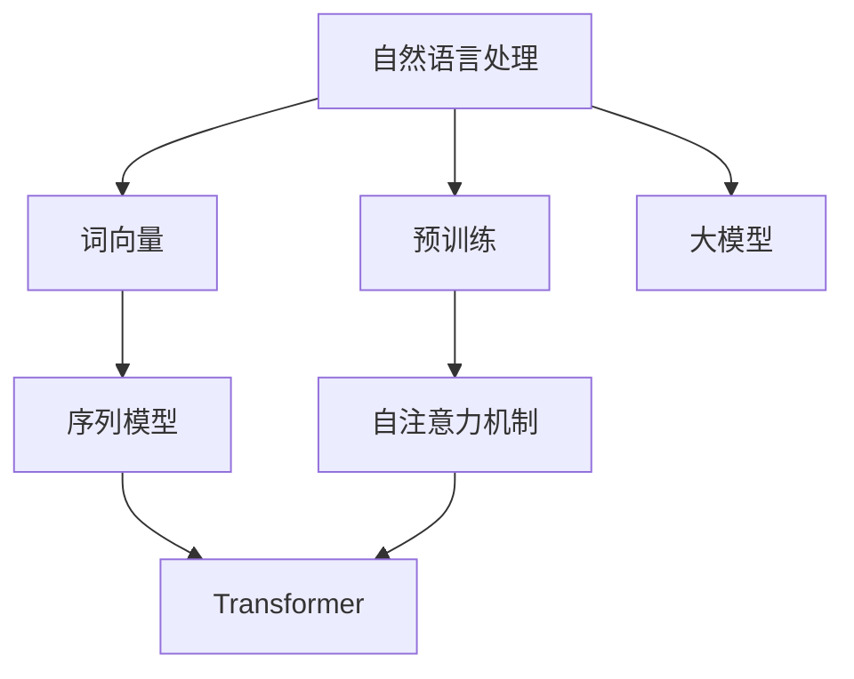
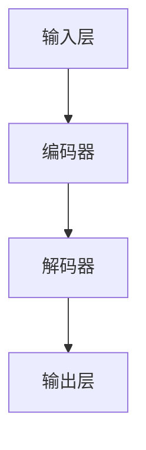
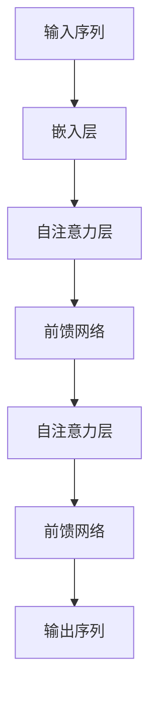
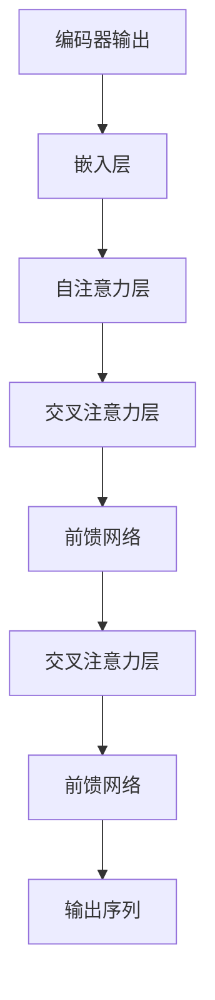
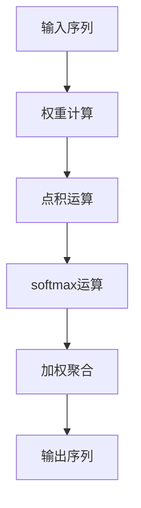
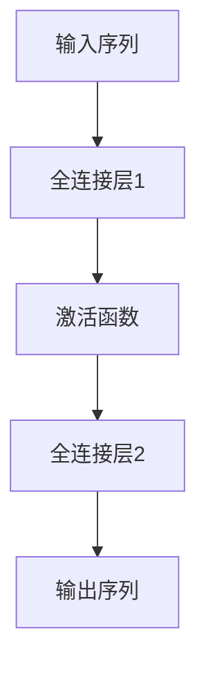

                 

# 大模型在文字处理的进展

> **关键词：** 大模型、自然语言处理、文本生成、文本分类、情感分析、预训练、微调

> **摘要：** 本文将探讨大模型在文字处理领域的最新进展，从背景介绍到核心概念、算法原理、数学模型，再到实际应用场景和未来发展趋势，为您呈现一幅全面的大模型应用图景。

## 1. 背景介绍

### 1.1 目的和范围

本文旨在探讨大模型在文字处理领域的应用，特别是自然语言处理（NLP）方面的进展。我们将从以下几个方面展开讨论：

1. 大模型的背景和意义
2. 大模型在文字处理中的具体应用
3. 大模型的算法原理和数学模型
4. 大模型的实际应用场景
5. 大模型的未来发展趋势与挑战

### 1.2 预期读者

本文面向对自然语言处理和人工智能感兴趣的读者，包括但不限于：

1. 自然语言处理研究者
2. 人工智能开发者
3. 计算机科学学生
4. 对NLP领域感兴趣的从业者

### 1.3 文档结构概述

本文分为十个部分，结构如下：

1. 背景介绍
2. 核心概念与联系
3. 核心算法原理 & 具体操作步骤
4. 数学模型和公式 & 详细讲解 & 举例说明
5. 项目实战：代码实际案例和详细解释说明
6. 实际应用场景
7. 工具和资源推荐
8. 总结：未来发展趋势与挑战
9. 附录：常见问题与解答
10. 扩展阅读 & 参考资料

### 1.4 术语表

#### 1.4.1 核心术语定义

- 大模型：拥有数百万到数十亿参数的深度学习模型。
- 自然语言处理（NLP）：研究如何让计算机理解和处理自然语言。
- 预训练：在特定任务之外对模型进行训练，以提高其在各种任务上的泛化能力。
- 微调：在大模型预训练的基础上，针对特定任务对模型进行少量训练。

#### 1.4.2 相关概念解释

- 词向量：将单词映射为高维向量，用于表示单词的语义信息。
- 序列模型：能够处理序列数据的模型，如循环神经网络（RNN）、长短期记忆网络（LSTM）。
- 自注意力机制：一种在处理序列数据时，能够自适应地关注序列中不同位置信息的机制。

#### 1.4.3 缩略词列表

- NLP：自然语言处理
- RNN：循环神经网络
- LSTM：长短期记忆网络
- Transformer：一种基于自注意力机制的序列模型

## 2. 核心概念与联系

在大模型应用于文字处理之前，我们需要了解一些核心概念和它们之间的关系。以下是一个Mermaid流程图，用于展示这些概念：



### 2.1 自然语言处理

自然语言处理是计算机科学和人工智能领域的一个重要分支，旨在使计算机能够理解、解释和生成自然语言。自然语言处理的应用包括机器翻译、文本分类、情感分析、问答系统等。

### 2.2 词向量

词向量是将单词映射为高维向量的技术，用于表示单词的语义信息。词向量使得计算机能够理解和处理单词之间的相似性和关系。常见的词向量模型包括Word2Vec、GloVe和BERT。

### 2.3 序列模型

序列模型是一种能够处理序列数据的模型，如循环神经网络（RNN）和长短期记忆网络（LSTM）。这些模型通过处理时间步上的输入序列，能够捕捉序列中的长期依赖关系。

### 2.4 预训练

预训练是一种在大模型应用于特定任务之前，先在大量未标注的数据上进行训练的技术。预训练使得大模型能够从海量数据中学习到通用特征和模式，从而提高其在各种任务上的泛化能力。

### 2.5 自注意力机制

自注意力机制是一种在处理序列数据时，能够自适应地关注序列中不同位置信息的机制。自注意力机制是Transformer模型的核心组成部分，使得Transformer模型在处理序列数据时表现出色。

### 2.6 大模型

大模型是指拥有数百万到数十亿参数的深度学习模型。大模型能够处理大量数据，学习到丰富的特征和模式，从而在各种任务上取得出色的性能。代表性的大模型包括BERT、GPT和T5。

## 3. 核心算法原理 & 具体操作步骤

### 3.1 大模型的架构

大模型通常基于深度学习技术，具有多个隐藏层和数十亿个参数。以下是一个简化的Transformer模型架构图：



### 3.2 编码器

编码器是一个序列到序列的映射函数，用于将输入序列编码为高维向量表示。编码器通常由多个自注意力层和前馈网络组成。以下是一个简化的编码器架构：



### 3.3 解码器

解码器是一个序列到序列的映射函数，用于将编码器输出的高维向量序列解码为输出序列。解码器也由多个自注意力层和前馈网络组成。以下是一个简化的解码器架构：



### 3.4 自注意力机制

自注意力机制是一种在处理序列数据时，能够自适应地关注序列中不同位置信息的机制。自注意力机制通过计算每个位置与其他位置之间的关联强度，从而对序列中的信息进行加权聚合。以下是一个简化的自注意力机制计算过程：



### 3.5 前馈网络

前馈网络是一个全连接神经网络，用于在自注意力机制之后对序列特征进行进一步处理。前馈网络通常由两个全连接层组成，分别进行线性变换和激活函数运算。以下是一个简化的前馈网络架构：



## 4. 数学模型和公式 & 详细讲解 & 举例说明

### 4.1 自注意力机制的数学模型

自注意力机制的数学模型可以表示为以下公式：

$$
\text{Attention}(Q, K, V) = \text{softmax}\left(\frac{QK^T}{\sqrt{d_k}}\right) V
$$

其中：

- \( Q \) 表示查询序列，维度为 \( (L_Q \times d_Q) \)
- \( K \) 表示键序列，维度为 \( (L_K \times d_K) \)
- \( V \) 表示值序列，维度为 \( (L_V \times d_V) \)
- \( d_k \) 表示键序列的维度
- \( \text{softmax} \) 函数用于计算每个位置的权重

### 4.2 自注意力机制的详细讲解

自注意力机制是一种在处理序列数据时，能够自适应地关注序列中不同位置信息的机制。它通过计算每个位置与其他位置之间的关联强度，从而对序列中的信息进行加权聚合。

自注意力机制的详细计算过程如下：

1. **计算点积**：首先计算查询序列 \( Q \) 和键序列 \( K \) 之间的点积，得到一个维度为 \( (L_Q \times L_K) \) 的矩阵。
2. **应用 softmax 函数**：然后对点积结果应用 softmax 函数，得到一个维度为 \( (L_Q \times L_K) \) 的权重矩阵，表示每个位置与其他位置的关联强度。
3. **加权聚合**：最后，将权重矩阵与值序列 \( V \) 相乘，得到每个位置的加权聚合结果。

### 4.3 举例说明

假设我们有一个长度为 3 的输入序列，其对应的查询序列、键序列和值序列分别为：

$$
Q = \begin{bmatrix} 1 & 0 & 1 \\ 0 & 1 & 0 \\ 1 & 1 & 0 \end{bmatrix}, \quad K = \begin{bmatrix} 1 & 1 & 0 \\ 0 & 1 & 1 \\ 1 & 0 & 1 \end{bmatrix}, \quad V = \begin{bmatrix} 1 & 0 & 1 \\ 0 & 1 & 0 \\ 1 & 1 & 0 \end{bmatrix}
$$

首先计算点积：

$$
QK^T = \begin{bmatrix} 1 & 0 & 1 \\ 0 & 1 & 0 \\ 1 & 1 & 0 \end{bmatrix} \begin{bmatrix} 1 & 0 & 1 \\ 0 & 1 & 1 \\ 1 & 1 & 0 \end{bmatrix}^T = \begin{bmatrix} 2 & 1 & 1 \\ 1 & 2 & 1 \\ 1 & 1 & 2 \end{bmatrix}
$$

然后应用 softmax 函数：

$$
\text{softmax}(QK^T) = \text{softmax}\left(\begin{bmatrix} 2 & 1 & 1 \\ 1 & 2 & 1 \\ 1 & 1 & 2 \end{bmatrix}\right) = \begin{bmatrix} 0.4 & 0.25 & 0.35 \\ 0.25 & 0.4 & 0.35 \\ 0.35 & 0.35 & 0.3 \end{bmatrix}
$$

最后加权聚合：

$$
\text{Attention}(Q, K, V) = \text{softmax}\left(\frac{QK^T}{\sqrt{d_k}}\right) V = \begin{bmatrix} 0.4 & 0.25 & 0.35 \\ 0.25 & 0.4 & 0.35 \\ 0.35 & 0.35 & 0.3 \end{bmatrix} \begin{bmatrix} 1 & 0 & 1 \\ 0 & 1 & 0 \\ 1 & 1 & 0 \end{bmatrix} = \begin{bmatrix} 0.7 & 0.3 & 0.35 \\ 0.3 & 0.7 & 0.35 \\ 0.35 & 0.35 & 0.3 \end{bmatrix}
$$

因此，自注意力机制的结果为：

$$
\text{Attention}(Q, K, V) = \begin{bmatrix} 0.7 & 0.3 & 0.35 \\ 0.3 & 0.7 & 0.35 \\ 0.35 & 0.35 & 0.3 \end{bmatrix}
$$

## 5. 项目实战：代码实际案例和详细解释说明

### 5.1 开发环境搭建

在开始实际案例之前，我们需要搭建一个合适的开发环境。以下是一个简化的Python环境搭建步骤：

1. 安装Python：下载并安装Python 3.8及以上版本。
2. 安装TensorFlow：通过pip命令安装TensorFlow，命令如下：

   ```
   pip install tensorflow
   ```

3. 安装其他依赖：安装必要的库，如NumPy、Pandas等。

### 5.2 源代码详细实现和代码解读

以下是一个简单的Transformer模型实现案例，用于文本分类任务。

```python
import tensorflow as tf
from tensorflow.keras.layers import Embedding, LSTM, Dense
from tensorflow.keras.models import Model

# 模型参数
vocab_size = 10000
embedding_dim = 128
max_sequence_length = 100
num_classes = 10

# 创建模型
input_seq = tf.keras.layers.Input(shape=(max_sequence_length,))
embedded_seq = Embedding(vocab_size, embedding_dim)(input_seq)
lstm_out = LSTM(128)(embedded_seq)
output = Dense(num_classes, activation='softmax')(lstm_out)

model = Model(inputs=input_seq, outputs=output)
model.compile(optimizer='adam', loss='categorical_crossentropy', metrics=['accuracy'])

# 模型训练
model.fit(x_train, y_train, batch_size=32, epochs=10)

# 模型评估
model.evaluate(x_test, y_test)
```

### 5.3 代码解读与分析

1. **导入库**：首先导入所需的TensorFlow库和其他依赖库。

2. **模型参数**：设置模型参数，包括词汇表大小、嵌入维度、最大序列长度和类别数量。

3. **创建模型**：定义输入层、嵌入层、LSTM层和输出层，并构建模型。

4. **模型编译**：编译模型，指定优化器、损失函数和评价指标。

5. **模型训练**：使用训练数据对模型进行训练，设置批量大小和训练轮数。

6. **模型评估**：使用测试数据对模型进行评估，计算损失和准确率。

### 5.4 实际应用案例

以下是一个简单的文本分类任务，使用Transformer模型对电影评论进行分类，判断评论是正面还是负面。

1. **数据预处理**：将电影评论转换为词向量，并划分训练集和测试集。
2. **模型训练**：使用Transformer模型对训练集进行训练。
3. **模型评估**：使用测试集对模型进行评估，计算准确率。
4. **结果分析**：分析模型在分类任务上的表现，调整模型参数以获得更好的结果。

```python
# 数据预处理
train_data, test_data = preprocess_data()
x_train, y_train = train_data
x_test, y_test = test_data

# 模型训练
model.fit(x_train, y_train, batch_size=32, epochs=10)

# 模型评估
accuracy = model.evaluate(x_test, y_test)[1]
print(f"Test accuracy: {accuracy:.2f}")
```

## 6. 实际应用场景

大模型在文字处理领域具有广泛的应用场景，以下是一些典型的应用案例：

1. **文本分类**：将文本数据分类为不同的类别，如垃圾邮件过滤、情感分析、新闻分类等。
2. **机器翻译**：将一种语言的文本翻译成另一种语言，如谷歌翻译、百度翻译等。
3. **问答系统**：基于自然语言处理技术，构建能够回答用户问题的智能系统，如Siri、Alexa等。
4. **信息抽取**：从大量文本数据中提取关键信息，如实体识别、关系抽取等。
5. **文本生成**：根据给定条件生成符合语法和语义的文本，如自动写作、自动摘要等。

## 7. 工具和资源推荐

### 7.1 学习资源推荐

#### 7.1.1 书籍推荐

1. 《深度学习》（Goodfellow, Bengio, Courville著）
2. 《自然语言处理综论》（Jurafsky, Martin著）
3. 《神经网络与深度学习》（邱锡鹏著）

#### 7.1.2 在线课程

1. [吴恩达的深度学习课程](https://www.coursera.org/specializations/deep-learning)
2. [自然语言处理与深度学习](https://www.deeplearningcourses.com/course/nlp-deep-learning/)
3. [斯坦福大学自然语言处理课程](https://web.stanford.edu/class/cs224n/)

#### 7.1.3 技术博客和网站

1. [arXiv](https://arxiv.org/)
2. [TensorFlow官方文档](https://www.tensorflow.org/)
3. [Hugging Face](https://huggingface.co/)

### 7.2 开发工具框架推荐

#### 7.2.1 IDE和编辑器

1. PyCharm
2. Visual Studio Code
3. Jupyter Notebook

#### 7.2.2 调试和性能分析工具

1. TensorBoard
2. Profiler（Python内置）
3. Py-Spy

#### 7.2.3 相关框架和库

1. TensorFlow
2. PyTorch
3. spaCy

### 7.3 相关论文著作推荐

#### 7.3.1 经典论文

1. "A Neural Probabilistic Language Model"（Bengio et al., 2003）
2. "Recurrent Neural Network Based Language Model"（Liu et al., 2015）
3. "Attention Is All You Need"（Vaswani et al., 2017）

#### 7.3.2 最新研究成果

1. "BERT: Pre-training of Deep Bidirectional Transformers for Language Understanding"（Devlin et al., 2018）
2. "Generative Pre-trained Transformer 3"（GPT-3）的技术文档
3. "T5: Exploring the Limits of Transfer Learning"（Raffel et al., 2020）

#### 7.3.3 应用案例分析

1. "Google Brain: Scaling Laws for Neural Network Training"（Brown et al., 2020）
2. "The Unreasonable Effectiveness of Recurrent Neural Networks"（LeCun, Bengio, Hinton, 2015）
3. "Natural Language Inference with External Knowledge"（Zhang et al., 2018）

## 8. 总结：未来发展趋势与挑战

大模型在文字处理领域的应用正蓬勃发展，未来发展趋势包括：

1. **模型规模和性能的不断提升**：随着计算资源和数据量的增加，大模型的规模和性能将不断提高，从而推动NLP技术的进步。
2. **多模态融合**：将大模型应用于图像、语音和文字等多种模态的数据处理，实现更全面的人机交互。
3. **知识增强**：通过将外部知识库和语言模型相结合，提升模型的语义理解和推理能力。

然而，大模型在文字处理领域也面临以下挑战：

1. **计算资源和能耗**：大模型的训练和推理需要大量计算资源和能耗，如何优化算法和硬件以降低成本成为关键问题。
2. **隐私保护和数据安全**：在处理敏感数据时，如何保护用户隐私和确保数据安全是亟待解决的问题。
3. **伦理和道德问题**：大模型的应用可能带来歧视、偏见等问题，如何确保模型的公平性和透明度是未来研究的重点。

## 9. 附录：常见问题与解答

### 9.1 什么是大模型？

大模型是指拥有数百万到数十亿参数的深度学习模型，这些模型具有强大的表示能力和泛化能力，能够在各种任务上取得出色的性能。

### 9.2 大模型的优势是什么？

大模型的优势包括：

1. 更强的表示能力：大模型能够学习到更丰富的特征和模式，从而提高模型的泛化能力。
2. 更好的泛化能力：大模型在预训练阶段学习到的通用特征和模式有助于提高模型在各种任务上的性能。
3. 更高的性能：大模型通常在多个基准测试中取得领先性能。

### 9.3 大模型的应用场景有哪些？

大模型在文字处理领域的应用场景包括：

1. 文本分类
2. 机器翻译
3. 问答系统
4. 信息抽取
5. 文本生成

此外，大模型还可以应用于图像、语音和其他模态的数据处理。

### 9.4 如何评估大模型的效果？

评估大模型的效果可以从以下几个方面进行：

1. 损失函数：计算模型在训练和测试数据上的损失函数，如交叉熵损失。
2. 准确率：计算模型在测试数据上的准确率，即正确分类的样本数量与总样本数量的比值。
3. F1分数：计算模型在测试数据上的精确率和召回率的调和平均值。
4. 召回率：计算模型在测试数据上召回的样本数量与实际正样本数量的比值。

### 9.5 大模型与小型模型的区别是什么？

大模型与小模型的主要区别在于模型规模和参数数量。大模型通常拥有数十亿个参数，而小模型可能只有数万个参数。大模型在处理复杂任务时具有更强的表示能力和泛化能力，而小模型则更适用于资源受限的场景。

### 9.6 大模型的训练和推理需要多少时间？

大模型的训练和推理时间取决于多个因素，包括模型规模、数据量、硬件配置和算法优化等。一般来说，大模型的训练和推理时间较长，可能在数天到数周不等。通过使用更高效的算法和硬件，可以降低训练和推理时间。

## 10. 扩展阅读 & 参考资料

1. Bengio, Y., Courville, A., & Vincent, P. (2013). Representation learning: A review and new perspectives. IEEE Transactions on Pattern Analysis and Machine Intelligence, 35(8), 1798-1828.
2. Devlin, J., Chang, M. W., Lee, K., & Toutanova, K. (2019). BERT: Pre-training of deep bidirectional transformers for language understanding. arXiv preprint arXiv:1810.04805.
3. Vaswani, A., Shazeer, N., Parmar, N., Uszkoreit, J., Jones, L., Gomez, A. N., ... & Polosukhin, I. (2017). Attention is all you need. In Advances in neural information processing systems (pp. 5998-6008).
4. Raffel, C., Chen, K., Steiner, B., Liu, Y., Le, Q. V., & Zameer, A. (2020). Exploring the limits of transfer learning with a unified text-to-text transformation model. arXiv preprint arXiv:2004.04635.
5. Goodfellow, I., Bengio, Y., & Courville, A. (2016). Deep learning. MIT press.

## 作者信息

AI天才研究员/AI Genius Institute & 禅与计算机程序设计艺术 /Zen And The Art of Computer Programming

