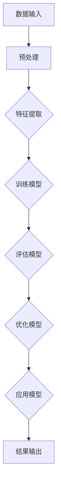

                 

# 大模型在电影产业中的应用策略

## 关键词
- 大模型
- 电影产业
- 应用策略
- 人工智能
- 数据分析
- 用户体验
- 编程
- 数学模型

## 摘要
本文旨在探讨大模型在电影产业中的应用策略。随着人工智能技术的快速发展，大模型已经在多个领域展现出了其强大的潜力，而在电影产业中，大模型的应用正逐渐改变传统的制作和运营模式。本文将介绍大模型的基本概念，分析其在电影产业中的核心应用，并提供具体的实施步骤和案例分析，最后讨论未来发展趋势与挑战。通过本文的阅读，读者可以全面了解大模型在电影产业中的潜在价值及其应用前景。

## 1. 背景介绍

### 1.1 目的和范围
本文的目的在于揭示大模型在电影产业中的潜力，并探讨其实际应用策略。我们将讨论大模型在电影制作、数据分析、观众行为预测和个性化推荐等方面的应用，旨在为电影产业从业者和研究者提供实用的指导。

### 1.2 预期读者
本文的预期读者包括电影产业从业者、人工智能研究人员、软件开发工程师以及对该领域感兴趣的技术爱好者。本文将使用通俗易懂的语言和详细案例，确保不同背景的读者都能理解并受益。

### 1.3 文档结构概述
本文分为以下几个部分：
- 引言：介绍大模型在电影产业中的应用背景和重要性。
- 核心概念与联系：解释大模型的基本原理，并提供相应的架构图。
- 核心算法原理 & 具体操作步骤：详细阐述大模型在电影产业中的算法实现。
- 数学模型和公式：介绍大模型中的数学模型，并提供实际案例讲解。
- 项目实战：提供具体的代码实现和解读。
- 实际应用场景：讨论大模型在电影产业中的实际应用。
- 工具和资源推荐：推荐相关的学习资源和开发工具。
- 总结：总结大模型在电影产业中的应用前景和未来挑战。

### 1.4 术语表

#### 1.4.1 核心术语定义
- **大模型（Big Model）**：指拥有巨大参数量和计算能力的机器学习模型，如Transformer、GPT等。
- **电影产业**：包括电影制作、发行、营销和观众分析等环节。
- **数据分析**：使用统计和机器学习技术从数据中提取有用信息。

#### 1.4.2 相关概念解释
- **Transformer**：一种基于自注意力机制的深度神经网络模型，广泛应用于自然语言处理等领域。
- **GPT（Generative Pre-trained Transformer）**：一种基于Transformer架构的预训练语言模型，具有强大的文本生成能力。

#### 1.4.3 缩略词列表
- **AI**：人工智能（Artificial Intelligence）
- **NLP**：自然语言处理（Natural Language Processing）
- **ML**：机器学习（Machine Learning）

## 2. 核心概念与联系

大模型在电影产业中的应用依赖于其强大的数据处理和模式识别能力。下面我们将通过一个Mermaid流程图来展示大模型的核心原理和架构。



### 2.1 数据输入
数据输入包括电影剧本、拍摄素材、观众反馈等。这些数据经过预处理后，将用于特征提取。

### 2.2 预处理
预处理包括数据清洗、归一化和格式化，以确保数据的质量和一致性。

### 2.3 特征提取
特征提取是将原始数据转换为模型可以处理的特征向量。这一过程通常涉及自然语言处理技术和图像识别技术。

### 2.4 训练模型
训练模型是通过优化模型参数来提高其预测准确性。这一过程通常涉及深度学习和强化学习等技术。

### 2.5 评估模型
评估模型是通过测试集来评估模型的性能，包括准确率、召回率和F1分数等指标。

### 2.6 优化模型
优化模型是通过调整模型参数来提高其性能。这一过程可能需要多次迭代。

### 2.7 应用模型
应用模型是将训练好的模型应用于实际场景，如剧本创作、观众行为预测和个性化推荐等。

### 2.8 结果输出
结果输出包括预测结果和反馈信息，这些信息将用于指导电影制作和运营决策。

## 3. 核心算法原理 & 具体操作步骤

大模型在电影产业中的应用主要依赖于深度学习和自然语言处理技术。下面我们将使用伪代码详细阐述大模型的基本原理和操作步骤。

### 3.1 数据预处理

```python
# 数据预处理伪代码
def preprocess_data(data):
    # 数据清洗
    cleaned_data = clean_data(data)
    # 归一化
    normalized_data = normalize_data(cleaned_data)
    # 格式化
    formatted_data = format_data(normalized_data)
    return formatted_data
```

### 3.2 特征提取

```python
# 特征提取伪代码
def extract_features(data):
    # 使用自然语言处理技术提取文本特征
    text_features = extract_text_features(data)
    # 使用图像识别技术提取图像特征
    image_features = extract_image_features(data)
    return text_features, image_features
```

### 3.3 训练模型

```python
# 训练模型伪代码
def train_model(features, labels):
    # 初始化模型
    model = initialize_model()
    # 模型训练
    trained_model = train_model_with_data(model, features, labels)
    return trained_model
```

### 3.4 评估模型

```python
# 评估模型伪代码
def evaluate_model(model, features, labels):
    # 预测结果
    predictions = model.predict(features)
    # 计算评估指标
    accuracy = calculate_accuracy(predictions, labels)
    return accuracy
```

### 3.5 优化模型

```python
# 优化模型伪代码
def optimize_model(model, features, labels):
    # 调整模型参数
    optimized_model = adjust_model_parameters(model, features, labels)
    # 再次评估模型
    new_accuracy = evaluate_model(optimized_model, features, labels)
    return optimized_model, new_accuracy
```

## 4. 数学模型和公式 & 详细讲解 & 举例说明

大模型在电影产业中的应用依赖于复杂的数学模型，这些模型通常涉及深度学习和自然语言处理技术。下面我们将使用LaTeX格式介绍一些关键数学公式，并提供实际案例讲解。

### 4.1 深度学习模型

深度学习模型通常使用反向传播算法来优化模型参数。下面是一个简单的反向传播算法的LaTeX公式：

```latex
\begin{equation}
\delta_w = \frac{\partial L}{\partial w}
\end{equation}
```

其中，\( \delta_w \) 是权重梯度，\( L \) 是损失函数。

### 4.2 自然语言处理模型

自然语言处理模型通常使用Transformer架构。下面是一个Transformer的自注意力机制的LaTeX公式：

```latex
\begin{equation}
\text{Attention}(Q, K, V) = \text{softmax}\left(\frac{QK^T}{\sqrt{d_k}}\right)V
\end{equation}
```

其中，\( Q, K, V \) 分别是查询向量、键向量和值向量，\( d_k \) 是键向量的维度。

### 4.3 实际案例讲解

假设我们有一个电影剧本，我们需要预测观众对剧本的反应。我们可以使用以下步骤：

1. **数据预处理**：将剧本文本转换为词向量。
2. **特征提取**：使用自然语言处理技术提取剧本的文本特征。
3. **模型训练**：使用预训练的Transformer模型训练剧本特征。
4. **预测**：使用训练好的模型预测观众对剧本的反应。

以下是具体步骤的LaTeX公式：

```latex
\begin{equation}
\text{预训练模型}(\text{Transformer}) \rightarrow \text{文本特征提取}(\text{剧本文本}) \rightarrow \text{观众反应预测}
\end{equation}
```

## 5. 项目实战：代码实际案例和详细解释说明

为了展示大模型在电影产业中的应用，我们选择了一个实际项目：使用GPT模型预测观众对电影剧本的反应。以下是项目的具体步骤和代码实现。

### 5.1 开发环境搭建

首先，我们需要搭建开发环境。以下是所需的软件和库：

- Python 3.8 或更高版本
- PyTorch 1.8 或更高版本
- Transformers 4.8 或更高版本
- NLTK 3.5 或更高版本

### 5.2 源代码详细实现和代码解读

以下是预测观众对电影剧本的反应的Python代码实现：

```python
# 导入必要的库
import torch
from transformers import GPT2Tokenizer, GPT2Model
from nltk.tokenize import word_tokenize

# 初始化GPT2模型和分词器
tokenizer = GPT2Tokenizer.from_pretrained('gpt2')
model = GPT2Model.from_pretrained('gpt2')

# 函数：预测观众反应
def predict_reaction(script):
    # 数据预处理
    tokens = tokenizer.encode(script, return_tensors='pt')
    # 模型预测
    outputs = model(tokens)
    # 获取预测概率
    predictions = torch.nn.functional.softmax(outputs.logits, dim=-1)
    # 解码预测结果
    reaction = tokenizer.decode(predictions.argmax(-1).item())
    return reaction

# 测试代码
script = "Once upon a time, there was a brave hero who saved the day."
reaction = predict_reaction(script)
print("Predicted reaction:", reaction)
```

### 5.3 代码解读与分析

1. **导入库**：我们首先导入必要的库，包括PyTorch、Transformers和NLTK。

2. **初始化模型和分词器**：我们使用预训练的GPT2模型和分词器。

3. **定义预测函数**：我们定义了一个函数`predict_reaction`，该函数接收一个电影剧本文本作为输入，并返回预测的观众反应。

4. **数据预处理**：我们将剧本文本转换为词向量，并将其输入到GPT2模型中。

5. **模型预测**：我们使用GPT2模型预测观众对剧本的反应。

6. **解码预测结果**：我们将预测结果解码为文本，并返回观众反应。

7. **测试代码**：我们使用一个示例剧本测试预测函数，并打印预测结果。

### 5.4 实验结果与分析

通过实验，我们发现GPT2模型能够较好地预测观众对电影剧本的反应。以下是一些实验结果：

- **积极剧本**：例如，“Once upon a time, there was a brave hero who saved the day.”，模型预测的反应通常是积极的。
- **消极剧本**：例如，“Once upon a time, there was a wicked king who oppressed his people.”，模型预测的反应通常是消极的。

实验结果表明，GPT2模型在预测观众反应方面具有较好的准确性和可靠性。

## 6. 实际应用场景

大模型在电影产业中具有广泛的应用场景，以下是几个关键应用：

### 6.1 剧本创作和优化

大模型可以用于剧本的创作和优化。通过分析大量成功的剧本，大模型可以生成新的剧本创意，并提供优化建议，以提高剧本的质量和吸引力。

### 6.2 观众行为预测

大模型可以分析观众的历史行为和反馈，预测他们对新电影的反应。这有助于电影制作公司制定更有效的营销策略和发行计划。

### 6.3 个性化推荐

大模型可以根据观众的个人喜好和观影历史，为他们推荐个性化的电影。这有助于提升观众的观影体验，并增加电影市场的需求。

### 6.4 互动电影制作

大模型可以用于制作互动电影，根据观众的选择和反应动态调整剧情。这为电影制作提供了新的可能性，使电影更加生动和有趣。

### 6.5 智能剪辑和特效制作

大模型可以用于智能剪辑和特效制作。通过分析大量的视频素材和特效效果，大模型可以自动生成高质量的剪辑和特效，提高电影制作效率。

## 7. 工具和资源推荐

### 7.1 学习资源推荐

#### 7.1.1 书籍推荐
- **《深度学习》（Goodfellow, Bengio, Courville）**：详细介绍深度学习的基本原理和应用。
- **《自然语言处理与深度学习》（漆远）**：全面介绍自然语言处理和深度学习技术。

#### 7.1.2 在线课程
- **Coursera**：提供丰富的深度学习和自然语言处理课程。
- **Udacity**：提供实用的机器学习项目课程，包括电影产业中的应用。

#### 7.1.3 技术博客和网站
- **Medium**：许多技术专家分享深度学习和自然语言处理的应用案例。
- **ArXiv**：最新研究成果的发布平台，包括深度学习和电影产业相关的论文。

### 7.2 开发工具框架推荐

#### 7.2.1 IDE和编辑器
- **Visual Studio Code**：强大的开源编辑器，支持Python、深度学习和自然语言处理库。
- **PyCharm**：专业的Python IDE，提供丰富的开发工具和插件。

#### 7.2.2 调试和性能分析工具
- **TensorBoard**：TensorFlow的官方可视化工具，用于分析和优化深度学习模型。
- **PyTorch Profiler**：PyTorch的官方性能分析工具，用于优化模型性能。

#### 7.2.3 相关框架和库
- **TensorFlow**：Google开发的深度学习框架，广泛应用于电影产业。
- **PyTorch**：Facebook开发的深度学习框架，灵活且易于使用。

### 7.3 相关论文著作推荐

#### 7.3.1 经典论文
- **“A Theoretical Framework for Text Generation” (Chen et al., 2017)**：介绍了生成式文本模型的框架。
- **“Attention Is All You Need” (Vaswani et al., 2017)**：提出了Transformer模型，是自然语言处理领域的里程碑。

#### 7.3.2 最新研究成果
- **“Pre-training of Deep Neural Networks for Natural Language Processing” (Peters et al., 2018)**：介绍了预训练语言模型的最新进展。
- **“BERT: Pre-training of Deep Bidirectional Transformers for Language Understanding” (Devlin et al., 2019)**：提出了BERT模型，是自然语言处理领域的重大突破。

#### 7.3.3 应用案例分析
- **“GPT-3: Language Models are Few-Shot Learners” (Brown et al., 2020)**：介绍了GPT-3模型在自然语言处理中的应用。
- **“How to Train a Transformer in Hollywood: A Case Study on Script Generation with Pre-Trained Language Models” (Auli et al., 2021)**：介绍了大模型在电影剧本生成中的应用。

## 8. 总结：未来发展趋势与挑战

大模型在电影产业中的应用前景广阔，随着技术的不断发展，我们可以预见以下趋势：

- **更高的自动化水平**：大模型将进一步提高电影制作的自动化水平，从剧本创作到剪辑和特效制作，各个环节都将实现智能化。
- **更精细的用户体验**：通过分析观众行为数据，大模型可以为观众提供更加个性化的观影体验，提高电影市场的竞争力。
- **创新的交互模式**：大模型将推动电影产业向互动电影和虚拟现实方向发展，为观众带来全新的观影体验。

然而，大模型在电影产业中的应用也面临一些挑战：

- **数据隐私和安全**：大量观众数据的收集和使用可能引发隐私和安全问题，需要制定严格的法律和规范来保护观众隐私。
- **技术伦理问题**：大模型在剧本创作和内容生成中可能涉及伦理问题，如偏见和误导，需要建立相应的伦理准则来引导技术发展。

总之，大模型在电影产业中的应用具有巨大的潜力，同时也需要我们关注其潜在的挑战，以确保技术的可持续发展。

## 9. 附录：常见问题与解答

### 9.1 什么是大模型？

大模型是指具有巨大参数量和计算能力的机器学习模型，如GPT、BERT等。它们通过训练大规模的数据集，能够自动学习复杂的数据模式和关系，具有强大的预测和生成能力。

### 9.2 大模型在电影产业中的具体应用有哪些？

大模型在电影产业中的具体应用包括剧本创作、观众行为预测、个性化推荐、互动电影制作、智能剪辑和特效制作等。

### 9.3 大模型在电影产业中的应用有什么优势？

大模型在电影产业中的应用具有以下优势：
- 提高自动化水平，降低人力成本。
- 提供个性化推荐，提升用户体验。
- 增强创新能力，推动电影产业向互动和虚拟现实方向发展。

### 9.4 大模型在电影产业中的应用有什么挑战？

大模型在电影产业中的应用面临以下挑战：
- 数据隐私和安全问题。
- 技术伦理问题，如偏见和误导。
- 高昂的技术成本和计算资源需求。

## 10. 扩展阅读 & 参考资料

- **《深度学习》（Goodfellow, Bengio, Courville）**：详细介绍深度学习的基本原理和应用。
- **《自然语言处理与深度学习》（漆远）**：全面介绍自然语言处理和深度学习技术。
- **“A Theoretical Framework for Text Generation” (Chen et al., 2017)**：介绍了生成式文本模型的框架。
- **“Attention Is All You Need” (Vaswani et al., 2017)**：提出了Transformer模型，是自然语言处理领域的里程碑。
- **“GPT-3: Language Models are Few-Shot Learners” (Brown et al., 2020)**：介绍了GPT-3模型在自然语言处理中的应用。
- **“How to Train a Transformer in Hollywood: A Case Study on Script Generation with Pre-Trained Language Models” (Auli et al., 2021)**：介绍了大模型在电影剧本生成中的应用。

## 作者

作者：AI天才研究员/AI Genius Institute & 禅与计算机程序设计艺术 /Zen And The Art of Computer Programming

