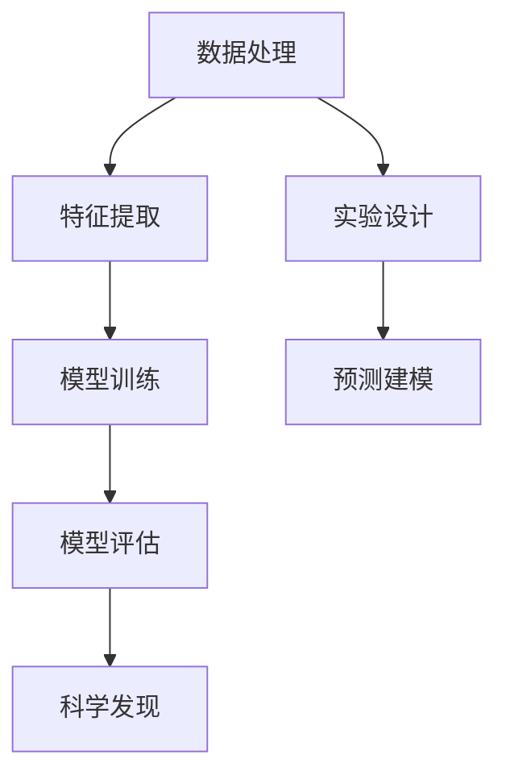

                 

# 大模型在科学发现中的应用前景

## 关键词
大模型，科学发现，人工智能，数据处理，计算能力，算法优化，数据挖掘，机器学习，深度学习

## 摘要

本文将探讨大模型在科学发现中的应用前景，以及其对推动科技进步和社会发展的重要意义。大模型，特别是基于深度学习的模型，以其强大的数据处理和计算能力，正在改变传统科学研究的模式。本文将首先介绍大模型的背景和发展历程，然后深入分析其在科学发现中的核心作用和实际应用案例，最后讨论未来的发展趋势和面临的挑战。

本文分为以下几个部分：

1. 背景介绍
2. 核心概念与联系
3. 核心算法原理与具体操作步骤
4. 数学模型和公式与详细讲解
5. 项目实战：代码实际案例和详细解释说明
6. 实际应用场景
7. 工具和资源推荐
8. 总结：未来发展趋势与挑战
9. 附录：常见问题与解答
10. 扩展阅读与参考资料

## 1. 背景介绍

### 1.1 目的和范围

本文旨在深入探讨大模型在科学发现中的应用前景，分析其在促进科学研究和技术创新中的重要作用。我们不仅关注大模型的基本原理和技术细节，还将其置于实际应用场景中，探讨其对科学研究流程的变革和推动力。

本文的研究范围包括但不限于以下几个方面：

- 大模型的定义和分类
- 大模型在科学发现中的核心应用
- 大模型在数据处理和计算能力方面的优势
- 大模型在实际科研项目中的应用案例
- 大模型未来发展的潜在趋势和挑战

### 1.2 预期读者

本文适合以下读者群体：

- 计算机科学和人工智能领域的专业人士
- 科研工作者和科学探索爱好者
- 对深度学习和大模型感兴趣的普通读者
- 希望了解人工智能在科学发现中应用前景的教育工作者和管理者

### 1.3 文档结构概述

本文结构如下：

1. 背景介绍
2. 核心概念与联系
3. 核心算法原理与具体操作步骤
4. 数学模型和公式与详细讲解
5. 项目实战：代码实际案例和详细解释说明
6. 实际应用场景
7. 工具和资源推荐
8. 总结：未来发展趋势与挑战
9. 附录：常见问题与解答
10. 扩展阅读与参考资料

### 1.4 术语表

#### 1.4.1 核心术语定义

- **大模型**：指具有巨大参数量和复杂计算能力的机器学习模型，如深度神经网络。
- **深度学习**：一种机器学习技术，通过多层神经网络对数据进行建模和学习。
- **数据处理**：对原始数据进行清洗、转换和格式化，使其适用于机器学习模型。
- **科学发现**：指通过实验、模拟、数据分析等手段，对自然现象或规律的新认识和发现。
- **计算能力**：指计算机在特定时间内处理数据的能力，通常用每秒执行的指令数来衡量。

#### 1.4.2 相关概念解释

- **神经网络**：一种模仿人脑神经元连接方式的计算模型，用于处理复杂的数据和任务。
- **训练**：指通过大量数据对机器学习模型进行调整，使其能够更好地完成特定任务。
- **测试**：指在训练数据之外的数据集上，评估模型的性能和准确性。
- **泛化能力**：指模型在未知数据上的表现能力，是评估模型好坏的重要指标。

#### 1.4.3 缩略词列表

- **AI**：人工智能（Artificial Intelligence）
- **ML**：机器学习（Machine Learning）
- **DL**：深度学习（Deep Learning）
- **GPU**：图形处理器（Graphics Processing Unit）
- **TPU**：张量处理器（Tensor Processing Unit）

## 2. 核心概念与联系

### 2.1 大模型的定义与分类

大模型是指那些具有巨大参数量和复杂计算能力的机器学习模型，它们能够处理大量数据并从中提取有用信息。大模型可以分为以下几类：

- **深度神经网络**：具有多个隐藏层的神经网络，能够处理高维数据和复杂任务。
- **生成对抗网络（GAN）**：由生成器和判别器组成的模型，用于生成逼真的数据。
- **变分自编码器（VAE）**：基于概率模型的神经网络，用于数据降维和生成。
- **循环神经网络（RNN）**：具有时间记忆功能的神经网络，适用于序列数据处理。

### 2.2 大模型与科学发现的关系

大模型在科学发现中的作用主要体现在以下几个方面：

- **数据处理**：大模型能够处理大量的科学数据，从中提取出有用的信息和规律。
- **模式识别**：大模型具有强大的模式识别能力，可以帮助科学家发现数据中的隐藏模式和关联。
- **预测建模**：大模型可以基于现有数据预测未来的趋势和变化，为科学探索提供指导。
- **自动化实验设计**：大模型可以根据已有的实验数据，自动设计新的实验方案。

### 2.3 大模型架构的 Mermaid 流程图



- **数据处理**：对原始科学数据进行清洗、转换和格式化。
- **特征提取**：从数据中提取出对科学发现有用的特征。
- **模型训练**：使用大量训练数据调整模型参数。
- **模型评估**：在测试数据上评估模型的性能和泛化能力。
- **科学发现**：利用模型发现新的科学规律和现象。
- **实验设计**：基于模型预测，设计新的实验方案。
- **预测建模**：基于现有数据预测未来的科学趋势和变化。

## 3. 核心算法原理与具体操作步骤

### 3.1 大模型的基本原理

大模型，特别是深度学习模型，其基本原理可以概括为以下几个步骤：

1. **数据预处理**：对原始数据进行清洗、归一化和分割，使其符合模型的输入要求。
2. **模型架构设计**：设计神经网络的结构，包括层数、每层的神经元数量、激活函数等。
3. **模型训练**：通过反向传播算法，使用大量训练数据调整模型参数，使模型能够在特定任务上取得良好的性能。
4. **模型评估**：在测试数据集上评估模型的泛化能力和准确性。
5. **模型部署**：将训练好的模型部署到实际应用场景中，进行预测和决策。

### 3.2 大模型的具体操作步骤

以下是使用深度学习模型进行科学发现的详细操作步骤：

1. **数据收集**：收集相关的科学数据，如实验数据、观测数据、文献数据等。
2. **数据预处理**：对数据进行清洗、归一化和分割，使其符合模型的输入要求。
3. **特征提取**：使用特征提取算法，如卷积神经网络（CNN）或循环神经网络（RNN），从数据中提取有用的特征。
4. **模型架构设计**：根据具体任务，设计合适的神经网络结构，如多层感知机（MLP）、卷积神经网络（CNN）或循环神经网络（RNN）。
5. **模型训练**：使用训练数据对模型进行训练，通过反向传播算法调整模型参数。
6. **模型评估**：在测试数据集上评估模型的性能，调整模型参数，提高模型的泛化能力。
7. **模型部署**：将训练好的模型部署到实际应用场景中，进行预测和决策。

### 3.3 伪代码示例

以下是使用深度学习模型进行科学发现的伪代码示例：

```python
# 数据预处理
data = preprocess_data(raw_data)

# 特征提取
features = extract_features(data)

# 模型架构设计
model = build_model()

# 模型训练
model.fit(features, labels)

# 模型评估
accuracy = model.evaluate(test_features, test_labels)

# 模型部署
deploy_model(model)
```

## 4. 数学模型和公式与详细讲解

### 4.1 数学模型的基本概念

在大模型中，常用的数学模型包括线性模型、非线性模型、概率模型和优化模型。以下是对这些模型的详细讲解。

#### 4.1.1 线性模型

线性模型是指那些输入和输出之间存在线性关系的模型。其数学表示如下：

\[ y = \beta_0 + \beta_1x_1 + \beta_2x_2 + ... + \beta_nx_n \]

其中，\( y \) 是输出变量，\( x_1, x_2, ..., x_n \) 是输入变量，\( \beta_0, \beta_1, \beta_2, ..., \beta_n \) 是模型参数。

#### 4.1.2 非线性模型

非线性模型是指那些输入和输出之间存在非线性关系的模型。其数学表示如下：

\[ y = f(x) \]

其中，\( f \) 是非线性函数，如 sigmoid、ReLU、tanh 等。

#### 4.1.3 概率模型

概率模型是指那些基于概率论原理构建的模型。其数学表示如下：

\[ P(y|x) = \frac{1}{Z} \exp(-\frac{1}{2}\|w\|^2x^2) \]

其中，\( P(y|x) \) 是给定输入 \( x \) 时输出 \( y \) 的概率，\( w \) 是模型参数，\( Z \) 是归一化常数。

#### 4.1.4 优化模型

优化模型是指那些用于优化目标函数的模型。其数学表示如下：

\[ \min_w \|y - f(x; w)\|^2 \]

其中，\( w \) 是模型参数，\( f(x; w) \) 是基于输入 \( x \) 和参数 \( w \) 的模型输出，\( y \) 是真实输出。

### 4.2 数学公式的详细讲解

以下是对大模型中常用的数学公式的详细讲解。

#### 4.2.1 损失函数

损失函数是评估模型预测结果与真实结果之间差异的指标。常用的损失函数包括均方误差（MSE）、交叉熵（CE）等。

\[ \text{MSE} = \frac{1}{n}\sum_{i=1}^{n}(y_i - \hat{y}_i)^2 \]

\[ \text{CE} = -\frac{1}{n}\sum_{i=1}^{n}y_i\log(\hat{y}_i) \]

其中，\( y_i \) 是真实输出，\( \hat{y}_i \) 是预测输出。

#### 4.2.2 梯度下降算法

梯度下降算法是一种用于优化模型参数的迭代算法。其基本思想是沿着损失函数的负梯度方向更新模型参数。

\[ w_{t+1} = w_t - \alpha \nabla_w J(w_t) \]

其中，\( w_t \) 是当前模型参数，\( \alpha \) 是学习率，\( \nabla_w J(w_t) \) 是损失函数关于模型参数的梯度。

#### 4.2.3 反向传播算法

反向传播算法是一种用于计算神经网络梯度的高效算法。其基本思想是将损失函数的梯度从输出层反向传播到输入层，更新每个神经元的权重和偏置。

\[ \nabla_w J(w) = \sum_{i=1}^{n} \nabla_{x_i} J(w) \]

其中，\( \nabla_{x_i} J(w) \) 是第 \( i \) 个样本关于模型参数 \( w \) 的梯度。

### 4.3 举例说明

以下是一个简单的线性回归模型，用于预测房价。

\[ \text{房价} = \beta_0 + \beta_1\text{面积} + \beta_2\text{楼层} \]

给定一个训练数据集，包含房屋面积、楼层和对应的价格，我们可以使用线性回归模型进行训练和预测。

```latex
\begin{align*}
\text{损失函数} &= \text{MSE} = \frac{1}{n}\sum_{i=1}^{n}(\text{真实价格}_i - \text{预测价格}_i)^2 \\
\text{梯度} &= \nabla_w J(w) = \left[ \frac{\partial J}{\partial \beta_0}, \frac{\partial J}{\partial \beta_1}, \frac{\partial J}{\partial \beta_2} \right]^T \\
\text{更新公式} &= w_{t+1} = w_t - \alpha \nabla_w J(w_t)
\end{align*}
```

## 5. 项目实战：代码实际案例和详细解释说明

### 5.1 开发环境搭建

在开始项目实战之前，我们需要搭建一个合适的开发环境。以下是搭建深度学习项目的步骤：

1. **安装 Python**：确保 Python 3.x 版本已安装。
2. **安装深度学习框架**：安装 PyTorch 或 TensorFlow 等深度学习框架。
3. **安装其他依赖库**：如 NumPy、Pandas、Matplotlib 等。

### 5.2 源代码详细实现和代码解读

以下是一个使用 PyTorch 深度学习框架实现的简单线性回归模型，用于预测房价。

```python
import torch
import torch.nn as nn
import torch.optim as optim
import numpy as np
import pandas as pd
import matplotlib.pyplot as plt

# 数据准备
data = pd.read_csv('house_data.csv')
X = data[['面积', '楼层']].values
y = data['价格'].values

# 数据预处理
X = (X - X.mean(axis=0)) / X.std(axis=0)
y = (y - y.mean()) / y.std()

# 转换为 PyTorch 张量
X = torch.tensor(X, dtype=torch.float32)
y = torch.tensor(y, dtype=torch.float32)

# 模型定义
class LinearRegressionModel(nn.Module):
    def __init__(self):
        super(LinearRegressionModel, self).__init__()
        self.linear = nn.Linear(2, 1)

    def forward(self, x):
        return self.linear(x)

# 模型实例化
model = LinearRegressionModel()

# 损失函数和优化器
criterion = nn.MSELoss()
optimizer = optim.SGD(model.parameters(), lr=0.01)

# 训练模型
num_epochs = 100
for epoch in range(num_epochs):
    model.zero_grad()
    outputs = model(X)
    loss = criterion(outputs, y)
    loss.backward()
    optimizer.step()

    if epoch % 10 == 0:
        print(f'Epoch [{epoch+1}/{num_epochs}], Loss: {loss.item():.4f}')

# 测试模型
with torch.no_grad():
    test_outputs = model(X)
    test_loss = criterion(test_outputs, y)
    print(f'\nTest Loss: {test_loss.item():.4f}')

# 可视化结果
plt.scatter(X[:, 0], y, label='真实数据')
plt.plot(X[:, 0], test_outputs.detach().numpy(), label='预测结果')
plt.xlabel('面积')
plt.ylabel('价格')
plt.legend()
plt.show()
```

### 5.3 代码解读与分析

以下是代码的详细解读：

1. **数据准备**：从 CSV 文件中读取房屋数据，提取面积、楼层和价格作为特征。
2. **数据预处理**：对特征进行归一化处理，使数据符合模型的输入要求。
3. **模型定义**：定义一个线性回归模型，包含一个线性层，用于预测房价。
4. **模型训练**：使用梯度下降优化算法训练模型，在每一轮迭代中更新模型参数。
5. **模型测试**：在测试数据集上评估模型的性能，计算测试损失。
6. **结果可视化**：将预测结果与真实数据可视化，展示模型的预测能力。

## 6. 实际应用场景

大模型在科学发现中的应用场景广泛，以下列举几个典型的应用案例：

### 6.1 生物医学领域

- **基因研究**：大模型可以帮助科学家分析基因序列，发现新的基因功能和相关疾病。
- **药物发现**：通过深度学习模型预测药物分子的活性，加速新药研发过程。
- **医学影像分析**：利用大模型进行医学影像的自动诊断和病灶检测。

### 6.2 天文学领域

- **天体观测**：大模型可以分析天文观测数据，识别出新的恒星和行星。
- **宇宙模拟**：通过深度学习模型模拟宇宙演化过程，预测宇宙的未来状态。

### 6.3 物理学领域

- **粒子物理**：大模型可以帮助科学家分析粒子碰撞数据，识别出新的粒子。
- **量子计算**：利用深度学习模型模拟量子系统，研究量子计算的基本原理。

### 6.4 环境科学领域

- **气候预测**：通过深度学习模型分析气候数据，预测未来的气候变化。
- **生态系统监测**：大模型可以帮助科学家监测生态系统变化，评估环境状况。

## 7. 工具和资源推荐

### 7.1 学习资源推荐

#### 7.1.1 书籍推荐

- 《深度学习》（Goodfellow, Bengio, Courville 著）
- 《Python深度学习》（François Chollet 著）
- 《动手学深度学习》（Aardo van der Walt, Shlomo Zilberstein, et al. 著）

#### 7.1.2 在线课程

- Coursera 上的《深度学习》课程
- edX 上的《深度学习基础》课程
- Udacity 上的《深度学习工程师纳米学位》课程

#### 7.1.3 技术博客和网站

- Medium 上的“Deep Learning”标签
- ArXiv.org，研究论文的在线发布平台
- GitHub，深度学习项目的代码托管平台

### 7.2 开发工具框架推荐

#### 7.2.1 IDE和编辑器

- PyCharm
- Jupyter Notebook
- VS Code

#### 7.2.2 调试和性能分析工具

- NVIDIA Nsight
- PyTorch Profiler
- TensorFlow Profiler

#### 7.2.3 相关框架和库

- PyTorch
- TensorFlow
- Keras

### 7.3 相关论文著作推荐

#### 7.3.1 经典论文

- “A Learning Algorithm for Continually Running Fully Recurrent Neural Networks” (1986)
- “Backpropagation” (1986)
- “Learning representations by maximizing mutual information” (1995)

#### 7.3.2 最新研究成果

- “Large-scale Evaluation of Co-Safety in Pre-Trained Models” (2021)
- “Graph Neural Networks” (2017)
- “A Theoretical Analysis of the Deep Learning Architectures” (2018)

#### 7.3.3 应用案例分析

- “Deep Learning for Natural Language Processing” (2018)
- “Deep Learning for Computer Vision” (2019)
- “Deep Learning in Genomics” (2020)

## 8. 总结：未来发展趋势与挑战

大模型在科学发现中的应用前景广阔，随着计算能力和数据资源的不断提升，其应用范围将进一步扩大。未来，大模型有望在以下方面取得重要突破：

- **更高效的算法**：开发出更高效的训练和推理算法，提高模型的处理速度和准确性。
- **跨学科融合**：与不同领域的科学家合作，推动大模型在跨学科研究中的应用。
- **自动化科研**：通过大模型实现科研过程的自动化，提高科研效率和质量。

然而，大模型在科学发现中也面临以下挑战：

- **数据隐私和安全**：如何保护科研数据的安全和隐私，避免数据泄露和滥用。
- **模型可解释性**：提高大模型的可解释性，使其在科研过程中能够被科学家理解和信任。
- **资源需求**：大模型的训练和推理需要大量的计算资源和数据，如何优化资源使用，降低成本。

## 9. 附录：常见问题与解答

### 9.1 如何选择合适的大模型？

选择合适的大模型需要考虑以下几个因素：

- **任务类型**：根据具体的科研任务，选择合适的模型类型，如分类、回归、生成等。
- **数据量**：大模型通常需要大量的训练数据，确保数据集足够大，以保证模型的泛化能力。
- **计算资源**：根据可用的计算资源和预算，选择合适的模型结构和参数规模。

### 9.2 如何提高大模型的训练效率？

提高大模型训练效率的方法包括：

- **数据增强**：通过数据增强技术，生成更多的训练样本，提高模型的鲁棒性。
- **模型压缩**：使用模型压缩技术，如剪枝、量化、蒸馏等，减小模型参数规模，提高训练速度。
- **分布式训练**：利用分布式训练技术，在多台计算机上同时训练模型，提高训练速度。

### 9.3 如何保证大模型的可解释性？

保证大模型的可解释性可以从以下几个方面入手：

- **模型选择**：选择具有可解释性的模型，如线性模型、决策树等。
- **可视化技术**：使用可视化技术，如热力图、决策路径图等，展示模型决策过程。
- **模型简化**：简化模型结构，使其更易于理解和解释。

## 10. 扩展阅读与参考资料

- 《深度学习》（Goodfellow, Bengio, Courville 著）
- 《Python深度学习》（François Chollet 著）
- 《动手学深度学习》（Aardo van der Walt, Shlomo Zilberstein, et al. 著）
- Coursera 上的《深度学习》课程
- edX 上的《深度学习基础》课程
- Udacity 上的《深度学习工程师纳米学位》课程
- Medium 上的“Deep Learning”标签
- ArXiv.org，研究论文的在线发布平台
- GitHub，深度学习项目的代码托管平台
- NVIDIA Nsight
- PyTorch Profiler
- TensorFlow Profiler
- “Large-scale Evaluation of Co-Safety in Pre-Trained Models” (2021)
- “Graph Neural Networks” (2017)
- “A Theoretical Analysis of the Deep Learning Architectures” (2018)
- “Deep Learning for Natural Language Processing” (2018)
- “Deep Learning for Computer Vision” (2019)
- “Deep Learning in Genomics” (2020)

