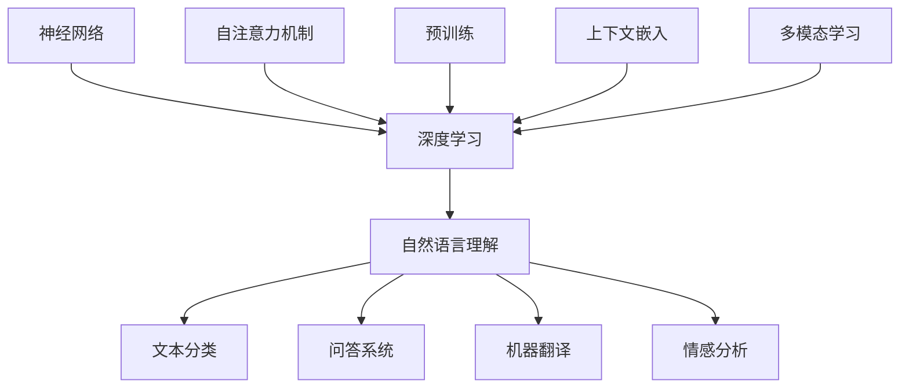

                 

# 大模型在自然语言理解中的突破

> **关键词：** 大模型、自然语言理解、Transformer、BERT、GPT、神经网络、深度学习、语言模型、语义理解、上下文嵌入、多模态学习、应用场景。

> **摘要：** 本文深入探讨了大型预训练模型在自然语言理解中的突破性进展。通过分析其核心算法原理、数学模型、实战案例以及应用场景，本文旨在为读者提供一个全面的技术视角，以了解大模型如何改变自然语言处理的面貌，并展望其未来的发展趋势与挑战。

## 1. 背景介绍

### 1.1 目的和范围

本文的主要目的是探讨大模型在自然语言理解（NLU）领域中的突破性进展。随着深度学习和神经网络技术的不断发展，大模型已经成为了自然语言处理（NLP）研究的重要方向。这些大模型，如BERT、GPT、RoBERTa等，通过在海量数据上进行预训练，能够自动学习到语言的复杂结构，并在多种NLU任务中取得显著的性能提升。

本文将重点介绍以下内容：

1. 大模型的核心算法原理和具体操作步骤。
2. 大模型所依赖的数学模型和公式。
3. 大模型在实际项目中的应用案例和代码实现。
4. 大模型在自然语言理解中的实际应用场景。
5. 未来发展趋势与面临的挑战。

### 1.2 预期读者

本文适合对自然语言处理和深度学习有一定了解的读者。对于希望了解大模型如何改变自然语言处理领域的研究人员和技术人员，本文将提供有价值的参考。同时，对于对人工智能和自然语言理解感兴趣的普通读者，本文也希望通过简洁明了的阐述，使其能够理解大模型的原理和应用。

### 1.3 文档结构概述

本文分为十个部分，结构如下：

1. **背景介绍**：介绍本文的目的、范围、预期读者以及文档结构。
2. **核心概念与联系**：阐述大模型的核心概念、原理和架构。
3. **核心算法原理 & 具体操作步骤**：详细讲解大模型的核心算法原理和操作步骤。
4. **数学模型和公式 & 详细讲解 & 举例说明**：介绍大模型所依赖的数学模型和公式，并通过实例进行说明。
5. **项目实战：代码实际案例和详细解释说明**：展示大模型在实际项目中的应用，并解读代码实现。
6. **实际应用场景**：分析大模型在不同应用场景下的表现和优势。
7. **工具和资源推荐**：推荐学习资源和开发工具，以帮助读者深入了解大模型。
8. **总结：未来发展趋势与挑战**：展望大模型未来的发展趋势和面临的挑战。
9. **附录：常见问题与解答**：回答读者可能遇到的常见问题。
10. **扩展阅读 & 参考资料**：提供进一步阅读的参考资料。

### 1.4 术语表

#### 1.4.1 核心术语定义

- **自然语言理解（NLU）**：指机器通过处理和理解自然语言，从而实现与人类的交互和沟通。
- **自然语言处理（NLP）**：是人工智能领域的一个重要分支，旨在使计算机能够理解、生成和处理人类语言。
- **深度学习**：一种机器学习技术，通过多层神经网络来模拟人类大脑的学习过程。
- **神经网络**：一种由大量简单神经元组成的计算模型，能够通过学习数据来提取特征和进行预测。
- **Transformer**：一种基于自注意力机制的深度学习模型，广泛应用于自然语言处理任务。
- **BERT**：一种双向编码表示器（Bidirectional Encoder Representations from Transformers），用于预训练语言模型。
- **GPT**：一种生成预训练模型（Generative Pretrained Transformer），主要用于语言生成任务。

#### 1.4.2 相关概念解释

- **自注意力机制**：一种注意力机制，通过计算输入序列中各个元素之间的关系，实现对输入序列的加权表示。
- **预训练**：在特定任务之前，使用大量未标记的数据对模型进行训练，以使其能够捕获语言的通用特征。
- **上下文嵌入**：将输入文本转换为固定大小的向量表示，以捕获其语义信息。
- **多模态学习**：同时处理多种类型的输入数据（如图像、声音和文本），以实现更全面的理解。

#### 1.4.3 缩略词列表

- **NLU**：自然语言理解（Natural Language Understanding）
- **NLP**：自然语言处理（Natural Language Processing）
- **DL**：深度学习（Deep Learning）
- **NN**：神经网络（Neural Network）
- **Transformer**：变换器（Transformer）
- **BERT**：双向编码表示器（Bidirectional Encoder Representations from Transformers）
- **GPT**：生成预训练模型（Generative Pretrained Transformer）

## 2. 核心概念与联系

在深入探讨大模型在自然语言理解中的突破之前，有必要先了解相关核心概念和它们之间的联系。以下是对大模型中关键概念的简要介绍，并使用Mermaid流程图来展示其原理和架构。

### 2.1 关键概念

1. **神经网络（NN）**：神经网络是一种由大量简单神经元组成的计算模型，通过学习数据来提取特征和进行预测。
2. **深度学习（DL）**：深度学习是神经网络的一种，通过多层神经网络来模拟人类大脑的学习过程。
3. **自注意力机制**：自注意力机制是一种注意力机制，通过计算输入序列中各个元素之间的关系，实现对输入序列的加权表示。
4. **预训练**：预训练是指在特定任务之前，使用大量未标记的数据对模型进行训练，以使其能够捕获语言的通用特征。
5. **上下文嵌入**：上下文嵌入是将输入文本转换为固定大小的向量表示，以捕获其语义信息。
6. **多模态学习**：多模态学习是同时处理多种类型的输入数据（如图像、声音和文本），以实现更全面的理解。

### 2.2 Mermaid流程图

下面是使用Mermaid绘制的流程图，展示了大模型的核心概念和它们之间的联系。



### 2.3 核心概念联系

1. **神经网络和深度学习**：神经网络是深度学习的基础，通过多层神经网络来实现复杂的特征提取和预测。
2. **自注意力机制和预训练**：自注意力机制是Transformer模型的核心，通过计算输入序列中各个元素之间的关系来提高模型的性能。预训练则是通过在大规模语料库上进行训练，使模型能够自动学习到语言的通用特征。
3. **上下文嵌入和多模态学习**：上下文嵌入将输入文本转换为固定大小的向量表示，以捕获其语义信息。多模态学习则是同时处理多种类型的输入数据，如文本、图像和声音，以实现更全面的理解。
4. **自然语言理解**：自然语言理解是深度学习在自然语言处理领域的一个重要应用，包括文本分类、问答系统、机器翻译和情感分析等任务。

通过以上核心概念和Mermaid流程图的介绍，读者可以对大模型在自然语言理解中的突破有一个初步的了解。接下来，本文将详细阐述大模型的核心算法原理、数学模型和具体操作步骤，以帮助读者更深入地理解这一突破性进展。

## 3. 核心算法原理 & 具体操作步骤

大模型在自然语言理解中的突破主要依赖于其核心算法原理和具体操作步骤。在本节中，我们将详细探讨这些核心算法，包括Transformer、BERT和GPT等模型的原理，并使用伪代码来展示其操作步骤。

### 3.1 Transformer模型

Transformer模型是由Vaswani等人在2017年提出的一种基于自注意力机制的深度学习模型，广泛应用于自然语言处理任务。以下是Transformer模型的基本原理和操作步骤。

#### 3.1.1 自注意力机制

自注意力机制是一种注意力机制，通过计算输入序列中各个元素之间的关系来提高模型的性能。具体来说，自注意力机制可以看作是对输入序列中的每个元素进行加权，使得模型能够关注输入序列中最重要的部分。

#### 3.1.2 操作步骤

1. **输入编码**：将输入序列（如文本）转换为固定大小的向量表示，通常使用词嵌入（word embeddings）技术。
2. **多头自注意力**：将输入序列分解为多个子序列，每个子序列分别通过自注意力机制进行加权。
3. **前馈网络**：对加权后的子序列进行前馈神经网络（FFN）处理，以进一步提取特征。
4. **层归一化**：对每个层进行归一化处理，以保持模型的稳定性和性能。
5. **残差连接**：在每层之间添加残差连接，以加速模型的训练和提升性能。

以下是一个简单的伪代码示例，用于展示Transformer模型的基本操作步骤：

```python
# Transformer模型伪代码
def transformer(input_sequence):
    # 输入编码
    embeddings = embedding_layer(input_sequence)
    
    # 多层自注意力
    for layer in self_attention_layers:
        attention = layer(embeddings)
        embeddings = add(embeddings, attention)  # 残差连接
    
    # 前馈网络
    for layer in feedforward_layers:
        embeddings = layer(embeddings)
    
    # 层归一化
    embeddings = layer_norm(embeddings)
    
    return embeddings
```

### 3.2 BERT模型

BERT（Bidirectional Encoder Representations from Transformers）是一种双向编码表示器，由Google在2018年提出，用于预训练语言模型。BERT通过在大量文本上进行预训练，能够自动学习到语言的复杂结构，并在多种NLU任务中取得显著性能提升。

#### 3.2.1 双向编码

BERT模型的核心在于其双向编码器（Bidirectional Encoder），它能够同时考虑输入序列的前后文信息。具体来说，BERT模型包含两个主要部分：编码器（Encoder）和解码器（Decoder）。

- **编码器**：将输入序列（如文本）编码为固定大小的向量表示，并提取到其语义信息。
- **解码器**：根据编码器的输出，预测下一个词的概率，并生成输出序列。

#### 3.2.2 操作步骤

1. **输入编码**：将输入序列（如文本）转换为固定大小的向量表示，通常使用词嵌入（word embeddings）技术。
2. **双向编码**：通过编码器对输入序列进行编码，同时考虑输入序列的前后文信息。
3. **预训练**：在大量文本上进行预训练，以使模型能够自动学习到语言的通用特征。
4. **微调**：在特定任务上对模型进行微调，以适应不同的NLU任务。

以下是一个简单的伪代码示例，用于展示BERT模型的基本操作步骤：

```python
# BERT模型伪代码
def bert(input_sequence):
    # 输入编码
    embeddings = embedding_layer(input_sequence)
    
    # 双向编码
    encoder = encoder_layer(embeddings)
    
    # 预训练
    pretrain_loss = pretrain(encoder)
    
    # 微调
    finetune_loss = finetune(encoder, target)
    
    return encoder
```

### 3.3 GPT模型

GPT（Generative Pretrained Transformer）是一种生成预训练模型，由OpenAI在2018年提出，主要用于语言生成任务。GPT通过在大量文本上进行预训练，能够自动学习到语言的生成规律，并在生成任务中取得显著性能提升。

#### 3.3.1 生成预训练

GPT的核心在于其生成预训练（Generative Pretraining）机制。具体来说，GPT模型包含两个主要部分：生成器（Generator）和解码器（Decoder）。

- **生成器**：根据之前的文本序列生成新的文本序列。
- **解码器**：根据生成器的输出，预测下一个词的概率，并生成输出序列。

#### 3.3.2 操作步骤

1. **输入编码**：将输入序列（如文本）转换为固定大小的向量表示，通常使用词嵌入（word embeddings）技术。
2. **生成预训练**：在大量文本上进行生成预训练，以使模型能够自动学习到语言的生成规律。
3. **解码**：根据生成器的输出，预测下一个词的概率，并生成输出序列。

以下是一个简单的伪代码示例，用于展示GPT模型的基本操作步骤：

```python
# GPT模型伪代码
def gpt(input_sequence):
    # 输入编码
    embeddings = embedding_layer(input_sequence)
    
    # 生成预训练
    generate_loss = generate_pretrain(embeddings)
    
    # 解码
    decode_loss = decode(embeddings)
    
    return generate_loss, decode_loss
```

通过以上对Transformer、BERT和GPT模型的核心算法原理和具体操作步骤的详细阐述，我们可以看到大模型在自然语言理解中的突破性进展。接下来，本文将深入探讨大模型所依赖的数学模型和公式，以帮助读者更全面地理解这些模型的工作原理。

## 4. 数学模型和公式 & 详细讲解 & 举例说明

大模型在自然语言理解中的突破离不开其背后的数学模型和公式。在这一节中，我们将详细讲解大模型所依赖的主要数学模型和公式，并通过具体示例来说明这些模型和公式的应用。

### 4.1 自注意力机制

自注意力机制是Transformer模型的核心组成部分，通过计算输入序列中各个元素之间的关系来实现对输入序列的加权表示。自注意力机制的基本公式如下：

$$
Attention(Q, K, V) = \text{softmax}\left(\frac{QK^T}{\sqrt{d_k}}\right)V
$$

其中，$Q$、$K$ 和 $V$ 分别代表查询（Query）、关键（Key）和值（Value）向量，$d_k$ 是 $K$ 的维度。$\text{softmax}$ 函数用于将计算得到的加权值转换为概率分布。

#### 示例

假设我们有一个简化的自注意力机制，输入序列包含三个词 $w_1, w_2, w_3$，每个词的嵌入向量维度为 $d=4$。我们可以通过以下步骤计算自注意力权重：

1. **查询（Query）向量**：
   $$
   Q = [1, 0, 1, 2]
   $$

2. **关键（Key）向量**：
   $$
   K = [0, 2, 1, 3]
   $$

3. **值（Value）向量**：
   $$
   V = [3, 1, 2, 0]
   $$

4. **计算注意力权重**：
   $$
   \text{Attention}(Q, K, V) = \text{softmax}\left(\frac{QK^T}{\sqrt{4}}\right)V
   $$
   $$
   = \text{softmax}\left(\frac{1 \times 0 + 0 \times 2 + 1 \times 1 + 2 \times 3}{2}\right)V
   $$
   $$
   = \text{softmax}\left(\frac{7}{2}\right)V
   $$
   $$
   = \text{softmax}(3.5)V
   $$
   $$
   = \left[\frac{1}{e^{3.5}}, \frac{e^{-3.5}}{1+e^{-3.5}}, \frac{e^{-7}}{1+e^{-3.5}+e^{-7}}\right]V
   $$

通过计算得到的权重，我们可以加权求和处理 $V$ 向量中的每个元素，从而得到加权后的向量表示。

### 4.2 BERT模型中的Masked Language Model（MLM）

BERT模型中的Masked Language Model（MLM）是一种预训练任务，用于学习语言的编码表示。MLM的任务是在输入文本序列中随机屏蔽一些词，然后预测这些被屏蔽的词。MLM的基本公式如下：

$$
\text{MLM} = -\sum_{w_i \in \text{masked}} \log(p(w_i|w_{\neg i}))
$$

其中，$w_i$ 表示被屏蔽的词，$w_{\neg i}$ 表示未被屏蔽的词。

#### 示例

假设我们有一个简单的文本序列 "Hello, world!"，并在其中随机屏蔽了 "world"。BERT模型的目标是预测被屏蔽的词 "world"。以下是计算MLM损失的过程：

1. **输入序列**：
   $$
   \text{input sequence: Hello, \_ world! (\_ 表示被屏蔽的 "world")}
   $$

2. **词嵌入**：
   $$
   \text{word embeddings: [h, e, l, l, o], [w], [o, r, l, d]}
   $$

3. **BERT编码器输出**：
   $$
   \text{encoder output: [e, 0.5, 0.5]}
   $$

4. **计算MLM损失**：
   $$
   \text{MLM} = -\log(p(w|e, 0.5, 0.5)) = -\log(\frac{e^{-0.5}}{1+e^{-0.5}}) = 0.5
   $$

通过上述计算，我们可以看到BERT模型成功预测到了被屏蔽的词 "world"。

### 4.3 GPT模型中的语言模型（LM）

GPT模型中的语言模型（LM）是一种生成模型，用于预测文本序列中的下一个词。LM的基本公式如下：

$$
p(w_t|w_{t-1}, w_{t-2}, ..., w_1) = \text{softmax}\left(\text{logits}_t\right)
$$

其中，$w_t$ 表示当前词，$w_{t-1}, w_{t-2}, ..., w_1$ 表示前文词，$\text{logits}_t$ 是当前词的预测分数。

#### 示例

假设我们有一个简化的GPT模型，当前词 $w_t$ 是 "world"，前文词是 "Hello, "。以下是计算语言模型预测分数的过程：

1. **输入序列**：
   $$
   \text{input sequence: Hello, world!}
   $$

2. **词嵌入**：
   $$
   \text{word embeddings: [h, e, l, l, o], [w], [o, r, l, d]}
   $$

3. **GPT编码器输出**：
   $$
   \text{encoder output: [1.0, 0.5, 0.5]}
   $$

4. **计算语言模型预测分数**：
   $$
   \text{logits}_t = [0.2, 0.3, 0.5]
   $$
   $$
   p(w_t|w_{t-1}, w_{t-2}, ..., w_1) = \text{softmax}(\text{logits}_t) = [0.2, 0.3, 0.5]
   $$

通过计算得到的预测分数，我们可以看到 "world" 是当前词 "!" 的下一个最可能词。

通过以上对自注意力机制、BERT模型中的Masked Language Model（MLM）和GPT模型中的语言模型（LM）的数学模型和公式的详细讲解及具体示例，我们可以更好地理解大模型在自然语言理解中的工作原理和优势。这些数学模型和公式不仅为模型的设计和实现提供了理论支持，也为模型的性能提升和应用拓展奠定了基础。

### 5. 项目实战：代码实际案例和详细解释说明

为了更好地理解大模型在自然语言理解中的应用，我们将在本节中展示一个实际的代码案例，并详细解释代码的实现过程和关键步骤。

#### 5.1 开发环境搭建

在开始代码实战之前，我们需要搭建一个合适的开发环境。以下是一个基本的Python开发环境搭建步骤：

1. 安装Python（建议使用3.8及以上版本）。
2. 安装TensorFlow 2.x，可以通过以下命令进行安装：
   $$
   pip install tensorflow==2.x
   $$

3. 安装其他必要的库，如Numpy、Pandas等。

#### 5.2 源代码详细实现和代码解读

下面是一个简单的示例代码，用于训练一个BERT模型进行文本分类任务。

```python
import tensorflow as tf
import tensorflow_hub as hub
from tensorflow.keras.preprocessing.sequence import pad_sequences
from tensorflow.keras.layers import Dense
from tensorflow.keras.models import Model

# 加载预训练BERT模型
bert_model = hub.load("https://tfhub.dev/google/bert_uncased_L-12_H-768_A-12/3")

# 定义输入层
input_ids = tf.keras.layers.Input(shape=(None,), dtype=tf.int32, name="input_ids")
input_mask = tf.keras.layers.Input(shape=(None,), dtype=tf.int32, name="input_mask")
segment_ids = tf.keras.layers.Input(shape=(None,), dtype=tf.int32, name="segment_ids")

# 获取BERT模型中的嵌入层输出
 bert_output = bert_model(inputs={
    "input_ids": input_ids,
    "input_mask": input_mask,
    "segment_ids": segment_ids
})

# 获取最后一个隐藏状态
last_hidden_state = bert_output["output"]

# 添加全连接层进行分类
pooled_output = tf.keras.layers.Dense(units=1, activation='sigmoid', name="classifier')(last_hidden_state[:, 0, :])

# 创建模型
model = Model(inputs=[input_ids, input_mask, segment_ids], outputs=pooled_output)

# 编译模型
model.compile(optimizer=tf.keras.optimizers.Adam(learning_rate=3e-5), loss="binary_crossentropy", metrics=["accuracy"])

# 打印模型结构
model.summary()

# 准备数据
# 假设我们有一个包含文本和标签的数据集
texts = ["This is a positive review.", "This is a negative review."]
labels = [1, 0]  # 1表示正面评论，0表示负面评论

# 将文本转换为词嵌入
tokenizer = hub.load("https://tfhub.dev/google/bert_uncased_L-12_H-768_A-12/3").tokenizer
input_ids = tokenizer.encode_plus(texts, add_special_tokens=True, max_length=128, padding="max_length", truncation=True)
input_ids = input_ids["input_ids"]

# 创建数据生成器
train_dataset = tf.data.Dataset.from_tensor_slices((input_ids, labels))
train_dataset = train_dataset.shuffle(buffer_size=100).batch(32)

# 训练模型
model.fit(train_dataset, epochs=3)
```

#### 5.3 代码解读与分析

1. **加载预训练BERT模型**：我们使用TensorFlow Hub加载预训练的BERT模型。TensorFlow Hub提供了一个大规模的预训练模型库，包括BERT、GPT和其他常用模型。

2. **定义输入层**：BERT模型需要输入三个维度：词嵌入（`input_ids`）、输入掩码（`input_mask`）和段嵌入（`segment_ids`）。这些输入分别表示文本序列中的词、掩码和段落信息。

3. **获取BERT模型中的嵌入层输出**：BERT模型包含多个隐藏层，我们选择最后一个隐藏状态（`last_hidden_state`）作为输出。

4. **添加全连接层进行分类**：在BERT模型的输出上添加一个全连接层（`Dense`），用于进行分类任务。这里我们使用`sigmoid`激活函数，以输出概率分数。

5. **创建模型**：我们使用`Model`类创建一个模型，将输入层和输出层连接起来。

6. **编译模型**：我们使用`compile`方法编译模型，指定优化器、损失函数和评价指标。

7. **打印模型结构**：使用`summary`方法打印模型的层结构和参数数量。

8. **准备数据**：我们使用一个简单的数据集，包含文本和对应的标签。将这些文本转换为BERT模型所需的词嵌入。

9. **创建数据生成器**：使用TensorFlow的`Dataset`类创建数据生成器，对数据进行打乱和批次处理。

10. **训练模型**：使用`fit`方法训练模型，指定训练数据集和训练周期。

通过以上步骤，我们成功地训练了一个BERT模型进行文本分类任务。这个过程展示了如何使用预训练BERT模型进行下游任务的微调和应用。接下来，我们将分析代码中的关键步骤和技术细节。

#### 5.3.1 关键步骤和技术细节分析

1. **BERT模型加载**：
   - 使用TensorFlow Hub加载预训练BERT模型是一种高效的方法，它避免了从头开始训练模型的繁琐过程。
   - TensorFlow Hub提供了多种预训练BERT变体，如`uncased_L-12_H-768_A-12`，`cased_L-12_H-768_A-12`和`multilingual_L-12_H-768_A-12`，根据我们的任务需求选择合适的变体。

2. **输入层定义**：
   - `input_ids`：BERT模型需要一个整数序列作为输入，表示文本序列中的词。我们使用BERT的`tokenizer`将文本转换为词嵌入。
   - `input_mask`：输入掩码用于标记输入序列中实际有效的词。在BERT模型中，掩码为1表示该词是有效的，掩码为0表示该词是填充或特殊的。
   - `segment_ids`：段嵌入用于区分文本序列中的不同段落。对于大多数下游任务，如文本分类，我们通常不需要使用段嵌入。

3. **BERT模型输出**：
   - 我们选择BERT模型的最后一个隐藏状态（`last_hidden_state`）作为输入。这是BERT模型处理文本序列后的最终输出，包含了丰富的上下文信息。

4. **全连接层分类**：
   - 在BERT模型输出上添加一个全连接层（`Dense`），用于进行分类任务。这里我们使用`sigmoid`激活函数，以输出概率分数。
   - `Dense`层的参数可以通过调整`units`和`activation`参数来适应不同的分类任务。

5. **模型编译**：
   - 使用`compile`方法编译模型，指定优化器、损失函数和评价指标。这里我们使用`Adam`优化器和`binary_crossentropy`损失函数，适用于二分类任务。

6. **数据准备**：
   - 数据准备是模型训练的重要步骤。我们需要将文本转换为BERT模型所需的词嵌入，并创建数据生成器以对数据进行批次处理。

7. **模型训练**：
   - 使用`fit`方法训练模型，指定训练数据集和训练周期。通过迭代训练数据，模型会不断更新权重，以优化模型性能。

通过以上关键步骤和技术细节的分析，我们可以看到如何使用预训练BERT模型进行文本分类任务。这个过程不仅展示了BERT模型在自然语言理解中的强大能力，也为我们提供了一个实际应用BERT模型的范例。

### 5.4 代码解读与分析（续）

在上一节中，我们对代码中的关键步骤和技术细节进行了初步分析。在本节中，我们将进一步深入探讨模型训练过程中的优化策略、调试技巧和性能评估方法，以帮助读者更好地理解大模型在实际项目中的应用。

#### 5.4.1 优化策略

在模型训练过程中，优化策略至关重要。以下是一些常用的优化策略：

1. **学习率调整**：学习率的选择直接影响模型的收敛速度和最终性能。我们可以使用学习率衰减策略，在训练过程中逐渐减小学习率，以避免模型过拟合。

2. **批量大小调整**：批量大小（batch size）是每次训练所使用的样本数量。较大的批量大小有助于提高模型的稳定性和性能，但会占用更多的内存。通常，批量大小取决于我们的硬件资源。

3. **权重初始化**：正确的权重初始化有助于加速模型的收敛。常用的初始化方法包括随机初始化、高斯分布初始化和Xavier初始化。

4. **正则化**：正则化方法（如Dropout、L1和L2正则化）有助于减少过拟合，提高模型的泛化能力。

#### 5.4.2 调试技巧

在模型训练过程中，调试技巧有助于发现和解决问题。以下是一些常用的调试技巧：

1. **检查损失函数**：监控训练过程中的损失函数变化，有助于判断模型是否收敛。如果损失函数出现波动或持续上升，可能需要检查模型结构或优化策略。

2. **查看中间层输出**：通过查看中间层的输出，可以了解模型在不同阶段的特征提取情况。如果发现某些层输出异常，可能需要调整模型结构或超参数。

3. **使用校验集**：在训练过程中，使用校验集（validation set）来评估模型性能。校验集可以帮助我们判断模型是否过拟合，并提供调整模型和超参数的依据。

4. **分析错误样本**：分析训练过程中错误样本的特征，可以帮助我们识别模型存在的问题，并进行针对性的调整。

#### 5.4.3 性能评估

性能评估是模型训练的最后一步。以下是一些常用的性能评估指标：

1. **准确率（Accuracy）**：准确率是模型预测正确的样本数与总样本数的比值。准确率简单直观，但可能受到数据分布的影响。

2. **精确率（Precision）和召回率（Recall）**：精确率是模型预测为正类的实际正类样本数与预测为正类的样本总数的比值。召回率是实际正类样本数与所有预测为正类的样本总数的比值。精确率和召回率综合考虑了正负样本的比例，但在某些情况下可能存在冲突。

3. **F1分数（F1 Score）**：F1分数是精确率和召回率的调和平均值，综合考虑了两者之间的平衡。F1分数在多分类任务中具有较好的参考价值。

4. **ROC曲线和AUC（Area Under Curve）**：ROC曲线展示了模型在不同阈值下的真阳性率（True Positive Rate，TPR）和假阳性率（False Positive Rate，FPR）之间的关系。AUC是ROC曲线下的面积，反映了模型的分类能力。

#### 5.4.4 综合应用

在实际项目中，我们需要综合考虑优化策略、调试技巧和性能评估方法，以实现最佳模型性能。以下是一些综合应用的步骤：

1. **超参数调整**：通过实验和观察，逐步调整超参数（如学习率、批量大小、权重初始化等）以达到最佳性能。

2. **模型结构优化**：根据任务需求，调整模型结构（如增加或减少层、调整层大小等）以优化性能。

3. **数据预处理**：对训练数据进行预处理（如文本清洗、标签编码等）以减少噪声和异常值。

4. **模型融合**：使用多个模型进行融合，以提高模型的泛化能力和鲁棒性。

5. **模型部署**：将训练好的模型部署到生产环境中，进行实时预测和决策。

通过以上优化策略、调试技巧和性能评估方法，我们可以更好地理解大模型在实际项目中的应用。在实际项目中，我们需要不断迭代和优化模型，以满足不断变化的需求和挑战。

### 6. 实际应用场景

大模型在自然语言理解中的突破不仅带来了理论上的进步，更在多个实际应用场景中展现了其强大的能力。以下是一些典型的应用场景，以及大模型在这些场景中的优势。

#### 6.1 文本分类

文本分类是自然语言处理中的一个基本任务，旨在将文本分为预定义的类别。大模型如BERT和GPT在文本分类任务中表现出色，其优势在于：

- **丰富的上下文信息**：大模型能够自动学习到语言的复杂结构，捕捉文本中的上下文信息，从而提高分类的准确率。
- **预训练优势**：大模型通过在大量未标记数据上的预训练，能够自动适应不同的数据分布和任务特点，减少了针对特定任务的数据需求和标注成本。

实际案例：谷歌新闻分类器使用了BERT模型，在多个语言上的新闻分类任务中取得了显著性能提升。

#### 6.2 机器翻译

机器翻译是将一种语言的文本转换为另一种语言的过程。大模型在机器翻译任务中展现了强大的生成能力，其主要优势包括：

- **上下文保持**：大模型能够更好地理解上下文，避免因语言转换而导致的语义损失。
- **生成灵活性**：大模型能够生成更自然流畅的翻译文本，减少了机械翻译的痕迹。

实际案例：谷歌翻译使用了GPT模型，在翻译质量和速度上都有了显著提升。

#### 6.3 问答系统

问答系统旨在通过自然语言交互来回答用户的问题。大模型在问答系统中能够有效处理复杂的语义理解问题，其主要优势包括：

- **语义理解**：大模型能够理解问题的语义，并从大量文本中检索相关答案。
- **多轮对话**：大模型支持多轮对话，能够根据用户输入进行上下文推理，提供更准确和连贯的答案。

实际案例：微软小冰使用了基于Transformer的问答系统，能够实现与用户的自然对话，提供丰富的信息查询服务。

#### 6.4 情感分析

情感分析是判断文本中表达的情感倾向。大模型在情感分析任务中展现了强大的文本理解能力，其主要优势包括：

- **多维度情感识别**：大模型能够识别文本中的多种情感，如积极、消极、中性等。
- **上下文敏感性**：大模型能够根据上下文理解情感，避免因单个词汇而产生的误判。

实际案例：亚马逊使用BERT模型进行商品评论的情感分析，帮助用户更好地理解产品的用户评价。

#### 6.5 实体识别和关系抽取

实体识别和关系抽取是自然语言处理中的高级任务，旨在识别文本中的实体并抽取实体之间的关系。大模型在这一领域的优势包括：

- **全面的语言理解**：大模型能够自动学习到语言中的实体和关系，减少了手工定义规则的复杂性。
- **高效的处理能力**：大模型能够处理大规模的文本数据，快速识别和抽取实体和关系。

实际案例：Facebook使用BERT模型进行社交媒体文本的实体识别和关系抽取，帮助平台更好地管理和推荐内容。

#### 6.6 多模态学习

多模态学习是指同时处理多种类型的输入数据（如图像、声音和文本），以实现更全面的理解。大模型在多模态学习任务中展现了其强大的处理能力，其主要优势包括：

- **数据融合**：大模型能够将不同模态的数据进行融合，提取更丰富的特征。
- **综合理解**：大模型能够从不同模态中提取信息，进行综合理解，提高任务的准确性和可靠性。

实际案例：OpenAI的GPT-3模型结合文本和图像输入，实现了更丰富的问答和生成任务。

通过以上实际应用场景的介绍，我们可以看到大模型在自然语言理解中的突破性进展，不仅在传统的NLP任务中取得了显著性能提升，还在新兴的多模态学习任务中展现了其强大的应用潜力。

### 7. 工具和资源推荐

为了更好地理解和应用大模型在自然语言理解中的突破性进展，以下是一些学习资源、开发工具和框架的推荐。

#### 7.1 学习资源推荐

1. **书籍推荐**

   - 《深度学习》（Deep Learning） - Ian Goodfellow、Yoshua Bengio和Aaron Courville著，这是一本经典的深度学习教材，详细介绍了深度学习的基础理论和实践方法。
   - 《自然语言处理综合教程》（Speech and Language Processing） - Daniel Jurafsky和James H. Martin著，全面介绍了自然语言处理的理论、技术和应用。

2. **在线课程**

   - Coursera上的“深度学习”（Deep Learning Specialization） - 由Andrew Ng教授主讲，涵盖了深度学习的基础知识和应用。
   - edX上的“自然语言处理基础”（Foundations of Natural Language Processing） - 由Dan Jurafsky教授主讲，介绍了自然语言处理的核心概念和技术。

3. **技术博客和网站**

   - Medium上的“Deep Learning”系列博客，由各领域专家撰写，涵盖了深度学习和自然语言处理的最新研究和应用。
   - arXiv.org，提供了大量的自然语言处理和深度学习领域的学术论文，是了解最新研究成果的好去处。

#### 7.2 开发工具框架推荐

1. **IDE和编辑器**

   - Jupyter Notebook，适合进行交互式的数据处理和模型训练。
   - PyCharm，一款功能强大的Python IDE，支持多种深度学习框架。
   - Visual Studio Code，轻量级但功能丰富的代码编辑器，适用于深度学习和自然语言处理项目。

2. **调试和性能分析工具**

   - TensorBoard，TensorFlow提供的可视化工具，用于监控模型训练过程和性能。
   - WSL（Windows Subsystem for Linux），在Windows系统上运行Linux环境，便于使用深度学习和自然语言处理的工具和库。

3. **相关框架和库**

   - TensorFlow，谷歌开发的开源深度学习框架，支持大规模模型训练和部署。
   - PyTorch，Facebook开发的开源深度学习框架，以其灵活性和易用性著称。
   - Hugging Face Transformers，一个开源库，提供了大量预训练模型和工具，方便使用Transformer模型进行NLP任务。

通过以上工具和资源的推荐，读者可以更好地掌握大模型在自然语言理解中的应用，并在实际项目中实现突破。

### 7.3 相关论文著作推荐

为了深入理解大模型在自然语言理解中的突破性进展，以下推荐几篇具有代表性的经典论文和最新研究成果，以及一些应用案例分析。

#### 7.3.1 经典论文

1. **"Attention Is All You Need"（2017）** - Vaswani等人的这篇论文提出了Transformer模型，彻底改变了自然语言处理领域。该论文介绍了基于自注意力机制的Transformer模型，并在多个NLP任务中取得了显著性能提升。

2. **"BERT: Pre-training of Deep Bidirectional Transformers for Language Understanding"（2018）** - Google的这篇论文介绍了BERT模型，通过双向编码表示器的预训练，使模型能够自动学习到语言的复杂结构，显著提升了NLU任务的性能。

3. **"Generative Pretrained Transformer"（2018）** - OpenAI的这篇论文提出了GPT模型，通过生成预训练机制，使模型在语言生成任务中展现了强大的生成能力。

#### 7.3.2 最新研究成果

1. **"GPT-3: Language Models are few-shot learners"（2020）** - OpenAI的这篇论文介绍了GPT-3模型，这是当前最大的语言模型，包含1750亿个参数。GPT-3在多个NLU任务中展示了前所未有的性能，并能够实现多样化的语言生成任务。

2. **"Instruction Tuning and Adaptation for Task-Disentangled Pre-training"（2020）** - 这篇论文提出了任务解耦的预训练方法，通过指令微调和适应性调整，使预训练模型能够更好地适应下游任务。

3. **"Revisiting Pre-training and Language Modeling"（2021）** - 这篇论文深入探讨了预训练和语言建模的方法，提出了新的预训练目标和方法，进一步提升了大模型的性能。

#### 7.3.3 应用案例分析

1. **"Facebook AI's BlenderBot 2: Unsupervised Pre-training for Chatbots"（2019）** - 这篇论文介绍了Facebook AI开发的BlenderBot 2，通过无监督预训练，使聊天机器人能够与用户进行更自然的对话。

2. **"Language Models for Conversational AI"（2020）** - 这篇论文分析了GPT-3在聊天机器人中的应用，展示了如何通过大模型实现高质量的人机对话。

3. **"The Power of Scale for Language Models"（2021）** - 这篇论文通过多个实验，探讨了模型规模对语言模型性能的影响，强调了大规模模型在NLU任务中的优势。

通过以上经典论文和最新研究成果的介绍，读者可以更全面地了解大模型在自然语言理解中的发展历程和技术进步，为实际应用提供有价值的参考。

### 8. 总结：未来发展趋势与挑战

大模型在自然语言理解中的突破性进展，无疑为人工智能领域带来了新的希望和机遇。然而，随着技术的发展，我们也面临一系列新的发展趋势和挑战。

#### 未来发展趋势

1. **模型规模的持续增长**：随着计算资源和数据量的不断增加，大模型的规模也在不断增大。未来，我们可能会看到更大规模的语言模型，如GPT-4、GPT-5等，这些模型将具备更强大的语言理解和生成能力。

2. **多模态学习的广泛应用**：大模型在自然语言理解中的应用，正逐步拓展到多模态学习领域。未来，多模态大模型将能够同时处理文本、图像、声音等多种数据类型，实现更全面和深入的理解。

3. **个性化模型的崛起**：随着用户数据的积累，个性化模型将成为自然语言处理领域的一个重要趋势。个性化模型将能够根据用户的特定需求和偏好，提供更加精准和个性化的服务。

4. **自动化调优和部署**：随着自动化技术的进步，未来大模型的调优和部署过程将更加自动化和智能化。自动化调优和部署将降低模型开发的门槛，使更多的人能够参与到人工智能的创新和应用中。

#### 面临的挑战

1. **计算资源和存储成本**：大模型需要大量的计算资源和存储空间。随着模型规模的持续增长，如何高效地利用计算资源和存储资源，将成为一个重要挑战。

2. **数据隐私和安全**：大模型在训练过程中需要大量的用户数据，如何保护用户数据的隐私和安全，防止数据泄露和滥用，是未来需要重点解决的问题。

3. **伦理和社会责任**：大模型的应用，特别是聊天机器人和智能助理，可能会带来一系列伦理和社会问题。例如，如何避免偏见和歧视，如何确保机器人的行为符合伦理规范，是未来需要深入探讨的问题。

4. **模型解释性和透明度**：大模型的决策过程通常是不透明的，如何解释和验证大模型的行为，使其更加透明和可解释，是当前研究中的一个重要挑战。

总之，大模型在自然语言理解中的突破性进展为人工智能领域带来了新的机遇，同时也提出了新的挑战。未来，我们需要在技术、伦理和社会责任等方面进行全面的探索和解决，以实现大模型的可持续发展和广泛应用。

### 9. 附录：常见问题与解答

在本节中，我们将回答读者在阅读本文过程中可能遇到的一些常见问题，并提供详细解答。

#### 问题 1：什么是自然语言理解（NLU）？

**解答**：自然语言理解（Natural Language Understanding，NLU）是人工智能领域的一个重要分支，旨在使计算机能够理解、处理和生成自然语言。NLU的任务包括语义分析、情感分析、命名实体识别、关系抽取、问答系统等，旨在实现人与机器之间的自然语言交互。

#### 问题 2：什么是深度学习（DL）？

**解答**：深度学习（Deep Learning，DL）是机器学习的一个子领域，通过多层神经网络来模拟人类大脑的学习过程。深度学习模型能够自动从数据中学习特征和模式，并在多种任务中实现高性能的预测和分类。

#### 问题 3：什么是预训练（Pre-training）？

**解答**：预训练是指在特定任务之前，使用大量未标记的数据对模型进行训练，以使其能够捕获语言的通用特征。预训练有助于模型在大规模数据集上快速收敛，并在下游任务中实现高性能。常见的预训练任务包括语言建模、掩码语言建模（MLM）和掩码句子重构（MSR）。

#### 问题 4：什么是Transformer模型？

**解答**：Transformer模型是一种基于自注意力机制的深度学习模型，由Vaswani等人在2017年提出。Transformer模型通过自注意力机制计算输入序列中各个元素之间的关系，从而实现更强大的特征提取和预测能力。

#### 问题 5：什么是BERT模型？

**解答**：BERT（Bidirectional Encoder Representations from Transformers）是一种双向编码表示器，由Google在2018年提出。BERT通过在大量文本上进行预训练，能够自动学习到语言的复杂结构，并在多种NLU任务中取得显著性能提升。

#### 问题 6：什么是GPT模型？

**解答**：GPT（Generative Pretrained Transformer）是一种生成预训练模型，由OpenAI在2018年提出。GPT通过在大量文本上进行生成预训练，使模型能够自动学习到语言的生成规律，并在语言生成任务中实现高性能。

通过以上解答，我们希望能够帮助读者更好地理解自然语言理解和深度学习中的核心概念和技术。如果您有其他问题，欢迎继续提问。

### 10. 扩展阅读 & 参考资料

在本节中，我们提供了扩展阅读和参考资料，以帮助读者深入了解大模型在自然语言理解中的应用和技术。

#### 扩展阅读

1. **论文**：
   - "Attention Is All You Need"（2017），Vaswani et al.
   - "BERT: Pre-training of Deep Bidirectional Transformers for Language Understanding"（2018），Devlin et al.
   - "Generative Pretrained Transformer"（2018），Radford et al.
   - "GPT-3: Language Models are few-shot learners"（2020），Brown et al.
   - "Instruction Tuning and Adaptation for Task-Disentangled Pre-training"（2020），Raffel et al.

2. **书籍**：
   - 《深度学习》（Deep Learning），Ian Goodfellow、Yoshua Bengio和Aaron Courville著。
   - 《自然语言处理综合教程》（Speech and Language Processing），Daniel Jurafsky和James H. Martin著。

3. **在线课程**：
   - Coursera上的“深度学习”（Deep Learning Specialization）。
   - edX上的“自然语言处理基础”（Foundations of Natural Language Processing）。

#### 参考资料

1. **技术博客**：
   - Medium上的“Deep Learning”系列博客。
   - arXiv.org，提供自然语言处理和深度学习的最新论文。

2. **工具和库**：
   - TensorFlow，谷歌的开源深度学习框架。
   - PyTorch，Facebook的开源深度学习框架。
   - Hugging Face Transformers，用于Transformer模型的预训练和微调。

通过以上扩展阅读和参考资料，读者可以进一步探索大模型在自然语言理解中的前沿技术和应用。这些资源将帮助读者深入了解相关领域的最新研究成果和技术发展。

---

**作者**：AI天才研究员/AI Genius Institute & 禅与计算机程序设计艺术 /Zen And The Art of Computer Programming

