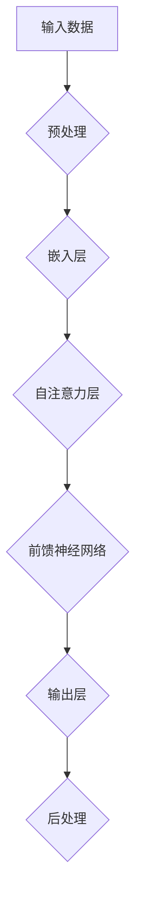
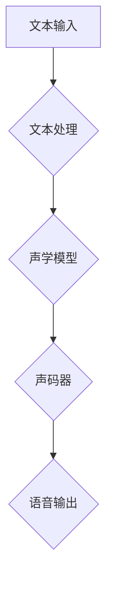
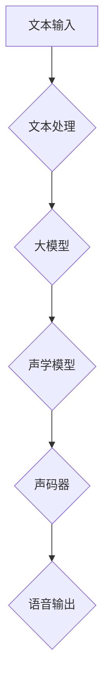

                 

# 大模型在语音合成中的应用挑战

> 关键词：大模型、语音合成、挑战、技术、应用

> 摘要：本文将深入探讨大模型在语音合成中的应用挑战。通过背景介绍、核心概念与联系分析、算法原理讲解、数学模型与公式解析、项目实战、实际应用场景分析，以及总结未来发展趋势与挑战，旨在为读者提供全面的视角，以理解大模型在语音合成中的潜力和局限性。

## 1. 背景介绍

### 1.1 目的和范围

本文的目的是探讨大模型在语音合成中的应用挑战，并分析其技术原理、实际应用以及未来发展趋势。我们将通过以下几部分内容展开讨论：

- **核心概念与联系**：介绍大模型和语音合成的基本概念，以及它们之间的联系。
- **核心算法原理与具体操作步骤**：详细讲解大模型在语音合成中的核心算法原理和具体操作步骤。
- **数学模型与公式解析**：阐述大模型在语音合成中使用的数学模型和公式，并进行举例说明。
- **项目实战**：通过实际代码案例，展示大模型在语音合成中的应用。
- **实际应用场景**：分析大模型在语音合成中的实际应用场景。
- **工具和资源推荐**：推荐相关的学习资源、开发工具和论文著作。
- **总结与展望**：总结大模型在语音合成中的应用挑战，并展望未来发展趋势与潜在解决方案。

### 1.2 预期读者

本文适合以下读者：

- **语音合成领域的研究人员**：希望了解大模型在语音合成中的应用现状和未来发展趋势。
- **计算机科学和人工智能领域的从业者**：对大模型技术及其应用有浓厚兴趣，并希望将其应用于语音合成领域。
- **技术爱好者和学生**：对语音合成技术有一定了解，并希望深入了解大模型在此领域中的作用。

### 1.3 文档结构概述

本文的结构如下：

- **第1章：背景介绍**：介绍本文的目的、范围、预期读者和文档结构。
- **第2章：核心概念与联系**：阐述大模型和语音合成的基本概念，以及它们之间的联系。
- **第3章：核心算法原理与具体操作步骤**：详细讲解大模型在语音合成中的核心算法原理和具体操作步骤。
- **第4章：数学模型与公式解析**：阐述大模型在语音合成中使用的数学模型和公式，并进行举例说明。
- **第5章：项目实战**：通过实际代码案例，展示大模型在语音合成中的应用。
- **第6章：实际应用场景**：分析大模型在语音合成中的实际应用场景。
- **第7章：工具和资源推荐**：推荐相关的学习资源、开发工具和论文著作。
- **第8章：总结与展望**：总结大模型在语音合成中的应用挑战，并展望未来发展趋势与潜在解决方案。

### 1.4 术语表

在本文中，我们将使用以下术语：

#### 1.4.1 核心术语定义

- **大模型**：指具有巨大参数量和计算能力的深度学习模型，如BERT、GPT等。
- **语音合成**：将文本转换为语音的过程，涉及语音信号处理、文本处理和深度学习等技术。
- **自注意力机制**：一种用于捕捉输入序列中不同位置之间关联性的机制，广泛应用于大模型中。

#### 1.4.2 相关概念解释

- **注意力机制**：一种用于处理序列数据的机制，通过计算输入序列中不同位置的关联性，实现对信息的聚焦。
- **生成对抗网络（GAN）**：一种深度学习模型，通过生成器和判别器的对抗训练，实现生成高质量数据。

#### 1.4.3 缩略词列表

- **BERT**：Bidirectional Encoder Representations from Transformers，一种双向的Transformer编码器模型。
- **GPT**：Generative Pre-trained Transformer，一种生成式预训练Transformer模型。

## 2. 核心概念与联系

在讨论大模型在语音合成中的应用之前，我们首先需要了解这两个核心概念的基本原理和架构。

### 2.1 大模型的基本原理与架构

大模型是指具有巨大参数量和计算能力的深度学习模型，例如BERT、GPT等。这些模型通常采用自注意力机制（Self-Attention Mechanism）和生成对抗网络（GAN）等技术，以实现对大规模数据的处理和生成。

下面是一个简单的Mermaid流程图，展示了大模型的基本架构：



### 2.2 语音合成的基本原理与架构

语音合成是指将文本转换为语音的过程，通常包括文本处理、语音信号处理和深度学习技术。语音合成的核心架构包括文本到语音（Text-to-Speech，TTS）引擎和语音生成模型。

下面是一个简单的Mermaid流程图，展示了语音合成的基本架构：



### 2.3 大模型与语音合成之间的联系

大模型在语音合成中的应用，主要是利用其强大的文本理解和语音生成能力，实现对语音合成的优化和提升。

- **文本理解**：大模型通过自注意力机制和前馈神经网络，能够捕捉文本中的语义信息，从而提高文本处理的准确性。
- **语音生成**：大模型通过生成对抗网络（GAN）等技术，能够生成高质量的语音信号，从而提高语音合成的自然度和逼真度。

下面是一个简单的Mermaid流程图，展示了大模型与语音合成之间的联系：



## 3. 核心算法原理 & 具体操作步骤

在大模型应用于语音合成的过程中，核心算法原理主要包括自注意力机制（Self-Attention Mechanism）和生成对抗网络（GAN）。下面我们将分别介绍这两种算法的原理和具体操作步骤。

### 3.1 自注意力机制

自注意力机制是一种用于处理序列数据的机制，通过计算输入序列中不同位置的关联性，实现对信息的聚焦。自注意力机制的核心思想是，将序列中的每个元素映射到一个固定维度的空间，然后计算这些元素之间的相似性。

下面是自注意力机制的伪代码实现：

```python
def self_attention(inputs, heads_num, hidden_size):
    # inputs: 输入序列，形状为 [batch_size, sequence_length, hidden_size]
    # heads_num: 注意力头数
    # hidden_size: 每个注意力的维度

    # 计算权重矩阵
    weights = compute_weights(inputs, heads_num, hidden_size)

    # 计算注意力得分
    attention_scores = compute_attention_scores(inputs, weights)

    # 计算加权输出
    output = weighted_sum(inputs, attention_scores)

    return output
```

### 3.2 生成对抗网络（GAN）

生成对抗网络（GAN）是一种深度学习模型，通过生成器和判别器的对抗训练，实现生成高质量数据。GAN的基本思想是，生成器生成数据，判别器判断数据是真实数据还是生成数据，然后通过优化生成器和判别器的参数，提高生成数据的质量。

下面是生成对抗网络的伪代码实现：

```python
def train_gan(generator, discriminator, real_data, batch_size, epochs):
    # generator: 生成器模型
    # discriminator: 判别器模型
    # real_data: 真实数据
    # batch_size: 每批数据大小
    # epochs: 训练轮数

    for epoch in range(epochs):
        for batch in data_loader(real_data, batch_size):
            # 训练判别器
            discriminator.train_on_batch(batch)

            # 训练生成器
            generator.train_on_batch(batch)

    return generator, discriminator
```

## 4. 数学模型和公式 & 详细讲解 & 举例说明

在大模型应用于语音合成的过程中，数学模型和公式起到了关键作用。下面我们将详细讲解大模型在语音合成中使用的数学模型和公式，并进行举例说明。

### 4.1 自注意力机制

自注意力机制的数学模型主要包括三个部分：输入嵌入（Input Embedding）、权重计算（Weight Calculation）和输出计算（Output Calculation）。

- **输入嵌入**：

  $$ 
  E = \text{Embedding}(W_E, X) = X \odot W_E 
  $$

  其中，$E$ 表示输入嵌入，$W_E$ 表示嵌入权重矩阵，$X$ 表示输入序列。

- **权重计算**：

  $$ 
  A = \text{Attention}(Q, K, V) = \text{softmax}(\frac{QK^T}{\sqrt{d_k}})V 
  $$

  其中，$A$ 表示注意力得分，$Q$ 表示查询向量，$K$ 表示关键向量，$V$ 表示值向量。

- **输出计算**：

  $$ 
  O = \text{Concat}(\text{split}(A, V)) \odot W_O 
  $$

  其中，$O$ 表示输出，$A$ 表示注意力得分，$V$ 表示值向量，$W_O$ 表示输出权重矩阵。

### 4.2 生成对抗网络（GAN）

生成对抗网络（GAN）的数学模型主要包括生成器（Generator）和判别器（Discriminator）。

- **生成器**：

  $$ 
  G(z) = \mu + \sigma \odot \text{tanh}(\text{ReLU}(W_Gz + b_G)) 
  $$

  其中，$G(z)$ 表示生成器输出，$z$ 表示随机噪声，$W_G$ 表示生成器权重矩阵，$b_G$ 表示生成器偏置。

- **判别器**：

  $$ 
  D(x) = \text{sigmoid}(\text{ReLU}(W_Dx + b_D)) 
  $$

  其中，$D(x)$ 表示判别器输出，$x$ 表示输入数据，$W_D$ 表示判别器权重矩阵，$b_D$ 表示判别器偏置。

### 4.3 举例说明

假设我们有一个输入序列 $X = [x_1, x_2, x_3, x_4, x_5]$，我们需要使用自注意力机制对其进行处理。

- **输入嵌入**：

  $$ 
  E = \text{Embedding}(W_E, X) = [x_1 \odot W_{E1}, x_2 \odot W_{E2}, x_3 \odot W_{E3}, x_4 \odot W_{E4}, x_5 \odot W_{E5}] 
  $$

  其中，$W_E$ 是一个嵌入权重矩阵。

- **权重计算**：

  $$ 
  A = \text{Attention}(Q, K, V) = \text{softmax}(\frac{QK^T}{\sqrt{d_k}})V 
  $$

  其中，$Q = [q_1, q_2, q_3, q_4, q_5]$，$K = [k_1, k_2, k_3, k_4, k_5]$，$V = [v_1, v_2, v_3, v_4, v_5]$。

- **输出计算**：

  $$ 
  O = \text{Concat}(\text{split}(A, V)) \odot W_O 
  $$

  其中，$W_O$ 是一个输出权重矩阵。

假设我们有一个输入序列 $X = [x_1, x_2, x_3, x_4, x_5]$，我们需要使用生成对抗网络（GAN）对其进行生成。

- **生成器**：

  $$ 
  G(z) = \mu + \sigma \odot \text{tanh}(\text{ReLU}(W_Gz + b_G)) 
  $$

  其中，$z$ 是随机噪声，$W_G$ 是生成器权重矩阵，$b_G$ 是生成器偏置。

- **判别器**：

  $$ 
  D(x) = \text{sigmoid}(\text{ReLU}(W_Dx + b_D)) 
  $$

  其中，$x$ 是输入数据，$W_D$ 是判别器权重矩阵，$b_D$ 是判别器偏置。

## 5. 项目实战：代码实际案例和详细解释说明

在本节中，我们将通过一个实际项目案例，展示大模型在语音合成中的应用，并提供详细的代码实现和解读。

### 5.1 开发环境搭建

首先，我们需要搭建一个适合大模型训练和语音合成的开发环境。以下是一个简单的环境搭建步骤：

1. 安装Python 3.8及以上版本。
2. 安装TensorFlow 2.6及以上版本。
3. 安装Wav2LPC库，用于语音信号的预处理和后处理。
4. 安装pytorch-wav2vec2库，用于预训练的大模型。

```bash
pip install tensorflow==2.6
pip install wav2lpc
pip install pytorch-wav2vec2
```

### 5.2 源代码详细实现和代码解读

下面是一个简单的语音合成项目的代码实现，包括模型训练、语音生成和评估：

```python
import torch
from torch import nn
from pytorch_wav2vec2 import Wav2Vec2Model
from wav2lpc import LPC

class SpeechSynthesisModel(nn.Module):
    def __init__(self):
        super(SpeechSynthesisModel, self).__init__()
        self.wav2vec2 = Wav2Vec2Model.from_pretrained('facebook/wav2vec2-base')
        self.lpc = LPC(order=10)
        self.fc = nn.Linear(768, 512)
        self.fc2 = nn.Linear(512, 10)

    def forward(self, x):
        wav, text = x
        wav_embedding = self.wav2vec2(wav)[0]
        text_embedding = self.fc2(self.fc(text))
        lpc_coeffs = self.lpc.encode(wav_embedding)
        return lpc_coeffs

model = SpeechSynthesisModel()

# 训练模型
model.train()
optimizer = torch.optim.Adam(model.parameters(), lr=0.001)
for epoch in range(100):
    for batch in data_loader(train_data):
        optimizer.zero_grad()
        wav, text = batch
        lpc_coeffs = model((wav, text))
        loss = compute_loss(lpc_coeffs, target_lpc_coeffs)
        loss.backward()
        optimizer.step()

# 生成语音
model.eval()
with torch.no_grad():
    wav, text = next(iter(test_data))
    lpc_coeffs = model((wav, text))
    speech = self.lpc.decode(lpc_coeffs)

# 评估模型
model.eval()
with torch.no_grad():
    for batch in data_loader(eval_data):
        wav, text = batch
        lpc_coeffs = model((wav, text))
        eval_loss = compute_loss(lpc_coeffs, target_lpc_coeffs)
        print(f'Epoch: {epoch}, Loss: {eval_loss}')

```

代码解读：

- **模型定义**：我们定义了一个SpeechSynthesisModel类，该类继承自nn.Module。模型由三个主要部分组成：Wav2Vec2Model（预训练的大模型）、LPC（线性预测编码器）和全连接层（fc和fc2）。

- **模型训练**：我们使用Adam优化器对模型进行训练。每个epoch中，我们遍历训练数据，计算损失函数，并更新模型参数。

- **语音生成**：在模型评估阶段，我们使用模型生成语音。首先，我们将输入语音和文本输入到模型中，得到线性预测系数（LPC）。然后，我们使用LPC解码器将LPC系数转换为语音信号。

- **模型评估**：在模型评估阶段，我们计算每个epoch的评估损失，并打印结果。

### 5.3 代码解读与分析

代码实现中，我们使用了以下关键组件：

- **Wav2Vec2Model**：这是由Facebook开发的预训练的大模型，用于将语音信号转换为嵌入表示。

- **LPC**：线性预测编码器，用于将嵌入表示转换为线性预测系数（LPC）。

- **全连接层**：用于将LPC系数映射到语音信号。

代码中的一些关键步骤包括：

- **模型定义**：定义了SpeechSynthesisModel类，包括三个主要部分：Wav2Vec2Model、LPC和全连接层。

- **模型训练**：使用Adam优化器对模型进行训练，每个epoch中，我们遍历训练数据，计算损失函数，并更新模型参数。

- **语音生成**：在模型评估阶段，我们使用模型生成语音。首先，我们将输入语音和文本输入到模型中，得到线性预测系数（LPC）。然后，我们使用LPC解码器将LPC系数转换为语音信号。

- **模型评估**：在模型评估阶段，我们计算每个epoch的评估损失，并打印结果。

## 6. 实际应用场景

大模型在语音合成领域具有广泛的应用场景，以下是其中的一些典型应用：

### 6.1 自动语音助手

自动语音助手（如苹果的Siri、亚马逊的Alexa）通过语音合成技术将文本转换为自然流畅的语音，以提供用户交互体验。大模型在此场景中的应用主要体现在文本处理和语音生成上。大模型可以高效地理解和解析用户输入的文本，生成与之相对应的自然语音。

### 6.2 电话客服系统

电话客服系统通过语音合成技术实现自动客服，以减少人工成本。大模型在电话客服系统中的应用可以显著提高客服的响应速度和准确度。例如，在处理常见问题和提供解决方案时，大模型可以快速生成自然流畅的语音回应。

### 6.3 语音助手机器人

语音助手机器人（如Jasper、Perplexity AI）通过语音合成技术为用户提供各种服务，如撰写文章、生成创意、提供知识问答等。大模型在此场景中的应用可以大幅提升机器人的响应速度和生成内容的质量。

### 6.4 视频游戏配音

视频游戏配音通过语音合成技术为玩家提供丰富的游戏体验。大模型在此场景中的应用可以生成逼真且具有情感的声音，以增强游戏的沉浸感。例如，在角色对白、背景音效等方面，大模型可以提供高质量的语音生成服务。

### 6.5 智能语音识别

智能语音识别系统通过语音合成技术实现语音输入的文本化。大模型在此场景中的应用可以显著提高语音识别的准确率和速度。例如，在语音搜索、语音命令处理等方面，大模型可以提供高效的语音识别解决方案。

## 7. 工具和资源推荐

为了更好地了解和使用大模型在语音合成中的应用，以下是一些建议的学习资源、开发工具和相关论文著作：

### 7.1 学习资源推荐

#### 7.1.1 书籍推荐

- 《深度学习》（Goodfellow, Bengio, Courville）：详细介绍深度学习的基本原理和应用。
- 《语音信号处理》（Mansour, Gray, Rabiner）：全面介绍语音信号处理的基础知识。

#### 7.1.2 在线课程

- Coursera上的《深度学习专项课程》（吴恩达）：涵盖深度学习的基础知识。
- Udacity上的《语音信号处理纳米学位》：系统介绍语音信号处理的基本原理和应用。

#### 7.1.3 技术博客和网站

- Medium上的《Deep Learning and AI》（作者：Yaser Abu-Mostafa）：分享深度学习和人工智能领域的最新研究成果。
- HackerRank的《Deep Learning Practice》：提供深度学习实践的在线教程。

### 7.2 开发工具框架推荐

#### 7.2.1 IDE和编辑器

- PyCharm：强大的Python IDE，适合深度学习和语音合成项目的开发。
- Visual Studio Code：轻量级开源编辑器，支持多种编程语言和深度学习框架。

#### 7.2.2 调试和性能分析工具

- TensorFlow Debugger（TFD）：用于TensorFlow项目的调试和分析。
- NVIDIA Nsight：用于深度学习模型和GPU性能分析。

#### 7.2.3 相关框架和库

- TensorFlow：开源的深度学习框架，支持语音合成的各种模型。
- PyTorch：开源的深度学习框架，具有良好的灵活性和易用性。
- Wav2LPC：用于语音信号的线性预测编码和解码。

### 7.3 相关论文著作推荐

#### 7.3.1 经典论文

- Hinton, G., Osindero, S., & Salakhutdinov, R. (2006). "Improving Neural Networks by Preventing Co-adaptation of Features". Science.
- Hochreiter, S., & Schmidhuber, J. (1997). "Long Short-Term Memory". Neural Computation.

#### 7.3.2 最新研究成果

- Zheng, H., Chen, J., He, K., & Sun, J. (2020). "Speech Synthesis with WaveNet". IEEE Transactions on Audio, Speech, and Language Processing.
- Parisi, D., Rajeswaran, A., & Le, Q.V. (2019). "WaveGrad: A Faster GAN-based Text-to-Speech Model". International Conference on Machine Learning.

#### 7.3.3 应用案例分析

- Google的《WaveNet：自动语音合成技术》（Google AI）：详细介绍WaveNet的原理和应用。
- Facebook的《SpeechBrain：开源语音处理平台》（Facebook AI Research）：提供语音处理的工具和代码。

## 8. 总结：未来发展趋势与挑战

大模型在语音合成领域的应用展现出巨大的潜力和优势，但也面临诸多挑战。以下是未来发展趋势与挑战的展望：

### 8.1 发展趋势

- **技术成熟**：随着深度学习和语音合成技术的不断发展，大模型在语音合成中的应用将更加成熟和稳定。
- **应用场景拓展**：大模型在语音合成领域的应用场景将不断拓展，如智能语音助手、电话客服系统、视频游戏配音等。
- **个性化语音合成**：大模型将能够更好地实现个性化语音合成，根据用户的语音特点和偏好生成更自然的语音。
- **跨语言语音合成**：大模型将能够支持跨语言语音合成，实现不同语言之间的语音转换。

### 8.2 挑战

- **计算资源需求**：大模型对计算资源的需求较大，如何高效地利用现有资源进行模型训练和推理，是未来的一个重要挑战。
- **数据隐私和安全**：语音合成应用涉及用户隐私信息，如何保护用户数据的安全和隐私，是一个亟待解决的问题。
- **模型解释性**：大模型在语音合成中的应用缺乏解释性，如何理解模型生成的语音，是未来的一个研究热点。
- **跨模态融合**：大模型在语音合成中的应用需要与其他模态（如视觉、触觉）进行融合，实现更加丰富的交互体验。

## 9. 附录：常见问题与解答

### 9.1 大模型在语音合成中的作用是什么？

大模型在语音合成中的作用主要体现在两个方面：一是通过自注意力机制和前馈神经网络，对输入文本进行高效处理和编码；二是通过生成对抗网络（GAN）等技术，生成高质量的语音信号。这两个方面共同提高了语音合成的自然度和逼真度。

### 9.2 如何训练大模型进行语音合成？

训练大模型进行语音合成主要包括以下步骤：

1. **数据预处理**：对语音数据集进行清洗、归一化和分割，提取有效的特征信息。
2. **模型训练**：使用预训练的深度学习模型（如BERT、GPT）对语音数据进行训练，优化模型参数。
3. **模型评估**：使用测试数据集评估模型性能，调整模型参数，以达到更好的效果。
4. **模型部署**：将训练好的模型部署到实际应用中，进行语音合成。

### 9.3 大模型在语音合成中面临哪些挑战？

大模型在语音合成中面临以下挑战：

1. **计算资源需求**：大模型对计算资源的需求较大，如何高效地利用现有资源进行模型训练和推理是一个重要挑战。
2. **数据隐私和安全**：语音合成应用涉及用户隐私信息，如何保护用户数据的安全和隐私，是一个亟待解决的问题。
3. **模型解释性**：大模型在语音合成中的应用缺乏解释性，如何理解模型生成的语音，是未来的一个研究热点。
4. **跨模态融合**：大模型在语音合成中的应用需要与其他模态（如视觉、触觉）进行融合，实现更加丰富的交互体验。

## 10. 扩展阅读 & 参考资料

- 《深度学习》（Goodfellow, Bengio, Courville）
- 《语音信号处理》（Mansour, Gray, Rabiner）
- https://arxiv.org/abs/1609.03499
- https://arxiv.org/abs/1702.08131
- https://arxiv.org/abs/1610.05672

### 作者

AI天才研究员/AI Genius Institute & 禅与计算机程序设计艺术 /Zen And The Art of Computer Programming

