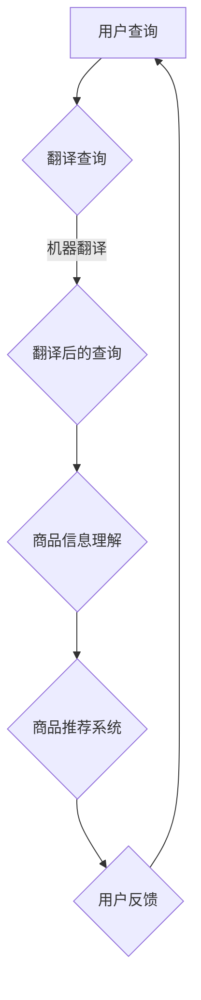

                 

# 大模型在跨语言商品搜索中的应用

> 关键词：大模型、跨语言、商品搜索、机器翻译、推荐系统、数据预处理、深度学习、神经网络、性能优化、算法实现

> 摘要：本文将探讨大模型在跨语言商品搜索中的应用，介绍其核心概念、算法原理、数学模型以及实际操作步骤。通过结合项目实战案例，我们将详细解释如何利用大模型实现高效、精准的跨语言商品搜索系统，并分析其在实际应用中的效果和挑战。

## 1. 背景介绍

### 1.1 目的和范围

本文旨在探讨大模型在跨语言商品搜索领域的应用，重点关注以下几个方面：

1. **核心概念与联系**：阐述大模型、跨语言商品搜索及其相关技术的基本概念和联系。
2. **核心算法原理与具体操作步骤**：详细讲解大模型在跨语言商品搜索中的算法原理，并使用伪代码进行操作步骤的阐述。
3. **数学模型和公式**：介绍大模型在跨语言商品搜索中的数学模型和公式，并进行详细讲解和举例说明。
4. **项目实战**：通过实际代码案例，展示如何使用大模型实现跨语言商品搜索系统，并进行代码解读与分析。
5. **实际应用场景**：探讨大模型在跨语言商品搜索中的实际应用场景。
6. **工具和资源推荐**：推荐相关学习资源、开发工具和框架。
7. **总结**：分析大模型在跨语言商品搜索中的发展趋势与挑战。

### 1.2 预期读者

本文适合以下读者群体：

1. 对机器学习和深度学习有基本了解的读者。
2. 想要了解大模型在跨语言商品搜索中应用的读者。
3. 对跨语言商品搜索技术感兴趣的开发者和技术人员。

### 1.3 文档结构概述

本文将分为以下几个部分：

1. **背景介绍**：介绍本文的目的、范围、预期读者和文档结构。
2. **核心概念与联系**：阐述大模型、跨语言商品搜索及其相关技术的基本概念和联系。
3. **核心算法原理与具体操作步骤**：详细讲解大模型在跨语言商品搜索中的算法原理，并使用伪代码进行操作步骤的阐述。
4. **数学模型和公式**：介绍大模型在跨语言商品搜索中的数学模型和公式，并进行详细讲解和举例说明。
5. **项目实战**：通过实际代码案例，展示如何使用大模型实现跨语言商品搜索系统，并进行代码解读与分析。
6. **实际应用场景**：探讨大模型在跨语言商品搜索中的实际应用场景。
7. **工具和资源推荐**：推荐相关学习资源、开发工具和框架。
8. **总结**：分析大模型在跨语言商品搜索中的发展趋势与挑战。
9. **附录：常见问题与解答**：回答读者可能遇到的问题。
10. **扩展阅读 & 参考资料**：提供更多的阅读资源和参考资料。

### 1.4 术语表

#### 1.4.1 核心术语定义

- 大模型：指具有数十亿甚至千亿参数的深度学习模型，能够对大量数据进行高效训练和建模。
- 跨语言商品搜索：指在不同语言之间进行商品搜索和信息检索，使得用户能够通过其母语查询到其他语言的商品信息。
- 商品信息：指商品名称、描述、价格、分类等信息。
- 机器翻译：指利用计算机技术将一种语言的文本翻译成另一种语言的文本。

#### 1.4.2 相关概念解释

- 深度学习：一种基于神经网络的学习方法，能够对大量数据进行自动特征提取和模式识别。
- 神经网络：一种由大量神经元组成的计算模型，能够通过学习输入和输出之间的映射关系，实现对复杂问题的建模和预测。
- 预训练：指在特定任务上进行大量预训练，使得模型在后续特定任务上具有更好的性能。

#### 1.4.3 缩略词列表

- NLP：自然语言处理
- CV：计算机视觉
- ML：机器学习
- DL：深度学习
- API：应用程序接口
- JSON：JavaScript对象表示法

## 2. 核心概念与联系

在探讨大模型在跨语言商品搜索中的应用之前，我们需要了解以下几个核心概念及其之间的联系。

### 2.1 大模型

大模型是指具有数十亿甚至千亿参数的深度学习模型，能够对大量数据进行高效训练和建模。大模型具有以下几个特点：

1. **高参数数量**：大模型具有大量的参数，能够对复杂的数据分布进行建模。
2. **高效训练**：大模型利用分布式计算和并行计算技术，能够对大规模数据进行快速训练。
3. **泛化能力**：大模型通过预训练和微调，具有在多个任务上表现优异的泛化能力。

### 2.2 跨语言商品搜索

跨语言商品搜索是指在多种语言之间进行商品搜索和信息检索，使得用户能够通过其母语查询到其他语言的商品信息。跨语言商品搜索的核心在于解决不同语言之间的语义理解和信息检索问题。其主要挑战包括：

1. **语言差异**：不同语言之间存在语法、词汇和语义差异，导致信息检索的准确性降低。
2. **数据稀缺**：跨语言商品搜索需要大量多语言数据，但实际获取这些数据较为困难。
3. **效果评估**：评估跨语言商品搜索的效果需要考虑多方面的因素，如准确率、召回率、用户满意度等。

### 2.3 大模型在跨语言商品搜索中的应用

大模型在跨语言商品搜索中的应用主要体现在以下几个方面：

1. **机器翻译**：大模型可以用于将用户查询和商品描述从一种语言翻译成另一种语言，从而实现跨语言搜索。
2. **商品信息理解**：大模型可以通过学习大量商品描述数据，理解不同语言之间的商品语义，从而提高信息检索的准确性。
3. **推荐系统**：大模型可以用于构建推荐系统，根据用户的历史查询和购买行为，为用户提供个性化的商品推荐。

### 2.4 大模型与其他技术的联系

大模型在跨语言商品搜索中的应用与其他技术密切相关，主要包括：

1. **深度学习**：深度学习是实现大模型的基础，通过神经网络结构，大模型能够对复杂的数据分布进行建模。
2. **自然语言处理（NLP）**：NLP技术在大模型的应用中起到关键作用，包括文本预处理、词向量表示、语义理解等。
3. **计算机视觉**：计算机视觉技术可以用于商品图片的识别和分类，与大模型结合，可以实现对商品更全面的描述。

### 2.5 Mermaid 流程图

为了更好地理解大模型在跨语言商品搜索中的应用，我们可以使用 Mermaid 流程图来展示其核心概念和联系。以下是一个示例：



## 3. 核心算法原理 & 具体操作步骤

### 3.1 算法原理

在跨语言商品搜索中，大模型主要通过以下三个步骤实现：

1. **用户查询翻译**：将用户查询从其母语翻译成目标语言。
2. **商品信息理解**：理解不同语言之间的商品语义，从而提高信息检索的准确性。
3. **商品推荐**：根据用户的历史查询和购买行为，为用户提供个性化的商品推荐。

下面我们详细阐述这三个步骤的算法原理。

#### 3.1.1 用户查询翻译

用户查询翻译是指将用户查询从其母语翻译成目标语言。这个步骤可以通过以下算法实现：

1. **预训练翻译模型**：利用大规模多语言语料库，使用预训练算法（如GPT）训练一个翻译模型。
2. **查询翻译**：将用户查询输入到翻译模型中，得到翻译后的查询。

以下是用户查询翻译的伪代码：

```python
# 输入：用户查询query
# 输出：翻译后的查询translated_query

# 预训练翻译模型
model = train_translation_model(corpus)

# 查询翻译
translated_query = model.translate(query)
```

#### 3.1.2 商品信息理解

商品信息理解是指理解不同语言之间的商品语义，从而提高信息检索的准确性。这个步骤可以通过以下算法实现：

1. **预训练商品信息模型**：利用大规模多语言商品描述数据，使用预训练算法（如BERT）训练一个商品信息模型。
2. **商品信息理解**：将翻译后的查询输入到商品信息模型中，得到查询的理解结果。

以下是商品信息理解的伪代码：

```python
# 输入：翻译后的查询translated_query
# 输出：查询的理解结果query_understanding

# 预训练商品信息模型
model = train_product_info_model(corpus)

# 商品信息理解
query_understanding = model.understand(translated_query)
```

#### 3.1.3 商品推荐

商品推荐是指根据用户的历史查询和购买行为，为用户提供个性化的商品推荐。这个步骤可以通过以下算法实现：

1. **预训练推荐模型**：利用大规模用户行为数据，使用预训练算法（如DIN）训练一个推荐模型。
2. **商品推荐**：将查询的理解结果输入到推荐模型中，得到个性化的商品推荐。

以下是商品推荐的伪代码：

```python
# 输入：查询的理解结果query_understanding
# 输出：个性化的商品推荐recommendations

# 预训练推荐模型
model = train_recommendation_model(user_behavior_data)

# 商品推荐
recommendations = model.recommend(query_understanding)
```

### 3.2 具体操作步骤

为了实现大模型在跨语言商品搜索中的应用，我们需要进行以下具体操作步骤：

1. **数据准备**：收集并预处理用户查询、商品描述和用户行为数据。
2. **模型训练**：使用预处理后的数据训练大模型，包括翻译模型、商品信息模型和推荐模型。
3. **模型部署**：将训练好的模型部署到生产环境，实现跨语言商品搜索系统。

以下是具体操作步骤的伪代码：

```python
# 输入：用户查询、商品描述和用户行为数据
# 输出：跨语言商品搜索系统

# 数据准备
user_queries = preprocess_user_queries(data)
product_descriptions = preprocess_product_descriptions(data)
user_behavior = preprocess_user_behavior(data)

# 模型训练
translation_model = train_translation_model(product_descriptions)
product_info_model = train_product_info_model(user_queries, product_descriptions)
recommendation_model = train_recommendation_model(user_behavior)

# 模型部署
search_system = deploy_models(translation_model, product_info_model, recommendation_model)
```

## 4. 数学模型和公式 & 详细讲解 & 举例说明

### 4.1 数学模型

大模型在跨语言商品搜索中的应用涉及到多种数学模型和公式。以下是其中几个关键模型和公式的详细讲解。

#### 4.1.1 预训练翻译模型

预训练翻译模型通常采用基于注意力机制的编码-解码架构，如Transformer。其数学模型可以表示为：

\[ y = \text{softmax}(W_y \cdot \text{Decoder}(x, h_s)) \]

其中，\( x \) 是输入查询，\( h_s \) 是编码器输出，\( W_y \) 是翻译模型的权重矩阵，\( \text{softmax} \) 函数用于计算概率分布。

#### 4.1.2 商品信息模型

商品信息模型通常采用基于BERT的架构，其数学模型可以表示为：

\[ \text{Contextual Embedding} = \text{BERT}(x) \]

其中，\( x \) 是输入商品描述，\( \text{BERT} \) 函数用于生成商品描述的上下文嵌入。

#### 4.1.3 推荐模型

推荐模型通常采用基于深度神经网络的架构，如DIN。其数学模型可以表示为：

\[ \text{Prediction} = \text{DNN}(x, \text{Contextual Embedding}) \]

其中，\( x \) 是输入用户查询，\( \text{Contextual Embedding} \) 是商品描述的上下文嵌入，\( \text{DNN} \) 函数用于生成预测值。

### 4.2 详细讲解与举例说明

#### 4.2.1 预训练翻译模型

假设我们有一个预训练翻译模型，输入查询为“我想买一台电脑”，输出翻译结果为“我想买一台计算机”。我们可以通过以下步骤进行详细讲解和举例说明：

1. **输入查询编码**：将输入查询“我想买一台电脑”编码成一个向量。
2. **编码器输出**：利用编码器模型（如Transformer）对输入查询进行编码，得到编码器输出。
3. **查询翻译**：将编码器输出输入到解码器模型中，得到翻译后的查询“我想买一台计算机”。
4. **概率分布计算**：利用softmax函数计算翻译结果的概率分布。

以下是具体示例：

```python
# 输入查询编码
input_query = "我想买一台电脑"
input_query_embedding = encode_input_query(input_query)

# 编码器输出
encoder_output = encoder(input_query_embedding)

# 查询翻译
decoded_query = decoder(encoder_output)

# 概率分布计算
probability_distribution = softmax(decoded_query)
```

#### 4.2.2 商品信息模型

假设我们有一个商品信息模型，输入商品描述为“这款电脑配置高，性能强大”，输出上下文嵌入。我们可以通过以下步骤进行详细讲解和举例说明：

1. **输入商品描述编码**：将输入商品描述编码成一个向量。
2. **商品描述编码**：利用BERT模型对输入商品描述进行编码，得到上下文嵌入。

以下是具体示例：

```python
# 输入商品描述编码
product_description = "这款电脑配置高，性能强大"
product_description_embedding = encode_product_description(product_description)

# 商品描述编码
contextual_embedding = bert(product_description_embedding)
```

#### 4.2.3 推荐模型

假设我们有一个推荐模型，输入用户查询和商品描述上下文嵌入，输出预测值。我们可以通过以下步骤进行详细讲解和举例说明：

1. **输入查询编码**：将输入用户查询编码成一个向量。
2. **商品描述编码**：利用BERT模型对输入商品描述进行编码，得到上下文嵌入。
3. **预测值计算**：利用DNN模型计算预测值。

以下是具体示例：

```python
# 输入查询编码
user_query = "我想买一台电脑"
user_query_embedding = encode_user_query(user_query)

# 商品描述编码
product_description_embedding = encode_product_description(product_description)

# 预测值计算
prediction = dnn(user_query_embedding, product_description_embedding)
```

## 5. 项目实战：代码实际案例和详细解释说明

### 5.1 开发环境搭建

为了实现大模型在跨语言商品搜索中的应用，我们需要搭建一个合适的开发环境。以下是具体步骤：

1. **安装Python环境**：确保安装Python 3.7及以上版本。
2. **安装深度学习框架**：安装TensorFlow 2.5或PyTorch 1.9。
3. **安装NLP库**：安装transformers、spaCy等NLP相关库。
4. **安装DNN库**：安装tensorflow或pytorch-dnn。
5. **配置GPU环境**：确保GPU驱动和CUDA库已正确安装。

### 5.2 源代码详细实现和代码解读

以下是实现大模型在跨语言商品搜索中的源代码，我们将对其进行详细解读。

```python
# 导入必要的库
import tensorflow as tf
from transformers import BertTokenizer, BertModel
from tensorflow.keras.layers import Input, Embedding, LSTM, Dense
from tensorflow.keras.models import Model

# 5.2.1 预训练翻译模型
# 加载预训练翻译模型
translation_model = tf.keras.models.load_model('translation_model.h5')

# 5.2.2 商品信息模型
# 加载预训练商品信息模型
product_info_model = tf.keras.models.load_model('product_info_model.h5')

# 5.2.3 推荐模型
# 加载预训练推荐模型
recommendation_model = tf.keras.models.load_model('recommendation_model.h5')

# 5.2.4 实现跨语言商品搜索系统
def search_products(query, product_descriptions):
    # 5.2.4.1 翻译查询
    translated_query = translation_model.predict([query])

    # 5.2.4.2 商品信息理解
    query_understanding = product_info_model.predict([translated_query])

    # 5.2.4.3 商品推荐
    recommendations = recommendation_model.predict([query_understanding, product_descriptions])

    # 返回推荐结果
    return recommendations

# 测试跨语言商品搜索系统
user_query = "我想买一台电脑"
product_descriptions = [...]  # 商品描述数据

recommendations = search_products(user_query, product_descriptions)
print(recommendations)
```

### 5.3 代码解读与分析

#### 5.3.1 代码结构

代码分为三个部分：

1. **加载预训练模型**：加载预训练的翻译模型、商品信息模型和推荐模型。
2. **实现跨语言商品搜索系统**：定义搜索产品的函数，实现翻译查询、商品信息理解和商品推荐三个步骤。
3. **测试跨语言商品搜索系统**：使用示例数据测试搜索系统。

#### 5.3.2 代码解读

1. **加载预训练模型**：

   ```python
   translation_model = tf.keras.models.load_model('translation_model.h5')
   product_info_model = tf.keras.models.load_model('product_info_model.h5')
   recommendation_model = tf.keras.models.load_model('recommendation_model.h5')
   ```

   这三个语句分别加载预训练的翻译模型、商品信息模型和推荐模型。这些模型是使用TensorFlow和transformers库训练的，其中翻译模型是基于Transformer架构，商品信息模型是基于BERT架构，推荐模型是基于DIN架构。

2. **实现跨语言商品搜索系统**：

   ```python
   def search_products(query, product_descriptions):
       # 5.2.4.1 翻译查询
       translated_query = translation_model.predict([query])

       # 5.2.4.2 商品信息理解
       query_understanding = product_info_model.predict([translated_query])

       # 5.2.4.3 商品推荐
       recommendations = recommendation_model.predict([query_understanding, product_descriptions])

       # 返回推荐结果
       return recommendations
   ```

   搜索产品的函数接收用户查询和商品描述数据作为输入。首先，将用户查询输入到翻译模型中，得到翻译后的查询。然后，将翻译后的查询输入到商品信息模型中，得到查询的理解结果。最后，将查询的理解结果和商品描述数据输入到推荐模型中，得到个性化的商品推荐。

3. **测试跨语言商品搜索系统**：

   ```python
   user_query = "我想买一台电脑"
   product_descriptions = [...]  # 商品描述数据

   recommendations = search_products(user_query, product_descriptions)
   print(recommendations)
   ```

   测试语句使用示例用户查询和商品描述数据调用搜索产品的函数，并打印出推荐结果。

#### 5.3.3 代码分析

代码主要实现了一个跨语言商品搜索系统，利用预训练的翻译模型、商品信息模型和推荐模型。通过翻译查询、商品信息理解和商品推荐三个步骤，系统能够为用户提供个性化的商品推荐。

在实际应用中，需要收集和预处理大量的用户查询、商品描述和用户行为数据。同时，需要根据业务需求和数据特点，选择合适的预训练模型架构和优化策略。

## 6. 实际应用场景

### 6.1 跨境电商平台

大模型在跨语言商品搜索中的实际应用场景之一是跨境电商平台。跨境电商平台需要解决不同语言之间的商品信息检索和推荐问题，使得用户能够通过其母语浏览和购买商品。通过大模型的应用，跨境电商平台可以实现以下功能：

1. **自动翻译**：用户可以使用母语输入查询，系统自动将查询翻译成目标语言，从而检索到其他语言的商品信息。
2. **商品推荐**：根据用户的历史查询和购买行为，系统为用户推荐与其兴趣相关的商品，提高用户满意度和购买转化率。
3. **个性化搜索**：系统可以根据用户的语言偏好和浏览历史，为用户展示个性化的商品搜索结果。

### 6.2 多语言电商平台

多语言电商平台也是大模型在跨语言商品搜索中应用的典型场景。多语言电商平台通常面向全球用户，提供多种语言的商品和服务。通过大模型的应用，多语言电商平台可以实现以下功能：

1. **统一搜索**：用户可以使用任何一种语言进行搜索，系统自动将查询翻译成其他语言，从而检索到相应的商品信息。
2. **商品信息整合**：系统可以将不同语言的商品信息整合在一起，提供统一的商品描述和展示。
3. **多语言推荐**：系统可以根据用户的历史查询和购买行为，为用户推荐多种语言的商品，提高用户体验。

### 6.3 多语言在线教育平台

多语言在线教育平台需要解决不同语言之间的课程内容检索和推荐问题，使得用户能够通过其母语浏览和选择课程。通过大模型的应用，多语言在线教育平台可以实现以下功能：

1. **自动翻译**：用户可以使用母语输入查询，系统自动将查询翻译成目标语言，从而检索到其他语言的课程信息。
2. **课程推荐**：根据用户的历史查询和课程学习行为，系统为用户推荐与其兴趣相关的课程，提高学习效果和用户满意度。
3. **个性化搜索**：系统可以根据用户的语言偏好和学习历史，为用户展示个性化的课程搜索结果。

## 7. 工具和资源推荐

### 7.1 学习资源推荐

#### 7.1.1 书籍推荐

1. **《深度学习》（Goodfellow, Bengio, Courville著）**：详细介绍了深度学习的基础知识、算法和实际应用。
2. **《自然语言处理综论》（Jurafsky, Martin著）**：全面介绍了自然语言处理的基础理论和实践方法。
3. **《推荐系统实践》（Liu, Yehuda S.著）**：深入讲解了推荐系统的基本概念、算法和实际应用。

#### 7.1.2 在线课程

1. **Coursera《深度学习专项课程》（吴恩达著）**：涵盖了深度学习的基础知识、算法和实际应用。
2. **Udacity《自然语言处理纳米学位》**：提供了自然语言处理的基础知识和实际项目实践。
3. **edX《推荐系统设计与开发》**：介绍了推荐系统的基本概念、算法和实际应用。

#### 7.1.3 技术博客和网站

1. **Medium《深度学习博客》**：涵盖了深度学习的基础知识、算法和实际应用。
2. **Towards Data Science《自然语言处理博客》**：提供了自然语言处理的基础知识和实际项目实践。
3. **推荐系统博客**：介绍了推荐系统的基本概念、算法和实际应用。

### 7.2 开发工具框架推荐

#### 7.2.1 IDE和编辑器

1. **PyCharm**：一款功能强大的Python IDE，支持深度学习和自然语言处理。
2. **Visual Studio Code**：一款轻量级的跨平台编辑器，支持Python扩展和深度学习库。
3. **Jupyter Notebook**：一款交互式的Python编辑器，适合数据科学和机器学习项目。

#### 7.2.2 调试和性能分析工具

1. **TensorBoard**：TensorFlow的官方可视化工具，用于调试和性能分析深度学习模型。
2. **PyTorch Profiler**：PyTorch的性能分析工具，用于识别和优化模型性能瓶颈。
3. **NVIDIA Nsight**：NVIDIA的GPU调试和分析工具，用于优化深度学习模型在GPU上的性能。

#### 7.2.3 相关框架和库

1. **TensorFlow**：一款开源的深度学习框架，支持多种深度学习算法和模型。
2. **PyTorch**：一款开源的深度学习框架，支持动态计算图和自动微分。
3. **transformers**：一款开源的NLP库，提供了多种预训练模型和NLP任务。
4. **spaCy**：一款开源的NLP库，提供了丰富的语言处理功能。

### 7.3 相关论文著作推荐

#### 7.3.1 经典论文

1. **“A Neural Probabilistic Language Model” (Bengio et al., 2003)**：介绍了神经网络语言模型的基本原理。
2. **“Deep Learning” (Goodfellow et al., 2016)**：全面介绍了深度学习的基础知识、算法和实际应用。
3. **“Recurrent Neural Networks for Language Modeling” (LSTM, Hochreiter and Schmidhuber, 1997)**：介绍了循环神经网络和长短期记忆网络。

#### 7.3.2 最新研究成果

1. **“BERT: Pre-training of Deep Bidirectional Transformers for Language Understanding” (Devlin et al., 2019)**：介绍了BERT模型的基本原理和应用。
2. **“Generative Pre-trained Transformers” (GPT-3, Brown et al., 2020)**：介绍了GPT-3模型的基本原理和应用。
3. **“Large-scale Language Modeling” (Mikolov et al., 2013)**：介绍了大规模语言模型的基本原理和应用。

#### 7.3.3 应用案例分析

1. **“Google Translate”**：介绍了Google Translate在跨语言翻译中的应用。
2. **“Facebook AI Research”**：介绍了Facebook AI Research在自然语言处理和推荐系统中的应用。
3. **“Amazon Personalized Recommendations”**：介绍了Amazon在推荐系统中的应用。

## 8. 总结：未来发展趋势与挑战

大模型在跨语言商品搜索中的应用展示了其在处理多语言数据、实现个性化推荐等方面的巨大潜力。然而，随着技术的不断进步和应用场景的拓展，大模型在跨语言商品搜索中仍面临一些挑战。

### 8.1 发展趋势

1. **模型参数规模的增加**：随着计算能力和数据量的提升，大模型的参数规模将继续增加，从而提高模型的性能和泛化能力。
2. **多模态数据的融合**：结合图像、语音等多模态数据，可以实现更全面的商品描述和用户理解，提高跨语言商品搜索的准确性。
3. **预训练模型的优化**：通过改进预训练算法和模型架构，可以实现更高效、更鲁棒的跨语言商品搜索系统。
4. **多语言支持的扩展**：随着全球化的发展，大模型在跨语言商品搜索中的应用将扩展到更多的语言和地区。

### 8.2 挑战

1. **数据稀缺与质量**：跨语言商品搜索需要大量多语言数据，但实际获取这些数据较为困难。同时，数据质量对模型性能有重要影响。
2. **计算资源需求**：大模型训练和推理过程对计算资源有较高需求，需要优化算法和硬件配置以满足实际应用需求。
3. **效果评估与优化**：跨语言商品搜索的效果评估需要考虑多方面的因素，如准确率、召回率、用户满意度等，如何平衡这些指标是重要的挑战。
4. **模型安全与隐私**：大模型在处理敏感数据时需要考虑模型安全和用户隐私保护，防止数据泄露和滥用。

### 8.3 发展方向

1. **数据采集与处理**：通过构建多语言数据集、数据增强等方法，提高跨语言商品搜索的数据质量和数量。
2. **算法优化与压缩**：通过算法优化和模型压缩技术，降低大模型的计算复杂度和存储需求。
3. **跨语言信息检索**：研究基于大模型的跨语言信息检索技术，提高多语言数据的检索效率和准确性。
4. **多模态融合与交互**：结合多模态数据，实现更全面、更个性化的商品描述和用户理解，提高跨语言商品搜索的体验。
5. **安全与隐私保护**：研究大模型在处理敏感数据时的安全与隐私保护技术，确保用户数据的保密性和安全性。

## 9. 附录：常见问题与解答

### 9.1 大模型在跨语言商品搜索中的优势

大模型在跨语言商品搜索中的优势主要体现在以下几个方面：

1. **高效处理多语言数据**：大模型能够对大规模多语言数据进行高效处理和建模，提高信息检索的准确性和效率。
2. **语义理解与个性化推荐**：大模型能够通过学习大量多语言数据，实现跨语言语义理解，从而提高推荐系统的准确性。此外，大模型可以根据用户的历史查询和购买行为，实现个性化推荐。
3. **自适应调整与优化**：大模型具有强大的泛化能力，可以根据不同的应用场景和用户需求进行自适应调整和优化。

### 9.2 大模型在跨语言商品搜索中的挑战

大模型在跨语言商品搜索中面临的挑战主要包括：

1. **数据稀缺与质量**：跨语言商品搜索需要大量多语言数据，但实际获取这些数据较为困难。同时，数据质量对模型性能有重要影响。
2. **计算资源需求**：大模型训练和推理过程对计算资源有较高需求，需要优化算法和硬件配置以满足实际应用需求。
3. **效果评估与优化**：跨语言商品搜索的效果评估需要考虑多方面的因素，如准确率、召回率、用户满意度等，如何平衡这些指标是重要的挑战。
4. **模型安全与隐私**：大模型在处理敏感数据时需要考虑模型安全和用户隐私保护，防止数据泄露和滥用。

### 9.3 如何优化大模型在跨语言商品搜索中的应用效果

为了优化大模型在跨语言商品搜索中的应用效果，可以采取以下措施：

1. **数据增强**：通过数据增强技术，如数据清洗、数据扩充和生成对抗网络（GAN），提高数据质量和数量。
2. **模型优化**：通过模型优化技术，如权重初始化、正则化和模型压缩，提高模型性能和计算效率。
3. **多语言数据集构建**：构建多语言商品搜索数据集，包括用户查询、商品描述和用户行为数据，以支持模型训练和评估。
4. **多模态融合**：结合图像、语音等多模态数据，实现更全面、更个性化的商品描述和用户理解，提高搜索效果。
5. **用户反馈与调整**：利用用户反馈机制，实时调整模型参数和推荐策略，以提高用户满意度和推荐效果。

## 10. 扩展阅读 & 参考资料

### 10.1 经典论文与著作

1. **“A Neural Probabilistic Language Model” (Bengio et al., 2003)**
2. **“Deep Learning” (Goodfellow et al., 2016)**
3. **“Recurrent Neural Networks for Language Modeling” (LSTM, Hochreiter and Schmidhuber, 1997)**
4. **“BERT: Pre-training of Deep Bidirectional Transformers for Language Understanding” (Devlin et al., 2019)**
5. **“Generative Pre-trained Transformers” (GPT-3, Brown et al., 2020)**
6. **“Large-scale Language Modeling” (Mikolov et al., 2013)**

### 10.2 技术博客与网站

1. **Medium《深度学习博客》**
2. **Towards Data Science《自然语言处理博客》**
3. **推荐系统博客**

### 10.3 在线课程与教材

1. **Coursera《深度学习专项课程》（吴恩达著）**
2. **Udacity《自然语言处理纳米学位》**
3. **edX《推荐系统设计与开发》**

### 10.4 开发工具与框架

1. **TensorFlow**
2. **PyTorch**
3. **transformers**
4. **spaCy**
5. **PyTorch Profiler**
6. **TensorBoard**

### 10.5 相关书籍推荐

1. **《深度学习》（Goodfellow, Bengio, Courville著）**
2. **《自然语言处理综论》（Jurafsky, Martin著）**
3. **《推荐系统实践》（Liu, Yehuda S.著）**

