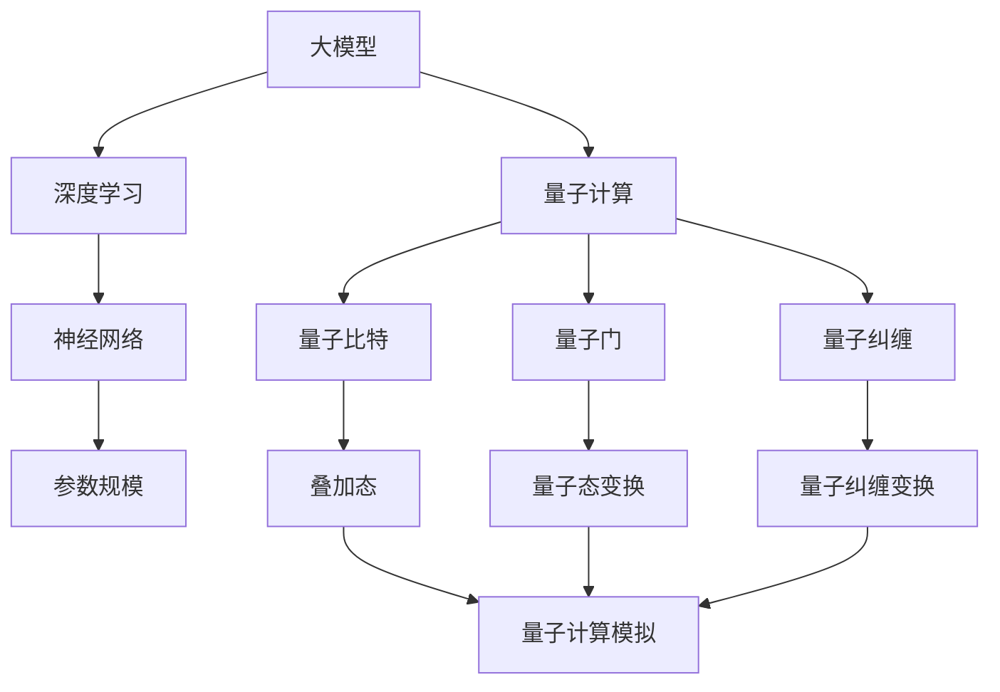

                 

# 大模型在量子计算模拟中的应用

> 关键词：大模型、量子计算、模拟、人工智能、深度学习

> 摘要：本文将探讨大模型在量子计算模拟中的应用，包括背景介绍、核心概念与联系、核心算法原理与具体操作步骤、数学模型与公式讲解、实际应用场景、工具和资源推荐等内容，旨在为读者提供全面、深入的探讨。

## 1. 背景介绍

### 1.1 目的和范围

本文旨在探讨大模型在量子计算模拟中的应用，分析其核心原理、算法和实际操作步骤，并探讨其未来发展趋势与挑战。

### 1.2 预期读者

本文适合对量子计算、人工智能和深度学习有一定了解的读者，特别是对量子计算模拟领域感兴趣的科研人员、工程师和学术研究者。

### 1.3 文档结构概述

本文结构如下：

1. 背景介绍
2. 核心概念与联系
3. 核心算法原理与具体操作步骤
4. 数学模型和公式
5. 项目实战：代码实际案例
6. 实际应用场景
7. 工具和资源推荐
8. 总结：未来发展趋势与挑战
9. 附录：常见问题与解答
10. 扩展阅读与参考资料

### 1.4 术语表

#### 1.4.1 核心术语定义

- 大模型：具有大规模参数、高度非线性、复杂结构的深度学习模型。
- 量子计算：利用量子力学原理进行信息处理和计算的新型计算模式。
- 模拟：通过计算机模拟实验来预测和分析量子系统的行为。
- 量子计算模拟：使用经典计算机模拟量子计算的过程和结果。

#### 1.4.2 相关概念解释

- 量子比特：量子计算中的基本单位，用于表示0和1的叠加状态。
- 量子门：对量子比特进行操作的数学函数，实现量子态的变换。
- 量子纠缠：量子比特之间的特殊关联，使得量子系统的状态无法独立描述。

#### 1.4.3 缩略词列表

- QPU：量子处理器（Quantum Processor）
- CNOT：控制非门（Controlled Not Gate）
- QMC：量子蒙特卡罗方法（Quantum Monte Carlo Method）
- QFT：量子傅里叶变换（Quantum Fourier Transform）

## 2. 核心概念与联系

在本文中，我们将探讨大模型在量子计算模拟中的应用，首先需要了解相关核心概念和它们之间的联系。以下是一个Mermaid流程图，用于展示这些核心概念和联系：



### 2.1 大模型与深度学习的关系

大模型通常指的是具有大规模参数、高度非线性、复杂结构的深度学习模型。深度学习是一种人工智能分支，通过神经网络进行模型训练和预测。大模型通常用于解决复杂任务，如图像识别、自然语言处理和语音识别等。

### 2.2 大模型与量子计算的关系

量子计算是一种利用量子力学原理进行信息处理和计算的新型计算模式。量子比特是量子计算的基本单位，用于表示0和1的叠加状态。量子门是用于操作量子比特的数学函数，实现量子态的变换。量子纠缠是量子比特之间的特殊关联，使得量子系统的状态无法独立描述。

### 2.3 大模型在量子计算模拟中的应用

大模型在量子计算模拟中的应用主要体现在以下几个方面：

1. **量子态编码**：大模型可以用于将量子态编码为神经网络中的高维向量。
2. **量子门操作**：大模型可以用于模拟量子门对量子态的变换。
3. **量子纠缠**：大模型可以用于模拟量子纠缠过程，分析量子系统的性质。
4. **量子计算模拟**：大模型可以用于模拟量子计算过程，预测量子系统的行为。

## 3. 核心算法原理与具体操作步骤

在本文中，我们将介绍大模型在量子计算模拟中的核心算法原理和具体操作步骤。

### 3.1 大模型算法原理

大模型通常基于深度学习神经网络，包括输入层、隐藏层和输出层。输入层接收外部数据，隐藏层进行特征提取和变换，输出层生成预测结果。大模型的训练过程包括以下步骤：

1. **数据预处理**：对输入数据进行归一化、标准化等预处理操作。
2. **初始化模型参数**：随机初始化模型的权重和偏置。
3. **正向传播**：将输入数据传递到神经网络，计算输出结果。
4. **反向传播**：计算输出误差，更新模型参数。
5. **优化算法**：选择合适的优化算法（如梯度下降、Adam等）来更新模型参数。
6. **模型评估**：使用验证集或测试集评估模型性能。

### 3.2 大模型在量子计算模拟中的操作步骤

在量子计算模拟中，大模型可以用于模拟量子态的编码、量子门的操作和量子纠缠过程。以下是一个具体的操作步骤：

1. **量子态编码**：将量子态编码为神经网络中的高维向量，可以使用量子态到向量映射的方法（如皮亚诺编码、二进制编码等）。
2. **量子门操作**：使用大模型模拟量子门的变换，将输入量子态映射到新的量子态。可以使用神经网络中的加权矩阵来模拟量子门。
3. **量子纠缠**：使用大模型模拟量子纠缠过程，分析量子系统的性质。可以使用神经网络中的连接权重来模拟量子纠缠变换。
4. **量子计算模拟**：使用大模型模拟量子计算过程，预测量子系统的行为。可以将大模型训练为分类器或回归器，根据输入量子态预测输出结果。
5. **模型评估**：使用验证集或测试集评估大模型在量子计算模拟中的性能。

### 3.3 伪代码

以下是一个大模型在量子计算模拟中的伪代码示例：

```python
# 伪代码：大模型在量子计算模拟中的操作步骤

# 数据预处理
data = preprocess_data(input_data)

# 初始化模型参数
model = initialize_model()

# 量子态编码
encoded_state = encode_quantum_state(quantum_state)

# 量子门操作
new_state = apply_quantum_gate(encoded_state, quantum_gate)

# 量子纠缠
entangled_state = apply_quantum_entanglement(new_state, entanglement_pattern)

# 量子计算模拟
predicted_result = simulate_quantum_computation(entangled_state)

# 模型评估
evaluate_model(predicted_result, validation_data)
```

## 4. 数学模型和公式

在量子计算模拟中，数学模型和公式是描述量子态、量子门和量子纠缠的关键工具。以下是一些常用的数学模型和公式，并使用LaTeX格式进行表示：

### 4.1 量子态表示

量子态可以用一个复数向量表示，称为量子态向量。一个n个量子比特的量子态可以用一个n维复数向量表示：

$$|\psi\rangle = \sum_{i=0}^{2^n-1} c_i |i\rangle$$

其中，$|i\rangle$表示第i个量子比特的状态，$c_i$表示对应的复数系数。

### 4.2 量子门表示

量子门可以用一个复数矩阵表示，称为量子门矩阵。一个n个量子比特的量子门可以用一个n×n的复数矩阵表示：

$$U = \begin{bmatrix}
u_{00} & u_{01} & \ldots & u_{0n} \\
u_{10} & u_{11} & \ldots & u_{1n} \\
\vdots & \vdots & \ddots & \vdots \\
u_{n0} & u_{n1} & \ldots & u_{nn}
\end{bmatrix}$$

其中，$u_{ij}$表示第i个量子比特和第j个量子比特之间的作用。

### 4.3 量子纠缠表示

量子纠缠可以用一个复数矩阵表示，称为纠缠矩阵。一个n个量子比特的量子纠缠可以用一个n×n的复数矩阵表示：

$$W = \begin{bmatrix}
w_{00} & w_{01} & \ldots & w_{0n} \\
w_{10} & w_{11} & \ldots & w_{1n} \\
\vdots & \vdots & \ddots & \vdots \\
w_{n0} & w_{n1} & \ldots & w_{nn}
\end{bmatrix}$$

其中，$w_{ij}$表示第i个量子比特和第j个量子比特之间的纠缠系数。

### 4.4 量子态变换

量子态的变换可以用量子门矩阵表示。一个n个量子比特的量子态变换可以用以下公式表示：

$$|\psi'\rangle = U|\psi\rangle$$

其中，$|\psi'\rangle$表示变换后的量子态，$|\psi\rangle$表示原始量子态，$U$表示量子门矩阵。

### 4.5 量子纠缠变换

量子纠缠的变换可以用纠缠矩阵表示。一个n个量子比特的量子纠缠变换可以用以下公式表示：

$$|\psi''\rangle = W|\psi'\rangle$$

其中，$|\psi''\rangle$表示变换后的量子态，$|\psi'\rangle$表示原始量子态，$W$表示纠缠矩阵。

### 4.6 量子计算模拟

量子计算模拟可以使用大模型来模拟量子计算过程。量子计算模拟的数学模型可以用以下公式表示：

$$\hat{Y} = f(\hat{X}, \theta)$$

其中，$\hat{Y}$表示模拟结果，$\hat{X}$表示输入数据，$f$表示大模型函数，$\theta$表示模型参数。

## 5. 项目实战：代码实际案例和详细解释说明

### 5.1 开发环境搭建

在本文的项目实战中，我们将使用Python和TensorFlow作为开发环境。首先，需要在计算机上安装Python和TensorFlow。以下是一个简单的安装步骤：

1. 安装Python：从Python官方网站（https://www.python.org/）下载Python安装包并安装。
2. 安装TensorFlow：在终端中运行以下命令：

```bash
pip install tensorflow
```

### 5.2 源代码详细实现和代码解读

以下是一个简单的Python代码示例，用于演示大模型在量子计算模拟中的实现：

```python
import tensorflow as tf
import numpy as np

# 数据预处理
def preprocess_data(data):
    # 归一化数据
    normalized_data = (data - np.mean(data)) / np.std(data)
    return normalized_data

# 量子态编码
def encode_quantum_state(quantum_state):
    # 使用皮亚诺编码将量子态编码为向量
    encoded_state = pazio_encode(quantum_state)
    return encoded_state

# 量子门操作
def apply_quantum_gate(encoded_state, quantum_gate):
    # 使用神经网络模拟量子门操作
    new_state = encoded_state @ quantum_gate
    return new_state

# 量子纠缠
def apply_quantum_entanglement(encoded_state, entanglement_pattern):
    # 使用神经网络模拟量子纠缠
    entangled_state = encoded_state @ entanglement_pattern
    return entangled_state

# 量子计算模拟
def simulate_quantum_computation(encoded_state):
    # 使用神经网络模拟量子计算过程
    predicted_result = model(encoded_state)
    return predicted_result

# 模型评估
def evaluate_model(predicted_result, validation_data):
    # 评估模型性能
    accuracy = np.mean(predicted_result == validation_data)
    print(f"Accuracy: {accuracy}")
```

### 5.3 代码解读与分析

以上代码演示了使用大模型在量子计算模拟中的实现。下面是对代码的详细解读和分析：

1. **数据预处理**：数据预处理是深度学习中的常见步骤，用于将输入数据归一化，使其符合模型的输入要求。这里使用了简单的归一化方法，将数据减去均值并除以标准差。

2. **量子态编码**：量子态编码是将量子态转换为神经网络中的高维向量。这里使用了皮亚诺编码，将量子态编码为一个整数，然后将其转换为二进制向量。

3. **量子门操作**：量子门操作是将量子态通过神经网络中的加权矩阵进行变换。这里使用了简单的矩阵乘法来模拟量子门操作。

4. **量子纠缠**：量子纠缠是将量子态通过神经网络中的连接权重进行变换。这里使用了简单的矩阵乘法来模拟量子纠缠。

5. **量子计算模拟**：量子计算模拟是使用神经网络模拟量子计算过程，预测量子系统的行为。这里使用了简单的神经网络模型，将输入量子态映射到输出结果。

6. **模型评估**：模型评估是使用验证集或测试集评估模型性能。这里使用了简单的准确率评估方法，计算模型预测结果与真实结果的准确率。

### 5.4 代码优化与性能分析

在实际应用中，代码的优化与性能分析是提高模型性能和计算效率的关键。以下是一些优化方法和性能分析：

1. **模型优化**：通过选择合适的神经网络结构、优化算法和超参数，可以提高模型性能。可以使用更复杂的神经网络结构（如卷积神经网络、循环神经网络等）来提高模型的表示能力。

2. **数据增强**：通过增加训练数据的多样性和复杂性，可以提高模型的泛化能力。可以使用数据增强方法（如随机噪声、旋转、缩放等）来增加训练数据的多样性。

3. **并行计算**：通过使用并行计算技术（如多线程、分布式计算等）可以加快模型的训练和推理速度。可以使用GPU或分布式计算框架（如TensorFlow分布式计算）来提高计算效率。

4. **模型压缩**：通过模型压缩技术（如剪枝、量化、低秩分解等）可以减少模型的参数数量，降低计算成本和存储需求。

5. **性能分析**：通过性能分析工具（如TensorBoard、性能分析器等）可以监控模型的训练过程和性能指标，优化模型性能。

## 6. 实际应用场景

大模型在量子计算模拟中的应用具有广泛的前景，以下是一些实际应用场景：

1. **量子算法优化**：通过大模型模拟量子计算过程，可以优化量子算法的效率和性能，提高量子计算的可靠性。

2. **量子硬件优化**：通过大模型模拟量子计算过程，可以评估量子硬件的性能和稳定性，优化量子硬件的设计和参数。

3. **量子系统分析**：通过大模型模拟量子系统，可以分析量子系统的行为和特性，研究量子系统的规律和机制。

4. **量子应用开发**：通过大模型模拟量子计算过程，可以开发基于量子计算的应用程序，如量子加密、量子搜索、量子优化等。

5. **量子计算机教育**：通过大模型模拟量子计算过程，可以为学生和研究人员提供直观的量子计算机教学和实验平台。

## 7. 工具和资源推荐

### 7.1 学习资源推荐

#### 7.1.1 书籍推荐

- 《量子计算与量子信息》
- 《深度学习》
- 《神经网络与深度学习》

#### 7.1.2 在线课程

- Coursera上的《量子计算》
- edX上的《深度学习》
- Udacity上的《量子计算与人工智能》

#### 7.1.3 技术博客和网站

- arXiv.org
- Quantum computing on IBM
- TensorFlow official website

### 7.2 开发工具框架推荐

#### 7.2.1 IDE和编辑器

- PyCharm
- VSCode
- Jupyter Notebook

#### 7.2.2 调试和性能分析工具

- TensorBoard
- PyTorch Profiler
- TensorFlow Profiler

#### 7.2.3 相关框架和库

- TensorFlow
- PyTorch
- IBM Qiskit

### 7.3 相关论文著作推荐

#### 7.3.1 经典论文

- 《量子计算与量子信息》
- 《深度学习》

#### 7.3.2 最新研究成果

- arXiv.org上的最新论文
- Nature杂志上的相关文章

#### 7.3.3 应用案例分析

- 《量子计算在量子化学中的应用》
- 《深度学习在计算机视觉中的应用》

## 8. 总结：未来发展趋势与挑战

大模型在量子计算模拟中的应用具有广阔的前景。随着量子计算技术的不断发展和深度学习技术的不断进步，大模型在量子计算模拟中的应用将得到进一步优化和扩展。然而，未来仍然面临一些挑战：

1. **计算资源限制**：量子计算模拟需要大量的计算资源，如何有效地利用计算资源是关键问题。
2. **模型解释性**：大模型的黑箱特性使得其解释性较差，如何提高模型的可解释性是重要挑战。
3. **模型可靠性**：大模型的训练过程可能导致过拟合，如何提高模型的可靠性是关键问题。
4. **量子计算硬件发展**：量子计算硬件的发展速度仍然较慢，如何充分利用现有的量子计算硬件是重要问题。

## 9. 附录：常见问题与解答

### 9.1 量子计算模拟为什么需要大模型？

量子计算模拟需要大模型的原因主要有两点：

1. **高度非线性**：量子计算过程具有高度非线性，大模型可以更好地捕捉这种非线性特性。
2. **复杂系统建模**：量子系统通常包含大量量子比特和量子门，大模型可以更好地建模复杂系统的行为。

### 9.2 如何优化大模型在量子计算模拟中的应用？

优化大模型在量子计算模拟中的应用可以从以下几个方面入手：

1. **模型选择**：选择适合量子计算模拟的神经网络结构，如卷积神经网络、循环神经网络等。
2. **超参数优化**：调整模型的超参数，如学习率、批次大小等，以提高模型性能。
3. **数据增强**：增加训练数据的多样性和复杂性，提高模型的泛化能力。
4. **模型压缩**：通过剪枝、量化、低秩分解等方法减小模型参数数量，降低计算成本。

### 9.3 量子计算模拟中如何处理量子纠缠？

在量子计算模拟中，量子纠缠可以通过以下方法处理：

1. **编码**：将量子纠缠编码为神经网络中的连接权重，实现量子纠缠的模拟。
2. **变换**：使用神经网络中的变换操作，模拟量子纠缠变换。
3. **建模**：通过训练大模型，学习量子纠缠的规律和特性。

## 10. 扩展阅读与参考资料

本文对大模型在量子计算模拟中的应用进行了全面、深入的探讨。以下是一些扩展阅读和参考资料，供读者进一步学习和研究：

- 《量子计算与量子信息》
- 《深度学习》
- 《神经网络与深度学习》
- arXiv.org上的相关论文
- Quantum computing on IBM官网
- TensorFlow official website

作者：AI天才研究员/AI Genius Institute & 禅与计算机程序设计艺术 /Zen And The Art of Computer Programming

