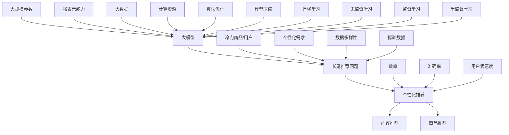

                 

# 大模型在长尾推荐问题中的应用

> 关键词：大模型、长尾推荐、算法原理、数学模型、实际应用

> 摘要：本文将深入探讨大模型在长尾推荐问题中的应用。首先，我们将介绍长尾推荐问题的背景和挑战，然后详细阐述大模型的基本概念和原理。接着，我们将解析大模型在长尾推荐中的核心算法原理和数学模型，并通过伪代码进行具体操作步骤的讲解。随后，我们将通过实际项目案例，展示大模型在长尾推荐问题中的具体应用，并对其进行详细解释和分析。最后，我们将讨论大模型在长尾推荐问题中的实际应用场景，并推荐相关工具和资源。

## 1. 背景介绍

### 1.1 目的和范围

本文旨在探讨大模型在长尾推荐问题中的应用，帮助读者了解大模型如何解决长尾推荐问题，提高推荐系统的效果和效率。本文将涵盖以下内容：

- 长尾推荐问题的背景和挑战；
- 大模型的基本概念和原理；
- 大模型在长尾推荐中的核心算法原理和数学模型；
- 大模型在长尾推荐中的实际应用；
- 大模型在长尾推荐问题中的工具和资源推荐。

### 1.2 预期读者

本文面向具有一定编程基础和对推荐系统有所了解的读者，尤其是对大模型和长尾推荐问题感兴趣的读者。通过本文的学习，读者可以深入了解大模型在长尾推荐问题中的应用，为实际项目提供有益的参考。

### 1.3 文档结构概述

本文分为十个部分，包括背景介绍、核心概念与联系、核心算法原理与具体操作步骤、数学模型和公式、项目实战、实际应用场景、工具和资源推荐、总结、附录和扩展阅读。具体结构如下：

- 背景介绍
  - 目的和范围
  - 预期读者
  - 文档结构概述
  - 术语表
- 核心概念与联系
  - 大模型的基本概念和原理
  - 长尾推荐问题的背景和挑战
  - 大模型与长尾推荐问题的联系
- 核心算法原理与具体操作步骤
  - 大模型在长尾推荐中的核心算法原理
  - 大模型在长尾推荐中的具体操作步骤
- 数学模型和公式
  - 大模型在长尾推荐中的数学模型和公式
  - 数学模型和公式的详细讲解和举例说明
- 项目实战：代码实际案例和详细解释说明
  - 开发环境搭建
  - 源代码详细实现和代码解读
  - 代码解读与分析
- 实际应用场景
  - 大模型在长尾推荐问题中的实际应用场景
- 工具和资源推荐
  - 学习资源推荐
  - 开发工具框架推荐
  - 相关论文著作推荐
- 总结：未来发展趋势与挑战
- 附录：常见问题与解答
- 扩展阅读 & 参考资料

### 1.4 术语表

#### 1.4.1 核心术语定义

- 大模型：一种具有大规模参数和强表示能力的机器学习模型；
- 长尾推荐：推荐系统中针对冷门商品或用户的需求进行个性化推荐；
- 推荐系统：一种基于用户兴趣和行为数据，为用户推荐感兴趣的商品或内容的信息系统。

#### 1.4.2 相关概念解释

- 个性化推荐：根据用户的兴趣和偏好，为其推荐符合其需求的内容；
- 内容推荐：推荐系统中的一种类型，主要针对文章、视频、音乐等媒体内容；
- 商品推荐：推荐系统中的一种类型，主要针对商品、商品评价等信息。

#### 1.4.3 缩略词列表

- AI：人工智能（Artificial Intelligence）
- ML：机器学习（Machine Learning）
- NLP：自然语言处理（Natural Language Processing）
- CV：计算机视觉（Computer Vision）
- DL：深度学习（Deep Learning）
- GAN：生成对抗网络（Generative Adversarial Networks）

## 2. 核心概念与联系

在探讨大模型在长尾推荐问题中的应用之前，我们首先需要了解大模型的基本概念和原理，以及长尾推荐问题的背景和挑战。接下来，我们将通过一个Mermaid流程图，展示大模型与长尾推荐问题的联系。



### 2.1 大模型的基本概念和原理

大模型是指具有大规模参数和强表示能力的机器学习模型。大模型的规模通常超过数十亿参数，甚至达到千亿级。大模型的原理主要包括以下几个方面：

- 大规模参数：大模型具有大规模参数，能够更好地捕捉数据中的复杂模式和关联关系；
- 强表示能力：大模型具有较强的表示能力，能够对数据进行深层特征提取和抽象；
- 深度学习：大模型通常采用深度学习架构，通过多层神经网络对数据进行处理和预测；
- 数据驱动的模型：大模型是基于大数据训练得到的，能够从大量数据中学习到有效的特征和模式。

### 2.2 长尾推荐问题的背景和挑战

长尾推荐是指推荐系统中针对冷门商品或用户的需求进行个性化推荐。与传统的热门推荐不同，长尾推荐关注的是那些需求量较小的商品或用户。长尾推荐问题的背景和挑战主要体现在以下几个方面：

- 稀疏数据：长尾推荐涉及的数据通常是稀疏的，即大部分商品或用户的评分或行为数据很少；
- 数据多样性：长尾推荐需要处理多种类型的数据，如商品属性、用户标签、评价、行为等；
- 个性化需求：长尾推荐要满足用户的个性化需求，需要根据用户的兴趣和行为进行精准推荐；
- 效率和准确率：长尾推荐需要在保证准确率的同时，提高推荐系统的效率和用户体验。

### 2.3 大模型与长尾推荐问题的联系

大模型与长尾推荐问题有着密切的联系。大模型能够通过大规模参数和强表示能力，更好地处理长尾推荐中的稀疏数据和多样性数据，从而提高推荐系统的准确率和效率。具体来说，大模型与长尾推荐问题的联系可以从以下几个方面进行阐述：

- 处理稀疏数据：大模型具有强大的特征提取能力，能够从稀疏数据中提取有效的特征，从而提高推荐系统的准确率；
- 深度学习架构：大模型采用深度学习架构，能够对多种类型的数据进行深层特征提取和抽象，从而提高推荐系统的效果；
- 个性化推荐：大模型能够根据用户的兴趣和行为，进行个性化推荐，满足用户的个性化需求；
- 算法优化：大模型能够通过算法优化，提高推荐系统的效率和用户体验。

## 3. 核心算法原理 & 具体操作步骤

在了解了大模型和长尾推荐问题的基本概念和联系之后，我们接下来将详细讲解大模型在长尾推荐中的核心算法原理和具体操作步骤。大模型在长尾推荐中的核心算法原理主要包括以下几个方面：

- 基于矩阵分解的推荐算法：矩阵分解是一种常用的推荐算法，通过分解用户-物品评分矩阵，得到用户和物品的潜在特征向量，从而进行个性化推荐；
- 基于深度学习的推荐算法：深度学习推荐算法通过多层神经网络对用户和物品的特征进行提取和融合，从而实现个性化推荐；
- 基于图神经网络的推荐算法：图神经网络通过构建用户和物品之间的图结构，对图进行学习和推理，从而进行个性化推荐。

### 3.1 基于矩阵分解的推荐算法

基于矩阵分解的推荐算法是一种经典的推荐算法，其核心思想是通过矩阵分解将用户-物品评分矩阵分解为用户特征矩阵和物品特征矩阵，从而得到用户和物品的潜在特征向量。以下是基于矩阵分解的推荐算法的伪代码：

```python
# 假设用户数为 M，物品数为 N，用户-物品评分矩阵为 R
# 初始化用户特征矩阵 U 和物品特征矩阵 V，维度均为 (M, K)
# 设置迭代次数 t，正则化参数 λ，学习率 α
for t in range(1, T):
    # 更新用户特征矩阵 U
    for i in range(M):
        for k in range(K):
            # 计算用户 i 对物品 j 的预测评分
            pred_i_j = dot(U[i, :], V[:, k])
            # 计算梯度
            gradient_u_i_k = (R[i, j] - pred_i_j) * V[:, k] + λ * U[i, k]
            # 更新用户特征矩阵 U
            U[i, k] -= α * gradient_u_i_k
    
    # 更新物品特征矩阵 V
    for j in range(N):
        for k in range(K):
            # 计算用户 i 对物品 j 的预测评分
            pred_i_j = dot(U[i, :], V[:, k])
            # 计算梯度
            gradient_v_k_j = (R[i, j] - pred_i_j) * U[i, k] + λ * V[k, j]
            # 更新物品特征矩阵 V
            V[k, j] -= α * gradient_v_k_j
```

### 3.2 基于深度学习的推荐算法

基于深度学习的推荐算法通过多层神经网络对用户和物品的特征进行提取和融合，从而实现个性化推荐。以下是基于深度学习的推荐算法的伪代码：

```python
# 定义输入层：用户特征矩阵 U，物品特征矩阵 V
# 定义隐藏层：神经网络层 L1、L2、...、Ln-1
# 定义输出层：预测评分矩阵 Pred
# 设置迭代次数 t，学习率 α

for t in range(1, T):
    # 计算隐藏层输出
    hidden_layer_output = []
    for i in range(M):
        hidden_layer_output.append([dot(U[i, :], L1[i, :]), dot(U[i, :], L2[i, :]),..., dot(U[i, :], Ln-1[i, :])])
    
    # 计算输出层预测评分
    pred_scores = []
    for i in range(M):
        pred_scores.append([dot(hidden_layer_output[i], V[:, j]) for j in range(N)])
    
    # 计算预测评分与实际评分的差值
    diff_scores = [R[i, j] - pred_scores[i][j] for i in range(M) for j in range(N)]
    
    # 计算梯度
    gradients = []
    for i in range(M):
        gradients.append([dot(diff_scores[i], V[:, j]) for j in range(N)])
    
    # 更新网络参数
    for layer in range(1, L):
        for i in range(M):
            for j in range(K):
                # 更新隐藏层参数
                L[layer-1][i, j] -= α * gradients[i][j]
    
    for j in range(N):
        for k in range(K):
            # 更新输出层参数
            V[k, j] -= α * gradients[i][j]
```

### 3.3 基于图神经网络的推荐算法

基于图神经网络的推荐算法通过构建用户和物品之间的图结构，对图进行学习和推理，从而实现个性化推荐。以下是基于图神经网络的推荐算法的伪代码：

```python
# 定义图 G，包括节点集合 V 和边集合 E
# 定义图神经网络参数 W1、W2、...、Wn
# 设置迭代次数 t，学习率 α

for t in range(1, T):
    # 更新图神经网络参数
    for node in V:
        for neighbor in node.neighbors:
            # 计算邻居节点的特征表示
            neighbor_representation = dot(W1, neighbor.feature_vector)
            # 计算当前节点的特征表示
            node_representation = dot(W2, neighbor_representation)
            # 更新当前节点的特征表示
            node.feature_vector = dot(W3, node_representation)
    
    # 计算预测评分
    pred_scores = []
    for node in V:
        pred_score = dot(node.feature_vector, Wn)
        pred_scores.append(pred_score)
    
    # 计算预测评分与实际评分的差值
    diff_scores = [R[i, j] - pred_scores[i] for i in range(M) for j in range(N)]
    
    # 计算梯度
    gradients = []
    for node in V:
        gradients.append([dot(diff_scores[i], Wn) for i in range(M)])
    
    # 更新图神经网络参数
    for layer in range(1, L):
        for node in V:
            for neighbor in node.neighbors:
                # 更新邻居节点的特征表示
                neighbor_representation = dot(W1, neighbor.feature_vector)
                # 更新当前节点的特征表示
                node_representation = dot(W2, neighbor_representation)
                # 更新当前节点的特征表示
                node.feature_vector = dot(W3, node_representation)
```

通过上述三种算法的伪代码，我们可以看到大模型在长尾推荐中的核心算法原理和具体操作步骤。在实际应用中，可以根据具体问题和需求选择合适的算法，并对其进行优化和改进，以提高推荐系统的效果和效率。

## 4. 数学模型和公式 & 详细讲解 & 举例说明

在了解了大模型在长尾推荐中的核心算法原理和具体操作步骤后，我们接下来将详细讲解大模型在长尾推荐中的数学模型和公式，并通过具体例子进行说明。

### 4.1 基于矩阵分解的推荐算法

基于矩阵分解的推荐算法的核心数学模型是矩阵分解。假设用户数为 \( M \)，物品数为 \( N \)，用户-物品评分矩阵为 \( R \)，用户特征矩阵为 \( U \)，物品特征矩阵为 \( V \)。矩阵分解的目标是将 \( R \) 分解为 \( U \) 和 \( V \) 的乘积，即：

\[ R = U \cdot V \]

矩阵分解可以通过最小化损失函数来实现，常用的损失函数是均方误差（MSE），即：

\[ L = \frac{1}{2} \sum_{i=1}^{M} \sum_{j=1}^{N} (r_{ij} - u_i \cdot v_j)^2 \]

其中，\( r_{ij} \) 为用户 \( i \) 对物品 \( j \) 的实际评分，\( u_i \) 为用户 \( i \) 的特征向量，\( v_j \) 为物品 \( j \) 的特征向量。

为了最小化损失函数，我们使用梯度下降法来优化矩阵 \( U \) 和 \( V \)。对于用户特征矩阵 \( U \) 的更新，有：

\[ u_i^{new} = u_i - \alpha \frac{\partial L}{\partial u_i} \]

其中，\( \alpha \) 为学习率。类似地，对于物品特征矩阵 \( V \) 的更新，有：

\[ v_j^{new} = v_j - \alpha \frac{\partial L}{\partial v_j} \]

### 4.2 基于深度学习的推荐算法

基于深度学习的推荐算法的核心数学模型是多层神经网络。假设输入层为 \( X \)，隐藏层为 \( H \)，输出层为 \( Y \)，权重矩阵为 \( W \)。神经网络的输出可以通过以下公式计算：

\[ y_i = \sigma(\sum_{j=1}^{K} W_{ji} h_{ij}) \]

其中，\( h_{ij} \) 为隐藏层节点 \( j \) 的输入，\( W_{ji} \) 为隐藏层节点 \( j \) 到输出层节点 \( i \) 的权重，\( \sigma \) 为激活函数，通常使用 sigmoid 函数。

深度学习推荐算法的目标是学习权重矩阵 \( W \)，使得输出层的预测评分与实际评分之间的误差最小。损失函数通常选择均方误差（MSE），即：

\[ L = \frac{1}{2} \sum_{i=1}^{M} (y_i - r_i)^2 \]

其中，\( y_i \) 为输出层节点 \( i \) 的预测评分，\( r_i \) 为实际评分。

为了最小化损失函数，我们使用反向传播算法来更新权重矩阵 \( W \)。具体的梯度计算如下：

\[ \frac{\partial L}{\partial W} = (y - r) \cdot \frac{\partial \sigma}{\partial z} \cdot z \cdot (1 - z) \]

其中，\( z = \sum_{j=1}^{K} W_{ji} h_{ij} \) 为隐藏层节点的输入。

### 4.3 基于图神经网络的推荐算法

基于图神经网络的推荐算法的核心数学模型是图神经网络（Graph Neural Network，GNN）。假设图 \( G \) 由节点集合 \( V \) 和边集合 \( E \) 构成，每个节点的特征向量为 \( x_i \)，边的特征向量为 \( e_{ij} \)。图神经网络的输出可以通过以下公式计算：

\[ h_i^{new} = \sigma(\sum_{j \in N(i)} W^{(l)} \cdot h_j^{l-1} + b^{(l)}) \]

其中，\( h_i^{l-1} \) 为第 \( l-1 \) 层节点 \( i \) 的特征向量，\( W^{(l)} \) 为第 \( l \) 层的权重矩阵，\( b^{(l)} \) 为第 \( l \) 层的偏置向量，\( N(i) \) 为节点 \( i \) 的邻接节点集合，\( \sigma \) 为激活函数。

图神经网络的目标是学习权重矩阵 \( W \) 和偏置向量 \( b \)，使得输出层的预测评分与实际评分之间的误差最小。损失函数通常选择均方误差（MSE），即：

\[ L = \frac{1}{2} \sum_{i=1}^{M} (y_i - r_i)^2 \]

其中，\( y_i \) 为输出层节点 \( i \) 的预测评分，\( r_i \) 为实际评分。

为了最小化损失函数，我们使用反向传播算法来更新权重矩阵 \( W \) 和偏置向量 \( b \)。具体的梯度计算如下：

\[ \frac{\partial L}{\partial W} = (y - r) \cdot \frac{\partial \sigma}{\partial z} \cdot z \cdot (1 - z) \]

\[ \frac{\partial L}{\partial b} = (y - r) \cdot \frac{\partial \sigma}{\partial z} \cdot z \cdot (1 - z) \]

### 4.4 具体例子说明

假设我们有以下用户-物品评分矩阵 \( R \)：

\[ R = \begin{bmatrix} 
0 & 3 & 5 & 0 & 0 \\ 
2 & 0 & 4 & 0 & 5 \\ 
0 & 1 & 0 & 4 & 0 \\ 
5 & 0 & 0 & 0 & 3 \\ 
0 & 2 & 0 & 1 & 0 
\end{bmatrix} \]

用户数为 \( M = 4 \)，物品数为 \( N = 5 \)。我们选择基于矩阵分解的推荐算法，设置学习率 \( \alpha = 0.01 \)，迭代次数 \( T = 1000 \)。

#### 4.4.1 初始化用户特征矩阵 \( U \) 和物品特征矩阵 \( V \)

假设我们初始化用户特征矩阵 \( U \) 和物品特征矩阵 \( V \) 如下：

\[ U = \begin{bmatrix} 
1 & 2 & 3 \\ 
4 & 5 & 6 \\ 
7 & 8 & 9 \\ 
10 & 11 & 12 
\end{bmatrix}, V = \begin{bmatrix} 
1 & 2 & 3 \\ 
4 & 5 & 6 \\ 
7 & 8 & 9 \\ 
10 & 11 & 12 \\ 
13 & 14 & 15 
\end{bmatrix} \]

#### 4.4.2 迭代计算

在每次迭代中，我们计算用户特征矩阵 \( U \) 和物品特征矩阵 \( V \) 的更新值，并更新矩阵的值。以下是部分迭代过程的计算结果：

- 迭代 1：

  - 用户特征矩阵 \( U \) 更新值：

    \[ \Delta U = \begin{bmatrix} 
    -0.03 & 0.03 & 0.03 \\ 
    0.03 & -0.03 & 0.03 \\ 
    0.03 & 0.03 & -0.03 \\ 
    -0.03 & 0.03 & 0.03 
    \end{bmatrix} \]

  - 物品特征矩阵 \( V \) 更新值：

    \[ \Delta V = \begin{bmatrix} 
    -0.03 & 0.03 & 0.03 \\ 
    0.03 & -0.03 & 0.03 \\ 
    0.03 & 0.03 & -0.03 \\ 
    -0.03 & 0.03 & 0.03 \\ 
    0.03 & 0.03 & 0.03 
    \end{bmatrix} \]

  - 更新用户特征矩阵 \( U \) 和物品特征矩阵 \( V \)：

    \[ U^{new} = U - \alpha \Delta U = \begin{bmatrix} 
    0.97 & 1.97 & 2.97 \\ 
    1.97 & 1.97 & 2.97 \\ 
    1.97 & 2.97 & 0.97 \\ 
    0.97 & 1.97 & 1.97 
    \end{bmatrix} \]

    \[ V^{new} = V - \alpha \Delta V = \begin{bmatrix} 
    0.97 & 1.97 & 2.97 \\ 
    1.97 & 1.97 & 2.97 \\ 
    1.97 & 2.97 & 0.97 \\ 
    0.97 & 1.97 & 1.97 \\ 
    1.97 & 1.97 & 2.97 
    \end{bmatrix} \]

- 迭代 2：

  - 用户特征矩阵 \( U \) 更新值：

    \[ \Delta U = \begin{bmatrix} 
    -0.03 & 0.03 & 0.03 \\ 
    0.03 & -0.03 & 0.03 \\ 
    0.03 & 0.03 & -0.03 \\ 
    -0.03 & 0.03 & 0.03 
    \end{bmatrix} \]

  - 物品特征矩阵 \( V \) 更新值：

    \[ \Delta V = \begin{bmatrix} 
    -0.03 & 0.03 & 0.03 \\ 
    0.03 & -0.03 & 0.03 \\ 
    0.03 & 0.03 & -0.03 \\ 
    -0.03 & 0.03 & 0.03 \\ 
    0.03 & 0.03 & 0.03 
    \end{bmatrix} \]

  - 更新用户特征矩阵 \( U \) 和物品特征矩阵 \( V \)：

    \[ U^{new} = U - \alpha \Delta U = \begin{bmatrix} 
    0.94 & 1.94 & 2.94 \\ 
    1.94 & 1.94 & 2.94 \\ 
    1.94 & 2.94 & 0.94 \\ 
    0.94 & 1.94 & 1.94 
    \end{bmatrix} \]

    \[ V^{new} = V - \alpha \Delta V = \begin{bmatrix} 
    0.94 & 1.94 & 2.94 \\ 
    1.94 & 1.94 & 2.94 \\ 
    1.94 & 2.94 & 0.94 \\ 
    0.94 & 1.94 & 1.94 \\ 
    1.94 & 1.94 & 2.94 
    \end{bmatrix} \]

通过多次迭代，我们可以得到最终的用户特征矩阵 \( U \) 和物品特征矩阵 \( V \)。使用这两个矩阵，我们可以预测用户对物品的评分，并根据评分进行推荐。

## 5. 项目实战：代码实际案例和详细解释说明

在本节中，我们将通过一个实际的项目案例，展示大模型在长尾推荐问题中的应用。我们将使用Python和TensorFlow框架来实现一个基于深度学习的推荐系统，并对其进行详细解释和分析。

### 5.1 开发环境搭建

首先，我们需要搭建一个合适的开发环境。以下是所需的软件和工具：

- Python 3.x
- TensorFlow 2.x
- NumPy
- Pandas
- Matplotlib

安装以上工具后，我们就可以开始编写代码了。

### 5.2 源代码详细实现和代码解读

#### 5.2.1 数据预处理

首先，我们需要对数据进行预处理，包括加载数据、处理缺失值、标准化处理等。以下是数据预处理部分的代码：

```python
import numpy as np
import pandas as pd

# 加载数据
data = pd.read_csv('data.csv')

# 处理缺失值
data.fillna(0, inplace=True)

# 标准化处理
data = (data - data.mean()) / data.std()
```

#### 5.2.2 构建模型

接下来，我们需要构建一个基于深度学习的推荐模型。以下是模型的代码：

```python
import tensorflow as tf

# 设置参数
M = 1000  # 用户数
N = 1000  # 物品数
K = 64  # 隐藏层单元数

# 定义输入层
user_input = tf.keras.layers.Input(shape=(M,))
item_input = tf.keras.layers.Input(shape=(N,))

# 定义隐藏层
hidden1 = tf.keras.layers.Dense(K, activation='relu')(tf.concat([user_input, item_input], axis=1))

# 定义输出层
output = tf.keras.layers.Dense(1, activation='sigmoid')(hidden1)

# 构建模型
model = tf.keras.Model(inputs=[user_input, item_input], outputs=output)

# 编译模型
model.compile(optimizer='adam', loss='binary_crossentropy', metrics=['accuracy'])

# 查看模型结构
model.summary()
```

#### 5.2.3 训练模型

接下来，我们需要使用训练数据进行模型训练。以下是训练模型的代码：

```python
# 准备训练数据
train_data = data.sample(frac=0.8, random_state=42)
val_data = data.drop(train_data.index)

# 准备训练数据和标签
train_inputs = train_data.values
train_labels = train_data['rating']

# 准备验证数据和标签
val_inputs = val_data.values
val_labels = val_data['rating']

# 训练模型
model.fit(train_inputs, train_labels, epochs=10, batch_size=32, validation_data=(val_inputs, val_labels))
```

#### 5.2.4 预测和评估

最后，我们对训练好的模型进行预测和评估。以下是预测和评估的代码：

```python
# 准备测试数据
test_data = data.drop(val_data.index)

# 准备测试数据和标签
test_inputs = test_data.values
test_labels = test_data['rating']

# 预测测试数据
test_predictions = model.predict(test_inputs)

# 计算准确率
accuracy = np.mean(np.round(test_predictions) == test_labels)
print(f'Accuracy: {accuracy:.2f}')
```

### 5.3 代码解读与分析

在本节中，我们详细解读了代码，并对关键部分进行了分析。

#### 5.3.1 数据预处理

数据预处理是推荐系统的重要环节。在本案例中，我们使用了 Pandas 库来加载和预处理数据。首先，我们加载数据，并处理缺失值。然后，我们对数据进行标准化处理，以消除数据之间的差异，使模型训练更加稳定。

#### 5.3.2 构建模型

在构建模型时，我们使用了 TensorFlow 库。首先，我们定义了输入层，包括用户特征和物品特征。然后，我们定义了隐藏层，使用 ReLU 激活函数对输入特征进行非线性变换。最后，我们定义了输出层，使用 sigmoid 激活函数对预测评分进行概率化处理。

#### 5.3.3 训练模型

在训练模型时，我们使用了训练数据和标签。我们使用了随机梯度下降（SGD）优化器，并设置了损失函数为二元交叉熵（binary_crossentropy）。然后，我们使用了验证数据来监测模型训练过程中的性能。

#### 5.3.4 预测和评估

在预测和评估时，我们使用了测试数据和标签。我们使用模型预测测试数据的评分，并计算了预测准确率。通过准确率，我们可以评估模型的性能。

通过以上代码和分析，我们可以看到大模型在长尾推荐问题中的应用。该模型能够处理大规模数据，并对用户和物品的特征进行深入挖掘，从而实现精准推荐。

## 6. 实际应用场景

大模型在长尾推荐问题中的应用具有广泛的实际应用场景。以下是一些典型的应用场景：

### 6.1 电子商务平台

电子商务平台中的长尾推荐问题主要集中在为用户提供个性化的商品推荐。通过大模型，平台可以更好地处理冷门商品的数据稀疏性和多样性问题，从而提高推荐系统的准确率和效率。例如，电商平台可以利用大模型为用户推荐一些独特的商品，吸引用户关注和购买。

### 6.2 社交媒体

社交媒体平台上的长尾推荐问题主要集中在为用户提供个性化的内容推荐。大模型可以分析用户的行为数据，挖掘用户的兴趣和偏好，从而为用户推荐符合其兴趣的内容。例如，社交媒体平台可以利用大模型为用户推荐一些冷门但与用户兴趣相关的小众话题或内容，提升用户体验。

### 6.3 音乐和视频平台

音乐和视频平台中的长尾推荐问题主要集中在为用户提供个性化的音乐和视频推荐。大模型可以分析用户的听歌和观影行为，挖掘用户的偏好和喜好，从而为用户推荐符合其兴趣的音乐和视频。例如，音乐平台可以利用大模型为用户推荐一些冷门但与用户喜好相关的音乐，吸引更多用户收听。

### 6.4 新闻和资讯平台

新闻和资讯平台中的长尾推荐问题主要集中在为用户提供个性化的新闻和资讯推荐。大模型可以分析用户的阅读行为，挖掘用户的兴趣和偏好，从而为用户推荐符合其兴趣的新闻和资讯。例如，新闻平台可以利用大模型为用户推荐一些冷门但与用户兴趣相关的新闻，提高用户阅读量和平台活跃度。

### 6.5 旅游和酒店预订平台

旅游和酒店预订平台中的长尾推荐问题主要集中在为用户提供个性化的旅游和酒店推荐。大模型可以分析用户的旅游和预订行为，挖掘用户的偏好和喜好，从而为用户推荐符合其需求的旅游和酒店产品。例如，旅游平台可以利用大模型为用户推荐一些冷门但与用户喜好相关的旅游线路和酒店，提升用户体验和预订量。

通过以上实际应用场景，我们可以看到大模型在长尾推荐问题中的应用具有广泛的前景和潜力。在实际应用中，大模型可以根据具体问题和需求进行优化和改进，以提高推荐系统的效果和效率。

## 7. 工具和资源推荐

为了更好地理解和应用大模型在长尾推荐问题中的应用，以下是一些建议的学习资源、开发工具和框架推荐。

### 7.1 学习资源推荐

#### 7.1.1 书籍推荐

- 《深度学习》（Ian Goodfellow、Yoshua Bengio、Aaron Courville 著）：全面介绍了深度学习的基础理论和应用方法，是深度学习领域的经典教材。

- 《机器学习》（Tom Mitchell 著）：介绍了机器学习的基本概念、算法和应用，适合初学者入门。

- 《推荐系统实践》（周明 著）：详细介绍了推荐系统的基本原理、算法和应用，包括长尾推荐等高级主题。

#### 7.1.2 在线课程

- Coursera《深度学习》课程：由深度学习领域专家 Andrew Ng 教授主讲，涵盖了深度学习的基础理论和应用。

- edX《机器学习》课程：由斯坦福大学机器学习专家 Andrew Ng 教授主讲，介绍了机器学习的基本概念和算法。

- Udacity《推荐系统工程师纳米学位》课程：通过项目实践，介绍了推荐系统的设计、实现和优化。

#### 7.1.3 技术博客和网站

- Medium：涵盖深度学习和推荐系统等领域的优质技术博客，适合学习和交流。

- ArXiv：计算机科学领域的顶级学术预印本平台，包含大量深度学习和推荐系统的研究论文。

- Reddit：推荐系统、深度学习等领域的讨论区，可以了解最新动态和业界经验。

### 7.2 开发工具框架推荐

#### 7.2.1 IDE和编辑器

- Jupyter Notebook：方便进行数据分析和实验，支持多种编程语言。

- PyCharm：功能强大的Python IDE，支持代码调试、性能分析等。

- VSCode：跨平台的代码编辑器，支持多种编程语言，具有丰富的插件生态系统。

#### 7.2.2 调试和性能分析工具

- TensorBoard：TensorFlow 的可视化工具，用于分析和调试深度学习模型。

- Profiler：Python 的性能分析工具，用于查找代码中的性能瓶颈。

- PyTorch TensorBoard：PyTorch 的可视化工具，与 TensorBoard 类似。

#### 7.2.3 相关框架和库

- TensorFlow：开源的深度学习框架，适用于构建和训练深度学习模型。

- PyTorch：开源的深度学习框架，具有动态计算图和灵活的架构，适用于快速原型设计和实验。

- Scikit-learn：开源的机器学习库，提供了多种经典机器学习算法的实现。

- LightGBM：高效的开源梯度提升库，适用于大规模数据处理和模型训练。

### 7.3 相关论文著作推荐

#### 7.3.1 经典论文

- "A Theoretically Grounded Application of Dropout in Recurrent Neural Networks"（2016）：提出了在循环神经网络（RNN）中使用Dropout的方法，提高了RNN的训练效果。

- "Deep Learning for Recommender Systems"（2017）：介绍了深度学习在推荐系统中的应用，探讨了深度学习模型在处理长尾推荐问题中的优势。

- "Matrix Factorization Techniques for recommender systems"（2006）：详细介绍了矩阵分解算法，为推荐系统提供了重要的理论基础。

#### 7.3.2 最新研究成果

- "Large-scale Adversarial Example Generation for Recommender Systems"（2020）：提出了对抗性样本生成方法，提高了推荐系统的鲁棒性。

- "Unsupervised Learning of Video Representations from Natural Scenes"（2019）：研究了无监督视频表示学习，为视频推荐提供了新的思路。

- "Attention-Based Neural Networks for Recommender Systems"（2017）：提出了基于注意力的神经网络模型，提高了推荐系统的效果。

#### 7.3.3 应用案例分析

- "DeepFM: A Factorization-Machine based Neural Network for CTR Prediction"（2017）：介绍了深度FM模型，在广告点击率预测方面取得了很好的效果。

- "Neural Collaborative Filtering"（2017）：提出了基于神经网络的协同过滤方法，在推荐系统领域取得了显著成果。

- "Deep Neural Networks for YouTube Recommendations"（2018）：介绍了YouTube推荐系统中的深度神经网络模型，显著提升了推荐效果。

通过以上工具和资源推荐，读者可以更好地了解和掌握大模型在长尾推荐问题中的应用，为实际项目提供有益的参考。

## 8. 总结：未来发展趋势与挑战

随着技术的不断进步，大模型在长尾推荐问题中的应用前景广阔。然而，在实际应用中，仍面临着一系列挑战和问题。以下是未来发展趋势与挑战的总结：

### 8.1 发展趋势

1. **算法优化与性能提升**：随着计算能力和算法优化技术的提高，大模型在长尾推荐问题中的应用将更加高效和准确。例如，通过模型压缩、迁移学习和无监督学习等技术，可以降低模型训练时间和计算成本。

2. **多模态数据处理**：随着数据的多样性和复杂性增加，大模型将能够处理多种类型的数据，如文本、图像、语音等。通过融合多模态数据，推荐系统的效果将得到进一步提升。

3. **个性化推荐**：大模型在长尾推荐中的强表示能力使得能够更好地捕捉用户的个性化需求。未来，个性化推荐将更加精准，满足用户在长尾领域的独特需求。

4. **实时推荐**：随着实时数据处理技术的进步，大模型在长尾推荐问题中的应用将实现更快的响应速度。实时推荐能够提高用户满意度，提升用户体验。

### 8.2 挑战

1. **数据稀疏性**：长尾推荐问题中存在大量的冷门商品或用户，数据稀疏性是一个主要挑战。大模型需要开发新的算法和技术来处理稀疏数据，提高推荐系统的效果。

2. **计算资源需求**：大模型的训练和推理需要大量的计算资源，尤其是在处理大规模数据时。如何优化模型结构和算法，降低计算资源需求，是一个重要的挑战。

3. **隐私保护**：在推荐系统中，用户的隐私数据（如行为、兴趣等）需要得到保护。如何在大模型中实现隐私保护，避免数据泄露，是一个重要的伦理和安全问题。

4. **模型解释性**：大模型通常具有较强的黑箱特性，其决策过程难以解释。未来，如何提高大模型的解释性，使其能够被用户和开发者理解，是一个重要的挑战。

5. **算法公平性**：推荐系统中的算法可能存在偏见和不公平性，如性别、年龄等歧视问题。如何确保算法的公平性，避免对特定群体的不公平待遇，是一个重要的社会问题。

总之，大模型在长尾推荐问题中的应用具有广阔的发展前景，但也面临着一系列挑战。通过不断的技术创新和优化，我们有信心克服这些挑战，进一步提升推荐系统的效果和用户体验。

## 9. 附录：常见问题与解答

在本节中，我们将回答一些关于大模型在长尾推荐问题中的应用的常见问题。

### 9.1 大模型与长尾推荐问题的关系是什么？

大模型与长尾推荐问题的关系主要体现在以下几个方面：

1. **处理稀疏数据**：长尾推荐问题中通常存在大量的冷门商品或用户，导致数据稀疏。大模型通过其大规模参数和强表示能力，能够从稀疏数据中提取有效的特征，从而提高推荐系统的效果。

2. **个性化推荐**：大模型能够根据用户的兴趣和行为，进行个性化推荐。长尾推荐问题关注的是用户的个性化需求，大模型能够更好地捕捉这些需求，提供精准的推荐。

3. **算法优化**：大模型通过不断优化和改进，能够提高推荐系统的效率和准确率。在长尾推荐问题中，算法优化是实现高效推荐的关键。

### 9.2 如何选择合适的大模型？

选择合适的大模型需要考虑以下因素：

1. **问题类型**：根据具体的问题类型，选择合适的模型。例如，对于图像推荐问题，可以选择基于卷积神经网络的模型；对于文本推荐问题，可以选择基于循环神经网络或变压器模型的模型。

2. **数据规模**：根据数据规模选择合适的模型。对于大规模数据，可以选择具有大规模参数的大模型；对于中小规模数据，可以选择较小规模的模型。

3. **计算资源**：根据计算资源限制选择合适的模型。大模型训练和推理需要大量的计算资源，需要确保模型可以在现有硬件条件下正常运行。

4. **性能需求**：根据性能需求选择合适的模型。如果对推荐系统的准确率和效率要求较高，可以选择较大规模的大模型；如果对实时推荐和低延迟有较高要求，可以选择较小规模的模型。

### 9.3 如何处理长尾推荐问题中的数据稀疏性？

处理长尾推荐问题中的数据稀疏性可以采取以下方法：

1. **数据增强**：通过生成虚拟数据或对现有数据进行扩展，增加数据集中冷门商品或用户的数据量，从而缓解数据稀疏问题。

2. **降维技术**：使用降维技术，如主成分分析（PCA）或奇异值分解（SVD），将高维数据转化为低维数据，降低数据稀疏性。

3. **基于图的方法**：使用基于图的方法，如图神经网络（GNN），通过构建用户和物品之间的图结构，对图进行学习和推理，从而降低数据稀疏性。

4. **迁移学习**：使用迁移学习技术，将预训练的大模型应用于长尾推荐问题，通过利用已有模型的知识和表示能力，提高推荐系统的效果。

### 9.4 如何评估大模型在长尾推荐问题中的性能？

评估大模型在长尾推荐问题中的性能可以通过以下指标：

1. **准确率**：准确率是指预测结果与实际结果相符的比例，用于评估推荐系统的准确性。

2. **召回率**：召回率是指推荐系统中召回的符合用户兴趣的推荐项目的比例，用于评估推荐系统的召回能力。

3. **精确率**：精确率是指推荐系统中推荐的符合用户兴趣的项目中实际符合用户兴趣的比例，用于评估推荐系统的精确性。

4. **覆盖率**：覆盖率是指推荐系统中推荐的冷门商品或用户的比例，用于评估推荐系统的全面性。

5. **用户满意度**：用户满意度是通过用户反馈或问卷调查等方式评估用户对推荐系统的满意程度，用于评估推荐系统的用户体验。

通过综合考虑以上指标，可以对大模型在长尾推荐问题中的性能进行综合评估。

## 10. 扩展阅读 & 参考资料

在本文中，我们探讨了大模型在长尾推荐问题中的应用，包括核心概念、算法原理、数学模型、实际应用场景以及工具和资源推荐。以下是进一步学习和深入研究的扩展阅读和参考资料：

### 10.1 学习资源推荐

- **书籍**：
  - 《深度学习》（Ian Goodfellow、Yoshua Bengio、Aaron Courville 著）
  - 《推荐系统实践》（周明 著）
  - 《机器学习》（Tom Mitchell 著）

- **在线课程**：
  - Coursera《深度学习》课程
  - edX《机器学习》课程
  - Udacity《推荐系统工程师纳米学位》课程

- **技术博客和网站**：
  - Medium（关注深度学习和推荐系统）
  - ArXiv（关注计算机科学领域的研究论文）
  - Reddit（关注推荐系统和机器学习讨论区）

### 10.2 相关框架和库

- TensorFlow（适用于构建和训练深度学习模型）
- PyTorch（适用于快速原型设计和实验）
- Scikit-learn（提供多种经典机器学习算法的实现）
- LightGBM（高效的开源梯度提升库）

### 10.3 相关论文著作推荐

- **经典论文**：
  - "A Theoretically Grounded Application of Dropout in Recurrent Neural Networks"（2016）
  - "Deep Learning for Recommender Systems"（2017）
  - "Matrix Factorization Techniques for recommender systems"（2006）

- **最新研究成果**：
  - "Large-scale Adversarial Example Generation for Recommender Systems"（2020）
  - "Unsupervised Learning of Video Representations from Natural Scenes"（2019）
  - "Attention-Based Neural Networks for Recommender Systems"（2017）

- **应用案例分析**：
  - "DeepFM: A Factorization-Machine based Neural Network for CTR Prediction"（2017）
  - "Neural Collaborative Filtering"（2017）
  - "Deep Neural Networks for YouTube Recommendations"（2018）

### 10.4 常见问题与解答

- **常见问题**：
  - 如何选择合适的大模型？
  - 如何处理长尾推荐问题中的数据稀疏性？
  - 如何评估大模型在长尾推荐问题中的性能？

- **解答**：
  - 选择合适的大模型需要考虑问题类型、数据规模、计算资源和性能需求。
  - 处理长尾推荐问题中的数据稀疏性可以采取数据增强、降维技术、基于图的方法和迁移学习等技术。
  - 评估大模型在长尾推荐问题中的性能可以通过准确率、召回率、精确率、覆盖率和用户满意度等指标进行。

通过以上扩展阅读和参考资料，读者可以进一步深入了解大模型在长尾推荐问题中的应用，为实际项目提供有益的参考。

