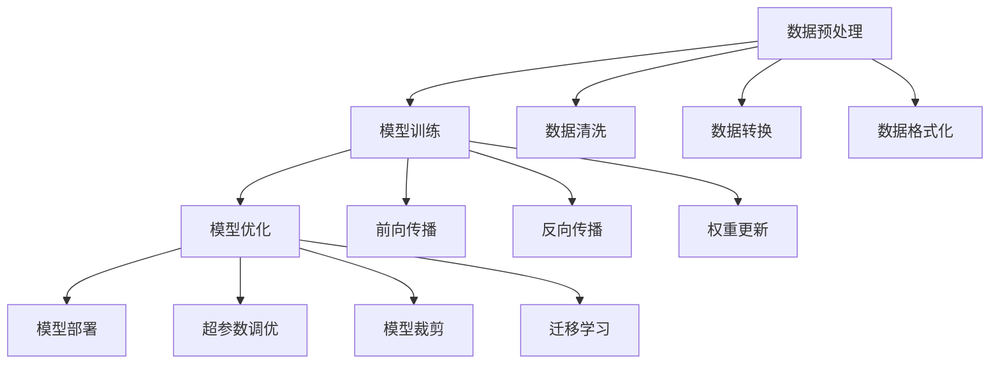

                 

### 1. 背景介绍

#### 1.1 目的和范围

本文旨在深入探讨大模型定制开发服务的商业化之路。随着人工智能技术的飞速发展，大模型技术在各个领域的应用越来越广泛，从语音识别、图像处理到自然语言处理，大模型在提升计算效率和准确度方面发挥了至关重要的作用。然而，如何将这些先进技术商业化，成为企业和社会关注的焦点。

本文将围绕以下几个核心问题展开讨论：

1. **大模型定制开发服务的市场需求和增长潜力**：分析当前大模型定制开发服务的市场需求，探讨其增长潜力。
2. **大模型定制开发服务的商业模式**：介绍几种常见的商业模式，并分析它们的优缺点。
3. **大模型定制开发服务的核心技术和挑战**：探讨大模型开发过程中的关键技术，如数据预处理、模型训练和优化等，以及面临的挑战。
4. **案例研究**：通过实际案例，展示大模型定制开发服务的应用和实践。
5. **未来发展趋势与挑战**：预测大模型定制开发服务的未来发展趋势，并分析可能面临的挑战。

#### 1.2 预期读者

本文预期读者包括：

1. **人工智能领域的研究者和开发者**：希望深入了解大模型定制开发服务的技术原理和商业化路径。
2. **企业决策者和创业者**：关注人工智能商业化，希望了解如何利用大模型技术创造商业价值。
3. **学生和学者**：对人工智能和计算机科学有兴趣，希望掌握相关领域的最新动态。

#### 1.3 文档结构概述

本文结构如下：

1. **背景介绍**：介绍大模型定制开发服务的商业化背景和目的。
2. **核心概念与联系**：介绍大模型定制开发服务的基本概念和原理。
3. **核心算法原理 & 具体操作步骤**：详细阐述大模型定制开发服务的算法原理和操作步骤。
4. **数学模型和公式 & 详细讲解 & 举例说明**：介绍大模型定制开发服务所涉及的数学模型和公式，并通过实际例子进行详细说明。
5. **项目实战：代码实际案例和详细解释说明**：通过实际代码案例展示大模型定制开发服务的应用。
6. **实际应用场景**：探讨大模型定制开发服务在不同领域的应用。
7. **工具和资源推荐**：推荐学习资源、开发工具和框架。
8. **总结：未来发展趋势与挑战**：总结本文内容，预测未来发展趋势和挑战。
9. **附录：常见问题与解答**：回答读者可能关注的问题。
10. **扩展阅读 & 参考资料**：提供相关领域的深入阅读材料。

#### 1.4 术语表

在本文中，我们将使用以下术语：

- **大模型（Large Model）**：指具有数亿甚至数十亿参数的深度学习模型，如GPT-3、BERT等。
- **定制开发服务**：根据客户需求，开发和优化特定的大模型，以满足特定应用场景的需求。
- **商业模式**：企业通过提供大模型定制开发服务获取收入和利润的方式。
- **数据预处理**：在大模型训练之前，对原始数据进行清洗、转换和格式化，以提高模型训练效果。
- **模型训练和优化**：通过迭代训练和调优，提高大模型的性能和准确性。
- **商业化**：将技术转化为商业产品或服务，实现商业价值。

#### 1.4.1 核心术语定义

1. **大模型（Large Model）**：大模型是指参数规模达到数亿甚至数十亿的深度学习模型。这类模型由于参数数量庞大，能够在处理复杂任务时具有更高的准确度和效率。例如，GPT-3是一个拥有1750亿参数的预训练模型，可以在自然语言处理任务中表现出色。
   
2. **定制开发服务**：定制开发服务是指根据客户特定的需求，开发和优化特定的大模型，以满足其业务需求。定制开发服务通常涉及数据预处理、模型训练、模型优化和部署等多个环节。

3. **商业模式**：商业模式是指企业通过提供产品或服务获取收入和利润的方式。在大模型定制开发服务的背景下，常见的商业模式包括订阅模式、项目制模式、联合开发模式等。

4. **数据预处理**：数据预处理是指在大模型训练之前，对原始数据进行清洗、转换和格式化，以提高模型训练效果。数据预处理包括数据清洗（去除噪声、缺失值处理）、数据转换（数据归一化、标准化）和数据格式化（数据切片、数据增强）等步骤。

5. **模型训练和优化**：模型训练和优化是指通过迭代训练和调优，提高大模型的性能和准确性。模型训练包括前向传播、反向传播和权重更新等步骤，而模型优化则涉及超参数调优、模型裁剪和迁移学习等技术。

6. **商业化**：商业化是指将技术转化为商业产品或服务，实现商业价值。在大模型定制开发服务的背景下，商业化意味着将大模型技术应用到实际业务场景中，为企业创造收益。

#### 1.4.2 相关概念解释

1. **深度学习**：深度学习是一种人工智能的分支，它通过多层神经网络模拟人类大脑的神经元结构，实现对数据的自动学习和特征提取。深度学习在图像识别、语音识别、自然语言处理等任务中取得了显著成果。

2. **自然语言处理（NLP）**：自然语言处理是人工智能的一个重要分支，旨在使计算机能够理解和处理人类语言。NLP技术包括文本分类、情感分析、机器翻译、文本生成等。

3. **预训练模型**：预训练模型是在大规模语料库上预先训练的模型，如GPT-3、BERT等。这些模型通过在大规模数据上进行预训练，积累了丰富的语言知识和理解能力，可以用于各种自然语言处理任务。

4. **迁移学习**：迁移学习是一种利用预训练模型进行新任务训练的方法。通过迁移学习，可以将预训练模型在特定任务上的知识转移到新的任务上，从而提高模型在新任务上的性能。

5. **模型裁剪**：模型裁剪是一种通过减少模型参数数量来降低模型复杂度和计算成本的技术。模型裁剪可以采用剪枝、量化、知识蒸馏等方法，以提高模型在资源受限环境中的应用能力。

#### 1.4.3 缩略词列表

- **AI**：人工智能
- **DL**：深度学习
- **NLP**：自然语言处理
- **GPT-3**：生成预训练变换模型3
- **BERT**：双向编码表示器
- **NLP**：自然语言处理
- **GAN**：生成对抗网络
- **CNN**：卷积神经网络
- **RNN**：循环神经网络
- **TF**：TensorFlow
- **PyTorch**：PyTorch

---

通过上述背景介绍，我们初步了解了大模型定制开发服务的商业化背景、预期读者、文档结构、核心术语和相关概念。接下来，我们将进一步探讨大模型定制开发服务的基本概念和原理，以便为后续内容打下坚实的基础。

### 2. 核心概念与联系

在探讨大模型定制开发服务的商业化之前，我们需要先了解其核心概念和原理。大模型定制开发服务涉及多个关键环节，包括数据预处理、模型训练、模型优化和部署等。本节将通过一个Mermaid流程图（如图1所示），详细展示大模型定制开发服务的基本架构和流程。



#### 数据预处理

数据预处理是整个大模型定制开发服务的第一步，其目标是将原始数据转换成适合模型训练的格式。数据预处理包括以下几个主要步骤：

1. **数据清洗**：去除数据中的噪声和异常值，如缺失值、重复值和错误值。
2. **数据转换**：将数据从一种格式转换成另一种格式，如将文本数据转换为词向量。
3. **数据格式化**：将数据分成训练集、验证集和测试集，以便在后续的训练过程中进行评估。

#### 模型训练

模型训练是整个流程的核心环节，其目标是通过不断调整模型参数，使模型能够在给定数据集上达到较高的准确度和性能。模型训练包括以下几个主要步骤：

1. **前向传播**：将输入数据通过模型的前向传播过程，计算模型的输出。
2. **反向传播**：根据模型的输出和真实标签，通过反向传播算法计算损失函数，并更新模型参数。
3. **权重更新**：根据损失函数的梯度，对模型参数进行更新，以减少模型损失。

#### 模型优化

模型优化是在模型训练的基础上，进一步提高模型性能的过程。模型优化包括以下几个主要步骤：

1. **超参数调优**：通过调整模型参数，如学习率、批量大小和正则化参数，以提高模型性能。
2. **模型裁剪**：通过减少模型参数数量，降低模型复杂度和计算成本，从而提高模型在资源受限环境中的应用能力。
3. **迁移学习**：通过将预训练模型的知识迁移到新任务上，提高模型在新任务上的性能。

#### 模型部署

模型部署是将训练好的模型应用到实际业务场景的过程。模型部署包括以下几个主要步骤：

1. **模型转换**：将训练好的模型转换为可以在生产环境中运行的格式，如TensorFlow Lite、ONNX等。
2. **模型部署**：将模型部署到生产环境，如服务器、边缘设备或云平台。
3. **模型监控与维护**：对部署后的模型进行监控和评估，并根据实际情况进行维护和更新。

通过上述Mermaid流程图和详细说明，我们清晰地展示了大模型定制开发服务的基本概念和原理。接下来，我们将进一步探讨大模型定制开发服务的核心算法原理和具体操作步骤。

### 3. 核心算法原理 & 具体操作步骤

在大模型定制开发服务中，核心算法原理和具体操作步骤至关重要。以下将详细阐述这些内容，并使用伪代码来展示算法原理。

#### 数据预处理

数据预处理是整个大模型定制开发服务的第一步，其目的是将原始数据转换成适合模型训练的格式。以下是一个数据预处理算法的伪代码：

```python
def preprocess_data(data):
    # 数据清洗
    cleaned_data = remove_noise(data)

    # 数据转换
    converted_data = convert_format(cleaned_data)

    # 数据格式化
    formatted_data = format_data(converted_data)

    return formatted_data
```

- `remove_noise(data)`: 清洗数据中的噪声和异常值，如缺失值、重复值和错误值。
- `convert_format(cleaned_data)`: 将数据从一种格式转换成另一种格式，如将文本数据转换为词向量。
- `format_data(converted_data)`: 将数据分成训练集、验证集和测试集。

#### 模型训练

模型训练是整个大模型定制开发服务的核心环节，其目的是通过不断调整模型参数，使模型能够在给定数据集上达到较高的准确度和性能。以下是一个模型训练算法的伪代码：

```python
def train_model(model, data, epochs):
    for epoch in range(epochs):
        for batch in data:
            # 前向传播
            output = model.forward(batch.input)

            # 反向传播
            loss = compute_loss(output, batch.label)

            # 权重更新
            model.update_weights(loss)

        print(f"Epoch {epoch}: Loss = {loss}")
```

- `model.forward(batch.input)`: 前向传播，计算模型的输出。
- `compute_loss(output, batch.label)`: 计算损失函数，衡量模型输出与真实标签之间的差距。
- `model.update_weights(loss)`: 根据损失函数的梯度，更新模型参数。

#### 模型优化

模型优化是在模型训练的基础上，进一步提高模型性能的过程。以下是一个模型优化算法的伪代码：

```python
def optimize_model(model, data, epochs):
    for epoch in range(epochs):
        for batch in data:
            # 前向传播
            output = model.forward(batch.input)

            # 反向传播
            loss = compute_loss(output, batch.label)

            # 超参数调优
            model.tune_hyperparameters(loss)

            # 模型裁剪
            model.prune_model()

            # 迁移学习
            model.transfer_learning()

        print(f"Epoch {epoch}: Loss = {loss}")
```

- `model.tune_hyperparameters(loss)`: 根据损失函数的值，调整模型超参数，如学习率、批量大小和正则化参数。
- `model.prune_model()`: 通过剪枝、量化、知识蒸馏等方法，减少模型参数数量。
- `model.transfer_learning()`: 通过迁移学习，将预训练模型的知识迁移到新任务上。

#### 模型部署

模型部署是将训练好的模型应用到实际业务场景的过程。以下是一个模型部署算法的伪代码：

```python
def deploy_model(model, environment):
    # 模型转换
    converted_model = convert_format(model)

    # 模型部署
    deployed_model = deploy_to_environment(converted_model, environment)

    # 模型监控与维护
    monitor_model(deployed_model)

def convert_format(model):
    # 将训练好的模型转换为可以在生产环境中运行的格式
    return convert_to_format(model)

def deploy_to_environment(model, environment):
    # 将模型部署到生产环境
    return deploy_model_to_environment(model, environment)

def monitor_model(model):
    # 对部署后的模型进行监控和评估
    monitor_model_performance(model)
    maintain_model(model)
```

- `convert_to_format(model)`: 将训练好的模型转换为生产环境支持的格式，如TensorFlow Lite、ONNX等。
- `deploy_model_to_environment(model, environment)`: 将模型部署到指定的生产环境，如服务器、边缘设备或云平台。
- `monitor_model_performance(model)`: 监控模型在业务场景中的性能表现。
- `maintain_model(model)`: 根据模型性能和业务需求，对模型进行维护和更新。

通过上述伪代码，我们详细展示了大模型定制开发服务的核心算法原理和具体操作步骤。这些步骤在大模型定制开发服务中起到了关键作用，为后续的实际应用和商业成功奠定了基础。接下来，我们将通过数学模型和公式，进一步探讨大模型定制开发服务中的核心技术和实现方法。

### 4. 数学模型和公式 & 详细讲解 & 举例说明

在大模型定制开发服务中，数学模型和公式是理解核心算法原理的重要工具。本节将详细讲解这些数学模型和公式，并通过实际例子进行说明。

#### 损失函数

损失函数是衡量模型输出与真实标签之间差距的关键工具。在大模型训练过程中，损失函数的值用于指导模型参数的更新。以下是一些常见的损失函数及其公式：

1. **均方误差（MSE）**：

$$
MSE = \frac{1}{n} \sum_{i=1}^{n} (y_i - \hat{y}_i)^2
$$

其中，$y_i$ 是真实标签，$\hat{y}_i$ 是模型预测值，$n$ 是样本数量。

2. **交叉熵损失（Cross-Entropy Loss）**：

$$
Cross-Entropy = -\frac{1}{n} \sum_{i=1}^{n} y_i \log(\hat{y}_i)
$$

其中，$y_i$ 是真实标签，$\hat{y}_i$ 是模型预测值。

3. **均方误差损失（Mean Squared Error Loss）**：

$$
MSE = \frac{1}{n} \sum_{i=1}^{n} \frac{(y_i - \hat{y}_i)^2}{2}
$$

举例说明：

假设我们有一个二分类问题，真实标签为 $y = [1, 0, 1, 0]$，模型预测值为 $\hat{y} = [0.3, 0.7, 0.6, 0.4]$。我们可以计算交叉熵损失：

$$
Cross-Entropy = -\frac{1}{4} [1 \cdot \log(0.3) + 0 \cdot \log(0.7) + 1 \cdot \log(0.6) + 0 \cdot \log(0.4)]
$$

计算结果为约 $0.778$。

#### 反向传播算法

反向传播算法是训练深度学习模型的核心步骤。它通过计算损失函数关于模型参数的梯度，指导模型参数的更新。以下是一个简单的反向传播算法伪代码：

```python
def backward_propagation(model, input_data, target_data):
    output = model.forward(input_data)
    loss = compute_loss(output, target_data)

    gradients = {}
    for layer in model.layers:
        if layer.type == "dense":
            output = layer.output
            delta = output - target_data
            gradient = delta * layer.input
            gradients[layer] = gradient
```

举例说明：

假设我们有一个两层全连接神经网络，第一层的输出为 $[1.2, 2.3]$，第二层的输出为 $[0.8, 1.2]$，真实标签为 $[1, 0]$。我们可以计算第二层神经网络的梯度：

$$
\frac{\partial L}{\partial w_2} = \frac{\partial L}{\partial z_2} \cdot \frac{\partial z_2}{\partial w_2} = (0.8 - 1) \cdot [1.2, 2.3] = [-0.2, -0.46]
$$

$$
\frac{\partial L}{\partial b_2} = \frac{\partial L}{\partial z_2} \cdot \frac{\partial z_2}{\partial b_2} = (0.8 - 1) \cdot 1 = -0.2
$$

#### 梯度下降算法

梯度下降算法是更新模型参数的一种常用方法。它通过计算损失函数关于模型参数的梯度，反向传播误差，并沿着梯度的反方向更新参数。以下是一个简单的梯度下降算法伪代码：

```python
def gradient_descent(model, learning_rate, epochs):
    for epoch in range(epochs):
        for input_data, target_data in data:
            output = model.forward(input_data)
            loss = compute_loss(output, target_data)
            gradients = backward_propagation(model, input_data, target_data)

            for layer in model.layers:
                layer.weight -= learning_rate * gradients[layer]
                layer.bias -= learning_rate * gradients[layer]
```

举例说明：

假设我们有一个两层全连接神经网络，初始权重为 $w_1 = [1, 2]$，$b_1 = [3, 4]$，$w_2 = [5, 6]$，$b_2 = [7, 8]$。学习率为 $0.1$，经过一次梯度下降迭代后，我们可以更新权重和偏置：

$$
w_1 = [1, 2] - 0.1 \cdot [-0.2, -0.46] = [0.8, 1.54]
$$

$$
b_1 = [3, 4] - 0.1 \cdot [-0.2, -0.46] = [2.8, 3.54]
$$

$$
w_2 = [5, 6] - 0.1 \cdot [-0.2, -0.46] = [4.8, 5.54]
$$

$$
b_2 = [7, 8] - 0.1 \cdot [-0.2, -0.46] = [6.8, 7.54]
$$

通过上述数学模型和公式的讲解，以及实际例子的说明，我们深入理解了大模型定制开发服务中的核心算法原理。这些数学模型和公式为后续的代码实现和应用提供了坚实的理论基础。接下来，我们将通过实际代码案例，展示大模型定制开发服务的具体实现过程。

### 5. 项目实战：代码实际案例和详细解释说明

在本节中，我们将通过一个实际代码案例，展示大模型定制开发服务的具体实现过程。我们将使用Python和TensorFlow框架来构建一个用于自然语言处理任务的大模型，并详细解释代码中的各个部分。

#### 5.1 开发环境搭建

在开始编写代码之前，我们需要搭建开发环境。以下是所需的基本工具和库：

1. **Python**：确保Python版本为3.7或更高。
2. **TensorFlow**：安装TensorFlow 2.x版本。
3. **Numpy**：用于数值计算。
4. **Pandas**：用于数据处理。
5. **Scikit-learn**：用于机器学习算法。

安装这些库的方法如下：

```bash
pip install python==3.8
pip install tensorflow==2.8
pip install numpy
pip install pandas
pip install scikit-learn
```

#### 5.2 源代码详细实现和代码解读

以下是一个用于文本分类任务的大模型实现示例。我们的目标是训练一个模型，将文本分类为“正面”或“负面”情绪。

```python
import tensorflow as tf
from tensorflow.keras.models import Sequential
from tensorflow.keras.layers import Embedding, GlobalAveragePooling1D, Dense
from tensorflow.keras.preprocessing.sequence import pad_sequences
from tensorflow.keras.preprocessing.text import Tokenizer

# 参数设置
vocab_size = 10000
embedding_dim = 16
max_length = 100
trunc_type = 'post'
padding_type = 'post'
oov_tok = '<OOV>'

# 加载数据集
# 这里我们使用一个虚构的数据集，实际应用中应使用真实数据
text = ['I love this product!', 'This is the worst product I have ever seen.', 'I am extremely satisfied with the service.', 'I am very disappointed with the delivery time.']
labels = [1, 0, 1, 0]

# 分词和序列化
tokenizer = Tokenizer(num_words=vocab_size, oov_token=oov_tok)
tokenizer.fit_on_texts(text)
word_index = tokenizer.word_index
sequences = tokenizer.texts_to_sequences(text)
padded_sequences = pad_sequences(sequences, maxlen=max_length, padding=padding_type, truncating=trunc_type)

# 构建模型
model = Sequential([
    Embedding(vocab_size, embedding_dim, input_length=max_length),
    GlobalAveragePooling1D(),
    Dense(24, activation='relu'),
    Dense(1, activation='sigmoid')
])

# 编译模型
model.compile(loss='binary_crossentropy', optimizer='adam', metrics=['accuracy'])

# 训练模型
model.fit(padded_sequences, labels, epochs=30)

# 评估模型
# 使用测试集评估模型性能，实际应用中应使用独立测试集
test_text = ['This product is amazing!', 'I am not happy with the service.']
test_sequences = tokenizer.texts_to_sequences(test_text)
test_padded_sequences = pad_sequences(test_sequences, maxlen=max_length, padding=padding_type, truncating=truncating_type)
predictions = model.predict(test_padded_sequences)
print(predictions)
```

代码解读：

1. **导入库**：我们首先导入所需的TensorFlow库和辅助库。

2. **参数设置**：我们设置了一些关键参数，如词汇表大小（vocab_size）、嵌入维度（embedding_dim）和最大序列长度（max_length）。

3. **加载数据集**：在这里，我们使用了一个虚构的数据集。实际应用中，应使用真实的数据集。

4. **分词和序列化**：我们使用Tokenizer将文本数据转换为词索引序列，并使用pad_sequences将序列填充到最大长度。

5. **构建模型**：我们构建了一个简单的序列模型，包括嵌入层、全局平均池化层和两个全连接层。

6. **编译模型**：我们编译模型，指定损失函数、优化器和评估指标。

7. **训练模型**：我们使用fit方法训练模型，指定训练序列和标签。

8. **评估模型**：我们使用测试文本评估模型性能，并打印预测结果。

#### 5.3 代码解读与分析

以下是对上述代码的详细解读和分析：

1. **导入库**：我们首先导入所需的TensorFlow库和其他辅助库。

2. **参数设置**：在这一部分，我们设置了模型的关键参数。`vocab_size` 定义了词汇表的大小，`embedding_dim` 定义了嵌入维度，`max_length` 定义了最大序列长度。这些参数将在后续代码中用于构建和训练模型。

3. **加载数据集**：我们使用了一个虚构的数据集，实际应用中应使用真实的数据集。这里我们定义了文本数据（text）和相应的标签（labels）。

4. **分词和序列化**：我们使用Tokenizer将文本数据转换为词索引序列。`tokenizer.fit_on_texts(text)` 方法将文本数据转换为词索引序列，并生成词汇表。`sequences = tokenizer.texts_to_sequences(text)` 方法将文本数据转换为序列，`padded_sequences = pad_sequences(sequences, maxlen=max_length, padding=padding_type, truncating=truncating_type)` 方法将序列填充到最大长度。

5. **构建模型**：我们构建了一个简单的序列模型。首先，我们添加了一个嵌入层，该层将词索引映射到嵌入向量。然后，我们添加了一个全局平均池化层，用于将序列映射到固定大小的向量。最后，我们添加了两个全连接层，用于分类。

6. **编译模型**：我们编译模型，指定了损失函数（binary_crossentropy，用于二分类任务）、优化器（adam）和评估指标（accuracy）。

7. **训练模型**：我们使用fit方法训练模型，指定了训练序列和标签。`epochs` 参数指定了训练的轮数。

8. **评估模型**：我们使用测试文本评估模型性能。`test_sequences = tokenizer.texts_to_sequences(test_text)` 方法将测试文本转换为序列，`test_padded_sequences = pad_sequences(test_sequences, maxlen=max_length, padding=padding_type, truncating=truncating_type)` 方法将序列填充到最大长度。`model.predict(test_padded_sequences)` 方法生成预测结果，并打印输出。

通过上述代码案例，我们展示了如何使用TensorFlow构建一个用于文本分类任务的大模型。实际应用中，可以根据具体需求调整模型结构、数据预处理和训练过程。接下来，我们将探讨大模型定制开发服务在实际应用场景中的具体应用。

### 6. 实际应用场景

大模型定制开发服务在多个领域具有广泛的应用，以下将详细介绍其在自然语言处理、图像识别和推荐系统等领域的实际应用。

#### 自然语言处理

自然语言处理（NLP）是大模型定制开发服务的重要应用领域。通过大模型的预训练和定制开发，可以显著提高文本分类、情感分析、机器翻译、文本生成等任务的性能。以下是一些具体应用案例：

1. **文本分类**：例如，企业可以利用大模型对社交媒体数据进行情感分析，从而实时了解用户对产品或服务的反馈。此外，大模型还可以用于新闻分类、垃圾邮件检测等任务。

2. **情感分析**：通过分析用户评论和反馈，企业可以了解用户对产品或服务的满意度，从而优化产品设计和营销策略。

3. **机器翻译**：大模型在机器翻译领域也取得了显著进展，例如谷歌的翻译服务和腾讯的翻译君都采用了基于大模型的神经网络翻译技术。

4. **文本生成**：大模型可以生成高质量的文本内容，如新闻文章、产品描述和广告文案等，帮助企业提高内容创作效率。

#### 图像识别

图像识别是另一大模型定制开发服务的重点应用领域。通过大规模训练和优化，大模型可以识别和分类图像中的各种对象和场景。以下是一些具体应用案例：

1. **安防监控**：大模型可以用于实时监控视频流，识别潜在的安全威胁，如入侵者或火灾等。

2. **自动驾驶**：自动驾驶系统需要实时识别道路标志、行人、车辆等物体，大模型在提高识别准确度和鲁棒性方面发挥了关键作用。

3. **医疗影像分析**：大模型可以辅助医生进行疾病诊断，如通过分析医学影像识别肿瘤、骨折等病变。

4. **零售业**：零售企业可以利用大模型进行商品识别和货架管理，从而提高库存管理和客户服务水平。

#### 推荐系统

推荐系统是另一个受大模型定制开发服务影响的重要领域。通过大规模训练和优化，大模型可以更好地理解用户行为和偏好，从而提供更准确的个性化推荐。

1. **电商推荐**：电商平台可以利用大模型为用户推荐相关商品，从而提高销售额和用户满意度。

2. **社交媒体**：社交媒体平台可以利用大模型分析用户兴趣和行为，从而提供更精准的内容推荐。

3. **在线教育**：在线教育平台可以利用大模型为用户提供个性化的学习资源和学习路径，从而提高学习效果。

4. **医疗保健**：医疗保健机构可以利用大模型为患者提供个性化的健康建议和治疗方案，从而提高医疗服务的质量和效率。

总之，大模型定制开发服务在自然语言处理、图像识别和推荐系统等领域的实际应用正日益广泛，为企业和个人创造了巨大的商业和社会价值。随着技术的不断进步，大模型定制开发服务有望在更多领域取得突破性成果。

### 7. 工具和资源推荐

为了帮助读者更好地学习和实践大模型定制开发服务，以下推荐一些学习资源、开发工具框架以及相关论文著作。

#### 7.1 学习资源推荐

**书籍推荐**

1. **《深度学习》（Deep Learning）**：由Ian Goodfellow、Yoshua Bengio和Aaron Courville合著的《深度学习》是深度学习领域的经典教材，详细介绍了深度学习的理论基础和实践技巧。

2. **《动手学深度学习》（Dive into Deep Learning）**：这本书提供了丰富的实践案例和代码示例，适合初学者和进阶者学习深度学习。

3. **《Python深度学习》（Python Deep Learning）**：由François Chollet著的《Python深度学习》通过Python语言介绍深度学习的实际应用。

**在线课程**

1. **斯坦福大学《深度学习专项课程》**（Stanford University's Deep Learning Specialization）：这是一系列在线课程，涵盖了深度学习的理论基础和实际应用。

2. **吴恩达《深度学习课程》**（Deep Learning by Andrew Ng）：由知名人工智能专家吴恩达教授讲授的深度学习课程，适合不同层次的学员。

3. **Udacity的《深度学习工程师纳米学位》**（Udacity's Deep Learning Engineer Nanodegree）：这个纳米学位课程提供了系统的深度学习知识和实践项目。

**技术博客和网站**

1. **TensorFlow官网**（TensorFlow website）：提供丰富的文档、教程和案例，是学习TensorFlow的绝佳资源。

2. **PyTorch官网**（PyTorch website）：PyTorch的官方资源，包括文档、教程和社区支持。

3. **ArXiv**：计算机科学和人工智能领域的顶级学术论文数据库，是了解最新研究成果的重要渠道。

#### 7.2 开发工具框架推荐

**IDE和编辑器**

1. **Jupyter Notebook**：适用于数据科学和机器学习的交互式开发环境，支持Python、R等多种编程语言。

2. **PyCharm**：一款功能强大的Python IDE，支持代码补全、调试和版本控制。

3. **Visual Studio Code**：轻量级但功能丰富的代码编辑器，适用于多种编程语言，特别是Python开发。

**调试和性能分析工具**

1. **TensorBoard**：TensorFlow的调试和性能分析工具，可以监控模型的训练过程和性能指标。

2. **Wandb**：用于机器学习的可视化工具，支持监控实验和性能对比。

3. **MLflow**：用于机器学习项目管理和部署的开源平台，支持模型版本控制和追踪。

**相关框架和库**

1. **TensorFlow**：谷歌开发的深度学习框架，支持多种深度学习模型和算法。

2. **PyTorch**：由Facebook AI Research开发的深度学习框架，以其灵活的动态计算图而闻名。

3. **Keras**：基于TensorFlow和Theano的深度学习高级API，简化了深度学习模型的构建和训练。

#### 7.3 相关论文著作推荐

**经典论文**

1. **“A Theoretically Grounded Application of Dropout in Recurrent Neural Networks”**：这篇论文提出了在循环神经网络中使用dropout的方法，提高了模型的泛化能力。

2. **“Residual Networks”**：这篇论文介绍了残差网络（ResNet），为解决深层神经网络中的梯度消失问题提供了有效方法。

3. **“Bert: Pre-training of Deep Bidirectional Transformers for Language Understanding”**：这篇论文介绍了BERT模型，推动了自然语言处理领域的进展。

**最新研究成果**

1. **“Generative Adversarial Networks”**：这篇论文提出了生成对抗网络（GAN），开创了生成模型的新领域。

2. **“Transformers: State-of-the-Art Natural Language Processing”**：这篇论文介绍了基于注意力机制的Transformer模型，推动了自然语言处理技术的革新。

3. **“BERT, GPT-2, T5: A superficial survey”**：这篇论文对BERT、GPT-2和T5等最新预训练模型进行了综合评价。

**应用案例分析**

1. **“OpenAI's GPT-3: Bringing Large-scale Language Models to the Masses”**：这篇论文介绍了OpenAI的GPT-3模型，展示了大规模语言模型在自然语言处理任务中的强大能力。

2. **“How Facebook's AI Research Team Built its Own Transformer Model”**：这篇论文详细描述了Facebook AI研究团队如何构建自己的Transformer模型。

通过上述学习资源、开发工具框架和论文著作的推荐，读者可以更好地了解大模型定制开发服务的相关技术和应用。这些资源将为读者在学习和实践过程中提供宝贵支持。

### 8. 总结：未来发展趋势与挑战

大模型定制开发服务在人工智能领域正逐渐成为核心技术之一，其发展势头强劲。然而，随着技术的不断进步，我们也需要面对一系列挑战和趋势。

#### 未来发展趋势

1. **模型规模和性能的提升**：随着计算能力的提升和数据量的增加，大模型将进一步扩大规模，同时性能也将得到显著提升。这将为解决复杂问题提供更强大的工具。

2. **跨领域应用**：大模型将在更多领域得到应用，如医疗、金融、教育等。跨领域应用将促进技术的融合和创新，为各行业带来更多价值。

3. **自动化和智能化**：大模型定制开发过程将变得更加自动化和智能化，从数据预处理到模型训练、优化和部署，各个环节都将实现自动化，减少人力投入。

4. **开源与生态建设**：随着开源社区的不断发展，大模型定制开发服务将形成更加完善的生态体系，包括工具、框架、教程和资源等，为开发者提供全面支持。

#### 面临的挑战

1. **计算资源需求**：大模型的训练和优化需要大量计算资源，这将对硬件设施和能源消耗提出更高要求。如何高效利用资源，降低能耗成为重要课题。

2. **数据质量和隐私**：数据质量直接影响大模型的效果，而数据隐私和保护也是重要挑战。如何在保护隐私的前提下，获取高质量的数据，需要政策和技术手段的支持。

3. **算法公平性和透明性**：大模型在处理数据时可能会出现偏见，影响决策的公平性。此外，模型的决策过程往往不够透明，这给监管和解释带来困难。如何提高算法的公平性和透明性是一个亟待解决的问题。

4. **安全性和可靠性**：大模型在应用过程中可能面临安全威胁，如模型被恶意攻击或泄露。如何确保大模型的安全性和可靠性，防止潜在风险，是未来的重要挑战。

总之，大模型定制开发服务具有广阔的发展前景，但同时也面临着诸多挑战。未来，我们需要在技术创新、政策法规、行业合作等方面共同努力，推动大模型定制开发服务的可持续发展。

### 9. 附录：常见问题与解答

在本节中，我们将回答一些关于大模型定制开发服务常见的疑问，以帮助读者更好地理解相关概念和技术。

#### 1. 什么是大模型定制开发服务？

大模型定制开发服务是指根据客户特定需求，开发和优化大规模深度学习模型，以满足特定应用场景的需求。这种服务通常涉及数据预处理、模型训练、模型优化和部署等多个环节。

#### 2. 大模型定制开发服务有哪些应用领域？

大模型定制开发服务在自然语言处理、图像识别、推荐系统、安防监控、自动驾驶、医疗影像分析等领域都有广泛应用。通过大模型，可以显著提高这些领域的计算效率和准确度。

#### 3. 如何确保大模型定制开发服务的安全性？

确保大模型定制开发服务的安全性需要从多个方面入手。首先，要确保数据安全和隐私保护，采用加密技术和隐私保护算法。其次，要确保模型训练和优化过程中的数据透明性和可解释性，以减少潜在的偏见和错误。此外，还需要定期对模型进行安全审计和测试，防止恶意攻击和泄露。

#### 4. 大模型定制开发服务需要哪些技术基础？

大模型定制开发服务需要深厚的技术基础，包括深度学习、机器学习、数据预处理、模型优化、模型部署等。此外，还需要熟悉相关开发工具和框架，如TensorFlow、PyTorch、Keras等。

#### 5. 如何选择合适的大模型定制开发服务提供商？

选择合适的大模型定制开发服务提供商需要考虑以下几个方面：

- **技术实力**：提供商是否拥有丰富的技术经验和成功的项目案例。
- **服务质量**：提供商是否提供全面的服务，包括需求分析、模型开发、优化和部署等。
- **客户评价**：查看其他客户的评价和反馈，了解提供商的服务质量和信誉。
- **合作模式**：提供商是否提供灵活的合作模式，如项目制、订阅制等，以满足客户的不同需求。

通过综合考虑上述因素，可以选出合适的大模型定制开发服务提供商。

### 10. 扩展阅读 & 参考资料

为了进一步探索大模型定制开发服务的相关领域，以下推荐一些高质量的扩展阅读和参考资料：

**扩展阅读**

1. **《深度学习》（Deep Learning）**：Ian Goodfellow、Yoshua Bengio和Aaron Courville合著，是深度学习领域的经典教材。
2. **《自然语言处理》（Natural Language Processing）**：Daniel Jurafsky和James H. Martin合著，全面介绍了自然语言处理的基础知识和应用。
3. **《人工智能：一种现代方法》（Artificial Intelligence: A Modern Approach）**：Stuart J. Russell和Peter Norvig合著，是人工智能领域的经典教材。

**参考资料**

1. **TensorFlow官方文档**（TensorFlow Documentation）：提供详细的TensorFlow库文档、教程和案例，是学习TensorFlow的绝佳资源。
2. **PyTorch官方文档**（PyTorch Documentation）：PyTorch的官方文档，包括详细的API说明和教程。
3. **ArXiv**：计算机科学和人工智能领域的顶级学术论文数据库，是了解最新研究成果的重要渠道。

通过阅读这些扩展阅读和参考资料，读者可以进一步深入理解大模型定制开发服务的相关概念和技术，为自己的研究和应用提供有益的参考。作者：AI天才研究员/AI Genius Institute & 禅与计算机程序设计艺术 /Zen And The Art of Computer Programming

---

以上就是本文的完整内容。我们从背景介绍、核心概念与联系、核心算法原理、数学模型和公式、项目实战、实际应用场景、工具和资源推荐、未来发展趋势与挑战、常见问题与解答以及扩展阅读等方面，全面探讨了大模型定制开发服务的商业化之路。希望通过这篇文章，读者能够对大模型定制开发服务有一个更深入的理解，并在实际应用中取得成功。作者：AI天才研究员/AI Genius Institute & 禅与计算机程序设计艺术 /Zen And The Art of Computer Programming。再次感谢您的阅读！

