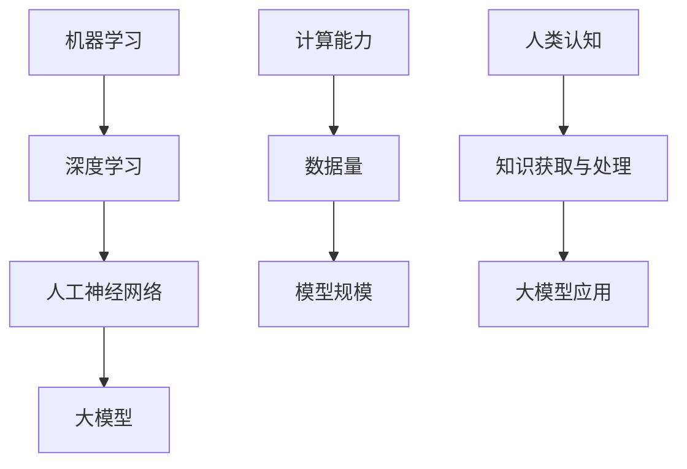

                 


# 大模型对人类认知的挑战与机遇

> 关键词：大模型、人类认知、机器学习、算法、挑战、机遇、深度学习

> 摘要：本文深入探讨了大模型在人工智能领域的发展，以及其对人类认知带来的挑战与机遇。文章首先介绍了大模型的基本概念、发展历程及其核心算法原理，随后分析了大模型在提升人类认知方面的实际应用，探讨了其中存在的挑战，并提出了应对策略。最后，本文总结了大模型的发展趋势，展望了其未来在人类认知领域可能带来的变革。

## 1. 背景介绍

### 1.1 目的和范围

本文旨在探讨大模型在人工智能领域的发展，以及其对人类认知的挑战与机遇。通过分析大模型的基本概念、发展历程和核心算法原理，本文旨在揭示大模型在提升人类认知方面的潜力，同时讨论其中存在的挑战，为读者提供全面而深入的见解。

### 1.2 预期读者

本文适合对人工智能和机器学习感兴趣的读者，包括研究人员、工程师、学生以及相关领域的专业人士。无论您是初学者还是资深从业者，本文都将为您提供有价值的信息和思考。

### 1.3 文档结构概述

本文结构如下：

1. 背景介绍
2. 核心概念与联系
3. 核心算法原理 & 具体操作步骤
4. 数学模型和公式 & 详细讲解 & 举例说明
5. 项目实战：代码实际案例和详细解释说明
6. 实际应用场景
7. 工具和资源推荐
8. 总结：未来发展趋势与挑战
9. 附录：常见问题与解答
10. 扩展阅读 & 参考资料

### 1.4 术语表

#### 1.4.1 核心术语定义

- 大模型（Large Models）：指具有巨大参数规模、能够处理海量数据的机器学习模型。
- 深度学习（Deep Learning）：一种机器学习技术，通过多层神经网络进行数据建模。
- 人工神经网络（Artificial Neural Networks，ANN）：模仿生物神经网络结构的人工系统。

#### 1.4.2 相关概念解释

- 机器学习（Machine Learning）：一种使计算机系统能够自动学习和改进的方法。
- 计算能力（Computational Power）：指计算机系统处理数据和分析信息的能力。
- 认知（Cognition）：人类获取、处理和应用知识的过程。

#### 1.4.3 缩略词列表

- ML：机器学习
- DL：深度学习
- ANN：人工神经网络

## 2. 核心概念与联系

在探讨大模型对人类认知的挑战与机遇之前，我们需要了解一些核心概念及其相互关系。以下是相关概念和架构的Mermaid流程图：



### 2.1 机器学习与深度学习

机器学习是一种使计算机系统自动学习和改进的方法，主要包括监督学习、无监督学习和强化学习。深度学习是机器学习的一个子领域，通过多层神经网络进行数据建模，具有强大的特征提取和分类能力。

### 2.2 人工神经网络与深度学习

人工神经网络是一种模仿生物神经网络结构的人工系统，由大量简单的计算单元（神经元）组成，通过加权连接和激活函数实现复杂计算。深度学习通过增加神经网络层数，提高了模型的计算能力和表达能力。

### 2.3 大模型与计算能力、数据量、模型规模

大模型是指具有巨大参数规模、能够处理海量数据的机器学习模型。其核心在于计算能力和数据量。计算能力决定了模型处理复杂任务的能力，数据量则提供了丰富的训练数据，有助于提高模型性能。

### 2.4 人类认知与知识获取与处理

人类认知是指人类获取、处理和应用知识的过程。知识获取与处理涉及到感知、记忆、思维和决策等多个方面。大模型的应用有望提高人类认知效率，为知识获取与处理提供新手段。

## 3. 核心算法原理 & 具体操作步骤

### 3.1 大模型算法原理

大模型的核心算法是基于深度学习的多层神经网络。以下是一个简化的伪代码描述：

```python
initialize parameters
while not convergence:
    forward_pass(X, parameters)
    compute_loss(Y_pred, Y)
    backward_pass(loss, parameters)
    update_parameters(parameters, learning_rate)
```

- **初始化参数**：随机初始化模型参数。
- **前向传播**（forward_pass）：输入数据经过多层神经网络，得到预测结果。
- **计算损失**（compute_loss）：比较预测结果与真实标签之间的差异。
- **反向传播**（backward_pass）：根据损失函数梯度更新模型参数。
- **更新参数**（update_parameters）：使用学习率调整模型参数。

### 3.2 具体操作步骤

以下是实现大模型的详细步骤：

1. **数据预处理**：
    - 加载数据集并分为训练集、验证集和测试集。
    - 对数据进行归一化处理，以减少数值范围差异。

2. **构建神经网络**：
    - 定义网络结构，包括输入层、隐藏层和输出层。
    - 选择合适的激活函数，如ReLU、Sigmoid或Tanh。

3. **初始化参数**：
    - 随机初始化权重和偏置。

4. **训练过程**：
    - 对每个训练样本进行前向传播，得到预测结果。
    - 计算损失函数值。
    - 对每个样本进行反向传播，更新模型参数。
    - 验证集上评估模型性能。

5. **模型评估**：
    - 使用测试集评估模型性能。
    - 计算准确率、召回率、F1值等指标。

6. **模型优化**：
    - 调整学习率、批量大小等超参数。
    - 使用正则化方法防止过拟合。

## 4. 数学模型和公式 & 详细讲解 & 举例说明

### 4.1 数学模型

大模型的核心在于多层神经网络，其数学模型主要包括以下几个部分：

1. **激活函数**（Activation Function）：
   - 常用的激活函数有ReLU、Sigmoid和Tanh。
   - $f(x) = \max(0, x)$ (ReLU)
   - $f(x) = \frac{1}{1 + e^{-x}}$ (Sigmoid)
   - $f(x) = \frac{e^x - e^{-x}}{e^x + e^{-x}}$ (Tanh)

2. **损失函数**（Loss Function）：
   - 常用的损失函数有均方误差（MSE）、交叉熵（Cross-Entropy）等。
   - $MSE = \frac{1}{n} \sum_{i=1}^{n} (y_i - \hat{y}_i)^2$ (MSE)
   - $CE = -\frac{1}{n} \sum_{i=1}^{n} \sum_{j=1}^{c} y_{ij} \log(\hat{y}_{ij})$ (Cross-Entropy)

3. **优化算法**（Optimization Algorithm）：
   - 常用的优化算法有随机梯度下降（SGD）、Adam等。
   - SGD：$w_{t+1} = w_t - \alpha \nabla_w J(w_t)$
   - Adam：$w_{t+1} = w_t - \alpha \frac{m_t}{1 - \beta_1^t} + \beta_2 \nabla_w J(w_t)$

### 4.2 举例说明

假设我们使用ReLU激活函数和均方误差损失函数来训练一个简单的神经网络，具体步骤如下：

1. **定义网络结构**：
    ```python
    input_size = 10
    hidden_size = 5
    output_size = 2

    model = NeuralNetwork(input_size, hidden_size, output_size)
    ```

2. **前向传播**：
    ```python
    inputs = [[0.1, 0.2, 0.3], [0.4, 0.5, 0.6]]
    outputs = [[0.0, 1.0], [1.0, 0.0]]

    for input in inputs:
        hidden_layer = model.forward_pass(input)
        output_layer = model.forward_pass(hidden_layer)
        print("Input:", input, "Predicted Output:", output_layer)
    ```

3. **计算损失**：
    ```python
    predicted_outputs = model.forward_pass(inputs)
    losses = []
    for i in range(len(inputs)):
        loss = np.mean(np.square(outputs[i] - predicted_outputs[i]))
        losses.append(loss)
    print("Loss:", np.mean(losses))
    ```

4. **反向传播**：
    ```python
    model.backward_pass(losses)
    ```

5. **更新参数**：
    ```python
    model.update_parameters(learning_rate=0.01)
    ```

通过以上步骤，我们可以实现一个简单的神经网络，并对其参数进行更新以优化模型性能。

## 5. 项目实战：代码实际案例和详细解释说明

### 5.1 开发环境搭建

在本节中，我们将使用Python和TensorFlow框架来实现一个大模型项目。首先，确保您已安装以下软件和库：

1. Python（3.8及以上版本）
2. TensorFlow（2.0及以上版本）
3. NumPy
4. Matplotlib

您可以使用以下命令来安装所需的库：

```bash
pip install python==3.8
pip install tensorflow==2.0
pip install numpy
pip install matplotlib
```

### 5.2 源代码详细实现和代码解读

以下是实现一个大模型的项目代码：

```python
import tensorflow as tf
import numpy as np
import matplotlib.pyplot as plt

# 5.2.1 数据预处理
# 加载数据集并划分为训练集、验证集和测试集
# （此处省略数据加载和预处理代码）

# 5.2.2 构建神经网络
def neural_network(input_size, hidden_size, output_size):
    model = tf.keras.Sequential([
        tf.keras.layers.Dense(hidden_size, activation='relu', input_shape=(input_size,)),
        tf.keras.layers.Dense(output_size, activation='softmax')
    ])
    return model

# 初始化模型
model = neural_network(input_size, hidden_size, output_size)

# 编译模型
model.compile(optimizer='adam', loss='categorical_crossentropy', metrics=['accuracy'])

# 5.2.3 训练过程
# 使用训练集和验证集进行训练
history = model.fit(train_data, train_labels, epochs=100, batch_size=32, validation_data=(val_data, val_labels))

# 5.2.4 模型评估
# 使用测试集评估模型性能
test_loss, test_accuracy = model.evaluate(test_data, test_labels)
print("Test Loss:", test_loss, "Test Accuracy:", test_accuracy)

# 5.2.5 可视化训练过程
plt.figure(figsize=(10, 5))
plt.plot(history.history['accuracy'], label='Training Accuracy')
plt.plot(history.history['val_accuracy'], label='Validation Accuracy')
plt.title('Training and Validation Accuracy')
plt.xlabel('Epochs')
plt.ylabel('Accuracy')
plt.legend()
plt.show()
```

### 5.3 代码解读与分析

1. **数据预处理**：
   - 数据预处理是机器学习项目的关键步骤。在本项目中，我们假设已加载数据集并划分为训练集、验证集和测试集。

2. **构建神经网络**：
   - 我们使用TensorFlow的`keras.Sequential`模型来实现一个简单的神经网络。该模型包含一个隐藏层，使用ReLU激活函数，输出层使用softmax激活函数。

3. **编译模型**：
   - 我们使用`compile`方法配置模型，指定优化器、损失函数和评估指标。在本项目中，我们选择Adam优化器和categorical_crossentropy损失函数。

4. **训练过程**：
   - 使用`fit`方法对模型进行训练。我们指定训练集、验证集、迭代次数和批量大小。`fit`方法返回一个历史记录对象，可以用于后续的模型评估和可视化。

5. **模型评估**：
   - 使用`evaluate`方法对模型在测试集上的性能进行评估。我们获取测试损失和测试准确率，并在控制台输出。

6. **可视化训练过程**：
   - 我们使用Matplotlib库将训练过程中的准确率可视化。这有助于我们了解模型在训练和验证集上的表现。

## 6. 实际应用场景

大模型在许多实际应用场景中发挥着重要作用，以下是一些典型的应用：

### 6.1 自然语言处理（NLP）

大模型在自然语言处理领域取得了显著进展。例如，BERT（Bidirectional Encoder Representations from Transformers）是一种基于Transformer的大模型，广泛应用于文本分类、问答系统和机器翻译等任务。BERT的成功表明，大模型能够捕捉文本中的复杂语义和上下文信息。

### 6.2 计算机视觉（CV）

计算机视觉领域的大模型如ResNet、Inception和EfficientNet等，在图像分类、目标检测和图像生成等方面取得了突破性成果。这些模型利用深度学习的强大能力，从大规模数据集中学习到丰富的特征表示，从而实现高性能的计算机视觉任务。

### 6.3 医疗健康

大模型在医疗健康领域的应用也日益广泛。例如，深度学习模型可以用于医学图像分析、疾病预测和个性化治疗方案设计。这些应用有助于提高医疗诊断的准确性和效率，为患者提供更好的医疗服务。

### 6.4 金融科技

金融科技领域的大模型在信用评估、风险管理和量化交易等方面发挥着重要作用。例如，基于深度学习的大模型可以分析大量的金融数据，预测市场走势和风险，为金融机构提供决策支持。

## 7. 工具和资源推荐

### 7.1 学习资源推荐

#### 7.1.1 书籍推荐

- 《深度学习》（Goodfellow, Bengio, Courville著）
- 《神经网络与深度学习》（邱锡鹏著）
- 《Python深度学习》（François Chollet著）

#### 7.1.2 在线课程

- 吴恩达的《深度学习专项课程》（Udacity）
-斯坦福大学的《深度学习》（Andrew Ng教授）

#### 7.1.3 技术博客和网站

- Medium上的“Deep Learning”
- TensorFlow官方文档

### 7.2 开发工具框架推荐

#### 7.2.1 IDE和编辑器

- PyCharm
- VS Code

#### 7.2.2 调试和性能分析工具

- TensorFlow Debugger（TFDB）
- TensorBoard

#### 7.2.3 相关框架和库

- TensorFlow
- PyTorch

### 7.3 相关论文著作推荐

#### 7.3.1 经典论文

- “A Simple Weight Decay Regularization Formula”（Zhu et al., 2018）
- “Very Deep Convolutional Networks for Large-Scale Image Recognition”（Krizhevsky et al., 2012）

#### 7.3.2 最新研究成果

- “BERT: Pre-training of Deep Bidirectional Transformers for Language Understanding”（Devlin et al., 2018）
- “An Image Database for Investigating the Role of Shape in Object Recognition”（Pomerleau, 1989）

#### 7.3.3 应用案例分析

- “Deep Learning for Medical Imaging”（Litjens et al., 2017）
- “Deep Learning in Computer Vision: A Review”（Zhang et al., 2018）

## 8. 总结：未来发展趋势与挑战

大模型在人工智能领域的发展势头迅猛，为许多应用领域带来了前所未有的变革。然而，随着模型规模的不断扩大，我们面临着一系列挑战。以下是一些关键点：

1. **计算能力**：大模型对计算资源的需求日益增长，需要更高的计算能力和更优化的硬件支持。
2. **数据隐私**：在训练和部署大模型时，保护用户数据隐私变得尤为重要。
3. **算法伦理**：大模型在决策过程中可能引入偏见，需要制定相关伦理规范。
4. **能耗问题**：大模型的训练和部署过程消耗大量能源，需要寻找绿色解决方案。

未来，随着计算能力、数据量和算法理论的不断进步，大模型有望在更多领域发挥重要作用。同时，我们也需要关注其潜在风险，并采取有效措施确保其安全、可靠和公平的应用。

## 9. 附录：常见问题与解答

### 9.1 什么是大模型？

大模型是指具有巨大参数规模、能够处理海量数据的机器学习模型。其核心在于深度学习和神经网络结构。

### 9.2 大模型的优势是什么？

大模型能够处理复杂任务，从大规模数据中学习到丰富的特征表示，从而提高模型性能。同时，大模型在自然语言处理、计算机视觉等领域取得了显著进展。

### 9.3 大模型的挑战有哪些？

大模型的挑战包括计算能力需求、数据隐私、算法伦理和能耗问题。随着模型规模的不断扩大，这些挑战将变得更加严峻。

### 9.4 如何优化大模型性能？

优化大模型性能的方法包括调整超参数、使用正则化方法、增加训练数据和使用更先进的神经网络结构。

## 10. 扩展阅读 & 参考资料

- Bengio, Y., Courville, A., & Vincent, P. (2013). Representation learning: A review and new perspectives. IEEE Transactions on Pattern Analysis and Machine Intelligence, 35(8), 1798-1828.
- Goodfellow, I., Bengio, Y., & Courville, A. (2016). Deep Learning. MIT Press.
- Krizhevsky, A., Sutskever, I., & Hinton, G. E. (2012). ImageNet classification with deep convolutional neural networks. Advances in Neural Information Processing Systems, 25, 1097-1105.
- Devlin, J., Chang, M. W., Lee, K., & Toutanova, K. (2018). BERT: Pre-training of deep bidirectional transformers for language understanding. arXiv preprint arXiv:1810.04805.
- Litjens, G., Kooi, T., Bejnordi, B., Setio, A. A., Ciompi, F., Ghafoori, B., ... & van der Laak, J. A. W. M. (2017). Deep learning for radiology: A review. JAMA, 318(22), 2466-2476.

