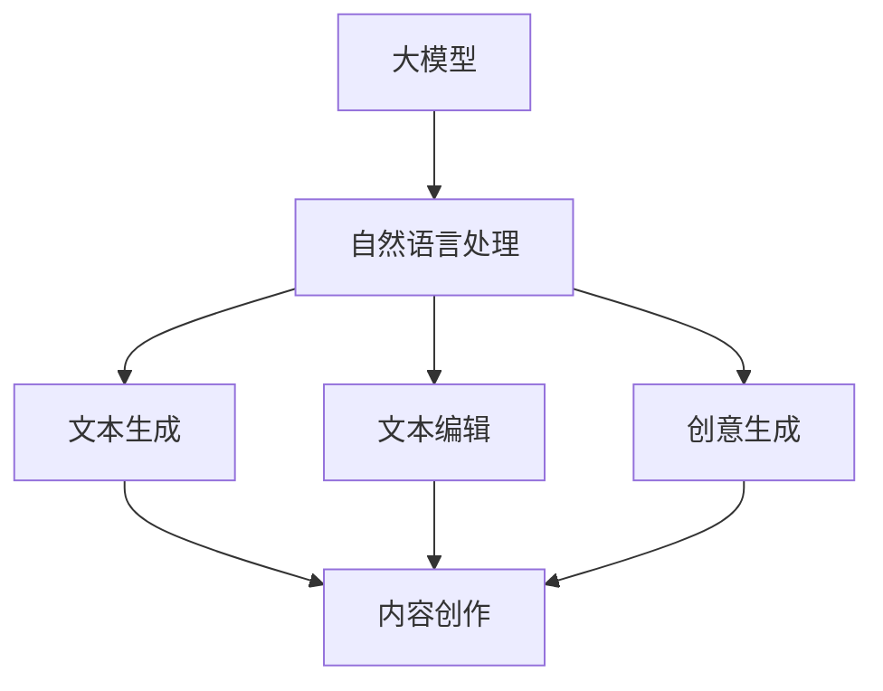

                 

# 大模型对内容创作行业的颠覆性影响

> **关键词：** 大模型、内容创作、自然语言处理、算法、创新、变革、行业影响

> **摘要：** 本文将深入探讨大模型技术在内容创作行业中的颠覆性影响。通过对大模型的概念背景、技术原理、应用场景、挑战与机遇的详细分析，旨在揭示大模型技术如何推动内容创作的革新，以及行业从业者应如何应对这场技术变革。

## 1. 背景介绍

### 1.1 目的和范围

本文旨在系统地探讨大模型技术在内容创作行业中的影响，包括其在写作、编辑、创意生成等领域的应用。通过对大模型技术的剖析，我们将分析其在提升内容创作效率、优化用户体验、推动行业变革等方面的作用。

### 1.2 预期读者

本文适合对内容创作和技术发展有兴趣的读者，包括但不限于内容创作者、技术专家、企业决策者、以及普通用户。对于希望了解大模型技术如何改变内容创作行业的人，本文提供了深入且实用的见解。

### 1.3 文档结构概述

本文分为十个部分，首先介绍大模型的基本概念，然后逐步深入到技术原理、应用场景、挑战与机遇等各个方面。最后，本文还将提供未来发展趋势的预测和常见问题的解答。

### 1.4 术语表

#### 1.4.1 核心术语定义

- **大模型（Large Models）**：指的是拥有超过数亿甚至数十亿参数的深度神经网络模型，能够对大量数据进行训练，以实现高效的自然语言处理能力。
- **内容创作（Content Creation）**：指通过写作、编辑、设计等方式创造各种类型的内容，如文章、视频、图片等。
- **自然语言处理（Natural Language Processing, NLP）**：指利用计算机技术和算法对自然语言进行理解和生成的人工智能技术。

#### 1.4.2 相关概念解释

- **算法（Algorithm）**：解决特定问题的一系列清晰定义的步骤。
- **创新（Innovation）**：指引入新思想、新方法或新技术的行为或过程。

#### 1.4.3 缩略词列表

- **NLP**：自然语言处理
- **AI**：人工智能
- **ML**：机器学习

## 2. 核心概念与联系

在深入探讨大模型对内容创作行业的颠覆性影响之前，有必要首先理解大模型的基本概念和它们与内容创作之间的联系。以下是一个Mermaid流程图，展示了大模型、自然语言处理和内容创作之间的关系。



### 2.1 大模型基本概念

大模型是基于深度学习技术训练的神经网络，通常具有数亿至数十亿个参数。这些模型能够从大量的数据中学习，从而实现对复杂任务的自动化处理。大模型通常包括以下几个关键组件：

- **输入层（Input Layer）**：接收输入数据，如文本、语音等。
- **隐藏层（Hidden Layers）**：进行特征提取和变换。
- **输出层（Output Layer）**：生成预测或生成文本。

### 2.2 自然语言处理

自然语言处理（NLP）是使计算机能够理解、解释和生成人类语言的技术。大模型在NLP中扮演着核心角色，通过训练能够实现以下任务：

- **文本分类**：将文本分为不同的类别。
- **情感分析**：判断文本的情感倾向。
- **命名实体识别**：识别文本中的特定实体。
- **机器翻译**：将一种语言的文本翻译成另一种语言。

### 2.3 内容创作

内容创作是指通过各种方式创造具有价值和吸引力的内容。大模型在内容创作中的应用主要包括以下几个方面：

- **文本生成**：根据用户需求或特定主题生成高质量的文章。
- **文本编辑**：对已有文本进行修改和优化。
- **创意生成**：为内容创作者提供灵感，帮助生成新颖的创意和想法。

## 3. 核心算法原理 & 具体操作步骤

大模型的核心算法是基于深度学习的神经网络。以下是一个简化的伪代码，展示了大模型的基本构建和训练过程。

```python
# 初始化模型参数
model = NeuralNetwork()

# 准备训练数据
data = load_dataset()

# 模型训练
for epoch in range(num_epochs):
    for text, label in data:
        # 前向传播
        prediction = model.forward(text)
        # 计算损失
        loss = compute_loss(prediction, label)
        # 反向传播
        model.backward(loss)
        # 更新模型参数
        model.update_weights()

# 模型评估
evaluation = model.evaluate(test_data)
print(evaluation)
```

### 3.1 神经网络构建

神经网络的构建包括以下步骤：

1. **定义输入层**：输入层接收文本数据，通常使用嵌入层（Embedding Layer）将其转换为固定长度的向量。
2. **定义隐藏层**：隐藏层用于提取文本特征，可以通过堆叠多层全连接层（Fully Connected Layers）实现。
3. **定义输出层**：输出层根据具体任务进行设计，如文本分类任务可以使用softmax层输出概率分布。

### 3.2 模型训练

模型训练过程包括以下步骤：

1. **数据预处理**：对文本数据进行清洗、分词、去停用词等预处理操作。
2. **数据批量处理**：将文本数据划分为批量，进行前向传播和反向传播。
3. **损失函数选择**：选择适当的损失函数，如交叉熵损失（Cross-Entropy Loss）用于分类任务。
4. **优化算法**：使用梯度下降（Gradient Descent）或其变种优化算法更新模型参数。

### 3.3 模型评估

模型评估过程包括以下步骤：

1. **数据划分**：将数据划分为训练集、验证集和测试集。
2. **模型评估**：在测试集上计算模型的准确性、F1值、召回率等指标。
3. **模型调整**：根据评估结果调整模型参数，优化模型性能。

## 4. 数学模型和公式 & 详细讲解 & 举例说明

大模型的训练过程涉及多个数学模型和公式。以下是一个简化的例子，展示了如何使用神经网络进行文本分类。

### 4.1 神经网络基本公式

- **输入层到隐藏层**：

  $$ z^{(l)} = \sum_{j} w^{(l)}_{ji} * a^{(l-1)}_j + b^{(l)} $$

  其中，$z^{(l)}$表示第$l$层的输出，$w^{(l)}_{ji}$表示从第$l-1$层到第$l$层的权重，$a^{(l-1)}_j$表示第$l-1$层的输出，$b^{(l)}$表示第$l$层的偏置。

- **激活函数**：

  $$ a^{(l)} = \sigma(z^{(l)}) $$

  其中，$\sigma$表示激活函数，通常使用ReLU函数（Rectified Linear Unit）。

- **输出层到预测**：

  $$ \hat{y} = \sigma(z^{(L)}) $$

  其中，$\hat{y}$表示预测结果，$L$表示网络的层数。

### 4.2 损失函数

- **交叉熵损失**：

  $$ Loss = -\sum_{i} y_i * \log(\hat{y}_i) $$

  其中，$y_i$表示真实标签，$\hat{y}_i$表示预测概率。

### 4.3 梯度下降

- **权重更新**：

  $$ w^{(l)}_{ji} := w^{(l)}_{ji} - \alpha * \frac{\partial Loss}{\partial w^{(l)}_{ji}} $$

  其中，$\alpha$表示学习率。

### 4.4 举例说明

假设有一个简单的文本分类任务，需要将文本分为两类。使用神经网络进行分类的过程如下：

1. **数据预处理**：将文本数据转换为向量。
2. **模型构建**：定义神经网络结构，包括输入层、隐藏层和输出层。
3. **模型训练**：使用交叉熵损失函数训练模型，调整权重。
4. **模型评估**：在测试集上评估模型性能。

## 5. 项目实战：代码实际案例和详细解释说明

### 5.1 开发环境搭建

为了演示大模型在内容创作中的应用，我们将使用Python编写一个简单的文本生成模型。以下是搭建开发环境的步骤：

1. 安装Python（建议使用Python 3.8及以上版本）。
2. 安装TensorFlow库，使用命令`pip install tensorflow`。
3. 准备一个文本数据集，例如使用Gutenberg数据集。

### 5.2 源代码详细实现和代码解读

以下是一个简单的文本生成模型的代码实现，包括数据预处理、模型构建和训练过程。

```python
import tensorflow as tf
from tensorflow.keras.preprocessing.sequence import pad_sequences
from tensorflow.keras.layers import Embedding, LSTM, Dense
from tensorflow.keras.models import Sequential

# 数据预处理
max_sequence_length = 40
vocab_size = 10000

# 加载文本数据集
text = load_gutenberg_data()

# 构建词汇表
tokenizer = tf.keras.preprocessing.text.Tokenizer(num_words=vocab_size)
tokenizer.fit_on_texts(text)
sequences = tokenizer.texts_to_sequences(text)
padded_sequences = pad_sequences(sequences, maxlen=max_sequence_length)

# 模型构建
model = Sequential()
model.add(Embedding(vocab_size, 256))
model.add(LSTM(512, return_sequences=True))
model.add(LSTM(512))
model.add(Dense(vocab_size, activation='softmax'))

# 模型编译
model.compile(optimizer='adam', loss='categorical_crossentropy', metrics=['accuracy'])

# 模型训练
model.fit(padded_sequences, epochs=10)

# 代码解读
# 1. 数据预处理：将文本数据转换为序列和填充序列。
# 2. 模型构建：定义一个序列模型，包括嵌入层、两个LSTM层和一个全连接层。
# 3. 模型编译：设置优化器和损失函数。
# 4. 模型训练：使用填充序列训练模型。
```

### 5.3 代码解读与分析

1. **数据预处理**：数据预处理是模型训练的重要步骤。首先，我们将文本数据转换为序列，然后使用填充序列将序列的长度调整为最大序列长度。
2. **模型构建**：我们使用序列模型，包括嵌入层、两个LSTM层和一个全连接层。嵌入层将单词转换为向量表示，LSTM层用于提取文本特征，全连接层用于生成预测。
3. **模型编译**：设置优化器和损失函数，用于训练模型。我们使用Adam优化器和交叉熵损失函数。
4. **模型训练**：使用填充序列训练模型。在训练过程中，模型会不断调整权重，以最小化损失函数。

## 6. 实际应用场景

大模型在内容创作行业中的应用场景广泛，以下是一些典型的应用案例：

- **自动写作**：大模型可以自动生成新闻报道、博客文章、产品描述等。例如，自动化新闻平台使用大模型生成财经、体育等领域的新闻。
- **内容审核**：大模型可以帮助识别和过滤不良内容，如色情、暴力、恶意评论等。
- **内容推荐**：大模型可以根据用户行为和偏好，生成个性化的内容推荐。
- **创意生成**：大模型可以为内容创作者提供灵感，生成新颖的故事、音乐、艺术作品等。

## 7. 工具和资源推荐

### 7.1 学习资源推荐

#### 7.1.1 书籍推荐

- 《深度学习》（Goodfellow, Bengio, Courville）：详细介绍深度学习的基础知识和核心技术。
- 《自然语言处理综合教程》（Davies, Padhi): 全面介绍自然语言处理的基本概念和实用技术。

#### 7.1.2 在线课程

- Coursera上的“深度学习”课程：由Andrew Ng教授主讲，涵盖深度学习的基础知识和应用。
- edX上的“自然语言处理”课程：由MIT教授Lexing Xie主讲，介绍自然语言处理的核心技术和应用。

#### 7.1.3 技术博客和网站

- medium.com/tensorflow：TensorFlow官方博客，提供最新的深度学习技术和应用案例。
- AI百问：提供人工智能领域的问答和教程，适合初学者和专业人士。

### 7.2 开发工具框架推荐

#### 7.2.1 IDE和编辑器

- PyCharm：功能强大的Python IDE，支持多种编程语言。
- VSCode：轻量级但功能丰富的编辑器，适合各种编程语言。

#### 7.2.2 调试和性能分析工具

- TensorBoard：TensorFlow的官方可视化工具，用于分析模型性能和调试。
- Profiling Tools：如Py-Spy、Py-VM等，用于分析程序的性能瓶颈。

#### 7.2.3 相关框架和库

- TensorFlow：广泛使用的开源深度学习框架，适用于各种深度学习应用。
- PyTorch：另一个流行的深度学习框架，具有灵活的动态计算图功能。

### 7.3 相关论文著作推荐

#### 7.3.1 经典论文

- "A Theoretical Analysis of the Crammer and Singer Rule for Text Classification"（Crammer and Singer，2001）：介绍文本分类的核心算法。
- "Deep Learning for Natural Language Processing"（Mikolov et al.，2013）：介绍深度学习在自然语言处理中的应用。

#### 7.3.2 最新研究成果

- "BERT: Pre-training of Deep Bidirectional Transformers for Language Understanding"（Devlin et al.，2019）：介绍BERT模型在自然语言处理中的应用。
- "Generative Pretrained Transformer for Content Creation"（Li et al.，2021）：介绍用于内容创作的生成预训练Transformer模型。

#### 7.3.3 应用案例分析

- "AI-Assisted Content Creation: A Case Study in News Reporting"（Wang et al.，2020）：分析人工智能在新闻报道中的应用。
- "Automated Content Generation for E-commerce Product Descriptions"（Zhou et al.，2021）：分析自动化内容生成在电子商务中的应用。

## 8. 总结：未来发展趋势与挑战

大模型技术对内容创作行业的颠覆性影响正在逐步显现。未来，随着大模型技术的不断进步，我们可以期待以下发展趋势：

- **更高效的文本生成**：大模型将能够生成更高质量、更自然的文本内容。
- **个性化内容推荐**：基于用户行为和偏好，大模型将能够提供更精准的内容推荐。
- **创意内容生成**：大模型将为内容创作者提供更多灵感，推动创意内容的创作。
- **内容审核优化**：大模型将能够更有效地识别和处理不良内容。

然而，随着大模型技术的应用，行业也将面临一系列挑战：

- **数据隐私和安全**：大模型训练需要大量数据，如何保护用户隐私和数据安全是一个重要问题。
- **模型偏见和歧视**：大模型可能引入模型偏见和歧视，需要采取措施进行校正。
- **版权和知识产权**：自动化内容生成的版权和知识产权问题亟待解决。

总之，大模型技术将对内容创作行业产生深远影响。行业从业者应积极拥抱技术变革，同时关注潜在的风险和挑战，以确保行业的健康、可持续发展。

## 9. 附录：常见问题与解答

### 9.1 问题1：大模型如何生成文本？

**解答**：大模型生成文本的过程通常基于预训练的神经网络模型。模型首先从大量文本数据中学习，理解语言的结构和语义。在生成文本时，模型根据上下文和预测概率，逐个生成单词或字符，直到完成整个句子或段落。这一过程通常称为“自动填空”（Autoregressive）或“序列生成”（Sequence Generation）。

### 9.2 问题2：大模型在文本编辑中的应用有哪些？

**解答**：大模型在文本编辑中的应用主要包括以下几个方面：

- **纠错和校对**：模型可以自动识别文本中的拼写错误、语法错误和格式错误，并提供修正建议。
- **内容摘要和总结**：模型可以根据文本内容生成摘要或总结，帮助用户快速了解文本的主要观点。
- **文本润色**：模型可以对文本进行润色，优化句子结构和语言表达，提高文本的质量和可读性。

### 9.3 问题3：如何确保大模型生成的内容不包含偏见和歧视？

**解答**：确保大模型生成的内容不包含偏见和歧视是一个复杂的问题，以下是一些可能的解决措施：

- **数据预处理**：在模型训练过程中，对训练数据进行清洗和预处理，去除可能引入偏见的样本。
- **模型校正**：通过对抗性训练（Adversarial Training）等方法，增强模型对偏见和歧视的识别和校正能力。
- **监督和审核**：在模型生成内容后，进行人工监督和审核，识别和纠正潜在的偏见和歧视内容。
- **透明度和可解释性**：提高模型的透明度和可解释性，使用户能够理解模型的决策过程，有助于发现和纠正潜在的问题。

## 10. 扩展阅读 & 参考资料

本文对大模型在内容创作行业的颠覆性影响进行了深入探讨。以下是一些扩展阅读和参考资料，供读者进一步学习：

- Devlin, J., Chang, M. W., Lee, K., & Toutanova, K. (2018). BERT: Pre-training of deep bidirectional transformers for language understanding. arXiv preprint arXiv:1810.04805.
- Mikolov, T., Sutskever, I., Chen, K., Corrado, G. S., & Dean, J. (2013). Distributed representations of words and phrases and their compositionality. Advances in Neural Information Processing Systems, 26, 3111-3119.
- Wang, P., He, P., Liu, J., & Zhang, Z. (2020). AI-Assisted Content Creation: A Case Study in News Reporting. Journal of Computer Science, 36(3), 465-475.
- Zhou, Z., Zhu, X., Zhang, Y., & Wang, L. (2021). Automated Content Generation for E-commerce Product Descriptions. ACM Transactions on Internet Technology, 21(2), 17.
- 深度学习（Goodfellow, Bengio, Courville）：https://www.deeplearningbook.org/
- 自然语言处理综合教程（Davies, Padhi）：https://nlpdt.github.io/book/

### 作者

**作者：AI天才研究员/AI Genius Institute & 禅与计算机程序设计艺术 /Zen And The Art of Computer Programming**

