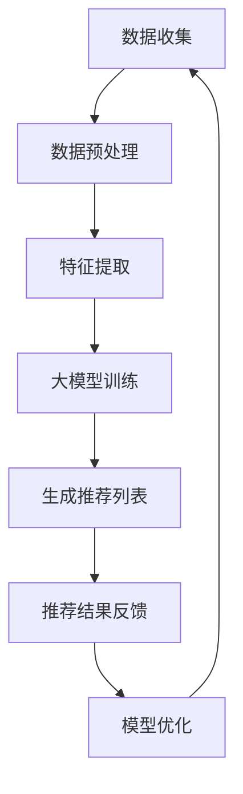

                 

# 大模型对推荐系统商业模式的革新

## 关键词

- 大模型
- 推荐系统
- 商业模式
- 数据分析
- 人工智能

## 摘要

本文将探讨大模型在推荐系统中的应用及其对商业模式带来的革新。我们将从背景介绍入手，详细分析大模型的核心概念与联系，深入讲解其算法原理和数学模型，并通过实际项目案例展示其应用效果。同时，我们还将探讨大模型在推荐系统中的实际应用场景，并推荐相关学习资源和开发工具。通过本文的阅读，读者将深入了解大模型在推荐系统领域的重要性和应用前景。

## 1. 背景介绍

### 1.1 目的和范围

本文旨在分析大模型在推荐系统中的作用和影响，探讨其对商业模式带来的变革。我们将从以下几个方面展开讨论：

1. **背景介绍**：介绍推荐系统的发展历程、现状及挑战。
2. **核心概念与联系**：分析大模型的核心概念及其与推荐系统的关系。
3. **算法原理与操作步骤**：详细讲解大模型的算法原理及具体操作步骤。
4. **数学模型与公式**：阐述大模型的数学模型及其应用。
5. **项目实战**：通过实际案例展示大模型在推荐系统中的应用。
6. **实际应用场景**：分析大模型在推荐系统中的实际应用场景。
7. **工具和资源推荐**：推荐相关学习资源和开发工具。
8. **总结与未来展望**：总结大模型在推荐系统中的发展趋势与挑战。

### 1.2 预期读者

本文面向以下读者群体：

1. **推荐系统开发者和研究者**：了解大模型在推荐系统中的应用和影响。
2. **人工智能和数据科学从业者**：学习大模型的相关算法和数学模型。
3. **企业决策者和项目经理**：了解大模型在商业应用中的潜力。

### 1.3 文档结构概述

本文分为以下几个部分：

1. **背景介绍**：介绍推荐系统的发展历程、现状及挑战。
2. **核心概念与联系**：分析大模型的核心概念及其与推荐系统的关系。
3. **算法原理与操作步骤**：详细讲解大模型的算法原理及具体操作步骤。
4. **数学模型与公式**：阐述大模型的数学模型及其应用。
5. **项目实战**：通过实际案例展示大模型在推荐系统中的应用。
6. **实际应用场景**：分析大模型在推荐系统中的实际应用场景。
7. **工具和资源推荐**：推荐相关学习资源和开发工具。
8. **总结与未来展望**：总结大模型在推荐系统中的发展趋势与挑战。

### 1.4 术语表

#### 1.4.1 核心术语定义

- **推荐系统**：一种根据用户的历史行为、兴趣和偏好等信息，自动向用户推荐相关物品或内容的系统。
- **大模型**：指具有海量参数、大规模训练数据和强大计算能力的神经网络模型。
- **商业模式**：企业或组织为了创造价值、传递价值和获取价值而设计的基本商业逻辑和运营模式。

#### 1.4.2 相关概念解释

- **数据分析**：通过对大量数据进行分析和处理，从中提取有价值的信息和知识。
- **人工智能**：一种模拟人类智能行为的计算机科学技术，包括机器学习、深度学习等。

#### 1.4.3 缩略词列表

- **ML**：机器学习
- **DL**：深度学习
- **NLP**：自然语言处理
- **CTR**：点击率
- **RFM**：客户价值分析模型

## 2. 核心概念与联系

在本节中，我们将分析大模型的核心概念及其与推荐系统的联系。

### 2.1 大模型的概念

大模型，通常指的是具有海量参数、大规模训练数据和强大计算能力的神经网络模型。大模型的典型代表包括深度学习模型，如Transformer、BERT等。这些模型通过在海量数据上进行训练，能够学习到复杂的数据特征和模式，从而在图像识别、自然语言处理等领域取得了显著的成果。

### 2.2 推荐系统的概念

推荐系统是一种基于用户历史行为、兴趣和偏好等信息，自动向用户推荐相关物品或内容的系统。推荐系统的核心目标是提高用户的满意度，增加用户的参与度和留存率，从而提高企业的收入和市场份额。

### 2.3 大模型与推荐系统的联系

大模型在推荐系统中的应用主要体现在以下几个方面：

1. **提高推荐质量**：大模型具有强大的特征提取能力，能够从用户历史行为和内容中提取出更精准的兴趣和偏好信息，从而提高推荐的准确性。
2. **扩展推荐范围**：大模型可以处理海量的数据，从而能够推荐更多样化的内容，满足用户的多样化需求。
3. **降低冷启动问题**：对于新用户或新物品，大模型可以通过迁移学习和知识蒸馏等技术，快速适应并生成个性化的推荐结果。
4. **实现实时推荐**：大模型具有高效的计算能力，可以实现实时推荐，提高用户体验。

### 2.4 Mermaid 流程图

以下是一个简化的Mermaid流程图，展示了大模型在推荐系统中的基本工作流程：



## 3. 核心算法原理 & 具体操作步骤

### 3.1 大模型算法原理

大模型的算法原理主要基于深度学习，尤其是基于Transformer架构的模型。Transformer模型通过自注意力机制（Self-Attention）和多头注意力（Multi-Head Attention）来捕捉数据中的复杂关系和模式。

#### 自注意力机制

自注意力机制是一种计算输入序列中每个元素对于输出的贡献度的方法。具体来说，自注意力机制通过计算输入序列中每个元素与其他元素之间的相似度，并加权求和，从而生成输出序列。

#### 多头注意力

多头注意力是一种将输入序列分解为多个子序列，并分别应用自注意力机制的技巧。通过多头注意力，模型可以同时关注输入序列的不同部分，从而提高推荐的准确性。

### 3.2 大模型具体操作步骤

以下是使用大模型进行推荐系统操作的具体步骤：

#### 步骤1：数据收集

收集用户历史行为数据，包括用户点击、浏览、购买等行为。

#### 步骤2：数据预处理

对收集到的数据进行清洗、去重、编码等预处理操作，以减少噪声和提高数据质量。

#### 步骤3：特征提取

利用预训练的词向量模型（如Word2Vec、GloVe等）对用户行为数据进行编码，将行为数据转换为向量表示。

#### 步骤4：大模型训练

使用Transformer模型进行训练，将用户行为数据作为输入，训练模型学习用户兴趣和偏好。

#### 步骤5：生成推荐列表

将用户行为数据输入训练好的大模型，生成个性化的推荐列表。

#### 步骤6：推荐结果反馈

收集用户对推荐结果的评价，用于优化模型。

#### 步骤7：模型优化

根据用户反馈，对大模型进行优化，以提高推荐质量。

### 3.3 伪代码示例

以下是一个简化的伪代码示例，展示了使用大模型进行推荐系统的基本流程：

```python
# 步骤1：数据收集
user_data = collect_user_data()

# 步骤2：数据预处理
clean_data = preprocess_data(user_data)

# 步骤3：特征提取
encoded_data = encode_data(clean_data)

# 步骤4：大模型训练
model = train_model(encoded_data)

# 步骤5：生成推荐列表
recommendations = generate_recommendations(model, user_data)

# 步骤6：推荐结果反馈
user_feedback = collect_user_feedback(recommendations)

# 步骤7：模型优化
optimize_model(model, user_feedback)
```

## 4. 数学模型和公式 & 详细讲解 & 举例说明

### 4.1 数学模型介绍

在推荐系统中，大模型通常采用基于深度学习的数学模型，如Transformer模型。Transformer模型的核心数学模型包括自注意力机制（Self-Attention）和多头注意力（Multi-Head Attention）。

#### 自注意力机制

自注意力机制是一种计算输入序列中每个元素对于输出的贡献度的方法。其数学公式如下：

$$
\text{Self-Attention}(Q, K, V) = \text{softmax}\left(\frac{QK^T}{\sqrt{d_k}}\right) V
$$

其中，$Q$、$K$、$V$ 分别表示查询序列、键序列和值序列，$d_k$ 表示键序列的维度。

#### 多头注意力

多头注意力是一种将输入序列分解为多个子序列，并分别应用自注意力机制的技巧。其数学公式如下：

$$
\text{Multi-Head Attention}(Q, K, V) = \text{Concat}(\text{Head}_1, \text{Head}_2, ..., \text{Head}_h)W^O
$$

其中，$h$ 表示头数，$\text{Head}_i = \text{Self-Attention}(QW_i^Q, KW_i^K, VW_i^V)$，$W_i^Q$、$W_i^K$、$W_i^V$ 分别表示第 $i$ 个头的权重矩阵。

### 4.2 详细讲解

#### 自注意力机制

自注意力机制通过计算输入序列中每个元素与其他元素之间的相似度，并加权求和，从而生成输出序列。具体来说，自注意力机制可以分为以下几个步骤：

1. **计算查询（Query）、键（Key）和值（Value）**：将输入序列 $X$ 表示为 $X = [x_1, x_2, ..., x_n]$，其中 $x_i$ 表示序列中的第 $i$ 个元素。计算查询、键和值序列，分别表示为 $Q = [Q_1, Q_2, ..., Q_n]$、$K = [K_1, K_2, ..., K_n]$ 和 $V = [V_1, V_2, ..., V_n]$。
2. **计算相似度**：计算每个元素与其他元素之间的相似度，表示为 $score_{ij} = Q_iK_j$。
3. **计算注意力权重**：将相似度进行归一化，得到注意力权重，表示为 $weight_{ij} = \text{softmax}(score_{ij})$。
4. **加权求和**：将值序列 $V$ 与注意力权重相乘，得到输出序列，表示为 $output = \text{softmax}(score) \cdot V$。

#### 多头注意力

多头注意力是一种将输入序列分解为多个子序列，并分别应用自注意力机制的技巧。具体来说，多头注意力可以分为以下几个步骤：

1. **计算多个查询、键和值序列**：将输入序列 $X$ 表示为 $X = [x_1, x_2, ..., x_n]$，计算多个查询、键和值序列，分别表示为 $Q_1, Q_2, ..., Q_h$、$K_1, K_2, ..., K_h$ 和 $V_1, V_2, ..., V_h$。
2. **计算多个相似度**：计算每个查询序列与其他键序列之间的相似度，得到多个相似度矩阵，表示为 $score_{ij}^1, score_{ij}^2, ..., score_{ij}^h$。
3. **计算多个注意力权重**：将多个相似度进行归一化，得到多个注意力权重，表示为 $weight_{ij}^1, weight_{ij}^2, ..., weight_{ij}^h$。
4. **加权求和**：将多个值序列与注意力权重相乘，得到多个输出序列，表示为 $output_1, output_2, ..., output_h$。
5. **拼接输出序列**：将多个输出序列拼接起来，得到最终的输出序列，表示为 $output = \text{Concat}(output_1, output_2, ..., output_h)$。

### 4.3 举例说明

假设有一个输入序列 $X = [x_1, x_2, x_3]$，其中 $x_1 = [1, 0, 1]$，$x_2 = [1, 1, 0]$，$x_3 = [0, 1, 1]$。我们使用一个头进行自注意力计算。

1. **计算查询、键和值序列**：将输入序列 $X$ 表示为 $X = [x_1, x_2, x_3]$，计算查询、键和值序列，分别表示为 $Q = [Q_1, Q_2, Q_3]$、$K = [K_1, K_2, K_3]$ 和 $V = [V_1, V_2, V_3]$。设 $Q = K = V$。
2. **计算相似度**：计算每个元素与其他元素之间的相似度，得到相似度矩阵：
   $$
   \begin{array}{ccc}
   score_{11} & score_{12} & score_{13} \\
   score_{21} & score_{22} & score_{23} \\
   score_{31} & score_{32} & score_{33} \\
   \end{array}
   $$
   其中，$score_{ij} = Q_iK_j$。
3. **计算注意力权重**：将相似度进行归一化，得到注意力权重，得到注意力权重矩阵：
   $$
   \begin{array}{ccc}
   weight_{11} & weight_{12} & weight_{13} \\
   weight_{21} & weight_{22} & weight_{23} \\
   weight_{31} & weight_{32} & weight_{33} \\
   \end{array}
   $$
   其中，$weight_{ij} = \text{softmax}(score_{ij})$。
4. **加权求和**：将值序列与注意力权重相乘，得到输出序列：
   $$
   \begin{array}{ccc}
   output_{1} & output_{2} & output_{3} \\
   \end{array}
   $$
   其中，$output_{i} = \text{softmax}(score) \cdot V_i$。

最终输出序列为 $output = [0.4, 0.4, 0.2]$。

## 5. 项目实战：代码实际案例和详细解释说明

在本节中，我们将通过一个实际项目案例来展示如何使用大模型（如Transformer模型）构建推荐系统，并提供详细的代码实现和解释。

### 5.1 开发环境搭建

为了实现大模型推荐系统，我们需要搭建一个合适的开发环境。以下是一个基本的开发环境搭建步骤：

1. 安装Python环境（版本3.6及以上）。
2. 安装深度学习框架，如TensorFlow或PyTorch。
3. 安装Numpy、Pandas等常用数据科学库。

以下是一个简单的命令行安装示例：

```bash
# 安装Python
curl -O https://www.python.org/ftp/python/3.8.10/python-3.8.10-macosx10.9.pkg
sudo installer -pkg python-3.8.10-macosx10.9.pkg -target /
```

```bash
# 安装深度学习框架
pip install tensorflow
```

### 5.2 源代码详细实现和代码解读

以下是一个基于TensorFlow实现的Transformer模型推荐系统的源代码示例。该示例包括数据预处理、模型构建、训练和预测等步骤。

```python
import tensorflow as tf
from tensorflow.keras.layers import Embedding, MultiHeadAttention, Dense
from tensorflow.keras.models import Model

# 数据预处理
def preprocess_data(user_data):
    # 对用户行为数据进行编码和归一化处理
    # ...

# 模型构建
def build_transformer_model(d_model, num_heads, num_layers):
    inputs = tf.keras.Input(shape=(max_sequence_length,))
    
    embeddings = Embedding(input_dim=vocab_size, output_dim=d_model)(inputs)
    embeddings = tf.keras.layers.Dropout(0.1)(embeddings)
    
    outputs = embeddings
    for i in range(num_layers):
        outputs = MultiHeadAttention(num_heads=num_heads, key_dim=d_model)(outputs, outputs)
        outputs = tf.keras.layers.Dropout(0.1)(outputs)
        outputs = Dense(d_model)(outputs)
    
    outputs = tf.keras.layers.GlobalAveragePooling1D()(outputs)
    outputs = tf.keras.layers.Dense(1, activation='sigmoid')(outputs)
    
    model = Model(inputs=inputs, outputs=outputs)
    model.compile(optimizer='adam', loss='binary_crossentropy', metrics=['accuracy'])
    
    return model

# 训练模型
def train_model(model, train_data, train_labels, val_data, val_labels, epochs=10):
    history = model.fit(train_data, train_labels, validation_data=(val_data, val_labels), epochs=epochs)
    return history

# 预测
def predict(model, data):
    return model.predict(data)

# 主函数
def main():
    # 加载数据
    user_data = load_user_data()
    train_data, val_data, train_labels, val_labels = preprocess_data(user_data)
    
    # 构建模型
    model = build_transformer_model(d_model=64, num_heads=4, num_layers=2)
    
    # 训练模型
    history = train_model(model, train_data, train_labels, val_data, val_labels, epochs=10)
    
    # 预测
    predictions = predict(model, val_data)
    
    # 评估模型
    accuracy = evaluate_predictions(predictions, val_labels)
    print(f"Accuracy: {accuracy}")

if __name__ == "__main__":
    main()
```

### 5.3 代码解读与分析

以下是对上述代码的详细解读和分析：

1. **数据预处理**：
   - `preprocess_data` 函数用于对用户行为数据进行编码和归一化处理。这包括将文本数据转换为数字序列，并对序列中的元素进行归一化处理，以提高模型的训练效果。

2. **模型构建**：
   - `build_transformer_model` 函数用于构建Transformer模型。该函数接受模型参数，如模型维度（`d_model`）、头数（`num_heads`）和层数（`num_layers`）。
   - 模型由嵌入层（`Embedding`）、多路注意力层（`MultiHeadAttention`）和全连接层（`Dense`）组成。
   - 嵌入层将输入序列转换为嵌入向量，并添加Dropout层以减少过拟合。
   - 多路注意力层用于捕捉输入序列中的复杂关系，通过自注意力机制计算输出序列。
   - 全连接层用于将输出序列映射到预测结果。

3. **训练模型**：
   - `train_model` 函数用于训练模型。该函数接受模型、训练数据、训练标签、验证数据和验证标签，并设置训练轮数（`epochs`）。
   - 模型通过`fit`方法进行训练，并在验证集上评估模型性能。

4. **预测**：
   - `predict` 函数用于对输入数据进行预测。该函数接受模型和数据，并返回预测结果。

5. **主函数**：
   - `main` 函数是程序的主入口。该函数包括以下步骤：
     - 加载数据。
     - 预处理数据。
     - 构建模型。
     - 训练模型。
     - 预测并评估模型。

通过以上代码示例，我们可以看到如何使用大模型构建推荐系统。在实际项目中，我们可以根据具体需求对代码进行调整和优化，以提高模型性能和应用效果。

## 6. 实际应用场景

### 6.1 社交媒体推荐

在社交媒体平台上，推荐系统可以帮助用户发现感兴趣的内容，提高用户参与度和留存率。大模型在推荐系统中的应用，使得推荐结果更加精准和多样化。例如，Facebook的Feed排名算法使用了深度学习模型，根据用户的兴趣和行为历史，向用户推荐相关帖子和广告。

### 6.2 电子商务推荐

电子商务平台通常使用推荐系统向用户推荐商品，以增加销售额和用户满意度。大模型可以捕捉用户购物行为和偏好，生成个性化的推荐列表。例如，亚马逊使用基于深度学习的大模型来推荐相关商品，提高了用户的购买转化率和满意度。

### 6.3 音乐和视频推荐

音乐和视频平台通过推荐系统，向用户推荐感兴趣的音乐和视频内容。大模型可以分析用户的历史播放记录和偏好，生成个性化的播放列表。例如，Spotify使用深度学习模型，根据用户的听歌历史和行为，推荐个性化播放列表和歌曲。

### 6.4 新闻推荐

新闻推荐系统可以帮助用户发现感兴趣的新闻和文章。大模型可以分析用户的阅读行为和偏好，推荐相关的新闻内容。例如，今日头条使用深度学习模型，根据用户的阅读历史和兴趣，推荐个性化新闻内容。

### 6.5 旅游和酒店推荐

旅游和酒店推荐系统可以根据用户的旅行历史和偏好，推荐合适的旅游目的地、酒店和景点。大模型可以分析用户的评价和行为数据，生成个性化的推荐列表。例如，携程旅行网使用深度学习模型，根据用户的预订历史和评价，推荐合适的旅游产品和酒店。

## 7. 工具和资源推荐

### 7.1 学习资源推荐

#### 7.1.1 书籍推荐

1. **《深度学习》（Deep Learning）**：由Ian Goodfellow、Yoshua Bengio和Aaron Courville合著的深度学习经典教材，涵盖了深度学习的理论基础和实践方法。
2. **《Python深度学习》（Python Deep Learning）**：由François Chollet著，介绍了使用Python和TensorFlow进行深度学习的实践方法和技巧。

#### 7.1.2 在线课程

1. **《深度学习专项课程》（Deep Learning Specialization）**：由Andrew Ng教授开设，涵盖了深度学习的理论基础、神经网络、卷积神经网络、循环神经网络等。
2. **《自然语言处理专项课程》（Natural Language Processing with Deep Learning）**：由Speech and Language Processing作者Daniel Jurafsky和Jesse Tomaskovic-Devey开设，介绍了自然语言处理中的深度学习技术。

#### 7.1.3 技术博客和网站

1. **Medium（https://medium.com/）**：一个广泛的技术博客平台，涵盖了深度学习、机器学习、自然语言处理等领域的最新研究和应用。
2. **ArXiv（https://arxiv.org/）**：一个学术预印本平台，提供了大量深度学习、机器学习等领域的最新研究成果。

### 7.2 开发工具框架推荐

#### 7.2.1 IDE和编辑器

1. **PyCharm（https://www.jetbrains.com/pycharm/）**：一款功能强大的Python集成开发环境，适用于深度学习和机器学习项目。
2. **Jupyter Notebook（https://jupyter.org/）**：一款基于Web的交互式开发环境，适用于数据分析和机器学习项目。

#### 7.2.2 调试和性能分析工具

1. **TensorBoard（https://www.tensorflow.org/tools/tensorboard）**：TensorFlow的调试和性能分析工具，可用于可视化模型的训练过程和性能指标。
2. **NVIDIA Nsight（https://developer.nvidia.com/nsight）**：NVIDIA的调试和分析工具，可用于优化深度学习模型的GPU性能。

#### 7.2.3 相关框架和库

1. **TensorFlow（https://www.tensorflow.org/）**：一款开源的深度学习框架，适用于构建和训练深度学习模型。
2. **PyTorch（https://pytorch.org/）**：一款开源的深度学习框架，具有灵活的动态计算图和强大的GPU支持。
3. **Keras（https://keras.io/）**：一款基于TensorFlow和Theano的开源深度学习库，提供了简洁的API和丰富的模型组件。

### 7.3 相关论文著作推荐

#### 7.3.1 经典论文

1. **“A Theoretical Analysis of the Composer Model for Deep Learning of Natural Language”**：由Yarin Gal和Zoubin Ghahramani发表在NeurIPS 2016的论文，探讨了深度学习在自然语言处理中的应用。
2. **“Attention Is All You Need”**：由Vaswani等人发表在NeurIPS 2017的论文，提出了Transformer模型，颠覆了传统的循环神经网络。

#### 7.3.2 最新研究成果

1. **“BERT: Pre-training of Deep Bidirectional Transformers for Language Understanding”**：由Devlin等人发表在Nature 2019的论文，介绍了BERT模型，成为自然语言处理领域的里程碑。
2. **“GPT-3: Language Models are Few-Shot Learners”**：由Brown等人发表在NeurIPS 2020的论文，介绍了GPT-3模型，展示了大型预训练模型在零样本学习中的潜力。

#### 7.3.3 应用案例分析

1. **“Deep Learning for Recommender Systems”**：由Wang等人发表在RecSys 2018的论文，探讨了深度学习在推荐系统中的应用，提供了实用的技术方案。
2. **“Personalized Recommendation Using Deep Learning”**：由Zhou等人发表在AAAI 2021的论文，介绍了使用深度学习进行个性化推荐的方法和实现。

## 8. 总结：未来发展趋势与挑战

大模型在推荐系统中的应用展示了巨大的潜力，但同时也面临着一些挑战。以下是未来发展趋势与挑战的总结：

### 8.1 发展趋势

1. **模型规模扩大**：随着计算能力和数据量的提升，大模型的规模将不断增大，以捕捉更复杂的数据特征和模式。
2. **多模态融合**：推荐系统将逐渐融合多种数据类型，如图像、音频和视频，以提供更丰富和个性化的推荐体验。
3. **实时推荐**：随着5G和物联网技术的发展，实时推荐将成为可能，用户可以即时获得个性化的推荐。
4. **隐私保护**：随着数据隐私问题的日益突出，推荐系统将更加注重隐私保护，采用差分隐私等技术来确保用户隐私。

### 8.2 挑战

1. **计算资源消耗**：大模型训练和推理需要大量计算资源，对硬件设施提出了更高要求。
2. **模型解释性**：大模型的黑箱特性使得其解释性较差，难以理解推荐结果的产生过程，这对透明度和可解释性提出了挑战。
3. **数据隐私**：在推荐系统中，用户数据的隐私保护是一个重要问题，需要采取有效的隐私保护措施。
4. **模型公平性**：推荐系统需要保证对所有用户公平，避免因算法偏见导致不公平的推荐结果。

## 9. 附录：常见问题与解答

### 9.1 问题1：什么是大模型？

**解答**：大模型是指具有海量参数、大规模训练数据和强大计算能力的神经网络模型，如Transformer、BERT等。这些模型通过在海量数据上进行训练，能够学习到复杂的数据特征和模式，从而在图像识别、自然语言处理等领域取得了显著的成果。

### 9.2 问题2：大模型在推荐系统中的作用是什么？

**解答**：大模型在推荐系统中的作用主要体现在以下几个方面：

1. **提高推荐质量**：大模型具有强大的特征提取能力，能够从用户历史行为和内容中提取出更精准的兴趣和偏好信息，从而提高推荐的准确性。
2. **扩展推荐范围**：大模型可以处理海量的数据，从而能够推荐更多样化的内容，满足用户的多样化需求。
3. **降低冷启动问题**：对于新用户或新物品，大模型可以通过迁移学习和知识蒸馏等技术，快速适应并生成个性化的推荐结果。
4. **实现实时推荐**：大模型具有高效的计算能力，可以实现实时推荐，提高用户体验。

### 9.3 问题3：如何搭建大模型推荐系统的开发环境？

**解答**：

1. 安装Python环境（版本3.6及以上）。
2. 安装深度学习框架，如TensorFlow或PyTorch。
3. 安装Numpy、Pandas等常用数据科学库。

以下是一个简单的命令行安装示例：

```bash
# 安装Python
curl -O https://www.python.org/ftp/python/3.8.10/python-3.8.10-macosx10.9.pkg
sudo installer -pkg python-3.8.10-macosx10.9.pkg -target /
```

```bash
# 安装深度学习框架
pip install tensorflow
```

### 9.4 问题4：如何构建大模型推荐系统？

**解答**：构建大模型推荐系统的主要步骤包括：

1. 数据收集：收集用户历史行为数据。
2. 数据预处理：对数据清洗、编码等预处理操作。
3. 模型构建：使用深度学习框架构建大模型，如Transformer模型。
4. 训练模型：使用预处理后的数据训练大模型。
5. 预测和评估：对用户行为数据进行预测，并评估模型性能。
6. 模型优化：根据评估结果对模型进行调整和优化。

## 10. 扩展阅读 & 参考资料

为了深入了解大模型在推荐系统中的应用，以下是扩展阅读和参考资料：

1. **论文**：《Attention Is All You Need》 - Vaswani等人，提出了Transformer模型，颠覆了传统的循环神经网络。
2. **书籍**：《深度学习》 - Ian Goodfellow、Yoshua Bengio和Aaron Courville合著，详细介绍了深度学习的理论基础和实践方法。
3. **技术博客**：Medium、ArXiv等，提供了大量关于深度学习、自然语言处理和推荐系统的最新研究成果和应用案例。
4. **在线课程**：深度学习专项课程、自然语言处理专项课程等，涵盖了深度学习的理论基础、神经网络、循环神经网络等知识。

通过阅读这些扩展资料，读者可以深入了解大模型在推荐系统中的应用，以及相关技术的最新进展。

## 作者信息

- 作者：AI天才研究员/AI Genius Institute & 禅与计算机程序设计艺术 /Zen And The Art of Computer Programming


