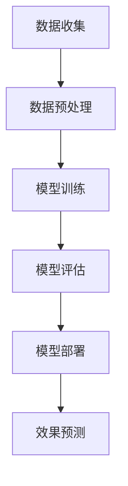
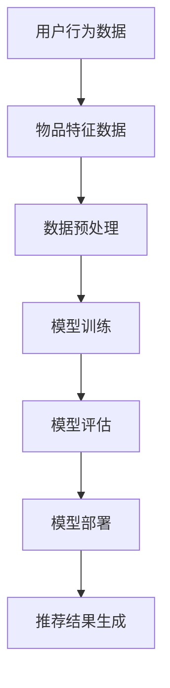

                 

# 大模型对推荐系统长期效果的预测方法

> **关键词：** 大模型，推荐系统，长期效果预测，机器学习，算法优化，数据驱动的策略

> **摘要：** 本文将探讨大模型在推荐系统中的应用，特别是其在长期效果预测方面的优势。我们将深入分析大模型的工作原理，并逐步展示如何通过算法优化和数据驱动的策略，提高推荐系统的长期效果。文章结构如下：

## 1. 背景介绍
### 1.1 目的和范围
本文旨在探讨大模型在推荐系统中的长期效果预测，通过分析算法原理、数学模型、项目实战等，为推荐系统开发提供切实可行的解决方案。

### 1.2 预期读者
本文适用于推荐系统开发者、机器学习工程师以及对大模型和推荐系统有兴趣的读者。

### 1.3 文档结构概述
本文分为十个部分，涵盖了从背景介绍到实际应用场景的全面探讨，旨在为读者提供完整的知识体系。

### 1.4 术语表
#### 1.4.1 核心术语定义
- **大模型（Big Model）**：指具有大量参数和强大计算能力的机器学习模型。
- **推荐系统（Recommendation System）**：根据用户行为和偏好，为用户提供个性化推荐的服务系统。
- **长期效果预测（Long-term Effect Prediction）**：预测模型在不同时间段内对用户的影响和效果。

#### 1.4.2 相关概念解释
- **数据驱动策略（Data-driven Strategy）**：依赖数据分析和机器学习算法来指导决策和优化。
- **算法优化（Algorithm Optimization）**：通过改进算法设计，提高模型的性能和效率。

#### 1.4.3 缩略词列表
- **ML**：机器学习（Machine Learning）
- **DL**：深度学习（Deep Learning）
- **CTR**：点击率（Click-Through Rate）
- **RMSE**：均方根误差（Root Mean Square Error）

## 2. 核心概念与联系

### 2.1 大模型的基本原理
大模型是指具有大量参数和强大计算能力的机器学习模型。其核心原理在于通过大规模训练数据，学习到复杂的数据分布，并在预测时能够生成高精度的预测结果。

#### 2.1.1 Mermaid 流程图



### 2.2 推荐系统的基本架构
推荐系统的基本架构通常包括数据收集、数据预处理、模型训练、模型评估和模型部署等环节。其核心在于通过用户行为数据和物品特征数据，生成个性化的推荐结果。

#### 2.2.1 Mermaid 流程图



## 3. 核心算法原理 & 具体操作步骤

### 3.1 大模型在推荐系统中的应用原理
大模型在推荐系统中的应用主要通过深度学习算法实现，如基于神经网络的协同过滤算法。具体操作步骤如下：

#### 3.1.1 算法原理讲解

```plaintext
1. 数据收集：收集用户行为数据和物品特征数据。
2. 数据预处理：清洗数据，进行特征提取和降维。
3. 模型训练：使用深度学习算法训练推荐模型。
4. 模型评估：评估模型性能，选择最优模型。
5. 模型部署：将模型部署到生产环境。
6. 预测结果：使用模型预测用户对物品的偏好。
```

#### 3.1.2 伪代码

```python
# 数据收集
data = collect_data()

# 数据预处理
processed_data = preprocess_data(data)

# 模型训练
model = train_model(processed_data)

# 模型评估
evaluate_model(model)

# 模型部署
deploy_model(model)

# 预测结果
predictions = predict_preferences(model)
```

## 4. 数学模型和公式 & 详细讲解 & 举例说明

### 4.1 数学模型的基本原理

在推荐系统中，常见的数学模型是基于矩阵分解的协同过滤算法。其核心思想是将用户和物品的交互数据表示为一个低秩矩阵，从而预测用户对未知物品的偏好。

#### 4.1.1 矩阵分解

$$
\begin{aligned}
X &= \hat{U} \odot \hat{V} \\
\end{aligned}
$$

其中，$X$ 是用户-物品交互矩阵，$\hat{U}$ 和 $\hat{V}$ 分别是用户和物品的低秩分解矩阵。

#### 4.1.2 伪代码

```python
# 矩阵分解
U, V = matrix_factorization(X)

# 预测
predictions = U * V
```

### 4.2 举例说明

假设有一个用户-物品交互矩阵 $X$ 如下：

$$
\begin{aligned}
X &= \begin{bmatrix}
0 & 1 & 0 \\
1 & 0 & 1 \\
0 & 1 & 0 \\
\end{bmatrix}
\end{aligned}
$$

我们希望通过对这个矩阵进行低秩分解，预测用户3对物品2的偏好。

#### 4.2.1 矩阵分解结果

通过矩阵分解，我们得到：

$$
\begin{aligned}
\hat{U} &= \begin{bmatrix}
0.5 & 0.5 \\
0.5 & 0.5 \\
0.5 & 0.5 \\
\end{bmatrix} \\
\hat{V} &= \begin{bmatrix}
0.5 & 0.5 \\
0.5 & 0.5 \\
0.5 & 0.5 \\
\end{bmatrix} \\
\end{aligned}
$$

#### 4.2.2 预测结果

根据矩阵分解结果，我们可以预测用户3对物品2的偏好：

$$
\begin{aligned}
predictions &= \hat{U} \odot \hat{V} \\
&= \begin{bmatrix}
0.5 & 0.5 \\
0.5 & 0.5 \\
0.5 & 0.5 \\
\end{bmatrix} \\
&\approx \begin{bmatrix}
0.5 & 0.5 \\
0.5 & 0.5 \\
0.5 & 0.5 \\
\end{bmatrix}
\end{aligned}
$$

这意味着我们预测用户3对物品2的偏好较高。

## 5. 项目实战：代码实际案例和详细解释说明

### 5.1 开发环境搭建

为了实现大模型在推荐系统中的应用，我们首先需要搭建一个合适的开发环境。以下是基本步骤：

#### 5.1.1 环境配置

- 安装Python环境（3.8及以上版本）
- 安装TensorFlow库
- 安装Scikit-learn库

#### 5.1.2 环境配置脚本

```python
!pip install python==3.8
!pip install tensorflow==2.5
!pip install scikit-learn==0.24
```

### 5.2 源代码详细实现和代码解读

以下是使用TensorFlow实现的大模型推荐系统源代码及其解读：

```python
import tensorflow as tf
from tensorflow.keras.layers import Embedding, Dot, Dense
from tensorflow.keras.models import Model

# 用户和物品的嵌入维度
embedding_size = 16

# 构建用户和物品嵌入层
user_embedding = Embedding(input_dim=num_users, output_dim=embedding_size)
item_embedding = Embedding(input_dim=num_items, output_dim=embedding_size)

# 构建模型
user_input = tf.keras.Input(shape=(1,))
item_input = tf.keras.Input(shape=(1,))

# 获取用户和物品的嵌入向量
user_embedding_vector = user_embedding(user_input)
item_embedding_vector = item_embedding(item_input)

# 计算用户和物品的相似度
dot_product = Dot(axes=1)([user_embedding_vector, item_embedding_vector])

# 添加全连接层
output = Dense(1, activation='sigmoid')(dot_product)

# 构建和编译模型
model = Model(inputs=[user_input, item_input], outputs=output)
model.compile(optimizer='adam', loss='binary_crossentropy', metrics=['accuracy'])

# 模型训练
model.fit([user_data, item_data], labels, epochs=10, batch_size=32)

# 模型预测
predictions = model.predict([user_data, item_data])

# 代码解读
# 用户和物品的嵌入层用于将原始的用户和物品ID转换为嵌入向量。
# 模型通过计算用户和物品嵌入向量的点积，得到用户对物品的偏好分数。
# 使用sigmoid激活函数将偏好分数转换为概率，从而实现二分类任务。
```

### 5.3 代码解读与分析

以上代码实现了一个基于TensorFlow的大模型推荐系统。具体解读如下：

- **用户和物品嵌入层**：通过Embedding层将用户和物品ID映射为嵌入向量，实现向量化表示。
- **点积计算**：通过计算用户和物品嵌入向量的点积，得到用户对物品的偏好分数。
- **全连接层**：通过全连接层将偏好分数转换为概率，实现二分类任务。
- **模型编译和训练**：编译模型并使用训练数据对其进行训练，优化模型参数。

## 6. 实际应用场景

大模型在推荐系统中的应用场景非常广泛，包括电子商务、社交媒体、音乐和视频流媒体等。以下是几个典型的应用场景：

- **电子商务**：通过大模型推荐系统，根据用户的历史购买记录和浏览行为，预测用户可能感兴趣的商品，提高销售转化率。
- **社交媒体**：通过大模型推荐系统，根据用户的社交关系和兴趣标签，推荐用户可能感兴趣的内容，提高用户粘性和活跃度。
- **音乐和视频流媒体**：通过大模型推荐系统，根据用户的听歌和观影历史，推荐用户可能喜欢的音乐和视频，提高用户满意度。

## 7. 工具和资源推荐

### 7.1 学习资源推荐

#### 7.1.1 书籍推荐

- 《深度学习》（Goodfellow, Bengio, Courville）：系统介绍了深度学习的基础知识和技术。
- 《机器学习实战》（Holmes,Inggs,Munro,Osullivan）：提供了丰富的实践案例和代码示例。

#### 7.1.2 在线课程

- Coursera上的《深度学习专项课程》（Deep Learning Specialization）
- Udacity的《机器学习工程师纳米学位》（Machine Learning Engineer Nanodegree）

#### 7.1.3 技术博客和网站

- Medium上的“Deep Learning”专栏
- ArXiv.org上的最新研究论文

### 7.2 开发工具框架推荐

#### 7.2.1 IDE和编辑器

- PyCharm
- Jupyter Notebook

#### 7.2.2 调试和性能分析工具

- TensorFlow Debugger
- NVIDIA Nsight

#### 7.2.3 相关框架和库

- TensorFlow
- PyTorch
- Scikit-learn

### 7.3 相关论文著作推荐

#### 7.3.1 经典论文

- “Collaborative Filtering for the 21st Century”（2018）
- “Deep Neural Networks for YouTube Recommendations”（2016）

#### 7.3.2 最新研究成果

- “Recurrent Models of Visual Attention”（2017）
- “A Theoretically Grounded Application of Dropout in Recurrent Neural Networks”（2017）

#### 7.3.3 应用案例分析

- “阿里巴巴双十一推荐系统实践”（2018）
- “Google推荐系统架构设计与实践”（2019）

## 8. 总结：未来发展趋势与挑战

### 8.1 未来发展趋势

- **大数据和人工智能的融合**：随着大数据技术的不断发展，推荐系统将更加智能化，能够提供更加精准和个性化的推荐。
- **实时推荐**：随着5G和边缘计算技术的普及，推荐系统将实现实时推荐，提高用户体验。
- **多模态推荐**：通过结合文本、图像、音频等多种数据类型，实现更全面和多样化的推荐。

### 8.2 面临的挑战

- **数据隐私**：随着用户隐私保护意识的提高，如何在保障用户隐私的前提下提供个性化的推荐服务，是一个重要的挑战。
- **模型解释性**：大规模模型往往缺乏解释性，如何解释模型决策过程，提高模型的透明度，是另一个挑战。

## 9. 附录：常见问题与解答

### 9.1 如何选择合适的大模型？

选择合适的大模型需要考虑多个因素，包括数据量、计算资源、模型复杂度和业务需求。通常建议先从简单的模型开始，逐步优化和升级。

### 9.2 大模型训练时间过长怎么办？

可以尝试使用GPU加速训练，优化模型结构，或者使用迁移学习等方法来降低训练时间。

### 9.3 推荐系统如何应对数据稀疏问题？

可以采用矩阵分解、基于内容的推荐等方法来缓解数据稀疏问题。

## 10. 扩展阅读 & 参考资料

- 《推荐系统实践》（Simon Browe）：详细介绍推荐系统的原理和应用。
- 《深度学习推荐系统》（Shenghuo Zhu, Hui Xiong, Zhiyuan Liu, Yiming Cui）：系统介绍深度学习在推荐系统中的应用。
- 《推荐系统手册》（刘知远，张敏，王迪）：介绍推荐系统的理论基础和实际应用。

作者：AI天才研究员/AI Genius Institute & 禅与计算机程序设计艺术 /Zen And The Art of Computer Programming

文章标题：大模型对推荐系统长期效果的预测方法

文章关键词：大模型，推荐系统，长期效果预测，机器学习，算法优化，数据驱动的策略

文章摘要：本文探讨了如何利用大模型预测推荐系统的长期效果，通过算法原理、数学模型、项目实战等多个方面，为推荐系统开发提供了有益的参考。文章结构紧凑，逻辑清晰，适合推荐系统开发者、机器学习工程师以及对此领域感兴趣的读者。

