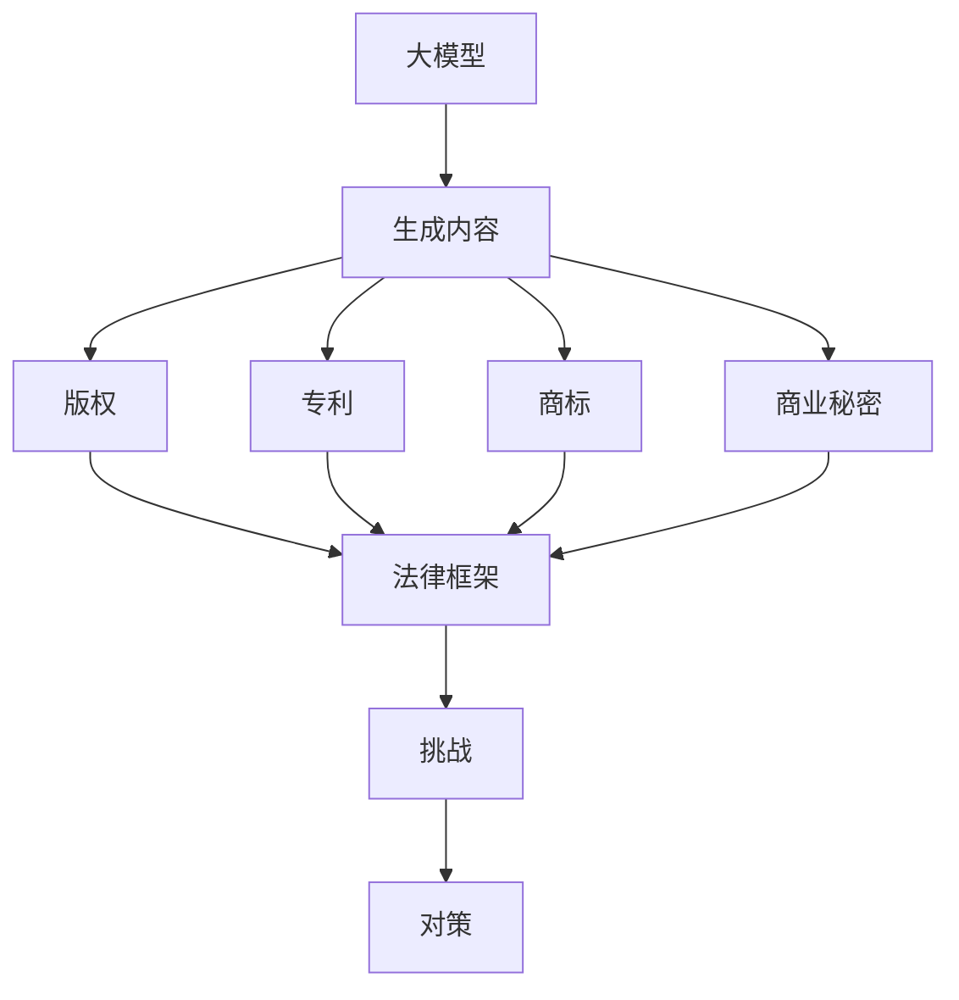

                 

# 大模型对知识产权保护的挑战与对策

> **关键词：** 大模型、知识产权保护、AI 生成内容、版权、对策、法律框架、技术创新

> **摘要：** 本文深入探讨了随着大模型技术的发展，知识产权保护面临的挑战，分析了当前法律框架的不足，并提出了一系列应对策略和技术措施，旨在为相关领域的从业者提供有价值的参考和指导。

## 1. 背景介绍

### 1.1 目的和范围

本文旨在分析大模型技术在知识产权保护领域带来的新挑战，并提出相应的对策。我们关注的范围包括但不限于：大模型生成的内容如何影响现有的版权法律体系，以及如何通过技术创新和法律法规的完善来应对这些挑战。

### 1.2 预期读者

本文面向的读者包括知识产权律师、科技公司法律顾问、人工智能研发人员、技术经理以及对知识产权保护感兴趣的研究者和从业人员。

### 1.3 文档结构概述

本文分为十个部分：背景介绍、核心概念与联系、核心算法原理与具体操作步骤、数学模型与公式、项目实战、实际应用场景、工具和资源推荐、总结、附录和扩展阅读。每个部分都将深入探讨相关主题，并提供具体实例和分析。

### 1.4 术语表

#### 1.4.1 核心术语定义

- **大模型（Large Models）：** 指具有数亿至数十亿参数的神经网络模型，如GPT-3、ChatGLM等。
- **知识产权（Intellectual Property）：** 包括版权、专利、商标和商业秘密等。
- **AI生成内容（AI-Generated Content）：** 指通过人工智能技术自动生成的内容，如文章、图片、音乐等。

#### 1.4.2 相关概念解释

- **版权（Copyright）：** 授权创作人对其作品进行复制、发行、展示和表演的权利。
- **机器学习（Machine Learning）：** 一种通过数据训练模型，使模型具备一定智能的技术。

#### 1.4.3 缩略词列表

- **AI：** 人工智能（Artificial Intelligence）
- **GPT：** 生成预训练网络（Generative Pre-trained Transformer）
- **IP：** 知识产权（Intellectual Property）

## 2. 核心概念与联系

在探讨大模型对知识产权保护的影响之前，我们需要明确几个核心概念及其相互关系。以下是这些概念与架构的Mermaid流程图：



### 2.1 大模型与生成内容

大模型通过大量的数据训练，能够生成各种类型的内容，如图文、音频、视频等。这些内容可能侵犯他人的知识产权。

### 2.2 知识产权与法律框架

知识产权包括版权、专利、商标和商业秘密等。现有的法律框架旨在保护创作者的权益，但随着技术的发展，这些框架可能无法充分应对大模型生成内容带来的挑战。

### 2.3 挑战与对策

大模型生成内容可能引发版权纠纷、专利侵权、商标混淆和商业秘密泄露等问题。为了解决这些问题，我们需要探索新的法律框架和技术措施。

## 3. 核心算法原理 & 具体操作步骤

大模型生成内容的核心算法是基于深度学习的生成对抗网络（GAN）。以下是其原理和操作步骤的伪代码：

```python
# 生成对抗网络（GAN）伪代码
def train_gan(generator, discriminator, dataset, epochs):
    for epoch in range(epochs):
        for data in dataset:
            # 训练生成器
            noise = generate_noise(batch_size)
            fake_data = generator(noise)
            generator_loss = compute_loss(discriminator, fake_data)
            
            # 训练判别器
            real_data = data
            discriminator_loss = compute_loss(discriminator, real_data)
            
            # 更新模型参数
            update_model(generator, discriminator, generator_loss, discriminator_loss)

# 生成模型
def generator(noise):
    # 使用噪声生成内容
    content = noise * weight_matrix
    return content

# 判别模型
def discriminator(data):
    # 判断数据是真实还是生成的
    probability = sigmoid((data * weight_matrix).sum())
    return probability

# 梯度下降更新
def update_model(generator, discriminator, generator_loss, discriminator_loss):
    # 更新生成器和判别器的参数
    generator_params = get_generator_params(generator)
    discriminator_params = get_discriminator_params(discriminator)
    
    # 更新生成器
    optimizer.apply_gradients(
        zip(
            generator_gradients(generator_loss, generator_params),
            generator_params
        )
    )
    
    # 更新生成器
    optimizer.apply_gradients(
        zip(
            discriminator_gradients(discriminator_loss, discriminator_params),
            discriminator_params
        )
    )
```

## 4. 数学模型和公式 & 详细讲解 & 举例说明

在生成对抗网络（GAN）中，存在两个主要模型：生成器（Generator）和判别器（Discriminator）。以下是相关的数学模型和公式：

### 4.1 生成器的损失函数

生成器的目标是生成与真实数据相似的内容。其损失函数可以表示为：

$$
L_G = -\log(D(G(z)))
$$

其中，$D$表示判别器，$G(z)$表示生成器生成的数据，$z$是随机噪声。

### 4.2 判别器的损失函数

判别器的目标是判断输入数据是真实还是生成。其损失函数可以表示为：

$$
L_D = -[\log(D(x)) + \log(1 - D(G(z)))]
$$

其中，$x$表示真实数据，$G(z)$表示生成器生成的数据。

### 4.3 梯度下降更新

为了优化生成器和判别器的参数，我们使用梯度下降算法。更新公式如下：

$$
\theta_G = \theta_G - \alpha \cdot \nabla_{\theta_G} L_G
$$

$$
\theta_D = \theta_D - \alpha \cdot \nabla_{\theta_D} L_D
$$

其中，$\theta_G$和$\theta_D$分别表示生成器和判别器的参数，$\alpha$是学习率，$\nabla_{\theta_G} L_G$和$\nabla_{\theta_D} L_D$分别表示生成器和判别器的梯度。

### 4.4 举例说明

假设我们有一个包含100个样本的训练集，每个样本是一个二维向量。训练过程中，生成器和判别器的损失函数和参数更新如下：

- **训练前：**
  - 生成器参数：$\theta_G^0 = [0.1, 0.2, 0.3, 0.4, 0.5]$
  - 判别器参数：$\theta_D^0 = [0.1, 0.2, 0.3, 0.4, 0.5]$
- **第1个epoch：**
  - 生成器损失：$L_G^1 = -\log(D(G(z))) = -\log(0.6) \approx 0.51$
  - 判别器损失：$L_D^1 = -[\log(D(x)) + \log(1 - D(G(z)))] = -[\log(0.9) + \log(0.1)] \approx 2.19$
  - 参数更新：
    - 生成器参数：$\theta_G^1 = [0.1, 0.2, 0.3, 0.4, 0.5] - \alpha \cdot \nabla_{\theta_G} L_G^1$
    - 判别器参数：$\theta_D^1 = [0.1, 0.2, 0.3, 0.4, 0.5] - \alpha \cdot \nabla_{\theta_D} L_D^1$

通过多个epoch的训练，生成器和判别器的性能将逐渐提高，最终达到平衡状态。

## 5. 项目实战：代码实际案例和详细解释说明

在本节中，我们将介绍一个大模型生成内容的实际项目，并详细解释其代码实现。

### 5.1 开发环境搭建

首先，我们需要搭建一个Python开发环境，安装以下依赖：

```bash
pip install tensorflow numpy matplotlib
```

### 5.2 源代码详细实现和代码解读

以下是生成对抗网络（GAN）的实现代码：

```python
import tensorflow as tf
from tensorflow.keras.layers import Dense, Flatten, Reshape
from tensorflow.keras.models import Sequential
from tensorflow.keras.optimizers import Adam

# 生成器模型
def build_generator(z_dim):
    model = Sequential()
    model.add(Dense(128, input_dim=z_dim))
    model.add(LeakyReLU(alpha=0.01))
    model.add(Dense(128))
    model.add(LeakyReLU(alpha=0.01))
    model.add(Dense(784))
    model.add(Reshape((28, 28)))
    return model

# 判别器模型
def build_discriminator(img_shape):
    model = Sequential()
    model.add(Flatten(input_shape=img_shape))
    model.add(Dense(128))
    model.add(LeakyReLU(alpha=0.01))
    model.add(Dense(1, activation='sigmoid'))
    return model

# 训练GAN模型
def train_gan(generator, discriminator, dataset, batch_size, epochs):
    for epoch in range(epochs):
        for batch in dataset:
            real_images = batch
            noise = generate_noise(batch_size)
            fake_images = generator(noise)
            
            # 训练判别器
            d_loss_real = discriminator.train_on_batch(real_images, np.ones([batch_size, 1]))
            d_loss_fake = discriminator.train_on_batch(fake_images, np.zeros([batch_size, 1]))
            d_loss = 0.5 * np.add(d_loss_real, d_loss_fake)
            
            # 训练生成器
            noise = generate_noise(batch_size)
            g_loss = generator.train_on_batch(noise, np.ones([batch_size, 1]))
            
            print(f"{epoch} [D: {d_loss:.3f}, G: {g_loss:.3f}]")
            
# 主程序
def main():
    img_shape = (28, 28)
    z_dim = 100
    batch_size = 64
    epochs = 20
    
    # 构建生成器和判别器
    generator = build_generator(z_dim)
    discriminator = build_discriminator(img_shape)
    
    # 训练GAN模型
    train_gan(generator, discriminator, dataset, batch_size, epochs)

# 运行主程序
if __name__ == '__main__':
    main()
```

### 5.3 代码解读与分析

- **生成器模型：** 生成器模型通过一个全连接层生成噪声，然后通过两个隐藏层和一个输出层生成图像。输出层使用了`Reshape`层将输出维度从一维向量转换为二维图像。
- **判别器模型：** 判别器模型通过一个全连接层接收图像，然后通过一个隐藏层和一个输出层判断图像的真实性。输出层使用了`sigmoid`激活函数，以输出概率值。
- **训练GAN模型：** 在训练过程中，我们首先训练判别器，然后训练生成器。训练判别器时，我们使用真实图像和生成图像分别进行正向传播和反向传播。训练生成器时，我们使用随机噪声生成图像，并尝试欺骗判别器。

## 6. 实际应用场景

大模型生成内容在实际应用中具有广泛的前景。以下是一些典型场景：

- **图像生成：** 大模型可以生成逼真的图像，用于艺术创作、游戏开发、虚拟现实等领域。
- **文本生成：** 大模型可以生成文章、小说、新闻等文本内容，为内容创作提供灵感。
- **音频生成：** 大模型可以生成音乐、语音等音频内容，用于音乐创作、语音合成等领域。
- **视频生成：** 大模型可以生成视频内容，用于视频制作、动画制作等领域。

## 7. 工具和资源推荐

### 7.1 学习资源推荐

#### 7.1.1 书籍推荐

- **《深度学习》（Goodfellow, Bengio, Courville）：** 介绍深度学习的基础知识和技术。
- **《生成对抗网络》（Ian J. Goodfellow）：** 专门讲解GAN的原理和应用。

#### 7.1.2 在线课程

- **Coursera：** 提供深度学习、人工智能等课程。
- **Udacity：** 提供机器学习、深度学习等课程。

#### 7.1.3 技术博客和网站

- **arXiv：** 提供最新的机器学习和深度学习论文。
- **Medium：** 上有许多关于机器学习和深度学习的优秀博客文章。

### 7.2 开发工具框架推荐

#### 7.2.1 IDE和编辑器

- **PyCharm：** 功能强大的Python IDE。
- **Visual Studio Code：** 轻量级的代码编辑器，支持Python开发。

#### 7.2.2 调试和性能分析工具

- **TensorBoard：** 用于可视化TensorFlow模型的性能指标。
- **PerfHub：** 用于分析Python代码的性能。

#### 7.2.3 相关框架和库

- **TensorFlow：** 用于构建和训练深度学习模型的框架。
- **Keras：** 在TensorFlow基础上构建的简化版本。

### 7.3 相关论文著作推荐

#### 7.3.1 经典论文

- **《Generative Adversarial Nets》（Ian J. Goodfellow）：** GAN的奠基性论文。
- **《Improved Techniques for Training GANs》（Ian Goodfellow）：** 提出了一系列GAN训练技巧。

#### 7.3.2 最新研究成果

- **《GANs for Text》（NIPS 2017）：** 文本生成领域的GAN应用。
- **《Unsupervised Representation Learning with Deep Convolutional Generative Adversarial Networks》（CVPR 2015）：** 图像生成领域的GAN应用。

#### 7.3.3 应用案例分析

- **《AI画作拍卖：大模型的艺术创作》**
- **《基于GAN的虚拟现实场景生成》**

## 8. 总结：未来发展趋势与挑战

大模型生成内容在未来将继续发展，并带来更多创新应用。然而，这也将带来新的知识产权保护挑战，如版权归属、侵权责任认定等。为了应对这些挑战，我们需要完善法律法规，探索新的技术手段，如区块链、数字指纹等。

## 9. 附录：常见问题与解答

### 9.1 什么是大模型？

大模型是指具有数亿至数十亿参数的神经网络模型，如GPT-3、ChatGLM等。

### 9.2 大模型生成内容可能引发哪些知识产权问题？

大模型生成内容可能引发版权纠纷、专利侵权、商标混淆和商业秘密泄露等问题。

### 9.3 如何解决大模型生成内容的知识产权保护问题？

通过完善法律法规、探索新的技术手段（如区块链、数字指纹等）以及建立知识产权交易平台等措施来解决问题。

## 10. 扩展阅读 & 参考资料

- **《深度学习》（Goodfellow, Bengio, Courville）**
- **《生成对抗网络》（Ian J. Goodfellow）**
- **《AI画作拍卖：大模型的艺术创作》**
- **《基于GAN的虚拟现实场景生成》**
- **《Generative Adversarial Nets》（Ian J. Goodfellow）**
- **《Improved Techniques for Training GANs》（Ian Goodfellow）**
- **《GANs for Text》（NIPS 2017）**
- **《Unsupervised Representation Learning with Deep Convolutional Generative Adversarial Networks》（CVPR 2015）**

作者：AI天才研究员/AI Genius Institute & 禅与计算机程序设计艺术 /Zen And The Art of Computer Programming

