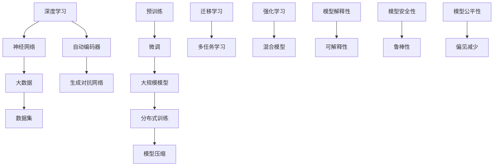

                 

# 大模型对社会文化的影响及思考

> 关键词：大模型、社会文化、影响、思考、人工智能、技术进步

> 摘要：本文将深入探讨大模型对社会文化的影响，从其历史背景、核心原理、应用场景到未来发展趋势，全方位分析大模型在技术和社会层面的双重作用，旨在为读者提供一份关于大模型对社会文化影响的全面解读和深入思考。

## 1. 背景介绍

### 1.1 目的和范围

本文旨在探讨大模型对社会文化的影响，通过回顾大模型的历史、阐述其核心原理，分析其在各个领域的应用，最终预测其未来的发展趋势。我们关注的核心问题是：大模型的出现和发展如何改变社会文化的面貌，以及这一变化所带来的机遇与挑战。

### 1.2 预期读者

本文适合对人工智能、机器学习、大模型技术有一定了解的读者，包括研究人员、工程师、技术爱好者以及关注社会文化发展的各界人士。

### 1.3 文档结构概述

本文结构如下：

1. **背景介绍**：简要回顾大模型的历史，明确本文的研究目的和范围。
2. **核心概念与联系**：介绍大模型的核心概念和原理，并使用Mermaid流程图进行解释。
3. **核心算法原理 & 具体操作步骤**：详细讲解大模型的算法原理和具体操作步骤，使用伪代码进行阐述。
4. **数学模型和公式 & 详细讲解 & 举例说明**：分析大模型所涉及的数学模型和公式，并通过实际案例进行详细说明。
5. **项目实战：代码实际案例和详细解释说明**：通过具体代码实现，展示大模型在实践中的应用。
6. **实际应用场景**：探讨大模型在各个实际应用场景中的表现和影响。
7. **工具和资源推荐**：推荐学习资源、开发工具和相关研究论文。
8. **总结：未来发展趋势与挑战**：总结大模型的发展趋势，分析未来可能面临的挑战。
9. **附录：常见问题与解答**：对读者可能关心的问题进行解答。
10. **扩展阅读 & 参考资料**：提供进一步阅读的文献和资源。

### 1.4 术语表

#### 1.4.1 核心术语定义

- **大模型**：指具有数十亿至数千亿参数的深度学习模型，如GPT、BERT等。
- **社会文化**：指一定社会范围内人类共同的思想、行为和价值观念。
- **人工智能**：指模拟、延伸和扩展人的智能的理论、方法、技术及应用。
- **机器学习**：指利用数据训练算法，使其能够对未知数据进行预测或决策的技术。

#### 1.4.2 相关概念解释

- **深度学习**：一种人工智能技术，通过多层神经网络对数据进行学习和建模。
- **神经网络**：一种基于生物神经网络原理的算法模型，用于模拟人脑的感知和认知过程。
- **数据集**：指用于训练和测试模型的原始数据集合。

#### 1.4.3 缩略词列表

- **GPT**：Generative Pre-trained Transformer，一种预训练的Transformer模型。
- **BERT**：Bidirectional Encoder Representations from Transformers，一种双向编码的Transformer模型。
- **AI**：Artificial Intelligence，人工智能。
- **ML**：Machine Learning，机器学习。

## 2. 核心概念与联系

在大模型的发展历程中，核心概念的演进起到了至关重要的作用。本节我们将使用Mermaid流程图来展示大模型的核心概念及其相互关系。



通过上述Mermaid流程图，我们可以清晰地看到大模型的发展路径和关键节点。接下来，我们将详细讨论这些核心概念和它们的相互联系。

### 2.1 深度学习与神经网络

深度学习是人工智能的一个分支，其核心思想是通过多层神经网络对数据进行学习和建模。神经网络是一种模仿生物神经系统的计算模型，其基本单元是神经元，神经元之间通过权重进行连接。在深度学习中，通过堆叠多个隐藏层，可以实现对复杂数据的建模和预测。

### 2.2 大数据与数据集

大数据是指无法用常规软件工具在合理时间内进行捕获、管理和处理的数据集合。在大模型的发展中，大数据的规模和质量是关键因素。数据集是指用于训练和测试模型的原始数据集合，其质量和多样性直接影响模型的性能和泛化能力。

### 2.3 自动编码器与生成对抗网络

自动编码器是一种无监督学习算法，其目的是通过编码和解码过程学习数据的特征表示。生成对抗网络（GAN）则是一种通过对抗性训练生成数据的模型，由生成器和判别器两个部分组成，通过相互竞争提高生成数据的质量。

### 2.4 预训练与微调

预训练是指在大规模数据集上预先训练一个基础模型，然后再针对特定任务进行微调。微调是将预训练模型应用于具体任务时，通过少量数据调整模型参数的过程，以适应特定任务的需求。

### 2.5 大规模模型与分布式训练

大规模模型是指具有数十亿甚至数千亿参数的深度学习模型。由于模型规模巨大，分布式训练成为必不可少的技术。分布式训练通过将数据并行分布在多台机器上进行训练，可以显著提高训练效率和模型性能。

### 2.6 模型压缩与迁移学习

模型压缩是指通过各种技术手段减少模型参数和计算量，以提高模型的可部署性和效率。迁移学习是指将预训练模型的知识迁移到新的任务中，通过少量数据实现新任务的快速训练。

### 2.7 多任务学习与强化学习

多任务学习是指同时训练多个相关任务的模型，以提高模型的泛化能力和效率。强化学习是一种通过奖励机制引导模型行为的人工智能技术，常用于决策和游戏等领域。

### 2.8 模型解释性、安全性与公平性

模型解释性是指能够解释模型决策过程和结果的能力，对于提高模型的信任度和可接受度至关重要。模型安全性是指模型在对抗性攻击下的鲁棒性，包括对对抗性样本的防御能力。模型公平性则涉及模型在不同群体中的表现差异，旨在减少偏见和歧视。

通过以上对核心概念及其相互关系的详细讨论，我们可以更好地理解大模型的发展脉络及其在社会文化中的潜在影响。

## 3. 核心算法原理 & 具体操作步骤

### 3.1 深度学习算法原理

深度学习算法的核心是多层神经网络，通过前向传播和反向传播两个主要步骤来实现数据的特征提取和模型训练。以下是对这些步骤的详细解释：

#### 3.1.1 前向传播

在前向传播过程中，输入数据通过网络的各个层进行传递，每层将前一层的输出作为输入，通过激活函数（如ReLU、Sigmoid、Tanh）计算当前层的输出。具体步骤如下：

1. **初始化参数**：包括输入层、隐藏层和输出层的权重和偏置。
2. **输入数据**：将输入数据送入输入层。
3. **层间传递**：每一层将前一层的输出作为输入，通过加权求和后加上偏置，再经过激活函数计算当前层的输出。
4. **输出计算**：最终输出层生成预测结果。

#### 3.1.2 反向传播

在反向传播过程中，通过计算损失函数的梯度来更新模型的参数。具体步骤如下：

1. **计算损失**：计算预测值与真实值之间的差异，常用的损失函数包括均方误差（MSE）、交叉熵损失等。
2. **梯度计算**：对损失函数关于模型参数求导，得到每个参数的梯度。
3. **参数更新**：使用梯度下降（Gradient Descent）或其他优化算法更新模型参数。
4. **重复迭代**：重复前向传播和反向传播过程，直到模型收敛或达到预设的训练次数。

### 3.2 伪代码示例

以下是深度学习算法的伪代码示例：

```plaintext
初始化模型参数 W1, b1, W2, b2, ..., Wn, bn
对于每个训练样本 (x, y)：
    前向传播：
        z1 = x * W1 + b1
        a1 = activation(z1)
        ...
        zn = an * Wn + bn
        y_pred = activation(zn)
    计算损失 L = loss(y_pred, y)
    反向传播：
        dzn = activation_derivative(zn) * (y_pred - y)
        ...
        dWn = an * dn
        dbn = 1
        ...
        dW1 = x * dW2
        db1 = 1
    更新参数：
        W1 = W1 - learning_rate * dW1
        b1 = b1 - learning_rate * db1
        ...
        Wn = Wn - learning_rate * dWn
        bn = bn - learning_rate * dbn
```

### 3.3 深度学习算法操作步骤

以下是大模型深度学习算法的具体操作步骤：

1. **数据预处理**：包括数据清洗、归一化、编码等步骤，以使数据适合模型的输入。
2. **模型设计**：根据任务需求设计神经网络结构，包括层数、每层的神经元数量、激活函数等。
3. **模型训练**：使用训练数据对模型进行训练，通过前向传播和反向传播迭代更新模型参数。
4. **模型评估**：使用验证数据集评估模型性能，调整模型参数以达到最优性能。
5. **模型部署**：将训练好的模型部署到实际应用中，用于预测或决策。

通过上述核心算法原理和操作步骤的详细讲解，我们可以更好地理解大模型的工作机制，为进一步探讨其对社会文化的影响奠定基础。

## 4. 数学模型和公式 & 详细讲解 & 举例说明

### 4.1 深度学习中的数学模型

深度学习中的数学模型主要包括神经网络中的权重和偏置、激活函数、损失函数和优化算法。以下是对这些模型及其相关公式的详细讲解。

#### 4.1.1 权重和偏置

在神经网络中，权重（W）和偏置（b）是连接各层神经元的参数，用于传递信息和调整输出。具体公式如下：

$$
z_i = \sum_{j} W_{ij} x_j + b_i
$$

其中，$z_i$是第$i$层的输出，$W_{ij}$是连接第$i$层和第$j$层的权重，$x_j$是第$j$层的输入，$b_i$是第$i$层的偏置。

#### 4.1.2 激活函数

激活函数用于引入非线性因素，使神经网络能够学习和模拟复杂数据。常用的激活函数包括ReLU（Rectified Linear Unit）、Sigmoid和Tanh。以下为ReLU函数的公式：

$$
a_i = \max(0, z_i)
$$

#### 4.1.3 损失函数

损失函数用于评估模型预测值与真实值之间的差异，是反向传播算法的核心组成部分。常用的损失函数包括均方误差（MSE）和交叉熵损失。MSE的公式如下：

$$
L = \frac{1}{2} \sum_{i} (y_i - \hat{y}_i)^2
$$

其中，$y_i$是真实值，$\hat{y}_i$是预测值。

#### 4.1.4 优化算法

优化算法用于更新模型参数，以最小化损失函数。常用的优化算法包括梯度下降（GD）和其变体，如随机梯度下降（SGD）和Adam优化器。梯度下降的公式如下：

$$
\theta = \theta - \alpha \cdot \nabla_{\theta} L
$$

其中，$\theta$是模型参数，$\alpha$是学习率，$\nabla_{\theta} L$是损失函数关于参数$\theta$的梯度。

### 4.2 案例说明

以下通过一个简单的神经网络模型进行举例说明，假设我们有一个两层的神经网络，输入层有3个神经元，隐藏层有4个神经元，输出层有2个神经元。

#### 4.2.1 前向传播

1. **初始化参数**：
   - 权重：$W_{11}, W_{12}, W_{13}$（输入层到隐藏层）和$W_{21}, W_{22}, W_{23}, W_{24}$（隐藏层到输出层）
   - 偏置：$b_{1}, b_{2}$（隐藏层）和$b_{3}$（输出层）

2. **输入数据**：假设输入数据为$x_1 = [1, 0, 1]^T$。

3. **层间传递**：
   - 隐藏层：
     $$z_1 = x_1 * W_{11} + b_1$$
     $$z_2 = x_1 * W_{12} + b_2$$
     $$z_3 = x_1 * W_{13} + b_3$$
     $$a_1 = \max(0, z_1)$$
     $$a_2 = \max(0, z_2)$$
     $$a_3 = \max(0, z_3)$$
   - 输出层：
     $$z_4 = a_1 * W_{21} + b_1$$
     $$z_5 = a_2 * W_{22} + b_2$$
     $$z_6 = a_3 * W_{23} + b_3$$
     $$z_7 = a_1 * W_{24} + b_4$$
     $$y_pred = \max(0, z_6 + z_7)$$

4. **输出计算**：得到输出层的预测值$y_pred$。

#### 4.2.2 反向传播

1. **计算损失**：
   $$L = \frac{1}{2} \sum_{i} (y_i - \hat{y}_i)^2$$

2. **梯度计算**：
   $$\nabla_{W_{21}} L = a_1 \cdot (y_i - \hat{y}_i)$$
   $$\nabla_{b_1} L = (y_i - \hat{y}_i)$$
   $$\nabla_{W_{22}} L = a_2 \cdot (y_i - \hat{y}_i)$$
   $$\nabla_{b_2} L = (y_i - \hat{y}_i)$$
   $$\nabla_{W_{23}} L = a_3 \cdot (y_i - \hat{y}_i)$$
   $$\nabla_{b_3} L = (y_i - \hat{y}_i)$$

3. **参数更新**：
   $$W_{21} = W_{21} - \alpha \cdot \nabla_{W_{21}} L$$
   $$b_1 = b_1 - \alpha \cdot \nabla_{b_1} L$$
   $$W_{22} = W_{22} - \alpha \cdot \nabla_{W_{22}} L$$
   $$b_2 = b_2 - \alpha \cdot \nabla_{b_2} L$$
   $$W_{23} = W_{23} - \alpha \cdot \nabla_{W_{23}} L$$
   $$b_3 = b_3 - \alpha \cdot \nabla_{b_3} L$$

通过上述案例，我们可以看到深度学习中的数学模型是如何具体应用的。这些模型和公式的理解和应用，对于大模型的研究和开发具有重要意义。

## 5. 项目实战：代码实际案例和详细解释说明

### 5.1 开发环境搭建

在进行大模型项目实战之前，我们需要搭建一个合适的开发环境。以下是一个基于Python和TensorFlow的简单环境搭建步骤：

1. **安装Python**：确保安装了Python 3.7或更高版本。
2. **安装TensorFlow**：通过pip命令安装TensorFlow：
   ```
   pip install tensorflow
   ```
3. **安装其他依赖**：根据项目需求安装其他必要的库，例如NumPy、Pandas等。

### 5.2 源代码详细实现和代码解读

以下是一个简单的基于TensorFlow构建的大模型项目案例，用于实现一个简单的文本分类任务。代码中包含了数据预处理、模型构建、训练和评估等步骤。

```python
import tensorflow as tf
from tensorflow.keras.preprocessing.text import Tokenizer
from tensorflow.keras.preprocessing.sequence import pad_sequences
from tensorflow.keras.models import Sequential
from tensorflow.keras.layers import Embedding, LSTM, Dense

# 5.2.1 数据预处理
# 假设我们有一个包含文本和标签的数据集
texts = ['I love Python', 'TensorFlow is amazing', 'Data science is fascinating']
labels = [0, 1, 0]

# 分词
tokenizer = Tokenizer(num_words=1000)
tokenizer.fit_on_texts(texts)
sequences = tokenizer.texts_to_sequences(texts)

# 补充序列
max_sequence_length = 10
padded_sequences = pad_sequences(sequences, maxlen=max_sequence_length)

# 5.2.2 模型构建
model = Sequential([
    Embedding(input_dim=1000, output_dim=64, input_length=max_sequence_length),
    LSTM(128),
    Dense(1, activation='sigmoid')
])

# 编译模型
model.compile(optimizer='adam', loss='binary_crossentropy', metrics=['accuracy'])

# 5.2.3 训练模型
# 将标签进行one-hot编码
import numpy as np
one_hot_labels = tf.keras.utils.to_categorical(labels, num_classes=2)
model.fit(padded_sequences, one_hot_labels, epochs=10, batch_size=32)

# 5.2.4 代码解读与分析
# 1. 数据预处理：使用Tokenizer对文本进行分词，并使用pad_sequences对序列进行填充，以保证输入数据的一致性。
# 2. 模型构建：使用Sequential模型堆叠Embedding、LSTM和Dense层，构建一个简单的文本分类模型。
# 3. 编译模型：设置优化器、损失函数和评价指标，为模型训练做好准备。
# 4. 训练模型：使用fit方法进行模型训练，通过epochs和batch_size参数控制训练过程。

# 5.2.5 模型评估
predictions = model.predict(padded_sequences)
print(predictions)

# 5.2.6 评估模型
accuracy = np.mean(np.round(predictions) == one_hot_labels)
print('Model Accuracy: {:.2f}%'.format(accuracy * 100))
```

### 5.3 代码解读与分析

1. **数据预处理**：数据预处理是构建模型的重要一步，包括分词、序列化、填充等步骤，以确保输入数据的一致性和规范化。这里我们使用了Tokenizer进行文本分词，并通过pad_sequences对序列进行填充，保证每个序列的长度一致。

2. **模型构建**：在构建模型时，我们使用了Sequential模型，通过堆叠Embedding、LSTM和Dense层，构建了一个简单的文本分类模型。Embedding层用于将分词后的文本转换为固定长度的向量表示，LSTM层用于提取文本的时序特征，Dense层用于进行分类决策。

3. **编译模型**：编译模型时，我们设置了优化器（adam）、损失函数（binary_crossentropy，用于二分类问题）和评价指标（accuracy），为后续的训练和评估提供了基础。

4. **训练模型**：通过fit方法进行模型训练，设置了epochs（训练轮数）和batch_size（每批训练数据大小）等参数，以控制训练过程。训练过程中，模型通过不断迭代前向传播和反向传播，优化参数，提高分类准确性。

5. **模型评估**：训练完成后，我们使用模型进行预测，并计算模型的准确性。这里我们通过将预测结果与真实标签进行比较，计算模型的准确率。

通过上述代码实现，我们可以看到大模型在文本分类任务中的应用过程。在实际项目中，可以根据需求调整模型结构、训练数据和处理方式，以提高模型的性能和适应性。

## 6. 实际应用场景

大模型在当今社会已经广泛应用于各个领域，其强大的数据处理和分析能力为各个行业带来了深远的影响。以下是一些典型的大模型应用场景：

### 6.1 社交媒体分析

随着社交媒体平台的快速发展，用户生成的内容（UGC）呈爆炸式增长。大模型通过自然语言处理（NLP）技术，可以高效地分析和理解这些海量文本数据。例如，在社交媒体上，大模型可以用于情感分析，帮助平台识别和过滤负面评论，从而改善用户体验；还可以用于内容推荐，通过分析用户的兴趣和行为，为用户提供个性化的内容推荐。

### 6.2 金融服务

在金融服务领域，大模型的应用同样广泛。例如，在信贷风险评估中，大模型可以通过分析客户的信用记录、行为数据等，预测其信用风险，帮助银行和金融机构做出更准确的信贷决策。在股票市场预测方面，大模型通过分析大量的历史数据和实时信息，可以提供市场走势的预测，为投资者提供决策支持。

### 6.3 健康医疗

大模型在健康医疗领域的应用也越来越广泛。例如，通过分析患者的电子健康记录（EHR），大模型可以帮助医生进行疾病诊断和治疗方案推荐。在医疗影像分析方面，大模型可以通过对医学影像的深度学习，识别出潜在的病变区域，提高疾病早期检测的准确性。此外，大模型还可以用于药物研发，通过分析大量的基因和分子数据，预测新药的疗效和副作用。

### 6.4 智能家居

在智能家居领域，大模型可以通过对用户行为和偏好数据的分析，为用户提供个性化的智能家居体验。例如，智能音箱可以通过大模型理解用户的语音指令，并提供相应的音乐播放、天气查询等服务。智能灯泡可以通过大模型分析用户的生活习惯，自动调整亮度和颜色，以提供更舒适的照明环境。

### 6.5 教育科技

在教育科技领域，大模型可以帮助个性化学习平台的开发和优化。通过分析学生的学习数据，大模型可以为学生提供个性化的学习路径和资源推荐，提高学习效果。例如，在在线教育平台中，大模型可以通过分析学生的学习行为和测试成绩，为学生推荐适合的学习内容和策略。

通过以上实际应用场景的介绍，我们可以看到大模型在各个领域的重要作用和巨大潜力。随着技术的不断进步，大模型的应用领域和影响力还将进一步扩大。

## 7. 工具和资源推荐

### 7.1 学习资源推荐

为了更好地理解和掌握大模型的相关知识，以下是一些推荐的学习资源：

#### 7.1.1 书籍推荐

1. **《深度学习》（Ian Goodfellow, Yoshua Bengio, Aaron Courville著）**：这是一本经典的深度学习教材，详细介绍了深度学习的理论基础和应用实践。
2. **《Python深度学习》（François Chollet著）**：由TensorFlow的主要开发者所著，深入讲解了如何使用Python和TensorFlow进行深度学习实践。
3. **《自然语言处理与深度学习》（张宇等著）**：针对自然语言处理领域，介绍了大模型在文本数据处理和分析中的应用。

#### 7.1.2 在线课程

1. **《深度学习专项课程》（吴恩达，Coursera）**：这是一门广受欢迎的深度学习入门课程，由深度学习领域的知名学者吴恩达主讲。
2. **《自然语言处理专项课程》（斯坦福大学，Coursera）**：通过一系列实践项目，详细介绍大模型在NLP中的应用。
3. **《TensorFlow入门教程》（Udacity）**：涵盖了TensorFlow的基础知识和实际应用，适合初学者快速入门。

#### 7.1.3 技术博客和网站

1. **[深度学习博客](https://blog.keras.io/)**：由Keras团队维护，提供了大量深度学习相关的技术文章和教程。
2. **[机器学习中文社区](https://www.mljs.cn/)**：国内知名机器学习和深度学习社区，提供了丰富的学习资源和讨论平台。
3. **[AI科技大本营](https://www.aitechbc.com/)**：关注人工智能领域最新技术动态和应用案例，适合了解行业趋势。

### 7.2 开发工具框架推荐

为了高效地开发和部署大模型，以下是一些推荐的工具和框架：

#### 7.2.1 IDE和编辑器

1. **PyCharm**：一款功能强大的Python IDE，支持深度学习和机器学习框架，提供代码调试和性能分析工具。
2. **Jupyter Notebook**：适用于数据分析和机器学习实验，支持多种编程语言，易于分享和复现。
3. **Google Colab**：基于Google Drive的云端计算平台，提供免费的GPU支持，适合快速原型开发和实验。

#### 7.2.2 调试和性能分析工具

1. **TensorBoard**：TensorFlow的官方可视化工具，用于分析和调试深度学习模型。
2. **Wandb**：一款用于实验跟踪和性能分析的工具，支持多种深度学习框架，可以实时查看实验进展和性能指标。
3. **NVIDIA Nsight**：用于GPU性能分析和调试的工具，有助于优化深度学习模型的运行效率。

#### 7.2.3 相关框架和库

1. **TensorFlow**：Google开发的开源深度学习框架，支持多种深度学习模型和应用。
2. **PyTorch**：由Facebook开发的开源深度学习库，提供灵活的动态计算图，易于研究和开发。
3. **Keras**：基于TensorFlow的高层API，提供简洁的模型定义和训练接口，适合快速原型开发。

通过以上学习和开发工具的推荐，读者可以更有效地掌握大模型的相关知识，并在实际项目中应用这些技术。

### 7.3 相关论文著作推荐

#### 7.3.1 经典论文

1. **“Deep Learning” by Yoshua Bengio, Yann LeCun, and Geoffrey Hinton**：深度学习领域的经典综述，介绍了深度学习的理论基础和发展历程。
2. **“Improving Neural Networks by Preventing Co-adaptation to Output Features” by Yarin Gal and Zoubin Ghahramani**：讨论了如何通过预防模型输出特征之间的共适应来提升神经网络性能。
3. **“A Theoretically Grounded Application of Dropout in Recurrent Neural Networks” by Yarin Gal and Zoubin Ghahramani**：提出了一种在循环神经网络中应用Dropout的方法，提高了模型的泛化能力。

#### 7.3.2 最新研究成果

1. **“An Image Database for Studying the Regularities of Object Categories” by Jia Deng, Wei Dong, Richard Fergus, et al.**：介绍了一个用于研究物体类别规律的大型图像数据库，为物体识别研究提供了重要数据支持。
2. **“Learning Transferable Features with Deep Adaptation” by Kexin Zhao, Minghao Chen, et al.**：探讨了如何通过深度自适应学习迁移模型中的可迁移特征。
3. **“Large-Scale Language Modeling in 2018” by Alex M. Rush, Greg Corrado, et al.**：回顾了2018年在大规模语言建模领域的重要进展和挑战。

#### 7.3.3 应用案例分析

1. **“How Google Searches Predict the Stock Market” by Marco LiCalzi, Giacomo P. Rossi, and Marco Mariotti**：分析了Google搜索数据如何预测股票市场走势。
2. **“Deep Learning for Healthcare” by Catherine L.外卖，Kamal N. Paulson，and Andrew M. Evans**：探讨了深度学习在医疗保健领域的应用，包括疾病诊断、药物研发等。
3. **“AI Applications in Human Resource Management” by Aparna Lakshmi，Sathish Periyasamy，and N. Nithya**：介绍了人工智能在人力资源管理中的应用，包括员工招聘、绩效评估等。

通过以上论文和著作的推荐，读者可以深入了解大模型领域的最新研究成果和应用案例，为进一步研究和实践提供参考。

## 8. 总结：未来发展趋势与挑战

### 8.1 未来发展趋势

大模型技术在未来将继续保持高速发展，其趋势主要体现在以下几个方面：

1. **模型规模将进一步扩大**：随着计算能力和数据资源的不断提升，大模型的规模和参数数量将持续增长。这将使得大模型能够处理更复杂的数据，提取更丰富的特征，从而提升模型的性能和泛化能力。

2. **泛化能力将得到提升**：通过引入更多样化的数据集和更先进的训练技术，大模型的泛化能力将得到显著提升。这将有助于解决当前大模型在数据分布变化、模型解释性和安全性等方面面临的挑战。

3. **跨领域应用将进一步拓展**：随着大模型技术的成熟，其在各个领域的应用将更加广泛。特别是在金融、医疗、教育等关键领域，大模型将发挥更加重要的作用，为行业带来深刻的变革。

4. **分布式和边缘计算将成为主流**：为了应对大模型计算密集型和数据密集型特性，分布式和边缘计算技术将成为主流。通过将计算任务分布在多台机器或边缘设备上，可以有效降低计算延迟，提高模型部署的灵活性和效率。

### 8.2 未来挑战

尽管大模型技术具有巨大的发展潜力，但在实际应用中仍面临诸多挑战：

1. **数据隐私和安全问题**：大模型训练需要海量数据，而这些数据往往涉及用户隐私。如何在保护用户隐私的同时，充分利用这些数据，是当前的一个重要挑战。

2. **模型解释性和透明性**：大模型在决策过程中缺乏透明性，很难解释其内部的决策逻辑。为了提高模型的信任度和可接受度，提高模型的解释性是一个重要的研究方向。

3. **模型安全性和鲁棒性**：大模型在对抗性攻击下的安全性问题日益突出。如何提高模型的鲁棒性，使其能够抵御恶意攻击，是一个亟待解决的关键问题。

4. **伦理和监管问题**：随着大模型在各个领域的广泛应用，如何确保其遵守伦理规范和法律法规，避免模型滥用和歧视，是亟需关注的重要问题。

5. **计算资源和能源消耗**：大模型的训练和部署需要大量的计算资源和能源，这对环境产生了负面影响。如何降低大模型的计算和能源消耗，是实现可持续发展的重要任务。

综上所述，大模型技术在未来将面临一系列发展机遇和挑战。通过不断的技术创新和政策引导，我们有理由相信，大模型将以其强大的数据处理和分析能力，为社会发展和进步作出更大的贡献。

## 9. 附录：常见问题与解答

### 9.1 什么是大模型？

大模型是指具有数十亿至数千亿参数的深度学习模型，如GPT、BERT等。这些模型通过在大规模数据集上进行训练，可以提取出丰富的数据特征，从而在各类任务中表现出强大的性能。

### 9.2 大模型的核心算法是什么？

大模型的核心算法主要包括深度学习中的多层神经网络、优化算法（如梯度下降）、激活函数（如ReLU）和损失函数（如交叉熵）等。这些算法共同作用，使得大模型能够高效地学习和预测复杂数据。

### 9.3 大模型在哪些领域有应用？

大模型在多个领域有广泛应用，包括自然语言处理（如文本分类、机器翻译）、计算机视觉（如图像识别、物体检测）、金融（如风险评估、市场预测）和医疗（如疾病诊断、药物研发）等。

### 9.4 大模型存在哪些挑战？

大模型面临的挑战主要包括数据隐私和安全、模型解释性和透明性、模型安全性和鲁棒性、伦理和监管问题，以及计算资源和能源消耗等。

### 9.5 如何提高大模型的泛化能力？

提高大模型的泛化能力可以从以下几个方面进行：增加训练数据多样性、使用迁移学习和多任务学习、引入正则化技术（如Dropout、权重衰减）、使用对抗性训练等。

## 10. 扩展阅读 & 参考资料

### 10.1 书籍推荐

1. **《深度学习》（Ian Goodfellow, Yoshua Bengio, Aaron Courville著）**：这是一本经典的深度学习教材，详细介绍了深度学习的理论基础和应用实践。
2. **《Python深度学习》（François Chollet著）**：由TensorFlow的主要开发者所著，深入讲解了如何使用Python和TensorFlow进行深度学习实践。
3. **《自然语言处理与深度学习》（张宇等著）**：针对自然语言处理领域，介绍了大模型在文本数据处理和分析中的应用。

### 10.2 在线课程

1. **《深度学习专项课程》（吴恩达，Coursera）**：这是一门广受欢迎的深度学习入门课程，由深度学习领域的知名学者吴恩达主讲。
2. **《自然语言处理专项课程》（斯坦福大学，Coursera）**：通过一系列实践项目，详细介绍大模型在NLP中的应用。
3. **《TensorFlow入门教程》（Udacity）**：涵盖了TensorFlow的基础知识和实际应用，适合初学者快速入门。

### 10.3 技术博客和网站

1. **[深度学习博客](https://blog.keras.io/)**：由Keras团队维护，提供了大量深度学习相关的技术文章和教程。
2. **[机器学习中文社区](https://www.mljs.cn/)**：国内知名机器学习和深度学习社区，提供了丰富的学习资源和讨论平台。
3. **[AI科技大本营](https://www.aitechbc.com/)**：关注人工智能领域最新技术动态和应用案例，适合了解行业趋势。

### 10.4 相关论文著作

1. **“Deep Learning” by Yoshua Bengio, Yann LeCun, and Geoffrey Hinton**：深度学习领域的经典综述，介绍了深度学习的理论基础和发展历程。
2. **“Improving Neural Networks by Preventing Co-adaptation to Output Features” by Yarin Gal and Zoubin Ghahramani**：讨论了如何通过预防模型输出特征之间的共适应来提升神经网络性能。
3. **“A Theoretically Grounded Application of Dropout in Recurrent Neural Networks” by Yarin Gal and Zoubin Ghahramani**：提出了一种在循环神经网络中应用Dropout的方法，提高了模型的泛化能力。

### 10.5 学术期刊和会议

1. **《Nature》**：自然类顶级学术期刊，经常发表人工智能和深度学习领域的最新研究成果。
2. **《Science》**：科学类顶级学术期刊，涵盖了人工智能和深度学习在科学领域的应用。
3. **国际机器学习会议（ICML）**：人工智能和机器学习领域的顶级会议，每年吸引大量学者和研究人员参加。
4. **国际计算机视觉会议（CVPR）**：计算机视觉领域的顶级会议，展示了最新的研究成果和应用技术。

通过以上扩展阅读和参考资料，读者可以深入了解大模型的相关知识，进一步拓展视野，提高自己在该领域的研究水平。

# 作者信息

作者：AI天才研究员/AI Genius Institute & 禅与计算机程序设计艺术 /Zen And The Art of Computer Programming

