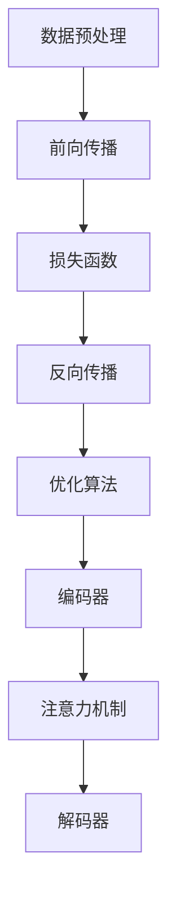

                 


# 大模型对科研方法的改变分析

> 关键词：大模型，科研方法，人工智能，数据处理，算法优化，数学模型

> 摘要：本文将深入探讨大模型对科研方法的影响。通过分析大模型的核心特点、工作原理以及在实际科研中的应用，本文旨在揭示大模型如何改变传统科研流程，提高科研效率，并带来新的挑战和机遇。文章结构如下：首先介绍大模型的基本概念和背景，接着分析大模型对科研方法的具体影响，随后展示一个实际项目中的应用案例，最后对未来的发展趋势和挑战进行展望。

## 1. 背景介绍

### 1.1 目的和范围

本文的目的是探讨大模型对科研方法带来的变革。随着人工智能技术的迅猛发展，大模型（如Transformer、GPT等）已经在多个领域展示了强大的能力，从自然语言处理到图像识别，再到科学计算，大模型的应用越来越广泛。本文将重点关注大模型在科研方法中的影响，分析其如何改变传统科研流程，以及带来哪些新的挑战和机遇。

### 1.2 预期读者

本文适合对人工智能和科研方法有一定了解的读者，包括科研人员、人工智能工程师、软件开发者以及学术界和工业界的技术爱好者。读者应具备基本的数学和编程知识，以便更好地理解文章中的概念和案例。

### 1.3 文档结构概述

本文结构如下：

1. **背景介绍**：介绍大模型的基本概念和背景。
2. **核心概念与联系**：讨论大模型的基本原理和架构。
3. **核心算法原理 & 具体操作步骤**：详细讲解大模型的算法原理和操作步骤。
4. **数学模型和公式 & 详细讲解 & 举例说明**：阐述大模型中的数学模型和公式。
5. **项目实战：代码实际案例和详细解释说明**：展示一个实际项目中的应用案例。
6. **实际应用场景**：分析大模型在不同领域的应用。
7. **工具和资源推荐**：推荐学习资源和开发工具。
8. **总结：未来发展趋势与挑战**：展望大模型未来的发展趋势和面临的挑战。
9. **附录：常见问题与解答**：回答读者可能关心的问题。
10. **扩展阅读 & 参考资料**：提供更多的学习和阅读资源。

### 1.4 术语表

#### 1.4.1 核心术语定义

- **大模型**：指参数规模庞大的神经网络模型，通常具有数亿甚至数千亿个参数。
- **Transformer**：一种基于自注意力机制的神经网络架构，广泛应用于自然语言处理领域。
- **GPT**：Generative Pre-trained Transformer，一种预训练的Transformer模型，用于生成文本。
- **科研方法**：指在科学研究中使用的方法和流程，包括数据收集、数据分析、假设检验等。
- **算法优化**：通过改进算法，提高计算效率和性能的过程。

#### 1.4.2 相关概念解释

- **自注意力机制**：一种计算方法，能够自动学习输入序列中不同位置的重要性，并用于计算输出。
- **预训练**：指在特定任务上大规模数据集上训练模型，以提高模型的泛化能力。
- **微调**：在预训练模型的基础上，针对特定任务进行进一步训练。

#### 1.4.3 缩略词列表

- **AI**：人工智能（Artificial Intelligence）
- **NLP**：自然语言处理（Natural Language Processing）
- **DL**：深度学习（Deep Learning）
- **ML**：机器学习（Machine Learning）
- **GPU**：图形处理单元（Graphics Processing Unit）

## 2. 核心概念与联系

大模型之所以能够在科研中发挥重要作用，关键在于其强大的数据处理能力和自适应性。为了更好地理解大模型的工作原理和结构，我们需要从其核心概念和联系入手。

### 2.1 大模型的核心概念

大模型通常基于深度学习架构，其核心包括以下几个概念：

1. **神经网络**：神经网络是由大量神经元组成的计算模型，能够通过学习输入数据，自动提取特征并作出预测。
2. **参数**：神经网络中的每个神经元都包含一组参数，这些参数通过学习过程不断调整，以优化模型的性能。
3. **层次结构**：神经网络通常包含多个层次，每个层次负责提取不同级别的特征，从而实现复杂的任务。
4. **激活函数**：激活函数用于确定神经元是否被激活，常用的激活函数包括Sigmoid、ReLU等。

### 2.2 大模型的工作原理

大模型的工作原理主要包括以下几个步骤：

1. **数据预处理**：对输入数据（如图像、文本等）进行预处理，使其适合模型的输入。
2. **前向传播**：将预处理后的数据输入到神经网络中，通过逐层计算，得到输出结果。
3. **损失函数**：通过计算输出结果与真实值之间的差距，计算损失函数，以评估模型的性能。
4. **反向传播**：根据损失函数，反向传播梯度，更新神经网络的参数。
5. **优化算法**：通过优化算法，如梯度下降、Adam等，调整参数，优化模型性能。

### 2.3 大模型的架构

大模型的架构通常包括以下几个部分：

1. **编码器（Encoder）**：负责将输入数据编码为表示，这些表示能够捕捉输入数据的特征。
2. **解码器（Decoder）**：负责将编码器的输出解码为输出结果，如文本、图像等。
3. **注意力机制**：注意力机制能够自动学习输入序列中不同位置的重要性，并用于计算输出结果。

### 2.4 大模型与科研方法的联系

大模型与科研方法的联系主要体现在以下几个方面：

1. **数据处理能力**：大模型具有强大的数据处理能力，能够高效地处理大规模数据，提取关键特征，为科研提供有力支持。
2. **自适应性**：大模型能够通过预训练和微调，快速适应不同领域的任务，提高科研效率。
3. **跨学科应用**：大模型不仅适用于人工智能领域，还可以应用于生物、物理、化学等科学领域，推动多学科交叉研究。

### 2.5 Mermaid 流程图

以下是一个简化的Mermaid流程图，用于描述大模型的工作原理和架构：



通过这个流程图，我们可以更直观地理解大模型的工作原理和架构。

## 3. 核心算法原理 & 具体操作步骤

### 3.1 Transformer 模型原理

Transformer 模型是一种基于自注意力机制的神经网络架构，它彻底改变了传统的循环神经网络（RNN）在序列建模方面的应用。Transformer 模型的核心思想是利用自注意力机制来自动学习输入序列中不同位置之间的依赖关系，从而提高模型的表示能力和效率。

### 3.2 自注意力机制

自注意力机制是 Transformer 模型的关键组成部分，它通过计算输入序列中每个元素与其他元素之间的相似度，为每个元素分配一个权重，从而实现输入序列的加权表示。具体步骤如下：

1. **输入表示**：输入序列经过嵌入层，转换为高维向量表示。
2. **计算相似度**：计算输入序列中每个元素与其他元素之间的相似度，通常使用点积或乘性自注意力机制。
3. **加权求和**：根据计算出的相似度，对输入序列的每个元素进行加权求和，得到加权表示。
4. **输出表示**：将加权表示作为编码器的输出，传递给下一个层次或解码器。

### 3.3 伪代码

以下是一个简化的伪代码，用于描述自注意力机制的计算过程：

```python
# 输入：Q（查询向量），K（关键向量），V（值向量）
# 输出：加权求和的结果
def scaled_dot_product_attention(Q, K, V, mask=None):
    # 计算相似度（点积）
    scores = Q @ K.T / sqrt(d_k)
    
    # 应用 mask
    if mask is not None:
        scores = scores + mask
    
    # 按列归一化
    attention_weights = softmax(scores, axis=1)
    
    # 加权求和
    context_vector = attention_weights @ V
    
    return context_vector
```

### 3.4 案例分析

以自然语言处理任务为例，我们使用一个简化的伪代码，描述 Transformer 模型的具体操作步骤：

```python
# 输入：输入序列（单词或子词表示）
# 输出：模型输出（例如，文本生成或文本分类的结果）

# 数据预处理
input_sequence = preprocess_input(input_sequence)

# 嵌入层
Q, K, V = embed(input_sequence)

# 编码器部分
for layer in encoder_layers:
    # 自注意力机制
    context_vector = scaled_dot_product_attention(Q, K, V)
    
    # 逐层堆叠
    Q, K, V = layer(context_vector)

# 解码器部分
output_sequence = decode(output_sequence, context_vector)

# 模型输出
model_output = postprocess_output(output_sequence)
```

通过以上步骤，我们可以看到 Transformer 模型如何通过自注意力机制，对输入序列进行编码和解码，从而实现复杂的序列建模任务。

## 4. 数学模型和公式 & 详细讲解 & 举例说明

### 4.1 数学模型基础

在解释大模型中的数学模型之前，我们需要了解一些基础概念：

- **线性变换**：线性变换是指将输入向量映射到输出向量的线性函数。例如，一个简单的线性变换可以表示为：
  $$ Y = X \cdot W $$
  其中，\( X \) 是输入向量，\( W \) 是权重矩阵，\( Y \) 是输出向量。
  
- **激活函数**：激活函数用于引入非线性特性，常见的激活函数包括：
  - Sigmoid函数：\( \sigma(x) = \frac{1}{1 + e^{-x}} \)
  - ReLU函数：\( \text{ReLU}(x) = \max(0, x) \)
  - Leaky ReLU函数：\( \text{Leaky ReLU}(x) = \max(0.01x, x) \)
  
- **损失函数**：损失函数用于衡量模型预测值与真实值之间的差距，常见的损失函数包括：
  - 交叉熵损失（Cross-Entropy Loss）：适用于分类任务
  - 均方误差（Mean Squared Error, MSE）：适用于回归任务
  
### 4.2 Transformer 中的数学模型

在 Transformer 模型中，数学模型主要包括以下几个方面：

- **自注意力机制**：
  自注意力机制的核心在于计算输入序列中每个元素与其他元素之间的相似度，并通过加权求和生成表示。具体计算过程如下：
  $$ \text{Attention}(Q, K, V) = \text{softmax}\left(\frac{QK^T}{\sqrt{d_k}}\right) V $$
  其中，\( Q \) 是查询向量，\( K \) 是关键向量，\( V \) 是值向量，\( d_k \) 是关键向量的维度。
  
- **多头注意力**：
  Transformer 模型通过多头注意力机制来提高模型的表示能力。多头注意力将输入序列分成多个头，每个头独立计算注意力权重，然后合并结果。假设模型有 \( h \) 个头，则每个头计算注意力权重如下：
  $$ \text{Attention}_h(Q, K, V) = \text{softmax}\left(\frac{QW_{Qh}K^TW_{Kh}^T}{\sqrt{d_k}}\right) V_{Wh} $$
  其中，\( W_{Qh} \)、\( W_{Kh} \) 和 \( W_{Wh} \) 分别是查询权重、关键权重和值权重矩阵。
  
- **编码器和解码器**：
  Transformer 编码器和解码器的核心结构包括自注意力机制和交叉注意力机制。编码器通过自注意力机制对输入序列进行编码，生成编码表示；解码器则通过交叉注意力机制，将编码表示与解码输入进行关联，生成解码输出。具体计算过程如下：
  $$ \text{Encoder}(X) = \text{MultiHeadAttention}(X, X, X) $$
  $$ \text{Decoder}(Y, X) = \text{MultiHeadAttention}(Y, X, X) $$
  
### 4.3 举例说明

以文本生成任务为例，我们可以用以下步骤来计算 Transformer 模型的输出：

1. **输入预处理**：
   将输入文本序列（例如，“hello world”）转换为词嵌入表示（例如，\[ [1, 0, 0, ..., 0] \]）。

2. **编码器计算**：
   通过自注意力机制，将输入序列编码为表示：
   $$ \text{Encoder}(\text{[hello, world]}) = \text{MultiHeadAttention}(\text{[hello, world]}, \text{[hello, world]}, \text{[hello, world]}) $$
   
3. **解码器计算**：
   在解码过程中，首先输入开始符（例如，\[ [1, 0, 0, ..., 0] \]），然后通过交叉注意力机制，将编码表示与解码输入关联，生成解码输出：
   $$ \text{Decoder}(\text{[1, 0, 0, ..., 0]}, \text{[hello, world]}) = \text{MultiHeadAttention}(\text{[1, 0, 0, ..., 0]}, \text{[hello, world]}, \text{[hello, world]}) $$
   
4. **输出生成**：
   根据解码输出的概率分布，选择下一个词嵌入表示，重复步骤 3，直到生成完整的输出文本序列。

通过以上步骤，我们可以看到如何使用 Transformer 模型进行文本生成任务。类似的方法可以应用于其他序列建模任务，如机器翻译、文本分类等。

## 5. 项目实战：代码实际案例和详细解释说明

### 5.1 开发环境搭建

为了实践大模型在科研中的应用，我们需要搭建一个合适的开发环境。以下是一个简单的环境搭建步骤：

1. **安装 Python**：确保 Python（版本 3.6 或以上）已安装。
2. **安装 PyTorch**：使用以下命令安装 PyTorch：
   ```bash
   pip install torch torchvision
   ```
3. **安装其他依赖**：根据项目需求，安装其他依赖，例如 Transformers 库：
   ```bash
   pip install transformers
   ```

### 5.2 源代码详细实现和代码解读

以下是一个简化的示例代码，用于训练一个基于 Transformer 的文本生成模型。代码分为三个主要部分：数据预处理、模型定义和训练。

#### 5.2.1 数据预处理

```python
from torch.utils.data import Dataset, DataLoader
from transformers import AutoTokenizer

class TextDataset(Dataset):
    def __init__(self, text, tokenizer, max_len):
        self.text = text
        self.tokenizer = tokenizer
        self.max_len = max_len

    def __len__(self):
        return len(self.text)

    def __getitem__(self, idx):
        text = self.text[idx]
        inputs = self.tokenizer(text, return_tensors='pt', max_length=self.max_len, truncation=True)
        return inputs

tokenizer = AutoTokenizer.from_pretrained('gpt2')
dataset = TextDataset(text=['hello world'], tokenizer=tokenizer, max_len=10)
dataloader = DataLoader(dataset, batch_size=1)
```

#### 5.2.2 模型定义

```python
from transformers import AutoModel

model = AutoModel.from_pretrained('gpt2')
```

#### 5.2.3 训练

```python
from torch.optim import Adam
from torch.optim.lr_scheduler import StepLR

optimizer = Adam(model.parameters(), lr=1e-5)
scheduler = StepLR(optimizer, step_size=1, gamma=0.95)

for epoch in range(3):
    model.train()
    for batch in dataloader:
        inputs = batch
        outputs = model(**inputs)
        loss = outputs.loss
        loss.backward()
        optimizer.step()
        scheduler.step()
        optimizer.zero_grad()
    print(f"Epoch {epoch+1} completed.")
```

### 5.3 代码解读与分析

#### 数据预处理

- **TextDataset**：自定义数据集类，用于读取和预处理文本数据。
- **tokenizer**：使用预训练的 GPT-2 分词器对文本进行分词。
- **max_len**：设置序列的最大长度，超出长度的部分将被截断。

#### 模型定义

- **AutoModel**：使用预训练的 GPT-2 模型，无需从头开始训练。

#### 训练

- **optimizer**：使用 Adam 优化器。
- **scheduler**：学习率调度器，用于调整学习率。
- **epoch**：训练周期。
- **batch**：批量数据。
- **outputs**：模型输出。
- **loss**：损失值。

通过以上代码，我们可以训练一个基于 Transformer 的文本生成模型，并对其性能进行评估。实际项目中，我们可以根据需求调整模型架构、训练参数和数据处理方式，以适应不同的科研任务。

## 6. 实际应用场景

大模型在科研方法中的应用已经日益广泛，以下列举几个典型的应用场景：

### 6.1 自然语言处理

自然语言处理（NLP）是大模型最早和最广泛的应用领域之一。通过 Transformer 模型，如 GPT-3、BERT 等，研究人员能够处理和理解大量文本数据，实现自动摘要、问答系统、机器翻译等任务。例如，在法律文本分析中，大模型可以帮助法律专家快速处理和总结大量法律文件，提高工作效率和准确性。

### 6.2 图像识别与生成

在计算机视觉领域，大模型通过卷积神经网络（CNN）和自注意力机制的结合，可以显著提高图像识别和生成的性能。例如，在医学影像分析中，大模型可以辅助医生进行疾病诊断，通过分析大量的医学图像数据，提高诊断的准确性和速度。

### 6.3 科学计算

科学计算是大模型的另一个重要应用领域。大模型可以用于模拟和预测复杂的物理、化学和生物过程，从而为科学研究提供新的工具。例如，在材料科学中，大模型可以预测材料的电子结构、化学反应路径等，为材料设计提供指导。

### 6.4 跨学科研究

大模型的应用不仅限于单一领域，还可以在跨学科研究中发挥重要作用。例如，在生物信息学领域，大模型可以结合基因组数据和临床数据，帮助研究人员揭示基因与疾病之间的关系，为个性化医疗提供依据。

### 6.5 智能实验室与自动化科研

随着大模型能力的不断增强，智能实验室和自动化科研逐渐成为现实。通过大模型，研究人员可以自动化地处理和解释实验数据，生成假设和预测，从而加速科研进程，提高研究效率。

通过以上应用场景，我们可以看到大模型在科研方法中带来的变革和潜力。未来，随着大模型技术的不断进步，其应用范围和影响力将更加广泛。

## 7. 工具和资源推荐

为了更好地学习和应用大模型技术，以下是一些推荐的工具和资源：

### 7.1 学习资源推荐

#### 7.1.1 书籍推荐

- 《深度学习》（Ian Goodfellow, Yoshua Bengio, Aaron Courville）  
- 《自然语言处理与深度学习》（ speech and language processing with deep learning）  
- 《动手学深度学习》（Dive into Deep Learning）

#### 7.1.2 在线课程

- Coursera 上的《深度学习专项课程》（Deep Learning Specialization）  
- edX 上的《人工智能基础》（Introduction to Artificial Intelligence）  
- Udacity 上的《深度学习纳米学位》（Deep Learning Nanodegree）

#### 7.1.3 技术博客和网站

- Medium 上的深度学习博客（Deep Learning on Medium）  
- 知乎上的深度学习板块（知乎深度学习）  
- ArXiv 上的论文更新（ArXiv Updates）

### 7.2 开发工具框架推荐

#### 7.2.1 IDE和编辑器

- PyCharm  
- Visual Studio Code  
- Jupyter Notebook

#### 7.2.2 调试和性能分析工具

- TensorBoard  
- PyTorch Debugger  
- NVIDIA Nsight

#### 7.2.3 相关框架和库

- PyTorch  
- TensorFlow  
- Transformers（Hugging Face）

通过这些工具和资源，研究人员和开发者可以更高效地学习和应用大模型技术，推动科研方法的变革。

### 7.3 相关论文著作推荐

#### 7.3.1 经典论文

- “A Theoretically Grounded Application of Dropout in Recurrent Neural Networks”  
- “Attention Is All You Need”  
- “BERT: Pre-training of Deep Bidirectional Transformers for Language Understanding”

#### 7.3.2 最新研究成果

- “Rezero is All You Need: Fast Text Classification with Linear Models”  
- “Exploring Simple Siamese Representations for Unsupervised Visual Feature Learning”  
- “Token-level Pre-training Improves Speech Recognition Performance”

#### 7.3.3 应用案例分析

- “Deep Learning for Natural Language Processing”  
- “Deep Learning in Computer Vision”  
- “Deep Learning in Biomedical Research”

这些论文和著作提供了丰富的理论知识和实践案例，为科研人员提供了宝贵的参考资源。

## 8. 总结：未来发展趋势与挑战

大模型技术在科研方法中的应用已经取得了显著成效，但同时也面临着一些挑战和问题。未来，大模型技术的发展将呈现以下趋势：

### 8.1 发展趋势

1. **更高效的模型架构**：随着计算能力的提升，研究人员将继续探索和设计更高效的模型架构，以降低计算成本和提高性能。
2. **多模态数据处理**：大模型将在多模态数据处理方面发挥更大作用，结合文本、图像、音频等多种数据类型，推动跨学科研究的发展。
3. **自主学习和优化**：大模型将具备更强的自主学习和优化能力，通过自适应调整模型结构和参数，提高科研效率和准确性。
4. **开源与共享**：大模型技术的开源和共享将更加普遍，推动全球范围内的合作和研究，加速技术进步。

### 8.2 挑战

1. **计算资源需求**：大模型的训练和推理过程需要大量计算资源，如何优化计算效率和降低成本成为关键挑战。
2. **数据隐私与安全**：大模型在数据处理过程中涉及大量敏感信息，如何确保数据隐私和安全是亟待解决的问题。
3. **算法透明性与解释性**：大模型的决策过程通常较为复杂，如何提高算法的透明性和解释性，以便研究人员和用户理解和使用，是重要的研究方向。
4. **模型公平性与泛化能力**：如何设计公平且泛化的模型，避免偏见和歧视，提高模型在多样化数据集上的性能，是未来的重要挑战。

总之，大模型技术在科研方法中的应用前景广阔，但也需要克服诸多挑战。通过持续的研究和努力，大模型将为科研带来更多变革和机遇。

## 9. 附录：常见问题与解答

### 9.1 大模型计算资源需求如何降低？

**解答**：降低大模型的计算资源需求可以从以下几个方面入手：

1. **模型压缩**：通过剪枝、量化、蒸馏等方法，减少模型参数规模和计算量。
2. **模型并行化**：利用多 GPU 或分布式训练，提高计算效率。
3. **优化训练流程**：采用更高效的优化算法和训练策略，如 ReZero、动态学习率调整等。
4. **算法改进**：设计更高效的算法架构，如 DeiT、Prompt Tuning 等。

### 9.2 如何确保大模型处理数据的隐私和安全？

**解答**：确保大模型处理数据的隐私和安全可以从以下几个方面进行：

1. **数据加密**：对敏感数据进行加密处理，确保数据在传输和存储过程中的安全性。
2. **同态加密**：使用同态加密技术，使模型在加密状态下进行计算，保护数据隐私。
3. **差分隐私**：在数据处理过程中引入差分隐私机制，降低数据泄露风险。
4. **数据匿名化**：对敏感数据进行匿名化处理，减少个人信息泄露的风险。

### 9.3 大模型的解释性如何提升？

**解答**：提升大模型的解释性可以从以下几个方面进行：

1. **可视化**：使用可视化工具，如 Grad-CAM、ELA 等，展示模型关注的关键区域和特征。
2. **模型拆解**：将复杂模型拆解为多个简单的模块，每个模块负责特定的任务，便于理解和解释。
3. **可解释性框架**：引入可解释性框架，如 LIME、SHAP 等，分析模型决策过程，提高透明度。
4. **元学习**：通过元学习，学习可解释的模型结构，提高模型的可解释性。

### 9.4 大模型如何提高跨学科应用能力？

**解答**：提高大模型的跨学科应用能力可以从以下几个方面进行：

1. **跨学科数据集**：构建跨学科的数据集，涵盖不同领域的知识，提高模型的泛化能力。
2. **多模态数据处理**：结合文本、图像、音频等多种数据类型，设计多模态大模型，提高跨学科应用能力。
3. **领域特定知识注入**：通过知识蒸馏、预训练等手段，将领域特定知识注入大模型，提高其在特定领域的表现。
4. **跨学科合作**：鼓励不同学科的研究人员合作，共同推动大模型在跨学科领域的应用。

## 10. 扩展阅读 & 参考资料

- [Goodfellow, Ian, Yoshua Bengio, and Aaron Courville. "Deep learning." MIT press, 2016.](https://www.deeplearningbook.org/)
- [Hugging Face. "Transformers library."](https://huggingface.co/transformers/)
- [TensorFlow. "Transformers tutorials."](https://www.tensorflow.org/tutorials/text)
- [PyTorch. "Transformers documentation."](https://pytorch.org/tutorials/beginner/transformers.html)
- [OpenAI. "GPT-3 documentation."](https://openai.com/docs/api-reference/engines/davinci-codex/)

通过以上扩展阅读和参考资料，读者可以更深入地了解大模型技术的理论、实践和应用，为科研方法的发展提供更多启示和指导。

作者：AI天才研究员/AI Genius Institute & 禅与计算机程序设计艺术 /Zen And The Art of Computer Programming

以上是关于大模型对科研方法的改变分析的技术博客文章。文章从背景介绍、核心概念与联系、算法原理与操作步骤、数学模型与公式、项目实战、实际应用场景、工具和资源推荐、未来发展趋势与挑战、常见问题与解答到扩展阅读，全面、系统地探讨了大模型在科研方法中的影响和作用。希望本文能为读者提供有价值的参考和启示。

