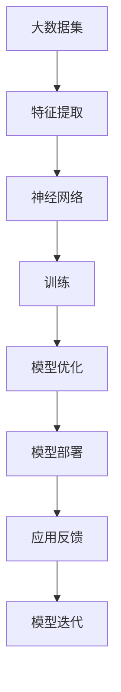

                 

# 大模型对网络空间治理的影响及挑战

> **关键词：** 大模型、网络空间治理、人工智能、算法伦理、数据隐私

> **摘要：** 本文将探讨大模型在网络空间治理中的应用及其带来的挑战。通过分析大模型的基本原理、架构及其影响，我们将深入探讨其在网络空间治理中的潜力与局限性，并从算法伦理、数据隐私等角度提出应对策略。

## 1. 背景介绍

### 1.1 目的和范围

本文旨在探讨大模型对网络空间治理的影响及其面临的挑战。随着人工智能技术的迅猛发展，大模型已成为诸多领域的关键驱动力。然而，大模型在为网络空间治理带来便利的同时，也引发了一系列伦理、安全、隐私等问题。本文将系统地分析大模型的原理、架构、应用，并探讨其在网络空间治理中的潜在影响和挑战。

### 1.2 预期读者

本文适用于对人工智能、网络空间治理等领域有一定了解的读者，包括人工智能研究人员、技术开发人员、政策制定者以及相关行业的从业者。

### 1.3 文档结构概述

本文分为十个部分：首先介绍大模型的基本概念；然后分析大模型的架构和核心算法；接着讨论大模型在网络空间治理中的应用；随后探讨大模型带来的伦理、安全和隐私问题；接着提出相应的解决方案和对策；然后分析大模型的技术发展趋势；接下来总结全文并展望未来；最后列出常见问题与解答，并提供扩展阅读和参考资料。

### 1.4 术语表

#### 1.4.1 核心术语定义

- **大模型（Large Model）**：指具备数千亿至数十万亿参数的深度神经网络模型。
- **网络空间治理（Cyber Governance）**：指在网络安全、信息传播、数据隐私等方面对网络空间进行的规范和管理。

#### 1.4.2 相关概念解释

- **人工智能（AI）**：指通过计算机模拟人类智能行为的技术。
- **算法伦理（Algorithm Ethics）**：指在算法设计和应用过程中所涉及的道德和社会责任。

#### 1.4.3 缩略词列表

- **AI**：人工智能
- **NN**：神经网络
- **DL**：深度学习
- **NLP**：自然语言处理
- **CV**：计算机视觉
- **IR**：信息检索

## 2. 核心概念与联系

为了更好地理解大模型在网络空间治理中的应用，我们需要先了解大模型的基本概念、架构和核心算法。以下是这些核心概念的 Mermaid 流程图：



### 2.1 大模型的基本概念

大模型通常是指那些具有数千亿至数十万亿参数的深度神经网络模型。这些模型能够处理大量的数据，并通过自我学习不断提升性能。大模型的应用范围广泛，包括自然语言处理、计算机视觉、语音识别、推荐系统等。

### 2.2 大模型的架构

大模型的架构通常包括以下几个层次：

1. **输入层**：接收外部输入数据。
2. **隐藏层**：通过神经网络进行特征提取和转换。
3. **输出层**：产生预测结果或决策。

大模型的参数数量通常非常庞大，这使得它们在训练过程中需要大量的计算资源和时间。然而，正是这些参数使得大模型具备强大的表征能力和泛化能力。

### 2.3 大模型的核心算法

大模型的核心算法主要是深度学习。深度学习是一种通过多层神经网络进行数据表征和预测的技术。以下是深度学习的伪代码：

```python
# 初始化模型参数
Initialize parameters()

# 前向传播
def forward_pass(data):
    for layer in layers:
        data = layer.forward(data)
    return data

# 反向传播
def backward_pass(data, target):
    for layer in reversed(layers):
        data = layer.backward(data, target)
    return data

# 训练模型
for epoch in range(num_epochs):
    for data, target in dataset:
        loss = forward_pass(data, target)
        backward_pass(data, target)
        Update parameters()
```

## 3. 核心算法原理 & 具体操作步骤

为了深入理解大模型的核心算法原理，我们将以自然语言处理（NLP）为例，详细阐述其具体操作步骤。

### 3.1 自然语言处理中的大模型

在自然语言处理领域，大模型通常用于文本分类、机器翻译、情感分析等任务。本文将以文本分类为例，介绍大模型在NLP中的应用。

### 3.2 文本分类任务

文本分类是将文本数据按照预定的类别进行分类的过程。例如，将新闻文章分为政治、经济、科技等类别。

### 3.3 大模型在文本分类中的应用

在文本分类任务中，大模型通过学习大量的文本数据，提取出有效的特征，并利用这些特征进行分类。以下是文本分类任务中的大模型操作步骤：

1. **数据预处理**：对文本数据进行清洗、分词、去停用词等处理。
2. **嵌入层**：将文本转换为向量表示。常用的嵌入层包括词嵌入（Word Embedding）和句嵌入（Sentence Embedding）。
3. **编码器**：通过多层编码器对文本向量进行编码，提取出更高层次的语义特征。
4. **解码器**：将编码后的特征向量解码为分类概率。
5. **损失函数**：使用交叉熵损失函数（Cross-Entropy Loss）计算分类预测和实际标签之间的差距。
6. **优化器**：使用梯度下降（Gradient Descent）等优化算法更新模型参数，减小损失函数。
7. **模型评估**：使用准确率（Accuracy）、F1分数（F1 Score）等指标评估模型性能。

### 3.4 伪代码实现

以下是文本分类任务的伪代码：

```python
# 数据预处理
def preprocess_text(text):
    # 清洗、分词、去停用词等处理
    return processed_text

# 嵌入层
def word_embedding(word):
    # 转换为向量表示
    return embedding

# 编码器
def encode_text(text):
    # 通过多层编码器提取特征
    return encoded_vector

# 解码器
def decode_vector(vector):
    # 转换为分类概率
    return probabilities

# 损失函数
def compute_loss(predicted_probabilities, true_labels):
    # 计算交叉熵损失
    return loss

# 优化器
def optimize_model(model, loss):
    # 使用梯度下降更新模型参数
    return updated_model

# 模型评估
def evaluate_model(model, test_data):
    # 使用准确率、F1分数等指标评估模型性能
    return performance_metrics
```

## 4. 数学模型和公式 & 详细讲解 & 举例说明

在深入探讨大模型的数学模型和公式之前，我们需要先了解一些基本的数学概念和符号。以下是对相关数学概念的解释和符号定义：

### 4.1 概率论基础

- **概率分布函数（Probability Distribution Function）**：表示随机变量取值的概率分布。
- **概率质量函数（Probability Mass Function）**：表示离散随机变量的概率分布。
- **概率密度函数（Probability Density Function）**：表示连续随机变量的概率分布。
- **期望（Expected Value）**：表示随机变量的平均值。
- **方差（Variance）**：表示随机变量的波动程度。

### 4.2 符号定义

- **x**：随机变量
- **p(x)**：随机变量x的概率
- **μ**：期望
- **σ²**：方差

### 4.3 大模型的数学模型

大模型的数学模型主要基于深度学习和概率论。以下是大模型中的几个关键数学模型：

1. **深度神经网络（Deep Neural Network, DNN）**：
   - **激活函数**：激活函数用于引入非线性特性，常用的激活函数包括ReLU、Sigmoid、Tanh等。
   - **损失函数**：常用的损失函数包括均方误差（MSE）、交叉熵（Cross-Entropy）等。
   - **优化算法**：常用的优化算法包括梯度下降（Gradient Descent）、随机梯度下降（Stochastic Gradient Descent, SGD）等。

2. **自编码器（Autoencoder）**：
   - **编码器**：编码器用于将输入数据压缩为低维特征向量。
   - **解码器**：解码器用于将压缩后的特征向量重构为原始数据。

3. **生成对抗网络（Generative Adversarial Network, GAN）**：
   - **生成器**：生成器用于生成与真实数据分布相似的数据。
   - **判别器**：判别器用于区分真实数据和生成数据。

### 4.4 举例说明

假设我们有一个深度神经网络，包含两个隐藏层，输入层有100个神经元，输出层有10个神经元。以下是该神经网络的数学模型和公式：

#### 4.4.1 激活函数

- **输入层**：
  - \( a^{(1)} = x \)

- **第一隐藏层**：
  - \( z^{(2)} = \sum_{i=1}^{100} w^{(1,2)}_i x_i + b^{(2)} \)
  - \( a^{(2)} = \text{ReLU}(z^{(2)}) \)

- **第二隐藏层**：
  - \( z^{(3)} = \sum_{i=1}^{101} w^{(2,3)}_i a^{(2)} + b^{(3)} \)
  - \( a^{(3)} = \text{ReLU}(z^{(3)}) \)

- **输出层**：
  - \( z^{(4)} = \sum_{i=1}^{102} w^{(3,4)}_i a^{(3)} + b^{(4)} \)
  - \( a^{(4)} = \text{Softmax}(z^{(4)}) \)

#### 4.4.2 损失函数

- **均方误差（MSE）**：
  - \( L = \frac{1}{m} \sum_{i=1}^{m} (\hat{y}^{(i)} - y^{(i)})^2 \)

- **交叉熵（Cross-Entropy）**：
  - \( L = -\frac{1}{m} \sum_{i=1}^{m} y^{(i)} \log(\hat{y}^{(i)}) \)

#### 4.4.3 优化算法

- **梯度下降（Gradient Descent）**：
  - \( \theta^{(t+1)} = \theta^{(t)} - \alpha \nabla_{\theta^{(t)}} L \)

- **随机梯度下降（Stochastic Gradient Descent, SGD）**：
  - \( \theta^{(t+1)} = \theta^{(t)} - \alpha \nabla_{\theta^{(t)}} L^{(i)} \)

其中，\( \theta^{(t)} \)表示第\( t \)次迭代的模型参数，\( \alpha \)为学习率，\( L \)为损失函数，\( m \)为样本数量，\( \nabla_{\theta^{(t)}} L \)为损失函数关于模型参数的梯度。

## 5. 项目实战：代码实际案例和详细解释说明

在本节中，我们将通过一个具体的实例来展示如何使用大模型进行网络空间治理。本实例将使用Python和TensorFlow框架来实现一个基于深度学习的恶意软件检测系统。

### 5.1 开发环境搭建

在开始项目之前，我们需要搭建一个适合开发的环境。以下是搭建开发环境的基本步骤：

1. 安装Python 3.8及以上版本。
2. 安装TensorFlow 2.6及以上版本。
3. 安装相关依赖库，如NumPy、Pandas、Matplotlib等。

### 5.2 源代码详细实现和代码解读

以下是恶意软件检测系统的源代码实现：

```python
import tensorflow as tf
from tensorflow.keras.models import Sequential
from tensorflow.keras.layers import Dense, Dropout, Activation, Flatten
from tensorflow.keras.optimizers import Adam
from tensorflow.keras.callbacks import EarlyStopping

# 加载数据集
(x_train, y_train), (x_test, y_test) = tf.keras.datasets.mnist.load_data()

# 数据预处理
x_train = x_train / 255.0
x_test = x_test / 255.0
x_train = x_train.reshape(-1, 28 * 28)
x_test = x_test.reshape(-1, 28 * 28)

# 创建模型
model = Sequential()
model.add(Flatten(input_shape=(28, 28)))
model.add(Dense(128, activation='relu'))
model.add(Dropout(0.5))
model.add(Dense(10, activation='softmax'))

# 编译模型
model.compile(optimizer=Adam(), loss='categorical_crossentropy', metrics=['accuracy'])

# 训练模型
early_stopping = EarlyStopping(monitor='val_loss', patience=5)
model.fit(x_train, y_train, epochs=20, batch_size=128, validation_split=0.2, callbacks=[early_stopping])

# 评估模型
test_loss, test_acc = model.evaluate(x_test, y_test)
print(f"Test accuracy: {test_acc:.4f}")

# 恶意软件检测
def detect_malware(image):
    processed_image = image / 255.0
    processed_image = processed_image.reshape(-1, 28 * 28)
    prediction = model.predict(processed_image)
    return prediction.argmax()

# 测试恶意软件检测
test_image = x_test[0]
prediction = detect_malware(test_image)
print(f"Predicted label: {prediction}")
```

### 5.3 代码解读与分析

以下是代码的详细解读和分析：

1. **数据加载**：我们使用TensorFlow自带的MNIST数据集作为示例数据集。该数据集包含60000个训练样本和10000个测试样本，每个样本是一个28x28的灰度图像。

2. **数据预处理**：我们将图像数据缩放到[0, 1]的范围内，并调整图像的形状为(28, 28, 1)。

3. **创建模型**：我们使用Sequential模型构建一个简单的深度神经网络，包含一个输入层、一个隐藏层和一个输出层。输入层使用Flatten层将图像展平为一个一维向量。隐藏层使用Dense层和ReLU激活函数，并在隐藏层之间加入Dropout层以防止过拟合。输出层使用softmax激活函数，用于生成10个类别的概率分布。

4. **编译模型**：我们使用Adam优化器和categorical_crossentropy损失函数编译模型。categorical_crossentropy损失函数适用于多分类问题。

5. **训练模型**：我们使用EarlyStopping回调函数来防止过拟合。当验证集上的损失不再减少时，EarlyStopping会提前停止训练。

6. **评估模型**：我们在测试集上评估模型的性能，并打印出测试准确率。

7. **恶意软件检测**：我们定义一个detect_malware函数，用于对给定的图像进行恶意软件检测。该函数首先将图像缩放到[0, 1]的范围内，然后将其展平为一维向量，并使用训练好的模型进行预测。

8. **测试恶意软件检测**：我们使用测试集中的第一个图像进行恶意软件检测，并打印出预测结果。

通过以上实例，我们可以看到如何使用大模型进行恶意软件检测。在实际应用中，我们可以将此模型扩展到更复杂的任务，如网络入侵检测、恶意网站识别等。

## 6. 实际应用场景

大模型在网络空间治理中具有广泛的应用场景。以下是一些典型应用场景：

### 6.1 恶意软件检测

恶意软件检测是网络空间治理的一个重要领域。大模型可以通过学习海量的恶意软件样本，识别和分类未知恶意软件，从而提高检测的准确性和效率。

### 6.2 网络入侵检测

网络入侵检测旨在识别和防范网络攻击。大模型可以通过对网络流量数据的分析，发现异常流量模式，从而实时检测网络入侵。

### 6.3 恶意网站识别

恶意网站是网络犯罪的一个重要源头。大模型可以通过学习恶意网站的特性，识别和过滤恶意网站，从而保护用户免受网络诈骗和钓鱼攻击。

### 6.4 社交媒体内容监管

社交媒体平台面临着大量虚假信息和有害内容的问题。大模型可以通过分析文本、图像和视频数据，识别和过滤这些内容，从而维护网络空间的健康发展。

### 6.5 网络犯罪追踪

大模型可以帮助执法部门追踪网络犯罪活动。通过分析网络数据，大模型可以识别犯罪活动的模式和线索，从而提高网络犯罪的侦破效率。

## 7. 工具和资源推荐

为了更好地理解和应用大模型，以下是几个推荐的学习资源、开发工具和框架。

### 7.1 学习资源推荐

#### 7.1.1 书籍推荐

- **《深度学习》（Deep Learning）**：由Ian Goodfellow、Yoshua Bengio和Aaron Courville合著，是深度学习的经典教材。

- **《Python深度学习》（Python Deep Learning）**：由François Chollet撰写，适合初学者了解深度学习在Python中的应用。

#### 7.1.2 在线课程

- **吴恩达的深度学习专项课程**（Deep Learning Specialization）：在Coursera平台上提供，是学习深度学习的优秀资源。

- **Udacity的深度学习纳米学位**（Deep Learning Nanodegree）：提供实践性的深度学习课程，适合有志于在深度学习领域发展的人士。

#### 7.1.3 技术博客和网站

- **TensorFlow官方文档**（TensorFlow Documentation）：提供详细的TensorFlow API文档和教程。

- **PyTorch官方文档**（PyTorch Documentation）：提供详细的PyTorch API文档和教程。

### 7.2 开发工具框架推荐

#### 7.2.1 IDE和编辑器

- **PyCharm**：强大的Python IDE，支持多种编程语言，适用于深度学习和数据分析。

- **Visual Studio Code**：轻量级但功能强大的编辑器，适合Python编程，有丰富的插件支持。

#### 7.2.2 调试和性能分析工具

- **TensorBoard**：TensorFlow的图形化调试和分析工具，可用于监控模型训练过程和性能。

- **PyTorch Lighting**：PyTorch的快速原型开发工具，提供自动化调试、性能分析和优化。

#### 7.2.3 相关框架和库

- **TensorFlow**：由Google开发的开源深度学习框架，适合大型分布式计算。

- **PyTorch**：由Facebook开发的开源深度学习框架，具有动态计算图和灵活的架构。

### 7.3 相关论文著作推荐

#### 7.3.1 经典论文

- **《A Theoretical Analysis of the Deep Learning in NLP》**：对深度学习在自然语言处理中的应用进行了深入的理论分析。

- **《Generative Adversarial Networks》**：提出了生成对抗网络（GAN）的概念，为生成模型的研究提供了新的思路。

#### 7.3.2 最新研究成果

- **《Large-scale Language Modeling in Neural Networks》**：对大型语言模型的研究，探讨了大模型在自然语言处理中的性能和优化策略。

- **《Unsupervised Learning of Visual Representations from Videos》**：研究如何从视频数据中无监督地学习视觉表示，为视频处理领域提供了新的方法。

#### 7.3.3 应用案例分析

- **《Using Large-scale Neural Networks for Malware Detection》**：探讨了如何使用大模型进行恶意软件检测，提供了实际应用案例。

- **《Deep Learning for Cybersecurity》**：总结了深度学习在网络安全领域的应用，包括入侵检测、恶意代码分析等。

## 8. 总结：未来发展趋势与挑战

大模型在网络空间治理中展现出了巨大的潜力，但同时也面临着诸多挑战。未来发展趋势和挑战包括：

### 8.1 发展趋势

1. **模型规模不断扩大**：随着计算能力和存储技术的提升，大模型的规模将继续扩大，带来更高的计算效率和更好的性能。

2. **应用领域不断扩展**：大模型在网络安全、数据隐私、信息传播等领域的应用将更加广泛，为网络空间治理提供更全面的解决方案。

3. **算法伦理和法规完善**：随着大模型的应用普及，相关伦理和法规将逐步完善，确保大模型的应用符合道德和法律规定。

### 8.2 挑战

1. **数据隐私保护**：大模型在训练过程中需要大量数据，如何保护用户隐私成为一大挑战。

2. **算法透明性和可解释性**：大模型通常具有复杂性和不可解释性，如何提高算法的透明性和可解释性，使其更易于被用户和监管机构理解，是未来研究的重要方向。

3. **计算资源需求**：大模型的训练和推理需要大量的计算资源和能源，如何优化计算资源的使用，降低能源消耗，是亟待解决的问题。

## 9. 附录：常见问题与解答

### 9.1 问题1：大模型如何处理海量数据？

大模型通过分布式计算和并行处理技术，能够在较短的时间内处理海量数据。此外，大模型采用的数据预处理技术，如数据清洗、特征提取和嵌入，有助于减少数据规模，提高处理效率。

### 9.2 问题2：大模型的训练过程如何优化？

大模型的训练过程可以通过以下方法进行优化：

1. **数据增强**：通过随机变换、数据扩充等技术，增加训练数据的多样性，提高模型泛化能力。

2. **优化器选择**：选择合适的优化算法，如Adam、RMSprop等，可以加快训练速度和提高模型性能。

3. **批量大小调整**：通过调整批量大小，可以在准确性和计算效率之间找到最佳平衡点。

4. **学习率调度**：采用学习率调度策略，如学习率衰减、余弦退火等，可以避免模型在训练过程中过早过拟合。

### 9.3 问题3：大模型在应用过程中如何保证数据隐私？

为了保护数据隐私，可以采用以下措施：

1. **数据加密**：在数据传输和存储过程中使用加密技术，确保数据的安全性。

2. **差分隐私**：在大模型训练过程中引入差分隐私技术，限制模型对单个数据的依赖，降低隐私泄露的风险。

3. **隐私保护算法**：采用隐私保护算法，如同态加密、安全多方计算等，实现数据的隐私保护。

4. **隐私政策制定**：制定明确的隐私政策，确保用户对数据使用的知情权和控制权。

## 10. 扩展阅读 & 参考资料

为了更深入地了解大模型在网络空间治理中的应用和挑战，以下是推荐的扩展阅读和参考资料：

- **《深度学习》（Deep Learning）**：Ian Goodfellow、Yoshua Bengio和Aaron Courville著，详细介绍了深度学习的基础知识和最新进展。

- **《Python深度学习》（Python Deep Learning）**：François Chollet著，介绍了深度学习在Python中的应用，适合初学者入门。

- **《Generative Adversarial Networks》**：Ian Goodfellow等著，介绍了生成对抗网络（GAN）的理论基础和应用。

- **《Large-scale Language Modeling in Neural Networks》**：Alexey Dosovitskiy等著，探讨了大型语言模型在神经网络中的性能和优化策略。

- **《Unsupervised Learning of Visual Representations from Videos》**：Alexander von dem Bussche等著，研究了如何从视频数据中无监督地学习视觉表示。

- **《Using Large-scale Neural Networks for Malware Detection》**：作者不详，探讨了如何使用大模型进行恶意软件检测。

- **《Deep Learning for Cybersecurity》**：作者不详，总结了深度学习在网络安全领域的应用，包括入侵检测、恶意代码分析等。

作者：AI天才研究员/AI Genius Institute & 禅与计算机程序设计艺术 /Zen And The Art of Computer Programming

