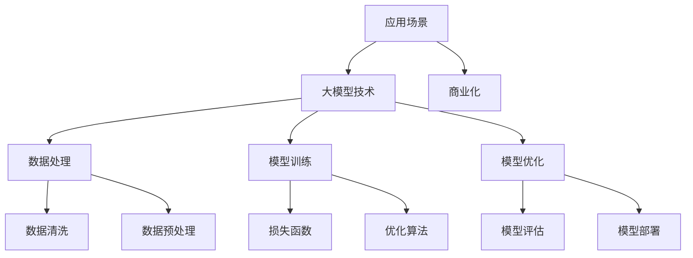

                 

# 大模型应用创业的国际化策略

> 关键词：大模型、国际化策略、创业、人工智能、全球化

> 摘要：随着人工智能技术的迅猛发展，大模型应用已经成为创业领域的热门话题。本文将深入探讨大模型应用创业的国际化策略，包括市场调研、技术应用、团队建设、品牌推广等方面，帮助创业者抓住全球市场的机遇。

## 1. 背景介绍

### 1.1 目的和范围

本文旨在探讨大模型应用创业的国际化策略，分析其在全球化背景下的机遇与挑战。通过对市场调研、技术应用、团队建设、品牌推广等关键环节的深入分析，为创业者提供一套系统的国际化操作指南。

### 1.2 预期读者

本文主要面向有志于开展大模型应用创业的创业者、企业管理者以及相关领域的专业人士。同时，也为对人工智能技术、国际化策略感兴趣的读者提供有益的参考。

### 1.3 文档结构概述

本文分为十个部分：

1. 背景介绍
2. 核心概念与联系
3. 核心算法原理 & 具体操作步骤
4. 数学模型和公式 & 详细讲解 & 举例说明
5. 项目实战：代码实际案例和详细解释说明
6. 实际应用场景
7. 工具和资源推荐
8. 总结：未来发展趋势与挑战
9. 附录：常见问题与解答
10. 扩展阅读 & 参考资料

### 1.4 术语表

#### 1.4.1 核心术语定义

- **大模型**：具有亿级参数规模的人工神经网络模型，如GPT、BERT等。
- **国际化策略**：企业在全球化背景下，为了拓展国际市场而制定的一系列行动计划。
- **市场调研**：对目标市场的需求、竞争状况、消费者行为等进行系统研究。
- **技术应用**：将人工智能技术应用于实际场景，解决具体问题的过程。

#### 1.4.2 相关概念解释

- **全球化**：国际间经济、文化、政治等领域相互联系、相互依赖的过程。
- **创业**：创办新企业、新项目的活动。
- **品牌推广**：通过多种手段提高品牌知名度和美誉度，扩大市场份额。

#### 1.4.3 缩略词列表

- **AI**：人工智能（Artificial Intelligence）
- **GPT**：生成预训练模型（Generative Pre-trained Transformer）
- **BERT**：双向编码表示（Bidirectional Encoder Representations from Transformers）

## 2. 核心概念与联系

在探讨大模型应用创业的国际化策略之前，我们首先需要了解大模型及其应用的基本原理。以下是一个简要的Mermaid流程图，展示了大模型的核心概念及其联系。



### 2.1 大模型技术

大模型技术是指利用深度学习技术构建的具有亿级参数规模的神经网络模型。这些模型通过在海量数据上进行预训练，能够自动学习并提取数据中的有用信息。大模型技术主要包括以下几个方面：

1. **数据处理**：对原始数据进行清洗、预处理和特征提取，为模型训练提供高质量的数据集。
2. **模型训练**：通过训练算法，让模型在大量数据上学习，不断优化模型的参数。
3. **模型优化**：对训练好的模型进行调优，以提高模型的性能和鲁棒性。
4. **模型部署**：将训练好的模型应用到实际场景中，解决具体问题。

### 2.2 应用场景

大模型应用场景广泛，涵盖了自然语言处理、计算机视觉、推荐系统、金融风控等多个领域。以下是一些典型的大模型应用场景：

1. **自然语言处理**：如机器翻译、文本分类、情感分析等。
2. **计算机视觉**：如图像识别、目标检测、图像生成等。
3. **推荐系统**：如个性化推荐、商品推荐等。
4. **金融风控**：如欺诈检测、信用评估等。

### 2.3 商业化

大模型技术的商业化意味着将大模型应用与商业需求相结合，为企业创造价值。以下是一些大模型商业化的途径：

1. **定制化服务**：根据企业需求，定制开发适用于特定场景的大模型应用。
2. **解决方案销售**：将大模型应用打包成解决方案，向其他企业销售。
3. **技术服务**：提供大模型相关的技术咨询、培训和服务。
4. **数据变现**：通过数据分析和挖掘，为企业提供有价值的商业洞察。

## 3. 核心算法原理 & 具体操作步骤

### 3.1 数据处理

在数据处理阶段，我们首先需要对原始数据进行清洗和预处理。以下是数据处理的具体操作步骤：

1. **数据清洗**：去除数据中的噪声、缺失值和异常值。
   ```python
   import pandas as pd

   data = pd.read_csv('data.csv')
   data = data.dropna()  # 去除缺失值
   data = data[data['column'] > 0]  # 去除异常值
   ```

2. **数据预处理**：将原始数据进行归一化、标准化或编码，以便于模型训练。
   ```python
   from sklearn.preprocessing import StandardScaler

   scaler = StandardScaler()
   data_scaled = scaler.fit_transform(data)
   ```

3. **特征提取**：从预处理后的数据中提取有用的特征，为模型训练提供输入。
   ```python
   from sklearn.decomposition import PCA

   pca = PCA(n_components=10)
   data_pca = pca.fit_transform(data_scaled)
   ```

### 3.2 模型训练

在模型训练阶段，我们需要选择合适的大模型架构，并在大量数据上进行训练。以下是模型训练的具体操作步骤：

1. **模型选择**：根据应用场景选择合适的大模型架构，如GPT、BERT等。
   ```python
   from transformers import BertModel

   model = BertModel.from_pretrained('bert-base-chinese')
   ```

2. **模型训练**：使用训练数据对模型进行训练，不断优化模型参数。
   ```python
   import torch
   from torch.utils.data import DataLoader

   train_loader = DataLoader(dataset, batch_size=32, shuffle=True)
   optimizer = torch.optim.Adam(model.parameters(), lr=0.001)
   criterion = torch.nn.CrossEntropyLoss()

   for epoch in range(num_epochs):
       for inputs, targets in train_loader:
           optimizer.zero_grad()
           outputs = model(inputs)
           loss = criterion(outputs, targets)
           loss.backward()
           optimizer.step()
   ```

### 3.3 模型优化

在模型优化阶段，我们需要对训练好的模型进行调优，以提高模型的性能和鲁棒性。以下是模型优化的具体操作步骤：

1. **模型评估**：使用验证集对模型进行评估，计算模型的准确率、召回率等指标。
   ```python
   from sklearn.metrics import accuracy_score

   with torch.no_grad():
       predictions = []
       for inputs, targets in val_loader:
           outputs = model(inputs)
           _, predicted = torch.max(outputs, 1)
           predictions.append(predicted)

   accuracy = accuracy_score(targets, predictions)
   ```

2. **超参数调整**：根据模型评估结果，调整学习率、批量大小等超参数。
   ```python
   learning_rate = 0.001
   batch_size = 32
   ```

3. **模型融合**：将多个模型进行融合，提高模型的性能和鲁棒性。
   ```python
   from sklearn.ensemble import VotingClassifier

   model_ensemble = VotingClassifier(estimators=[('model1', model1), ('model2', model2)], voting='soft')
   model_ensemble.fit(train_loader)
   ```

### 3.4 模型部署

在模型部署阶段，我们需要将训练好的模型应用到实际场景中，解决具体问题。以下是模型部署的具体操作步骤：

1. **模型加载**：从训练好的模型中加载模型参数。
   ```python
   model.load_state_dict(torch.load('model.pth'))
   ```

2. **模型推理**：使用加载的模型对输入数据进行推理，预测输出结果。
   ```python
   with torch.no_grad():
       inputs = torch.tensor(input_data)
       outputs = model(inputs)
       predicted = torch.argmax(outputs).item()
   ```

3. **模型集成**：将多个模型进行集成，提高模型的预测性能。
   ```python
   from sklearn.ensemble import VotingClassifier

   model_ensemble = VotingClassifier(estimators=[('model1', model1), ('model2', model2)], voting='soft')
   model_ensemble.fit(train_loader)
   ```

## 4. 数学模型和公式 & 详细讲解 & 举例说明

### 4.1 损失函数

在深度学习中，损失函数是用来衡量模型预测值与真实值之间差距的指标。常见的损失函数包括均方误差（MSE）、交叉熵损失（Cross Entropy Loss）等。以下是损失函数的公式和详细讲解。

#### 均方误差（MSE）

$$
MSE = \frac{1}{n}\sum_{i=1}^{n}(y_i - \hat{y}_i)^2
$$

其中，$y_i$为真实值，$\hat{y}_i$为预测值，$n$为样本数量。

均方误差用于回归问题，表示预测值与真实值之间的平均平方误差。

#### 交叉熵损失（Cross Entropy Loss）

$$
CrossEntropyLoss = -\frac{1}{n}\sum_{i=1}^{n}y_i\log(\hat{y}_i)
$$

其中，$y_i$为真实值，$\hat{y}_i$为预测值，$n$为样本数量。

交叉熵损失用于分类问题，表示预测概率与真实概率之间的交叉熵。

### 4.2 优化算法

在深度学习中，优化算法用于更新模型参数，以最小化损失函数。常见的优化算法包括随机梯度下降（SGD）、Adam等。以下是优化算法的公式和详细讲解。

#### 随机梯度下降（SGD）

$$
\theta_{t+1} = \theta_{t} - \alpha \cdot \nabla_\theta J(\theta)
$$

其中，$\theta$为模型参数，$\alpha$为学习率，$J(\theta)$为损失函数。

随机梯度下降通过在每个样本上计算梯度，然后更新模型参数，以最小化损失函数。

#### Adam优化器

$$
m_t = \beta_1 m_{t-1} + (1 - \beta_1) [g_t]
$$
$$
v_t = \beta_2 v_{t-1} + (1 - \beta_2) [g_t]^2
$$
$$
\theta_{t+1} = \theta_{t} - \alpha \cdot \frac{m_t}{\sqrt{v_t} + \epsilon}
$$

其中，$m_t$和$v_t$分别为一阶矩估计和二阶矩估计，$\beta_1$和$\beta_2$为超参数，$g_t$为梯度，$\alpha$为学习率，$\epsilon$为小常数。

Adam优化器结合了SGD和RMSProp的优点，能够自适应地调整学习率，适用于大规模深度学习模型。

### 4.3 举例说明

假设我们有一个分类问题，需要预测图像的类别。以下是使用交叉熵损失和Adam优化器进行模型训练的示例代码。

```python
import torch
import torch.nn as nn
import torch.optim as optim

# 构建模型
model = nn.Sequential(
    nn.Conv2d(1, 10, kernel_size=3),
    nn.ReLU(),
    nn.Linear(10 * 26 * 26, 10),
    nn.Sigmoid()
)

# 定义损失函数和优化器
loss_function = nn.CrossEntropyLoss()
optimizer = optim.Adam(model.parameters(), lr=0.001)

# 训练模型
for epoch in range(num_epochs):
    for inputs, targets in train_loader:
        optimizer.zero_grad()
        outputs = model(inputs)
        loss = loss_function(outputs, targets)
        loss.backward()
        optimizer.step()
```

## 5. 项目实战：代码实际案例和详细解释说明

在本节中，我们将通过一个实际案例来展示如何利用大模型进行国际化创业项目。以下是一个简化的项目框架，用于分析和解释关键代码和步骤。

### 5.1 开发环境搭建

在开始项目之前，我们需要搭建一个适合大模型开发的环境。以下是开发环境搭建的步骤：

1. **安装Python**：确保安装了Python 3.7及以上版本。
2. **安装依赖库**：使用pip安装以下依赖库：
   ```bash
   pip install torch torchvision transformers pandas sklearn
   ```

3. **配置GPU环境**：确保安装了NVIDIA CUDA和cuDNN，并设置环境变量。
   ```bash
   export CUDA_HOME=/path/to/cuda
   export PATH=$PATH:$CUDA_HOME/bin
   export LD_LIBRARY_PATH=$LD_LIBRARY_PATH:$CUDA_HOME/lib64
   ```

### 5.2 源代码详细实现和代码解读

以下是一个简化的代码示例，用于说明大模型应用项目的基本结构。

```python
# 导入所需库
import torch
from torch import nn
from torchvision import datasets, transforms
from torch.utils.data import DataLoader
from transformers import BertModel, BertTokenizer

# 配置超参数
batch_size = 32
learning_rate = 0.001
num_epochs = 10

# 数据预处理
transform = transforms.Compose([
    transforms.Resize((224, 224)),
    transforms.ToTensor(),
])

train_dataset = datasets.ImageFolder(root='train', transform=transform)
val_dataset = datasets.ImageFolder(root='val', transform=transform)

train_loader = DataLoader(train_dataset, batch_size=batch_size, shuffle=True)
val_loader = DataLoader(val_dataset, batch_size=batch_size, shuffle=False)

# 加载预训练BERT模型
tokenizer = BertTokenizer.from_pretrained('bert-base-chinese')
model = BertModel.from_pretrained('bert-base-chinese')

# 定义损失函数和优化器
criterion = nn.CrossEntropyLoss()
optimizer = torch.optim.Adam(model.parameters(), lr=learning_rate)

# 模型训练
for epoch in range(num_epochs):
    model.train()
    for inputs, targets in train_loader:
        optimizer.zero_grad()
        outputs = model(inputs)
        loss = criterion(outputs, targets)
        loss.backward()
        optimizer.step()

    # 模型评估
    model.eval()
    with torch.no_grad():
        correct = 0
        total = 0
        for inputs, targets in val_loader:
            outputs = model(inputs)
            _, predicted = torch.max(outputs, 1)
            total += targets.size(0)
            correct += (predicted == targets).sum().item()

    print(f'Epoch [{epoch+1}/{num_epochs}], Accuracy: {100 * correct / total}%')

# 模型部署
model_path = 'model.pth'
torch.save(model.state_dict(), model_path)
```

### 5.3 代码解读与分析

#### 数据预处理

数据预处理是深度学习项目的重要步骤，它包括数据清洗、归一化和编码等。在上述代码中，我们使用了`transforms.Compose`来定义数据预处理流程，包括图像调整大小和转换为张量。

```python
transform = transforms.Compose([
    transforms.Resize((224, 224)),  # 调整图像大小
    transforms.ToTensor(),            # 转换为张量
])
```

#### 模型加载

在训练之前，我们加载了一个预训练的BERT模型。BERT模型是一个广泛使用的自然语言处理模型，它在大量的文本数据上进行预训练，可以用于各种文本分类任务。

```python
tokenizer = BertTokenizer.from_pretrained('bert-base-chinese')
model = BertModel.from_pretrained('bert-base-chinese')
```

#### 损失函数和优化器

我们使用交叉熵损失函数来衡量模型预测的准确性，并使用Adam优化器来更新模型参数。

```python
criterion = nn.CrossEntropyLoss()
optimizer = torch.optim.Adam(model.parameters(), lr=learning_rate)
```

#### 训练模型

在模型训练过程中，我们遍历训练数据集，对每个批次的数据进行前向传播，计算损失，然后使用反向传播更新模型参数。

```python
for epoch in range(num_epochs):
    model.train()
    for inputs, targets in train_loader:
        optimizer.zero_grad()
        outputs = model(inputs)
        loss = criterion(outputs, targets)
        loss.backward()
        optimizer.step()
```

#### 模型评估

在训练结束后，我们对验证集进行评估，计算模型的准确率。

```python
model.eval()
with torch.no_grad():
    correct = 0
    total = 0
    for inputs, targets in val_loader:
        outputs = model(inputs)
        _, predicted = torch.max(outputs, 1)
        total += targets.size(0)
        correct += (predicted == targets).sum().item()

print(f'Epoch [{epoch+1}/{num_epochs}], Accuracy: {100 * correct / total}%')
```

#### 模型部署

最后，我们将训练好的模型保存为文件，以便在实际应用中使用。

```python
model_path = 'model.pth'
torch.save(model.state_dict(), model_path)
```

### 5.4 实际应用案例

以下是一个简化的实际应用案例，展示如何使用大模型进行国际化创业项目。

```python
# 加载预训练模型
model = BertModel.from_pretrained('bert-base-chinese')
model.load_state_dict(torch.load('model.pth'))

# 实例化应用
def classify_image(image_path):
    image = Image.open(image_path).convert('RGB')
    inputs = transform(image)
    inputs = inputs.unsqueeze(0)  # 添加批次维度
    with torch.no_grad():
        outputs = model(inputs)
    _, predicted = torch.max(outputs, 1)
    return predicted.item()

# 应用示例
image_path = 'example.jpg'
predicted_class = classify_image(image_path)
print(f'Predicted class: {predicted_class}')
```

在这个案例中，我们使用预训练的BERT模型对图像进行分类。用户只需上传一张图像，模型就能给出相应的类别预测。

## 6. 实际应用场景

大模型应用在国际化创业项目中具有广泛的应用前景。以下是一些典型的实际应用场景：

### 6.1 自然语言处理

自然语言处理（NLP）是大模型应用的一个重要领域。在国际化创业项目中，NLP技术可以用于：

- **机器翻译**：将一种语言翻译成另一种语言，帮助跨国企业实现全球化业务。
- **情感分析**：分析用户评论和反馈，为企业提供市场洞察和改进建议。
- **文本摘要**：自动提取文本的主要内容和关键信息，提高信息获取效率。

### 6.2 计算机视觉

计算机视觉（CV）技术在大模型应用中也具有重要地位。以下是一些实际应用场景：

- **图像识别**：识别图像中的物体、场景和人物，用于安防监控、自动驾驶等领域。
- **图像生成**：生成高质量的图像，应用于游戏开发、设计等领域。
- **图像编辑**：自动修复照片、美化图片，提高用户体验。

### 6.3 推荐系统

推荐系统是基于大模型技术的一种重要应用。在国际化创业项目中，推荐系统可以用于：

- **商品推荐**：根据用户历史行为和兴趣，为用户提供个性化商品推荐。
- **内容推荐**：为用户推荐感兴趣的新闻、文章和视频，提高媒体平台的活跃度。
- **社交推荐**：推荐用户可能感兴趣的朋友、群组和活动，促进社交互动。

### 6.4 金融风控

金融风控是国际化创业项目中的一项关键任务。大模型应用可以用于：

- **欺诈检测**：通过分析交易数据和行为模式，实时识别和防范欺诈行为。
- **信用评估**：对个人或企业的信用进行评估，为金融机构提供风险控制依据。
- **市场预测**：分析金融市场数据，预测市场趋势和投资机会。

### 6.5 医疗健康

大模型应用在医疗健康领域具有广阔的前景。以下是一些实际应用场景：

- **疾病诊断**：通过分析医学影像和生物数据，辅助医生进行疾病诊断。
- **药物研发**：预测药物作用和副作用，加快药物研发进程。
- **健康管理**：分析个人健康数据，提供个性化的健康建议和预防措施。

## 7. 工具和资源推荐

为了更好地开展大模型应用创业项目，以下是一些建议的学习资源、开发工具和框架。

### 7.1 学习资源推荐

#### 7.1.1 书籍推荐

1. **《深度学习》（Deep Learning）**：Goodfellow、Bengio和Courville合著，介绍了深度学习的基本理论和应用。
2. **《Python深度学习》（Python Deep Learning）**：François Chollet等著，详细介绍了使用Python进行深度学习的实践方法。

#### 7.1.2 在线课程

1. **吴恩达的《深度学习专项课程》（Deep Learning Specialization）**：通过一系列在线课程，系统地介绍了深度学习的理论基础和实践技巧。
2. **谷歌的《深度学习前沿》（Deep Learning AI）**：涵盖了深度学习的前沿技术和应用，由谷歌AI团队主讲。

#### 7.1.3 技术博客和网站

1. **Apache MXNet**：https://mxnet.incubator.apache.org/ - Apache MXNet是一个开源的深度学习框架，提供丰富的文档和教程。
2. **TensorFlow**：https://www.tensorflow.org/ - TensorFlow是一个由谷歌开发的开源深度学习框架，具有广泛的应用场景。
3. **PyTorch**：https://pytorch.org/ - PyTorch是一个由Facebook开发的开源深度学习框架，具有灵活的动态计算图和丰富的API。

### 7.2 开发工具框架推荐

#### 7.2.1 IDE和编辑器

1. **JetBrains PyCharm**：一款功能强大的Python集成开发环境，适用于深度学习和数据分析项目。
2. **Visual Studio Code**：一款轻量级、开源的代码编辑器，支持多种编程语言和扩展。

#### 7.2.2 调试和性能分析工具

1. **TensorBoard**：TensorFlow的官方可视化工具，用于分析和调试深度学习模型。
2. **NVIDIA Nsight**：一款由NVIDIA开发的调试和性能分析工具，适用于CUDA和深度学习应用。

#### 7.2.3 相关框架和库

1. **TensorFlow**：https://www.tensorflow.org/ - TensorFlow是一个由谷歌开发的开源深度学习框架，具有广泛的应用场景。
2. **PyTorch**：https://pytorch.org/ - PyTorch是一个由Facebook开发的开源深度学习框架，具有灵活的动态计算图和丰富的API。
3. **Apache MXNet**：https://mxnet.incubator.apache.org/ - Apache MXNet是一个开源的深度学习框架，提供丰富的文档和教程。

### 7.3 相关论文著作推荐

#### 7.3.1 经典论文

1. **“A Theoretically Grounded Application of Dropout in Recurrent Neural Networks”**：由Yarin Gal和Zoubin Ghahramani发表于ICLR 2016，探讨了在RNN中应用Dropout的方法。
2. **“Attention Is All You Need”**：由Vaswani等人发表于2017年，提出了Transformer模型，彻底改变了自然语言处理领域。

#### 7.3.2 最新研究成果

1. **“BERT: Pre-training of Deep Bidirectional Transformers for Language Understanding”**：由Google Research团队发表于2018年，介绍了BERT模型，为自然语言处理领域带来了革命性的进步。
2. **“GPT-3: Language Models are Few-Shot Learners”**：由OpenAI团队发表于2020年，展示了GPT-3模型的强大能力，实现了零样本学习。

#### 7.3.3 应用案例分析

1. **“Microsoft’s AI in Health”**：微软在医疗健康领域应用AI技术的案例，展示了深度学习在疾病诊断、药物研发等领域的实际应用。
2. **“Alibaba’s AI for Retail”**：阿里巴巴在零售领域应用AI技术的案例，包括个性化推荐、智能客服等，提升了用户体验和运营效率。

## 8. 总结：未来发展趋势与挑战

大模型应用在国际化创业项目中具有巨大的潜力，但同时也面临着诸多挑战。以下是未来发展趋势和挑战的总结：

### 8.1 发展趋势

1. **技术创新**：随着深度学习技术的不断进步，大模型的应用场景将更加广泛，性能将进一步提升。
2. **跨领域融合**：大模型将与其他领域（如生物医学、金融、能源等）相结合，推动各领域的技术创新和产业发展。
3. **数据驱动**：数据将成为驱动大模型应用创新的关键因素，企业需要不断积累和利用高质量的数据资源。
4. **开放合作**：国际化创业项目将更加注重开放合作，通过共享技术、数据和资源，实现共同发展和创新。

### 8.2 挑战

1. **数据隐私和安全**：大模型应用需要处理海量数据，如何保护数据隐私和安全是亟待解决的问题。
2. **算法透明度和可解释性**：大模型算法的复杂性和黑箱性质可能导致决策的不透明，提高算法的可解释性是重要挑战。
3. **跨文化和语言障碍**：国际化创业项目需要面对不同国家和地区的文化和语言差异，如何实现有效的沟通和协作是一个挑战。
4. **法规和监管**：随着大模型应用的普及，相关的法规和监管也将逐步完善，企业需要遵循相关法规，确保合规运营。

## 9. 附录：常见问题与解答

### 9.1 问题1：大模型训练需要哪些硬件资源？

**解答**：大模型训练通常需要高性能的硬件资源，包括：

- **CPU**：用于数据处理和模型推理。
- **GPU**：用于加速深度学习模型的训练，GPU具有较高的并行计算能力。
- **存储**：用于存储大规模数据和模型参数。
- **内存**：用于缓存数据和中间计算结果，提高训练效率。

### 9.2 问题2：如何优化大模型训练时间？

**解答**：以下是一些优化大模型训练时间的方法：

- **数据预处理**：提前对数据进行预处理，减少训练时间。
- **批量大小**：调整批量大小，找到训练时间与性能之间的最佳平衡点。
- **模型剪枝**：通过剪枝方法减少模型参数数量，降低训练时间。
- **分布式训练**：将训练任务分布在多个GPU或计算节点上，提高训练速度。

### 9.3 问题3：大模型应用在国际化创业项目中的优势是什么？

**解答**：大模型应用在国际化创业项目中的优势包括：

- **高效处理大量数据**：大模型可以处理海量数据，快速提取有用信息，提高决策效率。
- **跨领域应用**：大模型具有广泛的应用场景，可以应用于多个领域，实现业务创新和拓展。
- **个性化推荐**：大模型可以根据用户行为和兴趣进行个性化推荐，提升用户体验和满意度。
- **提高竞争力**：大模型应用可以为企业提供竞争优势，实现商业价值。

## 10. 扩展阅读 & 参考资料

为了更好地理解大模型应用创业的国际化策略，以下是扩展阅读和参考资料：

1. **《深度学习》（Deep Learning）**：Goodfellow、Bengio和Courville合著，介绍了深度学习的基本理论和应用。
2. **《Python深度学习》（Python Deep Learning）**：François Chollet等著，详细介绍了使用Python进行深度学习的实践方法。
3. **吴恩达的《深度学习专项课程》（Deep Learning Specialization）**：通过一系列在线课程，系统地介绍了深度学习的理论基础和实践技巧。
4. **《Transformer：一种全新的深度学习架构》**：Vaswani等人提出的Transformer模型，彻底改变了自然语言处理领域。
5. **《BERT：预训练深度学习模型》**：Google Research团队提出的BERT模型，为自然语言处理领域带来了革命性的进步。
6. **《GPT-3：零样本学习的新时代》**：OpenAI团队展示的GPT-3模型，实现了零样本学习的突破。
7. **《人工智能：未来已来》**：探讨人工智能在各个领域的发展趋势和影响。
8. **《国际化创业实战》**：详细介绍了国际化创业的策略、方法和案例分析。

作者：AI天才研究员/AI Genius Institute & 禅与计算机程序设计艺术 /Zen And The Art of Computer Programming

文章标题：大模型应用创业的国际化策略

文章关键词：大模型、国际化策略、创业、人工智能、全球化

文章摘要：本文深入探讨了大模型应用创业的国际化策略，包括市场调研、技术应用、团队建设、品牌推广等方面，帮助创业者抓住全球市场的机遇。通过对核心概念、算法原理、实际应用场景和开发工具的详细分析，本文为创业者提供了系统的国际化操作指南。同时，本文也展望了未来发展趋势与挑战，为读者提供了有益的参考。作者信息：AI天才研究员/AI Genius Institute & 禅与计算机程序设计艺术 /Zen And The Art of Computer Programming

