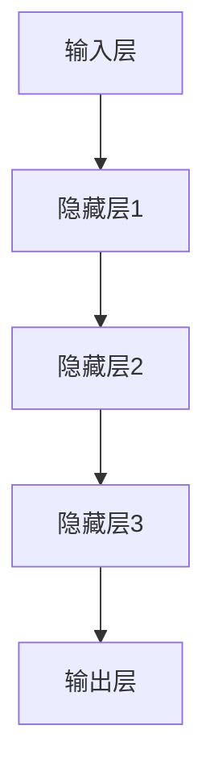

                 

# 大模型应用层的创业挑战

## 关键词
- 大模型
- 应用层
- 创业挑战
- 技术门槛
- 数据资源
- 实际应用
- 商业模式
- 风险管理

## 摘要

大模型作为人工智能领域的重要突破，已经在各行各业中展现出巨大的潜力。然而，在应用层的大模型创业面临着诸多挑战，包括技术门槛、数据资源、商业模式、风险管理等方面。本文将从多个角度深入分析这些挑战，并探讨解决方案，为有意进军大模型应用层的创业者提供参考。

## 1. 背景介绍

### 1.1 目的和范围

本文旨在探讨大模型在应用层创业过程中所面临的主要挑战，并提供一些建设性的解决方案。文章将涵盖以下几个方面：

- 大模型的基本概念和技术原理
- 应用层创业中的核心挑战
- 针对挑战的解决方案和实践经验
- 未来发展趋势与潜在风险

### 1.2 预期读者

本文适用于以下读者群体：

- 有意投身大模型应用层创业的个人和企业
- 人工智能领域的研究者和技术开发者
- 对大模型技术有浓厚兴趣的普通读者

### 1.3 文档结构概述

本文的结构如下：

- 第2章：核心概念与联系
- 第3章：核心算法原理与具体操作步骤
- 第4章：数学模型和公式与详细讲解
- 第5章：项目实战：代码实际案例和详细解释说明
- 第6章：实际应用场景
- 第7章：工具和资源推荐
- 第8章：总结：未来发展趋势与挑战
- 第9章：附录：常见问题与解答
- 第10章：扩展阅读与参考资料

### 1.4 术语表

#### 1.4.1 核心术语定义

- 大模型：指使用海量数据进行训练，具有超强学习能力和泛化能力的神经网络模型。
- 应用层：指大模型在具体业务场景中的实际应用，如自然语言处理、计算机视觉、语音识别等。
- 创业挑战：指在创业过程中遇到的困难、障碍或问题。
- 技术门槛：指在技术实现上所需要达到的难度和复杂度。

#### 1.4.2 相关概念解释

- 数据资源：指用于训练和测试大模型的原始数据集。
- 商业模式：指企业盈利的方式和策略。
- 风险管理：指对企业可能面临的风险进行识别、评估和应对。

#### 1.4.3 缩略词列表

- AI：人工智能
- NLP：自然语言处理
- CV：计算机视觉
- GPT：生成式预训练模型
- DNN：深度神经网络

## 2. 核心概念与联系

大模型作为人工智能领域的重要突破，已经成为当今科技发展的热点。其核心概念包括以下几个方面：

### 2.1 大模型的基本原理

大模型，通常是指那些拥有数亿甚至千亿级别参数的深度神经网络模型。这些模型通过在海量数据上学习，获得了极强的表达能力和泛化能力。大模型的核心原理主要包括：

1. **深度神经网络（DNN）**：大模型的基础是深度神经网络，通过层层神经网络的结构，实现从输入到输出的映射。
2. **预训练与微调**：大模型首先在大规模数据集上进行预训练，然后针对特定任务进行微调。
3. **优化算法**：大模型训练过程中，使用高效的优化算法（如Adam、SGD等）来更新模型参数。

### 2.2 大模型的架构

大模型的架构通常包括以下几个层次：

1. **输入层**：接收外部输入，如文本、图像、声音等。
2. **隐藏层**：通过多层神经网络进行特征提取和抽象。
3. **输出层**：生成预测结果或输出决策。

下面是一个简化的大模型架构的Mermaid流程图：



### 2.3 大模型的应用领域

大模型在各个领域都有广泛应用，主要包括：

1. **自然语言处理（NLP）**：如文本生成、机器翻译、情感分析等。
2. **计算机视觉（CV）**：如图像分类、目标检测、图像生成等。
3. **语音识别**：如语音到文本转换、语音合成等。
4. **推荐系统**：如基于内容的推荐、协同过滤等。

## 3. 核心算法原理与具体操作步骤

### 3.1 算法原理

大模型的训练过程主要包括以下几个步骤：

1. **数据预处理**：对原始数据进行清洗、标准化、划分训练集和验证集。
2. **模型初始化**：随机初始化模型参数。
3. **前向传播**：将输入数据通过模型进行前向传播，得到输出预测。
4. **损失计算**：计算输出预测与真实值之间的差距，即损失。
5. **反向传播**：根据损失计算模型参数的梯度，并更新模型参数。
6. **迭代优化**：重复上述步骤，直到模型收敛。

### 3.2 具体操作步骤

下面是一个基于PyTorch框架的大模型训练的伪代码：

```python
# 数据预处理
def preprocess_data(data):
    # 清洗、标准化等操作
    return processed_data

# 模型初始化
model = DNNModel()

# 定义优化器
optimizer = Adam(model.parameters(), lr=0.001)

# 训练循环
for epoch in range(num_epochs):
    for batch in data_loader:
        # 前向传播
        output = model(batch.input)
        loss = calculate_loss(output, batch.target)

        # 反向传播
        optimizer.zero_grad()
        loss.backward()
        optimizer.step()

        # 打印训练信息
        print(f"Epoch {epoch}, Loss: {loss.item()}")

# 模型评估
evaluate_model(model, validation_data)
```

## 4. 数学模型和公式与详细讲解

### 4.1 数学模型

大模型的训练过程中，涉及到多个数学模型和公式。以下是其中几个重要的模型和公式：

1. **损失函数（Loss Function）**：

   常见的损失函数包括均方误差（MSE）、交叉熵（Cross-Entropy）等。

   $$ 
   MSE = \frac{1}{n}\sum_{i=1}^{n}(y_i - \hat{y}_i)^2 
   $$

   $$ 
   Cross-Entropy = -\sum_{i=1}^{n}y_i \log(\hat{y}_i) 
   $$

2. **优化算法（Optimization Algorithm）**：

   常见的优化算法包括随机梯度下降（SGD）、Adam等。

   $$ 
   \theta_{t+1} = \theta_{t} - \alpha \nabla_{\theta}L(\theta) 
   $$

   $$ 
   \theta_{t+1} = \theta_{t} - \frac{\alpha}{\sqrt{1-tau}}\nabla_{\theta}L(\theta) + \beta_1 \theta_{t} - \beta_2 \theta_{t-1} 
   $$

3. **激活函数（Activation Function）**：

   常见的激活函数包括ReLU、Sigmoid、Tanh等。

   $$ 
   ReLU(x) = \max(0, x) 
   $$

   $$ 
   Sigmoid(x) = \frac{1}{1 + e^{-x}} 
   $$

   $$ 
   Tanh(x) = \frac{e^x - e^{-x}}{e^x + e^{-x}} 
   $$

### 4.2 举例说明

假设我们使用交叉熵损失函数来训练一个二元分类模型。以下是具体的训练步骤：

1. **数据预处理**：

   将输入数据$x$和标签$y$进行预处理，得到标准化的输入$x'$和标签$y'$。

   $$ 
   x' = \frac{x - \mu}{\sigma} 
   $$

   $$ 
   y' = \frac{y - \bar{y}}{\bar{y}} 
   $$

2. **模型初始化**：

   初始化模型参数$w$和$b$。

   $$ 
   w \sim \mathcal{N}(0, \frac{1}{\sqrt{n}}) 
   $$

   $$ 
   b \sim \mathcal{N}(0, \frac{1}{\sqrt{n}}) 
   $$

3. **前向传播**：

   将输入$x'$通过模型进行前向传播，得到输出$\hat{y}$。

   $$ 
   \hat{y} = \sigma(wx + b) 
   $$

   其中，$\sigma$是Sigmoid激活函数。

4. **损失计算**：

   计算输出$\hat{y}$和标签$y'$之间的交叉熵损失。

   $$ 
   Loss = -\sum_{i=1}^{n}y'_i \log(\hat{y}_i) 
   $$

5. **反向传播**：

   计算损失关于模型参数$w$和$b$的梯度，并更新参数。

   $$ 
   \nabla_{w}Loss = \sum_{i=1}^{n}(\hat{y}_i - y'_i)x_i' 
   $$

   $$ 
   \nabla_{b}Loss = \sum_{i=1}^{n}(\hat{y}_i - y'_i) 
   $$

   $$ 
   w_{t+1} = w_t - \alpha \nabla_{w}Loss 
   $$

   $$ 
   b_{t+1} = b_t - \alpha \nabla_{b}Loss 
   $$

6. **迭代优化**：

   重复上述步骤，直到模型收敛。

## 5. 项目实战：代码实际案例和详细解释说明

### 5.1 开发环境搭建

为了实现大模型的训练和应用，需要搭建一个合适的开发环境。以下是具体的步骤：

1. **安装Python**：确保Python版本在3.6及以上。
2. **安装PyTorch**：使用pip命令安装PyTorch。

   ```shell
   pip install torch torchvision
   ```

3. **安装其他依赖库**：根据项目需求，安装其他必要的库，如NumPy、Pandas、Matplotlib等。

### 5.2 源代码详细实现和代码解读

下面是一个基于PyTorch的大模型训练的代码示例：

```python
# 导入必要的库
import torch
import torchvision
import torchvision.transforms as transforms
from torch.utils.data import DataLoader
import torch.nn as nn
import torch.optim as optim

# 数据预处理
transform = transforms.Compose([
    transforms.ToTensor(),
    transforms.Normalize((0.5, 0.5, 0.5), (0.5, 0.5, 0.5)),
])

# 加载MNIST数据集
train_set = torchvision.datasets.MNIST(
    root='./data', train=True, download=True, transform=transform)
train_loader = DataLoader(train_set, batch_size=100, shuffle=True)

# 定义模型
class DNNModel(nn.Module):
    def __init__(self):
        super(DNNModel, self).__init__()
        self.fc1 = nn.Linear(784, 500)
        self.fc2 = nn.Linear(500, 250)
        self.fc3 = nn.Linear(250, 10)

    def forward(self, x):
        x = x.view(-1, 784)
        x = torch.relu(self.fc1(x))
        x = torch.relu(self.fc2(x))
        x = self.fc3(x)
        return x

# 初始化模型和优化器
model = DNNModel()
optimizer = optim.SGD(model.parameters(), lr=0.01, momentum=0.9)

# 训练模型
num_epochs = 10
for epoch in range(num_epochs):
    for i, (inputs, labels) in enumerate(train_loader):
        # 前向传播
        outputs = model(inputs)
        loss = nn.CrossEntropyLoss()(outputs, labels)

        # 反向传播和优化
        optimizer.zero_grad()
        loss.backward()
        optimizer.step()

        if (i+1) % 100 == 0:
            print(f'Epoch [{epoch+1}/{num_epochs}], Step [{i+1}/{len(train_loader)}], Loss: {loss.item()}')

# 评估模型
with torch.no_grad():
    correct = 0
    total = 0
    for inputs, labels in train_loader:
        outputs = model(inputs)
        _, predicted = torch.max(outputs.data, 1)
        total += labels.size(0)
        correct += (predicted == labels).sum().item()

    print(f'Accuracy of the network on the train images: {100 * correct / total}%')
```

### 5.3 代码解读与分析

上面的代码实现了一个简单的大模型训练过程。下面是对代码的详细解读：

1. **数据预处理**：

   使用`transforms.Compose`组合预处理步骤，包括将图像转换为张量（`ToTensor`）和标准化（`Normalize`）。

2. **加载数据集**：

   使用`torchvision.datasets.MNIST`加载MNIST数据集，并使用`DataLoader`进行批量加载。

3. **定义模型**：

   使用`nn.Module`创建自定义模型`DNNModel`，包括三个全连接层，每层之间使用ReLU激活函数。

4. **初始化模型和优化器**：

   初始化模型和优化器，这里使用SGD优化器。

5. **训练模型**：

   使用两个嵌套的循环进行模型训练。外层循环是epoch，内层循环是每个epoch中的批量。

   - 前向传播：将输入通过模型进行前向传播，计算输出和损失。
   - 反向传播和优化：计算损失关于模型参数的梯度，并更新参数。

6. **评估模型**：

   使用评估数据集对模型进行评估，计算准确率。

## 6. 实际应用场景

大模型在各个领域都有广泛的应用，以下是一些典型的实际应用场景：

1. **自然语言处理（NLP）**：

   - 文本生成：使用GPT-3等大模型生成文章、故事、摘要等。
   - 机器翻译：如谷歌翻译、百度翻译等，使用大模型进行高质量翻译。
   - 情感分析：对社交媒体、新闻评论等进行情感分析，识别用户情绪。

2. **计算机视觉（CV）**：

   - 图像分类：如ImageNet挑战，使用大模型进行图像分类。
   - 目标检测：如YOLO、Faster R-CNN等，使用大模型进行目标检测。
   - 图像生成：如GAN、StyleGAN等，使用大模型生成逼真的图像。

3. **语音识别**：

   - 语音到文本转换：如苹果的Siri、谷歌助手等，使用大模型进行语音识别。
   - 语音合成：如谷歌文本到语音（Text-to-Speech，TTS）系统，使用大模型生成自然流畅的语音。

4. **推荐系统**：

   - 基于内容的推荐：如亚马逊、Netflix等，使用大模型进行个性化推荐。
   - 协同过滤：如淘宝、京东等，使用大模型进行用户行为分析，提高推荐效果。

## 7. 工具和资源推荐

### 7.1 学习资源推荐

#### 7.1.1 书籍推荐

- 《深度学习》（Deep Learning），Ian Goodfellow、Yoshua Bengio、Aaron Courville 著
- 《动手学深度学习》（Dive into Deep Learning），Amit Kumar、Adish Singla、Ahuva Mualem 著

#### 7.1.2 在线课程

- Coursera上的“深度学习专项课程”（Deep Learning Specialization）
- edX上的“人工智能基础”（Introduction to Artificial Intelligence）

#### 7.1.3 技术博客和网站

- arXiv.org：最新人工智能论文发布平台
- Medium.com：AI相关文章集中发布平台

### 7.2 开发工具框架推荐

#### 7.2.1 IDE和编辑器

- PyCharm：功能强大的Python IDE
- Visual Studio Code：轻量级但功能丰富的编辑器

#### 7.2.2 调试和性能分析工具

- NVIDIA Nsight：用于深度学习模型的调试和性能分析
- PyTorch Profiler：PyTorch模型的性能分析工具

#### 7.2.3 相关框架和库

- PyTorch：开源深度学习框架
- TensorFlow：开源深度学习框架
- Keras：基于TensorFlow的简单易用的深度学习库

### 7.3 相关论文著作推荐

#### 7.3.1 经典论文

- "A Theoretical Basis for Deep Learning"，Yoshua Bengio et al.（2009）
- "Deep Learning: A Methodology and Theoretical Framework"，Ian Goodfellow et al.（2015）

#### 7.3.2 最新研究成果

- "Generative Adversarial Nets"，Ian Goodfellow et al.（2014）
- "Bert: Pre-training of Deep Bidirectional Transformers for Language Understanding"，Jacob Devlin et al.（2018）

#### 7.3.3 应用案例分析

- "The Application of Deep Learning in Computer Vision"，Christian Szegedy et al.（2013）
- "Deep Learning for Speech Recognition"，Geoffrey Hinton et al.（2013）

## 8. 总结：未来发展趋势与挑战

随着技术的不断进步，大模型在应用层的创业将面临以下发展趋势和挑战：

### 发展趋势

1. **计算能力提升**：随着硬件性能的提升，大模型的计算能力将越来越强，应用范围将进一步扩大。
2. **算法优化**：研究人员将继续优化大模型训练算法，提高训练效率和性能。
3. **跨领域融合**：大模型将在更多领域（如生物医疗、金融、教育等）得到应用，实现跨领域融合。

### 挑战

1. **技术门槛**：大模型的训练和部署需要大量计算资源和专业知识，对于初创企业来说，这是一个重大挑战。
2. **数据资源**：高质量、大规模的数据集对于大模型训练至关重要，但获取和整理这些数据是一项艰巨的任务。
3. **商业模式**：如何在大模型应用中找到可持续的商业模式，是创业者需要认真思考的问题。
4. **风险管理**：大模型在处理敏感数据时可能带来潜在风险，如何进行有效的风险管理是一个重要挑战。

## 9. 附录：常见问题与解答

### 9.1 大模型训练需要哪些硬件资源？

大模型训练通常需要高性能的GPU（图形处理单元），尤其是具有多张显卡的配置。此外，还需要大量的内存和存储空间来存储数据和模型。

### 9.2 大模型的训练过程如何优化？

优化大模型训练可以从以下几个方面进行：

1. **数据预处理**：对数据进行适当的预处理，提高数据质量。
2. **模型选择**：选择适合任务的大模型架构。
3. **优化算法**：选择高效的优化算法，如Adam、SGD等。
4. **分布式训练**：使用分布式训练技术，利用多张显卡进行训练。

### 9.3 如何评估大模型的效果？

评估大模型效果可以从以下几个方面进行：

1. **准确率（Accuracy）**：预测正确的样本数占总样本数的比例。
2. **召回率（Recall）**：预测正确的正样本数占总正样本数的比例。
3. **F1值（F1 Score）**：准确率和召回率的调和平均值。
4. **ROC曲线（Receiver Operating Characteristic Curve）**：评估模型分类能力的一种方法。

## 10. 扩展阅读 & 参考资料

- [Goodfellow, I., Bengio, Y., & Courville, A. (2016). Deep Learning. MIT Press.](https://www.deeplearningbook.org/)
- [Bengio, Y. (2009). A Theoretical Basis for Deep Learning. Journal of Machine Learning Research.](https://jmlr.org/papers/volume10/bengio09a/bengio09a.pdf)
- [Devlin, J., Chang, M. W., Lee, K., & Toutanova, K. (2018). BERT: Pre-training of Deep Bidirectional Transformers for Language Understanding. Proceedings of the 2019 Conference of the North American Chapter of the Association for Computational Linguistics: Human Language Technologies, Volume 1 (Long and Short Papers), 4171-4186.](https://www.aclweb.org/anthology/N19-1194/)
- [Goodfellow, I., Pouget-Abadie, J., Mirza, M., Xu, B., Warde-Farley, D., Ozair, S., ... & Bengio, Y. (2014). Generative Adversarial Nets. Advances in Neural Information Processing Systems, 27.](https://proceedings.neurips.cc/paper/2014/file/5ca3e9b1227c9f5e3e613aef2a18f88e-Paper.pdf)
- [Hinton, G., Deng, L., Yu, D., Dahl, G. E., Mohamed, A. R., Jaitly, N., ... & Kingsbury, B. (2013). Deep Neural Networks for Acoustic Modeling in Speech Recognition: The Shared Views of Four Research Groups. IEEE Signal Processing Magazine, 29(6), 82-97.](https://ieeexplore.ieee.org/document/6756971)

