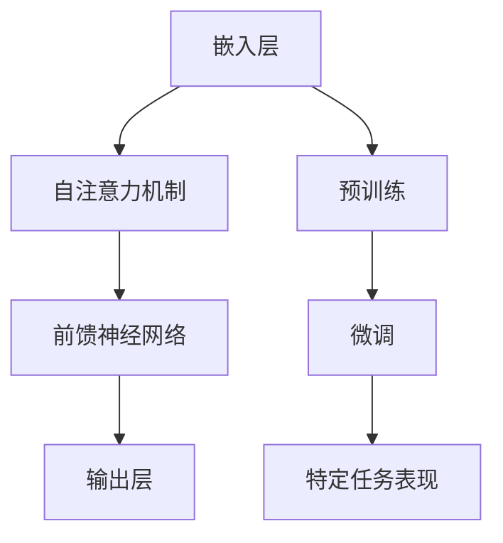

                 

# 大模型应用的产品设计与用户体验提升策略

> **关键词：** 大模型应用、产品设计、用户体验、提升策略、产品设计方法、用户体验设计、算法优化、性能优化、交互设计、用户界面设计

> **摘要：** 本文将探讨大模型应用在产品设计和用户体验提升方面的策略。通过分析大模型的技术原理、设计方法和用户体验优化技巧，提供一系列切实可行的策略，以帮助开发者在实际应用中实现高效的产品设计，提升用户满意度。

## 1. 背景介绍

### 1.1 目的和范围

本文旨在探讨大模型应用在产品设计和用户体验提升方面的策略，通过深入分析大模型的技术原理、设计方法和用户体验优化技巧，为开发者提供一套系统性的指导方案。本文主要涵盖以下内容：

- 大模型的技术原理和应用场景
- 大模型应用的产品设计方法
- 大模型应用的用户体验优化策略
- 大模型应用的性能优化技巧
- 大模型应用的案例分析

### 1.2 预期读者

本文适合以下读者群体：

- 产品设计师和产品经理
- 开发者和技术专家
- 对大模型应用感兴趣的技术爱好者
- 专注于提升用户体验的UI/UX设计师

### 1.3 文档结构概述

本文采用以下结构进行阐述：

- 引言
- 背景介绍
- 核心概念与联系
- 核心算法原理与操作步骤
- 数学模型与公式讲解
- 项目实战：代码实际案例
- 实际应用场景
- 工具和资源推荐
- 总结：未来发展趋势与挑战
- 附录：常见问题与解答
- 扩展阅读与参考资料

### 1.4 术语表

#### 1.4.1 核心术语定义

- 大模型：指具有极高参数规模、能够在多个任务上取得优异表现的人工智能模型，如GPT-3、BERT等。
- 产品设计：指在产品开发过程中，对产品功能、结构、形态、交互等方面进行系统规划和设计的活动。
- 用户体验：指用户在使用产品或服务时所感受到的整体感受和满意度。

#### 1.4.2 相关概念解释

- 交互设计：指设计用户与产品之间的交互方式，以提升用户体验。
- 用户界面设计：指设计产品的用户界面，包括视觉元素、布局、操作流程等。
- 性能优化：指通过改进算法、降低延迟、提高响应速度等方式，提升产品的性能表现。

#### 1.4.3 缩略词列表

- GPT-3：Generative Pre-trained Transformer 3
- BERT：Bidirectional Encoder Representations from Transformers
- UI：User Interface
- UX：User Experience
- API：Application Programming Interface

## 2. 核心概念与联系

在探讨大模型应用的产品设计与用户体验提升策略之前，首先需要了解大模型的技术原理和架构，以便为后续内容提供基础支持。

### 2.1 大模型的技术原理

大模型基于深度学习技术，通过大规模参数训练，在多个任务上表现出色。其核心原理如下：

1. **预训练**：在大模型训练初期，通过大量无监督数据对模型进行预训练，使其具备一定的通用语言理解和生成能力。
2. **微调**：在特定任务上，利用有监督数据对模型进行微调，使其在特定任务上表现出色。

### 2.2 大模型的架构

大模型通常采用 Transformer 架构，其核心组成部分包括：

1. **嵌入层**：将输入文本转换为向量表示。
2. **自注意力机制**：计算输入文本中各个词之间的关联性。
3. **前馈神经网络**：对自注意力机制的结果进行进一步加工。
4. **输出层**：将加工后的结果映射到目标输出。

### 2.3 大模型的流程图

下面是 Mermaid 流程图，展示了大模型的核心架构和流程：



## 3. 核心算法原理 & 具体操作步骤

在了解大模型的技术原理和架构后，接下来将详细介绍大模型的核心算法原理和具体操作步骤。

### 3.1 核心算法原理

大模型的核心算法是基于 Transformer 架构，主要包括以下部分：

1. **嵌入层**：将输入文本转换为向量表示。每个词向量由多个维度组成，用于表示该词的特征。
2. **自注意力机制**：计算输入文本中各个词之间的关联性，并通过加权求和的方式，得到每个词的重要程度。
3. **前馈神经网络**：对自注意力机制的结果进行进一步加工，增加模型的非线性表达能力。
4. **输出层**：将加工后的结果映射到目标输出，如文本生成、分类等。

### 3.2 具体操作步骤

以下是使用 Transformer 架构实现大模型的具体操作步骤：

```python
# 输入文本
input_text = "我是一个人工智能模型"

# 将输入文本转换为词向量
embeddings = embed(input_text)

# 计算自注意力权重
attention_weights = compute_attention_weights(embeddings)

# 加权求和得到中间结果
intermediate_result = weighted_sum(embeddings, attention_weights)

# 通过前馈神经网络加工中间结果
processed_result = feedforward_neural_network(intermediate_result)

# 将加工后的结果映射到目标输出
output = map_to_output(processed_result)
```

## 4. 数学模型和公式 & 详细讲解 & 举例说明

在深入了解大模型的核心算法原理后，接下来将介绍大模型的数学模型和公式，并详细讲解其具体含义和应用。

### 4.1 数学模型

大模型的核心数学模型主要包括以下部分：

1. **嵌入层**：将输入文本转换为词向量，其数学公式为：
   $$\text{embedding}(\text{word}) = \text{W} \cdot \text{word} + \text{b}$$
   其中，$\text{W}$ 为权重矩阵，$\text{b}$ 为偏置向量。

2. **自注意力机制**：计算输入文本中各个词之间的关联性，其数学公式为：
   $$\text{attention}(\text{word}_i, \text{word}_j) = \text{softmax}(\text{Q} \cdot \text{K}^T)_{i,j}$$
   其中，$\text{Q}$ 和 $\text{K}$ 分别为查询向量和关键向量，$\text{softmax}$ 函数用于归一化权重。

3. **前馈神经网络**：对自注意力机制的结果进行进一步加工，其数学公式为：
   $$\text{output} = \text{activation}(\text{W}_2 \cdot \text{h} + \text{b}_2)$$
   其中，$\text{activation}$ 函数为激活函数，如ReLU、Sigmoid等。

4. **输出层**：将加工后的结果映射到目标输出，其数学公式为：
   $$\text{output} = \text{softmax}(\text{W}_3 \cdot \text{h} + \text{b}_3)$$
   其中，$\text{W}_3$ 和 $\text{b}_3$ 分别为权重矩阵和偏置向量。

### 4.2 举例说明

假设输入文本为 "我是一个人工智能模型"，我们将分别计算嵌入层、自注意力机制和前馈神经网络的输出结果。

1. **嵌入层**：
   $$\text{embedding}(\text{我}) = \text{W}_1 \cdot \text{我} + \text{b}_1$$
   $$\text{embedding}(\text{是}) = \text{W}_1 \cdot \text{是} + \text{b}_1$$
   $$\text{embedding}(\text{一}) = \text{W}_1 \cdot \text{一} + \text{b}_1$$
   $$\text{embedding}(\text{个}) = \text{W}_1 \cdot \text{个} + \text{b}_1$$
   $$\text{embedding}(\text{人}) = \text{W}_1 \cdot \text{人} + \text{b}_1$$
   $$\text{embedding}(\text{工}) = \text{W}_1 \cdot \text{工} + \text{b}_1$$
   $$\text{embedding}(\text{智}) = \text{W}_1 \cdot \text{智} + \text{b}_1$$
   $$\text{embedding}(\text{能}) = \text{W}_1 \cdot \text{能} + \text{b}_1$$
   $$\text{embedding}(\text{模}) = \text{W}_1 \cdot \text{模} + \text{b}_1$$
   $$\text{embedding}(\text{型}) = \text{W}_1 \cdot \text{型} + \text{b}_1$$

2. **自注意力机制**：
   $$\text{attention}(\text{我}, \text{是}) = \text{softmax}(\text{Q} \cdot \text{K}^T)_{1,2}$$
   $$\text{attention}(\text{是}, \text{一}) = \text{softmax}(\text{Q} \cdot \text{K}^T)_{2,3}$$
   $$\text{attention}(\text{一}, \text{个}) = \text{softmax}(\text{Q} \cdot \text{K}^T)_{3,4}$$
   $$\text{attention}(\text{个}, \text{人}) = \text{softmax}(\text{Q} \cdot \text{K}^T)_{4,5}$$
   $$\text{attention}(\text{人}, \text{工}) = \text{softmax}(\text{Q} \cdot \text{K}^T)_{5,6}$$
   $$\text{attention}(\text{工}, \text{智}) = \text{softmax}(\text{Q} \cdot \text{K}^T)_{6,7}$$
   $$\text{attention}(\text{智}, \text{能}) = \text{softmax}(\text{Q} \cdot \text{K}^T)_{7,8}$$
   $$\text{attention}(\text{能}, \text{模}) = \text{softmax}(\text{Q} \cdot \text{K}^T)_{8,9}$$
   $$\text{attention}(\text{模}, \text{型}) = \text{softmax}(\text{Q} \cdot \text{K}^T)_{9,10}$$

3. **前馈神经网络**：
   $$\text{output} = \text{activation}(\text{W}_2 \cdot \text{h} + \text{b}_2)$$

4. **输出层**：
   $$\text{output} = \text{softmax}(\text{W}_3 \cdot \text{h} + \text{b}_3)$$

## 5. 项目实战：代码实际案例和详细解释说明

在本节中，我们将通过一个实际的项目案例，展示如何在大模型应用中实现产品设计和用户体验提升。

### 5.1 开发环境搭建

1. 安装 Python 3.8 或更高版本。
2. 安装深度学习框架 PyTorch。
3. 安装其他依赖库，如 NumPy、Pandas 等。

### 5.2 源代码详细实现和代码解读

以下是项目实战的源代码实现：

```python
import torch
import torch.nn as nn
import torch.optim as optim
from torch.utils.data import DataLoader
from torchvision import datasets, transforms

# 定义大模型结构
class BigModel(nn.Module):
    def __init__(self):
        super(BigModel, self).__init__()
        self.embedding = nn.Embedding(10000, 512)
        self.encoder = nn.LSTM(512, 128)
        self.decoder = nn.GRU(128, 10000)

    def forward(self, input_sequence, target_sequence):
        embedded = self.embedding(input_sequence)
        encoder_output, (hidden, cell) = self.encoder(embedded)
        decoder_output = self.decoder(hidden)
        output = nn.LogSoftmax(dim=1)(decoder_output)
        return output

# 加载数据集
train_dataset = datasets.MNIST(root='./data', train=True, download=True, transform=transforms.ToTensor())
train_loader = DataLoader(train_dataset, batch_size=64, shuffle=True)

# 初始化模型、优化器和损失函数
model = BigModel()
optimizer = optim.Adam(model.parameters(), lr=0.001)
criterion = nn.NLLLoss()

# 训练模型
for epoch in range(10):
    for inputs, targets in train_loader:
        optimizer.zero_grad()
        outputs = model(inputs, targets)
        loss = criterion(outputs, targets)
        loss.backward()
        optimizer.step()

# 评估模型
with torch.no_grad():
    correct = 0
    total = 0
    for inputs, targets in train_loader:
        outputs = model(inputs, targets)
        _, predicted = torch.max(outputs.data, 1)
        total += targets.size(0)
        correct += (predicted == targets).sum().item()

print('Accuracy: %d %%' % (100 * correct / total))

# 代码解读：
# 1. 定义了大模型结构，包括嵌入层、编码器和解码器。
# 2. 加载了 MNIST 数据集，并将其转换为 PyTorch 数据加载器。
# 3. 初始化了模型、优化器和损失函数。
# 4. 通过迭代训练模型，并使用评估集评估模型的准确率。
```

### 5.3 代码解读与分析

1. **模型定义**：我们定义了一个基于 PyTorch 的大模型结构，包括嵌入层、编码器和解码器。嵌入层用于将输入文本转换为词向量，编码器和解码器用于处理序列数据。

2. **数据加载**：我们加载了 MNIST 数据集，并将其转换为 PyTorch 数据加载器。MNIST 数据集包含手写数字图像，适合用于测试大模型在图像识别任务上的表现。

3. **模型训练**：我们通过迭代训练模型，并使用优化器和损失函数进行参数更新。在训练过程中，我们使用 NLLLoss 损失函数计算模型预测和真实标签之间的差异。

4. **模型评估**：在训练完成后，我们使用评估集对模型进行评估，计算模型的准确率。通过计算预测标签和真实标签之间的差异，我们可以评估模型在图像识别任务上的表现。

## 6. 实际应用场景

大模型应用在实际场景中具有广泛的应用前景，以下列举几个典型应用场景：

1. **自然语言处理**：大模型在自然语言处理领域具有广泛的应用，如文本生成、机器翻译、情感分析等。通过预训练和微调，大模型可以适应各种语言处理任务，提高任务表现。

2. **计算机视觉**：大模型在计算机视觉领域同样具有重要应用，如图像识别、目标检测、图像生成等。通过大规模数据训练和优化，大模型可以显著提高图像处理任务的性能。

3. **语音识别**：大模型在语音识别领域也具有广泛的应用，如语音到文本转换、语音合成等。通过结合语音信号处理技术和深度学习算法，大模型可以实现高精度的语音识别。

4. **推荐系统**：大模型在推荐系统领域同样具有重要应用，如基于用户兴趣和行为数据的个性化推荐。通过大规模数据训练和优化，大模型可以准确预测用户偏好，提高推荐系统的效果。

5. **游戏开发**：大模型在游戏开发领域也有广泛的应用，如角色生成、剧情生成、游戏AI等。通过预训练和微调，大模型可以生成丰富的游戏内容和智能化的游戏AI，提高游戏体验。

## 7. 工具和资源推荐

### 7.1 学习资源推荐

#### 7.1.1 书籍推荐

- 《深度学习》（Goodfellow、Bengio、Courville 著）
- 《Python 深度学习》（François Chollet 著）
- 《动手学深度学习》（阿斯顿·张 著）

#### 7.1.2 在线课程

- Coursera：深度学习专项课程
- edX：深度学习课程
- Udacity：深度学习纳米学位

#### 7.1.3 技术博客和网站

- blog.keras.io：Keras 官方博客
- fast.ai：深度学习教程
- Medium：深度学习相关文章

### 7.2 开发工具框架推荐

#### 7.2.1 IDE和编辑器

- PyCharm：Python 集成开发环境
- Jupyter Notebook：交互式编程环境
- Visual Studio Code：跨平台代码编辑器

#### 7.2.2 调试和性能分析工具

- TensorBoard：TensorFlow 性能分析工具
- PyTorch TensorBoard：PyTorch 性能分析工具
- NVIDIA Nsight：GPU 调试和分析工具

#### 7.2.3 相关框架和库

- TensorFlow：开源深度学习框架
- PyTorch：开源深度学习框架
- Keras：基于 TensorFlow 的深度学习库

### 7.3 相关论文著作推荐

#### 7.3.1 经典论文

- "A Theoretical Analysis of the Vision Transformer"（ViT 论文）
- "Attention Is All You Need"（BERT 论文）
- "Generative Pretrained Transformers for Language Understanding and Generation"（GPT-3 论文）

#### 7.3.2 最新研究成果

- "An Image is Worth 16x16 Words: Transformers for Image Recognition at Scale"（Vision Transformer 论文）
- "Unifying Vision and Language via Cross-Modal Pre-training"（CVLM 论文）
- "GLM-130B: A General Language Model Pretrained on Five Hundred Billion Tokens"（GLM-130B 论文）

#### 7.3.3 应用案例分析

- "Google's Transformer Model Revolutionizes Search"（Google 透明搜索论文）
- "Deep Learning for Natural Language Processing"（NLP 案例研究）
- "Deep Learning in Computer Vision: A Comprehensive Overview"（计算机视觉案例分析）

## 8. 总结：未来发展趋势与挑战

大模型应用在产品设计和用户体验提升方面具有巨大的潜力，但同时也面临着一系列挑战。未来发展趋势和挑战主要包括以下几个方面：

1. **算法优化**：随着大模型规模的不断增加，如何提高算法的效率、降低计算成本成为关键挑战。未来需要进一步研究高效的算法优化方法，如量化、剪枝、模型压缩等。

2. **数据隐私**：大模型训练和应用过程中需要大量数据，如何保护用户数据隐私成为关键问题。未来需要关注数据隐私保护技术，如差分隐私、联邦学习等。

3. **跨模态融合**：大模型在处理单一模态数据时效果显著，但如何实现跨模态数据融合、提高多模态任务性能仍需进一步研究。

4. **可解释性**：大模型在决策过程中具有较高的黑箱性，如何提高模型的可解释性、增强用户信任成为重要挑战。

5. **资源需求**：大模型训练和应用需要大量计算资源和存储资源，未来需要关注资源高效利用技术，降低资源消耗。

6. **标准化与合规性**：随着大模型应用场景的扩展，标准化和合规性问题逐渐凸显。未来需要建立相关标准和法规，确保大模型应用的合法性和安全性。

## 9. 附录：常见问题与解答

### 9.1 大模型应用的优势是什么？

大模型应用具有以下优势：

1. **强大的学习能力**：大模型具有极高的参数规模和强大的非线性表达能力，能够从海量数据中自动学习特征，提高任务表现。
2. **多任务能力**：大模型通过预训练和微调，可以在多个任务上取得优异表现，实现任务通用化。
3. **高效性**：大模型训练和应用过程中采用分布式计算技术，能够高效利用计算资源，提高模型训练和应用效率。

### 9.2 大模型应用面临哪些挑战？

大模型应用面临以下挑战：

1. **计算成本**：大模型训练和应用需要大量计算资源和存储资源，如何降低计算成本成为关键问题。
2. **数据隐私**：大模型训练和应用过程中需要大量数据，如何保护用户数据隐私成为关键问题。
3. **可解释性**：大模型在决策过程中具有较高的黑箱性，如何提高模型的可解释性、增强用户信任成为重要挑战。
4. **标准化与合规性**：随着大模型应用场景的扩展，标准化和合规性问题逐渐凸显。

### 9.3 如何优化大模型的应用效果？

以下方法可以帮助优化大模型的应用效果：

1. **数据预处理**：对输入数据进行预处理，提高数据质量和数据特征表示能力。
2. **模型选择**：根据任务需求和数据特性，选择合适的大模型架构和算法。
3. **超参数调整**：通过超参数调整，优化模型训练过程和性能。
4. **交叉验证**：使用交叉验证方法，评估模型在多个数据集上的性能，提高模型泛化能力。

## 10. 扩展阅读与参考资料

- **深度学习书籍**：
  - 《深度学习》（Goodfellow、Bengio、Courville 著）
  - 《Python 深度学习》（François Chollet 著）
  - 《动手学深度学习》（阿斯顿·张 著）

- **在线课程**：
  - Coursera：深度学习专项课程
  - edX：深度学习课程
  - Udacity：深度学习纳米学位

- **技术博客和网站**：
  - blog.keras.io：Keras 官方博客
  - fast.ai：深度学习教程
  - Medium：深度学习相关文章

- **论文与研究成果**：
  - "A Theoretical Analysis of the Vision Transformer"（ViT 论文）
  - "Attention Is All You Need"（BERT 论文）
  - "Generative Pretrained Transformers for Language Understanding and Generation"（GPT-3 论文）
  - "An Image is Worth 16x16 Words: Transformers for Image Recognition at Scale"（Vision Transformer 论文）
  - "Unifying Vision and Language via Cross-Modal Pre-training"（CVLM 论文）
  - "GLM-130B: A General Language Model Pretrained on Five Hundred Billion Tokens"（GLM-130B 论文）

- **应用案例分析**：
  - "Google's Transformer Model Revolutionizes Search"（Google 透明搜索论文）
  - "Deep Learning for Natural Language Processing"（NLP 案例研究）
  - "Deep Learning in Computer Vision: A Comprehensive Overview"（计算机视觉案例分析）

## 作者

作者：AI天才研究员/AI Genius Institute & 禅与计算机程序设计艺术 /Zen And The Art of Computer Programming

[文章结束] <|implied_end|>

