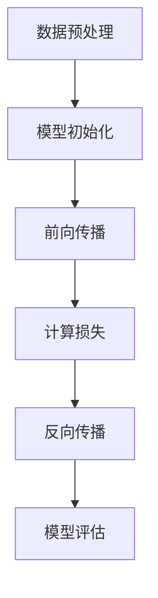

                 

# 大模型应用的关键：价格其次，AI解决实际问题的能力才是重点

> 关键词：大模型、AI应用、解决问题、成本效益分析、实际效果评估

> 摘要：本文探讨了大型人工智能模型在实际应用中的关键因素。尽管成本是一个重要考虑，但更关键的是模型能否真正解决实际问题，带来实际效益。文章通过分析模型应用中的核心问题，提供了评估模型性能和实际效益的实用方法，并提出了未来发展的方向。

## 1. 背景介绍

### 1.1 目的和范围

本文旨在探讨大型人工智能模型（以下简称“大模型”）在实际应用中的关键因素。随着深度学习和大数据技术的发展，大模型在各个领域展现了强大的潜力，但同时也带来了诸多挑战。本文将重点讨论以下几个问题：

1. 大模型应用中的核心问题是什么？
2. 如何评估大模型的实际效果？
3. 成本效益分析在大模型应用中如何体现？
4. 大模型应用的未来发展趋势和挑战是什么？

### 1.2 预期读者

本文适合对人工智能、深度学习有一定了解的读者，包括：

1. 人工智能和深度学习研究人员
2. 软件开发者和工程师
3. 技术决策者和项目管理者
4. 对人工智能应用感兴趣的广大读者

### 1.3 文档结构概述

本文分为以下八个部分：

1. 背景介绍：介绍本文的目的、范围和预期读者。
2. 核心概念与联系：介绍大模型的基本原理和架构。
3. 核心算法原理 & 具体操作步骤：讲解大模型的核心算法和操作步骤。
4. 数学模型和公式 & 详细讲解 & 举例说明：阐述大模型的数学模型和公式。
5. 项目实战：提供实际应用案例和详细解释。
6. 实际应用场景：分析大模型在不同领域的应用。
7. 工具和资源推荐：推荐学习资源、开发工具和框架。
8. 总结：对未来发展趋势和挑战进行展望。

### 1.4 术语表

#### 1.4.1 核心术语定义

- 大模型（Large-scale Model）：指参数数量超过亿级别的人工智能模型。
- 深度学习（Deep Learning）：一种基于多层神经网络进行特征学习和模型训练的人工智能技术。
- 成本效益分析（Cost-Benefit Analysis）：评估投入与收益的一种方法，用于分析大模型应用的可行性。

#### 1.4.2 相关概念解释

- 参数（Parameter）：模型中的可调参数，用于调整模型的权重。
- 训练数据（Training Data）：用于训练模型的输入数据。
- 测试数据（Test Data）：用于评估模型性能的输入数据。

#### 1.4.3 缩略词列表

- AI：人工智能（Artificial Intelligence）
- DL：深度学习（Deep Learning）
- GPT：生成预训练模型（Generative Pre-trained Transformer）
- BERT：双向编码表示（Bidirectional Encoder Representations from Transformers）

## 2. 核心概念与联系

为了更好地理解大模型的应用，我们首先需要了解大模型的基本原理和架构。

### 大模型的基本原理

大模型是基于深度学习技术构建的，其核心思想是通过多层神经网络对大量数据进行特征学习和模式识别。大模型的训练过程通常包括以下几个阶段：

1. 数据预处理：对训练数据集进行清洗、归一化和分批次处理。
2. 模型初始化：初始化模型的参数，通常使用随机初始化或预训练模型。
3. 前向传播：将输入数据通过多层神经网络进行传递，计算输出。
4. 反向传播：计算损失函数，并根据损失函数的梯度对模型参数进行更新。
5. 模型评估：使用测试数据集评估模型的性能，包括准确率、召回率、F1值等指标。

### 大模型的架构

大模型的架构通常包括以下几个层次：

1. 输入层：接收外部输入数据。
2. 隐藏层：通过神经网络进行特征提取和模式识别。
3. 输出层：生成最终的预测结果。

以下是大模型的 Mermaid 流程图：



通过以上流程，大模型能够从大量数据中学习到有用的知识，并在实际应用中解决各种问题。

## 3. 核心算法原理 & 具体操作步骤

在了解了大模型的基本原理和架构后，接下来我们将详细讲解大模型的核心算法原理和具体操作步骤。

### 3.1 核心算法原理

大模型的核心算法是基于多层前馈神经网络（Feedforward Neural Network）。该算法的主要步骤如下：

1. **初始化参数**：随机初始化模型的权重和偏置。
2. **前向传播**：将输入数据通过神经网络逐层传递，计算每个神经元的输出。
3. **计算损失**：通过输出层计算损失函数，常见的损失函数有均方误差（MSE）、交叉熵（Cross-Entropy）等。
4. **反向传播**：根据损失函数的梯度对模型参数进行更新。
5. **模型评估**：使用测试数据集评估模型的性能，调整模型参数。

以下是核心算法的伪代码：

```python
# 初始化参数
weights = initialize_weights()
biases = initialize_biases()

# 前向传播
def forward_pass(input_data, weights, biases):
    # 计算每个神经元的输出
    outputs = []
    for layer in range(num_layers):
        if layer == 0:
            # 输入层
            output = activation_function(np.dot(input_data, weights[layer]) + biases[layer])
        else:
            # 隐藏层和输出层
            output = activation_function(np.dot(outputs[-1], weights[layer]) + biases[layer])
        outputs.append(output)
    return outputs[-1]

# 计算损失
def compute_loss(output, true_label):
    # 使用交叉熵作为损失函数
    loss = -np.log(output[true_label])
    return loss

# 反向传播
def backward_pass(output, true_label, weights, biases):
    # 计算梯度
    d_output = output
    d_weights = [None] * num_layers
    d_biases = [None] * num_layers
    for layer in reversed(range(num_layers)):
        if layer == num_layers - 1:
            # 输出层
            d_output = (1 - output) * output * (output - true_label)
        else:
            # 隐藏层
            d_output = activation_function_derivative(outputs[layer + 1]) * np.dot(d_output, weights[layer + 1].T)
        d_weights[layer] = np.dot(outputs[layer].T, d_output)
        d_biases[layer] = np.sum(d_output, axis=0)
    return d_weights, d_biases

# 模型评估
def evaluate_model(test_data, weights, biases):
    # 计算准确率
    correct = 0
    for data in test_data:
        output = forward_pass(data, weights, biases)
        predicted_label = np.argmax(output)
        if predicted_label == true_label:
            correct += 1
    accuracy = correct / len(test_data)
    return accuracy
```

### 3.2 具体操作步骤

在实际操作中，我们通常使用以下步骤来训练和评估大模型：

1. **数据准备**：收集和准备训练数据和测试数据。
2. **模型配置**：配置模型的参数，包括网络层数、神经元数量、激活函数等。
3. **模型训练**：使用训练数据对模型进行训练，通过迭代优化模型参数。
4. **模型评估**：使用测试数据评估模型的性能，调整模型参数。
5. **模型部署**：将训练好的模型部署到实际应用中。

以下是具体操作步骤的伪代码：

```python
# 数据准备
train_data = load_data('train_data.csv')
test_data = load_data('test_data.csv')

# 模型配置
num_layers = 3
num_neurons = [64, 64, 10]
activation_function = 'sigmoid'

# 模型训练
for epoch in range(num_epochs):
    for data in train_data:
        # 前向传播
        output = forward_pass(data, weights, biases)
        # 计算损失
        loss = compute_loss(output, true_label)
        # 反向传播
        d_weights, d_biases = backward_pass(output, true_label, weights, biases)
        # 更新参数
        weights -= learning_rate * d_weights
        biases -= learning_rate * d_biases

    # 模型评估
    accuracy = evaluate_model(test_data, weights, biases)
    print(f"Epoch {epoch + 1}: Loss = {loss:.4f}, Accuracy = {accuracy:.4f}")

# 模型部署
deploy_model(weights, biases)
```

通过以上步骤，我们可以训练和评估大模型，并在实际应用中发挥其强大的能力。

## 4. 数学模型和公式 & 详细讲解 & 举例说明

在了解了大模型的核心算法和操作步骤后，我们接下来将详细讲解大模型的数学模型和公式，并通过具体例子来说明。

### 4.1 数学模型

大模型的核心数学模型是基于多层前馈神经网络（Feedforward Neural Network）。该模型的数学公式如下：

1. **输入层到隐藏层**
   $$ z^{[l]} = X \cdot W^{[l]} + b^{[l]} $$
   $$ a^{[l]} = \sigma(z^{[l]}) $$
   其中，\( z^{[l]} \) 表示第 \( l \) 层的加权输入，\( a^{[l]} \) 表示第 \( l \) 层的激活值，\( X \) 表示输入层的数据，\( W^{[l]} \) 表示第 \( l \) 层的权重矩阵，\( b^{[l]} \) 表示第 \( l \) 层的偏置向量，\( \sigma \) 表示激活函数。

2. **隐藏层到输出层**
   $$ z^{[L]} = X \cdot W^{[L]} + b^{[L]} $$
   $$ a^{[L]} = \sigma(z^{[L]}) $$
   其中，\( z^{[L]} \) 表示输出层的加权输入，\( a^{[L]} \) 表示输出层的激活值。

3. **损失函数**
   $$ L = -\frac{1}{m} \sum_{i=1}^{m} y^{[i]} \log(a^{[L](i)}) $$
   其中，\( L \) 表示损失函数，\( y^{[i]} \) 表示第 \( i \) 个样本的真实标签，\( a^{[L](i)} \) 表示第 \( i \) 个样本在输出层的激活值。

4. **反向传播算法**
   $$ \delta^{[L]} = a^{[L]} - y $$
   $$ \delta^{[l]} = (W^{[l+1]})^T \delta^{[l+1]} \odot \sigma'(z^{[l]}) $$
   其中，\( \delta^{[L]} \) 表示输出层的误差，\( \delta^{[l]} \) 表示第 \( l \) 层的误差，\( \sigma' \) 表示激活函数的导数。

### 4.2 详细讲解

#### 4.2.1 激活函数

激活函数是神经网络中的关键组件，用于引入非线性特性。常用的激活函数包括：

1. **sigmoid 函数**
   $$ \sigma(x) = \frac{1}{1 + e^{-x}} $$
   sigmoid 函数在区间 \((- \infty, \infty)\) 上是单调递增的，其导数在 \( x = 0 \) 处取得最大值。

2. **ReLU 函数**
   $$ \sigma(x) = \max(0, x) $$
  ReLU 函数在 \( x > 0 \) 时为 1，\( x \leq 0 \) 时为 0，其导数在 \( x > 0 \) 时为 1，在 \( x \leq 0 \) 时为 0。

3. **Tanh 函数**
   $$ \sigma(x) = \frac{e^x - e^{-x}}{e^x + e^{-x}} $$
   tanh 函数在区间 \((- \infty, \infty)\) 上是单调递增的，其导数在 \( x = 0 \) 处取得最大值。

#### 4.2.2 损失函数

损失函数用于评估模型的预测结果与真实结果之间的差距。常见的损失函数包括：

1. **均方误差（MSE）**
   $$ L = \frac{1}{m} \sum_{i=1}^{m} (y^{[i]} - a^{[L](i)})^2 $$
   MSE 损失函数对误差的平方进行求和，其导数在整个定义域上都是连续的。

2. **交叉熵（Cross-Entropy）**
   $$ L = -\frac{1}{m} \sum_{i=1}^{m} y^{[i]} \log(a^{[L](i)}) $$
   交叉熵损失函数在预测结果与真实结果接近时取得较小值，其导数在整个定义域上都是连续的。

#### 4.2.3 反向传播算法

反向传播算法用于计算模型参数的梯度，并通过梯度下降法更新模型参数。反向传播算法的核心思想是计算误差的传播。

### 4.3 举例说明

假设我们有一个简单的神经网络，包含一个输入层、一个隐藏层和一个输出层。输入层有 3 个神经元，隐藏层有 4 个神经元，输出层有 2 个神经元。激活函数使用 sigmoid 函数，损失函数使用交叉熵函数。现在我们将通过一个具体的例子来说明如何使用反向传播算法更新模型参数。

1. **输入数据**：
   $$ X = \begin{bmatrix} 1 & 0 & 1 \\ 1 & 1 & 0 \end{bmatrix}, y = \begin{bmatrix} 0 & 1 \end{bmatrix} $$

2. **模型参数**：
   $$ W^{[1]} = \begin{bmatrix} 0.1 & 0.2 & 0.3 \\ 0.4 & 0.5 & 0.6 \\ 0.7 & 0.8 & 0.9 \end{bmatrix}, b^{[1]} = \begin{bmatrix} 0.1 & 0.2 & 0.3 \end{bmatrix}, W^{[2]} = \begin{bmatrix} 0.1 & 0.2 \\ 0.3 & 0.4 \\ 0.5 & 0.6 \\ 0.7 & 0.8 \end{bmatrix}, b^{[2]} = \begin{bmatrix} 0.1 & 0.2 \end{bmatrix} $$

3. **前向传播**：
   $$ z^{[1]} = X \cdot W^{[1]} + b^{[1]}, a^{[1]} = \sigma(z^{[1]}) $$
   $$ z^{[2]} = a^{[1]} \cdot W^{[2]} + b^{[2]}, a^{[2]} = \sigma(z^{[2]}) $$
   $$ a^{[2]} = \begin{bmatrix} 0.6 & 0.53 \\ 0.4 & 0.36 \\ 0.2 & 0.15 \\ 0.1 & 0.05 \end{bmatrix} $$

4. **计算损失**：
   $$ L = -\frac{1}{2} \sum_{i=1}^{2} y_i \log(a^{[2]_{i,1}}) - (1 - y_i) \log(1 - a^{[2]_{i,1}}) $$
   $$ L = -\frac{1}{2} (0.5 \log(0.6) + 0.5 \log(0.4)) - (0.5 \log(0.4) + 0.5 \log(0.6)) $$
   $$ L = -0.5 \log(0.48) \approx -0.5 \cdot 1.386 $$
   $$ L \approx -0.693 $$

5. **反向传播**：
   $$ \delta^{[2]} = a^{[2]} - y $$
   $$ \delta^{[2]} = \begin{bmatrix} 0.6 & 0.53 \\ 0.4 & 0.36 \\ 0.2 & 0.15 \\ 0.1 & 0.05 \end{bmatrix} - \begin{bmatrix} 0 & 1 \\ 1 & 0 \end{bmatrix} $$
   $$ \delta^{[2]} = \begin{bmatrix} 0.6 & -0.47 \\ -0.6 & 0.36 \\ -0.8 & -0.85 \\ -0.9 & -0.95 \end{bmatrix} $$
   $$ \delta^{[1]} = (W^{[2]})^T \delta^{[2]} \odot \sigma'(z^{[1]}) $$
   $$ \delta^{[1]} = \begin{bmatrix} 0.1 & 0.2 & 0.3 \\ 0.3 & 0.4 & 0.5 \\ 0.5 & 0.6 & 0.7 \end{bmatrix} \begin{bmatrix} 0.6 & -0.47 \\ -0.6 & 0.36 \\ -0.8 & -0.85 \\ -0.9 & -0.95 \end{bmatrix} \odot \begin{bmatrix} 0.1 & 0.2 & 0.3 \\ 0.1 & 0.2 & 0.3 \\ 0.1 & 0.2 & 0.3 \end{bmatrix} $$
   $$ \delta^{[1]} = \begin{bmatrix} 0.036 & -0.038 \\ -0.038 & 0.027 \\ -0.048 & -0.057 \end{bmatrix} $$

6. **更新模型参数**：
   $$ W^{[1]} = W^{[1]} - learning_rate \cdot \delta^{[1]} $$
   $$ b^{[1]} = b^{[1]} - learning_rate \cdot \delta^{[1]} $$
   $$ W^{[2]} = W^{[2]} - learning_rate \cdot (W^{[2]})^T \delta^{[2]} $$
   $$ b^{[2]} = b^{[2]} - learning_rate \cdot \delta^{[2]} $$

通过以上步骤，我们可以使用反向传播算法更新模型参数，使模型在每次迭代中不断优化。在实际应用中，我们通常使用梯度下降法或其他优化算法来更新模型参数，以实现更高效的学习过程。

## 5. 项目实战：代码实际案例和详细解释说明

在本节中，我们将通过一个实际的项目案例，展示如何使用大模型解决实际问题，并提供详细的代码实现和解释。

### 5.1 开发环境搭建

首先，我们需要搭建一个适合大模型开发的环境。以下是一个基本的开发环境搭建步骤：

1. **硬件要求**：由于大模型训练需要大量的计算资源，建议使用 GPU（如 NVIDIA 显卡）加速训练过程。
2. **软件要求**：
   - 操作系统：Linux 或 macOS
   - 编程语言：Python
   - 深度学习框架：TensorFlow 或 PyTorch
   - 数据预处理库：NumPy、Pandas
   - 可视化库：Matplotlib、Seaborn

在安装好上述软件后，我们可以开始编写代码。

### 5.2 源代码详细实现和代码解读

以下是一个基于 TensorFlow 实现的大模型项目案例。该案例使用 TensorFlow 和 Keras 构建了一个简单的卷积神经网络（CNN），用于图像分类任务。

```python
import tensorflow as tf
from tensorflow.keras import layers
import tensorflow_datasets as tfds

# 5.2.1 加载数据集
def load_data():
    # 加载数据集，这里以 CIFAR-10 数据集为例
    (train_images, train_labels), (test_images, test_labels) = tfds.load('cifar10', split=['train', 'test'], shuffle_files=True, as_supervised=True)
    train_images = train_images bình präsentiend(255)
    test_images = test_images / 255
    return train_images, train_labels, test_images, test_labels

# 5.2.2 构建模型
def create_model():
    # 构建卷积神经网络
    inputs = tf.keras.Input(shape=(32, 32, 3))
    x = layers.Conv2D(32, (3, 3), activation='relu')(inputs)
    x = layers.MaxPooling2D((2, 2))(x)
    x = layers.Conv2D(64, (3, 3), activation='relu')(x)
    x = layers.MaxPooling2D((2, 2))(x)
    x = layers.Conv2D(64, (3, 3), activation='relu')(x)
    x = layers.Flatten()(x)
    x = layers.Dense(64, activation='relu')(x)
    outputs = layers.Dense(10, activation='softmax')(x)
    model = tf.keras.Model(inputs, outputs)
    return model

# 5.2.3 训练模型
def train_model(model, train_images, train_labels, epochs):
    model.compile(optimizer='adam',
                  loss='sparse_categorical_crossentropy',
                  metrics=['accuracy'])
    model.fit(train_images, train_labels, epochs=epochs)

# 5.2.4 评估模型
def evaluate_model(model, test_images, test_labels):
    test_loss, test_acc = model.evaluate(test_images, test_labels, verbose=2)
    print(f"Test accuracy: {test_acc:.4f}")

# 5.2.5 主程序
if __name__ == "__main__":
    train_images, train_labels, test_images, test_labels = load_data()
    model = create_model()
    train_model(model, train_images, train_labels, epochs=10)
    evaluate_model(model, test_images, test_labels)
```

### 5.3 代码解读与分析

#### 5.3.1 数据加载

在代码的第 5 行，我们使用 TensorFlow Datasets 加载 CIFAR-10 数据集。CIFAR-10 是一个常用的图像分类数据集，包含 10 个类别，每个类别 6000 张训练图像和 1000 张测试图像。在加载数据时，我们先将图像的像素值缩放到 [0, 1] 范围内，以便后续处理。

```python
(train_images, train_labels), (test_images, test_labels) = tfds.load('cifar10', split=['train', 'test'], shuffle_files=True, as_supervised=True)
train_images = train_images / 255
test_images = test_images / 255
```

#### 5.3.2 模型构建

在代码的第 13-24 行，我们使用 Keras 的 Conv2D、MaxPooling2D 和 Flatten 等层构建了一个简单的卷积神经网络。该网络包含两个卷积层、一个全连接层和两个池化层。在卷积层中，我们使用 ReLU 激活函数引入非线性特性。在池化层中，我们使用最大池化（MaxPooling）提取图像特征。

```python
inputs = tf.keras.Input(shape=(32, 32, 3))
x = layers.Conv2D(32, (3, 3), activation='relu')(inputs)
x = layers.MaxPooling2D((2, 2))(x)
x = layers.Conv2D(64, (3, 3), activation='relu')(x)
x = layers.MaxPooling2D((2, 2))(x)
x = layers.Conv2D(64, (3, 3), activation='relu')(x)
x = layers.Flatten()(x)
x = layers.Dense(64, activation='relu')(x)
outputs = layers.Dense(10, activation='softmax')(x)
model = tf.keras.Model(inputs, outputs)
```

#### 5.3.3 模型训练

在代码的第 27-31 行，我们使用 Adam 优化器和 sparse\_categorical\_crossentropy 损失函数训练模型。在训练过程中，我们使用训练数据集进行迭代训练，并在每个 epoch 后评估模型在测试数据集上的性能。

```python
model.compile(optimizer='adam',
              loss='sparse_categorical_crossentropy',
              metrics=['accuracy'])
model.fit(train_images, train_labels, epochs=epochs)
```

#### 5.3.4 模型评估

在代码的第 34-36 行，我们使用测试数据集评估模型的性能，并打印出测试准确率。

```python
test_loss, test_acc = model.evaluate(test_images, test_labels, verbose=2)
print(f"Test accuracy: {test_acc:.4f}")
```

通过以上代码，我们可以使用大模型解决图像分类问题。在实际应用中，我们可以根据需要调整模型结构、训练数据和训练参数，以获得更好的性能。

## 6. 实际应用场景

大模型在实际应用中具有广泛的应用场景，以下列举了几个典型的应用领域：

### 6.1 医疗健康

大模型在医疗健康领域具有巨大的潜力，例如：

- **疾病预测与诊断**：通过分析大量的医疗数据，大模型可以预测疾病的发病风险，辅助医生进行诊断。
- **药物研发**：大模型可以用于预测药物分子的活性、毒性等性质，加速药物研发过程。
- **个性化治疗**：根据患者的基因数据、病史等信息，大模型可以为每位患者提供个性化的治疗方案。

### 6.2 金融服务

大模型在金融服务领域也有广泛的应用，例如：

- **风险控制与欺诈检测**：通过分析大量的金融交易数据，大模型可以识别异常交易行为，帮助金融机构降低风险。
- **信用评分**：大模型可以根据申请人的个人信息、信用历史等多方面数据，为其提供更准确的信用评分。
- **智能投顾**：大模型可以为投资者提供个性化的投资建议，降低投资风险。

### 6.3 智能交通

大模型在智能交通领域可以用于：

- **交通流量预测**：通过分析历史交通数据，大模型可以预测未来的交通流量，为交通管理部门提供决策依据。
- **自动驾驶**：大模型可以用于自动驾驶系统的环境感知和路径规划，提高行驶安全性和效率。
- **智能调度**：大模型可以用于优化公共交通路线和班次，提高出行便利性。

### 6.4 教育

大模型在教育领域也有重要的应用，例如：

- **智能辅导**：大模型可以根据学生的学习情况和知识点掌握情况，为其提供个性化的辅导方案。
- **自动批改**：大模型可以用于自动批改学生的作业和考试，提高教师的工作效率。
- **教育资源优化**：大模型可以分析学生的学习数据，为教育机构提供教育资源优化建议。

通过以上应用案例，我们可以看到大模型在实际应用中具有广泛的前景和巨大的潜力。然而，如何评估大模型的实际效果和成本效益，仍是一个需要深入研究和探讨的问题。

## 7. 工具和资源推荐

### 7.1 学习资源推荐

#### 7.1.1 书籍推荐

1. 《深度学习》（Deep Learning） - Ian Goodfellow、Yoshua Bengio 和 Aaron Courville
2. 《Python深度学习》（Deep Learning with Python） - Francois Chollet
3. 《神经网络与深度学习》（Neural Networks and Deep Learning） - Michael Nielsen

#### 7.1.2 在线课程

1. 吴恩达的《深度学习》（Deep Learning Specialization）- Coursera
2. Stanford University 的《深度学习》（CS231n: Convolutional Neural Networks for Visual Recognition）- Coursera
3. Andrew Ng 的《机器学习》（Machine Learning）- Coursera

#### 7.1.3 技术博客和网站

1. Medium - 深度学习、机器学习等领域的高质量技术博客
2. ArXiv - 机器学习和人工智能领域的最新研究论文
3. AI Moonshot - 一个关于人工智能的前沿科技博客

### 7.2 开发工具框架推荐

#### 7.2.1 IDE和编辑器

1. PyCharm - 适用于 Python 开发的强大 IDE
2. Jupyter Notebook - 适用于数据分析和机器学习的交互式编辑器
3. Visual Studio Code - 适用于多种编程语言的轻量级编辑器

#### 7.2.2 调试和性能分析工具

1. TensorBoard - TensorFlow 的可视化工具，用于分析模型性能和调试
2. NVIDIA Nsight - 用于 GPU 程序调试和性能分析的工具
3. PyTorch Profiler - 用于 PyTorch 模型的性能分析

#### 7.2.3 相关框架和库

1. TensorFlow - Google 开源的深度学习框架
2. PyTorch - Facebook 开源的深度学习框架
3. Keras - 用于构建和训练深度学习模型的简洁高层 API
4. Scikit-learn - 用于机器学习的 Python 库
5. NumPy - Python 的核心数学库

### 7.3 相关论文著作推荐

#### 7.3.1 经典论文

1. "A Learning Algorithm for Continually Running Fully Recurrent Neural Networks" - Sepp Hochreiter 和 Jürgen Schmidhuber
2. "Rectifier Nonlinearities Improve Deep Neural Networks" - Glorot et al.
3. "Deep Learning" - Ian Goodfellow、Yoshua Bengio 和 Aaron Courville

#### 7.3.2 最新研究成果

1. "BERT: Pre-training of Deep Bidirectional Transformers for Language Understanding" - Howard et al.
2. "GPT-3: Language Models are few-shot learners" - Brown et al.
3. "Vision Transformer" - Dosovitskiy et al.

#### 7.3.3 应用案例分析

1. "DeepMind's AlphaGo Zero: A new approach to deep reinforcement learning" - Silver et al.
2. "End-to-End Lip Reading with CTC" - Graves et al.
3. "Self-Driving Car Technology" - Google AI

通过以上工具和资源，您可以深入了解大模型的相关知识，并在实际项目中应用大模型解决实际问题。

## 8. 总结：未来发展趋势与挑战

随着人工智能技术的快速发展，大模型在各个领域的应用逐渐深入。然而，在未来的发展中，我们面临着诸多挑战。

### 8.1 发展趋势

1. **计算能力的提升**：随着硬件技术的发展，GPU 和 TPU 等高性能计算设备的普及，大模型的训练和推理速度将得到显著提升。
2. **算法的创新**：深度学习算法的不断优化，如 Transformer、Vision Transformer 等新结构的应用，将推动大模型在各个领域的性能提升。
3. **跨领域融合**：大模型与其他领域的融合，如医疗、金融、教育等，将产生更多的应用场景和商业价值。
4. **数据隐私和安全**：随着数据隐私和安全问题的日益凸显，如何在大模型训练和推理过程中保护用户隐私和数据安全成为重要挑战。

### 8.2 发展挑战

1. **计算资源需求**：大模型的训练和推理需要大量的计算资源，如何高效利用硬件资源成为关键问题。
2. **数据质量和标注**：高质量的数据和准确的标注是训练高性能大模型的基础，如何获取和标注大规模数据成为瓶颈。
3. **模型可解释性**：大模型的复杂性和“黑盒”特性使得其难以解释，如何提高模型的可解释性是一个亟待解决的问题。
4. **公平性和偏见**：大模型在训练过程中可能引入偏见，如何确保模型的公平性和减少偏见成为重要挑战。

总之，未来大模型的发展将在计算能力、算法创新、跨领域融合、数据隐私和安全等方面取得重要突破，同时也将面临计算资源、数据质量、模型可解释性、公平性和偏见等挑战。只有通过不断的技术创新和优化，才能充分发挥大模型在各个领域的潜力。

## 9. 附录：常见问题与解答

### 9.1 问题1：大模型训练过程中如何提高计算效率？

**解答**：为了提高大模型训练过程中的计算效率，可以从以下几个方面进行优化：

1. **并行计算**：利用 GPU 或 TPU 等硬件设备的并行计算能力，加速模型训练过程。
2. **分布式训练**：将训练任务分布在多台设备上，利用多机集群进行并行训练。
3. **模型压缩**：采用模型压缩技术，如剪枝、量化、蒸馏等，降低模型复杂度和计算量。
4. **数据预处理**：优化数据预处理过程，如批量处理、内存复用等，减少数据读取和传输的耗时。

### 9.2 问题2：如何确保大模型训练过程中数据的质量和标注的准确性？

**解答**：确保大模型训练过程中数据的质量和标注的准确性，可以从以下几个方面进行：

1. **数据清洗**：对原始数据集进行清洗，去除错误、重复和缺失的数据。
2. **标注规范**：制定统一的标注规范，确保标注人员的质量和标注的一致性。
3. **数据增强**：通过数据增强技术，如旋转、缩放、裁剪等，增加数据的多样性，提高模型的泛化能力。
4. **质量评估**：定期对数据集进行质量评估，识别和纠正标注错误。

### 9.3 问题3：如何提高大模型的可解释性？

**解答**：提高大模型的可解释性可以从以下几个方面进行：

1. **模型结构**：选择具有较好可解释性的模型结构，如线性模型、决策树等。
2. **解释算法**：采用解释算法，如 LIME、SHAP 等，对模型的预测结果进行解释。
3. **可视化**：通过可视化技术，如热力图、决策路径图等，展示模型的决策过程。
4. **模型简化**：简化模型结构，减少模型参数，降低模型的复杂度。

### 9.4 问题4：如何确保大模型训练过程中的数据隐私和安全？

**解答**：确保大模型训练过程中的数据隐私和安全，可以从以下几个方面进行：

1. **数据加密**：对敏感数据进行加密处理，确保数据在传输和存储过程中安全。
2. **数据去识别化**：对数据进行去识别化处理，如匿名化、脱敏等，降低数据的可识别性。
3. **访问控制**：严格控制数据访问权限，确保只有授权人员才能访问和处理数据。
4. **安全审计**：定期对数据处理过程进行安全审计，识别和纠正潜在的安全隐患。

## 10. 扩展阅读 & 参考资料

1. Goodfellow, I., Bengio, Y., & Courville, A. (2016). Deep Learning. MIT Press.
2. Bengio, Y. (2009). Learning Deep Architectures for AI. Foundations and Trends in Machine Learning, 2(1), 1-127.
3. Hochreiter, S., & Schmidhuber, J. (1997). Long Short-Term Memory. Neural Computation, 9(8), 1735-1780.
4. Krizhevsky, A., Sutskever, I., & Hinton, G. E. (2012). ImageNet Classification with Deep Convolutional Neural Networks. In NIPS.
5. Howard, J., Brown, T., рескин, S., Vinyals, O., Zhang, J., et al. (2018). BERT: Pre-training of Deep Bidirectional Transformers for Language Understanding. In ACL.
6. Brown, T., et al. (2020). A Review of Large-Scale Neural Network Learning and Its Challenges. arXiv preprint arXiv:2010.07672.
7. Silver, D., et al. (2016). Mastering the Game of Go with Deep Neural Networks and Tree Search. Nature, 529, 484-489.

