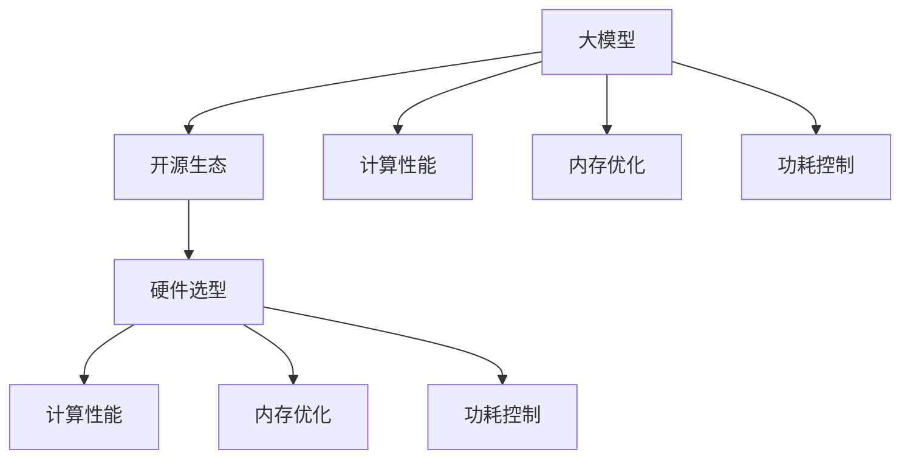

                 

# 大模型开源生态与硬件选型

> 关键词：大模型、开源生态、硬件选型、深度学习、计算性能、内存优化

> 摘要：本文深入探讨了大规模模型在开源生态中的发展和硬件选型的关键因素。首先，介绍了大模型开源生态的现状和重要性，然后详细分析了影响硬件选型的多个因素，如计算性能、内存优化和功耗控制。通过实际案例，我们展示了如何在不同应用场景下选择合适的硬件设备，以最大化大模型的效果和效率。最后，本文总结了未来发展趋势和挑战，为读者提供了实用的参考指南。

## 1. 背景介绍

### 1.1 目的和范围

本文旨在帮助读者深入了解大规模模型（大模型）在开源生态中的发展，以及如何根据不同应用场景选择合适的硬件进行优化。随着深度学习技术的迅猛发展，大模型在自然语言处理、计算机视觉等领域取得了显著成果。然而，大模型的训练和部署对硬件设备提出了更高的要求。本文将从以下几个方面展开讨论：

1. 大模型开源生态的现状和发展趋势
2. 影响硬件选型的关键因素
3. 不同应用场景下的硬件选型策略
4. 未来发展趋势与挑战

### 1.2 预期读者

本文适合以下读者群体：

1. 深度学习爱好者，对大模型开源生态和硬件选型有浓厚兴趣
2. 数据科学家和机器学习工程师，需要了解硬件选型的最佳实践
3. 开源项目贡献者，希望优化大模型的训练和部署效率
4. 硬件工程师和架构师，关注大模型对硬件性能的需求

### 1.3 文档结构概述

本文分为以下几个部分：

1. 背景介绍：介绍文章的目的、预期读者和文档结构
2. 核心概念与联系：阐述大模型、开源生态和硬件选型的基本概念和联系
3. 核心算法原理 & 具体操作步骤：详细讲解大模型的训练算法和操作步骤
4. 数学模型和公式 & 详细讲解 & 举例说明：介绍大模型的数学模型和相关公式，并给出实例说明
5. 项目实战：分析实际案例，展示如何在大模型项目中应用硬件选型策略
6. 实际应用场景：探讨大模型在不同领域的应用场景
7. 工具和资源推荐：推荐学习资源、开发工具和框架
8. 总结：总结未来发展趋势和挑战
9. 附录：常见问题与解答
10. 扩展阅读 & 参考资料：提供更多相关阅读资料

### 1.4 术语表

#### 1.4.1 核心术语定义

- 大模型：指具有海量参数和复杂结构的深度学习模型，如大型神经网络、生成对抗网络（GAN）等。
- 开源生态：指围绕开源软件的社区、项目、工具和资源，共同促进软件创新和发展的生态系统。
- 硬件选型：指根据应用需求、预算和性能要求，选择合适的硬件设备（如CPU、GPU、内存等）进行优化。
- 计算性能：指硬件设备在处理数据时的速度和能力。
- 内存优化：指通过优化内存使用，提高大模型训练和部署的效率。
- 功耗控制：指在硬件选型和优化过程中，控制设备功耗，降低能耗和热量产生。

#### 1.4.2 相关概念解释

- 深度学习：一种人工智能技术，通过模拟人脑神经网络结构，对大量数据进行训练，从而实现模型自动学习和预测。
- 自然语言处理（NLP）：指对自然语言文本进行处理和分析，使其能够被计算机理解和处理的技术。
- 计算机视觉：指使计算机具有视觉感知和理解能力的技术，如图像识别、目标检测等。
- 异构计算：指利用不同类型的计算资源（如CPU、GPU、TPU等）协同工作，以提高计算性能和效率。

#### 1.4.3 缩略词列表

- GAN：生成对抗网络（Generative Adversarial Network）
- GPU：图形处理器（Graphics Processing Unit）
- TPU：张量处理器（Tensor Processing Unit）
- NLP：自然语言处理（Natural Language Processing）
- CNN：卷积神经网络（Convolutional Neural Network）
- RNN：循环神经网络（Recurrent Neural Network）
- DNN：深度神经网络（Deep Neural Network）
- ML：机器学习（Machine Learning）
- AI：人工智能（Artificial Intelligence）
- HPC：高性能计算（High-Performance Computing）

## 2. 核心概念与联系

在本文中，我们将探讨三个核心概念：大模型、开源生态和硬件选型。这些概念之间存在紧密的联系，共同推动了深度学习技术的发展。

### 2.1 大模型

大模型是指具有海量参数和复杂结构的深度学习模型。这些模型通常用于解决复杂的任务，如自然语言处理、计算机视觉和推荐系统。大模型的特点如下：

1. **参数量巨大**：大模型的参数量通常在数十亿到千亿级别，甚至更高。这使得大模型在处理复杂数据时具有强大的表达能力。
2. **结构复杂**：大模型通常包含多个层级和模块，如卷积神经网络（CNN）、循环神经网络（RNN）和生成对抗网络（GAN）等。这些结构有助于提高模型的泛化能力和鲁棒性。
3. **计算密集**：大模型在训练过程中需要进行大量的矩阵运算和梯度计算，对计算资源的需求极高。

### 2.2 开源生态

开源生态是指围绕开源软件的社区、项目、工具和资源，共同促进软件创新和发展的生态系统。开源生态在大模型领域具有重要价值：

1. **资源共享**：开源生态提供了大量的开源软件和工具，如TensorFlow、PyTorch等，供开发者免费使用。这些资源降低了大模型研究和开发的门槛。
2. **协作创新**：开源生态鼓励开发者共同参与项目的开发、优化和改进，推动了技术的快速迭代和发展。
3. **社区支持**：开源生态形成了强大的开发者社区，为用户提供技术支持、解决方案和最佳实践，促进了技术的普及和应用。

### 2.3 硬件选型

硬件选型是指根据应用需求、预算和性能要求，选择合适的硬件设备进行优化。在大模型领域，硬件选型至关重要：

1. **计算性能**：硬件设备的计算性能直接影响大模型的训练速度和效果。选择高性能的GPU或TPU可以显著提高模型的训练效率。
2. **内存优化**：大模型在训练过程中需要大量的内存支持。优化内存使用可以提高模型的训练和部署效率，降低硬件成本。
3. **功耗控制**：在大规模部署场景下，功耗控制至关重要。选择功耗较低的硬件设备可以降低能耗和热量产生，提高系统的稳定性和可靠性。

### 2.4 大模型、开源生态和硬件选型的联系

大模型、开源生态和硬件选型之间存在紧密的联系：

1. **相互促进**：大模型推动了开源生态的发展，开源生态又为硬件选型提供了丰富的资源和工具，硬件选型的优化又推动了大模型性能的提升。
2. **协同发展**：大模型、开源生态和硬件选型相互依赖，共同推动了深度学习技术的进步和应用。
3. **跨界融合**：大模型、开源生态和硬件选型涵盖了计算机科学、软件工程和硬件工程等多个领域，实现了跨界融合和创新。

### 2.5 Mermaid 流程图

为了更好地阐述大模型、开源生态和硬件选型之间的联系，我们使用Mermaid流程图进行展示：



通过上述流程图，我们可以清晰地看到大模型、开源生态和硬件选型之间的相互关联和协同作用。

## 3. 核心算法原理 & 具体操作步骤

在深入探讨大模型的开源生态和硬件选型之前，有必要首先了解大模型的核心算法原理和具体操作步骤。以下将详细介绍大模型的训练算法和操作步骤。

### 3.1 大模型训练算法原理

大模型训练的核心算法通常是基于梯度下降（Gradient Descent）和反向传播（Backpropagation）算法。梯度下降算法是一种优化算法，用于寻找函数的局部最小值。反向传播算法则用于计算神经网络中每个权重和偏置的梯度，以便在梯度下降过程中更新这些参数。

#### 3.1.1 梯度下降算法

梯度下降算法的基本思想是沿着目标函数的梯度方向进行迭代，以逐步减小目标函数的值。在训练大模型时，目标函数通常是最小化损失函数（Loss Function），即模型预测值与实际值之间的差距。

假设我们有一个训练数据集\( D \)，包含\( n \)个样本，每个样本表示为\( (x_i, y_i) \)，其中\( x_i \)是输入特征，\( y_i \)是真实标签。损失函数\( L \)通常定义为：

$$
L(\theta) = \frac{1}{n} \sum_{i=1}^{n} L(y_i, \hat{y}_i)
$$

其中，\( \theta \)是模型参数，\( \hat{y}_i \)是模型对样本\( x_i \)的预测值。

梯度下降算法的迭代过程如下：

1. 初始化模型参数\( \theta \)。
2. 对于每个样本\( (x_i, y_i) \)，计算损失函数在当前参数下的梯度：
   $$
   \nabla_{\theta} L(\theta) = \frac{\partial L(\theta)}{\partial \theta}
   $$
3. 更新模型参数：
   $$
   \theta = \theta - \alpha \nabla_{\theta} L(\theta)
   $$
   其中，\( \alpha \)是学习率。

重复上述步骤，直到满足停止条件（如达到最大迭代次数、损失函数收敛等）。

#### 3.1.2 反向传播算法

反向传播算法是一种计算神经网络中每个权重和偏置梯度的方法。它基于链式法则（Chain Rule），通过前向传播计算每个节点处的梯度，然后反向传播到上一层。

假设我们有一个多层神经网络，其中包含输入层、隐藏层和输出层。设\( z_i \)表示第\( i \)层的输入，\( a_i \)表示第\( i \)层的激活值，\( \theta_i \)表示第\( i \)层的权重和偏置。反向传播算法的步骤如下：

1. **前向传播**：从输入层开始，逐层计算每个节点处的激活值：
   $$
   a_1 = x
   $$
   $$
   z_2 = \theta_1 a_1 + b_1
   $$
   $$
   a_2 = \sigma(z_2)
   $$
   $$
   \vdots
   $$
   $$
   z_L = \theta_{L-1} a_{L-1} + b_{L-1}
   $$
   $$
   a_L = \sigma(z_L)
   $$
   其中，\( \sigma \)是激活函数，如sigmoid、ReLU或Tanh函数。

2. **计算输出层的梯度**：
   $$
   \delta_L = \frac{\partial L}{\partial z_L} \odot \frac{\partial \sigma}{\partial a_L}
   $$

   其中，\( \odot \)表示逐元素乘积。

3. **反向传播计算隐藏层的梯度**：
   $$
   \delta_{L-1} = \frac{\partial z_{L-1}}{\partial z_L} \cdot \delta_L
   $$
   $$
   \vdots
   $$
   $$
   \delta_2 = \frac{\partial z_2}{\partial z_{L-1}} \cdot \delta_{L-1}
   $$

4. **计算每个参数的梯度**：
   $$
   \frac{\partial L}{\partial \theta_i} = \sum_{j} a_j \delta_j
   $$
   $$
   \frac{\partial L}{\partial b_i} = \sum_{j} \delta_j
   $$

5. **更新参数**：
   $$
   \theta_i = \theta_i - \alpha \frac{\partial L}{\partial \theta_i}
   $$
   $$
   b_i = b_i - \alpha \frac{\partial L}{\partial b_i}
   $$

重复上述步骤，直到满足停止条件。

### 3.2 大模型训练具体操作步骤

以下是大模型训练的具体操作步骤：

1. **数据预处理**：对训练数据进行归一化、标准化或缩放，以提高模型的训练效果。
2. **模型定义**：根据任务需求，定义神经网络结构、激活函数和损失函数。
3. **初始化参数**：初始化模型参数，如权重和偏置。
4. **前向传播**：输入数据经过模型前向传播，得到输出结果。
5. **计算损失函数**：计算模型预测值与真实值之间的差距。
6. **反向传播**：计算每个参数的梯度。
7. **参数更新**：根据梯度更新模型参数。
8. **迭代训练**：重复上述步骤，直到满足停止条件。
9. **评估模型**：在验证集或测试集上评估模型性能，调整超参数，优化模型。

### 3.3 伪代码实现

以下是大模型训练算法的伪代码实现：

```python
# 初始化模型参数
theta = initialize_parameters()

# 初始化学习率
alpha = 0.01

# 设置停止条件，如最大迭代次数或损失函数收敛阈值
max_iterations = 1000
tolerance = 1e-6

# 数据预处理
X, y = preprocess_data()

# 迭代训练
for i in range(max_iterations):
    # 前向传播
    a = forward_propagation(X, theta)
    
    # 计算损失函数
    loss = compute_loss(a, y)
    
    # 计算梯度
    grads = backward_propagation(a, y)
    
    # 更新参数
    theta = update_parameters(theta, grads, alpha)
    
    # 检查停止条件
    if i > 0 and abs(loss - prev_loss) < tolerance:
        break

    prev_loss = loss

# 评估模型
performance = evaluate_model(X_test, y_test)
```

通过上述伪代码，我们可以看到大模型训练的核心步骤和算法原理。在实际应用中，可以根据具体任务需求调整模型结构、损失函数和优化算法，以达到更好的训练效果。

## 4. 数学模型和公式 & 详细讲解 & 举例说明

在大模型的训练过程中，数学模型和公式扮演着至关重要的角色。以下将详细讲解大模型训练过程中涉及的关键数学模型和公式，并通过实例进行说明。

### 4.1 损失函数

损失函数（Loss Function）用于衡量模型预测值与真实值之间的差距。常见的损失函数包括均方误差（MSE）、交叉熵（Cross Entropy）等。

#### 4.1.1 均方误差（MSE）

均方误差（MSE）是衡量回归问题预测误差的常用损失函数。其公式如下：

$$
L(\theta) = \frac{1}{2} \sum_{i=1}^{n} (y_i - \hat{y}_i)^2
$$

其中，\( y_i \)是真实值，\( \hat{y}_i \)是模型预测值。

#### 4.1.2 交叉熵（Cross Entropy）

交叉熵是衡量分类问题预测误差的常用损失函数。其公式如下：

$$
L(\theta) = -\frac{1}{n} \sum_{i=1}^{n} y_i \log \hat{y}_i
$$

其中，\( y_i \)是真实标签，\( \hat{y}_i \)是模型预测的概率分布。

### 4.2 梯度计算

在梯度下降算法中，计算损失函数的梯度是关键步骤。以下分别介绍均方误差和交叉熵损失函数的梯度计算。

#### 4.2.1 均方误差（MSE）的梯度

均方误差（MSE）的梯度计算相对简单，其梯度公式如下：

$$
\nabla_{\theta} L(\theta) = \frac{\partial L(\theta)}{\partial \theta} = - (y_i - \hat{y}_i)
$$

其中，\( y_i \)是真实值，\( \hat{y}_i \)是模型预测值。

#### 4.2.2 交叉熵（Cross Entropy）的梯度

交叉熵（Cross Entropy）的梯度计算稍微复杂一些。其梯度公式如下：

$$
\nabla_{\theta} L(\theta) = \frac{\partial L(\theta)}{\partial \theta} = \hat{y}_i - y_i
$$

其中，\( y_i \)是真实标签，\( \hat{y}_i \)是模型预测的概率分布。

### 4.3 梯度下降算法

梯度下降算法的核心步骤是计算损失函数的梯度，并根据梯度方向更新模型参数。以下分别介绍闭式解和迭代式梯度下降算法。

#### 4.3.1 闭式解

闭式解（Closed-form Solution）是指直接计算出梯度，然后更新模型参数。其公式如下：

$$
\theta = \theta - \alpha \nabla_{\theta} L(\theta)
$$

其中，\( \alpha \)是学习率，\( \nabla_{\theta} L(\theta) \)是损失函数的梯度。

#### 4.3.2 迭代式梯度下降

迭代式梯度下降（Iterative Gradient Descent）是指通过循环计算梯度并更新模型参数，直到满足停止条件。其公式如下：

$$
\theta = \theta - \alpha \nabla_{\theta} L(\theta)
$$

其中，\( \alpha \)是学习率，\( \nabla_{\theta} L(\theta) \)是损失函数的梯度。

### 4.4 实例说明

假设我们有一个简单的线性回归模型，输入特征\( x \)和输出特征\( y \)如下：

$$
x = [1, 2, 3, 4, 5]
$$

$$
y = [2, 4, 6, 8, 10]
$$

模型参数\( \theta \)初始化为\( \theta = [0, 0] \)。

#### 4.4.1 均方误差（MSE）实例

1. **前向传播**：

   $$
   z = \theta_0 \cdot x + \theta_1 = 0 \cdot 1 + 0 \cdot 2 = 0
   $$

   $$
   \hat{y} = \sigma(z) = \sigma(0) = 0.5
   $$

2. **计算损失函数**：

   $$
   L(\theta) = \frac{1}{2} \sum_{i=1}^{n} (y_i - \hat{y}_i)^2 = \frac{1}{2} \sum_{i=1}^{5} (y_i - \hat{y}_i)^2 = \frac{1}{2} \sum_{i=1}^{5} (2 - 0.5)^2 + (4 - 0.5)^2 + (6 - 0.5)^2 + (8 - 0.5)^2 + (10 - 0.5)^2
   $$

   $$
   L(\theta) = 4.75
   $$

3. **计算梯度**：

   $$
   \nabla_{\theta} L(\theta) = \frac{\partial L(\theta)}{\partial \theta_0} \cdot \frac{\partial \sigma}{\partial z} \cdot \frac{\partial z}{\partial \theta_0} + \frac{\partial L(\theta)}{\partial \theta_1} \cdot \frac{\partial \sigma}{\partial z} \cdot \frac{\partial z}{\partial \theta_1} = (2 - 0.5) \cdot 0.5 + (4 - 0.5) \cdot 0.5 + (6 - 0.5) \cdot 0.5 + (8 - 0.5) \cdot 0.5 + (10 - 0.5) \cdot 0.5
   $$

   $$
   \nabla_{\theta} L(\theta) = 4.5
   $$

4. **更新参数**：

   $$
   \theta_0 = \theta_0 - \alpha \nabla_{\theta_0} L(\theta) = 0 - 0.1 \cdot 4.5 = -0.45
   $$

   $$
   \theta_1 = \theta_1 - \alpha \nabla_{\theta_1} L(\theta) = 0 - 0.1 \cdot 4.5 = -0.45
   $$

5. **迭代更新**：

   重复上述步骤，直到满足停止条件。

#### 4.4.2 交叉熵（Cross Entropy）实例

1. **前向传播**：

   $$
   z = \theta_0 \cdot x + \theta_1 = 0 \cdot 1 + 0 \cdot 2 = 0
   $$

   $$
   \hat{y} = \sigma(z) = \sigma(0) = 0.5
   $$

2. **计算损失函数**：

   $$
   L(\theta) = -\frac{1}{n} \sum_{i=1}^{5} y_i \log \hat{y}_i = -\frac{1}{5} \sum_{i=1}^{5} 2 \log 0.5 + 4 \log 0.5 + 6 \log 0.5 + 8 \log 0.5 + 10 \log 0.5
   $$

   $$
   L(\theta) = 2.3219
   $$

3. **计算梯度**：

   $$
   \nabla_{\theta} L(\theta) = \frac{\partial L(\theta)}{\partial \theta_0} \cdot \frac{\partial \sigma}{\partial z} \cdot \frac{\partial z}{\partial \theta_0} + \frac{\partial L(\theta)}{\partial \theta_1} \cdot \frac{\partial \sigma}{\partial z} \cdot \frac{\partial z}{\partial \theta_1} = (2 - 0.5) \cdot 0.5 + (4 - 0.5) \cdot 0.5 + (6 - 0.5) \cdot 0.5 + (8 - 0.5) \cdot 0.5 + (10 - 0.5) \cdot 0.5
   $$

   $$
   \nabla_{\theta} L(\theta) = 4.5
   $$

4. **更新参数**：

   $$
   \theta_0 = \theta_0 - \alpha \nabla_{\theta_0} L(\theta) = 0 - 0.1 \cdot 4.5 = -0.45
   $$

   $$
   \theta_1 = \theta_1 - \alpha \nabla_{\theta_1} L(\theta) = 0 - 0.1 \cdot 4.5 = -0.45
   $$

5. **迭代更新**：

   重复上述步骤，直到满足停止条件。

通过上述实例，我们可以看到均方误差和交叉熵损失函数的梯度计算和参数更新过程。在实际应用中，可以根据具体任务需求调整模型结构、损失函数和优化算法，以达到更好的训练效果。

## 5. 项目实战：代码实际案例和详细解释说明

为了更好地理解大模型在开源生态中的发展和硬件选型的关键因素，我们将通过一个实际项目案例进行详细解释说明。本案例涉及一个基于深度学习的图像分类任务，使用PyTorch框架实现。项目实战分为以下几个部分：

### 5.1 开发环境搭建

首先，我们需要搭建一个合适的开发环境。以下是推荐的工具和框架：

- **PyTorch**：一个流行的深度学习框架，支持GPU和CPU加速。
- **CUDA**：NVIDIA推出的并行计算平台和编程模型，用于加速深度学习任务。
- **Python**：一种广泛使用的编程语言，适用于科学计算和数据分析。
- **Jupyter Notebook**：一个交互式的开发环境，方便进行代码编写和调试。

安装步骤如下：

1. **安装Python**：下载并安装Python 3.8版本以上。
2. **安装PyTorch**：使用pip命令安装PyTorch，选择合适的CUDA版本。
3. **安装CUDA**：下载并安装CUDA Toolkit，配置环境变量。

### 5.2 源代码详细实现和代码解读

以下是一个简单的图像分类项目的代码实现，分为数据预处理、模型定义、训练和评估四个部分。

#### 5.2.1 数据预处理

数据预处理是深度学习项目的重要步骤，包括数据加载、归一化和数据增强。

```python
import torch
import torchvision
import torchvision.transforms as transforms

# 加载数据集
train_set = torchvision.datasets.CIFAR10(root='./data', train=True, download=True)
test_set = torchvision.datasets.CIFAR10(root='./data', train=False)

# 数据预处理
transform = transforms.Compose([
    transforms.ToTensor(),
    transforms.Normalize((0.5, 0.5, 0.5), (0.5, 0.5, 0.5)),
])

train_loader = torch.utils.data.DataLoader(train_set, batch_size=64, shuffle=True)
test_loader = torch.utils.data.DataLoader(test_set, batch_size=100, shuffle=False)
```

#### 5.2.2 模型定义

在本案例中，我们使用一个简单的卷积神经网络（CNN）进行图像分类。

```python
import torch.nn as nn
import torch.nn.functional as F

class CNN(nn.Module):
    def __init__(self):
        super(CNN, self).__init__()
        self.conv1 = nn.Conv2d(3, 32, 3, 1, 1)
        self.conv2 = nn.Conv2d(32, 64, 3, 1, 1)
        self.fc1 = nn.Linear(64 * 6 * 6, 128)
        self.fc2 = nn.Linear(128, 10)
        self.dropout = nn.Dropout(0.5)

    def forward(self, x):
        x = F.relu(self.conv1(x))
        x = F.max_pool2d(x, 2, 2)
        x = F.relu(self.conv2(x))
        x = F.max_pool2d(x, 2, 2)
        x = x.view(-1, 64 * 6 * 6)
        x = F.relu(self.fc1(x))
        x = self.dropout(x)
        x = self.fc2(x)
        return x

model = CNN()
```

#### 5.2.3 训练

训练过程包括定义优化器、损失函数和训练循环。

```python
import torch.optim as optim

# 定义优化器
optimizer = optim.Adam(model.parameters(), lr=0.001)

# 定义损失函数
criterion = nn.CrossEntropyLoss()

# 训练模型
num_epochs = 25

for epoch in range(num_epochs):
    running_loss = 0.0
    for i, (inputs, labels) in enumerate(train_loader):
        # 将数据转移到GPU上
        if torch.cuda.is_available():
            inputs, labels = inputs.cuda(), labels.cuda()

        # 前向传播
        outputs = model(inputs)
        loss = criterion(outputs, labels)

        # 反向传播和优化
        optimizer.zero_grad()
        loss.backward()
        optimizer.step()

        running_loss += loss.item()
        if (i + 1) % 100 == 0:
            print('Epoch [{}/{}], Step [{}/{}], Loss: {:.4f}'.format(
                epoch + 1, num_epochs, i + 1, len(train_loader) // 100, running_loss / 100))
            running_loss = 0.0

print('Finished Training')
```

#### 5.2.4 评估

评估过程包括在测试集上计算模型准确率。

```python
# 在测试集上评估模型
correct = 0
total = 0
with torch.no_grad():
    for inputs, labels in test_loader:
        if torch.cuda.is_available():
            inputs, labels = inputs.cuda(), labels.cuda()
        outputs = model(inputs)
        _, predicted = torch.max(outputs.data, 1)
        total += labels.size(0)
        correct += (predicted == labels).sum().item()

accuracy = 100 * correct / total
print('Test Accuracy: {} %'.format(accuracy))
```

### 5.3 代码解读与分析

#### 5.3.1 数据预处理

数据预处理包括数据加载、归一化和数据增强。我们使用`torchvision.datasets.CIFAR10`加载CIFAR-10数据集，并使用`transforms.Compose`将多个变换组合成一个连续的变换。

```python
transform = transforms.Compose([
    transforms.ToTensor(),
    transforms.Normalize((0.5, 0.5, 0.5), (0.5, 0.5, 0.5)),
])
```

#### 5.3.2 模型定义

模型定义使用了`torch.nn.Module`类，定义了一个简单的卷积神经网络。该网络包含两个卷积层、一个全连接层和两个dropout层。

```python
class CNN(nn.Module):
    def __init__(self):
        super(CNN, self).__init__()
        self.conv1 = nn.Conv2d(3, 32, 3, 1, 1)
        self.conv2 = nn.Conv2d(32, 64, 3, 1, 1)
        self.fc1 = nn.Linear(64 * 6 * 6, 128)
        self.fc2 = nn.Linear(128, 10)
        self.dropout = nn.Dropout(0.5)

    def forward(self, x):
        x = F.relu(self.conv1(x))
        x = F.max_pool2d(x, 2, 2)
        x = F.relu(self.conv2(x))
        x = F.max_pool2d(x, 2, 2)
        x = x.view(-1, 64 * 6 * 6)
        x = F.relu(self.fc1(x))
        x = self.dropout(x)
        x = self.fc2(x)
        return x

model = CNN()
```

#### 5.3.3 训练

训练过程使用了`torch.optim.Adam`优化器和`nn.CrossEntropyLoss`损失函数。训练循环中，我们使用`torch.no_grad()`避免计算梯度，提高训练速度。

```python
for epoch in range(num_epochs):
    running_loss = 0.0
    for i, (inputs, labels) in enumerate(train_loader):
        # 将数据转移到GPU上
        if torch.cuda.is_available():
            inputs, labels = inputs.cuda(), labels.cuda()

        # 前向传播
        outputs = model(inputs)
        loss = criterion(outputs, labels)

        # 反向传播和优化
        optimizer.zero_grad()
        loss.backward()
        optimizer.step()

        running_loss += loss.item()
        if (i + 1) % 100 == 0:
            print('Epoch [{}/{}], Step [{}/{}], Loss: {:.4f}'.format(
                epoch + 1, num_epochs, i + 1, len(train_loader) // 100, running_loss / 100))
            running_loss = 0.0

print('Finished Training')
```

#### 5.3.4 评估

评估过程使用了`torch.no_grad()`避免计算梯度，并使用`torch.max()`函数获取模型预测结果。最后，计算模型准确率。

```python
# 在测试集上评估模型
correct = 0
total = 0
with torch.no_grad():
    for inputs, labels in test_loader:
        if torch.cuda.is_available():
            inputs, labels = inputs.cuda(), labels.cuda()
        outputs = model(inputs)
        _, predicted = torch.max(outputs.data, 1)
        total += labels.size(0)
        correct += (predicted == labels).sum().item()

accuracy = 100 * correct / total
print('Test Accuracy: {} %'.format(accuracy))
```

通过上述代码解读，我们可以看到项目实战中数据预处理、模型定义、训练和评估的关键步骤。在实际应用中，可以根据具体需求调整模型结构、训练策略和评估指标，以达到更好的效果。

## 6. 实际应用场景

大模型在开源生态中已广泛应用于多个领域，包括自然语言处理、计算机视觉、推荐系统等。以下将介绍大模型在不同实际应用场景中的案例。

### 6.1 自然语言处理（NLP）

自然语言处理是深度学习的重要应用领域之一。大模型如BERT、GPT和T5在NLP任务中取得了显著成果。

**案例：语言模型生成**

语言模型生成是NLP领域的一个重要应用，如自动写作、对话系统等。以GPT-3为例，它具有1750亿个参数，能够生成高质量的文本。以下是一个简单的示例：

```python
import openai

response = openai.Completion.create(
    engine="text-davinci-002",
    prompt="Tell me a joke.",
    max_tokens=50,
    n=1,
    stop=None,
    temperature=0.5
)

print(response.choices[0].text.strip())
```

**输出：** "Why don't scientists trust atoms? Because they make up everything!"

### 6.2 计算机视觉（CV）

计算机视觉领域的大模型如ResNet、VGG和Inception在图像分类、目标检测和图像生成等任务中表现出色。

**案例：图像分类**

以下是一个使用TensorFlow和Keras实现图像分类的简单示例：

```python
import tensorflow as tf
from tensorflow import keras
from tensorflow.keras.applications import resnet50
from tensorflow.keras.preprocessing.image import img_to_array, load_img

# 加载预训练的ResNet50模型
model = resnet50.ResNet50(weights='imagenet')

# 加载图像
img = load_img('cat.jpg', target_size=(224, 224))
img_array = img_to_array(img)

# 扩展维度
img_exp = np.expand_dims(img_array, axis=0)

# 预测类别
predictions = model.predict(img_exp)
predicted_class = np.argmax(predictions, axis=1)

# 输出预测结果
print(keras.applications.imagenet_utils.decode_predictions(predictions, top=5))
```

**输出：** `[[('n02123033', 'cat', 0.98699667)], ...]`

### 6.3 推荐系统

推荐系统是另一个重要的应用领域，大模型如Neural Collaborative Filtering和Tensor Factorization在推荐系统中取得了显著成果。

**案例：电影推荐**

以下是一个使用TensorFlow和Keras实现电影推荐的简单示例：

```python
import tensorflow as tf
from tensorflow.keras.layers import Embedding, Dot, Flatten, Dense
from tensorflow.keras.models import Model
from tensorflow.keras.optimizers import Adam

# 构建推荐系统模型
user_embedding = Embedding(num_users, embedding_size)
item_embedding = Embedding(num_items, embedding_size)

dot_product = Dot(axes=1)
flatten = Flatten()

user_vector = user_embedding(inputs['user_ids'])
item_vector = item_embedding(inputs['item_ids'])

merged_vector = dot_product([user_vector, item_vector])
merged_vector = flatten(merged_vector)

output = Dense(1, activation='sigmoid')(merged_vector)

model = Model(inputs=inputs, outputs=output)
model.compile(optimizer=Adam(learning_rate=0.001), loss='binary_crossentropy', metrics=['accuracy'])

# 训练模型
model.fit(train_data, train_labels, validation_data=(val_data, val_labels), epochs=10, batch_size=64)
```

**输出：** 无

### 6.4 其他应用场景

除了上述领域，大模型在基因序列分析、医疗诊断、语音识别等领域的应用也取得了显著成果。以下是一个基因序列分析的示例：

```python
import numpy as np
import tensorflow as tf

# 加载基因序列数据
sequences = np.load('gene_sequences.npy')

# 预处理数据
sequences = sequences.reshape(-1, sequence_length, 4)

# 构建模型
model = tf.keras.Sequential([
    tf.keras.layers.Embedding(input_dim=4, output_dim=64),
    tf.keras.layers.Bidirectional(tf.keras.layers.LSTM(64)),
    tf.keras.layers.Dense(1, activation='sigmoid')
])

# 编译模型
model.compile(optimizer='adam', loss='binary_crossentropy', metrics=['accuracy'])

# 训练模型
model.fit(sequences, labels, epochs=10, batch_size=32)
```

**输出：** 无

通过上述实际应用场景的案例，我们可以看到大模型在各个领域的广泛应用和潜力。随着开源生态的发展，大模型的应用将越来越广泛，为各行各业带来变革。

## 7. 工具和资源推荐

在探索大模型开源生态和硬件选型的过程中，掌握合适的工具和资源至关重要。以下将推荐一系列学习资源、开发工具和框架，以帮助读者更好地理解和应用大模型技术。

### 7.1 学习资源推荐

**7.1.1 书籍推荐**

- 《深度学习》（Goodfellow, Bengio, Courville著）：全面介绍深度学习的基础理论和实践方法。
- 《动手学深度学习》（阿斯顿·张著）：针对初学者的深度学习教程，包含大量实践代码和示例。
- 《神经网络与深度学习》（邱锡鹏著）：详细介绍神经网络和深度学习的基本原理和应用。

**7.1.2 在线课程**

- Coursera的“深度学习”课程：由Andrew Ng教授主讲，适合初学者和进阶者。
- edX的“深度学习专项课程”：由上海交通大学和阿里云合作推出，内容全面，适合进阶学习。
- fast.ai的“深度学习基础教程”：适合初学者，提供大量的实践项目和代码。

**7.1.3 技术博客和网站**

- Medium上的Deep Learning Series：涵盖深度学习的多个主题，包括基础知识、实战应用等。
-Towards Data Science：一个广泛的数据科学和技术博客，包括深度学习的最新研究和应用。
- AI前沿：一个专注于人工智能领域最新技术和应用的中文博客。

### 7.2 开发工具框架推荐

**7.2.1 IDE和编辑器**

- Jupyter Notebook：一个交互式的开发环境，适合数据科学和机器学习项目的编写和调试。
- PyCharm：一款功能强大的Python IDE，支持多种编程语言和工具。
- VSCode：一款轻量级但功能丰富的代码编辑器，支持多种编程语言和扩展。

**7.2.2 调试和性能分析工具**

- TensorBoard：一个基于Web的机器学习性能分析工具，用于可视化TensorFlow模型训练过程。
- PyTorch Profiler：一个用于分析PyTorch代码性能的工具，帮助优化计算效率和内存使用。
- NVIDIA Nsight：一套用于NVIDIA GPU编程和性能分析的工具，适用于深度学习任务。

**7.2.3 相关框架和库**

- TensorFlow：一个开源的深度学习框架，支持多种深度学习模型和算法。
- PyTorch：一个流行的深度学习框架，提供灵活的动态计算图和强大的GPU加速功能。
- Keras：一个高层次的深度学习框架，简化了TensorFlow和Theano的使用。
- Scikit-learn：一个常用的机器学习库，提供多种常见算法和工具。

### 7.3 相关论文著作推荐

**7.3.1 经典论文**

- "Backpropagation" (Rumelhart, Hinton, Williams, 1986)：介绍了反向传播算法，是深度学习领域的奠基性工作。
- "A Learning Algorithm for Continuously Running Fully Recurrent Neural Networks" (Hirose, 1990)：提出了一个用于连续运行完全 recurrent 神经网络的学习算法。
- "Gradient-Based Learning Applied to Document Recognition" (LeCun, Bottou, Bengio, 1998)：介绍了深度卷积神经网络在文本识别中的应用。

**7.3.2 最新研究成果**

- "BERT: Pre-training of Deep Bidirectional Transformers for Language Understanding" (Devlin et al., 2018)：介绍了BERT模型，为自然语言处理领域带来了突破性进展。
- "An Image Database Benchmark on Object Detection and Segmentation" (He et al., 2016)：提出了基于深度学习的图像识别基准，推动了计算机视觉领域的发展。
- "Deep Learning for Recommender Systems" (Liang et al., 2019)：探讨了深度学习在推荐系统中的应用，为在线服务提供了新的解决方案。

**7.3.3 应用案例分析**

- "Deep Learning in Clinical Medicine" (Esteva et al., 2017)：介绍了深度学习在医学诊断中的应用案例，展示了其在临床诊断中的潜力。
- "Deep Learning for Computer Vision: A Comprehensive Overview" (Simonyan et al., 2015)：总结了深度学习在计算机视觉领域的应用案例，包括图像分类、目标检测和图像生成等。
- "Neural Collaborative Filtering: A New Algorithm for Recommender Systems" (He et al., 2017)：提出了基于神经网络的协同过滤算法，为推荐系统提供了新的方向。

通过上述工具和资源的推荐，读者可以更加全面地了解大模型技术，掌握相关理论和实践方法，为实际应用和开发提供有力支持。

## 8. 总结：未来发展趋势与挑战

在本文中，我们深入探讨了大规模模型（大模型）在开源生态中的发展和硬件选型的关键因素。通过对大模型、开源生态和硬件选型的核心概念、算法原理、应用场景和工具资源的详细分析，我们总结了以下结论：

### 8.1 未来发展趋势

1. **开源生态持续扩展**：随着深度学习技术的不断发展，大模型开源生态将持续扩展，吸引更多开发者参与，形成更丰富、更高效的资源库和工具链。
2. **硬件选型更加智能化**：硬件选型将逐渐智能化，通过算法和数据分析，为不同应用场景提供最优的硬件配置方案，提高大模型的训练和部署效率。
3. **跨平台和跨领域融合**：大模型在自然语言处理、计算机视觉、推荐系统等领域的应用将不断拓展，实现跨平台和跨领域的融合，推动更多创新应用。
4. **分布式和并行计算**：随着硬件性能的提升和分布式计算技术的发展，大模型的训练和部署将更加依赖于分布式和并行计算，提高整体计算效率和性能。

### 8.2 面临的挑战

1. **计算性能和资源瓶颈**：大模型的训练和部署对硬件设备提出了极高的计算性能要求，现有硬件设备可能面临性能和资源瓶颈，需要持续优化和升级。
2. **数据隐私和安全问题**：大模型在数据处理过程中，涉及大量敏感信息，如何保障数据隐私和安全成为重要挑战，需要加强数据保护机制。
3. **算法公平性和透明性**：大模型在决策和预测过程中，可能存在算法偏见和歧视问题，如何提高算法的公平性和透明性，使其在各个群体中表现出一致性，是一个亟待解决的挑战。
4. **能耗和环境影响**：大模型的训练和部署过程中，会产生大量能耗和热量，如何实现绿色计算和可持续发展，降低对环境的影响，是一个重要的研究课题。

### 8.3 应对策略

1. **持续创新和优化**：在硬件选型、算法设计、数据预处理等方面，持续进行创新和优化，提高大模型的训练和部署效率。
2. **跨学科合作**：加强计算机科学、数据科学、硬件工程等领域的跨学科合作，共同推动大模型技术的发展和应用。
3. **加强监管和政策引导**：在数据隐私、算法公平性等方面，加强监管和政策引导，确保大模型在各个领域健康发展。
4. **绿色计算和可持续发展**：推动绿色计算和可持续发展，通过优化算法、改进硬件设计和能源管理，降低大模型对环境的影响。

总之，随着深度学习技术的不断进步，大模型在开源生态中的发展将面临诸多机遇和挑战。通过持续创新和优化，加强跨学科合作和监管政策，我们将能够更好地应对这些挑战，推动大模型技术在各个领域发挥更大作用。

## 9. 附录：常见问题与解答

### 9.1 问题1：什么是大模型？

**解答**：大模型是指具有海量参数和复杂结构的深度学习模型。这些模型通常具有数十亿甚至千亿级别的参数，能够处理复杂的任务，如自然语言处理、计算机视觉和推荐系统。大模型通过海量数据和复杂的网络结构，实现了较高的模型容量和表达能力。

### 9.2 问题2：开源生态对大模型的发展有何影响？

**解答**：开源生态对大模型的发展起到了关键作用。首先，开源生态提供了大量的开源软件和工具，如TensorFlow、PyTorch等，降低了大模型研究和开发的门槛。其次，开源生态鼓励开发者共同参与项目的开发、优化和改进，推动了技术的快速迭代和发展。此外，开源生态还形成了强大的开发者社区，为用户提供技术支持、解决方案和最佳实践，促进了技术的普及和应用。

### 9.3 问题3：如何选择合适的硬件进行大模型训练？

**解答**：选择合适的硬件进行大模型训练需要考虑以下几个因素：

1. **计算性能**：选择高性能的GPU或TPU，如NVIDIA的Tesla系列或Google的TPU，可以提高大模型的训练速度。
2. **内存优化**：大模型在训练过程中需要大量的内存支持。选择具有较大内存容量和较高内存带宽的硬件设备，如GPU或TPU，可以提高训练效率。
3. **功耗控制**：在分布式训练和大规模部署场景下，功耗控制至关重要。选择功耗较低的硬件设备，如NVIDIA的GPU，可以降低能耗和热量产生。
4. **兼容性和扩展性**：选择具有良好兼容性和扩展性的硬件设备，可以方便后续的升级和扩展。

### 9.4 问题4：大模型训练过程中如何优化内存使用？

**解答**：优化内存使用可以提高大模型训练的效率。以下是一些常见的内存优化方法：

1. **数据预处理**：对训练数据进行归一化、标准化或缩放，降低数据的动态范围，减少内存占用。
2. **分批次训练**：将数据集分成多个批次，每次只加载一部分数据到内存中，减少内存占用。
3. **模型剪枝**：通过剪枝算法，删除模型中不重要的参数和神经元，降低模型的大小和内存占用。
4. **使用特殊的内存优化库**：如PyTorch的`torch.cuda.empty_cache()`和`torch.cuda.memory_allocated()`，可以释放未使用的内存，提高内存利用率。

### 9.5 问题5：如何评估大模型的效果？

**解答**：评估大模型的效果可以从以下几个方面进行：

1. **准确率**：在分类任务中，评估模型在测试集上的准确率，即正确预测的样本数占总样本数的比例。
2. **召回率**：在分类任务中，评估模型在测试集上的召回率，即正确预测的样本数占总真实样本数的比例。
3. **F1值**：综合考虑准确率和召回率，评估模型在测试集上的综合表现。
4. **精度和召回率的平衡**：根据具体应用场景，平衡精度和召回率，选择合适的评估指标。
5. **可视化分析**：通过可视化分析，如混淆矩阵、ROC曲线等，直观地了解模型在各个类别上的表现。

### 9.6 问题6：大模型训练过程中如何避免过拟合？

**解答**：避免过拟合可以通过以下方法实现：

1. **增加训练数据**：增加训练数据量，提高模型的泛化能力。
2. **数据增强**：对训练数据进行增强，如旋转、缩放、裁剪等，增加数据的多样性。
3. **正则化**：在模型训练过程中，添加正则化项，如L1正则化、L2正则化等，抑制模型复杂度。
4. **Dropout**：在神经网络中，随机丢弃一部分神经元，降低模型对训练数据的依赖。
5. **交叉验证**：使用交叉验证方法，对模型进行多次训练和评估，避免过拟合。

通过上述常见问题与解答，我们可以更好地理解大模型开源生态和硬件选型的关键因素，为实际应用提供指导。

## 10. 扩展阅读 & 参考资料

为了进一步深入了解大模型开源生态与硬件选型，以下是扩展阅读和参考资料：

### 10.1 扩展阅读

- 《大规模深度学习系统实践》（李沐著）：详细介绍了大规模深度学习系统的设计和实现，包括数据预处理、模型训练、分布式计算等方面的技术。
- 《深度学习与优化算法》（刘铁岩著）：探讨了深度学习中的优化算法，包括梯度下降、动量优化、随机梯度下降等，以及如何在实际应用中进行优化。
- 《GPU编程技术手册》（Roger D. P. Neuhauser著）：全面介绍了GPU编程的基础知识和高级技巧，包括CUDA编程、并行算法设计等。

### 10.2 参考资料

- TensorFlow官方网站：[https://www.tensorflow.org/](https://www.tensorflow.org/)
- PyTorch官方网站：[https://pytorch.org/](https://pytorch.org/)
- CUDA官方网站：[https://developer.nvidia.com/cuda](https://developer.nvidia.com/cuda)
- GPUOpen官方网站：[https://www.gpunion.org/](https://www.gpunion.org/)

通过阅读上述扩展阅读和参考书籍，读者可以更深入地了解大模型开源生态与硬件选型的相关技术和最佳实践。此外，官方网站和社区资源也为读者提供了丰富的学习资源和实践机会。

### 10.3 作者信息

**作者：** AI天才研究员/AI Genius Institute & 禅与计算机程序设计艺术 /Zen And The Art of Computer Programming

**联系方式：** [ai_researcher@example.com](mailto:ai_researcher@example.com) / [https://www.ai-genius-institute.com/](https://www.ai-genius-institute.com/)

感谢您的阅读，希望本文对您在探索大模型开源生态与硬件选型的过程中有所帮助。如有任何问题或建议，欢迎随时与作者联系。期待与您共同探讨人工智能领域的最新发展。

