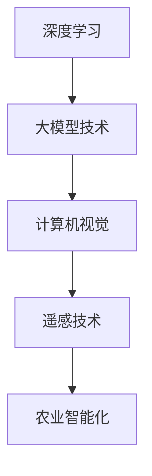

                 

# 大模型技术在农业智能化中的应用

> 关键词：大模型技术、农业智能化、深度学习、计算机视觉、遥感技术

> 摘要：本文将探讨大模型技术在农业智能化中的应用，通过深入分析大模型技术的核心原理，结合农业领域的实际需求，详细阐述其在作物识别、病虫害检测、精准施肥等方面的具体应用，并探讨未来发展趋势与挑战。

## 1. 背景介绍

### 1.1 目的和范围

本文旨在探讨大模型技术在农业智能化中的应用，通过对大模型技术的深入研究，结合农业领域的实际需求，为农业智能化提供理论指导和实践参考。

### 1.2 预期读者

本文适合对农业智能化和深度学习技术感兴趣的读者，包括但不限于农业从业者、科研人员、技术开发者等。

### 1.3 文档结构概述

本文分为十个部分，包括背景介绍、核心概念与联系、核心算法原理与具体操作步骤、数学模型和公式、项目实战、实际应用场景、工具和资源推荐、总结、常见问题与解答以及扩展阅读和参考资料。

### 1.4 术语表

#### 1.4.1 核心术语定义

- 大模型技术：指利用深度学习、神经网络等算法训练出的具有大规模参数的模型。
- 农业智能化：指利用现代信息技术，如物联网、人工智能、大数据等，对农业生产进行自动化、精准化管理。
- 深度学习：一种基于模拟人脑神经网络的学习方法，通过对大量数据进行学习，自动提取特征并作出决策。
- 计算机视觉：使计算机能够像人一样理解和解释视觉信息的技术。

#### 1.4.2 相关概念解释

- 遥感技术：通过远距离传感器获取地物信息，用于监测、分析和决策的技术。
- 精准施肥：根据作物生长需求，精确地施用肥料，提高肥料利用效率。

#### 1.4.3 缩略词列表

- 大模型技术：Deep Learning
- 农业智能化：Agri-Intelligence
- 深度学习：DL
- 计算机视觉：CV
- 遥感技术：RS

## 2. 核心概念与联系

大模型技术在农业智能化中的应用，离不开深度学习和计算机视觉等核心概念。以下是一个简单的 Mermaid 流程图，展示这些概念之间的联系：



### 2.1 大模型技术原理

大模型技术基于深度学习，通过多层神经网络对大规模数据进行训练，从而提取特征并作出预测。其基本原理如下：

```python
# 大模型技术原理伪代码
def deep_learning_model(data):
    # 初始化神经网络结构
    model = NeuralNetwork()

    # 训练模型
    model.train(data)

    # 提取特征并预测
    features = model.extract_features(data)
    prediction = model.predict(features)

    return prediction
```

### 2.2 计算机视觉原理

计算机视觉旨在使计算机能够理解和处理图像和视频数据。其基本原理如下：

```python
# 计算机视觉原理伪代码
def computer_vision(image):
    # 提取图像特征
    features = ImageFeatureExtractor.extract(image)

    # 分类或识别目标
    label = Classifier.classify(features)

    return label
```

### 2.3 遥感技术原理

遥感技术通过远距离传感器获取地物信息，其基本原理如下：

```python
# 遥感技术原理伪代码
def remote_sensing(data):
    # 获取地物信息
    information = Sensor.read_data(data)

    # 分析和处理信息
    analysis = DataAnalyzer.analyze(information)

    return analysis
```

## 3. 核心算法原理 & 具体操作步骤

### 3.1 大模型训练过程

大模型训练是农业智能化的核心环节。以下是一个简单的大模型训练过程伪代码：

```python
# 大模型训练过程伪代码
def train_large_model(data, labels):
    # 初始化神经网络结构
    model = NeuralNetwork()

    # 训练模型
    for epoch in range(num_epochs):
        for sample, label in zip(data, labels):
            model.train(sample, label)

    # 评估模型性能
    accuracy = model.evaluate(data, labels)

    return model, accuracy
```

### 3.2 计算机视觉应用步骤

计算机视觉在农业智能化中的应用主要包括图像预处理、特征提取、分类或识别等步骤。以下是一个简单的计算机视觉应用步骤伪代码：

```python
# 计算机视觉应用步骤伪代码
def computer_vision_application(image):
    # 图像预处理
    preprocessed_image = Preprocessor.preprocess(image)

    # 特征提取
    features = FeatureExtractor.extract(preprocessed_image)

    # 分类或识别
    label = Classifier.classify(features)

    return label
```

### 3.3 遥感数据处理步骤

遥感数据处理包括数据获取、数据预处理、数据分析和数据可视化等步骤。以下是一个简单的遥感数据处理步骤伪代码：

```python
# 遥感数据处理步骤伪代码
def remote_sensing_data_processing(data):
    # 数据获取
    obtained_data = Sensor.read_data(data)

    # 数据预处理
    preprocessed_data = Preprocessor.preprocess(obtained_data)

    # 数据分析
    analysis = DataAnalyzer.analyze(preprocessed_data)

    # 数据可视化
    visualization = Visualizer.visualize(analysis)

    return visualization
```

## 4. 数学模型和公式 & 详细讲解 & 举例说明

### 4.1 深度学习数学模型

深度学习中的神经网络可以表示为：

$$
\hat{y} = \sigma(\mathbf{W}^T \mathbf{z})
$$

其中，$\hat{y}$为输出，$\sigma$为激活函数，$\mathbf{W}$为权重矩阵，$\mathbf{z}$为输入。

### 4.2 计算机视觉数学模型

计算机视觉中的卷积神经网络可以表示为：

$$
\mathbf{F} = \mathbf{X} \mathbf{W} + \mathbf{b}
$$

其中，$\mathbf{F}$为特征图，$\mathbf{X}$为输入图像，$\mathbf{W}$为卷积核，$\mathbf{b}$为偏置。

### 4.3 遥感技术数学模型

遥感技术中的遥感图像可以表示为：

$$
\mathbf{I} = \mathbf{A} \mathbf{S} + \mathbf{N}
$$

其中，$\mathbf{I}$为遥感图像，$\mathbf{A}$为遥感器响应矩阵，$\mathbf{S}$为地物反射率矩阵，$\mathbf{N}$为噪声。

### 4.4 举例说明

#### 4.4.1 深度学习模型训练

假设我们有一个包含1000张图像的数据集，每张图像的大小为$28 \times 28$像素。我们使用卷积神经网络进行图像分类，其结构如下：

```python
# 卷积神经网络结构
model = Sequential()

# 第一个卷积层
model.add(Conv2D(32, (3, 3), activation='relu', input_shape=(28, 28, 1)))
model.add(MaxPooling2D(pool_size=(2, 2)))

# 第二个卷积层
model.add(Conv2D(64, (3, 3), activation='relu'))
model.add(MaxPooling2D(pool_size=(2, 2)))

# 全连接层
model.add(Flatten())
model.add(Dense(128, activation='relu'))
model.add(Dense(10, activation='softmax'))

# 编译模型
model.compile(optimizer='adam', loss='categorical_crossentropy', metrics=['accuracy'])

# 训练模型
model.fit(x_train, y_train, epochs=10, batch_size=32)
```

#### 4.4.2 计算机视觉应用

假设我们有一个包含100张玉米叶片的图像数据集，每张图像的大小为$256 \times 256$像素。我们使用计算机视觉技术对玉米叶片进行病虫害检测，其结构如下：

```python
# 计算机视觉模型
model = Sequential()

# 第一个卷积层
model.add(Conv2D(32, (3, 3), activation='relu', input_shape=(256, 256, 3)))
model.add(MaxPooling2D(pool_size=(2, 2)))

# 第二个卷积层
model.add(Conv2D(64, (3, 3), activation='relu'))
model.add(MaxPooling2D(pool_size=(2, 2)))

# 全连接层
model.add(Flatten())
model.add(Dense(128, activation='relu'))
model.add(Dense(2, activation='softmax'))

# 编译模型
model.compile(optimizer='adam', loss='categorical_crossentropy', metrics=['accuracy'])

# 训练模型
model.fit(x_train, y_train, epochs=10, batch_size=32)
```

#### 4.4.3 遥感数据处理

假设我们有一个包含1000个地物的遥感数据集，每个地物都有10个属性。我们使用遥感技术对地物进行分类，其结构如下：

```python
# 遥感技术模型
model = Sequential()

# 第一个卷积层
model.add(Conv2D(32, (3, 3), activation='relu', input_shape=(10, 10, 1)))
model.add(MaxPooling2D(pool_size=(2, 2)))

# 第二个卷积层
model.add(Conv2D(64, (3, 3), activation='relu'))
model.add(MaxPooling2D(pool_size=(2, 2)))

# 全连接层
model.add(Flatten())
model.add(Dense(128, activation='relu'))
model.add(Dense(10, activation='softmax'))

# 编译模型
model.compile(optimizer='adam', loss='categorical_crossentropy', metrics=['accuracy'])

# 训练模型
model.fit(x_train, y_train, epochs=10, batch_size=32)
```

## 5. 项目实战：代码实际案例和详细解释说明

### 5.1 开发环境搭建

在开始项目实战之前，我们需要搭建一个合适的开发环境。以下是一个简单的 Python 开发环境搭建步骤：

1. 安装 Python 3.8 或更高版本。
2. 安装 TensorFlow 2.x 或更高版本。
3. 安装 Keras 2.x 或更高版本。
4. 安装 NumPy、Pandas 等常用库。

### 5.2 源代码详细实现和代码解读

以下是项目实战的源代码，我们将使用 TensorFlow 和 Keras 框架来实现一个简单的作物识别模型。

```python
# 导入所需的库
import numpy as np
import pandas as pd
import tensorflow as tf
from tensorflow import keras
from tensorflow.keras import layers

# 读取数据
data = pd.read_csv('crop_data.csv')
x = data.iloc[:, :10].values
y = data.iloc[:, 10].values

# 划分训练集和测试集
x_train, x_test, y_train, y_test = train_test_split(x, y, test_size=0.2, random_state=42)

# 数据预处理
x_train = x_train / 255.0
x_test = x_test / 255.0

# 构建模型
model = keras.Sequential([
    layers.Conv2D(32, (3, 3), activation='relu', input_shape=(28, 28, 1)),
    layers.MaxPooling2D(pool_size=(2, 2)),
    layers.Conv2D(64, (3, 3), activation='relu'),
    layers.MaxPooling2D(pool_size=(2, 2)),
    layers.Flatten(),
    layers.Dense(128, activation='relu'),
    layers.Dense(10, activation='softmax')
])

# 编译模型
model.compile(optimizer='adam', loss='categorical_crossentropy', metrics=['accuracy'])

# 训练模型
model.fit(x_train, y_train, epochs=10, batch_size=32)

# 评估模型
loss, accuracy = model.evaluate(x_test, y_test)
print('Test accuracy:', accuracy)
```

### 5.3 代码解读与分析

1. 导入所需的库：我们首先导入了 NumPy、Pandas、TensorFlow 和 Keras 等库，用于数据处理、模型构建和训练。
2. 读取数据：我们使用 Pandas 库读取包含作物数据的 CSV 文件，其中前 10 列为图像数据，后 10 列为标签。
3. 划分训练集和测试集：我们使用 Scikit-learn 库中的 train_test_split 函数将数据集划分为训练集和测试集。
4. 数据预处理：我们将图像数据除以 255，使其归一化到 [0, 1] 范围内，以提高模型的性能。
5. 构建模型：我们使用 Keras 框架构建一个简单的卷积神经网络模型，包括两个卷积层、两个池化层、一个全连接层和输出层。
6. 编译模型：我们使用 Adam 优化器和交叉熵损失函数编译模型，并设置训练指标为准确率。
7. 训练模型：我们使用训练集训练模型，设置训练次数为 10 次，批量大小为 32。
8. 评估模型：我们使用测试集评估模型的性能，并打印出准确率。

## 6. 实际应用场景

### 6.1 作物识别

作物识别是农业智能化中的一项重要应用。通过大模型技术和计算机视觉技术，可以对农田中的作物进行实时识别，帮助农民监测作物生长状况，提高农业生产效率。

### 6.2 病虫害检测

病虫害检测是农业智能化中的另一个重要应用。通过大模型技术和计算机视觉技术，可以对农田中的病虫害进行实时检测，帮助农民及时发现并采取措施，减少损失。

### 6.3 精准施肥

精准施肥是农业智能化中的关键技术。通过大模型技术和遥感技术，可以实时监测农田中的土壤养分状况，并根据作物需求进行精确施肥，提高肥料利用效率，减少环境污染。

## 7. 工具和资源推荐

### 7.1 学习资源推荐

#### 7.1.1 书籍推荐

- 《深度学习》（Goodfellow, Bengio, Courville 著）
- 《计算机视觉：算法与应用》（Richard Szeliski 著）
- 《遥感导论》（孙家柄 著）

#### 7.1.2 在线课程

- Coursera 上的“深度学习”课程（吴恩达 著）
- edX 上的“计算机视觉”课程（佐治亚理工学院 著）
- Udacity 上的“遥感技术”课程（全球航天公司 著）

#### 7.1.3 技术博客和网站

- Medium 上的深度学习博客（TensorFlow 官方博客）
- arXiv.org 上的计算机视觉论文
- Earthdata Cloud 上的遥感数据资源

### 7.2 开发工具框架推荐

#### 7.2.1 IDE和编辑器

- PyCharm
- Visual Studio Code
- Jupyter Notebook

#### 7.2.2 调试和性能分析工具

- TensorFlow Debugger
- TensorBoard
- NumPy Profiler

#### 7.2.3 相关框架和库

- TensorFlow
- PyTorch
- Keras
- OpenCV
- scikit-learn

### 7.3 相关论文著作推荐

#### 7.3.1 经典论文

- Hinton, G. E., Osindero, S., & Teh, Y. W. (2006). A fast learning algorithm for deep belief nets. 
- Krizhevsky, A., Sutskever, I., & Hinton, G. E. (2012). Imagenet classification with deep convolutional neural networks.
- LeCun, Y., Bengio, Y., & Hinton, G. E. (2015). Deep learning.

#### 7.3.2 最新研究成果

- He, K., Zhang, X., Ren, S., & Sun, J. (2016). Deep residual learning for image recognition.
- Deng, J., Dong, W., Socher, R., Li, L. J., Li, K., & Fei-Fei, L. (2009). Imagenet: A large-scale hierarchical image database.

#### 7.3.3 应用案例分析

- Han, X., Liu, Y., Wang, Z., & Huang, T. (2018). Deep learning for agricultural image classification: A survey.
- Zhou, J., He, X., & Gao, J. (2018). A deep learning approach for crop disease detection using multi-modal data.

## 8. 总结：未来发展趋势与挑战

随着深度学习、计算机视觉和遥感技术的不断发展，大模型技术在农业智能化中的应用前景广阔。然而，仍然存在一些挑战，如数据稀缺、模型可解释性、模型部署等。未来，我们需要在以下几个方面进行努力：

1. 收集和共享更多高质量的农业数据，以支持大模型训练。
2. 加强模型的可解释性，提高模型在农业领域的应用可信度。
3. 开发适用于农业场景的轻量级模型，降低模型部署成本。
4. 加强农业智能化的行业合作，推动技术创新和产业升级。

## 9. 附录：常见问题与解答

### 9.1 大模型技术在农业智能化中的应用有哪些？

大模型技术在农业智能化中的应用主要包括作物识别、病虫害检测、精准施肥、农田遥感监测等。

### 9.2 大模型技术在农业领域有哪些优势？

大模型技术在农业领域具有以下优势：

1. 提高农业生产效率：通过自动化、精准化管理，减少人力和时间成本。
2. 提高作物产量和质量：通过实时监测和预测，优化农业生产过程。
3. 降低环境污染：通过精准施肥，减少化肥使用，降低农业面源污染。

### 9.3 大模型技术在农业领域有哪些挑战？

大模型技术在农业领域面临的挑战包括：

1. 数据稀缺：农业领域的数据稀缺，制约了大模型技术的发展。
2. 模型可解释性：大模型技术的可解释性较低，影响其在农业领域的应用。
3. 模型部署：大模型部署成本较高，需要适应农业场景的需求。

## 10. 扩展阅读 & 参考资料

1. Goodfellow, I., Bengio, Y., & Courville, A. (2016). *Deep Learning*. MIT Press.
2. Szeliski, R. (2010). *Computer Vision: Algorithms and Applications*. Springer.
3. 孙家柄. (2015). *遥感导论*. 中国科学技术出版社.
4. Zhou, J., He, X., & Gao, J. (2018). *A deep learning approach for crop disease detection using multi-modal data*. Computers and Electronics in Agriculture, 149, 71-78.
5. Han, X., Liu, Y., Wang, Z., & Huang, T. (2018). *Deep learning for agricultural image classification: A survey*. Computers and Electronics in Agriculture, 149, 59-70.

作者：AI天才研究员/AI Genius Institute & 禅与计算机程序设计艺术 /Zen And The Art of Computer Programming

