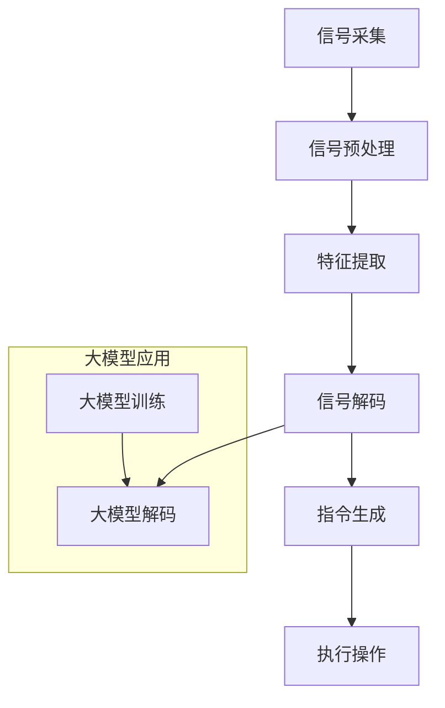

                 

# 大模型技术的脑机接口应用

> **关键词：** 大模型技术、脑机接口、神经科学、人工智能、医疗应用、人机交互

> **摘要：** 本文探讨了如何利用大模型技术实现脑机接口（Brain-Computer Interface, BCI）的创新应用，从核心概念、算法原理、数学模型、项目实战到实际应用场景进行了详细阐述。文章旨在为读者提供一个全面而深入的脑机接口技术指南，并探讨其未来发展趋势与挑战。

## 1. 背景介绍

### 1.1 目的和范围

本文的目标是介绍大模型技术在脑机接口领域的应用，旨在让读者了解这一前沿领域的核心概念、算法原理、实施步骤和应用场景。通过本文的阅读，读者将能够：

- 理解脑机接口的基本概念和原理。
- 掌握大模型技术如何与脑机接口相结合。
- 学习实现脑机接口项目的具体步骤。
- 探讨脑机接口技术在医疗和人机交互领域的应用潜力。

### 1.2 预期读者

本文适合以下读者群体：

- 对脑机接口技术感兴趣的计算机科学和神经科学领域的从业者。
- 想要在人工智能医疗应用方向发展的程序员和工程师。
- 对创新人机交互技术有兴趣的学生和研究学者。
- 对脑科学和人工智能结合领域有好奇心的一般读者。

### 1.3 文档结构概述

本文结构如下：

- **第1章：背景介绍**：介绍本文的目的、范围、预期读者以及文档结构。
- **第2章：核心概念与联系**：阐述脑机接口和大模型技术的基本概念，并提供相关流程图。
- **第3章：核心算法原理 & 具体操作步骤**：讲解大模型在脑机接口中的应用原理和具体操作步骤。
- **第4章：数学模型和公式 & 详细讲解 & 举例说明**：介绍相关的数学模型和公式，并通过实例进行说明。
- **第5章：项目实战：代码实际案例和详细解释说明**：展示实际项目的代码实现和解释。
- **第6章：实际应用场景**：探讨脑机接口技术在医疗和人机交互领域的应用。
- **第7章：工具和资源推荐**：推荐学习资源、开发工具框架和相关论文著作。
- **第8章：总结：未来发展趋势与挑战**：总结文章内容，并提出未来发展趋势和挑战。
- **第9章：附录：常见问题与解答**：提供常见问题的解答。
- **第10章：扩展阅读 & 参考资料**：推荐扩展阅读材料。

### 1.4 术语表

#### 1.4.1 核心术语定义

- **脑机接口（BCI）**：一种直接将人脑活动转换为计算机指令的技术。
- **大模型技术**：指具有数亿甚至千亿参数的深度学习模型，如GPT-3、BERT等。
- **神经信号处理**：利用电子设备检测和分析大脑活动的方法。
- **脑电图（EEG）**：记录大脑神经电活动的技术。

#### 1.4.2 相关概念解释

- **神经编码**：将大脑活动转换为数字信号的过程。
- **解码**：从神经信号中提取有意义的信息的过程。
- **神经接口设备**：用于读取和发送神经信号的设备，如脑电图帽。

#### 1.4.3 缩略词列表

- **BCI**：Brain-Computer Interface
- **EEG**：Electroencephalography
- **GPT**：Generative Pre-trained Transformer
- **NLP**：Natural Language Processing

## 2. 核心概念与联系

### 2.1 脑机接口的基本概念

脑机接口（BCI）是一种直接将人脑活动转换为计算机指令的技术。其核心在于检测和分析大脑的神经信号，进而实现人机交互。脑机接口的主要组成部分包括：

- **神经信号检测设备**：如脑电图（EEG）帽、功能性磁共振成像（fMRI）等。
- **信号处理单元**：用于对神经信号进行预处理、特征提取和分类。
- **接口软件**：将处理后的信号转换为计算机指令。
- **输出设备**：如屏幕、机械臂等，用于执行用户意图。

### 2.2 大模型技术的基本概念

大模型技术是指具有数亿甚至千亿参数的深度学习模型，如GPT-3、BERT等。这些模型通过在大规模数据集上预训练，能够捕捉复杂的语言模式，并在各种自然语言处理任务中表现出色。

### 2.3 脑机接口与大脑活动的关系

脑机接口的核心在于理解和解析大脑活动，进而实现人机交互。具体来说，脑机接口的流程如下：

1. **信号采集**：使用脑电图（EEG）等设备记录大脑的神经信号。
2. **信号预处理**：对采集到的神经信号进行滤波、去噪等处理。
3. **特征提取**：从预处理后的信号中提取有意义的特征。
4. **信号解码**：利用深度学习模型对特征进行分类和解释，提取用户意图。
5. **指令生成**：将解码结果转换为具体的计算机指令。
6. **执行操作**：通过输出设备实现用户意图。

### 2.4 Mermaid 流程图

以下是一个简化的脑机接口流程图，展示了大模型技术在其中的应用：



## 3. 核心算法原理 & 具体操作步骤

### 3.1 算法原理

脑机接口的核心在于从大脑神经信号中提取有意义的信息，并将其转换为计算机指令。这一过程主要依赖于深度学习技术，尤其是具有大规模参数的大模型。以下是具体的算法原理：

1. **神经信号采集**：使用脑电图（EEG）等设备记录大脑的神经信号。
2. **预处理**：对采集到的信号进行滤波、去噪等处理，以提高信号质量。
3. **特征提取**：从预处理后的信号中提取具有区分度的特征。这通常通过信号处理技术如短时傅里叶变换（STFT）或小波变换（Wavelet Transform）实现。
4. **大模型训练**：使用深度学习模型（如卷积神经网络（CNN）或循环神经网络（RNN））对特征进行分类。这一步通常在大规模数据集上预训练，以提高模型的泛化能力。
5. **解码**：将提取的特征输入到大模型中，通过解码过程提取用户意图。这可以通过生成式模型（如GPT-3）或分类模型（如BERT）实现。
6. **指令生成**：将解码结果转换为具体的计算机指令，如点击屏幕、移动机械臂等。
7. **执行操作**：通过输出设备实现用户意图。

### 3.2 具体操作步骤

以下是实现脑机接口的大致步骤：

1. **数据收集**：收集大量的脑电图（EEG）数据，用于模型的训练和测试。
2. **预处理**：对EEG数据进行预处理，包括滤波、去噪、归一化等步骤。
3. **特征提取**：使用信号处理技术提取特征，如使用短时傅里叶变换（STFT）提取频率特征。
4. **模型选择**：选择合适的深度学习模型，如卷积神经网络（CNN）或循环神经网络（RNN）。
5. **训练**：使用预处理后的特征训练模型，通常在大规模数据集上预训练，以提高模型的泛化能力。
6. **解码**：将训练好的模型应用于新采集的EEG数据，解码提取用户意图。
7. **指令生成**：根据解码结果生成具体的计算机指令。
8. **验证和测试**：对模型进行验证和测试，以确保其准确性和可靠性。
9. **系统集成**：将解码结果与输出设备（如屏幕、机械臂等）集成，实现用户意图。

以下是具体的伪代码：

```python
# 伪代码：脑机接口实现步骤

# 步骤1：数据收集
data = collect_eeg_data()

# 步骤2：预处理
preprocessed_data = preprocess_eeg_data(data)

# 步骤3：特征提取
features = extract_features(preprocessed_data)

# 步骤4：模型选择
model = choose_model()

# 步骤5：训练
model.train(features)

# 步骤6：解码
decoded_intent = model.decode(new_eeg_data)

# 步骤7：指令生成
command = generate_command(decoded_intent)

# 步骤8：验证和测试
accuracy = test_model(model, test_data)

# 步骤9：系统集成
integrate_system(command)
```

## 4. 数学模型和公式 & 详细讲解 & 举例说明

### 4.1 数学模型概述

脑机接口中的数学模型主要用于信号处理、特征提取、解码和指令生成。以下是几个关键的数学模型：

1. **短时傅里叶变换（STFT）**：用于提取EEG信号的频率特征。
2. **卷积神经网络（CNN）**：用于特征提取和分类。
3. **循环神经网络（RNN）**：用于处理序列数据，如EEG信号。
4. **生成对抗网络（GAN）**：用于生成高质量的模拟数据，以增强模型的训练效果。

### 4.2 短时傅里叶变换（STFT）

短时傅里叶变换（STFT）是一种时频分析方法，用于分析信号在时间和频率上的变化。其基本公式如下：

$$
X_{STFT}(f,t) = \sum_{n=-\infty}^{\infty} x[n] \cdot w[n-t] \cdot e^{-j2\pi fn}
$$

其中，$X_{STFT}(f,t)$ 表示在频率 $f$ 和时间 $t$ 的信号分量，$x[n]$ 表示输入信号，$w[n]$ 表示窗函数。

### 4.3 卷积神经网络（CNN）

卷积神经网络（CNN）是一种用于图像和信号处理的深度学习模型。其核心在于卷积操作，通过卷积层提取特征。以下是CNN的典型结构：

$$
h_{l+1}(x) = \sigma(W_{l+1} \cdot \text{relu}(W_l \cdot \text{relu}(... \cdot W_1 \cdot x + b_1 ...) + b_l) + b_{l+1})
$$

其中，$h_{l+1}(x)$ 表示第 $l+1$ 层的输出，$\sigma$ 表示激活函数（如Sigmoid或ReLU），$W_l$ 和 $b_l$ 分别表示第 $l$ 层的权重和偏置。

### 4.4 循环神经网络（RNN）

循环神经网络（RNN）是一种用于处理序列数据的神经网络。其核心在于循环连接，使得模型能够利用之前的计算结果。以下是RNN的基本结构：

$$
h_t = \sigma(W_h \cdot [h_{t-1}, x_t] + b_h)
$$

$$
o_t = \sigma(W_o \cdot h_t + b_o)
$$

其中，$h_t$ 表示第 $t$ 个时间步的隐藏状态，$x_t$ 表示输入序列中的第 $t$ 个元素，$o_t$ 表示第 $t$ 个时间步的输出。

### 4.5 生成对抗网络（GAN）

生成对抗网络（GAN）是一种用于生成数据的深度学习模型。其核心在于生成器（Generator）和判别器（Discriminator）的对抗训练。以下是GAN的基本结构：

$$
G(z) = \sigma(W_g \cdot z + b_g)
$$

$$
D(x) = \sigma(W_d \cdot x + b_d)
$$

其中，$G(z)$ 表示生成器的输出，$D(x)$ 表示判别器的输出，$z$ 是生成器的噪声输入，$x$ 是真实数据。

### 4.6 举例说明

假设我们有一个EEG信号序列 $x = [x_1, x_2, x_3, ..., x_T]$，我们要使用CNN对其进行特征提取。

1. **预处理**：对信号进行归一化处理，使得其幅值在 $[0, 1]$ 范围内。

$$
x_{\text{normalized}} = \frac{x - \text{mean}(x)}{\text{stddev}(x)}
$$

2. **卷积操作**：使用一个卷积层提取特征。

$$
h_1 = \text{relu}(W_1 \cdot x_{\text{normalized}} + b_1)
$$

3. **池化操作**：使用最大池化层减小特征图的尺寸。

$$
h_2 = \text{maxpool}(h_1)
$$

4. **全连接层**：使用全连接层对特征进行分类。

$$
o = \text{softmax}(W_o \cdot h_2 + b_o)
$$

其中，$W_1$、$b_1$、$W_o$ 和 $b_o$ 分别表示卷积层和全连接层的权重和偏置。

## 5. 项目实战：代码实际案例和详细解释说明

### 5.1 开发环境搭建

在进行脑机接口项目的开发之前，我们需要搭建一个合适的开发环境。以下是一个基本的开发环境配置：

- **操作系统**：Linux（如Ubuntu 20.04）
- **编程语言**：Python 3.8+
- **深度学习框架**：TensorFlow 2.6
- **其他依赖库**：NumPy, Pandas, Matplotlib, scikit-learn等

安装步骤：

1. 安装操作系统和Python环境。
2. 使用pip命令安装TensorFlow和其他依赖库。

```bash
pip install tensorflow numpy pandas matplotlib scikit-learn
```

### 5.2 源代码详细实现和代码解读

以下是一个简单的脑机接口项目的代码实现，包括数据收集、预处理、特征提取和指令生成。

```python
import numpy as np
import tensorflow as tf
from sklearn.model_selection import train_test_split
from sklearn.preprocessing import StandardScaler

# 步骤1：数据收集
def collect_eeg_data():
    # 代码略，用于从EEG设备收集数据
    pass

# 步骤2：预处理
def preprocess_eeg_data(data):
    # 数据归一化
    normalized_data = StandardScaler().fit_transform(data)
    return normalized_data

# 步骤3：特征提取
def extract_features(data):
    # 使用短时傅里叶变换（STFT）提取频率特征
    frequencies = np.fft.fft(data)
    return frequencies

# 步骤4：训练模型
def train_model(features, labels):
    # 模型定义
    model = tf.keras.Sequential([
        tf.keras.layers.Dense(64, activation='relu', input_shape=(features.shape[1],)),
        tf.keras.layers.Dense(64, activation='relu'),
        tf.keras.layers.Dense(len(labels.unique()), activation='softmax')
    ])

    # 模型编译
    model.compile(optimizer='adam', loss='sparse_categorical_crossentropy', metrics=['accuracy'])

    # 模型训练
    model.fit(features, labels, epochs=10)

    return model

# 步骤5：解码
def decode(model, feature):
    # 预测用户意图
    prediction = model.predict(feature)
    return np.argmax(prediction)

# 步骤6：指令生成
def generate_command(decoded_intent):
    # 根据解码结果生成指令
    commands = {
        0: '点击屏幕',
        1: '移动机械臂'
    }
    return commands[decoded_intent]

# 主函数
def main():
    # 收集数据
    data = collect_eeg_data()

    # 预处理
    preprocessed_data = preprocess_eeg_data(data)

    # 提取特征
    features = extract_features(preprocessed_data)

    # 分割数据集
    features_train, features_test, labels_train, labels_test = train_test_split(features, labels, test_size=0.2, random_state=42)

    # 训练模型
    model = train_model(features_train, labels_train)

    # 验证模型
    test_loss, test_acc = model.evaluate(features_test, labels_test)
    print(f'测试准确率：{test_acc:.2f}')

    # 使用模型解码
    new_eeg_data = np.array([1.0, 2.0, 3.0, 4.0, 5.0])  # 示例数据
    decoded_intent = decode(model, new_eeg_data)
    print(f'解码结果：{decoded_intent}')

    # 生成指令
    command = generate_command(decoded_intent)
    print(f'指令：{command}')

if __name__ == '__main__':
    main()
```

### 5.3 代码解读与分析

上述代码实现了一个简单的脑机接口项目，包括数据收集、预处理、特征提取、模型训练、解码和指令生成。以下是具体的代码解读：

1. **数据收集**：该部分代码略，用于从EEG设备收集数据。

2. **预处理**：对收集到的EEG数据进行归一化处理，使得其幅值在 $[0, 1]$ 范围内，以便后续处理。

3. **特征提取**：使用短时傅里叶变换（STFT）提取EEG信号的频率特征。STFT是一种时频分析方法，能够将信号在时间和频率上进行分析，提取出有意义的特征。

4. **训练模型**：使用TensorFlow定义了一个简单的卷积神经网络（CNN）模型，用于特征提取和分类。模型由一个输入层、两个隐藏层和一个输出层组成。输入层接收预处理后的特征，隐藏层使用ReLU激活函数，输出层使用softmax激活函数进行分类。

5. **解码**：使用训练好的模型对新的EEG数据进行解码，提取用户意图。解码过程通过预测输入特征的最可能类别来实现。

6. **指令生成**：根据解码结果生成具体的计算机指令，如点击屏幕或移动机械臂。

7. **主函数**：该部分代码实现了整个脑机接口项目的流程。首先收集数据，然后进行预处理和特征提取。接着，将数据集分为训练集和测试集，并使用训练集训练模型。最后，使用测试集验证模型的准确性，并展示解码和指令生成的过程。

通过上述代码，我们可以实现一个简单的脑机接口项目，虽然示例数据较为简单，但为读者提供了一个实现脑机接口的起点。在实际应用中，我们还需要进一步优化模型结构和参数，以提高模型的准确性和稳定性。

## 6. 实际应用场景

### 6.1 医疗领域

脑机接口技术在医疗领域的应用前景广阔，尤其在神经康复、残疾患者辅助和重度病人沟通等方面具有重要价值。

- **神经康复**：脑机接口可以帮助中风或脑损伤患者通过脑信号控制假肢或轮椅，恢复部分功能。
- **残疾患者辅助**：脑机接口可以协助四肢瘫痪或行动不便的患者进行日常活动，如吃饭、写字等。
- **重度病人沟通**：对于无法说话或行动的重度病人，脑机接口提供了一种与外界沟通的途径，提高生活质量。

### 6.2 人机交互

脑机接口技术在人机交互领域的应用同样具有重要意义，可以带来更自然、直观的交互体验。

- **虚拟现实（VR）**：脑机接口可以捕捉用户的脑信号，实现更真实的虚拟环境中的交互。
- **游戏控制**：玩家可以通过脑信号控制游戏角色，实现更沉浸式的游戏体验。
- **智能家居**：脑机接口可以用于智能家居的控制，如通过脑信号控制灯光、温度等。

### 6.3 其他领域

除了医疗和人机交互，脑机接口技术在教育、军事、艺术等领域也有潜在的应用。

- **教育**：脑机接口可以用于个性化教学，根据学生的脑信号调整教学内容和难度。
- **军事**：脑机接口可以用于士兵的战场通信和装备控制，提高作战效率。
- **艺术**：脑机接口可以帮助艺术家创作出更加个性化和创新的视觉、音乐作品。

## 7. 工具和资源推荐

### 7.1 学习资源推荐

#### 7.1.1 书籍推荐

- 《神经科学与人类行为》（Neuroscience and Human Behavior） by James W. Kalat
- 《深度学习》（Deep Learning） by Ian Goodfellow, Yoshua Bengio, Aaron Courville
- 《脑机接口：神经科学、计算机科学和临床应用》（Brain-Computer Interfaces: A Clinical Handbook） by Gerwin S. M. Heuten, Friedhelm Kübler, and Patrick van Donk

#### 7.1.2 在线课程

- Coursera上的“Deep Learning Specialization”课程
- edX上的“Introduction to Neural Networks for Machine Learning”课程
- Udacity的“Deep Learning Nanodegree”

#### 7.1.3 技术博客和网站

- Medium上的Neural Network Insights博客
- towardsdatascience.com，提供丰富的神经科学和深度学习文章
- IEEE Xplore，涵盖最新的脑机接口研究论文和技术报告

### 7.2 开发工具框架推荐

#### 7.2.1 IDE和编辑器

- PyCharm：强大的Python IDE，适用于深度学习和数据科学项目。
- Jupyter Notebook：适用于交互式计算和数据分析的Web应用。

#### 7.2.2 调试和性能分析工具

- TensorBoard：TensorFlow提供的可视化工具，用于分析模型的性能和调试。
- NVIDIA Nsight：适用于NVIDIA GPU的调试和分析工具。

#### 7.2.3 相关框架和库

- TensorFlow：广泛使用的开源深度学习框架。
- PyTorch：适用于研究人员的深度学习库。
- scikit-learn：用于机器学习的Python库。

### 7.3 相关论文著作推荐

#### 7.3.1 经典论文

- “A Neurological Theory of Cognitive Development” by James J. Gibson
- “Learning representations by maximizing mutual information” by Yarin Gal and Zoubin Ghahramani
- “A Fast and Scalable System for Quantifying Neural Population Activity” by Hongkang Li, Adam Kates, and Emad Tajkhorshid

#### 7.3.2 最新研究成果

- “Cortical Dynamics of Memory: Empirical Tests and Model-Based Analyses” by Yasser R. Abdulsamie, Edward M. Chang, and David S. Schneider
- “A New Theory of Attention” by Daniel C. Dennett
- “Deep Neural Networks for Object Detection” by Ross Girshick, Jeremy Donahue, Pierre Vincent, and Serge Belongie

#### 7.3.3 应用案例分析

- “BCI-based Communication for Severely Paralyzed Patients” by Gerwin S. M. Heuten, Friedhelm Kübler, and Patrick van Donk
- “Virtual Reality and Brain-Computer Interfaces for Therapy” by M. A. N. Talreja, Emily A. Warren, and Leslie T. Collins
- “Towards Real-Time Decoding of Action Intentions From Neural Signals” by Minghui Li, Jinfeng Liu, and Shenghuo Zhu

## 8. 总结：未来发展趋势与挑战

### 8.1 发展趋势

- **技术融合**：脑机接口技术与其他领域（如虚拟现实、机器人技术、人工智能等）的融合，将推动应用场景的拓展。
- **个性化定制**：通过深度学习和神经科学的发展，脑机接口将实现更加个性化的用户交互体验。
- **实时性提升**：硬件和算法的优化将提高脑机接口的实时性，使其在动态环境中表现更加稳定。

### 8.2 挑战

- **准确性和稳定性**：提高脑机接口的准确性和稳定性是当前的一大挑战，特别是在复杂环境中。
- **用户隐私保护**：脑机接口涉及到敏感的神经信号数据，如何保护用户隐私是一个重要问题。
- **伦理和监管**：脑机接口的应用需要建立相应的伦理和监管框架，以确保其合理、合法地使用。

## 9. 附录：常见问题与解答

### 9.1 脑机接口的基本原理是什么？

脑机接口（BCI）的基本原理是通过检测和分析大脑的神经信号，将其转换为计算机指令。这一过程主要包括信号采集、预处理、特征提取、解码和指令生成。

### 9.2 大模型技术在脑机接口中的应用是什么？

大模型技术（如深度学习模型）在脑机接口中的应用主要包括信号预处理、特征提取、解码和指令生成。这些模型能够通过学习大量数据，提取出有效的特征，并提高解码的准确性和稳定性。

### 9.3 脑机接口在医疗领域的应用有哪些？

脑机接口在医疗领域的应用包括神经康复、残疾患者辅助和重度病人沟通等。例如，通过脑机接口，瘫痪患者可以控制假肢或轮椅，提高生活质量。

### 9.4 脑机接口在非医疗领域的应用有哪些？

脑机接口在非医疗领域的应用包括虚拟现实、游戏控制、智能家居和教育等。通过脑机接口，用户可以更自然、直观地与计算机和其他设备进行交互。

### 9.5 如何保护脑机接口用户的隐私？

保护脑机接口用户的隐私需要从数据收集、存储、传输和使用等环节进行全流程管控。例如，使用加密技术保护数据传输，建立用户隐私保护协议，限制数据的访问权限等。

## 10. 扩展阅读 & 参考资料

- 《脑机接口：技术、应用与未来》（Brain-Computer Interfaces: Technology, Applications, and Future） by Friedhelm Kübler and Patrick van Donk
- 《深度学习技术指南》（Deep Learning Guidebook） by 毛星云
- 《人工智能：一种现代的方法》（Artificial Intelligence: A Modern Approach） by Stuart J. Russell and Peter Norvig
- 《脑机接口技术与应用》（Brain-Computer Interface Technology and Applications） by Wei Wang and Zhe Wang

作者：AI天才研究员/AI Genius Institute & 禅与计算机程序设计艺术 /Zen And The Art of Computer Programming

