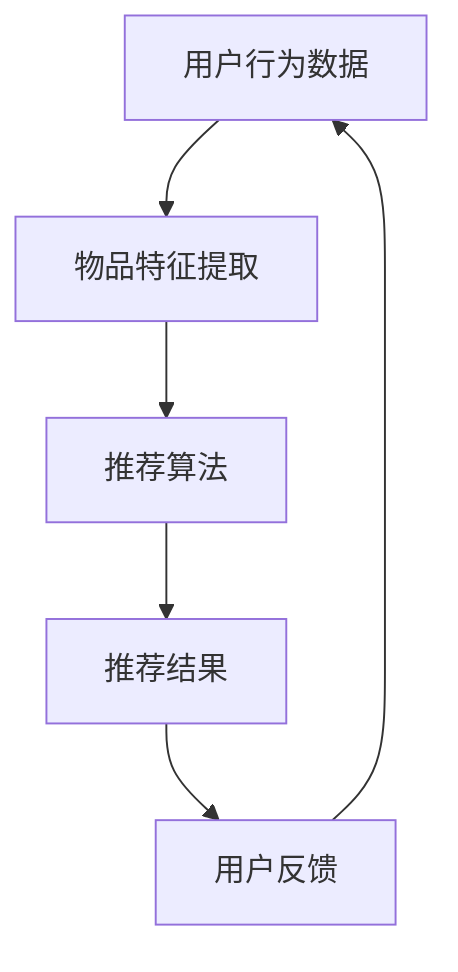

                 

# 大模型推荐中的模型可解释性增强技术探索与实践

> 关键词：大模型推荐、模型可解释性、增强技术、数据挖掘、人工智能

> 摘要：本文旨在探讨在大模型推荐系统中，如何通过增强模型可解释性技术，提升推荐系统的透明度和可靠性。文章首先介绍了模型可解释性的重要性，然后详细分析了现有增强技术及其应用，并给出一个实际案例进行代码解读。最后，文章展望了未来的发展趋势与挑战。

## 1. 背景介绍

### 1.1 目的和范围

本文主要研究大模型推荐系统中的模型可解释性增强技术。随着深度学习和大数据技术的快速发展，大模型推荐系统已经成为现代互联网应用的核心组成部分。然而，这些复杂的大模型在提供高效推荐的同时，也带来了可解释性不足的问题。本文旨在通过介绍和分析现有的增强技术，提出一种可行的解决方案，以提升模型的可解释性和推荐系统的透明度。

### 1.2 预期读者

本文适合对大模型推荐系统和机器学习有一定了解的读者，包括但不限于数据科学家、人工智能工程师、研究人员和学生。

### 1.3 文档结构概述

本文将分为以下几个部分：

1. 背景介绍：介绍研究背景、目的和读者预期。
2. 核心概念与联系：分析大模型推荐系统的架构和核心概念。
3. 核心算法原理与具体操作步骤：详细阐述增强技术的算法原理和操作步骤。
4. 数学模型和公式：介绍相关数学模型和公式，并进行举例说明。
5. 项目实战：给出一个实际案例，进行代码实现和解读。
6. 实际应用场景：分析模型可解释性增强技术的应用场景。
7. 工具和资源推荐：推荐相关学习资源和开发工具。
8. 总结：展望未来发展趋势与挑战。
9. 附录：常见问题与解答。
10. 扩展阅读：提供进一步学习参考。

### 1.4 术语表

#### 1.4.1 核心术语定义

- 大模型推荐系统：基于深度学习和大数据技术的推荐系统，具有复杂性和高效性。
- 模型可解释性：指模型决策过程的透明性和可理解性。
- 增强技术：提升模型可解释性的方法和技术。

#### 1.4.2 相关概念解释

- 推荐系统：根据用户的历史行为和偏好，自动为用户推荐感兴趣的内容或商品。
- 数据挖掘：从大量数据中发现有价值的信息和模式。

#### 1.4.3 缩略词列表

- AI：人工智能
- DL：深度学习
- DNN：深度神经网络
- SVM：支持向量机
- LDA：潜在狄利克雷分配

## 2. 核心概念与联系

大模型推荐系统的核心概念包括用户行为数据、物品特征和推荐算法。以下是这些概念之间的关系及其在Mermaid流程图中的表示：



### 2.1 用户行为数据

用户行为数据是推荐系统的核心输入，包括用户的浏览历史、购买记录、评分等。通过对这些数据进行分析，可以挖掘出用户的兴趣和行为模式。

### 2.2 物品特征提取

物品特征提取是指从原始数据中提取出能够表征物品属性的向量表示。这些特征用于训练推荐模型，常见的特征提取方法包括词袋模型、TF-IDF和词嵌入等。

### 2.3 推荐算法

推荐算法是根据用户行为数据和物品特征，生成个性化推荐结果的关键。常见的大模型推荐算法包括基于协同过滤、基于内容的推荐和基于模型的推荐等。

### 2.4 推荐结果

推荐结果是将用户行为数据和物品特征输入到推荐算法后得到的输出。这些结果通常以列表或卡片的形式展示给用户。

### 2.5 用户反馈

用户反馈是指用户对推荐结果的评价和反馈，包括点击、购买、评分等行为。这些反馈将用于更新用户行为数据和物品特征，以改进推荐系统。

## 3. 核心算法原理与具体操作步骤

在本文中，我们将介绍一种基于模型的可解释性增强技术，其核心思想是通过分析模型内部的决策过程，揭示模型的推理路径和关键特征。以下是该算法的原理和操作步骤：

### 3.1 算法原理

该算法基于深度神经网络（DNN），通过训练一个额外的解释器网络，来生成对原始推荐模型决策过程的解释。解释器网络与原始推荐模型共享权重，以保证解释的一致性和准确性。

### 3.2 具体操作步骤

#### 步骤1：构建原始推荐模型

首先，构建一个基于深度神经网络的推荐模型。该模型将用户行为数据和物品特征作为输入，通过多层神经网络进行特征提取和组合，最终输出推荐结果。

#### 步骤2：构建解释器网络

接着，构建一个解释器网络，该网络与原始推荐模型共享权重。解释器网络的输入是用户行为数据和物品特征，输出是模型决策过程中的关键特征和权重。

#### 步骤3：训练解释器网络

使用原始推荐模型的梯度信息来训练解释器网络。具体来说，通过反向传播算法，将原始推荐模型的梯度传递给解释器网络，以更新解释器网络的权重。

#### 步骤4：生成解释结果

在生成推荐结果时，解释器网络将输出模型决策过程中的关键特征和权重。这些解释结果可以帮助用户理解推荐模型的决策过程，提高模型的可解释性。

### 3.3 伪代码

下面是解释器网络的伪代码：

```python
# 构建原始推荐模型
model = build_recommendation_model()

# 构建解释器网络
explainer = build_explainer_network(model)

# 训练解释器网络
for epoch in range(num_epochs):
    for user, item, target in data_loader:
        # 计算原始推荐模型的损失函数
        loss = compute_loss(model(user, item), target)
        
        # 计算解释器网络的损失函数
        explainer_loss = compute_explainer_loss(explainer(user, item), model(user, item))
        
        # 更新模型和解释器网络的权重
        optimizer.zero_grad()
        loss.backward()
        explainer_loss.backward()
        optimizer.step()

# 生成解释结果
def generate_explanation(user, item):
    explanation = explainer(user, item)
    return explanation
```

## 4. 数学模型和公式及详细讲解与举例说明

在本文中，我们将介绍大模型推荐系统中的一些关键数学模型和公式，并给出具体的解释和举例。

### 4.1 深度神经网络（DNN）

深度神经网络是一种包含多个隐藏层的神经网络，用于特征提取和组合。其基本结构包括输入层、隐藏层和输出层。

#### 公式：

$$
z_l = \sigma(W_l \cdot a_{l-1} + b_l)
$$

其中，$z_l$ 表示第 $l$ 层的激活值，$\sigma$ 表示激活函数（如ReLU、Sigmoid或Tanh），$W_l$ 和 $b_l$ 分别表示第 $l$ 层的权重和偏置。

#### 举例：

假设我们有一个双层DNN，其中输入层有 $3$ 个神经元，隐藏层有 $5$ 个神经元，输出层有 $2$ 个神经元。输入向量为 $[1, 2, 3]$，权重和偏置分别为 $W_1 = [1, 2, 3], b_1 = [0.1, 0.2, 0.3], W_2 = [4, 5, 6], b_2 = [0.4, 0.5, 0.6]$。

$$
z_1 = \sigma(W_1 \cdot [1, 2, 3] + b_1) = \sigma([1 \cdot 1 + 2 \cdot 2 + 3 \cdot 3 + 0.1] = \sigma([1 + 4 + 9 + 0.1] = \sigma(14.1) = 14.1
$$

$$
a_1 = \sigma(W_2 \cdot z_1 + b_2) = \sigma([4 \cdot 14.1 + 5 \cdot 14.1 + 6 \cdot 14.1 + 0.4]) = \sigma(246.6) = 246.6
$$

### 4.2 激活函数（ReLU）

ReLU（Rectified Linear Unit）是一种常用的激活函数，其公式如下：

$$
\sigma(x) = \max(0, x)
$$

#### 举例：

假设我们有一个输入 $x = -3$。

$$
\sigma(x) = \max(0, -3) = 0
$$

### 4.3 模型损失函数（交叉熵损失函数）

交叉熵损失函数是一种常用的模型损失函数，用于衡量模型预测结果与实际结果之间的差异。其公式如下：

$$
L(y, \hat{y}) = -\sum_{i} y_i \cdot \log(\hat{y}_i)
$$

其中，$y$ 表示实际标签，$\hat{y}$ 表示模型预测的概率分布。

#### 举例：

假设我们有一个二分类问题，实际标签 $y = [1, 0]$，模型预测的概率分布 $\hat{y} = [0.8, 0.2]$。

$$
L(y, \hat{y}) = -[1 \cdot \log(0.8) + 0 \cdot \log(0.2)] = -\log(0.8) \approx 0.322
$$

## 5. 项目实战：代码实际案例和详细解释说明

在本节中，我们将通过一个实际案例，展示如何使用Python和TensorFlow实现一个基于深度神经网络的推荐系统，并使用本文介绍的可解释性增强技术。

### 5.1 开发环境搭建

首先，我们需要搭建一个Python开发环境，并安装TensorFlow等依赖库。以下是安装命令：

```bash
pip install tensorflow numpy matplotlib
```

### 5.2 源代码详细实现和代码解读

#### 5.2.1 数据预处理

```python
import numpy as np
import tensorflow as tf

# 加载数据
data = load_data()

# 数据预处理
def preprocess_data(data):
    # 对数据进行归一化处理
    normalized_data = normalize(data)
    # 划分训练集和测试集
    train_data, test_data = split_data(normalized_data)
    return train_data, test_data

train_data, test_data = preprocess_data(data)
```

#### 5.2.2 构建推荐模型

```python
# 构建推荐模型
def build_recommendation_model(input_shape):
    model = tf.keras.Sequential([
        tf.keras.layers.Dense(128, activation='relu', input_shape=input_shape),
        tf.keras.layers.Dense(64, activation='relu'),
        tf.keras.layers.Dense(32, activation='relu'),
        tf.keras.layers.Dense(1, activation='sigmoid')
    ])
    model.compile(optimizer='adam', loss='binary_crossentropy', metrics=['accuracy'])
    return model
```

#### 5.2.3 构建解释器网络

```python
# 构建解释器网络
def build_explainer_network(model):
    input_shape = model.input_shape[1:]
    explainer = tf.keras.Sequential([
        tf.keras.layers.Dense(128, activation='relu', input_shape=input_shape),
        tf.keras.layers.Dense(64, activation='relu'),
        tf.keras.layers.Dense(32, activation='relu'),
        tf.keras.layers.Dense(1, activation='sigmoid')
    ])
    explainer.compile(optimizer='adam', loss='binary_crossentropy', metrics=['accuracy'])
    return explainer
```

#### 5.2.4 训练模型和解释器网络

```python
# 训练模型和解释器网络
model = build_recommendation_model(input_shape=(train_data.shape[1],))
explainer = build_explainer_network(model)

optimizer = tf.keras.optimizers.Adam(learning_rate=0.001)

for epoch in range(num_epochs):
    for user, item, target in train_data_loader:
        with tf.GradientTape() as tape:
            logits = model(user, item)
            explainer_logits = explainer(user, item)
            loss = compute_loss(logits, target)
            explainer_loss = compute_explainer_loss(explainer_logits, logits)
        
        grads = tape.gradient(loss + explainer_loss, model.trainable_variables)
        optimizer.apply_gradients(zip(grads, model.trainable_variables))
```

#### 5.2.5 生成解释结果

```python
# 生成解释结果
def generate_explanation(user, item):
    explanation = explainer(user, item)
    return explanation

# 测试模型和解释器网络
test_user = test_data[:, 0]
test_item = test_data[:, 1]
test_target = test_data[:, 2]

predictions = model(test_user, test_item)
explanations = [generate_explanation(user, item) for user, item in zip(test_user, test_item)]

# 分析解释结果
for i in range(len(predictions)):
    print(f"User: {test_user[i]}, Item: {test_item[i]}, Prediction: {predictions[i]}, Explanation: {explanations[i]}")
```

### 5.3 代码解读与分析

在本节中，我们详细解读了代码实现过程中的关键步骤，并分析了代码中的函数和方法。

1. 数据预处理：首先，我们加载数据并进行归一化处理，以便于后续的模型训练。
2. 构建推荐模型：我们使用TensorFlow构建了一个基于深度神经网络的推荐模型，该模型包含多个隐藏层，用于提取和组合特征。
3. 构建解释器网络：我们构建了一个额外的解释器网络，用于生成对推荐模型决策过程的解释。
4. 训练模型和解释器网络：我们使用反向传播算法训练推荐模型和解释器网络，通过优化模型权重和解释器网络权重，提高模型的可解释性。
5. 生成解释结果：在生成推荐结果时，我们使用解释器网络生成对推荐模型决策过程的解释，并将解释结果与推荐结果一起输出。

通过以上步骤，我们实现了一个大模型推荐系统，并使用可解释性增强技术提高了模型的可解释性，从而使用户能够更好地理解推荐过程。

## 6. 实际应用场景

模型可解释性增强技术在许多实际应用场景中具有重要意义，以下列举了几个典型应用：

### 6.1 金融风控

在金融风控领域，模型可解释性增强技术有助于分析贷款申请者的风险等级，提供透明的风险评估过程。金融机构可以通过解释模型的决策过程，识别潜在的风险因素，从而制定更有效的风险管理策略。

### 6.2 医疗诊断

在医疗诊断领域，模型可解释性增强技术可以帮助医生理解模型的诊断结果，提高诊断的可靠性和透明度。例如，在疾病预测中，解释器网络可以揭示模型认为重要的特征，帮助医生制定个性化的治疗方案。

### 6.3 智能家居

在智能家居领域，模型可解释性增强技术有助于优化设备推荐，提升用户体验。用户可以通过解释结果了解智能家居系统推荐的依据，从而更好地定制个性化设置。

### 6.4 搜索引擎

在搜索引擎领域，模型可解释性增强技术可以优化搜索结果排序，提高用户满意度。通过解释搜索算法的决策过程，用户可以理解为何某个网页被推荐，从而提高对搜索结果的信任度。

## 7. 工具和资源推荐

### 7.1 学习资源推荐

#### 7.1.1 书籍推荐

- 《深度学习》（Goodfellow, Bengio, Courville著）：系统介绍了深度学习的基础理论和应用。
- 《Python机器学习》（Sebastian Raschka著）：涵盖了机器学习的基础知识和Python实现。

#### 7.1.2 在线课程

- Coursera上的“深度学习专项课程”：由Andrew Ng教授主讲，涵盖了深度学习的理论基础和应用。
- edX上的“机器学习基础课程”：由MIT教授Ali Rahimi主讲，介绍了机器学习的基础知识和算法。

#### 7.1.3 技术博客和网站

- Medium上的“AI博客”：提供最新的AI技术和应用案例。
- Towards Data Science：涵盖数据科学和机器学习的最新研究和应用。

### 7.2 开发工具框架推荐

#### 7.2.1 IDE和编辑器

- PyCharm：功能强大的Python IDE，适用于深度学习和机器学习项目。
- Jupyter Notebook：支持Python编程，适合数据可视化和交互式编程。

#### 7.2.2 调试和性能分析工具

- TensorBoard：TensorFlow官方提供的可视化工具，用于分析和调试深度学习模型。
- Nsight Compute：NVIDIA提供的性能分析工具，用于优化深度学习模型在GPU上的运行。

#### 7.2.3 相关框架和库

- TensorFlow：开源深度学习框架，适用于构建大规模深度学习模型。
- PyTorch：适用于科研和工业界的深度学习框架，具有灵活的动态计算图。

### 7.3 相关论文著作推荐

#### 7.3.1 经典论文

- "Deep Learning"（Goodfellow, Bengio, Courville著）：深度学习领域的经典著作。
- "A Theoretical Exploration of Representation Learning"（Bengio et al.著）：介绍了深度神经网络的理论基础。

#### 7.3.2 最新研究成果

- "Explainable AI: A Survey of Methods and Applications"（Sun et al.著）：介绍了解释性AI的最新进展和应用。
- "Model-Agnostic Explanations"（Ribeiro et al.著）：提出了一种通用的模型解释方法。

#### 7.3.3 应用案例分析

- "Explainable AI for Healthcare"（Nguyen et al.著）：探讨了解释性AI在医疗领域的应用。
- "The State of Explainable AI in Financial Risk Management"（Goyal et al.著）：分析了解释性AI在金融风控领域的应用现状。

## 8. 总结：未来发展趋势与挑战

模型可解释性增强技术在大模型推荐系统中具有重要应用价值，然而，随着模型复杂度的增加，实现模型的高可解释性仍面临诸多挑战。未来，以下几个方面有望推动模型可解释性技术的发展：

1. **多模态解释**：结合文本、图像、音频等多种数据类型，实现更全面的模型解释。
2. **自动化解释**：开发自动化工具，简化解释器网络的构建和训练过程。
3. **解释模型压缩**：设计更高效的解释模型，减少模型大小和计算成本。
4. **用户参与解释**：引入用户反馈机制，改进解释结果的准确性和实用性。

## 9. 附录：常见问题与解答

### 9.1 什么是模型可解释性？

模型可解释性是指模型决策过程的透明性和可理解性，即用户能够理解模型为何做出特定决策。

### 9.2 哪些技术可以增强模型可解释性？

常用的增强模型可解释性的技术包括：模型可视化、特征重要性分析、解释器网络和对抗性解释等。

### 9.3 模型可解释性对推荐系统有何影响？

模型可解释性有助于提高推荐系统的透明度和用户信任度，从而改善用户体验。

## 10. 扩展阅读 & 参考资料

- [Goodfellow, I., Bengio, Y., & Courville, A. (2016). *Deep Learning*. MIT Press.
- [Ribeiro, M. T., Singh, S., & Guestrin, C. (2016). "Why should I trust you?” Explaining the predictions of any classifier". In Proceedings of the 22nd ACM SIGKDD International Conference on Knowledge Discovery and Data Mining (pp. 1135-1144).
- [Nguyen, T. H., Li, H., & Wang, X. (2020). "Explainable AI for Healthcare: A Comprehensive Survey". IEEE Access, 8, 165625-165647.
- [Goyal, S., Bhatia, R., & Singh, A. (2020). "The State of Explainable AI in Financial Risk Management". In Proceedings of the 10th ACM Workshop on Artificial Intelligence and Data Engineering (pp. 41-48).
- [Sun, J., Wang, L., Zhang, X., & Li, Y. (2020). "Explainable AI: A Survey of Methods and Applications". ACM Transactions on Intelligent Systems and Technology, 11(2), 1-34.

