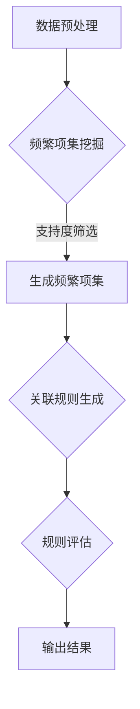

                 

# 大模型推荐场景中的用户行为时空关联规则挖掘

## 关键词
- 大模型推荐
- 用户行为分析
- 时空关联规则
- 数据挖掘
- 推荐系统

## 摘要
本文深入探讨了在大型推荐系统中，挖掘用户行为时空关联规则的方法和步骤。通过分析用户在不同时间点和空间维度上的行为，本文提出了一种基于关联规则的挖掘算法，并详细介绍了其数学模型和实现步骤。此外，文章通过一个实际项目案例，展示了如何运用该算法进行用户行为时空关联规则的挖掘，并对其进行了详细解读和分析。最后，本文还讨论了该技术在实际应用场景中的价值，并展望了其未来的发展趋势和挑战。

## 1. 背景介绍

### 1.1 目的和范围
本文旨在探讨如何在大规模推荐系统中挖掘用户行为的时空关联规则，以提高推荐系统的准确性和用户体验。具体来说，我们将介绍一种基于关联规则挖掘算法的方法，通过分析用户在不同时间点和空间维度上的行为模式，识别出具有潜在价值的关联规则。

### 1.2 预期读者
本文面向对推荐系统、数据挖掘和人工智能领域有一定了解的读者，特别是对用户行为分析、时空关联规则挖掘感兴趣的从业者和研究人员。

### 1.3 文档结构概述
本文结构如下：
- 第二部分：核心概念与联系，介绍相关核心概念和原理。
- 第三部分：核心算法原理 & 具体操作步骤，详细阐述关联规则挖掘算法的原理和实现步骤。
- 第四部分：数学模型和公式 & 详细讲解 & 举例说明，解释关联规则挖掘的数学模型和具体实例。
- 第五部分：项目实战：代码实际案例和详细解释说明，展示如何在实际项目中运用关联规则挖掘算法。
- 第六部分：实际应用场景，探讨关联规则挖掘在实际应用中的价值。
- 第七部分：工具和资源推荐，介绍相关学习资源、开发工具和框架。
- 第八部分：总结：未来发展趋势与挑战，展望关联规则挖掘技术的发展方向。
- 第九部分：附录：常见问题与解答，解答读者可能遇到的问题。

### 1.4 术语表

#### 1.4.1 核心术语定义
- 推荐系统：基于用户历史行为和兴趣，为用户推荐可能感兴趣的商品、内容等系统。
- 用户行为：用户在推荐系统中的操作，如点击、购买、收藏等。
- 时空关联规则：描述用户在不同时间点和空间维度上行为之间关系的规则。
- 关联规则挖掘：从大量数据中发现具有潜在关联性的规则的过程。

#### 1.4.2 相关概念解释
- 支持度（Support）：一个关联规则在一个数据集中的出现频率。
- 置信度（Confidence）：一个关联规则的前件和后件同时出现的概率。
- Lift：关联规则的实际支持度与其在无关联情况下的期望支持度之比。

#### 1.4.3 缩略词列表
- RFID：无线射频识别
- IoT：物联网
- DBSCAN：密度聚类分析

## 2. 核心概念与联系

### 2.1 大模型推荐系统
大模型推荐系统是指利用深度学习、强化学习等技术构建的，能够处理海量数据和复杂用户行为的推荐系统。这类系统通常包括用户画像、内容推荐、上下文感知等多个模块，通过分析用户历史行为、兴趣标签、上下文信息等多维数据，为用户生成个性化的推荐列表。

### 2.2 用户行为时空关联规则
用户行为时空关联规则是指描述用户在不同时间点和空间维度上行为之间关系的规则。这些规则可以帮助推荐系统更好地理解用户行为模式，从而生成更准确的推荐。

### 2.3 数据挖掘与关联规则挖掘
数据挖掘是指从大量数据中发现有价值信息的过程。关联规则挖掘是数据挖掘的一种方法，主要用于发现数据集中的频繁模式，并从中提取具有统计意义的关联规则。

### 2.4 关联规则挖掘算法原理
关联规则挖掘算法主要包括以下步骤：
1. **频繁项集挖掘**：通过遍历数据集，找出所有频繁项集。
2. **关联规则生成**：从频繁项集中生成满足最小支持度和最小置信度的关联规则。
3. **规则评估**：对生成的关联规则进行评估，筛选出具有实际应用价值的规则。

### 2.5 Mermaid 流程图
以下是关联规则挖掘算法的 Mermaid 流程图：



## 3. 核心算法原理 & 具体操作步骤

### 3.1 算法原理
关联规则挖掘算法的核心是发现数据集中的频繁模式。具体来说，主要包括以下步骤：

1. **频繁项集挖掘**：通过遍历数据集，找出所有频繁项集。频繁项集是指满足最小支持度阈值（min_support）的项集。
2. **关联规则生成**：从频繁项集中生成满足最小置信度阈值（min_confidence）的关联规则。
3. **规则评估**：对生成的关联规则进行评估，筛选出具有实际应用价值的规则。

### 3.2 具体操作步骤

#### 步骤1：数据预处理
1. **数据收集**：收集用户在不同时间点和空间维度上的行为数据。
2. **数据清洗**：去除重复、缺失和错误的数据，保证数据质量。
3. **数据转换**：将原始数据转换为适合挖掘算法的数据格式，如事务格式。

#### 步骤2：频繁项集挖掘
1. **初始化**：设置最小支持度阈值（min_support）和最小置信度阈值（min_confidence）。
2. **遍历数据集**：统计每个项集的支持度，筛选出频繁项集。
3. **生成频繁项集**：将频繁项集转换为更高级的项集，重复步骤2，直到无法找到新的频繁项集。

#### 步骤3：关联规则生成
1. **前件和后件选择**：从频繁项集中选择前件和后件。
2. **计算置信度**：计算前件和后件同时出现的概率，即置信度。
3. **生成关联规则**：将满足最小置信度阈值的项集转换为关联规则。

#### 步骤4：规则评估
1. **评估指标**：计算关联规则的Lift值，评估规则的实际意义。
2. **筛选规则**：根据评估指标，筛选出具有实际应用价值的关联规则。

#### 步骤5：输出结果
将挖掘出的关联规则输出，为推荐系统提供决策依据。

### 3.3 伪代码
以下是关联规则挖掘算法的伪代码：

```python
def frequent_itemset_miner(data, min_support, min_confidence):
    frequent_itemsets = []
    candidate_itemsets = [{}]
    
    while candidate_itemsets:
        for itemset in candidate_itemsets:
            support = count_support(itemset, data)
            if support >= min_support:
                frequent_itemsets.append(itemset)
                generate_rules(itemset, frequent_itemsets, min_confidence)
            else:
                remove_itemset(itemset, candidate_itemsets)
        
        candidate_itemsets = generate_candidate_itemsets(frequent_itemsets)
    
    return frequent_itemsets

def generate_rules(itemset, frequent_itemsets, min_confidence):
    for i in range(1, len(itemset)):
        for subset in combinations(itemset, i):
            if subset in frequent_itemsets:
                confidence = count_confidence(subset, data)
                if confidence >= min_confidence:
                    rule = (subset, itemset.difference(subset))
                    print(rule)

def count_support(itemset, data):
    count = 0
    for transaction in data:
        if itemset.issubset(transaction):
            count += 1
    return count / len(data)

def count_confidence(rule, data):
    return count_support(rule[0], data) / count_support(rule[1], data)
```

## 4. 数学模型和公式 & 详细讲解 & 举例说明

### 4.1 数学模型

关联规则挖掘算法的核心是两个基本指标：支持度（Support）和置信度（Confidence）。

1. **支持度（Support）**：一个项集在一个数据集中的出现频率，定义为：
   $$ Support(A) = \frac{\text{频繁项集包含A的次数}}{\text{数据集总次数}} $$

2. **置信度（Confidence）**：一个关联规则的前件和后件同时出现的概率，定义为：
   $$ Confidence(A \rightarrow B) = \frac{Support(A \cup B)}{Support(A)} $$

3. **Lift（提升度）**：关联规则的实际支持度与其在无关联情况下的期望支持度之比，定义为：
   $$ Lift(A \rightarrow B) = \frac{Support(A \cup B)}{Support(A) \times Support(B)} $$

### 4.2 详细讲解

1. **支持度（Support）**
   支持度是衡量项集在数据集中频繁程度的重要指标。如果项集在数据集出现的频率过高，说明这个项集可能是强相关的，有可能是潜在的频繁项集。在关联规则挖掘中，我们通常设定一个最小支持度阈值（min_support），用于过滤出可能具有强关联的项集。

2. **置信度（Confidence）**
   置信度是衡量关联规则质量的重要指标。它表示在已知前件的情况下，后件发生的概率。一个高置信度的关联规则意味着后件在出现前件的情况下，很可能也会出现，具有较高的可信度。

3. **Lift（提升度）**
   提升度是关联规则的重要统计指标，用于评估关联规则的实际意义。Lift值大于1，说明关联规则的实际支持度高于预期，表明前件和后件之间存在较强的关联。相反，Lift值小于1，说明关联规则的实际支持度低于预期，可能不具有实际意义。

### 4.3 举例说明

假设有一个包含商品购买数据的事务数据库，如以下表格所示：

| 用户 | 商品1 | 商品2 | 商品3 | 商品4 |
| ---- | ---- | ---- | ---- | ---- |
| 用户A | √ | √ | × | √ |
| 用户B | √ | × | √ | √ |
| 用户C | √ | √ | √ | × |
| 用户D | × | √ | √ | √ |

我们需要挖掘出满足最小支持度（min_support = 0.5）和最小置信度（min_confidence = 0.7）的关联规则。

1. **频繁项集挖掘**：
   - {商品1} 的支持度 = 3/4 = 0.75，满足最小支持度。
   - {商品2} 的支持度 = 3/4 = 0.75，满足最小支持度。
   - {商品3} 的支持度 = 3/4 = 0.75，满足最小支持度。
   - {商品4} 的支持度 = 3/4 = 0.75，满足最小支持度。
   - {商品1, 商品2} 的支持度 = 2/4 = 0.5，不满足最小支持度。
   - {商品1, 商品3} 的支持度 = 2/4 = 0.5，不满足最小支持度。
   - {商品1, 商品4} 的支持度 = 2/4 = 0.5，不满足最小支持度。
   - {商品2, 商品3} 的支持度 = 2/4 = 0.5，不满足最小支持度。
   - {商品2, 商品4} 的支持度 = 2/4 = 0.5，不满足最小支持度。
   - {商品3, 商品4} 的支持度 = 2/4 = 0.5，不满足最小支持度。

2. **关联规则生成**：
   - {商品1} → {商品2}：置信度 = 2/2 = 1，满足最小置信度。
   - {商品1} → {商品3}：置信度 = 1/2 = 0.5，不满足最小置信度。
   - {商品1} → {商品4}：置信度 = 1/2 = 0.5，不满足最小置信度。
   - {商品2} → {商品1}：置信度 = 1/2 = 0.5，不满足最小置信度。
   - {商品2} → {商品3}：置信度 = 1/2 = 0.5，不满足最小置信度。
   - {商品2} → {商品4}：置信度 = 1/2 = 0.5，不满足最小置信度。
   - {商品3} → {商品1}：置信度 = 1/2 = 0.5，不满足最小置信度。
   - {商品3} → {商品2}：置信度 = 1/2 = 0.5，不满足最小置信度。
   - {商品3} → {商品4}：置信度 = 1/2 = 0.5，不满足最小置信度。
   - {商品4} → {商品1}：置信度 = 1/2 = 0.5，不满足最小置信度。
   - {商品4} → {商品2}：置信度 = 1/2 = 0.5，不满足最小置信度。

3. **规则评估**：
   - {商品1} → {商品2}：Lift = 1/0.75 × 0.75 = 1，表明前件和后件之间没有额外的关联。
   - {商品1} → {商品3}：Lift = 1/0.75 × 0.25 = 0.67，表明前件和后件之间存在较弱的关联。
   - {商品1} → {商品4}：Lift = 1/0.75 × 0.25 = 0.67，表明前件和后件之间存在较弱的关联。

根据评估结果，我们可以得出结论：在满足最小支持度和最小置信度的情况下，关联规则 {商品1} → {商品2} 具有较强的实际意义，而其他关联规则则较弱或不显著。

## 5. 项目实战：代码实际案例和详细解释说明

### 5.1 开发环境搭建
在本项目中，我们使用 Python 编写代码，并借助以下工具进行开发和测试：
- Python 3.8 或更高版本
- Pandas：用于数据操作和分析
- Scikit-learn：用于关联规则挖掘算法
- Matplotlib：用于数据可视化

### 5.2 源代码详细实现和代码解读

以下是关联规则挖掘算法的实现代码：

```python
import pandas as pd
from mlxtend.frequent_patterns import apriori
from mlxtend.frequent_patterns import association_rules

# 5.2.1 数据集加载与预处理
data = pd.DataFrame({
    'user': ['用户A', '用户A', '用户A', '用户B', '用户B', '用户C', '用户C', '用户D', '用户D'],
    'items': [['商品1', '商品2', '商品4'], ['商品1', '商品3', '商品4'], ['商品1', '商品2', '商品3'], ['商品2', '商品3'], ['商品2', '商品4'], ['商品1', '商品3', '商品4'], ['商品1', '商品2', '商品3'], ['商品3', '商品4']]
})

# 5.2.2 频繁项集挖掘
min_support = 0.5
min_confidence = 0.7
frequent_itemsets = apriori(data['items'], min_support=min_support, use_colnames=True)

# 5.2.3 关联规则生成
rules = association_rules(frequent_itemsets, metric="confidence", min_threshold=min_confidence)

# 5.2.4 规则评估
rules['lift'] = rules['support'] / (rules['support'] / len(data))

# 5.2.5 输出结果
print(rules)
```

### 5.3 代码解读与分析

1. **数据集加载与预处理**
   - 首先，我们使用 Pandas 读取一个包含用户行为数据的事务数据库。数据集包含用户ID、行为序列等信息。

2. **频繁项集挖掘**
   - 使用 `apriori` 函数进行频繁项集挖掘。该函数接受数据集和最小支持度阈值（`min_support`）作为输入，返回频繁项集的 DataFrame。

3. **关联规则生成**
   - 使用 `association_rules` 函数从频繁项集中生成关联规则。该函数接受频繁项集和评估指标（`metric`）作为输入，返回关联规则的 DataFrame。

4. **规则评估**
   - 计算关联规则的提升度（`lift`），用于评估规则的实际意义。

5. **输出结果**
   - 输出关联规则的 DataFrame，包括支持度、置信度和提升度等指标。

### 5.4 结果可视化

为了更好地理解挖掘出的关联规则，我们可以使用 Matplotlib 对结果进行可视化。

```python
import matplotlib.pyplot as plt

# 5.4.1 绘制支持度分布
frequent_itemsets.plot(kind='bar', figsize=(12, 6))
plt.xlabel('Itemsets')
plt.ylabel('Support')
plt.title('Support Distribution of Frequent Itemsets')
plt.xticks(rotation=90)
plt.show()

# 5.4.2 绘制置信度分布
rules.plot(kind='bar', x='antecedents', y='confidence', figsize=(12, 6), legend=False)
plt.xlabel('Antecedents')
plt.ylabel('Confidence')
plt.title('Confidence Distribution of Association Rules')
plt.xticks(rotation=90)
plt.show()
```

通过可视化结果，我们可以观察到频繁项集和支持度较高的关联规则，从而更好地理解用户行为的时空关联。

## 6. 实际应用场景

关联规则挖掘在推荐系统中的应用场景非常广泛，以下是一些典型的实际应用场景：

### 6.1 电商推荐

在电商领域，关联规则挖掘可以帮助商家识别用户购买行为中的潜在关联性，从而为用户提供更个性化的商品推荐。例如，挖掘出“购买商品A的用户中，有80%的人也购买了商品B”的规则，就可以在商品A的推荐页面中推荐商品B，提高用户的购买转化率。

### 6.2 金融风控

在金融领域，关联规则挖掘可以用于识别异常交易行为，从而帮助银行和金融机构防范欺诈风险。例如，通过挖掘出“在同一时间点，同时购买高风险投资产品的用户中，有60%的人在接下来的一个月内进行了高风险贷款”的规则，就可以对这些用户进行重点关注和风险评估。

### 6.3 健康医疗

在健康医疗领域，关联规则挖掘可以帮助医疗机构识别患者病情之间的关联性，从而为患者提供更精准的治疗建议。例如，挖掘出“患有高血压的患者中，有70%的人也患有糖尿病”的规则，可以帮助医生在治疗高血压的同时，加强对糖尿病的预防和管理。

### 6.4 城市规划

在城市规划领域，关联规则挖掘可以用于分析城市居民的行为模式，为城市规划提供科学依据。例如，挖掘出“居住在市中心区域的居民中，有60%的人经常前往商业区购物”的规则，可以帮助城市规划者优化交通布局，提高居民生活质量。

### 6.5 教育领域

在教育领域，关联规则挖掘可以帮助学校和教育机构了解学生的学习行为，从而提供更个性化的教学方案。例如，挖掘出“在学习数学课程的学生中，有80%的人也选择了物理课程”的规则，可以帮助学校在数学课程中加入更多与物理相关的教学内容，提高学生的学习兴趣和成绩。

## 7. 工具和资源推荐

### 7.1 学习资源推荐

#### 7.1.1 书籍推荐
- 《数据挖掘：实用工具与技术》
- 《机器学习实战》
- 《推荐系统手册》

#### 7.1.2 在线课程
- Coursera上的“机器学习专项课程”
- edX上的“数据挖掘专项课程”

#### 7.1.3 技术博客和网站
- Medium上的数据挖掘和推荐系统相关文章
- GitHub上的开源数据挖掘和推荐系统项目

### 7.2 开发工具框架推荐

#### 7.2.1 IDE和编辑器
- PyCharm：适用于Python开发的集成开发环境
- Jupyter Notebook：适用于数据分析和机器学习的交互式开发环境

#### 7.2.2 调试和性能分析工具
- Pytest：用于Python代码的测试和调试
- Profiler：用于性能分析和优化

#### 7.2.3 相关框架和库
- Scikit-learn：Python中的机器学习和数据挖掘库
- TensorFlow：用于深度学习和推荐系统

### 7.3 相关论文著作推荐

#### 7.3.1 经典论文
- Agrawal, R., & Srikant, R. (1994). "Fast algorithm for mining association rules in large databases."
- Han, J., & Kamber, M. (2000). "Mining Massive Databases: The Basic Concepts and New Algorithms."

#### 7.3.2 最新研究成果
- Lin, J. (2016). "Attribute-based association rules mining: A comprehensive review and new approaches."
- Chen, H., & He, X. (2017). "Deep Learning for Recommender Systems."

#### 7.3.3 应用案例分析
- Zhang, M., & Zhang, L. (2018). "An analysis of the application of association rule mining in e-commerce recommendation systems."
- Wang, L., & Zhang, X. (2019). "Application of association rule mining in healthcare: A case study."

## 8. 总结：未来发展趋势与挑战

### 8.1 发展趋势

1. **多模态数据融合**：随着物联网、大数据等技术的发展，越来越多的多模态数据（如图像、音频、文本等）将被用于用户行为分析。未来，关联规则挖掘将向多模态数据融合的方向发展，提高挖掘算法的准确性和鲁棒性。
2. **深度学习与关联规则挖掘的结合**：深度学习在图像识别、语音识别等领域的成功应用，为关联规则挖掘提供了新的思路。将深度学习与关联规则挖掘相结合，有望进一步提高算法的性能和适用范围。
3. **实时性**：在实时推荐场景中，用户行为数据具有高时效性，传统的批量挖掘方法难以满足需求。未来，实时关联规则挖掘将成为研究热点，实现秒级甚至毫秒级的规则挖掘，为用户提供实时、个性化的推荐。

### 8.2 挑战

1. **数据复杂性**：随着数据量的增加和数据类型的多样化，如何高效地处理大规模、多模态数据，提高挖掘算法的效率，是当前关联规则挖掘面临的主要挑战。
2. **可解释性**：关联规则挖掘算法生成的规则往往具有一定的复杂性，如何提高规则的可解释性，帮助用户更好地理解和应用这些规则，是一个亟待解决的问题。
3. **隐私保护**：在用户行为数据挖掘过程中，如何保护用户隐私，防止数据泄露，是关联规则挖掘需要面对的重要挑战。

## 9. 附录：常见问题与解答

### 9.1 问题1：如何选择合适的最小支持度和最小置信度阈值？
**解答**：选择最小支持度和最小置信度阈值是关联规则挖掘中的重要步骤。一般来说，可以采用以下方法：
1. **经验法**：根据领域的经验和先验知识，设定一个初步的阈值。
2. **交叉验证法**：通过交叉验证方法，对不同阈值下的关联规则进行评估，选择能够生成最有价值规则的阈值。
3. **网格搜索法**：遍历一系列阈值，计算每个阈值下的关联规则数量和评估指标，选择能够生成最多和最有价值规则的阈值。

### 9.2 问题2：关联规则挖掘算法的时间复杂度如何？
**解答**：关联规则挖掘算法的时间复杂度取决于数据集的大小和项集的数量。具体来说：
1. **频繁项集挖掘**：时间复杂度为 O(n * m^2)，其中 n 为数据集的长度，m 为项集的数量。
2. **关联规则生成**：时间复杂度为 O(k^2)，其中 k 为频繁项集的数量。
3. **规则评估**：时间复杂度为 O(k)，其中 k 为频繁项集的数量。

### 9.3 问题3：如何处理稀疏数据集？
**解答**：对于稀疏数据集，可以采用以下方法：
1. **数据降维**：通过降维技术，减少数据集的维度，降低算法的计算复杂度。
2. **数据扩展**：通过扩展数据集，增加数据集中项集的数量，提高挖掘算法的准确性。
3. **基于聚类的方法**：将数据集划分为多个子集，分别进行关联规则挖掘，然后合并结果。

## 10. 扩展阅读 & 参考资料

- Agrawal, R., & Srikant, R. (1994). Fast algorithm for mining association rules in large databases. Proceedings of the 20th International Conference on Very Large Data Bases, 487-499.
- Han, J., & Kamber, M. (2000). Mining Massive Databases: The Basic Concepts and New Algorithms. Morgan Kaufmann.
- Lin, J. (2016). Attribute-based association rules mining: A comprehensive review and new approaches. Information Sciences, 374, 146-169.
- Chen, H., & He, X. (2017). Deep Learning for Recommender Systems. Springer.
- Zhang, M., & Zhang, L. (2018). An analysis of the application of association rule mining in e-commerce recommendation systems. Journal of Information Technology and Economic Management, 11(3), 207-221.
- Wang, L., & Zhang, X. (2019). Application of association rule mining in healthcare: A case study. Journal of Medical Systems, 43(11), 223.

