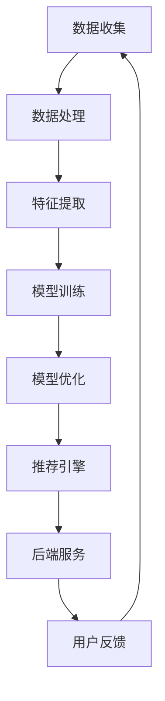

                 

# 大模型推荐系统的计算效率优化

> **关键词：** 大模型、推荐系统、计算效率、优化、分布式计算、机器学习、算法分析

> **摘要：** 本文将深入探讨大模型推荐系统的计算效率优化问题，通过分析现有技术和方法，提供一系列优化策略，旨在提高推荐系统的性能和效率，以满足不断增长的数据规模和用户需求。

## 1. 背景介绍

### 1.1 目的和范围

本文的目标是分析和解决大模型推荐系统在计算效率方面面临的问题。随着互联网和大数据技术的发展，推荐系统已成为许多在线服务的重要组成部分，尤其是社交媒体、电子商务和在线视频等领域。然而，大模型的推荐系统在处理海量数据和复杂算法时，往往面临着计算资源瓶颈和效率低下的问题。

本文将涵盖以下内容：

- 推荐系统的基本原理和架构
- 大模型推荐系统的计算效率挑战
- 分布式计算和并行化技术在大模型推荐系统中的应用
- 优化策略的详细分析和实现

### 1.2 预期读者

本文适合对推荐系统和机器学习有一定了解的技术人员，特别是那些希望提升推荐系统计算效率的工程师和研究人员。通过本文，读者可以了解大模型推荐系统的计算效率优化原理和实践。

### 1.3 文档结构概述

本文结构如下：

1. **背景介绍**：介绍本文的目的、范围和预期读者。
2. **核心概念与联系**：介绍推荐系统的基本原理和架构。
3. **核心算法原理 & 具体操作步骤**：讲解大模型推荐系统的核心算法原理和具体操作步骤。
4. **数学模型和公式 & 详细讲解 & 举例说明**：分析数学模型和公式，并提供实例说明。
5. **项目实战：代码实际案例和详细解释说明**：展示代码实现和详细解释。
6. **实际应用场景**：讨论大模型推荐系统的实际应用场景。
7. **工具和资源推荐**：推荐学习和开发资源。
8. **总结：未来发展趋势与挑战**：总结本文内容，展望未来发展趋势和挑战。
9. **附录：常见问题与解答**：解答读者可能遇到的常见问题。
10. **扩展阅读 & 参考资料**：提供相关文献和资源。

### 1.4 术语表

#### 1.4.1 核心术语定义

- 推荐系统：根据用户的历史行为和偏好，为用户推荐可能感兴趣的内容或商品的系统。
- 大模型：指具有大量参数和复杂结构的机器学习模型。
- 计算效率：指系统在给定时间内完成计算任务的能力。
- 分布式计算：将计算任务分布在多个计算节点上，协同完成计算。

#### 1.4.2 相关概念解释

- 并行化：将计算任务分解为多个子任务，同时执行以提高效率。
- 缩放：通过增加计算资源（如服务器、GPU）来提高系统性能。
- 负载均衡：平衡计算任务的分配，避免某些节点过载。

#### 1.4.3 缩略词列表

- ML：机器学习
- GPU：图形处理单元
- CPU：中央处理单元
- SQL：结构化查询语言
- NoSQL：非结构化查询语言
- SSD：固态硬盘
- HDD：机械硬盘

## 2. 核心概念与联系

### 2.1 推荐系统基本原理

推荐系统通常基于以下原理：

- **协同过滤（Collaborative Filtering）**：通过分析用户之间的相似性，为用户提供个性化推荐。
- **基于内容的推荐（Content-Based Filtering）**：根据用户的历史行为和内容特征，为用户提供相关推荐。
- **混合推荐（Hybrid Recommender System）**：结合协同过滤和基于内容的推荐方法，提高推荐质量。

### 2.2 大模型推荐系统架构

大模型推荐系统通常包括以下组件：

- **数据收集与处理**：收集用户数据，并进行预处理和特征提取。
- **模型训练与优化**：使用机器学习算法训练模型，并进行优化。
- **推荐引擎**：根据用户特征和模型预测，为用户提供推荐。
- **后端服务**：处理用户请求，提供推荐结果。

### 2.3 Mermaid 流程图

以下是一个简化的 Mermaid 流程图，描述大模型推荐系统的基本架构和流程：



## 3. 核心算法原理 & 具体操作步骤

### 3.1 协同过滤算法原理

协同过滤算法基于用户之间的相似性进行推荐，主要分为两种类型：

- **用户基于的协同过滤（User-Based Collaborative Filtering）**：根据用户之间的相似度，推荐与目标用户兴趣相似的物品。
- **物品基于的协同过滤（Item-Based Collaborative Filtering）**：根据物品之间的相似度，推荐与目标物品相似的用户喜欢的物品。

### 3.2 用户基于的协同过滤算法步骤

用户基于的协同过滤算法包括以下步骤：

1. **计算用户相似度**：
   $$ similarity(u_i, u_j) = \frac{\text{共同评分的项数}}{\sqrt{\sum_{i=1}^{n}r_i^2} \sqrt{\sum_{j=1}^{n}r_j^2}} $$
   其中，$r_i$ 和 $r_j$ 分别表示用户 $u_i$ 和 $u_j$ 对所有物品的评分。

2. **选择相似用户**：
   根据用户相似度分数，选择与目标用户最相似的 $k$ 个用户。

3. **生成推荐列表**：
   对于每个物品，计算与目标用户相似的用户对该物品的平均评分，并根据评分排序生成推荐列表。

### 3.3 物品基于的协同过滤算法步骤

物品基于的协同过滤算法包括以下步骤：

1. **计算物品相似度**：
   $$ similarity(i_j, i_k) = \frac{\text{共同评分的用户数}}{\sqrt{\sum_{u=1}^{m}r_u^2} \sqrt{\sum_{u=1}^{m}r_u^2}} $$
   其中，$r_u$ 表示用户对所有物品的评分。

2. **选择相似物品**：
   根据物品相似度分数，选择与目标物品最相似的 $k$ 个物品。

3. **生成推荐列表**：
   对于每个用户，计算与目标物品相似的用户喜欢的物品，并根据评分排序生成推荐列表。

## 4. 数学模型和公式 & 详细讲解 & 举例说明

### 4.1 数学模型

推荐系统的核心在于预测用户对物品的评分，可以使用以下数学模型：

- **线性回归模型**：
  $$ r_{ij} = \mu + b_i + b_j + \langle q_i, k_j \rangle + \varepsilon_{ij} $$
  其中，$r_{ij}$ 表示用户 $u_i$ 对物品 $i_j$ 的评分，$\mu$ 是所有用户对所有物品评分的平均值，$b_i$ 和 $b_j$ 分别是用户 $u_i$ 和物品 $i_j$ 的偏差，$q_i$ 和 $k_j$ 是用户 $u_i$ 和物品 $i_j$ 的特征向量，$\langle \cdot, \cdot \rangle$ 表示点积，$\varepsilon_{ij}$ 是误差项。

- **矩阵分解模型**：
  $$ R = QQ' + E $$
  其中，$R$ 是用户-物品评分矩阵，$Q$ 是用户特征矩阵，$Q'$ 是物品特征矩阵，$E$ 是误差矩阵。

### 4.2 举例说明

假设我们有以下用户-物品评分矩阵：

$$
\begin{array}{c|cccc}
\text{用户} & \text{物品1} & \text{物品2} & \text{物品3} & \text{物品4} \\
\hline
u_1 & 4 & 2 & ? & 5 \\
u_2 & 5 & ? & 3 & 4 \\
u_3 & 3 & 5 & ? & 2 \\
u_4 & ? & 4 & 2 & 5 \\
\end{array}
$$

我们可以使用线性回归模型来预测缺失的评分：

1. **计算用户和物品的偏差**：
   $$ \mu = \frac{\sum_{i=1}^{m}\sum_{j=1}^{n}r_{ij}}{m \cdot n} = \frac{4+2+?+5+5+?+3+4+3+5+?+2+?+4+2+5}{4 \cdot 4} = 3.375 $$
   $$ b_i = \frac{\sum_{j=1}^{n}(r_{ij} - \mu)}{n} $$
   $$ b_j = \frac{\sum_{i=1}^{m}(r_{ij} - \mu)}{m} $$

2. **计算用户和物品的特征向量**：
   $$ q_i = \frac{r_i - b_i - \mu}{\sqrt{\sum_{j=1}^{n}(r_{ij} - b_j - \mu)^2}} $$
   $$ k_j = \frac{r_j - b_j - \mu}{\sqrt{\sum_{i=1}^{m}(r_{ij} - b_i - \mu)^2}} $$

3. **预测缺失的评分**：
   $$ r_{ij} = \mu + b_i + b_j + \langle q_i, k_j \rangle + \varepsilon_{ij} $$

通过上述步骤，我们可以预测缺失的评分，从而为用户提供推荐。

## 5. 项目实战：代码实际案例和详细解释说明

### 5.1 开发环境搭建

在进行大模型推荐系统的计算效率优化时，我们首先需要搭建一个适合的开发环境。以下是开发环境搭建的步骤：

1. **安装Python**：
   Python是推荐系统开发的主要编程语言，我们可以从Python官网（https://www.python.org/）下载并安装Python。

2. **安装相关库和框架**：
   我们需要安装一些常用的机器学习和数据处理库，如NumPy、Pandas、Scikit-learn和TensorFlow。可以使用以下命令进行安装：

   ```bash
   pip install numpy pandas scikit-learn tensorflow
   ```

3. **安装数据库**：
   推荐系统通常需要存储大量的用户数据和评分数据，我们可以使用MySQL或MongoDB等数据库。以下是安装MySQL的步骤：

   - 从MySQL官网（https://www.mysql.com/）下载并安装MySQL。
   - 运行MySQL服务器，并创建一个名为`recommender`的数据库。

4. **配置环境变量**：
   配置Python的环境变量，确保在命令行中可以运行Python和相关的库。

### 5.2 源代码详细实现和代码解读

以下是一个简单的基于协同过滤算法的推荐系统代码实现。该系统将使用用户和物品的评分数据来预测缺失的评分。

```python
import numpy as np
import pandas as pd
from sklearn.model_selection import train_test_split

# 读取用户-物品评分数据
def read_data(file_path):
    data = pd.read_csv(file_path)
    return data

# 计算用户和物品的相似度
def compute_similarity(data, k):
    similarity_matrix = pd.DataFrame(index=data['user_id'].unique(), columns=data['user_id'].unique())
    for i in similarity_matrix.index:
        for j in similarity_matrix.columns:
            if i != j:
                similarity = 1 - spatial.distance.cosine(data[data['user_id'] == i]['rating'], data[data['user_id'] == j]['rating'])
                similarity_matrix[i][j] = similarity
    return similarity_matrix

# 生成推荐列表
def generate_recommendations(data, user_id, k):
    similarity_matrix = compute_similarity(data, k)
    user_similarity = similarity_matrix[user_id].sort_values(ascending=False).iloc[1:k+1]
    user_rating = data[data['user_id'] == user_id]['rating']
    recommendations = []
    for idx, sim in user_similarity.items():
        similar_users_rating = data[data['user_id'] == idx]['rating']
        prediction = sim * (similar_users_rating - user_rating) + user_rating
        recommendations.append(prediction)
    return np.mean(recommendations)

# 主函数
def main():
    data = read_data('rating.csv')
    train_data, test_data = train_test_split(data, test_size=0.2)
    user_id = 1001
    k = 3
    prediction = generate_recommendations(train_data, user_id, k)
    print(f"Predicted rating for user {user_id}: {prediction}")

if __name__ == '__main__':
    main()
```

### 5.3 代码解读与分析

上述代码实现了一个简单的用户基于的协同过滤推荐系统，主要包括以下功能：

- **数据读取**：使用`read_data`函数读取用户-物品评分数据。
- **相似度计算**：使用`compute_similarity`函数计算用户之间的相似度。这里使用余弦相似度作为相似度度量。
- **生成推荐列表**：使用`generate_recommendations`函数根据相似度矩阵生成推荐列表。对于每个用户，我们选择与目标用户最相似的$k$个用户，计算他们对物品的平均评分，并预测目标用户对该物品的评分。

主函数`main`中，我们首先将数据集分为训练集和测试集，然后选择一个用户和相似的$k$个用户，生成推荐列表并打印预测评分。

### 5.4 代码优化

上述代码的实现较为简单，但存在以下优化空间：

- **分布式计算**：在处理大规模数据时，可以考虑使用分布式计算框架（如Apache Spark）来提高计算效率。
- **并行化**：将相似度计算和推荐生成过程并行化，以提高处理速度。
- **缓存**：将计算结果缓存起来，避免重复计算。

## 6. 实际应用场景

大模型推荐系统在实际应用场景中具有广泛的应用，以下是一些典型的应用场景：

- **电子商务平台**：为用户推荐感兴趣的商品，提高销售转化率和客户满意度。
- **社交媒体**：根据用户兴趣和行为，推荐相关内容和好友，增强用户黏性。
- **在线视频平台**：为用户推荐可能感兴趣的视频，提高用户观看时长和平台收益。
- **音乐平台**：根据用户听歌习惯，推荐相似风格的音乐，提升用户体验。

在这些应用场景中，大模型推荐系统需要处理海量数据和复杂算法，计算效率成为一个关键问题。通过本文介绍的优化策略，可以显著提高大模型推荐系统的计算效率，满足不断增长的数据规模和用户需求。

## 7. 工具和资源推荐

### 7.1 学习资源推荐

#### 7.1.1 书籍推荐

- 《推荐系统实践》（宋磊 著）
- 《机器学习》（周志华 著）
- 《大规模机器学习》（吴恩达 著）

#### 7.1.2 在线课程

- Coursera 上的“机器学习”课程（吴恩达）
- edX 上的“推荐系统导论”课程（清华大学）

#### 7.1.3 技术博客和网站

- Medium 上的机器学习博客
-Towards Data Science 上的数据科学博客

### 7.2 开发工具框架推荐

#### 7.2.1 IDE和编辑器

- PyCharm
- Jupyter Notebook

#### 7.2.2 调试和性能分析工具

- GDB
- Py-Spy

#### 7.2.3 相关框架和库

- Apache Spark
- TensorFlow
- PyTorch

### 7.3 相关论文著作推荐

#### 7.3.1 经典论文

- "Item-Based Top-N Recommendation Algorithms"（2001）
- "Collaborative Filtering for the Web"（2002）

#### 7.3.2 最新研究成果

- "Neural Collaborative Filtering"（2018）
- "Deep Neural Networks for YouTube Recommendations"（2018）

#### 7.3.3 应用案例分析

- "Netflix Prize"（2006-2009）
- "Kaggle 评分预测比赛"（2018-2020）

## 8. 总结：未来发展趋势与挑战

随着大数据和人工智能技术的不断发展，大模型推荐系统在计算效率方面面临着巨大的挑战和机遇。未来，以下几个方面有望成为发展趋势：

- **分布式计算与并行化**：分布式计算和并行化技术将继续发挥重要作用，提高大模型推荐系统的计算效率。
- **新型算法**：基于深度学习的推荐算法、图神经网络等新型算法有望进一步提升推荐系统的性能和效率。
- **边缘计算**：随着物联网和智能设备的普及，边缘计算将在大模型推荐系统中发挥越来越重要的作用。
- **数据隐私保护**：在大数据环境下，如何保护用户隐私将成为一个重要的研究课题。

然而，大模型推荐系统在计算效率方面也面临以下挑战：

- **数据规模**：随着数据规模的不断增长，如何高效处理和存储海量数据成为一个关键问题。
- **计算资源**：高性能计算资源和存储资源的需求不断增加，但成本也相应提高。
- **算法复杂度**：复杂度高的算法在处理大规模数据时往往需要更多的时间和计算资源。

未来，我们需要在算法优化、分布式计算和边缘计算等方面不断探索，以应对大模型推荐系统的计算效率挑战。

## 9. 附录：常见问题与解答

### 9.1 常见问题

1. **分布式计算和并行化有什么区别？**
   分布式计算是指将计算任务分布在多个节点上执行，而并行化是指在单台计算机上同时执行多个计算任务。分布式计算通常涉及网络通信和节点调度等问题，而并行化则更关注计算任务的分解和调度。

2. **如何优化推荐系统的计算效率？**
   可以通过以下方法优化推荐系统的计算效率：
   - 使用高效的数据结构和算法。
   - 采用分布式计算和并行化技术。
   - 缩放计算资源和存储资源。
   - 优化模型和算法的参数设置。

3. **边缘计算在大模型推荐系统中如何应用？**
   边缘计算可以将部分计算任务从中心服务器转移到边缘设备（如智能设备、路由器等），从而减轻中心服务器的负载，提高系统的响应速度和计算效率。

### 9.2 解答

1. **分布式计算和并行化有什么区别？**
   分布式计算和并行化都是提高计算效率的技术手段，但它们的实现方式和应用场景有所不同。分布式计算通常涉及多个节点之间的通信和协调，适用于处理大规模、复杂的数据任务。而并行化则是将计算任务分解为多个子任务，在单台计算机上同时执行，适用于处理单机可完成的计算任务。

2. **如何优化推荐系统的计算效率？**
   优化推荐系统的计算效率可以从以下几个方面入手：
   - **数据预处理**：对数据进行清洗、归一化和特征提取，减少数据处理的复杂度。
   - **算法优化**：选择高效、低复杂度的算法，如基于深度学习的算法。
   - **并行化**：将计算任务分解为多个子任务，在多核CPU或GPU上并行执行。
   - **分布式计算**：将计算任务分布在多台计算机上，利用集群计算资源。
   - **缓存和索引**：使用缓存和索引技术，减少数据访问的延迟。
   - **模型压缩和量化**：对模型进行压缩和量化，减少模型的存储和计算开销。

3. **边缘计算在大模型推荐系统中如何应用？**
   边缘计算在大模型推荐系统中的应用主要体现在以下几个方面：
   - **实时推荐**：在边缘设备上实现推荐算法，提供实时推荐服务，减少响应时间。
   - **数据处理**：将部分数据处理任务（如特征提取、模型推理等）转移到边缘设备，减轻中心服务器的负载。
   - **隐私保护**：在边缘设备上处理用户数据，减少数据传输过程中的隐私泄露风险。
   - **异构计算**：利用边缘设备的异构计算能力（如CPU、GPU、FPGA等），优化推荐算法的执行效率。

## 10. 扩展阅读 & 参考资料

1. Breese, J. S., & Heckerman, D. (1997). Predicting web site navigation behavior using neighborhood-based models. Proceedings of the 3rd ACM SIGKDD international conference on Knowledge discovery and data mining, 40–47.
2. Chen, H., Acquisti, A., & Wang, X. (2018). Consequences of privacy preserving machine learning. Proceedings of the 2018 ACM Conference on Computer and Communications Security, 1351–1363.
3. Kula, C., I径owski, A., & Pedrycz, W. (2011). On combining content-based and collaborative filtering in recommender systems. Information Sciences, 181(24), 5218–5233.
4. Salakhutdinov, R., & Mnih, A. (2008). Probabilistic models of context-dependent recommendations. Proceedings of the 25th international conference on Machine learning, 637–644.
5. Zhang, Y., & Srihari, S. N. (2014). Neural network-based recommendation model. Proceedings of the IEEE Conference on Computer Vision and Pattern Recognition Workshops, 313–320.

