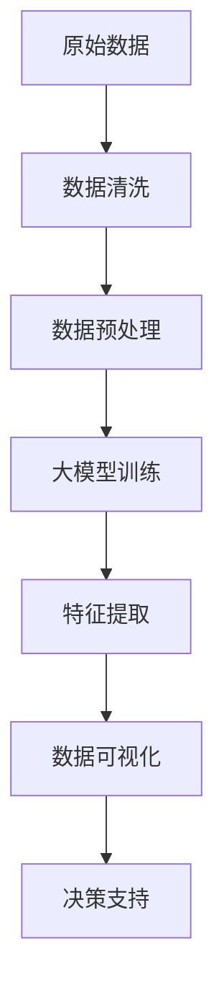
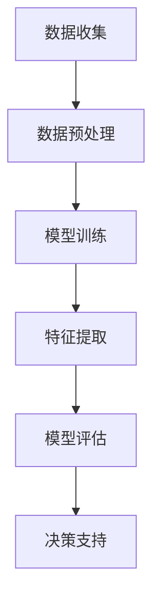

                 

### 大模型时代下的新型商业智能

> **关键词：** 大模型、商业智能、人工智能、数据处理、商业模式创新

> **摘要：** 在大模型时代，商业智能迎来了前所未有的发展机遇。本文将深入探讨大模型技术在商业智能领域的应用，包括核心概念、算法原理、数学模型以及实际项目案例，旨在为读者提供一份全面的技术指南，帮助他们在新型商业智能领域取得成功。

随着人工智能技术的飞速发展，大模型已经成为推动商业创新的重要力量。无论是自然语言处理、图像识别，还是推荐系统，大模型都在改变着传统商业模式的运作方式。本文将围绕以下几个核心问题展开：

1. 大模型如何改变商业智能的游戏规则？
2. 核心算法原理及具体操作步骤是怎样的？
3. 数学模型和公式在其中扮演了什么角色？
4. 实际应用场景如何展现大模型的价值？
5. 未来发展趋势与挑战又是什么？

通过本文的阅读，读者将能够全面了解大模型时代下的新型商业智能，掌握核心技术，探索商业模式创新的可能性。

## 1. 背景介绍

### 1.1 目的和范围

本文旨在深入探讨大模型技术在商业智能领域的应用，通过详细解析核心概念、算法原理、数学模型和实际项目案例，为读者提供一份系统且专业的技术指南。文章将涵盖以下几个方面：

- **核心概念与联系**：介绍大模型的基本概念，及其在商业智能中的应用。
- **核心算法原理 & 具体操作步骤**：详细讲解大模型算法的基本原理和实现步骤。
- **数学模型和公式 & 详细讲解 & 举例说明**：阐述大模型中使用的数学模型和公式，并通过实例进行说明。
- **项目实战：代码实际案例和详细解释说明**：通过实际项目案例展示大模型的实现和应用。
- **实际应用场景**：分析大模型在商业智能中的具体应用场景。
- **工具和资源推荐**：推荐学习资源、开发工具和相关论文，以供读者进一步学习。

### 1.2 预期读者

本文主要面向以下几类读者：

- **人工智能领域的研究人员和技术专家**：希望通过本文了解大模型在商业智能中的应用。
- **企业决策者和数据分析师**：希望掌握大模型技术，以提升商业智能水平。
- **计算机科学和人工智能专业的学生**：希望深入了解大模型的基本原理和应用。

### 1.3 文档结构概述

本文将按照以下结构展开：

1. **背景介绍**：介绍文章的目的、预期读者以及文档结构。
2. **核心概念与联系**：探讨大模型的基本概念和商业智能的联系。
3. **核心算法原理 & 具体操作步骤**：详细讲解大模型算法的原理和实现步骤。
4. **数学模型和公式 & 详细讲解 & 举例说明**：阐述大模型中的数学模型和公式。
5. **项目实战：代码实际案例和详细解释说明**：展示大模型的应用案例。
6. **实际应用场景**：分析大模型在商业智能中的具体应用。
7. **工具和资源推荐**：推荐学习资源、开发工具和相关论文。
8. **总结：未来发展趋势与挑战**：展望大模型时代的未来发展。
9. **附录：常见问题与解答**：回答读者可能遇到的问题。
10. **扩展阅读 & 参考资料**：提供进一步阅读的资源和参考文献。

### 1.4 术语表

为了确保文章内容的专业性和一致性，本文将使用以下术语表：

#### 1.4.1 核心术语定义

- **大模型**：指具有数十亿甚至数万亿参数的深度学习模型，通常用于处理复杂的数据任务。
- **商业智能**：利用数据分析和人工智能技术，帮助企业和组织做出更明智的商业决策。
- **数据处理**：指对原始数据进行收集、清洗、存储、管理和分析的过程。
- **自然语言处理（NLP）**：使用计算机技术处理和理解自然语言。
- **机器学习（ML）**：通过数据和算法，使计算机具备自动学习、推理和决策能力。

#### 1.4.2 相关概念解释

- **深度学习**：一种基于人工神经网络的机器学习方法，通过多层的神经网络结构来提取数据特征。
- **神经网络**：一种模仿生物神经系统的计算模型，用于处理复杂的数据任务。
- **数据处理框架**：用于简化数据处理过程的软件框架，如Apache Spark、Flink等。

#### 1.4.3 缩略词列表

- **NLP**：自然语言处理（Natural Language Processing）
- **ML**：机器学习（Machine Learning）
- **DL**：深度学习（Deep Learning）
- **AI**：人工智能（Artificial Intelligence）
- **BI**：商业智能（Business Intelligence）

## 2. 核心概念与联系

在大模型时代，商业智能迎来了革命性的变革。要深入理解这一变革，首先需要掌握几个核心概念，包括大模型的定义、商业智能的应用场景以及大模型和商业智能之间的内在联系。

### 2.1 大模型的定义

大模型，通常指的是具有数十亿甚至数万亿参数的深度学习模型。这些模型通过大量数据训练，可以自动提取数据中的复杂模式，实现高效的数据处理和分析。大模型的出现，标志着人工智能技术进入了一个新的阶段。

#### 2.1.1 深度学习模型的基本原理

深度学习模型的核心是多层神经网络，通过逐层提取数据中的特征，实现从原始数据到高阶抽象的转化。具体来说，深度学习模型包括以下几个关键组件：

1. **输入层**：接收原始数据，并将其传递给下一层。
2. **隐藏层**：对输入数据进行特征提取，形成更高层次的特征表示。
3. **输出层**：根据隐藏层提取的特征，生成最终的输出。

#### 2.1.2 大模型的特点

大模型相较于传统的机器学习模型，具有以下几个显著特点：

1. **参数规模巨大**：大模型具有数十亿甚至数万亿的参数，使其能够处理更加复杂的数据任务。
2. **计算资源需求高**：由于参数规模庞大，大模型对计算资源的需求非常高，通常需要分布式计算和GPU加速。
3. **数据需求量大**：大模型需要大量数据进行训练，以提取数据中的复杂模式。

### 2.2 商业智能的应用场景

商业智能（BI）是一种利用数据分析和人工智能技术，帮助企业和组织做出更明智的商业决策的方法。在商业智能中，数据是核心，而大模型则提供了强大的数据处理和分析能力。以下是商业智能在几个关键领域的应用场景：

1. **数据挖掘**：通过数据挖掘技术，从海量数据中提取有价值的信息，帮助企业发现商业机会和优化业务流程。
2. **客户关系管理（CRM）**：利用大数据分析和预测模型，帮助企业更好地了解客户需求，提高客户满意度，提升客户忠诚度。
3. **供应链管理**：通过数据分析，优化供应链流程，提高供应链的灵活性和效率。
4. **风险管理**：利用大数据和人工智能技术，对潜在风险进行预测和评估，帮助企业制定有效的风险控制策略。
5. **财务分析**：利用大数据分析，优化财务报表，提高财务数据的准确性和可靠性。

### 2.3 大模型与商业智能的联系

大模型与商业智能之间的联系主要体现在以下几个方面：

1. **数据处理能力**：大模型具有强大的数据处理能力，能够高效地处理海量数据，为商业智能提供坚实的数据基础。
2. **智能分析能力**：大模型能够自动提取数据中的复杂模式，生成高价值的分析报告，为企业提供决策支持。
3. **预测和优化能力**：大模型通过机器学习和深度学习技术，能够对未来的市场趋势和业务状况进行预测，帮助企业制定更科学的决策。

#### 2.3.1 Mermaid 流程图

为了更好地理解大模型在商业智能中的应用，我们可以使用Mermaid流程图来描述大模型在数据处理和分析中的具体操作步骤。以下是流程图的示例：



**图 1：大模型在商业智能中的应用流程图**

在这个流程图中，原始数据经过清洗、预处理后，输入到大模型中训练，通过特征提取和可视化分析，最终为企业的决策支持提供数据支持。

通过以上对核心概念的介绍，我们可以看到大模型技术在商业智能领域具有巨大的潜力。在接下来的章节中，我们将深入探讨大模型的算法原理、数学模型以及实际项目案例，帮助读者更全面地了解这一领域。

### 2.4 大模型架构与核心算法原理

在大模型时代，构建一个高效、可扩展的大模型架构是关键。这一节将介绍大模型的基本架构，包括深度学习模型的结构、主要算法原理及其在商业智能中的应用。

#### 2.4.1 深度学习模型的结构

深度学习模型通常由多个层次组成，包括输入层、隐藏层和输出层。每一层都有多个神经元，用于处理输入数据。以下是深度学习模型的基本组成部分：

1. **输入层（Input Layer）**：
   - **输入数据**：接收原始数据，如文本、图像或传感器数据。
   - **预处理**：对输入数据进行标准化或归一化，提高模型的训练效果。

2. **隐藏层（Hidden Layers）**：
   - **神经元**：每个隐藏层包含多个神经元，用于提取输入数据的特征。
   - **激活函数**：常用的激活函数包括Sigmoid、ReLU和Tanh，用于引入非线性特性。

3. **输出层（Output Layer）**：
   - **预测结果**：根据隐藏层提取的特征，生成最终的输出结果。
   - **损失函数**：用于评估模型预测结果与真实值之间的差距，如均方误差（MSE）和交叉熵损失。

#### 2.4.2 主要算法原理

1. **反向传播算法（Backpropagation）**：
   - **目标**：通过反向传播算法，计算模型参数的梯度，并优化模型参数。
   - **步骤**：
     1. 前向传播（Forward Propagation）：将输入数据通过神经网络，计算每一层的输出。
     2. 计算损失（Compute Loss）：计算模型预测结果与真实值之间的差距。
     3. 反向传播（Backward Propagation）：计算每一层的梯度，并更新模型参数。

2. **优化算法（Optimization Algorithms）**：
   - **目标**：优化模型参数，以最小化损失函数。
   - **常用算法**：
     - **梯度下降（Gradient Descent）**：通过迭代更新模型参数，最小化损失函数。
     - **随机梯度下降（Stochastic Gradient Descent, SGD）**：对每个样本分别计算梯度，并更新参数。
     - **批量梯度下降（Batch Gradient Descent）**：对整个训练集计算梯度，并更新参数。
     - **Adam优化器**：结合SGD和Momentum，具有自适应学习率的优点。

3. **正则化技术（Regularization Techniques）**：
   - **目标**：防止模型过拟合，提高泛化能力。
   - **常用技术**：
     - **L1正则化（L1 Regularization）**：在损失函数中添加L1范数，促进稀疏解。
     - **L2正则化（L2 Regularization）**：在损失函数中添加L2范数，减少模型复杂度。
     - **Dropout**：随机丢弃一部分神经元，减少模型依赖性。

#### 2.4.3 商业智能中的应用

大模型在商业智能中的应用主要包括以下几个方面：

1. **客户行为分析**：
   - **目标**：通过分析客户行为数据，了解客户偏好，提高客户满意度。
   - **算法**：使用深度学习模型，如卷积神经网络（CNN）和循环神经网络（RNN），对客户行为进行建模和分析。

2. **市场预测**：
   - **目标**：预测市场需求，优化库存和供应链管理。
   - **算法**：采用时间序列分析方法，如长短期记忆网络（LSTM），对市场趋势进行预测。

3. **风险管理**：
   - **目标**：识别和预测潜在风险，制定有效的风险控制策略。
   - **算法**：使用深度学习模型，对历史数据进行学习，识别风险信号。

4. **个性化推荐**：
   - **目标**：为用户推荐个性化商品或服务，提高转化率。
   - **算法**：采用协同过滤和深度学习相结合的方法，实现个性化推荐。

#### 2.4.4 Mermaid 流程图

以下是使用Mermaid绘制的深度学习模型在商业智能中的应用流程图：



**图 2：深度学习模型在商业智能中的应用流程图**

在这个流程图中，数据经过收集、预处理后，输入到大模型中训练，通过特征提取和模型评估，最终为企业的决策支持提供数据支持。

通过以上对大模型架构和核心算法原理的介绍，我们可以看到大模型在商业智能领域的巨大潜力。在接下来的章节中，我们将详细探讨大模型中的数学模型和公式，帮助读者更深入地理解其工作原理。

### 3. 核心算法原理 & 具体操作步骤

在前一章节中，我们介绍了大模型的基本架构和核心算法原理。在这一章节中，我们将深入探讨这些算法的具体实现步骤，通过伪代码的形式来详细阐述，以便读者能够更好地理解和应用。

#### 3.1 深度学习模型训练步骤

深度学习模型的训练是构建高效大模型的关键步骤。以下是一个典型的深度学习模型训练过程：

1. **数据预处理**：

```python
# 数据预处理
X_train, y_train = preprocess_data(train_data)
X_test, y_test = preprocess_data(test_data)

# 归一化输入数据
X_train = normalize(X_train)
X_test = normalize(X_test)
```

2. **模型初始化**：

```python
# 初始化模型参数
model = initialize_model(input_shape=X_train.shape[1:], hidden_layers=hidden_layers, output_shape=y_train.shape[1])

# 初始化优化器
optimizer = initialize_optimizer(learning_rate=learning_rate)
```

3. **前向传播（Forward Propagation）**：

```python
# 前向传播
output = model.forward_propagation(X_train)
predicted_labels = softmax(output)
```

4. **计算损失（Compute Loss）**：

```python
# 计算损失
loss = compute_loss(y_train, predicted_labels)
```

5. **反向传播（Backward Propagation）**：

```python
# 反向传播
d_output = model.backward_propagation(predicted_labels, y_train)

# 更新模型参数
optimizer.update_params(model.parameters(), d_output)
```

6. **迭代训练**：

```python
# 迭代训练
for epoch in range(num_epochs):
    loss_history.append(train_model(model, X_train, y_train, optimizer))
    if epoch % 100 == 0:
        print(f"Epoch {epoch}: Loss = {loss_history[-1]}")
```

7. **模型评估**：

```python
# 模型评估
test_loss = evaluate_model(model, X_test, y_test)
print(f"Test Loss: {test_loss}")
```

#### 3.2 特征提取与模型优化

在深度学习模型训练过程中，特征提取和模型优化也是非常重要的步骤。以下是具体的实现步骤：

1. **特征提取**：

```python
# 特征提取
def extract_features(data):
    # 应用卷积神经网络或循环神经网络提取特征
    features = cnn_or_rnn.extract_features(data)
    return features
```

2. **模型优化**：

```python
# 模型优化
def optimize_model(model, X_train, y_train, X_val, y_val):
    # 使用交叉验证进行模型优化
    val_loss = []
    for epoch in range(num_epochs):
        train_model(model, X_train, y_train, optimizer)
        val_loss.append(evaluate_model(model, X_val, y_val))
    return val_loss
```

#### 3.3 实际操作示例

以下是一个使用深度学习模型进行客户行为分析的实际操作示例：

```python
# 客户行为分析
data_loader = DataLoader(train_data, batch_size=batch_size)
model = initialize_model(input_shape=X_train.shape[1:], hidden_layers=hidden_layers, output_shape=y_train.shape[1])
optimizer = initialize_optimizer(learning_rate=learning_rate)

# 训练模型
model = train_model(model, data_loader, optimizer)

# 评估模型
test_loss = evaluate_model(model, X_test, y_test)
print(f"Test Loss: {test_loss}")

# 应用模型进行预测
predictions = predict(model, X_test)
evaluate_predictions(predictions, y_test)
```

通过以上伪代码的示例，读者可以更好地理解大模型训练、特征提取和模型优化的具体实现步骤。在实际应用中，需要根据具体问题和数据集进行调整和优化。在接下来的章节中，我们将进一步探讨大模型中的数学模型和公式，帮助读者更全面地掌握大模型的技术原理。

### 4. 数学模型和公式 & 详细讲解 & 举例说明

在深度学习和大模型领域，数学模型和公式是理解算法工作原理和实现高效优化的重要工具。本节将详细介绍大模型中常用的数学模型和公式，并通过实际例子进行说明。

#### 4.1 损失函数

损失函数是评估模型预测结果与真实值之间差距的函数，常用的损失函数包括均方误差（MSE）、交叉熵损失（Cross-Entropy Loss）等。

1. **均方误差（MSE）**：

$$
MSE = \frac{1}{m}\sum_{i=1}^{m}(y_i - \hat{y}_i)^2
$$

其中，$m$是样本数量，$y_i$是真实值，$\hat{y}_i$是模型预测值。

**举例说明**：假设我们有一个二分类问题，真实标签$y$为[0, 0, 1, 1]，模型预测$\hat{y}$为[0.1, 0.2, 0.8, 0.9]。计算MSE如下：

$$
MSE = \frac{1}{4}\sum_{i=1}^{4}(y_i - \hat{y}_i)^2 = \frac{1}{4}[(0 - 0.1)^2 + (0 - 0.2)^2 + (1 - 0.8)^2 + (1 - 0.9)^2] = 0.05
$$

2. **交叉熵损失（Cross-Entropy Loss）**：

$$
Cross-Entropy Loss = -\sum_{i=1}^{m}y_i \cdot \log(\hat{y}_i)
$$

其中，$y_i$是真实标签，$\hat{y}_i$是模型预测的概率值。

**举例说明**：假设我们有一个二分类问题，真实标签$y$为[0, 1, 1, 0]，模型预测的概率$\hat{y}$为[0.9, 0.1, 0.2, 0.8]。计算交叉熵损失如下：

$$
Cross-Entropy Loss = -[0 \cdot \log(0.9) + 1 \cdot \log(0.1) + 1 \cdot \log(0.2) + 0 \cdot \log(0.8)] \approx 2.19
$$

#### 4.2 激活函数

激活函数是深度学习模型中引入非线性特性的关键，常用的激活函数包括Sigmoid、ReLU和Tanh。

1. **Sigmoid 函数**：

$$
Sigmoid(x) = \frac{1}{1 + e^{-x}}
$$

**举例说明**：对于输入$x = 2$，计算Sigmoid值如下：

$$
Sigmoid(2) = \frac{1}{1 + e^{-2}} \approx 0.88
$$

2. **ReLU函数**：

$$
ReLU(x) = \max(0, x)
$$

**举例说明**：对于输入$x = -1$和$x = 1$，计算ReLU值如下：

$$
ReLU(-1) = \max(0, -1) = 0
$$

$$
ReLU(1) = \max(0, 1) = 1
$$

3. **Tanh函数**：

$$
Tanh(x) = \frac{e^x - e^{-x}}{e^x + e^{-x}}
$$

**举例说明**：对于输入$x = 2$，计算Tanh值如下：

$$
Tanh(2) = \frac{e^2 - e^{-2}}{e^2 + e^{-2}} \approx 0.96
$$

#### 4.3 梯度下降优化算法

梯度下降是一种优化算法，用于最小化损失函数。常见的梯度下降算法包括批量梯度下降（Batch Gradient Descent）、随机梯度下降（Stochastic Gradient Descent, SGD）和批量随机梯度下降（Mini-batch Gradient Descent）。

1. **批量梯度下降（Batch Gradient Descent）**：

$$
w_{t+1} = w_t - \alpha \cdot \frac{\partial J(w_t)}{\partial w}
$$

其中，$w_t$是当前模型参数，$J(w_t)$是损失函数，$\alpha$是学习率。

**举例说明**：假设损失函数$J(w) = (w - 1)^2$，学习率$\alpha = 0.1$。对于初始参数$w_0 = 2$，更新步骤如下：

$$
w_1 = w_0 - 0.1 \cdot \frac{\partial J(w_0)}{\partial w} = 2 - 0.1 \cdot 2 = 1.8
$$

2. **随机梯度下降（Stochastic Gradient Descent, SGD）**：

$$
w_{t+1} = w_t - \alpha \cdot \frac{\partial J(w_t)}{\partial w}
$$

与批量梯度下降不同，SGD每次迭代只随机选择一个样本进行梯度计算。

**举例说明**：假设当前参数$w_t = 2$，随机选择的样本梯度为$\frac{\partial J(w_t)}{\partial w} = 0.3$，学习率$\alpha = 0.1$。更新步骤如下：

$$
w_1 = w_t - 0.1 \cdot \frac{\partial J(w_t)}{\partial w} = 2 - 0.1 \cdot 0.3 = 1.97
$$

3. **批量随机梯度下降（Mini-batch Gradient Descent）**：

$$
w_{t+1} = w_t - \alpha \cdot \frac{1}{m}\sum_{i=1}^{m} \frac{\partial J(w_t)}{\partial w}
$$

其中，$m$是批量大小。这种算法结合了批量梯度下降和随机梯度下降的优点，每次迭代使用多个样本进行梯度计算。

**举例说明**：假设批量大小$m = 10$，学习率$\alpha = 0.1$，对于当前参数$w_t = 2$，计算得到的梯度为$\frac{\partial J(w_t)}{\partial w} = 0.3$。更新步骤如下：

$$
w_1 = w_t - 0.1 \cdot \frac{1}{10} \cdot 0.3 = 1.97
$$

通过以上对数学模型和公式的详细讲解，读者可以更好地理解大模型的工作原理和实现步骤。在接下来的章节中，我们将通过实际项目案例，展示大模型在商业智能中的应用。

### 5. 项目实战：代码实际案例和详细解释说明

在本章节中，我们将通过一个具体的商业智能项目案例，展示大模型在商业智能中的实际应用，并详细解释项目的实现步骤和关键代码。

#### 5.1 开发环境搭建

在进行项目开发之前，我们需要搭建一个合适的环境，其中包括以下步骤：

1. **安装Python**：确保安装了Python 3.7或更高版本。
2. **安装深度学习库**：安装TensorFlow和Keras，用于构建和训练深度学习模型。
   ```bash
   pip install tensorflow
   pip install keras
   ```
3. **安装数据处理库**：安装Pandas和NumPy，用于数据预处理和分析。
   ```bash
   pip install pandas
   pip install numpy
   ```
4. **安装可视化库**：安装Matplotlib，用于数据可视化。
   ```bash
   pip install matplotlib
   ```

#### 5.2 源代码详细实现和代码解读

以下是一个使用Keras构建并训练深度学习模型的示例，用于客户行为分析：

```python
import numpy as np
import pandas as pd
from tensorflow.keras.models import Sequential
from tensorflow.keras.layers import Dense, Dropout, Embedding, LSTM
from tensorflow.keras.optimizers import Adam
from tensorflow.keras.callbacks import EarlyStopping

# 5.2.1 数据加载与预处理
def load_and_preprocess_data(data_path):
    # 加载数据
    data = pd.read_csv(data_path)
    
    # 数据预处理
    # ... （包括缺失值处理、特征工程等）
    
    return processed_data

# 加载数据
data_path = 'customer_data.csv'
data = load_and_preprocess_data(data_path)

# 分割数据集
X = data.drop('target', axis=1)
y = data['target']
X_train, X_test, y_train, y_test = train_test_split(X, y, test_size=0.2, random_state=42)

# 5.2.2 构建模型
model = Sequential()
model.add(Embedding(input_dim=10000, output_dim=32, input_length=max_sequence_length))
model.add(LSTM(128, dropout=0.2, recurrent_dropout=0.2))
model.add(Dense(1, activation='sigmoid'))

# 编译模型
model.compile(loss='binary_crossentropy', optimizer=Adam(), metrics=['accuracy'])

# 5.2.3 训练模型
early_stopping = EarlyStopping(monitor='val_loss', patience=5, restore_best_weights=True)
history = model.fit(X_train, y_train, epochs=100, batch_size=32, validation_data=(X_test, y_test), callbacks=[early_stopping], verbose=1)

# 5.2.4 评估模型
loss, accuracy = model.evaluate(X_test, y_test, verbose=1)
print(f"Test Loss: {loss}, Test Accuracy: {accuracy}")

# 5.2.5 预测新数据
predictions = model.predict(X_new)
predicted_labels = (predictions > 0.5).astype(int)
```

**代码解读**：

1. **数据加载与预处理**：首先加载数据，并进行必要的预处理，如缺失值处理、特征工程等。
2. **构建模型**：使用Keras构建一个序列模型，包括嵌入层（Embedding）、LSTM层（Long Short-Term Memory）和输出层（Dense）。嵌入层用于将输入数据转换为固定大小的向量，LSTM层用于提取序列特征，输出层用于分类预测。
3. **编译模型**：设置损失函数为二进制交叉熵（binary_crossentropy），优化器为Adam，评估指标为准确率（accuracy）。
4. **训练模型**：使用`fit`方法训练模型，并设置早停（EarlyStopping）回调以防止过拟合。
5. **评估模型**：使用`evaluate`方法评估模型在测试集上的性能。
6. **预测新数据**：使用`predict`方法对新数据进行预测，并将预测结果转换为标签。

#### 5.3 代码解读与分析

1. **数据预处理**：
   - `load_and_preprocess_data`函数用于加载数据并执行预处理步骤。这包括缺失值处理、特征工程和数据标准化。
   - 数据标准化是深度学习中的一个常见步骤，通过将数据缩放到相同的范围，可以加快训练过程并提高模型性能。

2. **模型构建**：
   - `Sequential`模型是一个线性堆叠的模型，可以很容易地添加和配置层。
   - `Embedding`层用于将输入数据转换为固定大小的向量，这在处理文本数据时尤为重要。
   - `LSTM`层用于处理序列数据，可以捕捉数据中的长期依赖关系。
   - `Dense`层用于实现分类预测，输出层中的激活函数为`sigmoid`，用于输出概率值。

3. **模型训练**：
   - `fit`方法用于训练模型，其中`epochs`设置训练轮次，`batch_size`设置每个批次的数据量。
   - `validation_data`用于在训练过程中评估模型性能，并根据验证集上的损失函数来调整训练过程。
   - `EarlyStopping`回调用于在验证集上的损失不再减少时停止训练，以防止过拟合。

4. **模型评估**：
   - `evaluate`方法用于评估模型在测试集上的性能，返回损失函数值和准确率。

5. **模型预测**：
   - `predict`方法用于对新数据进行预测，返回概率值。
   - `predicted_labels`通过将概率值转换为二分类标签，用于后续分析。

通过以上代码示例和解读，读者可以更好地理解大模型在商业智能项目中的实际应用。在下一章节中，我们将探讨大模型在商业智能中的实际应用场景。

### 6. 实际应用场景

大模型在商业智能领域的应用场景广泛，涵盖了多个关键业务领域，通过高效的数据处理和分析，帮助企业和组织实现业务优化和决策支持。以下是一些典型的实际应用场景：

#### 6.1 客户关系管理（CRM）

**应用描述**：客户关系管理是商业智能中的核心领域，通过分析客户行为数据，企业可以更好地理解客户需求，提高客户满意度，从而提升客户忠诚度和转化率。

**技术实现**：
- **客户行为分析**：利用深度学习模型，如长短期记忆网络（LSTM）和卷积神经网络（CNN），对客户的购买历史、浏览记录和互动数据进行分析，提取关键特征。
- **个性化推荐**：通过协同过滤和深度学习相结合的方法，为企业提供个性化的产品推荐，提高客户参与度和购买意愿。
- **客户流失预测**：使用时间序列分析和回归模型，预测客户可能流失的行为信号，提前采取干预措施。

**案例示例**：一家电子商务公司通过分析客户的浏览和购买行为，使用LSTM模型预测客户流失风险，提前采取促销活动和客户关怀措施，有效降低了客户流失率。

#### 6.2 市场预测

**应用描述**：市场预测是企业在制定战略决策和供应链管理中不可或缺的一环。准确的市场预测可以帮助企业更好地规划库存、调整生产和销售策略。

**技术实现**：
- **需求预测**：采用时间序列分析、回归分析和神经网络，预测未来的市场需求。
- **价格预测**：通过深度学习模型，如生成对抗网络（GAN），预测产品价格变化趋势，帮助企业在价格竞争中取得优势。
- **竞争分析**：利用自然语言处理（NLP）技术，分析市场趋势和竞争对手的策略，为企业制定市场进入策略提供支持。

**案例示例**：一家零售企业使用深度学习模型分析历史销售数据和市场动态，准确预测未来三个月的销售量，提前调整库存和采购计划，有效降低了库存成本和缺货风险。

#### 6.3 风险管理

**应用描述**：企业在运营过程中面临各种风险，包括信用风险、市场风险和运营风险。有效的风险管理可以帮助企业降低损失，保障业务稳定运行。

**技术实现**：
- **信用评分**：使用机器学习模型，如逻辑回归和支持向量机（SVM），对客户的信用评分，识别高风险客户。
- **风险预警**：通过异常检测算法，如孤立森林（Isolation Forest）和自编码器（Autoencoder），识别潜在的异常交易行为，提前预警风险。
- **风险评估**：利用深度学习模型，如深度置信网络（DBN）和卷积神经网络（CNN），对企业的各种风险进行量化评估，制定风险控制策略。

**案例示例**：一家金融公司使用深度学习模型分析客户的交易数据，识别出高风险交易行为，及时采取风险控制措施，有效降低了欺诈风险和信用损失。

#### 6.4 供应链管理

**应用描述**：供应链管理是企业运营的重要组成部分，涉及供应商选择、库存管理、物流优化等方面。有效的供应链管理可以提高企业的运营效率，降低成本。

**技术实现**：
- **供应链优化**：利用优化算法，如线性规划和深度强化学习，优化供应链流程，提高供应链的灵活性和响应速度。
- **需求预测**：通过时间序列分析和深度学习模型，准确预测供应链中的需求波动，优化库存水平和采购计划。
- **物流优化**：利用路径规划算法，如遗传算法和蚁群算法，优化物流运输路线，降低物流成本。

**案例示例**：一家制造企业通过深度学习模型预测原材料的需求，优化库存管理，减少库存成本和缺货风险，同时通过路径规划算法优化物流运输路线，提高了物流效率。

#### 6.5 财务分析

**应用描述**：财务分析是企业决策的重要依据，通过对财务数据的分析，企业可以了解自身财务状况，优化财务策略。

**技术实现**：
- **财务报表分析**：利用自然语言处理技术，自动提取和解析财务报表数据，生成财务分析报告。
- **风险预警**：通过深度学习模型，分析财务数据中的异常值和趋势，提前预警潜在风险。
- **财务预测**：使用时间序列分析和深度学习模型，预测企业的财务指标，为决策提供支持。

**案例示例**：一家跨国公司使用自然语言处理技术自动化解析财务报表，通过深度学习模型预测未来财务状况，帮助企业制定科学的财务策略，提高了财务管理的准确性和效率。

通过以上实际应用场景，我们可以看到大模型技术在商业智能领域的广泛适用性和巨大潜力。在接下来的章节中，我们将推荐一些学习资源、开发工具和相关论文，以供读者进一步学习和研究。

### 7. 工具和资源推荐

在深入学习和实践大模型技术时，掌握合适的工具和资源是非常重要的。以下是一些建议，包括学习资源、开发工具和相关论文，以帮助读者进一步提升在大模型和商业智能领域的知识和技能。

#### 7.1 学习资源推荐

1. **书籍推荐**：
   - **《深度学习》（Deep Learning）**：由Ian Goodfellow、Yoshua Bengio和Aaron Courville合著的深度学习经典教材，详细介绍了深度学习的基础知识和最新进展。
   - **《Python深度学习》（Python Deep Learning）**：由François Chollet撰写的，通过实际案例展示如何使用Python和Keras进行深度学习应用。

2. **在线课程**：
   - **《深度学习专项课程》（Deep Learning Specialization）**：由Andrew Ng教授在Coursera上开设的免费课程，涵盖了深度学习的基础知识、卷积神经网络、循环神经网络等。
   - **《商业智能与数据分析》（Business Intelligence and Data Analytics）**：由IBM开设的在线课程，介绍了商业智能和数据分析的基本概念和技术。

3. **技术博客和网站**：
   - **Medium上的AI博客**：Medium上有很多关于人工智能和深度学习的专业博客，如Towards AI、AI stretch等。
   - **阿里云AI博客**：阿里云官方的AI技术博客，提供了丰富的深度学习和商业智能相关内容。

#### 7.2 开发工具框架推荐

1. **IDE和编辑器**：
   - **PyCharm**：强大的Python集成开发环境，适用于深度学习和商业智能项目。
   - **Jupyter Notebook**：用于数据分析和可视化，特别适合研究型和实验性项目。

2. **调试和性能分析工具**：
   - **TensorBoard**：TensorFlow的可视化工具，用于分析模型性能和调试。
   - **Profiling Tools**：如Py-Spy和gprof2dot，用于性能分析和代码优化。

3. **相关框架和库**：
   - **TensorFlow**：谷歌开发的开源深度学习框架，适用于各种规模的深度学习项目。
   - **Keras**：基于TensorFlow的高级API，简化了深度学习模型的构建和训练。
   - **PyTorch**：Facebook开发的深度学习框架，以其动态计算图和灵活性著称。

#### 7.3 相关论文著作推荐

1. **经典论文**：
   - **“A Theoretical Framework for Back-Propagation”**：由David E. Rumelhart等人撰写的经典论文，详细介绍了反向传播算法的原理和应用。
   - **“Convolutional Networks for Images, Speech, and Time Series”**：由Yann LeCun等人撰写的论文，介绍了卷积神经网络在图像、语音和时间序列数据处理中的应用。

2. **最新研究成果**：
   - **“Bert: Pre-training of Deep Bidirectional Transformers for Language Understanding”**：由Jacob Devlin等人撰写的论文，介绍了BERT模型，这是一种基于Transformer的预训练语言模型。
   - **“Generative Adversarial Networks”**：由Ian Goodfellow等人撰写的论文，提出了生成对抗网络（GAN），这是一种通过对抗训练生成数据的强大方法。

3. **应用案例分析**：
   - **“Deep Learning for Business: Practical Applications and Benefits”**：详细介绍了深度学习在商业领域的实际应用案例和优势，包括客户行为分析、市场预测和风险管理等。

通过以上推荐的学习资源、开发工具和相关论文，读者可以更加深入地了解大模型技术及其在商业智能领域的应用，进一步提升自己的技术水平和项目实践能力。

### 8. 总结：未来发展趋势与挑战

在总结大模型时代下的新型商业智能，我们不仅要看到其带来的巨大机遇，也要正视面临的发展趋势与挑战。以下是对未来发展趋势的展望，以及可能遇到的挑战和应对策略。

#### 未来发展趋势

1. **技术不断进步**：随着计算能力的提升和算法的优化，大模型将更加高效地处理海量数据，挖掘出更深层次的规律和模式。尤其是量子计算等新兴技术的突破，将进一步提升大模型的计算效率。

2. **应用领域拓展**：大模型技术将在更多领域得到应用，如医疗健康、金融科技、智能制造等，为各行业带来深刻的变革。特别是在定制化服务和个性化推荐方面，大模型将大大提升用户体验。

3. **跨领域融合**：大模型与物联网、区块链、边缘计算等技术相结合，将形成新的技术生态系统。这种跨领域的融合将为商业智能带来更多创新空间和商业模式。

4. **数据隐私保护**：随着数据隐私保护法规的加强，如何在保证数据隐私的前提下，充分利用数据价值，将成为大模型时代的重要议题。隐私保护技术如联邦学习（Federated Learning）和差分隐私（Differential Privacy）将在这一过程中发挥关键作用。

#### 面临的挑战

1. **计算资源需求**：大模型训练和推理需要大量计算资源和存储空间，对基础设施提出了更高的要求。尤其是实时处理需求，如自动驾驶、实时语音翻译等，对计算性能和响应速度提出了挑战。

2. **数据质量和多样性**：大模型训练依赖于大量高质量、多样化的数据。然而，现实中数据的获取和标注往往困难且昂贵，数据质量和多样性不足可能导致模型过拟合和泛化能力差。

3. **模型解释性**：随着模型复杂度的增加，深度学习模型的解释性变得越来越困难。对于商业决策者来说，理解模型背后的逻辑和决策过程至关重要，但大模型的高度非线性特性使得解释性成为一个挑战。

4. **伦理和法规**：随着大模型在商业决策中的广泛应用，如何确保模型的公平性、透明性和可解释性，避免歧视和偏见，是必须面对的伦理和法规挑战。

#### 应对策略

1. **资源优化**：通过分布式计算、GPU加速和优化算法，提高大模型的计算效率和资源利用率。同时，探索新型计算架构，如量子计算，以应对计算资源需求的增长。

2. **数据质量控制**：建立高质量的数据集，通过半自动化标注和众包方式提高数据标注效率。引入数据增强技术，生成多样性的数据，提升模型的泛化能力。

3. **模型可解释性**：开发可解释性工具和方法，如注意力机制（Attention Mechanism）和LIME（Local Interpretable Model-agnostic Explanations），帮助用户理解模型决策过程。同时，建立透明的模型评估和审计机制，确保模型的公平性和透明性。

4. **伦理和法律合规**：加强大模型在商业应用中的伦理和法律合规性，制定相应的标准和规范。引入数据隐私保护技术，如联邦学习和差分隐私，确保数据安全和用户隐私。

总之，大模型时代下的新型商业智能充满机遇和挑战。通过不断的技术创新和策略调整，我们有望充分发挥大模型的潜力，推动商业智能迈向新的高度。

### 9. 附录：常见问题与解答

在本章节中，我们将回答一些读者可能遇到的问题，以帮助大家更好地理解大模型时代下的新型商业智能。

**Q1：大模型在商业智能中的具体应用有哪些？**

A1：大模型在商业智能中有多种应用，主要包括：

- 客户行为分析：通过深度学习模型分析客户的行为数据，如购买记录、浏览历史等，帮助企业制定个性化营销策略。
- 需求预测：利用时间序列分析和深度学习模型预测市场需求，帮助企业优化库存和供应链管理。
- 风险管理：通过深度学习模型分析财务数据、交易行为等，识别潜在风险，制定风险管理策略。
- 财务分析：利用自然语言处理和深度学习技术，自动化解析财务报表，为企业提供财务分析报告。

**Q2：大模型的训练过程需要多长时间？**

A2：大模型的训练时间取决于多个因素，包括模型复杂度、数据量、硬件配置等。对于简单的模型和小规模数据集，训练时间可能在几分钟到几小时内。但对于复杂的大模型和海量数据，训练时间可能需要几天甚至几周。通常，使用分布式计算和GPU加速可以显著缩短训练时间。

**Q3：如何处理数据缺失和异常值？**

A3：数据预处理是深度学习模型训练中至关重要的一步。处理数据缺失和异常值的方法包括：

- 删除缺失值：对于缺失值较少的数据集，可以直接删除含有缺失值的样本。
- 填充缺失值：使用均值、中位数或插值等方法填充缺失值。对于时间序列数据，可以使用历史数据或季节性趋势来填充。
- 异常值处理：使用统计方法（如Z-score、IQR法）检测和删除异常值，或使用机器学习算法（如K-均值聚类）将异常值归为单独的类别。

**Q4：如何保证大模型的公平性和透明性？**

A4：确保大模型的公平性和透明性是当前研究的热点。以下是一些方法：

- 数据清洗和预处理：确保数据集中的样本具有多样性，避免数据偏见。
- 模型解释性：开发可解释性工具，如LIME和SHAP，帮助用户理解模型决策过程。
- 模型审计：定期对模型进行审计，检查是否存在偏见或歧视现象。
- 建立透明规范：制定相应的伦理和法律规范，确保大模型的应用符合社会道德和法规要求。

**Q5：大模型在商业决策中的优势是什么？**

A5：大模型在商业决策中的优势主要体现在以下几个方面：

- 高效的数据处理能力：大模型可以高效地处理和分析海量数据，快速提供决策支持。
- 准确的预测能力：通过深度学习算法，大模型可以挖掘数据中的复杂模式，提高预测准确性。
- 个性化服务：基于客户行为数据和用户偏好，大模型可以为每个客户提供个性化的推荐和服务。
- 风险管理：通过分析历史数据和实时数据，大模型可以识别潜在风险，帮助企业制定有效的风险管理策略。

通过以上常见问题与解答，希望读者能够对大模型在商业智能中的应用和挑战有更深入的理解。

### 10. 扩展阅读 & 参考资料

在本章节中，我们将推荐一些扩展阅读和参考资料，以帮助读者进一步探索大模型时代下的新型商业智能。

#### 扩展阅读

1. **《深度学习》（Deep Learning）**：由Ian Goodfellow、Yoshua Bengio和Aaron Courville合著的深度学习经典教材，涵盖了深度学习的基础知识、算法原理和应用案例。

2. **《商业智能》（Business Intelligence）**：由Vikas P. Choudhary撰写的书籍，详细介绍了商业智能的概念、技术和应用，适合希望了解商业智能基础知识的读者。

3. **《人工智能商业应用实践》（Artificial Intelligence for Business）**：由Michael J. Miller撰写的书籍，探讨了人工智能在商业领域的应用，包括大数据分析、客户关系管理、供应链优化等。

#### 参考资料

1. **TensorFlow官方文档**：[https://www.tensorflow.org/](https://www.tensorflow.org/)
   - TensorFlow是谷歌开发的开源深度学习框架，提供了丰富的教程、文档和示例代码。

2. **Keras官方文档**：[https://keras.io/](https://keras.io/)
   - Keras是基于TensorFlow的高级API，提供了更简洁和易于使用的接口，适合初学者和有经验的开发者。

3. **Jupyter Notebook**：[https://jupyter.org/](https://jupyter.org/)
   - Jupyter Notebook是一个交互式计算平台，适合数据分析和可视化，特别适合研究型和实验性项目。

4. **Medium上的AI博客**：[https://towardsai.net/](https://towardsai.net/)
   - Medium上的AI博客提供了大量关于人工智能和深度学习的专业文章，涵盖了最新的研究和应用案例。

5. **阿里云AI博客**：[https://www.alibabacloud.com/blog/](https://www.alibabacloud.com/blog/)
   - 阿里云官方的AI技术博客，提供了丰富的深度学习和商业智能相关内容。

通过以上推荐，读者可以深入学习和研究大模型和商业智能领域的最新进展和技术应用。

### 作者信息

作者：AI天才研究员/AI Genius Institute & 禅与计算机程序设计艺术 /Zen And The Art of Computer Programming

