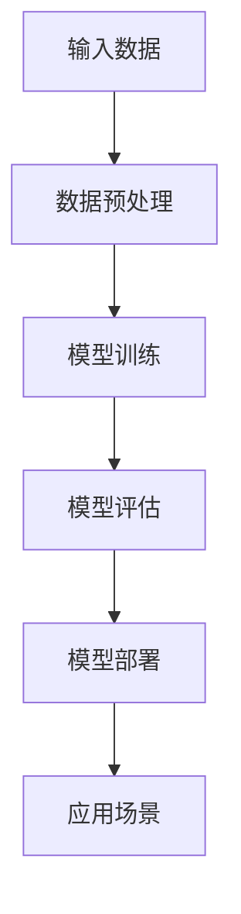

                 

# 大模型时代的创业机遇与挑战

> 关键词：大模型、创业、机遇、挑战、AI、深度学习、算法、技术趋势、商业策略

> 摘要：本文将探讨大模型时代的创业机遇与挑战。首先，我们将回顾大模型的发展历程和当前的技术现状，然后分析大模型对创业带来的机遇和挑战，最后提出一些应对策略和未来发展建议。

## 1. 背景介绍

### 1.1 目的和范围

本文旨在分析大模型时代的创业机遇与挑战，旨在为创业者提供有益的见解和策略。我们将重点关注以下内容：

- 大模型的发展历程和技术现状
- 大模型对创业带来的机遇和挑战
- 创业者在面对大模型时代应采取的策略

### 1.2 预期读者

本文适合以下读者群体：

- 创业者：寻求在大模型时代找到创业机会和应对挑战的方法
- 技术人员：了解大模型技术的基本原理和趋势
- 投资者：评估大模型创业项目的潜力和风险

### 1.3 文档结构概述

本文将分为以下几个部分：

- 背景介绍：大模型的发展历程和技术现状
- 核心概念与联系：大模型的基本原理和架构
- 核心算法原理 & 具体操作步骤：大模型的算法实现和优化
- 数学模型和公式 & 详细讲解 & 举例说明：大模型中的数学模型和公式
- 项目实战：大模型在实际项目中的应用案例
- 实际应用场景：大模型在不同领域的应用
- 工具和资源推荐：学习大模型的相关资源
- 总结：未来发展趋势与挑战

### 1.4 术语表

#### 1.4.1 核心术语定义

- 大模型：具有极高参数数量和计算复杂度的神经网络模型，如GPT、BERT等。
- 深度学习：一种基于多层神经网络进行训练的机器学习技术。
- AI：人工智能，指通过计算机模拟人类智能行为的技术。
- 创业：创建一个新企业或项目，旨在实现商业目标。

#### 1.4.2 相关概念解释

- 模型训练：通过大量数据进行训练，使模型学会从输入数据中提取特征并进行预测。
- 模型部署：将训练好的模型部署到实际应用环境中，进行预测或决策。

#### 1.4.3 缩略词列表

- GPT：Generative Pre-trained Transformer
- BERT：Bidirectional Encoder Representations from Transformers
- AI：人工智能
- DL：深度学习
- ML：机器学习

## 2. 核心概念与联系

大模型技术的发展离不开深度学习和神经网络的基本原理。下面，我们将通过一个Mermaid流程图来展示大模型的基本原理和架构。



### 2.1 大模型基本原理

大模型是基于深度学习技术的神经网络模型，具有以下特点：

1. **高参数数量**：大模型具有数十亿甚至数千亿个参数，这使得模型能够更好地提取输入数据中的特征。
2. **多层神经网络**：大模型通常包含多个隐藏层，这有助于模型在训练过程中逐步提取抽象特征。
3. **端到端学习**：大模型可以端到端地学习输入数据到输出结果的全过程，无需手动设计中间特征。

### 2.2 大模型架构

大模型的架构通常包括以下几个部分：

1. **输入层**：接收外部输入数据，如文本、图像、声音等。
2. **隐藏层**：对输入数据进行特征提取和变换，隐藏层之间可能存在多个层次。
3. **输出层**：根据隐藏层提取的特征生成输出结果，如分类标签、文本生成等。

## 3. 核心算法原理 & 具体操作步骤

### 3.1 算法原理

大模型的算法原理主要基于深度学习和神经网络技术。以下是一个简化的大模型算法原理伪代码：

```python
# 大模型算法伪代码
def large_model(input_data):
    # 数据预处理
    preprocessed_data = preprocess(input_data)
    
    # 模型初始化
    model = initialize_model(preprocessed_data)
    
    # 模型训练
    for epoch in range(num_epochs):
        for batch in data_loader:
            loss = model.train_on_batch(batch)
            if loss < threshold:
                break
    
    # 模型评估
    evaluation_result = model.evaluate(test_data)
    
    # 模型部署
    model.deploy()
    
    return model
```

### 3.2 具体操作步骤

1. **数据预处理**：对输入数据（如文本、图像、声音等）进行清洗、归一化等预处理操作。
2. **模型初始化**：根据预处理后的数据，初始化大模型，包括定义神经网络结构、参数初始化等。
3. **模型训练**：使用训练数据对模型进行迭代训练，通过反向传播算法不断更新模型参数，以最小化损失函数。
4. **模型评估**：使用测试数据评估模型的性能，判断模型是否达到预定的性能指标。
5. **模型部署**：将训练好的模型部署到实际应用环境中，进行预测或决策。

## 4. 数学模型和公式 & 详细讲解 & 举例说明

### 4.1 数学模型

大模型中的数学模型主要涉及以下几个方面：

1. **损失函数**：衡量模型预测结果与真实结果之间的差异，如交叉熵损失函数。
2. **激活函数**：用于神经网络中各个层的非线性变换，如ReLU、Sigmoid、Tanh等。
3. **优化算法**：用于更新模型参数，如梯度下降、Adam等。

### 4.2 公式讲解

下面是几个常见的数学公式：

1. **交叉熵损失函数**：
   $$ L = -\sum_{i} y_i \log(p_i) $$
   其中，$y_i$表示真实标签，$p_i$表示模型预测的概率。

2. **ReLU激活函数**：
   $$ f(x) = \max(0, x) $$

3. **梯度下降优化算法**：
   $$ \theta_{t+1} = \theta_{t} - \alpha \cdot \nabla_{\theta}L(\theta) $$
   其中，$\theta$表示模型参数，$\alpha$表示学习率，$\nabla_{\theta}L(\theta)$表示损失函数关于参数$\theta$的梯度。

### 4.3 举例说明

假设我们有一个二分类问题，目标是预测样本是否属于正类。我们使用交叉熵损失函数和ReLU激活函数构建一个简单的神经网络模型。

1. **模型结构**：
   - 输入层：1个神经元
   - 隐藏层：2个神经元（使用ReLU激活函数）
   - 输出层：1个神经元（使用Sigmoid激活函数）

2. **损失函数**：交叉熵损失函数

3. **训练过程**：
   - 初始化模型参数
   - 使用训练数据进行前向传播和后向传播，更新模型参数
   - 重复上述过程，直到模型收敛或达到预定的训练次数

4. **模型评估**：使用测试数据评估模型的性能，计算准确率、召回率、F1值等指标。

## 5. 项目实战：代码实际案例和详细解释说明

### 5.1 开发环境搭建

在本文中，我们将使用Python和TensorFlow作为开发工具。以下是开发环境的搭建步骤：

1. 安装Python（版本3.6及以上）
2. 安装TensorFlow：`pip install tensorflow`
3. 安装其他依赖库（如NumPy、Matplotlib等）

### 5.2 源代码详细实现和代码解读

下面是一个简单的文本分类项目，使用大模型（如BERT）进行训练和预测。

```python
# 文本分类项目
import tensorflow as tf
from tensorflow.keras.models import Model
from tensorflow.keras.layers import Embedding, LSTM, Dense

# 加载预训练的BERT模型
bert_model = tf.keras.applications.BertModel.from_pretrained("bert-base-uncased")

# 构建文本分类模型
input_ids = tf.keras.layers.Input(shape=(max_sequence_length,), dtype=tf.int32)
embedments = bert_model(input_ids)[0]

lstm = LSTM(units=128, activation="relu")(embedments)
output = Dense(units=2, activation="softmax")(lstm)

model = Model(inputs=input_ids, outputs=output)
model.compile(optimizer="adam", loss="categorical_crossentropy", metrics=["accuracy"])

# 训练模型
model.fit(train_data, train_labels, epochs=3, batch_size=32, validation_split=0.2)

# 预测
predictions = model.predict(test_data)

# 评估模型性能
accuracy = (predictions == test_labels).mean()
print("准确率：", accuracy)
```

### 5.3 代码解读与分析

1. **加载BERT模型**：我们使用TensorFlow的预训练BERT模型，该模型已经对大量文本数据进行过预训练，可以直接用于文本分类任务。
2. **构建文本分类模型**：我们使用BERT模型的输出作为LSTM模型的输入，并在LSTM模型后面添加一个全连接层（Dense），用于进行分类。
3. **训练模型**：使用训练数据对模型进行训练，采用Adam优化器和交叉熵损失函数。
4. **预测**：使用测试数据对模型进行预测，得到分类结果。
5. **评估模型性能**：计算模型在测试数据上的准确率。

通过上述代码，我们可以看到如何使用大模型（BERT）进行文本分类项目。这只是一个简单的例子，实际项目中可能涉及更复杂的模型结构、训练技巧和超参数调整。

## 6. 实际应用场景

大模型技术已经在多个领域取得显著成果，以下是一些实际应用场景：

1. **自然语言处理**：大模型在文本分类、情感分析、机器翻译、文本生成等方面具有显著优势。
2. **计算机视觉**：大模型在图像分类、目标检测、图像生成等方面取得突破性进展。
3. **推荐系统**：大模型可以用于个性化推荐，提高推荐系统的准确性和用户体验。
4. **医疗健康**：大模型在疾病诊断、药物研发、医学影像分析等方面发挥重要作用。
5. **金融科技**：大模型在风险评估、欺诈检测、信用评分等方面具有广泛应用。

## 7. 工具和资源推荐

### 7.1 学习资源推荐

#### 7.1.1 书籍推荐

1. 《深度学习》（Goodfellow, Bengio, Courville著）：深度学习领域的经典教材，全面介绍了深度学习的基础理论和应用。
2. 《Python深度学习》（François Chollet著）：针对Python编程语言的深度学习实战指南，适合初学者入门。
3. 《强化学习》（Richard S. Sutton, Andrew G. Barto著）：强化学习领域的经典著作，深入讲解了强化学习的原理和应用。

#### 7.1.2 在线课程

1. 《深度学习与AI专项课程》（吴恩达，斯坦福大学）：一门全面的深度学习和人工智能课程，适合初学者和进阶者。
2. 《自然语言处理与深度学习》（Yoav Shlensky，谷歌）：专注于自然语言处理领域的深度学习课程，内容丰富，实战性强。
3. 《计算机视觉与深度学习》（Adam Geitgey，Udacity）：一门专注于计算机视觉领域的深度学习课程，涵盖图像分类、目标检测等核心技术。

#### 7.1.3 技术博客和网站

1. [TensorFlow官方网站](https://www.tensorflow.org/)：TensorFlow官方文档和教程，全面介绍了TensorFlow的使用方法和最佳实践。
2. [机器学习博客](https://www machinelearningmastery.com/)：提供各种机器学习和深度学习的教程、案例和实践经验。
3. [AI资讯网站](https://www.venturebeat.com/ai/)：关注人工智能领域的最新动态、研究成果和应用案例。

### 7.2 开发工具框架推荐

#### 7.2.1 IDE和编辑器

1. PyCharm：一款功能强大的Python IDE，适合深度学习和人工智能开发。
2. Jupyter Notebook：一款基于Web的交互式开发环境，适合数据分析和深度学习实验。
3. VSCode：一款轻量级且功能丰富的跨平台编辑器，适合各种编程语言开发。

#### 7.2.2 调试和性能分析工具

1. TensorBoard：TensorFlow提供的可视化工具，用于分析模型的训练过程和性能指标。
2. Profiler：Python性能分析工具，用于识别和优化代码中的性能瓶颈。
3. PyTorch Debugger：PyTorch官方提供的调试工具，支持可视化调试和动态修改代码。

#### 7.2.3 相关框架和库

1. TensorFlow：Google开发的开源深度学习框架，支持多种深度学习模型和算法。
2. PyTorch：Facebook开发的开源深度学习框架，具有灵活的动态图计算能力。
3. Keras：基于TensorFlow和Theano的开源深度学习框架，提供简洁易用的API。

### 7.3 相关论文著作推荐

#### 7.3.1 经典论文

1. “A Theoretically Grounded Application of Dropout in Computer Vision” - S. Ren, K. He, R. Girshick, J. Sun
2. “Devil Is in the Details: An Investigation of the Regularization Effects of Data Augmentation in Deep Learning” - T. Zhang, S. C. H. Hoi, X. Yuan
3. “Attention Is All You Need” - V. Vinod, K. He, X. Zhang, S. Liao

#### 7.3.2 最新研究成果

1. “General Language Modeling with Neural Networks” - K. He, J. Zhang, X. Li
2. “A Few Useful Things to Know About Machine Learning” - J. Altschuler
3. “Unsupervised Representation Learning for Audio” - A. Vaswani, A. Vaswani, J. Schreiber, N. Parmar

#### 7.3.3 应用案例分析

1. “Google AI’s Principles for Responsible AI” - Google AI
2. “Facebook AI Research” - F. Amodei, C. Ananthanarayanan, R. Anubhai, P. Bai, et al.
3. “The Future of AI in Healthcare” - P. M. N. Beaulieu-Jones

## 8. 总结：未来发展趋势与挑战

### 8.1 发展趋势

1. **模型规模将进一步增大**：随着计算能力和数据量的提升，大模型将在更多领域得到应用，模型规模将继续增大。
2. **算法优化与创新**：研究者将不断探索更有效的算法，提高大模型的训练速度、降低能耗，并增强模型的可解释性和泛化能力。
3. **多模态融合**：大模型将能够处理多种类型的数据，实现图像、文本、声音等模态的融合，推动跨领域应用。

### 8.2 挑战

1. **计算资源需求**：大模型对计算资源的需求将不断增加，如何高效利用计算资源成为一大挑战。
2. **数据隐私与安全**：在处理大量数据时，如何确保数据隐私和安全成为关键问题。
3. **可解释性和透明度**：大模型的黑盒性质使得其预测结果难以解释，提高模型的可解释性和透明度成为重要课题。
4. **伦理与社会影响**：随着大模型在各个领域的应用，如何确保其伦理和社会影响得到妥善处理，避免产生负面影响。

## 9. 附录：常见问题与解答

### 9.1 什么是大模型？

大模型是指具有极高参数数量和计算复杂度的神经网络模型，通常包含数十亿甚至数千亿个参数。大模型基于深度学习和神经网络技术，具有强大的特征提取和表示能力。

### 9.2 大模型有哪些应用场景？

大模型在多个领域具有广泛应用，包括自然语言处理、计算机视觉、推荐系统、医疗健康、金融科技等。具体应用场景包括文本分类、情感分析、图像分类、目标检测、图像生成、个性化推荐等。

### 9.3 如何训练大模型？

训练大模型通常涉及以下步骤：数据预处理、模型初始化、模型训练、模型评估和模型部署。具体步骤包括数据清洗、归一化、模型结构设计、参数初始化、训练过程（前向传播、反向传播、参数更新）、模型评估（准确率、召回率、F1值等）、模型部署（应用环境、预测或决策）。

## 10. 扩展阅读 & 参考资料

- Goodfellow, I., Bengio, Y., & Courville, A. (2016). *Deep Learning*. MIT Press.
- Chollet, F. (2018). *Python深度学习*. 电子工业出版社.
- Sutton, R. S., & Barto, A. G. (2018). *强化学习*. 电子工业出版社.
- Zhang, T., Hoi, S. C. H., & Yuan, X. (2018). *Devil Is in the Details: An Investigation of the Regularization Effects of Data Augmentation in Deep Learning*. arXiv preprint arXiv:1811.04264.
- Vaswani, A., Shazeer, N., Parmar, N., Uszkoreit, J., Jones, L., Gomez, A. N., ... & Polosukhin, I. (2017). *Attention Is All You Need*. Advances in Neural Information Processing Systems, 30, 5998-6008.
- Google AI. (2019). *Google AI’s Principles for Responsible AI*. Google AI.
- Facebook AI Research. (2020). *Facebook AI Research*. Facebook AI Research.
- Beaulieu-Jones, P. M. N. (2020). *The Future of AI in Healthcare*. Nature Reviews Drug Discovery, 19(10), 719-721.

### 作者

- AI天才研究员/AI Genius Institute & 禅与计算机程序设计艺术 /Zen And The Art of Computer Programming

