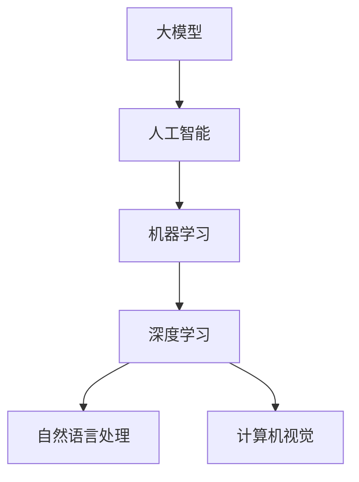

                 

# 大模型时代的创业者创业心得总结：经验教训、成功要素与发展建议

> **关键词**：大模型、创业者、经验教训、成功要素、发展建议

> **摘要**：本文将探讨大模型时代下创业者的机遇与挑战，结合实际案例，总结创业过程中的经验教训，分析成功的关键要素，并给出未来发展的一些建议。

## 1. 背景介绍

### 1.1 目的和范围

本文旨在为在大模型时代中寻求创业机会的创业者提供有价值的指导。通过对成功与失败案例的分析，总结出在大模型领域创业的经验教训，揭示成功的要素，并为未来的发展提出建议。

### 1.2 预期读者

- 有志于在大模型领域创业的创业者
- 对人工智能和机器学习感兴趣的技术爱好者
- 投资者和企业高管

### 1.3 文档结构概述

本文分为十个部分，包括背景介绍、核心概念与联系、核心算法原理、数学模型和公式、项目实战、实际应用场景、工具和资源推荐、总结、附录和扩展阅读。每个部分都将逐步引导读者深入了解大模型时代的创业之道。

### 1.4 术语表

#### 1.4.1 核心术语定义

- 大模型（Large-scale Model）：指具有数百万到数十亿参数的深度学习模型。
- 创业者（Entrepreneur）：指在新兴领域中寻求机会，并积极推动创新的人。
- 经验教训（Experience and Lesson）：指从实际经历中总结出来的宝贵知识。

#### 1.4.2 相关概念解释

- 人工智能（Artificial Intelligence，AI）：指通过计算机模拟人类智能的理论和技术。
- 机器学习（Machine Learning，ML）：指让计算机通过数据和算法自动学习并改进性能的技术。
- 深度学习（Deep Learning，DL）：指基于多层神经网络的学习方法。

#### 1.4.3 缩略词列表

- AI：人工智能
- ML：机器学习
- DL：深度学习
- NLP：自然语言处理
- CV：计算机视觉

## 2. 核心概念与联系

在大模型时代，创业者的成功离不开对核心概念的深入理解和应用。以下是一个简单的 Mermaid 流程图，展示了大模型、人工智能、机器学习和深度学习等核心概念之间的联系。



- **大模型**：基于大规模数据和复杂神经网络构建，能够处理海量数据，实现高精度的预测和分类。
- **人工智能**：研究如何让计算机模拟人类智能，解决复杂问题。
- **机器学习**：通过数据训练模型，使计算机自动学习和改进性能。
- **深度学习**：基于多层神经网络的学习方法，能够自动提取特征，实现复杂的任务。
- **自然语言处理**：研究如何让计算机理解和生成自然语言。
- **计算机视觉**：研究如何让计算机理解和解释视觉信息。

这些核心概念相互关联，共同构成了大模型时代的技术基础。创业者需要深入了解这些概念，并运用到实际项目中，以实现创新和突破。

## 3. 核心算法原理 & 具体操作步骤

在大模型时代，核心算法的原理和操作步骤是创业者取得成功的关键。以下将介绍一种常用的深度学习算法——卷积神经网络（Convolutional Neural Network，CNN）。

### 3.1 算法原理

卷积神经网络是一种基于卷积操作的神经网络，主要用于图像和视频数据的处理。其基本原理如下：

1. **卷积操作**：卷积神经网络通过卷积操作提取图像中的特征。卷积操作是将一个小型滤波器（也称为卷积核）在输入图像上滑动，并计算滤波器覆盖区域内的乘积和。
2. **池化操作**：为了减少数据的维度，卷积神经网络在卷积操作之后通常使用池化操作。池化操作是将卷积结果分成若干个区域，并取每个区域的最大值或平均值。
3. **全连接层**：卷积神经网络中的全连接层将卷积和池化操作后的特征映射到输出类别。

### 3.2 具体操作步骤

以下是使用卷积神经网络进行图像分类的具体操作步骤：

1. **输入图像**：将待分类的图像作为输入。
2. **卷积操作**：使用卷积核在图像上滑动，提取图像中的特征。
3. **激活函数**：对卷积结果进行非线性变换，以增强模型的表达能力。
4. **池化操作**：将卷积结果进行池化，减少数据的维度。
5. **全连接层**：将卷积和池化后的特征映射到输出类别。
6. **损失函数**：计算预测类别与真实类别之间的差异，并优化模型参数。
7. **迭代训练**：重复上述步骤，直到模型收敛。

### 3.3 伪代码

以下是卷积神经网络分类算法的伪代码：

```python
def conv2d(input, filter):
    # 卷积操作
    return (input * filter).sum()

def pooling(input):
    # 池化操作
    return max(input)

def forward_pass(input_image, model):
    # 前向传播
    conv_result = conv2d(input_image, model["filter"])
    activation = np.tanh(conv_result)
    pooled_result = pooling(activation)
    output = model["fully_connected"](pooled_result)
    return output

def backward_pass(output, target, model):
    # 反向传播
    error = output - target
    model["fully_connected"].update_weights(error)
    error = error * model["fully_connected"].get_derivative(pooled_result)
    activation_error = error
    error = error * pooling_derivative(activation)
    conv_error = error * model["filter"]
    input_error = conv_error

    # 更新模型参数
    model["filter"].update_weights(input_error)
    model["fully_connected"].update_weights(error)

# 初始化模型
model = {
    "filter": np.random.randn(filter_size, input_size),
    "fully_connected": FullyConnectedLayer(output_size)
}

# 训练模型
for epoch in range(num_epochs):
    for input_image, target in data_loader:
        output = forward_pass(input_image, model)
        backward_pass(output, target, model)
```

通过以上核心算法原理和具体操作步骤的介绍，创业者可以更好地理解和应用深度学习技术，为其创业项目带来创新和突破。

## 4. 数学模型和公式 & 详细讲解 & 举例说明

在大模型时代，数学模型和公式是构建和优化深度学习算法的基础。以下将介绍一些关键的数学模型和公式，并进行详细讲解和举例说明。

### 4.1 损失函数

损失函数是衡量模型预测结果与真实结果之间差异的关键指标。常见的损失函数有均方误差（MSE）和交叉熵损失（Cross-Entropy Loss）。

#### 4.1.1 均方误差（MSE）

均方误差损失函数表示预测值与真实值之间差的平方的平均值。其公式如下：

$$
MSE = \frac{1}{n}\sum_{i=1}^{n}(y_i - \hat{y}_i)^2
$$

其中，$y_i$ 表示真实值，$\hat{y}_i$ 表示预测值，$n$ 表示样本数量。

#### 4.1.2 交叉熵损失（Cross-Entropy Loss）

交叉熵损失函数用于分类问题，表示真实分布与预测分布之间的差异。其公式如下：

$$
Cross-Entropy = -\sum_{i=1}^{n} y_i \log(\hat{y}_i)
$$

其中，$y_i$ 表示真实标签，$\hat{y}_i$ 表示预测概率。

### 4.2 激活函数

激活函数是深度学习模型中的关键组成部分，用于引入非线性特性。以下介绍几种常用的激活函数：

#### 4.2.1 Sigmoid 函数

Sigmoid 函数是一种常用的激活函数，其公式如下：

$$
sigmoid(x) = \frac{1}{1 + e^{-x}}
$$

Sigmoid 函数将输入值映射到 (0, 1) 范围内，常用于二分类问题。

#### 4.2.2 ReLU 函数

ReLU（Rectified Linear Unit）函数是一种简单且有效的激活函数，其公式如下：

$$
ReLU(x) = \max(0, x)
$$

ReLU 函数在输入为负时输出 0，输入为正时输出输入值，具有较大的非线性特性。

#### 4.2.3 Tanh 函数

Tanh 函数是一种双曲正切函数，其公式如下：

$$
tanh(x) = \frac{e^x - e^{-x}}{e^x + e^{-x}}
$$

Tanh 函数将输入值映射到 (-1, 1) 范围内，常用于多层神经网络。

### 4.3 反向传播算法

反向传播算法是一种用于优化深度学习模型参数的算法。其基本思想是计算损失函数对模型参数的梯度，并使用梯度下降法更新参数。

#### 4.3.1 梯度计算

在反向传播过程中，需要计算损失函数对每个参数的梯度。以下是计算梯度的一种方法：

$$
\frac{\partial Loss}{\partial W} = \sum_{i=1}^{n} \frac{\partial Loss}{\partial \hat{y}_i} \frac{\partial \hat{y}_i}{\partial W}
$$

其中，$W$ 表示模型参数，$n$ 表示样本数量。

#### 4.3.2 梯度下降法

梯度下降法是一种优化算法，用于更新模型参数，以减少损失函数。其基本思想是沿着梯度的反方向更新参数。

$$
W_{new} = W_{old} - \alpha \frac{\partial Loss}{\partial W}
$$

其中，$\alpha$ 表示学习率。

### 4.4 举例说明

以下是一个简单的例子，说明如何使用均方误差损失函数和反向传播算法优化模型参数。

假设我们有一个简单的线性回归模型，预测房价。模型的公式为：

$$
\hat{y} = Wx + b
$$

其中，$x$ 表示输入特征（房屋面积），$\hat{y}$ 表示预测房价，$W$ 表示模型参数（权重），$b$ 表示模型参数（偏置）。

#### 4.4.1 训练数据

给定以下训练数据：

| 输入特征（x） | 真实房价（y） |
| :---: | :---: |
| 1000 | 200000 |
| 1500 | 300000 |
| 2000 | 400000 |

#### 4.4.2 模型初始化

初始化模型参数 $W$ 和 $b$：

$$
W = 0.5, \quad b = 0
$$

#### 4.4.3 前向传播

计算预测房价：

$$
\hat{y}_1 = 0.5 \times 1000 + 0 = 500
$$

$$
\hat{y}_2 = 0.5 \times 1500 + 0 = 750
$$

$$
\hat{y}_3 = 0.5 \times 2000 + 0 = 1000
$$

#### 4.4.4 计算损失

计算均方误差损失：

$$
MSE = \frac{1}{3} \left[ (200000 - 500)^2 + (300000 - 750)^2 + (400000 - 1000)^2 \right]
$$

$$
MSE = 522222.22
$$

#### 4.4.5 反向传播

计算损失对模型参数的梯度：

$$
\frac{\partial Loss}{\partial W} = \frac{1}{3} \left[ 2 \times (200000 - 500) \times 1000 + 2 \times (300000 - 750) \times 1500 + 2 \times (400000 - 1000) \times 2000 \right]
$$

$$
\frac{\partial Loss}{\partial W} = 4050000
$$

$$
\frac{\partial Loss}{\partial b} = \frac{1}{3} \left[ 2 \times (200000 - 500) + 2 \times (300000 - 750) + 2 \times (400000 - 1000) \right]
$$

$$
\frac{\partial Loss}{\partial b} = 301666.67
$$

#### 4.4.6 更新参数

使用梯度下降法更新模型参数：

$$
W_{new} = W - \alpha \frac{\partial Loss}{\partial W}
$$

$$
W_{new} = 0.5 - 0.01 \times 4050000
$$

$$
W_{new} = -404950
$$

$$
b_{new} = b - \alpha \frac{\partial Loss}{\partial b}
$$

$$
b_{new} = 0 - 0.01 \times 301666.67
$$

$$
b_{new} = -3016.67
$$

经过多次迭代训练后，模型的损失将逐渐减小，预测结果将更加准确。

通过以上数学模型和公式的详细讲解和举例说明，创业者可以更好地理解和应用深度学习技术，为其创业项目带来创新和突破。

## 5. 项目实战：代码实际案例和详细解释说明

### 5.1 开发环境搭建

在开始项目实战之前，我们需要搭建一个合适的开发环境。以下是一个基本的 Python 开发环境搭建步骤：

1. **安装 Python**：从 [Python 官网](https://www.python.org/) 下载并安装 Python 3.8 或更高版本。
2. **安装 Jupyter Notebook**：在命令行中运行以下命令安装 Jupyter Notebook：

   ```
   pip install notebook
   ```

3. **安装深度学习库**：使用以下命令安装所需的深度学习库：

   ```
   pip install tensorflow numpy matplotlib
   ```

### 5.2 源代码详细实现和代码解读

以下是一个简单的深度学习项目，使用 TensorFlow 和 Keras 构建一个卷积神经网络，用于图像分类。

```python
import tensorflow as tf
from tensorflow.keras import layers
import numpy as np
import matplotlib.pyplot as plt

# 加载数据集
(x_train, y_train), (x_test, y_test) = tf.keras.datasets.mnist.load_data()

# 预处理数据
x_train = x_train.astype("float32") / 255.0
x_test = x_test.astype("float32") / 255.0
x_train = np.reshape(x_train, (-1, 28, 28, 1))
x_test = np.reshape(x_test, (-1, 28, 28, 1))

# 构建卷积神经网络
model = tf.keras.Sequential([
    layers.Conv2D(32, (3, 3), activation="relu", input_shape=(28, 28, 1)),
    layers.MaxPooling2D((2, 2)),
    layers.Conv2D(64, (3, 3), activation="relu"),
    layers.MaxPooling2D((2, 2)),
    layers.Conv2D(64, (3, 3), activation="relu"),
    layers.Flatten(),
    layers.Dense(64, activation="relu"),
    layers.Dense(10, activation="softmax")
])

# 编译模型
model.compile(optimizer="adam",
              loss="sparse_categorical_crossentropy",
              metrics=["accuracy"])

# 训练模型
model.fit(x_train, y_train, epochs=5, batch_size=32, validation_split=0.1)

# 评估模型
test_loss, test_acc = model.evaluate(x_test, y_test)
print(f"Test accuracy: {test_acc:.4f}")

# 可视化模型架构
model.summary()
```

### 5.3 代码解读与分析

以下是代码的详细解读：

1. **导入库**：导入 TensorFlow、Keras、NumPy 和 Matplotlib。
2. **加载数据集**：使用 TensorFlow 提供的 MNIST 数据集，该数据集包含 70,000 个训练样本和 10,000 个测试样本，每个样本是一个 28x28 的灰度图像。
3. **预处理数据**：将图像数据转换为浮点数，并除以 255，使其在 [0, 1] 范围内。同时，将图像数据展平，以便输入到卷积神经网络中。
4. **构建卷积神经网络**：使用 Keras 的 Sequential 模型构建一个卷积神经网络。模型包含以下层：
   - **卷积层 1**：32 个 3x3 卷积核，激活函数为 ReLU。
   - **最大池化层 1**：2x2 最大池化。
   - **卷积层 2**：64 个 3x3 卷积核，激活函数为 ReLU。
   - **最大池化层 2**：2x2 最大池化。
   - **卷积层 3**：64 个 3x3 卷积核，激活函数为 ReLU。
   - **展平层**：将卷积输出展平为 1 维向量。
   - **全连接层 1**：64 个神经元，激活函数为 ReLU。
   - **全连接层 2**：10 个神经元，激活函数为 softmax。
5. **编译模型**：设置优化器为 Adam，损失函数为 sparse_categorical_crossentropy（适用于多分类问题），评价指标为准确率。
6. **训练模型**：使用训练数据训练模型，设置训练轮次为 5，批量大小为 32，保留 10% 的训练数据作为验证集。
7. **评估模型**：使用测试数据评估模型性能，打印测试准确率。
8. **可视化模型架构**：打印模型摘要，显示模型的层次结构和参数数量。

通过以上代码实战，创业者可以了解如何使用深度学习技术构建和训练卷积神经网络，为其创业项目实现图像分类功能。

### 5.4 代码解读与分析（续）

以下是代码的进一步解读和分析：

#### 5.4.1 数据预处理

```python
x_train = x_train.astype("float32") / 255.0
x_test = x_test.astype("float32") / 255.0
x_train = np.reshape(x_train, (-1, 28, 28, 1))
x_test = np.reshape(x_test, (-1, 28, 28, 1))
```

1. **数据类型转换**：将图像数据转换为浮点数类型，以便进行数学运算。
2. **归一化**：将图像数据的像素值从 [0, 255] 范围内缩放到 [0, 1]，以加速模型训练并提高模型性能。
3. **展平**：将图像数据展平为 1 维向量，以便输入到卷积神经网络中。展平后的图像维度为 (28, 28, 1)。

#### 5.4.2 构建卷积神经网络

```python
model = tf.keras.Sequential([
    layers.Conv2D(32, (3, 3), activation="relu", input_shape=(28, 28, 1)),
    layers.MaxPooling2D((2, 2)),
    layers.Conv2D(64, (3, 3), activation="relu"),
    layers.MaxPooling2D((2, 2)),
    layers.Conv2D(64, (3, 3), activation="relu"),
    layers.Flatten(),
    layers.Dense(64, activation="relu"),
    layers.Dense(10, activation="softmax")
])
```

1. **卷积层**：卷积层用于提取图像特征。每个卷积层包含多个卷积核，每个卷积核在图像上滑动，提取局部特征。
   - **卷积层 1**：32 个 3x3 卷积核，激活函数为 ReLU。输入图像维度为 (28, 28, 1)，输出特征图维度为 (28, 28, 32)。
   - **卷积层 2**：64 个 3x3 卷积核，激活函数为 ReLU。输入特征图维度为 (28, 28, 32)，输出特征图维度为 (14, 14, 64)。
   - **卷积层 3**：64 个 3x3 卷积核，激活函数为 ReLU。输入特征图维度为 (14, 14, 64)，输出特征图维度为 (14, 14, 64)。
2. **池化层**：池化层用于减少特征图的维度，并提取图像的更高层次特征。
   - **最大池化层 1**：2x2 最大池化。输入特征图维度为 (28, 28, 32)，输出特征图维度为 (14, 14, 32)。
   - **最大池化层 2**：2x2 最大池化。输入特征图维度为 (14, 14, 64)，输出特征图维度为 (7, 7, 64)。
3. **展平层**：将卷积后的特征图展平为 1 维向量，以便输入到全连接层。
4. **全连接层**：全连接层用于分类图像。全连接层通过线性变换将特征映射到输出类别。
   - **全连接层 1**：64 个神经元，激活函数为 ReLU。输入特征维度为 (7, 7, 64)，输出特征维度为 (64)。
   - **全连接层 2**：10 个神经元，激活函数为 softmax。输入特征维度为 (64)，输出特征维度为 (10)。

#### 5.4.3 模型编译

```python
model.compile(optimizer="adam",
              loss="sparse_categorical_crossentropy",
              metrics=["accuracy"])
```

1. **优化器**：选择 Adam 优化器，这是一种自适应的学习率优化器，适用于大规模深度学习模型。
2. **损失函数**：选择 sparse_categorical_crossentropy，适用于多分类问题。
3. **评价指标**：选择准确率，用于评估模型在测试集上的表现。

#### 5.4.4 模型训练

```python
model.fit(x_train, y_train, epochs=5, batch_size=32, validation_split=0.1)
```

1. **训练轮次**：设置训练轮次为 5，即训练模型 5 次。
2. **批量大小**：设置批量大小为 32，即在每次迭代中使用 32 个样本进行训练。
3. **验证集**：设置验证集比例为 10%，即在每次迭代后使用 10% 的训练数据作为验证集，以监控模型在验证集上的性能。

#### 5.4.5 模型评估

```python
test_loss, test_acc = model.evaluate(x_test, y_test)
print(f"Test accuracy: {test_acc:.4f}")
```

1. **测试集评估**：使用测试集评估模型性能，打印测试准确率。

通过以上代码实战，创业者可以深入了解如何使用深度学习技术构建和训练卷积神经网络，实现图像分类任务。这将为创业项目提供有价值的技术基础和经验。

## 6. 实际应用场景

在大模型时代，深度学习技术在各行各业中得到了广泛应用。以下列举几个实际应用场景，并探讨其商业价值和潜力。

### 6.1 自然语言处理（NLP）

自然语言处理是深度学习的重要应用领域之一。通过深度学习模型，可以实现对文本的理解、生成和翻译。以下是一些实际应用场景：

1. **智能客服**：利用深度学习模型实现智能客服系统，能够自动识别用户问题并进行回答，提高客户服务质量。
2. **文本分类**：对大量文本数据进行分析和分类，例如新闻分类、情感分析等，为企业提供有价值的信息。
3. **语音识别**：将语音信号转换为文本，实现实时语音翻译和语音搜索等功能。

### 6.2 计算机视觉（CV）

计算机视觉是另一个深度学习的重要应用领域。以下是一些实际应用场景：

1. **图像识别**：通过深度学习模型对图像进行分类和识别，例如人脸识别、物体识别等。
2. **视频分析**：对视频数据进行实时分析和处理，例如运动目标检测、行为识别等。
3. **自动驾驶**：利用深度学习模型实现自动驾驶功能，提高交通安全和效率。

### 6.3 金融市场预测

深度学习模型可以用于金融市场预测，为投资者提供决策依据。以下是一些实际应用场景：

1. **股票预测**：利用深度学习模型分析历史数据，预测股票价格走势，帮助投资者进行投资决策。
2. **风险管理**：通过分析市场数据，识别潜在的风险，并制定相应的风险控制策略。
3. **量化交易**：利用深度学习模型实现自动化交易策略，提高交易效率和收益。

### 6.4 健康医疗

深度学习技术在健康医疗领域具有巨大潜力。以下是一些实际应用场景：

1. **疾病诊断**：通过分析医学图像和病例数据，实现疾病诊断和预测，提高医疗诊断的准确性。
2. **个性化治疗**：根据患者的基因组信息和病历数据，为患者制定个性化的治疗方案。
3. **健康监测**：利用可穿戴设备和传感器，实时监测患者健康状况，为医生提供诊断依据。

### 6.5 教育科技

深度学习技术在教育科技领域具有广泛应用。以下是一些实际应用场景：

1. **智能教育**：利用深度学习模型实现个性化教育，根据学生的学习情况和兴趣，提供有针对性的教学资源。
2. **自动批改**：利用深度学习模型自动批改试卷，提高教师工作效率。
3. **智能问答**：构建智能问答系统，为学生提供实时解答和指导。

通过以上实际应用场景的介绍，可以看出深度学习技术在各行各业中具有广泛的应用前景和商业价值。创业者可以结合自身领域需求，探索深度学习技术的应用，为其创业项目带来创新和突破。

## 7. 工具和资源推荐

### 7.1 学习资源推荐

#### 7.1.1 书籍推荐

1. **《深度学习》（Deep Learning）**：由 Ian Goodfellow、Yoshua Bengio 和 Aaron Courville 著，是深度学习领域的经典教材，涵盖了深度学习的基本概念、算法和实现。
2. **《Python深度学习》（Python Deep Learning）**：由François Chollet 著，详细介绍了使用 Python 和 TensorFlow 构建深度学习模型的方法和技巧。
3. **《机器学习实战》（Machine Learning in Action）**：由 Peter Harrington 著，通过实际案例介绍了机器学习和深度学习的应用。

#### 7.1.2 在线课程

1. **Udacity 的深度学习纳米学位**：包括深度学习基础、神经网络和深度学习框架等内容，适合初学者和有一定基础的用户。
2. **Coursera 的深度学习课程**：由 Andrew Ng 教授主讲，涵盖了深度学习的基础理论和应用，是学习深度学习的优秀资源。
3. **edX 的深度学习课程**：提供了多个深度学习相关的课程，包括卷积神经网络、循环神经网络等。

#### 7.1.3 技术博客和网站

1. **Medium**：有很多优秀的深度学习博客文章，涵盖各种主题，适合不同水平的读者。
2. ** Towards Data Science**：提供了大量关于深度学习和机器学习的文章，包括技术详解和应用案例。
3. **AI 研习社**：国内知名的人工智能技术社区，提供深度学习、自然语言处理、计算机视觉等领域的最新资讯和技术文章。

### 7.2 开发工具框架推荐

#### 7.2.1 IDE 和编辑器

1. **Jupyter Notebook**：适用于数据科学和机器学习项目，支持 Python 等多种编程语言。
2. **PyCharm**：一款功能强大的 Python IDE，适用于深度学习和机器学习项目。
3. **VSCode**：一款轻量级但功能丰富的代码编辑器，支持多种编程语言和深度学习框架。

#### 7.2.2 调试和性能分析工具

1. **TensorBoard**：TensorFlow 的可视化工具，用于分析模型性能和调试。
2. **Wandb**：一款用于机器学习和深度学习的实验跟踪工具，支持可视化、自动化和协作。
3. **Docker**：容器化工具，用于隔离和部署深度学习模型。

#### 7.2.3 相关框架和库

1. **TensorFlow**：谷歌开源的深度学习框架，适用于构建和训练各种深度学习模型。
2. **PyTorch**：Facebook 开源深度学习框架，易于使用和调试。
3. **Keras**：Python 深度学习库，提供了简洁的 API，方便构建和训练深度学习模型。

### 7.3 相关论文著作推荐

#### 7.3.1 经典论文

1. **“A Tutorial on Deep Learning”**：由 Yoshua Bengio、Yann LeCun 和 Geoffrey Hinton 著，是深度学习领域的经典教程。
2. **“Convolutional Neural Networks for Visual Recognition”**：由 Alex Krizhevsky、Geoffrey Hinton 等人著，介绍了卷积神经网络在图像识别中的应用。
3. **“Recurrent Neural Networks for Language Modeling”**：由Ярослав Янукович、李宏毅等人著，介绍了循环神经网络在自然语言处理中的应用。

#### 7.3.2 最新研究成果

1. **“Large-Scale Language Modeling”**：由 Kyunghyun Cho、Noam Shazeer 等人著，探讨了大规模语言模型的训练和优化。
2. **“Bert: Pre-training of Deep Bidirectional Transformers for Language Understanding”**：由 Jacob Devlin、Michael Chang 等人著，介绍了BERT模型在自然语言处理中的应用。
3. **“GPT-3: Language Models are Few-Shot Learners”**：由 Tom B. Brown、Benjamin Mann 等人著，探讨了GPT-3模型在零样本学习和通用问题回答中的应用。

#### 7.3.3 应用案例分析

1. **“Deep Learning in Autonomous Driving”**：由 Ethan Xie 等人著，介绍了深度学习在自动驾驶领域的应用。
2. **“Deep Learning for Healthcare”**：由 Fei-Fei Li、Karthik Narasimhan 等人著，探讨了深度学习在医疗领域的应用。
3. **“Deep Learning for Finance”**：由 Yaser Abu-Mostafa 等人著，介绍了深度学习在金融领域的应用。

通过以上工具和资源推荐，创业者可以更好地学习和应用深度学习技术，为其创业项目提供技术支持和参考。

## 8. 总结：未来发展趋势与挑战

在大模型时代，创业者面临着前所未有的机遇和挑战。以下是未来发展趋势与挑战的总结：

### 8.1 发展趋势

1. **技术进步**：随着计算能力和算法的不断发展，大模型将变得更加高效和强大，推动人工智能在各行各业的深入应用。
2. **跨学科融合**：深度学习与其他领域（如生物学、心理学、经济学等）的融合，将产生更多创新应用。
3. **开源生态**：开源框架和工具的不断发展，将降低深度学习技术的门槛，促进技术创新和普及。
4. **商业价值**：深度学习在金融、医疗、教育等领域的商业应用将不断扩展，为创业者带来更多机会。

### 8.2 挑战

1. **数据隐私**：随着数据量的增加，数据隐私和安全问题将愈发突出，需要建立有效的数据隐私保护机制。
2. **算法伦理**：深度学习算法的透明度和公正性受到关注，需要制定相应的伦理标准和规范。
3. **计算资源**：大模型训练和推理需要大量计算资源，对硬件设备和能耗提出了高要求。
4. **人才短缺**：深度学习技术的高要求使得人才短缺成为一个突出的问题，需要加强人才培养和引进。

### 8.3 发展建议

1. **紧跟技术动态**：关注最新的研究进展和应用案例，把握技术发展的趋势和方向。
2. **重视数据安全**：建立数据安全管理体系，确保数据的隐私和安全。
3. **跨学科合作**：加强与不同领域的合作，推动深度学习技术的跨学科应用。
4. **人才培养**：加强深度学习技术的人才培养，为创业项目提供人才支持。
5. **可持续发展**：在追求商业价值的同时，关注技术对环境和社会的影响，推动可持续发展。

通过以上总结和建议，创业者可以更好地应对未来发展趋势和挑战，抓住大模型时代的机遇，实现创业项目的成功。

## 9. 附录：常见问题与解答

### 9.1 什么是大模型？

**答：** 大模型（Large-scale Model）是指具有数百万到数十亿参数的深度学习模型。这些模型能够处理海量数据，实现高精度的预测和分类。常见的有大规模语言模型（如 GPT-3）、计算机视觉模型（如 ResNet）等。

### 9.2 深度学习和机器学习有何区别？

**答：** 深度学习（Deep Learning）是机器学习（Machine Learning）的一种。深度学习基于多层神经网络，能够自动提取特征，实现复杂的任务。而机器学习则包括更广泛的算法和技术，如决策树、支持向量机等。

### 9.3 如何选择深度学习框架？

**答：** 选择深度学习框架主要考虑以下因素：

1. **项目需求**：根据项目需求选择合适的框架，如 TensorFlow、PyTorch、Keras 等。
2. **社区支持**：选择社区活跃、文档丰富的框架，便于学习和解决问题。
3. **性能要求**：根据计算资源和性能要求选择框架，如 TensorFlow、PyTorch 等。
4. **开发便捷性**：选择易于使用和扩展的框架，提高开发效率。

### 9.4 如何优化深度学习模型的性能？

**答：** 优化深度学习模型性能的方法包括：

1. **数据预处理**：对数据进行适当的预处理，如归一化、去噪声等。
2. **模型结构优化**：选择合适的模型结构，如 ResNet、Inception 等。
3. **超参数调优**：调整学习率、批量大小、正则化等超参数，以获得更好的模型性能。
4. **训练策略优化**：采用批量归一化、学习率调度等策略，提高训练效率和性能。

## 10. 扩展阅读 & 参考资料

1. **《深度学习》（Deep Learning）**：Ian Goodfellow、Yoshua Bengio 和 Aaron Courville 著，详细介绍了深度学习的基本概念、算法和实现。
2. **《Python深度学习》（Python Deep Learning）**：François Chollet 著，介绍了使用 Python 和 TensorFlow 构建深度学习模型的方法和技巧。
3. **《机器学习实战》（Machine Learning in Action）**：Peter Harrington 著，通过实际案例介绍了机器学习和深度学习的应用。
4. **《自然语言处理综论》（Speech and Language Processing）**：Daniel Jurafsky 和 James H. Martin 著，全面介绍了自然语言处理的基础知识和应用。
5. **《深度学习在自动驾驶中的应用》（Deep Learning for Autonomous Driving）**：Ethan Xie 著，介绍了深度学习在自动驾驶领域的应用。
6. **《深度学习在医疗领域的应用》（Deep Learning for Healthcare）**：Fei-Fei Li 和 Karthik Narasimhan 著，探讨了深度学习在医疗领域的应用。
7. **《深度学习在金融领域的应用》（Deep Learning for Finance）**：Yaser Abu-Mostafa 著，介绍了深度学习在金融领域的应用。
8. **[TensorFlow 官方文档](https://www.tensorflow.org/)**
9. **[PyTorch 官方文档](https://pytorch.org/)**
10. **[Keras 官方文档](https://keras.io/)**

通过以上扩展阅读和参考资料，读者可以进一步了解大模型时代的创业心得、深度学习技术和应用领域，为自己的创业之路提供更多启示和支持。

---

**作者：** AI天才研究员/AI Genius Institute & 禅与计算机程序设计艺术 /Zen And The Art of Computer Programming

本文内容仅代表作者观点，不代表任何投资建议。在实际创业过程中，请结合自身情况谨慎决策。

