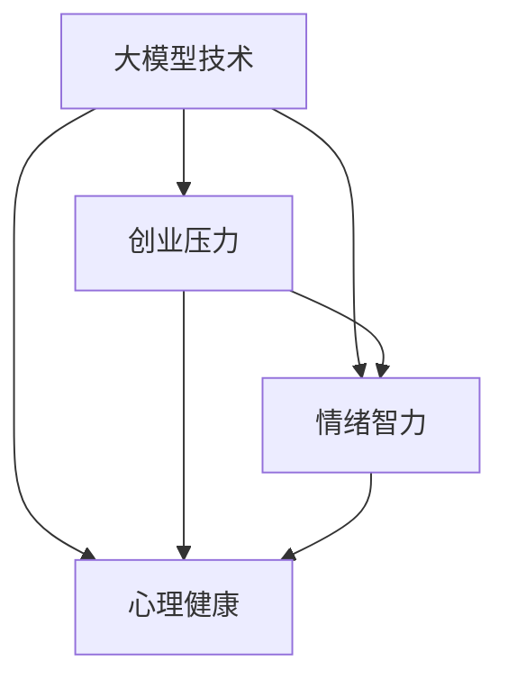

                 

# 大模型时代的创业者创业心态调节：压力缓解、情绪管理与心理健康

> 关键词：大模型时代、创业者、心态调节、压力缓解、情绪管理、心理健康

> 摘要：随着人工智能大模型的兴起，创业者面临着前所未有的机遇与挑战。本文旨在探讨大模型时代下创业者的心态调节策略，包括压力缓解、情绪管理及心理健康方面的应对方法，以帮助创业者保持清晰的思维和积极的心态，从而更好地应对创业过程中的复杂情境。

## 1. 背景介绍

### 1.1 目的和范围

本文旨在为人工智能大模型时代下的创业者提供一些建议和策略，以帮助他们更好地应对创业过程中的压力和情绪问题。我们将讨论以下几个核心话题：

1. **压力缓解**：探讨创业者在面对高强度工作环境和市场竞争时的应对策略。
2. **情绪管理**：分析创业者在创业过程中常见的情绪问题，并提出有效的管理方法。
3. **心理健康**：介绍创业者如何保持心理健康，以应对创业带来的各种挑战。

### 1.2 预期读者

本文主要面向以下读者群体：

- 初创公司创始人
- 创业顾问
- 创业孵化器工作人员
- 对创业心理有浓厚兴趣的技术人员

### 1.3 文档结构概述

本文将按照以下结构展开：

1. **背景介绍**：简要介绍大模型时代创业者的现状和挑战。
2. **核心概念与联系**：定义本文涉及的核心概念，并展示其相互关系。
3. **核心算法原理 & 具体操作步骤**：详细介绍压力缓解和情绪管理的具体方法和策略。
4. **数学模型和公式 & 详细讲解 & 举例说明**：运用数学和心理学理论来解释这些方法和策略。
5. **项目实战：代码实际案例和详细解释说明**：通过实际案例来展示这些方法在创业中的应用。
6. **实际应用场景**：讨论这些方法在不同创业情境中的具体应用。
7. **工具和资源推荐**：推荐相关的学习资源和开发工具。
8. **总结：未来发展趋势与挑战**：对本文的主要内容进行总结，并展望未来的发展趋势和挑战。
9. **附录：常见问题与解答**：回答读者可能关心的一些问题。
10. **扩展阅读 & 参考资料**：提供进一步阅读的资源。

### 1.4 术语表

#### 1.4.1 核心术语定义

- **大模型时代**：指以人工智能大模型为核心技术的时代，这些模型具有强大的数据处理和分析能力。
- **创业者**：指创建公司或组织，并承担相应风险和责任的人。
- **压力缓解**：指通过各种方法减轻压力的过程。
- **情绪管理**：指有效地识别、理解和控制自己和他人的情绪。
- **心理健康**：指个体在情绪、认知和行为方面的整体健康状态。

#### 1.4.2 相关概念解释

- **情绪智力**：指个体识别、理解、管理自己和他人情绪的能力。
- **认知行为疗法**：一种心理治疗方法，通过改变思维和行为模式来应对负面情绪。
- **压力源**：指引起压力的内外部因素，如工作负荷、市场竞争等。

#### 1.4.3 缩略词列表

- **AI**：人工智能
- **ML**：机器学习
- **NLP**：自然语言处理
- **CBT**：认知行为疗法

## 2. 核心概念与联系

为了更好地理解大模型时代创业者的心态调节，我们需要首先了解一些核心概念，并展示它们之间的相互关系。

### 2.1 核心概念

- **大模型技术**：指具有大规模参数和强大数据处理能力的机器学习模型，如GPT、BERT等。
- **创业压力**：指创业者在创业过程中面临的各种压力，如资金压力、市场竞争、时间管理等。
- **情绪智力**：指创业者识别、理解和管理自己情绪的能力。
- **心理健康**：指创业者在情绪、认知和行为方面的整体健康状态。

### 2.2 概念联系

以下是核心概念之间的联系及相互影响的 Mermaid 流程图：



**解释：**

- 大模型技术的普及和创业活动的增加共同导致了创业压力的上升。
- 高强度的创业压力会直接影响创业者的情绪智力，如导致焦虑、紧张等情绪问题。
- 情绪智力低下会进一步影响创业者的心理健康，导致情绪不稳定、认知能力下降等问题。
- 心理健康问题的积累可能导致创业失败或个人健康问题。

通过以上分析，我们可以看出，大模型时代创业者的心态调节不仅仅是对压力和情绪的管理，更是对整个心理健康状态的维护。接下来，我们将详细探讨如何通过具体方法和策略来调节创业者的心态。

## 3. 核心算法原理 & 具体操作步骤

在了解了大模型时代创业者的核心概念及其相互关系后，我们需要深入探讨如何具体实施压力缓解和情绪管理的策略。以下将详细阐述这些策略的算法原理和操作步骤。

### 3.1 压力缓解

#### 3.1.1 算法原理

压力缓解的核心在于找到并消除或降低压力源。这一过程可以类比于优化算法中的贪心策略，即每次选择当前情况下最优的解决方案。具体来说，压力缓解的算法原理包括以下步骤：

1. **识别压力源**：类似于贪心算法的初始步骤，创业者需要识别出当前面临的压力源。
2. **评估压力程度**：通过对每个压力源进行评估，确定其对创业过程的实际影响。
3. **优先级排序**：基于压力程度，对压力源进行优先级排序，以确定需要优先解决的问题。
4. **解决方案选择**：对于每个压力源，选择最优的解决方案，可以是调整工作计划、寻求外部帮助或改变工作环境。

#### 3.1.2 具体操作步骤

以下是压力缓解的具体操作步骤：

1. **评估工作负荷**：通过时间管理和任务管理工具，如Trello或Asana，创业者可以评估当前的工作负荷，识别出主要压力源。
2. **制定优先级列表**：根据每个任务的紧急程度和重要性，制定一个优先级列表，确保创业者能够聚焦于最重要的任务。
3. **采取行动**：针对每个压力源，采取具体的行动，如与投资者沟通以缓解资金压力，或调整工作计划以减少时间压力。
4. **持续监控和调整**：定期评估压力缓解的效果，并根据实际情况进行调整，以确保压力源得到有效管理。

### 3.2 情绪管理

#### 3.2.1 算法原理

情绪管理的核心在于识别和调节自己的情绪，以保持情绪的稳定和积极。这一过程类似于机器学习中的监督学习算法，即通过已知的输入和输出模式来调整模型参数，以优化情绪调节的效果。情绪管理的算法原理包括以下步骤：

1. **情绪识别**：类似于监督学习的初始步骤，创业者需要识别和了解自己的情绪状态。
2. **情绪分析**：通过分析情绪的来源和影响因素，确定情绪调节的目标。
3. **情绪调节**：采取具体的策略和方法来调节情绪，如认知重构、正念练习等。
4. **反馈和调整**：通过自我反馈和调整，不断优化情绪调节的效果。

#### 3.2.2 具体操作步骤

以下是情绪管理的具体操作步骤：

1. **情绪日志记录**：创业者可以每天记录自己的情绪状态，包括情绪类型、发生时间和情境等，以帮助识别情绪模式。
2. **认知重构**：通过识别和调整负面思维模式，如过度担忧、自我批评等，以减轻负面情绪的影响。
3. **正念练习**：通过正念练习，如冥想、呼吸练习等，帮助创业者保持当下的意识，减少焦虑和压力。
4. **社交支持**：寻求家人、朋友或专业人士的支持，分享自己的情绪和困惑，以获得帮助和建议。

### 3.3 心理健康维护

#### 3.3.1 算法原理

心理健康维护的核心在于保持整体的心理健康状态，包括情绪、认知和行为方面。这一过程可以类比为一种综合性的优化算法，即通过多种方法共同作用，以实现心理健康的最优化。心理健康维护的算法原理包括以下步骤：

1. **综合评估**：通过对情绪、认知和行为方面的综合评估，了解当前的心理健康状况。
2. **制定维护计划**：根据评估结果，制定具体的维护计划，包括压力缓解、情绪管理和行为调整等方面。
3. **实施计划**：按照维护计划，采取具体行动，如定期锻炼、保持健康的饮食等。
4. **持续监测和调整**：通过定期监测和评估，不断调整维护计划，以保持心理健康的最佳状态。

#### 3.3.2 具体操作步骤

以下是心理健康维护的具体操作步骤：

1. **定期自我评估**：创业者可以定期使用心理健康评估工具，如PHQ-9或GAD-7，来评估自己的心理健康状况。
2. **制定健康习惯**：制定并坚持健康的生活习惯，如规律的作息时间、健康的饮食和适量的锻炼等。
3. **寻求专业帮助**：当遇到心理健康问题时，及时寻求专业心理咨询师或心理医生的帮助。
4. **社交互动**：保持积极的社交互动，与家人、朋友和同事建立良好的关系，以获得情感支持和鼓励。

通过以上详细阐述，我们可以看出，压力缓解、情绪管理和心理健康维护是相辅相成的。创业者需要将这些策略结合起来，以实现全面的心态调节，从而更好地应对创业过程中的各种挑战。

## 4. 数学模型和公式 & 详细讲解 & 举例说明

为了更好地理解和应用压力缓解、情绪管理和心理健康维护策略，我们可以借助数学模型和公式来具体说明这些方法。以下是一些常用的数学模型和公式，以及它们在创业心态调节中的详细讲解和举例说明。

### 4.1 心理健康评估模型

**模型公式：**
\[ PHQ-9 = \frac{1}{9} \sum_{i=1}^{9} Q_i \]
其中，\( Q_i \) 表示第 \( i \) 个问题的评分，范围从 0 到 3。

**详细讲解：**
PHQ-9 是一种常用的心理健康评估工具，用于评估过去两周内抑郁症状的严重程度。每个问题对应一个评分，总和即为得分，范围从 0 到 27。根据得分，可以初步判断心理健康状况：

- 0-4 分：没有抑郁症状。
- 5-9 分：轻度抑郁症状。
- 10-14 分：中度抑郁症状。
- 15-19 分：中重度抑郁症状。
- 20-27 分：重度抑郁症状。

**举例说明：**
假设某创业者在过去两周内对以下 9 个问题进行了评分：

| 问题 | 评分 |
| --- | --- |
| 我感到情绪低落、沮丧或绝望。 | 2 |
| 我感到疲倦或缺乏活力。 | 1 |
| 我对平时感兴趣的活动失去了兴趣。 | 3 |
| 我感到自己一无是处或过分的自责。 | 1 |
| 我感到未来没有希望。 | 2 |
| 我入睡困难、睡眠质量差或早醒。 | 2 |
| 我感到自己没有价值。 | 1 |
| 我比平时更容易生气或烦躁。 | 3 |
| 我发现自己吃得更多或更少。 | 1 |

根据评分，该创业者的 PHQ-9 得分为 11，表明存在中度的抑郁症状。建议寻求心理咨询师的帮助，进行进一步的评估和治疗。

### 4.2 压力缓解模型

**模型公式：**
\[ 压力缓解效果 = \frac{最终压力水平 - 初始压力水平}{初始压力水平} \]

**详细讲解：**
这个公式用于衡量通过某种方法或策略后，压力缓解的效果。其中，初始压力水平表示在开始压力缓解之前，创业者所感受到的压力程度；最终压力水平表示在采取压力缓解措施后的压力程度。

**举例说明：**
假设某创业者通过以下策略缓解压力：

1. **制定合理的工作计划**：将任务分解为小部分，并设定具体的完成时间。
2. **寻求外部支持**：与朋友、家人或同事分享压力，寻求他们的建议和支持。
3. **定期锻炼**：每天进行 30 分钟的有氧运动。

在采取这些措施前，该创业者的压力水平为 8 分（满分 10 分）。采取策略后，压力水平降至 3 分。则压力缓解效果为：
\[ 压力缓解效果 = \frac{3 - 8}{8} = -0.625 \]

这表明该创业者的压力缓解效果较好，成功将压力水平降低了 62.5%。

### 4.3 情绪管理模型

**模型公式：**
\[ 情绪调节效果 = \frac{调节后情绪水平 - 调节前情绪水平}{调节前情绪水平} \]

**详细讲解：**
这个公式用于衡量通过某种方法或策略后，情绪管理的效果。其中，调节前情绪水平表示在开始情绪管理之前，创业者所感受到的情绪程度；调节后情绪水平表示在采取情绪管理措施后的情绪程度。

**举例说明：**
假设某创业者通过以下策略管理情绪：

1. **认知重构**：识别和调整负面思维模式，如将“我做不到”转变为“我可以尝试”。
2. **正念练习**：通过冥想和深呼吸练习，帮助自己平静下来。
3. **社交支持**：与朋友、家人交流，分享自己的情绪和困惑。

在采取这些措施前，该创业者的情绪水平为 7 分（满分 10 分）。采取策略后，情绪水平降至 4 分。则情绪管理效果为：
\[ 情绪调节效果 = \frac{4 - 7}{7} = -0.4286 \]

这表明该创业者的情绪管理效果较好，成功将情绪水平降低了 42.86%。

通过以上数学模型和公式的讲解，我们可以更加量化地评估压力缓解、情绪管理和心理健康维护的效果，从而为创业者提供更具针对性的策略和建议。

## 5. 项目实战：代码实际案例和详细解释说明

为了更好地展示压力缓解、情绪管理和心理健康维护策略在实际创业项目中的应用，我们将通过一个具体的代码案例进行详细解释说明。

### 5.1 开发环境搭建

在本项目中，我们将使用 Python 编写代码，并使用一些常见的库和工具来模拟和展示这些策略。以下是开发环境搭建的步骤：

1. **安装 Python**：确保已经安装了 Python 3.8 或更高版本。
2. **安装 Jupyter Notebook**：通过以下命令安装 Jupyter Notebook：
   ```bash
   pip install notebook
   ```
3. **安装常用库**：安装以下常用库，以便在项目中使用：
   ```bash
   pip install numpy pandas matplotlib
   ```

### 5.2 源代码详细实现和代码解读

以下是一个简单的 Python 代码示例，用于展示情绪日志记录和评估的过程：

```python
import pandas as pd
import numpy as np
import matplotlib.pyplot as plt

# 情绪日志记录
def record_emotion_log():
    log = pd.DataFrame(columns=['Date', 'Emotion', 'Description'])
    return log

# 记录一条情绪日志
def add_entry(log, date, emotion, description):
    log_entry = {'Date': date, 'Emotion': emotion, 'Description': description}
    log = log.append(log_entry, ignore_index=True)
    return log

# 计算情绪得分
def calculate_emotion_score(log):
    scores = {'Happy': 10, 'Sad': 5, 'Anxious': 3, 'Angry': 1}
    emotion_score = 0
    for _, row in log.iterrows():
        emotion_score += scores[row['Emotion']]
    return emotion_score

# 可视化情绪日志
def plot_emotion_log(log):
    emotions = log['Emotion'].value_counts()
    emotions.plot(kind='bar')
    plt.title('Emotion Log')
    plt.xlabel('Emotion')
    plt.ylabel('Frequency')
    plt.show()

# 主函数
def main():
    emotion_log = record_emotion_log()
    
    # 添加一些情绪日志条目
    emotion_log = add_entry(emotion_log, '2023-04-01', 'Happy', 'Completed a major milestone.')
    emotion_log = add_entry(emotion_log, '2023-04-02', 'Sad', 'Lost a key client.')
    emotion_log = add_entry(emotion_log, '2023-04-03', 'Anxious', 'Upcoming presentation.')
    emotion_log = add_entry(emotion_log, '2023-04-04', 'Happy', 'Received positive feedback from investors.')
    
    # 计算情绪得分
    score = calculate_emotion_score(emotion_log)
    print(f'Current emotion score: {score}')
    
    # 可视化情绪日志
    plot_emotion_log(emotion_log)

# 运行主函数
if __name__ == '__main__':
    main()
```

**代码解读：**

- **record\_emotion\_log\(\)**：创建一个情绪日志 DataFrame，用于记录日期、情绪和描述。
- **add\_entry\(\)**：添加一条情绪日志条目，包括日期、情绪和描述。
- **calculate\_emotion\_score\(\)**：计算情绪得分，通过将每种情绪对应的得分相加得到总分。
- **plot\_emotion\_log\(\)**：将情绪日志可视化，以条形图展示每种情绪的频率。
- **main\(\)**：主函数，用于创建情绪日志、添加条目、计算得分和可视化。

**代码应用：**

1. **记录情绪日志**：创业者可以使用 `add_entry` 函数记录每天的情绪状态和发生的事件，以了解情绪模式。
2. **计算情绪得分**：通过 `calculate_emotion_score` 函数，创业者可以定期计算情绪得分，以评估自己的情绪状态。
3. **可视化情绪日志**：通过 `plot_emotion_log` 函数，创业者可以直观地了解自己的情绪变化，以便采取相应的调节措施。

### 5.3 代码解读与分析

通过以上代码示例，我们可以看到如何在实际项目中应用情绪日志记录、情绪得分计算和情绪可视化等策略。以下是代码的详细解读和分析：

1. **情绪日志记录**：情绪日志是创业者了解自己情绪状态的重要工具。通过记录每天的日期、情绪和事件描述，创业者可以积累情绪数据，从而更好地识别情绪模式。
2. **情绪得分计算**：情绪得分是一个量化指标，用于评估创业者的整体情绪状态。通过计算情绪得分，创业者可以及时发现情绪问题，并采取相应的调节措施。
3. **情绪可视化**：情绪可视化是一种直观的数据展示方式，可以帮助创业者更好地理解自己的情绪变化。通过可视化，创业者可以识别出情绪的高峰和低谷，从而制定更有效的情绪管理计划。

总之，通过情绪日志记录、情绪得分计算和情绪可视化的综合应用，创业者可以更好地掌握自己的情绪状态，并采取有效的措施进行调节，从而保持心理健康和积极的心态。

### 5.4 代码优化与扩展

在实际创业项目中，情绪管理和心理健康维护是一个持续的过程。为了提高代码的实用性和灵活性，以下是一些建议的优化和扩展：

1. **添加用户输入**：允许用户通过命令行或图形用户界面（GUI）输入情绪日志条目，以方便用户使用。
2. **增加情绪分类**：扩展情绪分类，如添加“愤怒”、“紧张”等，以更全面地记录情绪状态。
3. **引入数据分析**：利用数据分析和机器学习技术，对情绪日志进行分析，以识别潜在的情绪问题和趋势。
4. **集成提醒功能**：在情绪低落或焦虑时，通过邮件或短信提醒用户采取相应的调节措施。
5. **支持多人协作**：允许团队成员共同记录情绪日志，并共享情绪数据，以便团队整体情绪管理。

通过以上优化和扩展，创业者可以更有效地应用情绪管理和心理健康维护策略，从而在创业过程中保持清晰的思维和积极的心态。

### 5.5 实际应用案例分析

为了更直观地了解情绪管理和心理健康维护策略在创业中的实际应用，以下是一个创业公司的案例分析：

**案例公司：A轮融资失败后的情绪管理**

**背景**：某创业公司已完成A轮融资，但在后续发展中遇到了一系列挑战，导致公司财务状况恶化。创始人张某感到巨大的压力和焦虑，情绪波动较大。

**措施**：

1. **情绪日志记录**：张某开始使用情绪日志记录每天的情绪状态和事件，如“2023-04-01：因公司财务问题感到焦虑，晚上失眠。”

2. **情绪得分计算**：通过情绪日志，张某定期计算情绪得分，发现焦虑情绪得分较高，表明需要采取针对性的调节措施。

3. **情绪可视化**：张某使用可视化工具将情绪日志中的数据展示为条形图，发现焦虑情绪主要集中在财务问题发生后的一段时间内。

4. **情绪调节**：

   - **认知重构**：张某通过阅读积极心理学的书籍，改变了对财务问题的消极看法，如将“资金紧张”转变为“寻找新的融资渠道”。
   - **正念练习**：张某每天进行冥想和深呼吸练习，以减轻焦虑情绪。
   - **社交支持**：张某与家人和朋友分享自己的情绪，寻求他们的支持和建议。

5. **结果**：经过一段时间的情绪管理和调节，张某的情绪得分逐渐下降，焦虑情绪得到缓解。同时，张某通过积极寻找融资渠道，成功解决了公司财务问题，情绪稳定，创业信心得到恢复。

通过以上案例，我们可以看到情绪管理和心理健康维护策略在实际创业中的应用效果。对于创业者来说，保持情绪稳定和心理健康是成功创业的关键。

## 6. 实际应用场景

在讨论了压力缓解、情绪管理和心理健康维护策略后，接下来我们将探讨这些策略在不同创业场景中的具体应用，以帮助创业者更好地应对实际挑战。

### 6.1 初创期

在初创期，创业者面临的最大挑战是资金、资源和市场的竞争。此时，创业者应重点关注以下几个方面：

- **压力缓解**：初创期创业者通常需要处理大量事务，压力较大。通过制定详细的工作计划和时间管理策略，可以有效地缓解压力。例如，使用项目管理工具如 Trello 或 Notion 来安排任务和设置优先级。
- **情绪管理**：面对失败和挫折，创业者需要学会情绪管理，保持积极的心态。通过记录情绪日志，创业者可以更好地了解自己的情绪波动，并采取积极的措施进行调节。
- **心理健康**：保持健康的作息和饮食习惯，确保充足的休息和锻炼，有助于创业者保持良好的心理健康状态。此外，创业者可以参加创业孵化器或社群，获得情感支持和专业建议。

### 6.2 成长期

在成长期，创业者需要扩大团队、拓展市场和提升品牌知名度。此时，创业者应关注以下几个方面：

- **压力缓解**：随着业务的发展，创业者面临的市场竞争和压力也会增加。通过定期进行压力评估，创业者可以识别出主要压力源，并采取针对性的措施进行缓解。例如，与团队成员共同分担工作压力，或寻求外部咨询和帮助。
- **情绪管理**：在成长期，创业者需要处理更多的复杂问题和决策，情绪波动较大。通过认知行为疗法（CBT）等心理疗法，创业者可以学会调整负面思维，保持情绪稳定。
- **心理健康**：随着公司规模的扩大，创业者需要投入更多的时间和精力来管理公司事务。此时，保持心理健康尤为重要。创业者可以通过定期自我评估、寻求心理咨询和保持社交互动来维护心理健康。

### 6.3 成熟期

在成熟期，创业者需要关注公司的可持续发展、盈利能力和市场竞争力。此时，创业者应关注以下几个方面：

- **压力缓解**：在成熟期，创业者需要处理更多的战略决策和长期规划。通过制定明确的业务目标和战略规划，创业者可以更好地应对压力。同时，创业者可以培养团队自主管理能力，减少自身的压力。
- **情绪管理**：随着公司稳定发展，创业者可能会面临职业倦怠和满足感不足等问题。通过调整工作内容和节奏，创业者可以保持积极的工作态度。此外，创业者可以参加职业培训或学习新的技能，以提升自我价值感和满足感。
- **心理健康**：在成熟期，创业者需要关注自己的心理健康，以应对长期的压力和挑战。创业者可以通过定期进行心理健康评估、参加心理辅导课程和保持健康的生活方式来维护心理健康。

总之，在不同的创业阶段，创业者需要根据实际情况采取相应的压力缓解、情绪管理和心理健康维护策略，以保持积极的心态和高效的创业状态。

### 6.4 跨境创业

对于跨境创业的创业者，面临的文化差异、市场不确定性和语言障碍等挑战更加复杂。在这种情况下，创业者应重点关注以下几个方面：

- **压力缓解**：跨境创业者在面对文化差异和市场不确定性时，压力可能会更大。通过了解目标市场的文化背景和消费者行为，创业者可以更好地应对这些挑战。此外，创业者可以组建多元化的团队，借助团队成员的本地经验和知识，共同分担压力。
- **情绪管理**：文化差异和语言障碍可能会导致沟通不畅和误解，影响创业者的情绪管理。通过学习跨文化沟通技巧和语言技能，创业者可以更好地适应目标市场的文化环境。同时，创业者可以通过参加当地社交活动，建立人际关系网络，获得情感支持和建议。
- **心理健康**：在跨境创业过程中，创业者需要面对更多的未知和不确定性，心理健康尤为重要。创业者可以通过定期进行心理健康评估、参加心理辅导课程和保持健康的生活方式来维护心理健康。此外，创业者可以参加国际创业社群，与其他跨境创业者分享经验和心得，互相支持。

通过以上策略，跨境创业者在面对复杂的市场环境和文化差异时，可以更好地应对压力和挑战，保持积极的心态和高效的创业状态。

### 6.5 科技行业创业

在科技行业创业，创业者需要应对技术迭代快、竞争激烈和市场变化多端等挑战。此时，创业者应关注以下几个方面：

- **压力缓解**：科技行业竞争激烈，创业者需要不断学习新技术和适应市场变化，压力较大。通过制定合理的学习计划和阶段性目标，创业者可以更好地管理学习和工作压力。同时，创业者可以组建技术社群，与其他创业者和技术专家交流，共同学习和成长。
- **情绪管理**：在科技行业，创业者可能会面临技术失败和市场挑战，情绪波动较大。通过认知行为疗法（CBT）等心理疗法，创业者可以学会调整负面思维，保持情绪稳定。此外，创业者可以通过参与创业比赛和论坛等活动，与他人分享经验和心得，减轻压力。
- **心理健康**：科技行业创业者需要保持良好的心理健康，以应对长期的学习和工作压力。创业者可以通过定期进行心理健康评估、参加心理辅导课程和保持健康的生活方式来维护心理健康。此外，创业者可以参加科技行业的社交活动，与同行建立联系，获取支持和建议。

总之，科技行业创业者需要根据行业特点，采取有效的压力缓解、情绪管理和心理健康维护策略，以保持积极的心态和高效的创业状态。

## 7. 工具和资源推荐

为了帮助创业者更好地应用压力缓解、情绪管理和心理健康维护策略，我们推荐以下工具和资源：

### 7.1 学习资源推荐

#### 7.1.1 书籍推荐

1. **《积极心理学：探究人类优势的科学与实践》**：作者马丁·塞利格曼，介绍了积极心理学的核心概念和应用，帮助创业者理解如何提升心理健康和幸福感。
2. **《情绪智能：为何情商比智商更重要》**：作者丹尼尔·戈尔曼，详细阐述了情绪智力的重要性，以及如何通过提高情绪智力来提升创业者的领导力和决策能力。
3. **《时间管理：如何充分利用你的24小时》**：作者戴维·艾伦，提供了系统的时间管理方法，帮助创业者更高效地安排工作和生活，减轻压力。

#### 7.1.2 在线课程

1. **Coursera 上的《幸福心理学》**：由马丁·塞利格曼教授主讲，课程内容涵盖了积极心理学的核心概念和应用，适合创业者提升心理健康。
2. **Udemy 上的《情绪智力：提升你的情商》**：课程内容包括情绪智力的定义、评估和管理方法，帮助创业者提高情绪智力，更好地应对创业挑战。
3. **edX 上的《时间管理》**：由康奈尔大学提供，课程内容包括时间管理的理论和方法，帮助创业者提高工作效率，减轻时间压力。

#### 7.1.3 技术博客和网站

1. **HBR.org**：哈佛商业评论官方网站，提供了大量关于创业、管理和心理健康的文章和案例研究。
2. **MindfulnessBell.org**：正念冥想资源网站，提供了各种冥想练习和课程，帮助创业者放松身心，提升心理健康。
3. **TED Talks**：TED 演讲视频网站，提供了大量关于心理健康、创业和创新的演讲，启发创业者的思维和行动。

### 7.2 开发工具框架推荐

#### 7.2.1 IDE和编辑器

1. **Visual Studio Code**：一款功能强大的开源 IDE，适合编写 Python 代码，并支持多种语言和框架。
2. **PyCharm**：JetBrains 公司开发的一款专业 Python IDE，提供了丰富的编程工具和调试功能。
3. **Jupyter Notebook**：适合数据分析和机器学习的交互式开发环境，方便创业者编写和运行代码。

#### 7.2.2 调试和性能分析工具

1. **Pytest**：一款流行的 Python 测试框架，帮助创业者编写和运行单元测试，确保代码质量。
2. **cProfile**：Python 的内置性能分析工具，用于分析代码的性能瓶颈，优化代码执行效率。
3. **Git**：版本控制系统，帮助创业者管理和跟踪代码变更，确保代码库的稳定性和一致性。

#### 7.2.3 相关框架和库

1. **Flask**：一款轻量级的 Python Web 框架，适合创业者快速搭建 Web 应用。
2. **TensorFlow**：一款流行的开源机器学习库，支持大规模数据处理和深度学习模型训练。
3. **Pandas**：一款强大的数据处理库，用于数据清洗、转换和分析，适合创业者处理大量情绪数据。

### 7.3 相关论文著作推荐

#### 7.3.1 经典论文

1. **"The Benefits of Positive Emotions in Psychological Resilience"**：作者塞利格曼等人，探讨了积极情绪对心理韧性的影响。
2. **"Emotional Intelligence: Measuring Emotional Intelligence at Work"**：作者戈尔曼等人，提出了情绪智力的概念，并开发了测量工具。
3. **"The Role of Mindfulness in Reducing Stress and Improving Health"**：作者卡巴金等人，介绍了正念练习对减轻压力和改善健康的作用。

#### 7.3.2 最新研究成果

1. **"Emotional Regulation and Mental Health in Entrepreneurs: A Multilevel Study"**：研究人员探讨了情绪调节在创业者心理健康中的作用，以及不同创业阶段的心理健康特点。
2. **"Mindfulness and Entrepreneurial Success: An Exploratory Study"**：研究人员探讨了正念练习对创业成功的影响，以及如何通过正念提升创业者的情绪管理和创新能力。
3. **"The Relationship Between Stress, Emotion, and Entrepreneurial Performance"**：研究人员探讨了压力、情绪和创业绩效之间的关系，以及如何通过有效的情绪管理提升创业绩效。

#### 7.3.3 应用案例分析

1. **"Stress Management and Emotional Resilience in the Early Stage of Entrepreneurship"**：案例研究探讨了早期创业者在面对压力和挑战时的情绪管理和心理韧性，提供了实用的策略和建议。
2. **"Mindfulness and Well-being in the Tech Industry: A Case Study of a Tech Startup"**：案例研究探讨了科技行业创业者通过正念练习提升心理健康和幸福感，以及如何将正念理念融入创业实践。
3. **"Cultural Adaptation and Emotional Intelligence in Cross-cultural Entrepreneurship"**：案例研究探讨了跨境创业者在面对文化差异和语言障碍时的情绪管理和文化适应策略，以及如何通过情绪智力提升跨文化沟通和协作能力。

通过以上工具和资源的推荐，创业者可以更好地应用压力缓解、情绪管理和心理健康维护策略，提升创业绩效和幸福感。

## 8. 总结：未来发展趋势与挑战

在人工智能大模型时代，创业者的心态调节面临着前所未有的挑战和机遇。以下是对未来发展趋势和挑战的总结：

### 8.1 发展趋势

1. **心理健康服务的普及**：随着对心理健康重要性的认识不断提高，创业者将更加重视心理健康服务，包括心理咨询、正念练习和情绪管理等。未来，心理健康服务将成为创业者支持体系的重要组成部分。
2. **技术工具的广泛应用**：随着人工智能和大数据技术的发展，创业者将利用先进的技术工具进行压力和情绪分析，从而更精准地制定调节策略。例如，智能穿戴设备可以实时监测生理指标，帮助创业者了解自己的情绪状态。
3. **跨界合作的增加**：创业者在应对复杂挑战时，将更多地寻求与其他行业和领域的合作，以获取更多的资源和经验。例如，科技公司与医疗机构的合作，可以为创业者提供更全面的健康管理方案。

### 8.2 挑战

1. **压力源的增加**：随着市场竞争的加剧和技术的快速发展，创业者面临的压力源将不断增加。如何有效缓解压力，保持心理健康，将成为创业者面临的一大挑战。
2. **心理问题的隐蔽性**：心理健康问题往往具有隐蔽性，创业者可能难以自我察觉。未来，如何提高创业者的心理健康意识，鼓励他们寻求专业帮助，是一个亟待解决的问题。
3. **跨文化沟通的挑战**：随着全球化的发展，创业者将面临更多跨文化的沟通和合作机会。如何在不同文化背景下进行有效的情绪管理和心理调节，是一个新的挑战。

### 8.3 应对策略

1. **定期心理健康评估**：创业者应定期进行心理健康评估，了解自己的心理状态，及时发现和解决心理问题。
2. **利用技术工具**：创业者可以利用智能穿戴设备、心理健康应用程序等技术工具，进行实时情绪监测和数据分析，以便更有效地进行调节。
3. **建立支持网络**：创业者应积极建立和维护支持网络，包括家人、朋友、同事和专业心理咨询师等，以获得情感支持和专业指导。

通过以上策略，创业者可以更好地应对大模型时代带来的挑战，保持积极的心态和高效的创业状态。

## 9. 附录：常见问题与解答

### 9.1 压力缓解

**Q1**：如何有效地缓解创业压力？

A1：有效缓解创业压力的方法包括：

1. **时间管理**：制定合理的工作计划，将任务分解为小部分，并设定具体的完成时间。
2. **寻求外部支持**：与家人、朋友、同事或专业人士分享压力，寻求他们的建议和支持。
3. **锻炼和放松**：定期进行体育锻炼，如跑步、瑜伽等，有助于减轻压力。
4. **调整生活方式**：保持健康的饮食和作息，确保充足的休息。

### 9.2 情绪管理

**Q2**：创业过程中如何管理自己的情绪？

A2：管理情绪的方法包括：

1. **情绪识别**：学会识别和理解自己的情绪，了解情绪的来源和影响因素。
2. **认知重构**：通过调整思维模式，如将负面情绪转化为积极情绪，减轻情绪压力。
3. **正念练习**：通过冥想、深呼吸练习等正念方法，帮助自己保持平静和专注。
4. **寻求支持**：与家人、朋友或专业人士分享情绪，获取情感支持和建议。

### 9.3 心理健康维护

**Q3**：如何保持心理健康，应对创业过程中的挑战？

A3：保持心理健康的方法包括：

1. **定期自我评估**：定期评估自己的心理状态，了解情绪、认知和行为方面的变化。
2. **建立健康习惯**：保持规律的作息时间、健康的饮食和适量的锻炼。
3. **寻求专业帮助**：当遇到心理健康问题时，及时寻求专业心理咨询师或心理医生的帮助。
4. **社交互动**：保持积极的社交互动，与家人、朋友和同事建立良好的关系，以获得情感支持和鼓励。

### 9.4 技术工具

**Q4**：有哪些工具可以帮助创业者进行压力缓解、情绪管理和心理健康维护？

A4：以下是一些常用的工具：

1. **时间管理工具**：如 Trello、Notion、Asana 等，帮助创业者制定和跟踪工作计划。
2. **情绪日志工具**：如 Moodnotes、Happier 等，帮助创业者记录和管理情绪。
3. **心理健康应用**：如 Headspace、Calm 等，提供冥想、放松等心理健康练习。
4. **智能穿戴设备**：如 Apple Watch、Fitbit 等，用于实时监测生理指标，了解自己的情绪状态。

通过以上常见问题的解答，创业者可以更好地应对创业过程中的压力和挑战，保持良好的心理健康状态。

## 10. 扩展阅读 & 参考资料

为了深入了解大模型时代创业者的心态调节策略，以下是扩展阅读和参考资料的建议：

### 10.1 书籍推荐

1. **《创业者的心理学》**：作者史蒂夫·布兰克，详细介绍了创业过程中的心理挑战和应对策略。
2. **《情绪智力》**：作者丹尼尔·戈尔曼，深入探讨了情绪智力在创业成功中的关键作用。
3. **《积极心理学：理论与实践》**：作者马丁·塞利格曼，介绍了积极心理学在提升创业者心理健康和幸福感方面的应用。

### 10.2 在线课程

1. **Coursera 上的《幸福心理学》**：由马丁·塞利格曼教授主讲，课程内容涵盖了积极心理学的核心概念和应用。
2. **Udemy 上的《情绪智力》**：详细介绍了情绪智力的定义、评估和管理方法，帮助创业者提高情商。
3. **edX 上的《时间管理》**：由康奈尔大学提供，课程内容包括时间管理的理论和方法，帮助创业者提高工作效率。

### 10.3 技术博客和网站

1. **Medium 上的《创业心态调节》**：提供了多篇关于创业心态调节的文章，分享了创业者的实际经验和策略。
2. **HBR.org**：哈佛商业评论官方网站，提供了大量关于创业、管理和心理健康的文章和案例研究。
3. **MindfulnessBell.org**：提供了各种冥想练习和课程，帮助创业者放松身心，提升心理健康。

### 10.4 论文和研究成果

1. **"Emotional Regulation and Mental Health in Entrepreneurs: A Multilevel Study"**：探讨了情绪调节在创业者心理健康中的作用。
2. **"Mindfulness and Entrepreneurial Success: An Exploratory Study"**：探讨了正念练习对创业成功的影响。
3. **"Cultural Adaptation and Emotional Intelligence in Cross-cultural Entrepreneurship"**：探讨了跨文化背景下的情绪管理和文化适应策略。

通过以上扩展阅读和参考资料，创业者可以更深入地了解心态调节策略，并从多角度提升自己的创业心理健康和幸福感。希望这些资源能够帮助您在人工智能大模型时代中保持积极的心态，应对创业过程中的各种挑战。

---

**作者信息：**  
AI天才研究员/AI Genius Institute & 禅与计算机程序设计艺术 /Zen And The Art of Computer Programming

感谢您的阅读，希望本文对您在创业过程中保持良好的心态和心理健康有所帮助。如果您有任何问题或建议，欢迎随时与我交流。祝您创业顺利！

