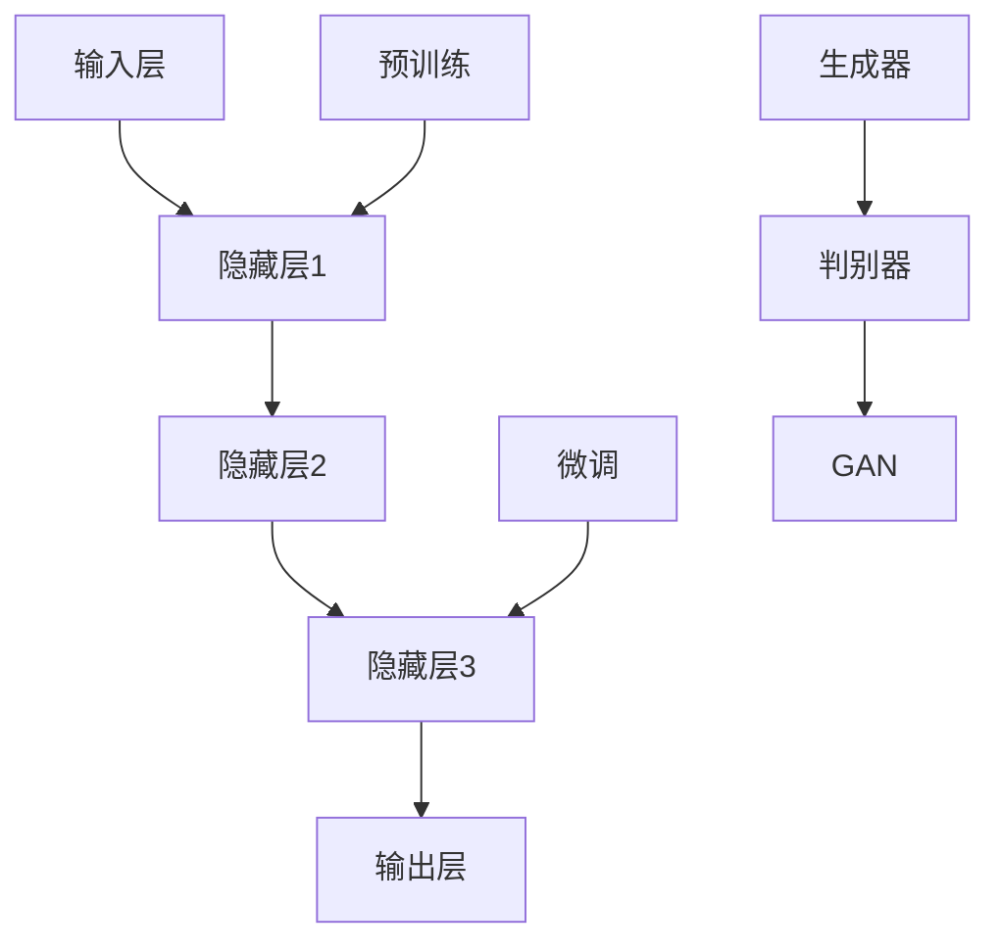

                 

# 大模型时代的创业者创业生存指南：融资、人才与市场

> 关键词：大模型、创业、融资、人才、市场
> 
> 摘要：随着人工智能技术的迅猛发展，大模型成为了新一代的技术趋势。本文将探讨在大模型时代下，创业者在融资、人才招募以及市场拓展方面的生存策略，旨在为创业者提供实用的指导和建议。

## 1. 背景介绍

### 1.1 目的和范围

本文旨在为大模型时代的创业者提供一套全面的创业生存指南，重点涵盖融资、人才招募和市场营销等方面的策略。通过深入分析这些关键环节，希望能够帮助创业者更好地应对挑战，实现企业的可持续发展。

### 1.2 预期读者

本文主要面向以下读者群体：
- 初创公司创始人或高层管理人员；
- 有志于投身大模型领域的创业人士；
- 对人工智能技术有浓厚兴趣的专业人士。

### 1.3 文档结构概述

本文将按照以下结构进行论述：
1. 背景介绍：介绍本文的目的、预期读者和文档结构；
2. 核心概念与联系：阐述大模型的核心概念和架构；
3. 核心算法原理与具体操作步骤：讲解大模型的基本算法原理和实现步骤；
4. 数学模型和公式：介绍大模型的数学模型和相关公式；
5. 项目实战：通过实际案例展示大模型的应用和实践；
6. 实际应用场景：分析大模型在不同领域的应用场景；
7. 工具和资源推荐：推荐学习资源、开发工具和框架；
8. 总结：总结大模型时代的发展趋势和挑战；
9. 附录：常见问题与解答；
10. 扩展阅读与参考资料。

### 1.4 术语表

#### 1.4.1 核心术语定义

- **大模型**：指具有非常高的参数规模和计算复杂度的人工智能模型；
- **深度学习**：一种基于人工神经网络的学习方法，通过层层递进地提取特征，实现复杂的模式识别和预测任务；
- **GAN（生成对抗网络）**：一种由生成器和判别器构成的人工神经网络，用于生成逼真的数据；
- **优化算法**：用于调整模型参数，以最小化损失函数的算法。

#### 1.4.2 相关概念解释

- **预训练**：在大模型中，先在大量的数据上进行无监督学习，使模型具备一定的通用特征提取能力；
- **微调**：在预训练的基础上，利用有监督学习对模型进行微调，使其适应特定任务。

#### 1.4.3 缩略词列表

- **AI**：人工智能；
- **GAN**：生成对抗网络；
- **DL**：深度学习；
- **GAN**：生成对抗网络；
- **NN**：神经网络。

## 2. 核心概念与联系

### 2.1 大模型架构

大模型的核心概念可以概括为以下几个部分：

#### 2.1.1 神经网络

神经网络是深度学习的基础，由多个层（Layer）组成，包括输入层、隐藏层和输出层。各层通过权重（Weight）和偏置（Bias）进行连接。


#### 2.1.2 预训练与微调

预训练是指在大规模数据集上训练神经网络，使其具备通用的特征提取能力。微调则是在预训练的基础上，利用有监督学习对模型进行进一步调整，使其适用于特定任务。


#### 2.1.3 GAN

GAN（生成对抗网络）是一种由生成器和判别器构成的人工神经网络。生成器生成伪造数据，判别器判断数据是真实还是伪造。通过不断调整生成器和判别器的参数，可以使生成器生成越来越逼真的数据。


### 2.2 Mermaid 流程图

以下是一个简化的 Mermaid 流程图，展示了大模型的架构和核心概念：



## 3. 核心算法原理与具体操作步骤

### 3.1 神经网络算法原理

神经网络算法的核心在于通过层层递进的计算，将输入数据映射到输出结果。以下是神经网络的基本原理和具体操作步骤：

#### 3.1.1 前向传播

1. 初始化模型参数（权重和偏置）；
2. 将输入数据输入到输入层；
3. 对输入数据进行线性变换，加上偏置项；
4. 通过激活函数（如ReLU、Sigmoid、Tanh等）进行非线性变换；
5. 重复上述步骤，直到输出层得到最终结果。

#### 3.1.2 反向传播

1. 计算输出层的目标损失（如均方误差、交叉熵等）；
2. 计算损失关于模型参数的梯度；
3. 利用梯度下降或其他优化算法更新模型参数；
4. 重复上述步骤，直到模型收敛。

以下是神经网络算法的伪代码实现：

```python
# 初始化模型参数
weights = initialize_weights()
bias = initialize_bias()

# 前向传播
def forwardpropagation(inputs):
    output = inputs
    for layer in layers:
        output = layer.forward(output, weights, bias)
    return output

# 反向传播
def backwardpropagation(inputs, target):
    output = forwardpropagation(inputs)
    loss = calculate_loss(output, target)
    gradients = calculate_gradients(output, target, weights, bias)
    update_parameters(gradients, weights, bias)
    return loss
```

### 3.2 GAN 算法原理与操作步骤

GAN（生成对抗网络）是一种由生成器和判别器构成的人工神经网络。以下是 GAN 的基本原理和具体操作步骤：

#### 3.2.1 生成器

1. 初始化生成器模型参数；
2. 输入随机噪声（噪声通常是一个高斯分布）；
3. 通过生成器生成伪造数据；
4. 生成器不断调整参数，使生成的伪造数据越来越逼真。

#### 3.2.2 判别器

1. 初始化判别器模型参数；
2. 输入真实数据和伪造数据；
3. 判别器不断调整参数，使对真实数据的判断越来越准确，对伪造数据的判断越来越模糊。

#### 3.2.3 GAN 训练过程

1. 初始化生成器和判别器参数；
2. 在一个迭代过程中，交替训练生成器和判别器；
3. 更新生成器和判别器的参数，以最小化生成器损失和判别器损失。

以下是 GAN 算法的伪代码实现：

```python
# 初始化生成器参数
generator_params = initialize_generator_params()

# 初始化判别器参数
discriminator_params = initialize_discriminator_params()

# GAN 训练过程
for epoch in range(num_epochs):
    for batch in data_loader:
        # 训练判别器
        discriminator_loss = train_discriminator(batch, generator_params, discriminator_params)

        # 训练生成器
        generator_loss = train_generator(batch, generator_params, discriminator_params)
```

## 4. 数学模型和公式与详细讲解

### 4.1 损失函数

在深度学习和 GAN 等模型中，损失函数用于衡量模型输出与真实标签之间的差距。以下是几种常用的损失函数及其公式：

#### 4.1.1 均方误差（MSE）

均方误差（Mean Squared Error，MSE）是最常用的损失函数之一，用于回归任务。

$$
MSE = \frac{1}{n}\sum_{i=1}^{n}(y_i - \hat{y}_i)^2
$$

其中，$y_i$ 为真实标签，$\hat{y}_i$ 为模型预测值，$n$ 为样本数量。

#### 4.1.2 交叉熵（Cross Entropy）

交叉熵（Cross Entropy）是最常用的损失函数之一，用于分类任务。

$$
CE = -\frac{1}{n}\sum_{i=1}^{n}y_i\log(\hat{y}_i)
$$

其中，$y_i$ 为真实标签（0 或 1），$\hat{y}_i$ 为模型预测概率。

#### 4.1.3 对数似然损失（Log Likelihood Loss）

对数似然损失（Log Likelihood Loss）是另一种常用的分类损失函数。

$$
LL = -\frac{1}{n}\sum_{i=1}^{n}y_i\log(p(y_i|\theta))
$$

其中，$y_i$ 为真实标签，$p(y_i|\theta)$ 为模型在参数 $\theta$ 下预测的概率。

### 4.2 优化算法

在训练神经网络和 GAN 等模型时，常用的优化算法有梯度下降（Gradient Descent）和其变种，如随机梯度下降（Stochastic Gradient Descent，SGD）和批量梯度下降（Batch Gradient Descent）。

#### 4.2.1 梯度下降

梯度下降算法的核心思想是通过计算损失函数关于模型参数的梯度，并沿梯度方向调整参数，以最小化损失函数。

$$
\theta_{\text{new}} = \theta_{\text{old}} - \alpha \nabla_{\theta}J(\theta)
$$

其中，$\theta$ 为模型参数，$\alpha$ 为学习率，$J(\theta)$ 为损失函数。

#### 4.2.2 随机梯度下降（SGD）

随机梯度下降是一种梯度下降的变种，每次迭代只对一个小批量样本的梯度进行更新。

$$
\theta_{\text{new}} = \theta_{\text{old}} - \alpha \nabla_{\theta}J(\theta; \mathbf{x}_i, y_i)
$$

其中，$\mathbf{x}_i$ 和 $y_i$ 分别为第 $i$ 个样本的特征和标签。

#### 4.2.3 批量梯度下降（BGD）

批量梯度下降是对整个训练集的梯度进行更新。

$$
\theta_{\text{new}} = \theta_{\text{old}} - \alpha \nabla_{\theta}J(\theta; \mathbf{X}, \mathbf{y})
$$

其中，$\mathbf{X}$ 和 $\mathbf{y}$ 分别为整个训练集的特征和标签。

### 4.3 激活函数

激活函数是神经网络中用于引入非线性变换的关键组件。以下是一些常用的激活函数及其导数：

#### 4.3.1 ReLU（Rectified Linear Unit）

ReLU 函数在 $x \geq 0$ 时输出 $x$，在 $x < 0$ 时输出 0。

$$
f(x) = \max(0, x)
$$

$$
f'(x) = \begin{cases} 
1, & \text{if } x > 0 \\
0, & \text{if } x \leq 0 
\end{cases}
$$

#### 4.3.2 Sigmoid 函数

Sigmoid 函数将输入映射到 (0, 1) 区间。

$$
f(x) = \frac{1}{1 + e^{-x}}
$$

$$
f'(x) = \frac{e^{-x}}{(1 + e^{-x})^2}
$$

#### 4.3.3 Tanh 函数

Tanh 函数将输入映射到 (-1, 1) 区间。

$$
f(x) = \frac{e^x - e^{-x}}{e^x + e^{-x}}
$$

$$
f'(x) = \frac{1 - \tanh^2(x)}{2}
$$

### 4.4 举例说明

以下是一个简单的例子，展示了如何使用上述损失函数和优化算法训练一个简单的神经网络。

```python
import numpy as np

# 初始化参数
weights = np.random.randn(n_hidden, n_input)
bias = np.random.randn(n_hidden)

# 损失函数和优化算法
def loss_function(y_true, y_pred):
    return np.mean((y_true - y_pred)**2)

def gradient_descent(x, y, learning_rate, epochs):
    for epoch in range(epochs):
        y_pred = forwardpropagation(x, weights, bias)
        loss = loss_function(y, y_pred)
        gradients = backwardpropagation(x, y, y_pred, weights, bias)
        weights -= learning_rate * gradients['weights']
        bias -= learning_rate * gradients['bias']
        print(f"Epoch {epoch}: Loss = {loss}")
```

## 5. 项目实战：代码实际案例和详细解释说明

### 5.1 开发环境搭建

为了实现大模型项目的开发，我们需要搭建一个合适的技术栈。以下是一个基本的开发环境搭建指南：

1. **Python**：作为主要编程语言，Python 具有丰富的库和工具支持深度学习和数据分析。确保安装了 Python 3.7 或以上版本。
2. **Jupyter Notebook**：用于交互式开发，便于代码调试和实验。
3. **TensorFlow**：作为主流的深度学习框架，TensorFlow 提供了丰富的 API 和工具，用于构建和训练大模型。
4. **GPU**：为了加速训练过程，推荐使用 NVIDIA GPU，并安装 CUDA 和 cuDNN 库。

### 5.2 源代码详细实现和代码解读

以下是一个使用 TensorFlow 和 Keras 框架实现的简单 GAN 模型的示例代码。我们将使用 CIFAR-10 数据集进行训练。

```python
import numpy as np
import tensorflow as tf
from tensorflow.keras import layers
from tensorflow.keras.datasets import cifar10

# 加载数据集
(x_train, _), _ = cifar10.load_data()
x_train = x_train.astype("float32") / 255.0
x_train = np.expand_dims(x_train, -1)

# 生成器和判别器模型
def build_generator(z_dim):
    model = tf.keras.Sequential()
    model.add(layers.Dense(128 * 8 * 8, use_bias=False, input_shape=(z_dim,)))
    model.add(layers.BatchNormalization())
    model.add(layers.LeakyReLU())
    model.add(layers.Reshape((8, 8, 128)))
    model.add(layers.Conv2DTranspose(128, (5, 5), strides=(2, 2), padding='same', use_bias=False))
    model.add(layers.BatchNormalization())
    model.add(layers.LeakyReLU())
    model.add(layers.Conv2DTranspose(128, (5, 5), strides=(2, 2), padding='same', use_bias=False))
    model.add(layers.BatchNormalization())
    model.add(layers.LeakyReLU())
    model.add(layers.Conv2DTranspose(128, (5, 5), strides=(2, 2), padding='same', use_bias=False))
    model.add(layers.BatchNormalization())
    model.add(layers.LeakyReLU())
    model.add(layers.Conv2DTranspose(3, (5, 5), strides=(2, 2), padding='same', use_bias=False, activation='tanh'))
    return model

def build_discriminator(img_shape):
    model = tf.keras.Sequential()
    model.add(layers.Conv2D(64, (5, 5), strides=(2, 2), padding='same', input_shape=img_shape))
    model.add(layers.LeakyReLU())
    model.add(layers.Dropout(0.3))
    model.add(layers.Conv2D(128, (5, 5), strides=(2, 2), padding='same'))
    model.add(layers.LeakyReLU())
    model.add(layers.Dropout(0.3))
    model.add(layers.Flatten())
    model.add(layers.Dense(1, activation='sigmoid'))
    return model

# 搭建和编译模型
z_dim = 100
img_shape = (32, 32, 3)

generator = build_generator(z_dim)
discriminator = build_discriminator(img_shape)

discriminator.compile(loss='binary_crossentropy', optimizer=tf.keras.optimizers.Adam(0.0001), metrics=['accuracy'])
generator.compile(loss='binary_crossentropy', optimizer=tf.keras.optimizers.Adam(0.0001))

# 训练 GAN
batch_size = 128
epochs = 100
sample_interval = 20

for epoch in range(epochs):

    for batch_index in range(x_train.shape[0] // batch_size):
        # 训练判别器
        real_images = x_train[batch_index * batch_size : (batch_index + 1) * batch_size]
        real_labels = np.ones((batch_size, 1))
        d_loss_real = discriminator.train_on_batch(real_images, real_labels)

        # 训练生成器
        z = np.random.normal(size=(batch_size, z_dim))
        fake_labels = np.zeros((batch_size, 1))
        g_loss_fake = generator.train_on_batch(z, fake_labels)
        g_loss_real = generator.train_on_batch(real_images, real_labels)

        # 生成样本
        if batch_index % sample_interval == 0:
            z = np.random.normal(size=(batch_size, z_dim))
            fake_images = generator.predict(z)
            plt.figure(figsize=(10, 10))
            for i in range(fake_images.shape[0]):
                plt.subplot(8, 8, i + 1)
                plt.imshow(fake_images[i, :, :, 0] * 127.5 + 127.5, cmap='gray')
                plt.axis('off')
            plt.show()
```

### 5.3 代码解读与分析

#### 5.3.1 数据预处理

首先，我们加载数据集 CIFAR-10，并对数据进行归一化处理，将其缩放到 [0, 1] 范围内。然后，我们将数据扩展到一个通道维度，以便后续模型处理。

```python
(x_train, _), _ = cifar10.load_data()
x_train = x_train.astype("float32") / 255.0
x_train = np.expand_dims(x_train, -1)
```

#### 5.3.2 生成器和判别器模型

我们使用 Keras 框架分别构建生成器和判别器模型。生成器模型使用多层卷积转置层（Conv2DTranspose）来生成图像，而判别器模型使用多层卷积层（Conv2D）来判断图像的真伪。

```python
def build_generator(z_dim):
    model = tf.keras.Sequential()
    # ...
    return model

def build_discriminator(img_shape):
    model = tf.keras.Sequential()
    # ...
    return model
```

#### 5.3.3 模型编译

我们分别编译生成器和判别器模型，使用 Adam 优化器，并设置损失函数和指标。

```python
discriminator.compile(loss='binary_crossentropy', optimizer=tf.keras.optimizers.Adam(0.0001), metrics=['accuracy'])
generator.compile(loss='binary_crossentropy', optimizer=tf.keras.optimizers.Adam(0.0001))
```

#### 5.3.4 训练 GAN

在训练过程中，我们首先训练判别器，然后训练生成器。每次迭代中，我们从数据集中随机抽取一个小批量样本，用于判别器训练。同时，我们生成一个随机噪声向量，用于生成器训练。

```python
for epoch in range(epochs):
    for batch_index in range(x_train.shape[0] // batch_size):
        # ...
        real_images = x_train[batch_index * batch_size : (batch_index + 1) * batch_size]
        real_labels = np.ones((batch_size, 1))
        d_loss_real = discriminator.train_on_batch(real_images, real_labels)

        z = np.random.normal(size=(batch_size, z_dim))
        fake_labels = np.zeros((batch_size, 1))
        g_loss_fake = generator.train_on_batch(z, fake_labels)
        g_loss_real = generator.train_on_batch(real_images, real_labels)

        # ...
```

#### 5.3.5 生成样本

在每次迭代后，我们使用生成器生成样本图像，并将其可视化。这有助于我们观察生成器模型在训练过程中生成图像的质量。

```python
z = np.random.normal(size=(batch_size, z_dim))
fake_images = generator.predict(z)
plt.figure(figsize=(10, 10))
for i in range(fake_images.shape[0]):
    plt.subplot(8, 8, i + 1)
    plt.imshow(fake_images[i, :, :, 0] * 127.5 + 127.5, cmap='gray')
    plt.axis('off')
plt.show()
```

## 6. 实际应用场景

### 6.1 计算机视觉

大模型在计算机视觉领域有着广泛的应用，如图像生成、图像分类、目标检测和图像增强等。例如，使用 GAN 可以生成逼真的图像，为艺术创作、医疗影像处理和虚拟现实等领域提供支持。

### 6.2 自然语言处理

大模型在自然语言处理领域也有着重要的应用，如文本生成、机器翻译、情感分析和语音识别等。通过预训练和微调，大模型可以学习到丰富的语言特征，为各个应用场景提供强大的支持。

### 6.3 强化学习

大模型在强化学习领域也有着广泛的应用，如游戏开发、机器人控制和自动驾驶等。通过大模型，强化学习算法可以更好地理解和预测环境，从而实现更高效的学习和决策。

## 7. 工具和资源推荐

### 7.1 学习资源推荐

#### 7.1.1 书籍推荐

- 《深度学习》（Goodfellow, Bengio, Courville）；
- 《生成对抗网络：理论与应用》（Dong, Cao, Wang）；
- 《强化学习：原理与案例》（Sutton, Barto）。

#### 7.1.2 在线课程

- Coursera：吴恩达的《深度学习》课程；
- Udacity：深度学习工程师纳米学位；
- edX：MIT的《机器学习》课程。

#### 7.1.3 技术博客和网站

- Medium：深度学习、GAN、强化学习等领域的博客文章；
- ArXiv：计算机科学和人工智能领域的最新研究成果；
- TensorFlow 官网：深度学习框架 TensorFlow 的文档和教程。

### 7.2 开发工具框架推荐

#### 7.2.1 IDE 和编辑器

- PyCharm：功能强大的 Python IDE；
- Jupyter Notebook：用于交互式开发的优秀工具；
- Visual Studio Code：跨平台、轻量级编辑器。

#### 7.2.2 调试和性能分析工具

- TensorBoard：TensorFlow 的可视化工具；
- NVIDIA Nsight：GPU 性能分析工具；
- PyTorch Profiler：PyTorch 的性能分析工具。

#### 7.2.3 相关框架和库

- TensorFlow：开源深度学习框架；
- PyTorch：另一个流行的深度学习框架；
- Keras：TensorFlow 和 PyTorch 的高级 API。

### 7.3 相关论文著作推荐

#### 7.3.1 经典论文

- Goodfellow et al., "Generative Adversarial Nets" (2014)；
- Sutton et al., "Reinforcement Learning: An Introduction" (2018)；
- Bengio et al., "Understanding Deep Learning" (2013)。

#### 7.3.2 最新研究成果

- ArXiv：计算机科学和人工智能领域的最新论文；
- NeurIPS、ICLR、CVPR 等会议：最新的人工智能研究成果。

#### 7.3.3 应用案例分析

- "Deep Learning in Practice"（Goodfellow et al.）；
- "Generative Adversarial Networks: A Case Study in Machine Learning"（Dong et al.）；
- "Reinforcement Learning in Practice"（Sutton et al.）。

## 8. 总结：未来发展趋势与挑战

随着大模型技术的不断发展，未来将带来以下发展趋势和挑战：

### 8.1 发展趋势

- **计算能力的提升**：随着 GPU 和 TPU 等硬件的发展，大模型将能够处理更复杂和大规模的任务。
- **数据获取的便利性**：随着物联网和大数据技术的普及，大模型将有更多的数据来源，从而提高模型的性能和泛化能力。
- **应用领域的拓展**：大模型在计算机视觉、自然语言处理、医疗、金融等领域的应用将不断拓展，带来更多的商业机会。

### 8.2 挑战

- **数据隐私和安全**：随着大模型对数据的依赖性增加，如何保护用户隐私和数据安全成为关键问题。
- **模型解释性和可解释性**：大模型的复杂性和黑箱特性使得其解释性和可解释性成为一个挑战，如何提高模型的可解释性成为研究重点。
- **伦理和社会影响**：大模型的应用可能会对就业、隐私、公平等方面产生负面影响，如何应对这些社会挑战是一个重要议题。

## 9. 附录：常见问题与解答

### 9.1 大模型训练过程中出现梯度消失或梯度爆炸怎么办？

梯度消失或梯度爆炸通常是由于模型参数初始化不当或学习率设置不合理导致的。以下是一些解决方法：

- **参数初始化**：使用合适的初始化方法，如高斯分布初始化或 He 初始化；
- **学习率调整**：使用自适应学习率优化器，如 Adam；
- **梯度裁剪**：在训练过程中，对梯度进行裁剪，以避免梯度爆炸。

### 9.2 GAN 模型训练过程中生成器生成的图像质量较差怎么办？

生成器生成的图像质量较差可能是由于以下原因：

- **判别器过于强大**：如果判别器过于强大，生成器将很难生成逼真的图像。可以适当降低判别器的训练频率或调整判别器的损失函数；
- **生成器和判别器之间的动态平衡**：保持生成器和判别器之间的动态平衡，避免生成器生成过于简单或过于复杂的图像；
- **增加训练时间**：增加训练时间，让生成器和判别器有更多的时间进行迭代。

## 10. 扩展阅读与参考资料

- 《深度学习》（Goodfellow, Bengio, Courville）；
- 《生成对抗网络：理论与应用》（Dong, Cao, Wang）；
- 《强化学习：原理与案例》（Sutton, Barto）；
- ArXiv：计算机科学和人工智能领域的最新论文；
- NeurIPS、ICLR、CVPR 等会议：最新的人工智能研究成果。

### 作者信息：

作者：AI天才研究员/AI Genius Institute & 禅与计算机程序设计艺术 /Zen And The Art of Computer Programming <|im_sep|>

