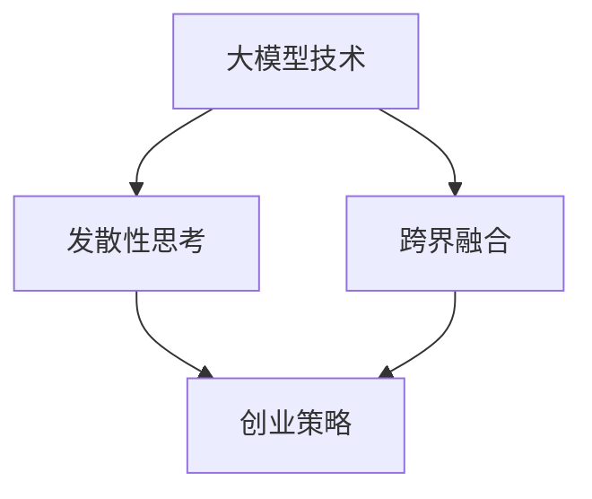

                 

## 大模型时代的创业者创新思维：发散性思考与跨界融合

> **关键词：** 大模型，创业者，创新思维，发散性思考，跨界融合，人工智能，深度学习，创业策略

> **摘要：** 本文旨在探讨在大模型时代，创业者如何通过发散性思考与跨界融合，创新商业模式，实现企业快速增长。文章首先介绍了大模型技术的发展背景，随后阐述了发散性思考与跨界融合的重要性，并通过具体案例分析了这两大思维模式在实际创业中的应用。最后，文章总结了未来创业者面临的挑战和机遇，提出了一系列建议，以助力创业者在激烈的市场竞争中脱颖而出。

## 1. 背景介绍

### 1.1 目的和范围

本文的目标是帮助创业者在大模型时代找到创新思维的方法，以应对快速变化的市场环境和激烈的竞争。文章将重点探讨以下主题：

- **大模型技术的发展背景**：介绍大模型技术的起源、发展历程及其在人工智能领域的应用。
- **发散性思考与跨界融合**：解释发散性思考的概念，阐述跨界融合的意义，并探讨这两种思维模式如何助力创业者。
- **实际案例**：分析成功创业者的案例，说明发散性思考与跨界融合在创业实践中的应用。
- **未来趋势与挑战**：总结大模型时代创业者的挑战和机遇，提出应对策略。

### 1.2 预期读者

本文适合以下读者：

- **创业者**：希望了解大模型时代创业策略的创业者。
- **产品经理**：需要在大模型时代制定创新产品的产品经理。
- **技术专家**：希望了解如何将技术应用于创业实践的技术专家。
- **投资者**：关注人工智能和创业领域的投资者。

### 1.3 文档结构概述

本文分为以下几个部分：

- **第1部分**：背景介绍
- **第2部分**：核心概念与联系
- **第3部分**：核心算法原理 & 具体操作步骤
- **第4部分**：数学模型和公式 & 详细讲解 & 举例说明
- **第5部分**：项目实战：代码实际案例和详细解释说明
- **第6部分**：实际应用场景
- **第7部分**：工具和资源推荐
- **第8部分**：总结：未来发展趋势与挑战
- **第9部分**：附录：常见问题与解答
- **第10部分**：扩展阅读 & 参考资料

### 1.4 术语表

#### 1.4.1 核心术语定义

- **大模型**：指具有海量数据、强大计算能力和复杂网络结构的机器学习模型。
- **发散性思考**：指从多个角度、维度和层面思考问题，探索多种可能性。
- **跨界融合**：指将不同领域的知识、技术和资源整合，实现创新和突破。

#### 1.4.2 相关概念解释

- **人工智能**：指模拟、延伸和扩展人类智能的理论、方法、技术及应用系统。
- **深度学习**：一种机器学习技术，通过多层神经网络模拟人类大脑的学习过程。
- **创业策略**：指企业在创建和发展过程中所采用的战略和方法。

#### 1.4.3 缩略词列表

- **AI**：人工智能
- **ML**：机器学习
- **DL**：深度学习
- **NLP**：自然语言处理

## 2. 核心概念与联系

在探讨大模型时代的创业者创新思维之前，我们首先需要了解几个核心概念及其相互关系。以下将使用Mermaid流程图展示这些概念和它们的联系。



### 2.1 大模型技术

大模型技术是本文的核心概念之一。它起源于深度学习的快速发展，特别是在大数据和云计算的支持下，大模型能够在各种任务中实现卓越的性能。以下是关于大模型技术的一些基本知识：

1. **起源与发展**：大模型技术的发展可以追溯到20世纪90年代，当时神经网络的研究开始取得突破性进展。随着计算能力的提升和海量数据的积累，大模型技术逐渐成熟，并成为人工智能领域的重要研究方向。
   
2. **应用领域**：大模型技术广泛应用于自然语言处理、计算机视觉、语音识别、推荐系统等众多领域，解决了许多复杂的实际问题。

3. **关键技术**：大模型技术涉及神经网络架构设计、优化算法、训练方法等多个方面。其中，神经网络架构设计是核心，优化算法和训练方法则是确保模型性能的关键。

### 2.2 发散性思考

发散性思考是一种重要的创新思维方法，它鼓励人们从多个角度、维度和层面思考问题，探索多种可能性。以下是关于发散性思考的一些要点：

1. **定义**：发散性思考（Divergent Thinking）是创造性思维过程的一部分，指的是从一个中心点出发，向多个方向探索和思考，寻找各种可能的解决方案。

2. **应用场景**：发散性思考适用于创新产品设计、市场策略制定、问题解决等多个方面。它有助于创业者跳出传统思维框架，发现新的商机和解决方案。

3. **方法**：发散性思考可以通过头脑风暴、思维导图、类比思考等方法进行。这些方法能够帮助创业者从不同角度审视问题，产生新的想法和创意。

### 2.3 跨界融合

跨界融合是指将不同领域的知识、技术和资源整合，实现创新和突破。以下是关于跨界融合的一些基本知识：

1. **定义**：跨界融合（Cross-Disciplinary Integration）是一种跨领域合作和创新的模式，通过将不同领域的知识和技术结合起来，创造新的价值。

2. **应用场景**：跨界融合广泛应用于科技创新、商业模式创新、社会问题解决等多个领域。它有助于创业者打破传统界限，实现跨越式发展。

3. **方法**：跨界融合可以通过跨学科合作、开放创新、共享平台等方式进行。这些方法能够帮助创业者整合多方资源，实现创新目标。

### 2.4 创业策略

创业策略是企业创建和发展过程中所采用的战略和方法。以下是大模型时代创业策略的一些关键要素：

1. **市场需求**：了解市场需求是制定创业策略的首要任务。创业者需要通过市场调研、用户访谈等方式，准确把握用户需求。

2. **技术创新**：在大模型时代，技术创新是创业成功的关键。创业者需要紧跟技术发展趋势，掌握先进的技术手段，提升产品竞争力。

3. **商业模式**：商业模式是企业创造价值、获取利润的方式。创业者需要设计创新的商业模式，实现可持续的盈利模式。

4. **团队建设**：团队是企业成功的关键。创业者需要组建一支富有创新精神、执行力强的团队，共同实现创业目标。

## 3. 核心算法原理 & 具体操作步骤

在大模型时代，算法原理是创业者创新思维的基础。以下是关于核心算法原理的详细讲解，我们将使用伪代码来描述算法的具体操作步骤。

### 3.1 大模型训练算法

大模型训练算法是基于深度学习的方法，其主要目标是学习数据中的内在规律，从而对新的数据进行预测或分类。以下是伪代码描述：

```plaintext
算法：大模型训练
输入：训练数据集D，模型参数θ
输出：训练好的模型参数θ'
步骤：
1. 初始化模型参数θ
2. 对每个训练样本(x_i, y_i) ∈ D，进行以下迭代：
    a. 计算预测值y' = f(x_i; θ)
    b. 计算损失函数L(y', y_i)
    c. 使用梯度下降法更新参数θ：
        θ = θ - α * ∇θL(y', y_i)
3. 重复步骤2，直到达到预定的迭代次数或损失函数收敛
4. 返回训练好的模型参数θ'
```

### 3.2 梯度下降算法

梯度下降算法是一种优化方法，用于最小化损失函数，从而得到最优的模型参数。以下是伪代码描述：

```plaintext
算法：梯度下降
输入：损失函数L(θ)，初始参数θ₀，学习率α
输出：最优参数θ*
步骤：
1. 初始化参数θ = θ₀
2. 对于每个迭代步骤t，进行以下操作：
    a. 计算当前参数θ的梯度∇θL(θ)
    b. 更新参数θ = θ - α * ∇θL(θ)
3. 重复步骤2，直到满足停止条件（如损失函数收敛或达到最大迭代次数）
4. 返回最优参数θ*
```

### 3.3 正则化方法

正则化方法是一种防止过拟合的技术，通过在损失函数中添加正则化项，控制模型复杂度。以下是伪代码描述：

```plaintext
算法：正则化梯度下降
输入：损失函数L(θ)，初始参数θ₀，学习率α，正则化参数λ
输出：最优参数θ*
步骤：
1. 初始化参数θ = θ₀
2. 对于每个迭代步骤t，进行以下操作：
    a. 计算当前参数θ的梯度∇θL(θ)
    b. 计算正则化项∇θλ * ∇θL(θ)
    c. 更新参数θ = θ - α * (∇θL(θ) + λ * ∇θL(θ))
3. 重复步骤2，直到满足停止条件（如损失函数收敛或达到最大迭代次数）
4. 返回最优参数θ*
```

### 3.4 神经网络架构设计

神经网络架构设计是构建大模型的关键步骤，涉及网络层数、神经元数量、激活函数、连接方式等多个方面。以下是伪代码描述：

```plaintext
算法：神经网络架构设计
输入：输入层神经元数n_in，输出层神经元数n_out，隐藏层神经元数n_hidden
输出：神经网络结构
步骤：
1. 初始化输入层、隐藏层和输出层神经元
2. 对于隐藏层，选择适当的激活函数（如ReLU、Sigmoid、Tanh等）
3. 对于隐藏层神经元之间的连接，使用适当的连接方式（如全连接、卷积等）
4. 对于输出层，选择适当的激活函数（如Softmax、Sigmoid等）
5. 返回神经网络结构
```

## 4. 数学模型和公式 & 详细讲解 & 举例说明

在大模型时代，数学模型和公式是理解和应用算法的基础。以下将详细讲解几个关键的数学模型和公式，并给出相应的例子说明。

### 4.1 损失函数

损失函数是评估模型预测结果与真实值之间差距的指标。常见的损失函数包括均方误差（MSE）、交叉熵损失（Cross-Entropy Loss）等。

#### 均方误差（MSE）

均方误差用于回归任务，计算预测值与真实值之间的平均平方差。

$$
MSE = \frac{1}{n}\sum_{i=1}^{n}(y_i - \hat{y}_i)^2
$$

其中，$y_i$ 是真实值，$\hat{y}_i$ 是预测值，$n$ 是样本数量。

#### 交叉熵损失（Cross-Entropy Loss）

交叉熵损失用于分类任务，计算预测概率分布与真实标签分布之间的差异。

$$
Cross-Entropy Loss = -\sum_{i=1}^{n}y_i \cdot log(\hat{y}_i)
$$

其中，$y_i$ 是真实标签（0或1），$\hat{y}_i$ 是预测概率。

### 4.2 梯度下降算法

梯度下降算法是一种优化算法，用于最小化损失函数。其核心思想是沿着损失函数的梯度方向更新模型参数。

#### 梯度计算

对于损失函数 $L(\theta)$，其梯度定义为：

$$
\nabla_{\theta}L(\theta) = \frac{\partial L(\theta)}{\partial \theta}
$$

#### 梯度下降更新规则

梯度下降算法的更新规则为：

$$
\theta = \theta - \alpha \cdot \nabla_{\theta}L(\theta)
$$

其中，$\alpha$ 是学习率，控制参数更新的步长。

### 4.3 正则化

正则化是一种防止过拟合的技术，通过在损失函数中添加正则化项，控制模型复杂度。

#### L2正则化

L2正则化在损失函数中添加以下正则化项：

$$
\frac{\lambda}{2}\sum_{i=1}^{n}\theta_i^2
$$

其中，$\lambda$ 是正则化参数，$\theta_i$ 是模型参数。

#### 梯度下降更新规则（L2正则化）

在梯度下降算法中，L2正则化的更新规则为：

$$
\theta = \theta - \alpha \cdot (\nabla_{\theta}L(\theta) + \lambda \cdot \theta)
$$

### 4.4 神经网络

神经网络是一种模拟人脑神经网络结构的计算模型，用于处理复杂数据。以下是神经网络的一些基本数学模型和公式。

#### 前向传播

神经网络的前向传播过程包括以下步骤：

1. **输入层到隐藏层**：
   $$ z_{j}^{(l)} = \sum_{i} w_{ji}^{(l)}a_{i}^{(l-1)} + b_j^{(l)} $$
   $$ a_{j}^{(l)} = \sigma(z_{j}^{(l)}) $$
   其中，$a_{i}^{(l)}$ 是第$l$层的第$i$个神经元的激活值，$z_{j}^{(l)}$ 是第$l$层的第$j$个神经元的输入值，$w_{ji}^{(l)}$ 是连接第$l-1$层的第$i$个神经元和第$l$层的第$j$个神经元的权重，$b_j^{(l)}$ 是第$l$层的第$j$个神经元的偏置，$\sigma$ 是激活函数。

2. **隐藏层到输出层**：
   $$ z_{j}^{(L)} = \sum_{i} w_{ji}^{(L)}a_{i}^{(L-1)} + b_j^{(L)} $$
   $$ \hat{y}_j = a_{j}^{(L)} $$
   其中，$a_{i}^{(L-1)}$ 是第$L-1$层的第$i$个神经元的激活值，$\hat{y}_j$ 是输出层的第$j$个神经元的预测值。

#### 反向传播

神经网络的反向传播过程用于计算模型参数的梯度，包括以下步骤：

1. **计算输出层的误差**：
   $$ \delta_{j}^{(L)} = (a_{j}^{(L)} - y_j) \cdot \sigma'(z_{j}^{(L)}) $$

2. **计算隐藏层的误差**：
   $$ \delta_{j}^{(l)} = \sum_{i} w_{ij}^{(l+1)}\delta_{i}^{(l+1)} \cdot \sigma'(z_{j}^{(l)}) $$

3. **更新模型参数**：
   $$ \theta_{ji}^{(l)} = \theta_{ji}^{(l)} - \alpha \cdot \delta_{j}^{(l)}a_{i}^{(l-1)} $$
   $$ b_j^{(l)} = b_j^{(l)} - \alpha \cdot \delta_{j}^{(l)} $$

## 5. 项目实战：代码实际案例和详细解释说明

为了更好地理解大模型时代的创业创新思维，以下将展示一个实际的项目案例，并详细解释代码实现和关键步骤。

### 5.1 开发环境搭建

为了搭建项目开发环境，我们需要安装以下软件和库：

1. **Python 3.8 或以上版本**：作为编程语言
2. **TensorFlow 2.5 或以上版本**：用于构建和训练神经网络
3. **Jupyter Notebook**：用于编写和运行代码

以下是安装步骤：

```bash
# 安装 Python
sudo apt-get update
sudo apt-get install python3.8

# 安装 TensorFlow
pip3 install tensorflow==2.5

# 安装 Jupyter Notebook
pip3 install notebook
```

### 5.2 源代码详细实现和代码解读

以下是一个简单的神经网络模型，用于实现手写数字识别任务。我们将使用 TensorFlow 和 Keras 库进行模型构建和训练。

```python
import tensorflow as tf
from tensorflow.keras import layers
from tensorflow.keras.datasets import mnist
from tensorflow.keras.models import Model
import numpy as np

# 加载数据集
(x_train, y_train), (x_test, y_test) = mnist.load_data()

# 数据预处理
x_train = x_train / 255.0
x_test = x_test / 255.0
x_train = np.expand_dims(x_train, -1)
x_test = np.expand_dims(x_test, -1)

# 构建模型
inputs = tf.keras.Input(shape=(28, 28))
x = layers.Conv2D(32, (3, 3), activation='relu')(inputs)
x = layers.MaxPooling2D((2, 2))(x)
x = layers.Conv2D(64, (3, 3), activation='relu')(x)
x = layers.MaxPooling2D((2, 2))(x)
x = layers.Flatten()(x)
x = layers.Dense(64, activation='relu')(x)
outputs = layers.Dense(10, activation='softmax')(x)

model = Model(inputs=inputs, outputs=outputs)

# 编译模型
model.compile(optimizer='adam',
              loss='sparse_categorical_crossentropy',
              metrics=['accuracy'])

# 训练模型
model.fit(x_train, y_train, epochs=5, batch_size=64)

# 评估模型
test_loss, test_acc = model.evaluate(x_test, y_test, verbose=2)
print('Test accuracy:', test_acc)
```

### 5.3 代码解读与分析

以下是对上述代码的详细解读和分析：

1. **数据加载与预处理**：首先，我们从 Keras 库中加载数字数据集 MNIST。然后，对数据进行归一化处理，将像素值缩放到 [0, 1] 范围内。最后，将数据扩展到一个维度，以适应模型的输入要求。

2. **模型构建**：使用 Keras 的序列模型 API，我们定义了一个简单的卷积神经网络。模型包括两个卷积层，每个卷积层后接一个最大池化层，然后是一个全连接层，最后是一个输出层。卷积层用于提取图像特征，全连接层用于分类。

3. **模型编译**：我们使用 Adam 优化器和 sparse_categorical_crossentropy 损失函数编译模型。sparse_categorical_crossentropy 是用于多标签分类任务的损失函数。

4. **模型训练**：使用训练数据集训练模型，设置训练周期为 5，批量大小为 64。在训练过程中，模型将学习如何识别手写数字。

5. **模型评估**：使用测试数据集评估模型性能。通过计算测试集上的准确率，我们可以了解模型的泛化能力。

### 5.4 项目实战总结

通过这个简单的项目，我们了解了如何使用 TensorFlow 和 Keras 构建和训练神经网络模型。这个案例展示了在创业过程中，如何将技术应用于实际问题，实现业务目标。在实际应用中，创业者可以根据业务需求和数据特点，调整模型架构、训练策略等参数，以实现更好的性能和效果。

## 6. 实际应用场景

大模型时代带来了前所未有的技术进步，创业者可以借助这些技术实现多样化业务场景。以下列举几种实际应用场景，并探讨如何通过发散性思考和跨界融合来实现创新。

### 6.1 金融风控

**场景描述**：金融机构面临日益复杂的风险，如信用风险、市场风险和操作风险。传统风控模型在应对新兴风险时往往力不从心。

**发散性思考**：思考如何利用大模型技术对海量数据进行深入分析，发掘潜在风险因素。

**跨界融合**：将大数据、机器学习和金融知识相结合，构建智能风控系统。

**解决方案**：通过构建大模型，对客户行为、市场动态、宏观经济等多维度数据进行综合分析，实现实时风险预警和自动化决策。例如，可以使用深度学习模型分析客户信用历史、交易行为和社交网络数据，预测信用风险。

### 6.2 医疗健康

**场景描述**：医疗行业正面临着数据爆炸和医疗资源不足的双重挑战。

**发散性思考**：思考如何利用大模型技术提升医疗诊断和治疗的准确性。

**跨界融合**：将医学知识、基因组学、影像学等领域的知识融入大模型。

**解决方案**：通过构建医疗大模型，实现疾病预测、诊断和治疗方案的个性化推荐。例如，可以使用深度学习模型对医学影像进行分析，辅助医生诊断疾病。同时，结合基因组数据，预测个体患病风险，制定个性化预防措施。

### 6.3 教育科技

**场景描述**：传统教育模式难以满足个性化学习需求。

**发散性思考**：思考如何利用大模型技术实现个性化教育。

**跨界融合**：将人工智能、教育学和心理学的知识相结合。

**解决方案**：通过构建教育大模型，实现个性化学习路径规划、学习内容推荐和智能辅导。例如，使用自然语言处理技术分析学生的学习行为和兴趣，推荐合适的学习资源和课程。同时，结合心理学理论，提供情感支持和学习动机激励。

### 6.4 城市管理

**场景描述**：城市化进程带来了交通拥堵、环境治理等挑战。

**发散性思考**：思考如何利用大模型技术优化城市管理。

**跨界融合**：将数据科学、城市规划和交通运输学等领域的知识融入大模型。

**解决方案**：通过构建城市大模型，实现交通流量预测、环境质量监测和城市安全预警。例如，使用深度学习模型分析交通流量数据，优化交通信号控制策略，缓解拥堵。同时，结合环境监测数据，预测空气质量变化，提前采取治理措施。

### 6.5 消费者行为分析

**场景描述**：企业需要深入了解消费者行为，以提高营销效果。

**发散性思考**：思考如何利用大模型技术挖掘消费者偏好和需求。

**跨界融合**：将市场营销、消费者行为学和数据分析等领域的知识融入大模型。

**解决方案**：通过构建消费者行为大模型，实现精准营销和个性化推荐。例如，使用深度学习模型分析消费者的购物历史、浏览行为和社交媒体数据，预测消费者偏好，制定精准的营销策略。

## 7. 工具和资源推荐

在大模型时代，创业者需要掌握一系列工具和资源，以实现创新和突破。以下将推荐一些常用的学习资源、开发工具和框架，以及相关的论文著作。

### 7.1 学习资源推荐

#### 7.1.1 书籍推荐

- **《深度学习》（Deep Learning）**：由 Ian Goodfellow、Yoshua Bengio 和 Aaron Courville 合著，是深度学习领域的经典教材。
- **《Python机器学习》（Python Machine Learning）**：由 Sebastian Raschka 和 Vahid Mirjalili 合著，适合初学者了解机器学习应用。
- **《人工智能：一种现代方法》（Artificial Intelligence: A Modern Approach）**：由 Stuart Russell 和 Peter Norvig 合著，涵盖人工智能领域的广泛知识。

#### 7.1.2 在线课程

- **Coursera**：提供大量关于机器学习、深度学习和人工智能的在线课程，如 Andrew Ng 的《机器学习》课程。
- **edX**：提供由顶级大学和机构开设的免费和付费课程，如哈佛大学的《计算机科学导论》课程。
- **Udacity**：提供专业的技术课程和实践项目，如《深度学习工程师纳米学位》。

#### 7.1.3 技术博客和网站

- **Medium**：涵盖人工智能、深度学习和创业等多个领域的博客文章，如《AI with Theano》博客。
- **Towards Data Science**：一个专注于数据科学、机器学习和人工智能的博客平台，提供丰富的技术文章和实践案例。
- **Reddit**：Reddit 上的 r/MachineLearning 和 r/deeplearning 社区是讨论和分享机器学习相关资源的活跃平台。

### 7.2 开发工具框架推荐

#### 7.2.1 IDE和编辑器

- **Jupyter Notebook**：适用于数据科学和机器学习的交互式编程环境，支持多种编程语言，包括 Python。
- **PyCharm**：一款强大的 Python IDE，提供代码补全、调试、版本控制等功能。
- **Visual Studio Code**：一款轻量级、可扩展的代码编辑器，支持多种编程语言，包括 Python 和 R。

#### 7.2.2 调试和性能分析工具

- **TensorBoard**：TensorFlow 提供的可视化工具，用于分析和调试神经网络模型。
- **NVIDIA Nsight**：适用于 GPU 编程和性能分析的工具，帮助开发者优化 CUDA 应用程序。
- **GDB**：通用调试器，用于调试 C/C++ 程序。

#### 7.2.3 相关框架和库

- **TensorFlow**：Google 开发的一个开源机器学习框架，适用于构建和训练各种神经网络模型。
- **PyTorch**：Facebook AI Research 开发的一个开源深度学习框架，具有灵活的动态计算图和强大的GPU支持。
- **Keras**：一个基于 TensorFlow 的简洁易用的深度学习库，适合快速实验和原型开发。

### 7.3 相关论文著作推荐

#### 7.3.1 经典论文

- **“Backpropagation”**：由 David E. Rumelhart、Geoffrey E. Hinton 和 Ronald J. Williams 于 1986 年发表，介绍了反向传播算法。
- **“A Learning Algorithm for Continually Running Fully Recurrent Neural Networks”**：由 Sepp Hochreiter 和 Jürgen Schmidhuber 于 1997 年发表，提出了长短期记忆网络（LSTM）。
- **“Deep Learning”**：由 Ian Goodfellow、Yoshua Bengio 和 Aaron Courville 于 2016 年发表，全面介绍了深度学习的方法和原理。

#### 7.3.2 最新研究成果

- **“Attention is All You Need”**：由 Vaswani et al. 于 2017 年发表，提出了 Transformer 模型，推动了自然语言处理领域的发展。
- **“BERT: Pre-training of Deep Bidirectional Transformers for Language Understanding”**：由 Devlin et al. 于 2018 年发表，介绍了 BERT 模型，提升了自然语言处理任务的表现。
- **“GPT-3: Language Models are Few-Shot Learners”**：由 Brown et al. 于 2020 年发表，展示了 GPT-3 模型在少样本学习任务上的强大能力。

#### 7.3.3 应用案例分析

- **“Natural Language Processing with Deep Learning”**：由 Richard Socher、Llion Jones 和 Andrew Y. Ng 于 2017 年发表的案例研究，介绍了如何使用深度学习技术实现自然语言处理任务。
- **“Speech Recognition with Deep Neural Networks”**：由 Google Research 团队于 2013 年发表的案例研究，展示了深度学习在语音识别领域的应用。
- **“ImageNet Classification with Deep Convolutional Neural Networks”**：由 Karen Simonyan 和 Andrew Zisserman 于 2014 年发表的案例研究，介绍了深度卷积神经网络在图像分类任务上的突破。

## 8. 总结：未来发展趋势与挑战

大模型时代为创业者带来了前所未有的机遇，但也伴随着一系列挑战。在未来，创业者需要紧跟技术发展趋势，积极应对挑战，以实现持续创新和成功。

### 8.1 未来发展趋势

1. **计算能力的提升**：随着硬件技术的进步，大模型的计算能力将得到显著提升，为创业者提供更多创新可能。
2. **数据量的爆发**：数据量的快速增长将推动大模型的应用场景不断扩展，创业者可以更加深入地挖掘数据价值。
3. **跨领域的融合**：不同领域的技术和知识将更加紧密地结合，产生新的商业模式和应用场景。
4. **个性化服务**：大模型技术将进一步提升个性化服务的能力，创业者可以更好地满足用户需求。

### 8.2 未来挑战

1. **数据隐私和安全**：随着数据量的增加，数据隐私和安全问题将成为重要挑战。创业者需要确保用户数据的安全和隐私。
2. **算法公平性和透明度**：大模型可能导致算法偏见和不公平，创业者需要确保算法的透明度和公平性。
3. **技术依赖**：过度依赖大模型技术可能导致创业者在技术变革中失去竞争力。创业者需要保持技术自主性和创新能力。
4. **资源分配**：大模型的训练和部署需要大量资源，创业者需要合理规划资源，确保项目顺利进行。

### 8.3 应对策略

1. **持续学习**：创业者需要不断学习和掌握新技术，以保持竞争力。
2. **跨界合作**：通过跨界合作，整合多方资源，实现创新和突破。
3. **数据驱动**：以数据为驱动，深入挖掘数据价值，优化业务决策。
4. **重视用户体验**：关注用户需求，提供高质量、个性化的服务。

总之，大模型时代为创业者提供了广阔的舞台，但也带来了新的挑战。只有紧跟发展趋势，积极应对挑战，才能在激烈的市场竞争中脱颖而出。

## 9. 附录：常见问题与解答

### 9.1 问题1：大模型技术如何应用于创业实践？

**解答**：大模型技术可以应用于多个创业领域，如金融风控、医疗健康、教育科技、城市管理等。创业者可以通过以下步骤将大模型技术应用于创业实践：

1. **确定应用场景**：分析市场需求，确定大模型技术的潜在应用领域。
2. **数据收集与处理**：收集相关数据，并进行清洗、预处理，以适应大模型训练。
3. **模型构建与训练**：根据应用场景，构建合适的神经网络模型，并使用大量数据进行训练。
4. **模型优化与评估**：通过调整模型参数和训练策略，优化模型性能，并进行评估。
5. **业务落地与推广**：将优化后的模型应用于实际业务，不断迭代和优化，实现商业化推广。

### 9.2 问题2：发散性思考和跨界融合如何助力创业？

**解答**：

- **发散性思考**：发散性思考可以帮助创业者从多个角度审视问题，发现新的商机和解决方案。例如，在金融领域，创业者可以通过发散性思考探索如何利用大模型技术优化风险管理、提升金融服务质量。

- **跨界融合**：跨界融合可以将不同领域的知识和技术相结合，实现创新和突破。例如，在医疗领域，创业者可以将人工智能、医学和基因学等领域的知识融合，开发个性化的疾病诊断和治疗系统。

### 9.3 问题3：如何确保大模型技术的算法公平性和透明度？

**解答**：

1. **数据预处理**：确保数据的质量和多样性，避免数据偏差。
2. **模型训练策略**：使用平衡的数据集进行模型训练，避免模型产生偏见。
3. **算法透明化**：公开算法的实现细节和训练过程，确保算法的透明度。
4. **伦理审查**：对算法应用进行伦理审查，确保算法不会歧视特定群体。
5. **持续监测与优化**：对算法进行持续监测和优化，确保其在实际应用中的公平性和透明度。

## 10. 扩展阅读 & 参考资料

以下是一些扩展阅读和参考资料，以帮助读者深入了解大模型时代的创业者创新思维。

### 10.1 书籍推荐

- **《深度学习》（Deep Learning）**：Ian Goodfellow、Yoshua Bengio 和 Aaron Courville 著，全面介绍深度学习的方法和原理。
- **《Python机器学习》（Python Machine Learning）**：Sebastian Raschka 和 Vahid Mirjalili 著，适合初学者了解机器学习应用。
- **《人工智能：一种现代方法》（Artificial Intelligence: A Modern Approach）**：Stuart Russell 和 Peter Norvig 著，涵盖人工智能领域的广泛知识。

### 10.2 在线课程

- **Coursera**：提供大量关于机器学习、深度学习和人工智能的在线课程，如 Andrew Ng 的《机器学习》课程。
- **edX**：提供由顶级大学和机构开设的免费和付费课程，如哈佛大学的《计算机科学导论》课程。
- **Udacity**：提供专业的技术课程和实践项目，如《深度学习工程师纳米学位》。

### 10.3 技术博客和网站

- **Medium**：涵盖人工智能、深度学习和创业等多个领域的博客文章，如《AI with Theano》博客。
- **Towards Data Science**：一个专注于数据科学、机器学习和人工智能的博客平台，提供丰富的技术文章和实践案例。
- **Reddit**：Reddit 上的 r/MachineLearning 和 r/deeplearning 社区是讨论和分享机器学习相关资源的活跃平台。

### 10.4 相关论文著作

- **“Backpropagation”**：David E. Rumelhart、Geoffrey E. Hinton 和 Ronald J. Williams 著，介绍了反向传播算法。
- **“A Learning Algorithm for Continually Running Fully Recurrent Neural Networks”**：Sepp Hochreiter 和 Jürgen Schmidhuber 著，提出了长短期记忆网络（LSTM）。
- **“Attention is All You Need”**：Vaswani et al. 著，提出了 Transformer 模型。
- **“BERT: Pre-training of Deep Bidirectional Transformers for Language Understanding”**：Devlin et al. 著，介绍了 BERT 模型。

### 10.5 应用案例分析

- **“Natural Language Processing with Deep Learning”**：Richard Socher、Llion Jones 和 Andrew Y. Ng 著，介绍了如何使用深度学习技术实现自然语言处理任务。
- **“Speech Recognition with Deep Neural Networks”**：Google Research 团队著，展示了深度学习在语音识别领域的应用。
- **“ImageNet Classification with Deep Convolutional Neural Networks”**：Karen Simonyan 和 Andrew Zisserman 著，介绍了深度卷积神经网络在图像分类任务上的突破。

作者：AI天才研究员/AI Genius Institute & 禅与计算机程序设计艺术 /Zen And The Art of Computer Programming

