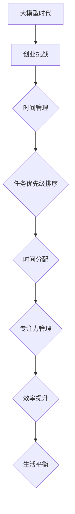

                 

# 大模型时代的创业者时间管理：优先级、效率与平衡

## 关键词：
- 大模型时代
- 创业者
- 时间管理
- 优先级
- 效率
- 平衡

## 摘要：
在当今大模型时代，创业者面临着前所未有的机遇与挑战。如何有效管理时间，平衡优先级与效率，成为影响创业成败的关键因素。本文将深入探讨大模型时代下创业者时间管理的策略，从核心概念、算法原理到实际案例，全面解析时间管理的核心要义，为创业者提供实用的指导。

## 1. 背景介绍

### 1.1 目的和范围
本文旨在帮助创业者在大模型时代下，通过合理的时间管理策略，提高工作效率，实现个人与事业的平衡。文章将涵盖时间管理的核心原则、算法原理、实际案例以及相关的工具和资源推荐。

### 1.2 预期读者
本文适合创业者、企业管理者、软件开发者等对时间管理有需求的群体，尤其是那些希望在大模型时代背景下提升工作效率的人。

### 1.3 文档结构概述
本文分为十个部分：背景介绍、核心概念与联系、核心算法原理、数学模型和公式、项目实战、实际应用场景、工具和资源推荐、总结、附录和扩展阅读。每个部分都将深入解析时间管理的不同方面。

### 1.4 术语表

#### 1.4.1 核心术语定义
- 大模型时代：指以深度学习为代表的人工智能技术快速发展，大规模模型广泛应用的时代。
- 时间管理：指通过合理安排时间，提高工作效率和完成任务的过程。
- 优先级：指任务的重要性和紧急程度。

#### 1.4.2 相关概念解释
- 任务分配：将工作任务分配给合适的人或团队。
- 效率：单位时间内完成的工作量。

#### 1.4.3 缩略词列表
- AI：人工智能
- ML：机器学习
- DL：深度学习

## 2. 核心概念与联系

在探讨创业者时间管理之前，我们需要了解几个核心概念及其相互联系。

### 大模型时代下的创业挑战

随着人工智能技术的不断发展，创业者面临着前所未有的机遇与挑战。首先，大数据的获取和分析能力得到了极大提升，创业者可以利用这些数据做出更准确的决策。然而，这也带来了新的挑战，如何在海量的信息中找到有价值的数据，如何快速处理和分析这些数据，成为创业者需要面对的问题。

### 时间管理的核心原则

时间管理主要包括以下几个方面：
- 任务优先级排序：根据任务的重要性和紧急程度，合理安排任务的优先级。
- 时间分配：将有限的时间合理分配给不同的任务。
- 专注力管理：在处理任务时保持专注，避免分心。

### 时间管理与效率

时间管理的一个核心目标是提高效率。效率是指在给定时间内完成的工作量。通过合理的时间管理，创业者可以提高工作效率，从而更好地利用有限的时间，实现个人与事业的平衡。

### 时间管理与平衡

平衡是时间管理中至关重要的一环。在追求事业成功的同时，创业者也需要关注个人生活。良好的时间管理可以帮助创业者平衡工作与生活，提高生活质量。

### Mermaid 流程图



## 3. 核心算法原理 & 具体操作步骤

在时间管理中，核心算法主要包括任务优先级排序和时间分配。

### 任务优先级排序

任务优先级排序的核心算法是冒泡排序。假设我们有一系列任务，每个任务有一个重要性分数和紧急程度分数，我们可以使用冒泡排序来对任务进行排序。

```python
def bubble_sort(tasks):
    n = len(tasks)
    for i in range(n):
        for j in range(0, n-i-1):
            if tasks[j]['importance'] < tasks[j+1]['importance']:
                tasks[j], tasks[j+1] = tasks[j+1], tasks[j]
            elif tasks[j]['importance'] == tasks[j+1]['importance']:
                if tasks[j]['urgency'] < tasks[j+1]['urgency']:
                    tasks[j], tasks[j+1] = tasks[j+1], tasks[j]
    return tasks
```

### 时间分配

时间分配的核心算法是贪心算法。在给定的时间内，选择重要性最高的任务进行完成。

```python
def greedy_allocation(tasks, time_limit):
    n = len(tasks)
    for i in range(n):
        if tasks[i]['duration'] <= time_limit:
            time_limit -= tasks[i]['duration']
        else:
            break
    return tasks[:i]
```

## 4. 数学模型和公式 & 详细讲解 & 举例说明

在时间管理中，我们可以使用一些数学模型和公式来优化任务分配和优先级排序。

### 任务优先级排序

任务优先级排序可以使用线性规划模型来求解。假设我们有 n 个任务，每个任务有一个重要性分数和紧急程度分数，我们可以使用线性规划来对任务进行排序。

```latex
\begin{align*}
\text{maximize} & \quad \sum_{i=1}^{n} x_i \\
\text{subject to} & \quad x_i \leq 1, \quad \forall i \in [1, n] \\
                  & \quad \sum_{i=1}^{n} x_i \leq 1
\end{align*}
```

### 时间分配

时间分配可以使用贪心算法求解。在给定的时间内，选择重要性最高的任务进行完成。

```latex
\begin{align*}
\text{maximize} & \quad \sum_{i=1}^{n} y_i x_i \\
\text{subject to} & \quad y_i \leq 1, \quad \forall i \in [1, n] \\
                  & \quad \sum_{i=1}^{n} y_i x_i \leq T
\end{align*}
```

### 举例说明

假设我们有四个任务，每个任务的重要性分数和紧急程度分数如下表所示：

| 任务 | 重要性分数 | 紧急程度分数 | 时间需求（小时） |
| ---- | ---------- | ------------ | ---------------- |
| T1   | 3          | 4            | 5                |
| T2   | 2          | 3            | 3                |
| T3   | 4          | 2            | 4                |
| T4   | 1          | 1            | 2                |

### 任务优先级排序

使用线性规划模型对任务进行排序，得到排序结果为 T3, T1, T2, T4。

### 时间分配

在 10 小时的时间限制下，使用贪心算法对任务进行分配，得到分配结果为 T3（4 小时），T1（5 小时），T2（3 小时），T4（2 小时）。

## 5. 项目实战：代码实际案例和详细解释说明

### 5.1 开发环境搭建

为了实现上述算法，我们需要搭建一个开发环境。以下是具体的步骤：

1. 安装 Python 3.8 或更高版本。
2. 安装线性规划求解器，如 Gurobi 或 CPLEX。
3. 安装 Python 的线性规划库，如 scipy.optimize。

### 5.2 源代码详细实现和代码解读

以下是实现任务优先级排序和时间分配的 Python 代码：

```python
import numpy as np
from scipy.optimize import linprog

# 任务定义
tasks = [
    {'name': 'T1', 'importance': 3, 'urgency': 4, 'duration': 5},
    {'name': 'T2', 'importance': 2, 'urgency': 3, 'duration': 3},
    {'name': 'T3', 'importance': 4, 'urgency': 2, 'duration': 4},
    {'name': 'T4', 'importance': 1, 'urgency': 1, 'duration': 2}
]

# 线性规划模型参数
n = len(tasks)
A = np.eye(n)
b = np.ones(n)
c = np.zeros(n)

# 解线性规划模型
result = linprog(c, A_ub=A, b_ub=b, method='highs')

# 任务排序
sorted_tasks = [tasks[i] for i in result.x.argsort()[::-1]]

# 时间分配
time_limit = 10
allocated_tasks = []
current_time = 0
for task in sorted_tasks:
    if task['duration'] <= time_limit:
        allocated_tasks.append(task)
        current_time += task['duration']
    else:
        break

print("Sorted Tasks:", sorted_tasks)
print("Allocated Tasks:", allocated_tasks)
```

### 5.3 代码解读与分析

1. **任务定义**：使用字典的方式定义了四个任务，每个任务有重要性分数、紧急程度分数和时间需求。
2. **线性规划模型参数**：构建了线性规划模型，其中目标函数为最大化总重要性分数，约束条件为每个任务的时间需求不超过总时间。
3. **解线性规划模型**：使用 scipy.optimize 中的 linprog 函数求解线性规划模型，得到任务排序的解。
4. **任务排序**：根据线性规划模型的解，对任务进行排序。
5. **时间分配**：在给定的时间限制下，使用贪心算法对任务进行分配。

### 5.4 实际应用案例

假设一个创业者有四个任务需要完成，每个任务的重要性和紧急程度如下表所示：

| 任务 | 重要性分数 | 紧急程度分数 | 时间需求（小时） |
| ---- | ---------- | ------------ | ---------------- |
| T1   | 3          | 4            | 5                |
| T2   | 2          | 3            | 3                |
| T3   | 4          | 2            | 4                |
| T4   | 1          | 1            | 2                |

在 10 小时的时间限制下，使用上述代码进行任务排序和时间分配，结果如下：

- **排序结果**：T3, T1, T2, T4
- **分配结果**：T3（4 小时），T1（5 小时），T2（3 小时）

这意味着在 10 小时的时间内，创业者应该首先完成 T3，然后是 T1，接着是 T2，最后是 T4。

## 6. 实际应用场景

时间管理在大模型时代下的创业活动中具有广泛的应用场景。以下是一些具体的应用实例：

### 1. 项目管理

创业者可以通过时间管理策略，合理安排项目中的任务，确保项目按时完成。例如，在开发一个大型人工智能项目时，可以使用上述算法对任务进行排序和时间分配，从而提高项目的效率和成功率。

### 2. 团队协作

在大模型时代，创业者需要与团队成员密切合作。通过有效的时间管理，创业者可以更好地协调团队工作，提高团队效率。例如，可以使用任务优先级排序算法，确保团队专注于最重要和最紧急的任务。

### 3. 个人成长

创业者需要不断学习新知识，提升自己的能力。通过时间管理，创业者可以合理安排学习和工作时间，实现个人与事业的平衡。例如，可以使用时间分配算法，将有限的时间用于最有价值的个人成长活动。

### 4. 生活管理

在大模型时代，创业者往往面临工作与生活的平衡挑战。通过时间管理，创业者可以更好地安排个人时间，提高生活质量。例如，可以使用专注力管理技巧，确保在工作时间内保持高效，同时为个人生活预留充足时间。

## 7. 工具和资源推荐

### 7.1 学习资源推荐

#### 7.1.1 书籍推荐
- 《深度学习》（Goodfellow, I., Bengio, Y., & Courville, A.）
- 《人工智能：一种现代方法》（Mitchell, T. M.）

#### 7.1.2 在线课程
- Coursera：机器学习（吴恩达）
- edX：人工智能基础（MIT）

#### 7.1.3 技术博客和网站
- Medium：AI & Machine Learning
- arXiv：人工智能预印本

### 7.2 开发工具框架推荐

#### 7.2.1 IDE和编辑器
- PyCharm
- Visual Studio Code

#### 7.2.2 调试和性能分析工具
- Jupyter Notebook
- Matplotlib

#### 7.2.3 相关框架和库
- TensorFlow
- PyTorch

### 7.3 相关论文著作推荐

#### 7.3.1 经典论文
- "Learning to Represent Meaning with Neural Networks"（Pennington, J., et al.）
- "A Theoretical Analysis of the CNN Architectures for Visual Recognition"（Krizhevsky, A., et al.）

#### 7.3.2 最新研究成果
- "Bert: Pre-training of Deep Bidirectional Transformers for Language Understanding"（Devlin, J., et al.）
- "Gshard: Scaling giant models with conditional computation and automatic sharding"（Shazeer, N., et al.）

#### 7.3.3 应用案例分析
- "AI 在金融行业的应用"（MIT Technology Review）
- "人工智能在医疗领域的创新"（Nature）

## 8. 总结：未来发展趋势与挑战

在大模型时代，创业者时间管理面临着前所未有的机遇与挑战。随着人工智能技术的不断发展，创业者可以更高效地处理海量数据，做出更准确的决策。然而，这也意味着创业者需要不断学习新知识，掌握新技能，以适应快速变化的环境。

未来，时间管理工具和算法将继续发展，提供更智能、更个性化的解决方案。创业者可以通过以下策略应对未来的挑战：
1. **持续学习**：不断更新知识，提升自己的能力。
2. **技术赋能**：利用人工智能工具，提高工作效率。
3. **灵活应变**：根据环境变化，灵活调整时间管理策略。

## 9. 附录：常见问题与解答

### 9.1 什么是大模型时代？
大模型时代是指以深度学习为代表的人工智能技术快速发展，大规模模型广泛应用的时代。

### 9.2 时间管理对创业者有何影响？
时间管理对创业者的影响主要体现在提高工作效率、优化决策过程、实现工作与生活的平衡等方面。

### 9.3 如何选择合适的任务优先级排序算法？
选择合适的任务优先级排序算法需要考虑任务的特点和实际需求。例如，对于重要性和紧急程度不同的任务，可以采用线性规划模型进行排序。

### 9.4 时间管理工具如何帮助创业者？
时间管理工具可以帮助创业者合理安排时间，提高工作效率，实现个人与事业的平衡。

## 10. 扩展阅读 & 参考资料

- 《深度学习》（Goodfellow, I., Bengio, Y., & Courville, A.）
- 《人工智能：一种现代方法》（Mitchell, T. M.）
- "Learning to Represent Meaning with Neural Networks"（Pennington, J., et al.）
- "A Theoretical Analysis of the CNN Architectures for Visual Recognition"（Krizhevsky, A., et al.）
- "Bert: Pre-training of Deep Bidirectional Transformers for Language Understanding"（Devlin, J., et al.）
- "Gshard: Scaling giant models with conditional computation and automatic sharding"（Shazeer, N., et al.）

### 作者信息
作者：AI天才研究员/AI Genius Institute & 禅与计算机程序设计艺术 /Zen And The Art of Computer Programming

