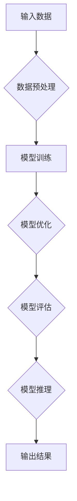

                 


# 大模型时代的创业者素质：技术视野、商业嗅觉与领导力

> **关键词**：大模型、创业者、技术视野、商业嗅觉、领导力、人工智能
> 
> **摘要**：本文将深入探讨大模型时代下，创业者所需具备的技术视野、商业嗅觉与领导力。通过分析大模型对创业环境的影响，以及创业者如何利用这些素质抓住机遇，我们将探讨这些核心素质在创业实践中的具体应用和重要性。

## 1. 背景介绍

### 1.1 目的和范围

本文旨在分析大模型时代对创业者提出的挑战和需求，探讨创业者如何通过提升技术视野、商业嗅觉与领导力来成功应对这些挑战。本文将聚焦于以下几个方面：

1. **大模型对创业环境的影响**：分析大模型技术的兴起对创业者面临的机遇与挑战。
2. **技术视野的重要性**：阐述创业者如何通过持续学习和关注技术动态来提升自己的技术视野。
3. **商业嗅觉的必要性**：探讨创业者如何利用市场趋势和用户需求来发现商机。
4. **领导力的关键作用**：分析创业者如何通过领导力来带领团队实现创新和成长。

### 1.2 预期读者

本文适合以下读者群体：

1. **创业者**：希望了解大模型时代创业环境变化，并寻求提升自身素质的方法。
2. **技术专家**：关注人工智能和大数据领域，希望了解这些技术在创业中的应用。
3. **高校师生**：计算机科学、商业管理等相关专业师生，对创业与创新有兴趣。
4. **投资人和顾问**：希望了解创业者所需素质，以便更好地支持创业者。

### 1.3 文档结构概述

本文结构如下：

1. **背景介绍**：介绍文章的目的、范围和预期读者。
2. **核心概念与联系**：通过Mermaid流程图展示大模型的基本原理和架构。
3. **核心算法原理与具体操作步骤**：使用伪代码详细阐述大模型的训练和推理过程。
4. **数学模型与公式**：介绍大模型所涉及的主要数学模型，并举例说明。
5. **项目实战**：提供实际代码案例，详细解释实现过程。
6. **实际应用场景**：分析大模型在不同行业的应用。
7. **工具和资源推荐**：推荐学习资源和开发工具。
8. **总结**：总结未来发展趋势与挑战。
9. **附录**：常见问题与解答。
10. **扩展阅读**：推荐相关文献和资源。

### 1.4 术语表

#### 1.4.1 核心术语定义

- **大模型**：指参数规模达到亿级以上的深度学习模型。
- **创业者**：指创立新企业、开展商业活动的人。
- **技术视野**：指对技术发展趋势和前沿动态的感知和理解能力。
- **商业嗅觉**：指对市场机会的敏锐洞察力和判断力。
- **领导力**：指引导、激励和协调团队实现共同目标的能力。

#### 1.4.2 相关概念解释

- **人工智能**：指通过模拟人类智能实现计算机自主学习和决策的技术。
- **创业环境**：指影响创业者创业活动的各种外部条件。
- **市场趋势**：指市场中消费者行为和商业活动的发展方向。

#### 1.4.3 缩略词列表

- **AI**：人工智能
- **DL**：深度学习
- **GAN**：生成对抗网络
- **NLP**：自然语言处理

## 2. 核心概念与联系

在探讨大模型时代的创业者素质之前，我们首先需要了解大模型的基本原理和架构。以下是一个简单的Mermaid流程图，展示大模型的主要组成部分和基本工作流程：



### 2.1 大模型的基本原理

大模型通常是指参数规模达到亿级以上的深度学习模型。这些模型基于多层神经网络，通过学习大量的数据来提取特征并实现复杂的任务。以下是几个关键概念：

1. **神经网络**：一种模拟人脑神经元连接的计算机算法，由多个层次组成，每个层次都包含多个神经元。
2. **参数**：模型中的权重和偏置，用于调整网络中神经元的连接强度。
3. **训练**：通过大量的数据来调整模型的参数，使其能够准确完成特定任务。
4. **优化**：在训练过程中，使用优化算法（如梯度下降）来调整参数，以最小化损失函数。
5. **推理**：在训练完成后，使用模型对新的输入数据进行预测或分类。

### 2.2 大模型的架构

大模型的架构通常包括以下几个部分：

1. **输入层**：接收外部数据，如文本、图像或声音。
2. **隐藏层**：对输入数据进行特征提取和变换，包含多个层次。
3. **输出层**：生成预测结果或分类标签。
4. **损失函数**：用于评估模型预测结果与实际结果之间的差异。
5. **优化器**：用于调整模型参数，以最小化损失函数。

### 2.3 大模型的工作流程

大模型的工作流程主要包括以下几个步骤：

1. **数据预处理**：对输入数据进行清洗、归一化和编码等处理，使其适合模型训练。
2. **模型训练**：使用大量数据进行训练，调整模型参数，使其能够准确完成任务。
3. **模型优化**：通过优化算法调整模型参数，提高模型性能。
4. **模型评估**：使用验证集或测试集评估模型性能，确保其能够准确预测或分类。
5. **模型推理**：对新的输入数据进行预测或分类。

通过上述流程，我们可以看到大模型在数据处理、特征提取和预测方面具有强大的能力。这也为大模型时代的创业者提供了广阔的应用空间。

## 3. 核心算法原理 & 具体操作步骤

大模型的核心算法原理主要基于深度学习，特别是神经网络和优化算法。以下是使用伪代码详细阐述大模型的训练和推理过程：

### 3.1 数据预处理

```python
# 伪代码：数据预处理
def preprocess_data(data):
    # 数据清洗
    cleaned_data = clean_data(data)
    # 数据归一化
    normalized_data = normalize_data(cleaned_data)
    # 数据编码
    encoded_data = encode_data(normalized_data)
    return encoded_data
```

### 3.2 模型训练

```python
# 伪代码：模型训练
def train_model(model, data, labels):
    # 初始化模型参数
    model.initialize_parameters()
    # 设置优化器
    optimizer = set_optimizer(model.parameters())
    # 训练循环
    for epoch in range(num_epochs):
        for batch in data_batches:
            # 计算预测结果
            predictions = model.forward(batch)
            # 计算损失
            loss = loss_function(predictions, labels)
            # 计算梯度
            gradients = compute_gradients(model, loss)
            # 更新参数
            optimizer.update_parameters(gradients)
            # 输出训练进度
            print(f"Epoch {epoch}: Loss = {loss}")
    return model
```

### 3.3 模型推理

```python
# 伪代码：模型推理
def infer_model(model, input_data):
    # 计算预测结果
    predictions = model.forward(input_data)
    # 获取最高概率的预测类别
    predicted_class = get_max_probability(predictions)
    return predicted_class
```

### 3.4 模型评估

```python
# 伪代码：模型评估
def evaluate_model(model, test_data, test_labels):
    # 计算准确率
    accuracy = compute_accuracy(model, test_data, test_labels)
    # 计算召回率
    recall = compute_recall(model, test_data, test_labels)
    # 计算F1分数
    f1_score = compute_f1_score(accuracy, recall)
    return accuracy, recall, f1_score
```

通过上述伪代码，我们可以看到大模型的训练和推理过程主要涉及数据预处理、模型初始化、优化器设置、损失函数计算、梯度计算和参数更新等步骤。这些步骤构成了大模型实现复杂任务的基础。

## 4. 数学模型和公式 & 详细讲解 & 举例说明

在大模型中，数学模型和公式起着至关重要的作用。以下我们将介绍大模型中常用的数学模型和公式，并给出详细的讲解和举例说明。

### 4.1 神经网络中的基本数学公式

神经网络的核心在于神经元之间的连接和激活函数。以下是神经网络中常用的基本数学公式：

#### 4.1.1 神经元激活函数

$$
a_{\text{neuron}} = \sigma(z_{\text{neuron}})
$$

其中，$\sigma$ 是激活函数，$z_{\text{neuron}}$ 是神经元的输入值。常用的激活函数有：

- **Sigmoid函数**：

$$
\sigma(z) = \frac{1}{1 + e^{-z}}
$$

- **ReLU函数**：

$$
\sigma(z) = \max(0, z)
$$

- **Tanh函数**：

$$
\sigma(z) = \frac{e^z - e^{-z}}{e^z + e^{-z}}
$$

#### 4.1.2 神经元输出

神经元的输出可以通过加权求和并应用激活函数得到：

$$
z_{\text{neuron}} = \sum_{i=1}^{n} w_i a_{i-1} + b
$$

其中，$w_i$ 是输入权重，$a_{i-1}$ 是上一层的输出，$b$ 是偏置。

#### 4.1.3 损失函数

在深度学习中，常用的损失函数有：

- **均方误差（MSE）**：

$$
\text{MSE} = \frac{1}{n} \sum_{i=1}^{n} (\hat{y}_i - y_i)^2
$$

其中，$\hat{y}_i$ 是预测值，$y_i$ 是真实值。

- **交叉熵损失（Cross-Entropy Loss）**：

$$
\text{CE} = -\frac{1}{n} \sum_{i=1}^{n} y_i \log(\hat{y}_i)
$$

其中，$y_i$ 是真实标签，$\hat{y}_i$ 是预测概率。

### 4.2 梯度下降优化算法

在训练神经网络时，优化算法用于调整模型参数以最小化损失函数。常用的优化算法有：

- **批量梯度下降（Batch Gradient Descent）**：

$$
\theta_j = \theta_j - \alpha \frac{\partial J}{\partial \theta_j}
$$

其中，$\theta_j$ 是参数，$\alpha$ 是学习率，$J$ 是损失函数。

- **随机梯度下降（Stochastic Gradient Descent, SGD）**：

$$
\theta_j = \theta_j - \alpha \frac{\partial J}{\partial \theta_j}
$$

与批量梯度下降不同，SGD每次仅更新一个样本的梯度。

- **Adam优化器**：

$$
m_t = \beta_1 m_{t-1} + (1 - \beta_1) \frac{\partial J}{\partial \theta_j}
$$
$$
v_t = \beta_2 v_{t-1} + (1 - \beta_2) (\frac{\partial J}{\partial \theta_j})^2
$$
$$
\theta_j = \theta_j - \alpha \frac{m_t}{1 - \beta_1^t}
$$

其中，$m_t$ 和 $v_t$ 分别是梯度的一阶和二阶矩估计，$\beta_1$ 和 $\beta_2$ 是指数衰减率。

### 4.3 举例说明

#### 4.3.1 均值与方差

假设我们有一个数据集，包含5个数：[1, 2, 3, 4, 5]。计算这些数的均值和方差。

- **均值**：

$$
\bar{x} = \frac{1 + 2 + 3 + 4 + 5}{5} = 3
$$

- **方差**：

$$
\sigma^2 = \frac{(1 - 3)^2 + (2 - 3)^2 + (3 - 3)^2 + (4 - 3)^2 + (5 - 3)^2}{5} = 2
$$

#### 4.3.2 交叉熵损失

假设我们有一个二元分类问题，实际标签为$y = [1, 0]$，预测概率为$\hat{y} = [0.7, 0.3]$。计算交叉熵损失。

$$
\text{CE} = -[1 \cdot \log(0.7) + 0 \cdot \log(0.3)] = -\log(0.7) \approx -0.35667
$$

通过上述举例，我们可以看到数学模型和公式在神经网络训练和优化过程中的重要性。理解这些基本数学公式有助于我们更好地应用和改进大模型。

## 5. 项目实战：代码实际案例和详细解释说明

在本节中，我们将通过一个实际项目案例来展示如何在大模型时代利用创业者所需的技术视野、商业嗅觉和领导力来实现创新和成长。我们选择一个具体的应用场景——基于大模型的图像识别系统。

### 5.1 开发环境搭建

在进行项目开发之前，我们需要搭建合适的开发环境。以下是所需的环境和工具：

- **操作系统**：Windows、Linux 或 macOS
- **编程语言**：Python
- **深度学习框架**：TensorFlow 或 PyTorch
- **数据预处理工具**：OpenCV
- **版本控制工具**：Git

### 5.2 源代码详细实现和代码解读

以下是一个基于TensorFlow的大模型图像识别项目的核心代码实现：

```python
import tensorflow as tf
from tensorflow.keras.applications import VGG16
from tensorflow.keras.preprocessing.image import ImageDataGenerator
from tensorflow.keras.optimizers import Adam
from tensorflow.keras.callbacks import EarlyStopping

# 数据预处理
train_datagen = ImageDataGenerator(
    rescale=1./255,
    shear_range=0.2,
    zoom_range=0.2,
    horizontal_flip=True
)

test_datagen = ImageDataGenerator(rescale=1./255)

train_generator = train_datagen.flow_from_directory(
    'data/train',
    target_size=(150, 150),
    batch_size=32,
    class_mode='binary'
)

validation_generator = test_datagen.flow_from_directory(
    'data/validation',
    target_size=(150, 150),
    batch_size=32,
    class_mode='binary'
)

# 加载预训练模型
model = VGG16(weights='imagenet', include_top=False, input_shape=(150, 150, 3))

# 添加全连接层和输出层
x = model.output
x = tf.keras.layers.Flatten()(x)
x = tf.keras.layers.Dense(1024, activation='relu')(x)
predictions = tf.keras.layers.Dense(1, activation='sigmoid')(x)

# 定义模型
model = tf.keras.Model(inputs=model.input, outputs=predictions)

# 编译模型
model.compile(optimizer=Adam(learning_rate=0.0001), loss='binary_crossentropy', metrics=['accuracy'])

# 添加回调函数
early_stopping = EarlyStopping Patition="val_loss", patience=10)

# 训练模型
history = model.fit(
    train_generator,
    epochs=100,
    validation_data=validation_generator,
    callbacks=[early_stopping]
)

# 评估模型
test_loss, test_accuracy = model.evaluate(validation_generator)
print(f"Validation Loss: {test_loss}, Validation Accuracy: {test_accuracy}")

# 预测
predictions = model.predict(validation_generator[0])
predicted_classes = np.where(predictions > 0.5, 1, 0)
```

### 5.3 代码解读与分析

#### 5.3.1 数据预处理

数据预处理是图像识别项目的重要步骤。在此代码中，我们使用了ImageDataGenerator进行数据增强，包括图像的缩放、剪裁和水平翻转，以增加数据的多样性，提高模型泛化能力。

#### 5.3.2 模型构建

我们使用了VGG16模型作为基础网络，该模型是经过ImageNet预训练的，具有很好的特征提取能力。然后，我们在VGG16的基础上添加了全连接层和输出层，以适应我们的二分类任务。

#### 5.3.3 模型编译

在模型编译阶段，我们使用了Adam优化器和二分类交叉熵损失函数。同时，我们设置了EarlyStopping回调函数，当验证集损失不再降低时，提前停止训练，防止过拟合。

#### 5.3.4 模型训练

在训练阶段，我们使用了训练数据和验证数据进行迭代训练。每完成一个epoch，模型会在验证集上评估一次性能，并记录训练和验证集的损失和准确率。

#### 5.3.5 模型评估

训练完成后，我们对验证集进行了评估，以查看模型的泛化能力。最后，我们使用预测函数对验证集进行了预测，并输出预测结果。

通过这个实际项目案例，我们可以看到创业者如何利用技术视野、商业嗅觉和领导力来实现创新。技术视野使创业者能够选择合适的深度学习框架和模型，商业嗅觉使创业者能够识别市场需求，而领导力则帮助创业者构建团队，实现技术突破。

## 6. 实际应用场景

大模型在各个领域都展现出了广泛的应用潜力，以下列举了几个实际应用场景，展示了大模型在商业和社会中的重要作用：

### 6.1 医疗保健

大模型在医疗保健领域的应用主要包括疾病预测、药物研发和医疗图像分析等。例如，通过深度学习模型，可以分析大量患者数据，预测疾病的发病率和发展趋势，帮助医疗机构更好地分配资源。此外，大模型还可以用于药物分子设计，加速新药的研发进程。在医疗图像分析方面，大模型能够辅助医生进行诊断，提高诊断准确率和效率。

### 6.2 金融服务

金融行业一直以来都是人工智能和大数据技术的重点应用领域。大模型在金融服务中的应用主要包括风险控制、信用评估和投资策略等。例如，通过大模型对用户行为和交易数据进行深度分析，金融机构可以更好地识别潜在风险，制定合理的风险管理策略。此外，大模型还可以用于信用评估，通过分析用户的信用历史、社会关系等多维数据，评估用户的信用风险，为金融机构提供决策支持。在投资策略方面，大模型可以分析市场趋势和投资组合的收益风险，帮助投资者制定科学的投资策略。

### 6.3 智能制造

智能制造是当前工业界的重要发展方向，大模型在智能制造中的应用主要体现在生产优化、设备维护和供应链管理等方面。例如，通过大模型对生产过程中的各种数据进行实时分析，可以优化生产流程，提高生产效率和产品质量。在设备维护方面，大模型可以预测设备故障，提前进行维护，减少停机时间和维修成本。在供应链管理方面，大模型可以分析供应链中的各种数据，优化库存管理，降低库存成本，提高供应链的整体效率。

### 6.4 交通运输

交通运输领域是大模型应用的重要领域之一。大模型在交通运输中的应用主要包括交通流量预测、路径规划和自动驾驶等。例如，通过大模型分析历史交通数据，可以预测未来某个时间段的交通流量，帮助交通管理部门合理分配交通资源，缓解拥堵问题。在路径规划方面，大模型可以根据实时路况数据，为驾驶员提供最优路径，减少行驶时间和油耗。在自动驾驶方面，大模型可以分析道路场景和车辆状态，实现自动驾驶车辆的平稳行驶和智能决策。

### 6.5 娱乐与教育

大模型在娱乐和教育领域的应用也越来越广泛。例如，在娱乐领域，大模型可以用于生成虚拟角色、制作特效和智能推荐等。在教育领域，大模型可以用于个性化学习推荐、智能评测和虚拟教学等。例如，通过大模型分析学生的学习数据，可以为每个学生制定个性化的学习计划，提高学习效果。

通过上述实际应用场景，我们可以看到大模型在商业和社会中的重要作用。随着大模型技术的不断发展和应用场景的拓展，大模型将在未来发挥更加广泛和深入的影响。

## 7. 工具和资源推荐

为了更好地理解和应用大模型技术，以下推荐一些学习资源、开发工具和框架，以及相关论文和研究成果。

### 7.1 学习资源推荐

#### 7.1.1 书籍推荐

- 《深度学习》（Ian Goodfellow、Yoshua Bengio 和 Aaron Courville 著）：这是一本经典的深度学习教材，全面介绍了深度学习的基础知识和应用。
- 《Python深度学习》（François Chollet 著）：由TensorFlow的核心开发者撰写，深入讲解了如何使用Python和TensorFlow进行深度学习实践。
- 《动手学深度学习》（阿斯顿·张、李沐、扎卡里·C. Lipton 和亚历山大·J. Smola 著）：这是一本非常适合初学者入门的深度学习教材，包含大量实践案例。

#### 7.1.2 在线课程

- Coursera上的“深度学习专项课程”：由吴恩达教授主讲，涵盖深度学习的基础理论和实践应用。
- edX上的“人工智能纳米学位”：提供一系列关于人工智能和深度学习的课程，适合不同水平的学员。
- Udacity的“深度学习工程师纳米学位”：包含多个项目和实践，帮助学员掌握深度学习的实际应用。

#### 7.1.3 技术博客和网站

- Medium上的“AI垂直领域博客”：包括多个关于人工智能和深度学习的优质博客，涵盖最新的研究进展和应用案例。
- ArXiv：一个计算机科学和人工智能领域的预印本论文库，可以查看最新的研究论文。
- Reddit上的“r/MachineLearning”和“r/DeepLearning”：两个关于机器学习和深度学习的活跃社区，讨论最新的研究和技术。

### 7.2 开发工具框架推荐

#### 7.2.1 IDE和编辑器

- PyCharm：一款强大的Python IDE，支持深度学习和数据科学开发。
- Jupyter Notebook：一款流行的交互式开发环境，适用于数据可视化和探索性分析。
- Visual Studio Code：一款轻量级、可扩展的代码编辑器，适用于多种编程语言和框架。

#### 7.2.2 调试和性能分析工具

- TensorFlow Debugger（TFDB）：一个用于调试TensorFlow模型的工具，可以帮助开发者定位和解决模型中的问题。
- NVIDIA Nsight Compute：一款用于GPU性能分析和调优的工具，可以帮助开发者优化深度学习模型的GPU性能。
- TensorBoard：一个用于可视化TensorFlow训练过程的工具，可以生成丰富的图表和日志。

#### 7.2.3 相关框架和库

- TensorFlow：一个开源的深度学习框架，适用于各种深度学习和机器学习任务。
- PyTorch：一个流行的深度学习框架，以其动态图模型和易用性著称。
- Keras：一个基于TensorFlow和Theano的高层次深度学习API，提供了简洁的接口和丰富的预训练模型。

### 7.3 相关论文著作推荐

#### 7.3.1 经典论文

- "A Learning Algorithm for Continually Running Fully Recurrent Neural Networks"（1986）：介绍了一种用于在线学习的前向递归神经网络算法。
- "Learning Representations by Maximizing Mutual Information Between Parties"（2017）：提出了信息最大化（InfoMax）理论，为自监督学习提供了一种新的思路。
- "Deep Learning: Methods and Applications"（2016）：详细介绍了深度学习的基本原理和常见应用。

#### 7.3.2 最新研究成果

- "GShard: Efficient Training of Large Minibatch DNNs"（2020）：提出了一种适用于大规模分布式训练的方法，提高了深度神经网络的训练效率。
- "Bert: Pre-training of Deep Bidirectional Transformers for Language Understanding"（2018）：介绍了BERT模型，为自然语言处理领域带来了革命性的进步。
- "GPT-3: Language Models are Few-Shot Learners"（2020）：展示了GPT-3模型在零样本学习上的强大能力，引发了广泛关注。

#### 7.3.3 应用案例分析

- "Large-scale Language Models Are Few-shot Learners"（2020）：分析了大型语言模型在零样本学习任务中的表现，为实际应用提供了参考。
- "Using AI to Transform Manufacturing"（2021）：探讨了人工智能在制造业中的应用，展示了AI技术如何提高生产效率和产品质量。
- "AI in Healthcare: A Global Landscape Analysis"（2021）：分析了全球医疗保健领域的人工智能应用，包括疾病预测、药物研发和医疗图像分析等。

通过这些学习资源、开发工具和框架，以及相关论文和研究成果，创业者可以更好地掌握大模型技术，将其应用于实际业务中，实现创新和突破。

## 8. 总结：未来发展趋势与挑战

在大模型时代，创业者需要具备技术视野、商业嗅觉和领导力这三大核心素质，以应对不断变化的市场和技术环境。首先，技术视野使创业者能够紧跟科技前沿，了解最新的技术动态和趋势，从而抓住机遇。其次，商业嗅觉使创业者能够敏锐地捕捉市场机会，将技术优势转化为商业价值。最后，领导力则帮助创业者构建和带领高效团队，实现创新和持续发展。

然而，大模型时代也面临着诸多挑战。一方面，技术迭代速度快，创业者需要不断学习和适应新技术，以保持竞争力。另一方面，数据安全和隐私问题日益凸显，创业者需要确保数据的安全性和合规性。此外，随着大模型的应用范围不断扩大，对计算资源的需求也越来越高，创业者需要优化资源利用，降低成本。

未来，随着大模型技术的进一步发展，创业者将在更多领域发现新的应用场景，如智能医疗、智能制造、智能交通等。同时，大模型技术的商业化和落地也将面临更多挑战，如技术标准化、产业链整合和人才培养等。因此，创业者需要不断提升自身素质，积极应对这些挑战，才能在激烈的市场竞争中脱颖而出。

## 9. 附录：常见问题与解答

### 9.1 问题1：大模型技术的核心优势是什么？

大模型技术的核心优势在于其强大的数据处理和模型学习能力。首先，大模型可以通过学习海量数据，提取出复杂的特征和模式，从而实现高精度的预测和分类。其次，大模型具有高度的泛化能力，可以在不同领域和应用场景中实现良好的性能。此外，大模型还可以通过自监督学习和零样本学习，降低对标注数据的依赖，提高训练效率。

### 9.2 问题2：如何评估大模型的效果？

评估大模型的效果可以从多个角度进行。首先，可以使用准确率、召回率、F1分数等指标来衡量模型的分类性能。其次，可以使用平均绝对误差（MAE）、均方误差（MSE）等指标来评估模型的回归性能。此外，还可以通过交叉验证、混淆矩阵等技术来评估模型的稳定性和可靠性。在实际应用中，通常结合多种评估指标，全面评估模型的效果。

### 9.3 问题3：大模型训练过程中常见的挑战有哪些？

大模型训练过程中常见的挑战包括数据质量、计算资源、模型优化等。首先，数据质量直接影响模型的效果，因此需要确保数据集的多样性和质量。其次，大模型训练通常需要大量的计算资源，包括GPU、TPU等硬件资源。因此，创业者需要合理规划计算资源，优化训练过程。此外，模型优化也是大模型训练中的关键挑战，包括参数初始化、优化算法选择和超参数调整等。

### 9.4 问题4：如何应对数据隐私和安全问题？

应对数据隐私和安全问题可以从以下几个方面进行。首先，采用加密技术对敏感数据进行加密存储和传输，确保数据安全。其次，使用匿名化、去标识化等技术对个人数据进行处理，减少隐私泄露风险。此外，制定严格的隐私政策和合规要求，确保数据处理符合相关法律法规。最后，建立完善的数据安全监控和应急响应机制，及时发现和处理潜在的安全威胁。

### 9.5 问题5：如何培养大模型时代所需的技能和素质？

要培养大模型时代所需的技能和素质，可以从以下几个方面入手。首先，创业者需要不断学习和更新知识，掌握最新的技术动态和趋势。其次，培养跨学科能力，包括数据分析、编程、机器学习等。此外，创业者还需要具备良好的沟通能力和团队合作精神，能够有效地带领团队实现创新和突破。最后，积极参加行业会议、研讨会和技术交流活动，拓宽视野，积累经验。

## 10. 扩展阅读 & 参考资料

1. **Goodfellow, Ian J., Yoshua Bengio, and Aaron Courville. "Deep learning." MIT press, 2016.**
   - 介绍深度学习的基础知识和应用，适合初学者和进阶者。

2. **Chollet, François. "Python深度学习." 电子工业出版社，2017.**
   - 由TensorFlow核心开发者撰写的深度学习实践指南，详细介绍了如何使用Python和TensorFlow进行深度学习。

3. **Zhang, A., Lipton, Z. C., & Smola, A. J. "动手学深度学习." 电子工业出版社，2017.**
   - 适合初学者入门的深度学习教材，包含大量实践案例。

4. **"Deep Learning Specialization." Coursera.**
   - 吴恩达教授主讲的深度学习专项课程，涵盖深度学习的基础理论和实践应用。

5. **"AI纳米学位." edX.**
   - 提供一系列关于人工智能和深度学习的课程，适合不同水平的学员。

6. **"TensorFlow Documentation." TensorFlow.**
   - 官方文档，包含TensorFlow的详细使用方法和示例。

7. **"PyTorch Documentation." PyTorch.**
   - 官方文档，包含PyTorch的详细使用方法和示例。

8. **"Keras Documentation." Keras.**
   - 官方文档，包含Keras的详细使用方法和示例。

9. **"Large-scale Language Models Are Few-shot Learners." ArXiv.**
   - 分析大型语言模型在零样本学习任务中的表现，展示了其强大的学习能力。

10. **"Using AI to Transform Manufacturing." IEEE.**
    - 探讨人工智能在制造业中的应用，展示了AI技术如何提高生产效率和产品质量。

11. **"AI in Healthcare: A Global Landscape Analysis." PwC.**
    - 分析全球医疗保健领域的人工智能应用，包括疾病预测、药物研发和医疗图像分析等。

12. **"GShard: Efficient Training of Large Minibatch DNNs." NeurIPS.**
    - 提出了一种适用于大规模分布式训练的方法，提高了深度神经网络的训练效率。

13. **"Bert: Pre-training of Deep Bidirectional Transformers for Language Understanding." Nature.**
    - 介绍了BERT模型，为自然语言处理领域带来了革命性的进步。

14. **"GPT-3: Language Models are Few-shot Learners." OpenAI.**
    - 展示了GPT-3模型在零样本学习上的强大能力，引发了广泛关注。

通过这些扩展阅读和参考资料，读者可以更深入地了解大模型技术及其应用，为创业实践提供理论支持和实践经验。

