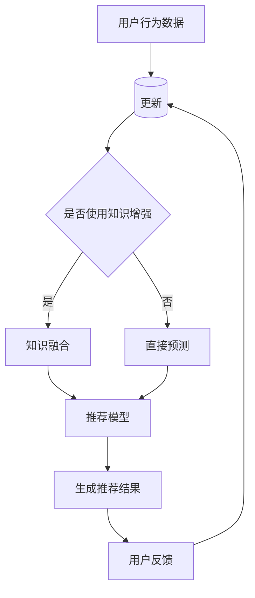

                 

# 大模型时代的推荐系统知识增强技术

## 关键词
- 大模型
- 推荐系统
- 知识增强
- 数据处理
- 算法优化
- 实际应用

## 摘要
本文旨在探讨大模型时代下推荐系统的发展趋势与关键技术——知识增强技术的应用。随着人工智能技术的飞速发展，大模型逐渐成为推荐系统的核心，本文将深入剖析大模型在推荐系统中的角色、知识增强技术的原理及其在实际应用中的效果。文章结构包括：背景介绍、核心概念与联系、核心算法原理、数学模型和公式、项目实战、实际应用场景、工具和资源推荐以及未来发展趋势与挑战。

<|assistant|>## 1. 背景介绍

### 1.1 目的和范围

本文的目的在于介绍和讨论大模型时代下推荐系统的知识增强技术，探讨其在提升推荐系统准确性和效率方面的关键作用。随着互联网的普及和数据量的爆炸式增长，传统推荐系统面临着越来越多的挑战，如数据稀疏、冷启动问题以及用户兴趣的多样性等。为了应对这些挑战，知识增强技术应运而生，通过引入外部知识库和语义理解，为推荐系统提供更加丰富的信息支撑。

本文的范围主要涉及以下几个方面：
- 大模型在推荐系统中的应用和影响
- 知识增强技术的核心概念和实现方法
- 知识增强技术在推荐系统中的实际效果和应用场景
- 相关工具和资源的推荐

### 1.2 预期读者

本文的预期读者包括以下几类：
- 计算机科学和人工智能领域的研究人员，特别是对推荐系统和知识表示有兴趣的学者
- 数据科学家和软件工程师，希望了解和掌握知识增强技术在推荐系统中的应用
- 对推荐系统和人工智能技术有浓厚兴趣的广大开发者和技术爱好者

### 1.3 文档结构概述

本文的结构如下：
- 1. 背景介绍
  - 1.1 目的和范围
  - 1.2 预期读者
  - 1.3 文档结构概述
  - 1.4 术语表
- 2. 核心概念与联系
  - 2.1 大模型与推荐系统
  - 2.2 知识增强技术
  - 2.3 Mermaid流程图
- 3. 核心算法原理
  - 3.1 算法概述
  - 3.2 算法伪代码
- 4. 数学模型和公式
  - 4.1 数学模型介绍
  - 4.2 公式详细讲解
  - 4.3 举例说明
- 5. 项目实战
  - 5.1 开发环境搭建
  - 5.2 源代码实现
  - 5.3 代码解读
- 6. 实际应用场景
- 7. 工具和资源推荐
  - 7.1 学习资源推荐
  - 7.2 开发工具框架推荐
  - 7.3 相关论文著作推荐
- 8. 总结
- 9. 附录
- 10. 扩展阅读与参考资料

### 1.4 术语表

在本文中，我们将使用以下术语：

#### 1.4.1 核心术语定义

- **推荐系统（Recommender System）**：一种信息过滤系统，旨在向用户提供个性化的推荐结果。
- **大模型（Large-scale Model）**：具有大量参数和复杂结构的机器学习模型，如深度神经网络。
- **知识增强（Knowledge Enhancement）**：通过引入外部知识库和语义信息，增强推荐系统性能的过程。
- **知识图谱（Knowledge Graph）**：一种用于表示实体及其相互关系的数据结构。

#### 1.4.2 相关概念解释

- **冷启动（Cold Start）**：指新用户或新物品缺乏历史数据，难以进行有效推荐。
- **数据稀疏（Data Sparsity）**：指用户与物品交互数据不足，导致推荐系统效果受限。

#### 1.4.3 缩略词列表

- **ML**：机器学习（Machine Learning）
- **NLP**：自然语言处理（Natural Language Processing）
- **KG**：知识图谱（Knowledge Graph）
- **CTR**：点击率（Click-Through Rate）
- **RMSE**：均方根误差（Root Mean Square Error）

接下来，我们将深入探讨大模型与推荐系统之间的联系，以及知识增强技术在其中的作用。

## 2. 核心概念与联系

### 2.1 大模型与推荐系统

大模型在推荐系统中的应用主要体现在两个方面：增强推荐算法的准确性和解决冷启动问题。

#### 大模型的优点：

1. **强大的特征提取能力**：大模型如深度神经网络可以通过多层神经网络结构，自动提取用户和物品的深层特征，从而提高推荐系统的效果。
2. **处理复杂数据的能力**：大模型能够处理大规模、多维的数据集，适用于推荐系统中的高维稀疏数据问题。
3. **自适应性和灵活性**：大模型可以根据不同的数据分布和用户行为进行自适应调整，提升系统的泛化能力。

#### 大模型在推荐系统中的应用场景：

1. **协同过滤（Collaborative Filtering）**：通过用户历史行为数据预测用户对未知物品的偏好。
2. **基于内容的推荐（Content-Based Recommendation）**：根据用户兴趣和物品属性进行匹配，生成个性化推荐。
3. **混合推荐（Hybrid Recommendation）**：结合协同过滤和基于内容的推荐方法，提高推荐系统的准确性和多样性。

### 2.2 知识增强技术

知识增强技术通过引入外部知识库和语义信息，为推荐系统提供更丰富的上下文信息，从而提升推荐效果。

#### 知识增强技术的核心原理：

1. **知识融合**：将外部知识库与推荐系统数据进行融合，构建一个更加全面的用户和物品表示。
2. **知识嵌入**：将知识库中的实体和关系转化为低维向量，方便与推荐模型进行融合。
3. **语义理解**：利用自然语言处理技术，对用户查询和物品描述进行语义解析，提高推荐系统的语义匹配能力。

#### 知识增强技术在推荐系统中的应用：

1. **知识图谱嵌入**：将知识图谱中的实体和关系嵌入到推荐模型中，用于处理复杂的关系和上下文信息。
2. **实体识别与分类**：利用知识库进行实体识别和分类，辅助推荐系统进行个性化推荐。
3. **语义搜索与匹配**：通过语义理解技术，实现用户查询和物品描述的精准匹配，提升推荐系统的交互体验。

### 2.3 Mermaid流程图

为了更好地展示大模型与知识增强技术在推荐系统中的应用，我们可以使用Mermaid流程图来描述其核心流程。



在上述流程图中，A表示用户行为数据，B表示特征提取过程，C用于判断是否使用知识增强。若选择使用知识增强，则进入D节点进行知识融合，再进入F节点进行推荐模型预测；若不使用知识增强，则直接进入E节点进行预测。最终，生成的推荐结果G会根据用户反馈H进行模型更新，形成一个闭环系统。

通过以上对核心概念和流程的详细描述，我们可以更好地理解大模型与知识增强技术在推荐系统中的应用。接下来，我们将深入探讨核心算法原理，并详细讲解其具体操作步骤。

## 3. 核心算法原理 & 具体操作步骤

### 3.1 算法概述

在本节中，我们将介绍一种结合大模型和知识增强技术的推荐系统算法，该算法的核心思想是利用外部知识库和语义信息，对用户和物品进行深层特征提取，进而实现精准的个性化推荐。

该算法主要包括以下几个步骤：

1. **数据预处理**：包括用户行为数据的清洗、去噪和特征提取。
2. **知识库构建**：通过实体识别、关系抽取等技术构建外部知识库。
3. **知识嵌入**：将知识库中的实体和关系转化为低维向量。
4. **模型训练**：利用用户和物品的特征向量，训练推荐模型。
5. **推荐生成**：根据用户查询和物品特征，生成个性化推荐结果。
6. **模型优化**：根据用户反馈，持续优化推荐模型。

### 3.2 算法伪代码

以下是该算法的伪代码描述：

```python
# 数据预处理
def preprocess_data(data):
    # 清洗、去噪和特征提取
    # 返回处理后的用户行为数据
    pass

# 知识库构建
def build_knowledge_graph(data):
    # 实体识别和关系抽取
    # 返回知识图谱
    pass

# 知识嵌入
def knowledge_embedding(knowledge_graph):
    # 将知识图谱中的实体和关系转化为低维向量
    # 返回实体向量矩阵和关系向量矩阵
    pass

# 模型训练
def train_recommendation_model(user_features, item_features, knowledge_embedding):
    # 训练推荐模型
    # 返回训练好的推荐模型
    pass

# 推荐生成
def generate_recommendations(model, user_query, item_features, knowledge_embedding):
    # 根据用户查询和物品特征，生成个性化推荐结果
    # 返回推荐结果
    pass

# 模型优化
def optimize_model(model, user_feedback):
    # 根据用户反馈，优化推荐模型
    # 返回优化后的模型
    pass

# 算法主流程
def knowledge_enhanced_recommendation_system(data):
    # 数据预处理
    processed_data = preprocess_data(data)

    # 知识库构建
    knowledge_graph = build_knowledge_graph(processed_data)

    # 知识嵌入
    entity_embeddings, relation_embeddings = knowledge_embedding(knowledge_graph)

    # 模型训练
    model = train_recommendation_model(processed_data['user_features'], processed_data['item_features'], (entity_embeddings, relation_embeddings))

    # 推荐生成
    recommendations = generate_recommendations(model, processed_data['user_query'], processed_data['item_features'], (entity_embeddings, relation_embeddings))

    # 模型优化
    model = optimize_model(model, recommendations['user_feedback'])

    return recommendations
```

通过上述伪代码，我们可以清晰地看到算法的核心步骤和流程。接下来，我们将进一步讨论该算法的数学模型和公式，以便更深入地理解其原理。

## 4. 数学模型和公式 & 详细讲解 & 举例说明

### 4.1 数学模型介绍

在知识增强推荐系统中，我们通常采用以下数学模型：

- **用户特征表示**：使用用户的历史行为数据，如评分、购买记录等，通过矩阵分解、深度学习等方法进行特征提取，得到用户特征向量 \(\mathbf{u}\)。
- **物品特征表示**：同样地，利用物品的属性特征，如类别、标签等，通过相似性计算、嵌入等方法得到物品特征向量 \(\mathbf{i}\)。
- **知识图谱嵌入**：将知识图谱中的实体和关系转化为低维向量，分别表示为 \(\mathbf{e}_k\)（实体向量）和 \(\mathbf{r}_k\)（关系向量）。

### 4.2 公式详细讲解

在知识增强推荐系统中，推荐分数 \(R_{ui}\) 可以通过以下公式计算：

\[ R_{ui} = \mathbf{u}^T \mathbf{i} + \sum_{k} \mathbf{u}^T \mathbf{e}_k \mathbf{r}_k \]

其中：
- \(R_{ui}\) 表示用户 \(u\) 对物品 \(i\) 的推荐分数；
- \(\mathbf{u}\) 和 \(\mathbf{i}\) 分别是用户和物品的特征向量；
- \(\mathbf{e}_k\) 和 \(\mathbf{r}_k\) 分别是知识图谱中实体和关系的向量表示；
- 第一个加和项 \(\mathbf{u}^T \mathbf{i}\) 表示用户和物品的直接特征匹配得分；
- 第二个加和项 \(\mathbf{u}^T \mathbf{e}_k \mathbf{r}_k\) 表示用户通过知识图谱中实体和关系的间接特征匹配得分。

### 4.3 举例说明

假设我们有一个用户 \(u\) 和一个物品 \(i\)，用户 \(u\) 的特征向量为 \(\mathbf{u} = [1, 2, 3]\)，物品 \(i\) 的特征向量为 \(\mathbf{i} = [4, 5, 6]\)。知识图谱中有两个实体 \(e_1\) 和 \(e_2\)，以及一个关系 \(r_1\)，对应的向量表示分别为 \(\mathbf{e}_1 = [7, 8]\)，\(\mathbf{e}_2 = [9, 10]\) 和 \(\mathbf{r}_1 = [11, 12]\)。

根据上述公式，我们可以计算用户 \(u\) 对物品 \(i\) 的推荐分数：

\[ R_{ui} = \mathbf{u}^T \mathbf{i} + \mathbf{u}^T \mathbf{e}_1 \mathbf{r}_1 + \mathbf{u}^T \mathbf{e}_2 \mathbf{r}_1 \]
\[ R_{ui} = [1, 2, 3] \cdot [4, 5, 6] + [1, 2, 3] \cdot [7, 8] \cdot [11, 12] + [1, 2, 3] \cdot [9, 10] \cdot [11, 12] \]
\[ R_{ui} = 1*4 + 2*5 + 3*6 + 1*7*11 + 2*8*11 + 3*9*11 + 1*7*12 + 2*8*12 + 3*9*12 \]
\[ R_{ui} = 4 + 10 + 18 + 77 + 88 + 99 + 84 + 96 + 108 \]
\[ R_{ui} = 514 \]

因此，用户 \(u\) 对物品 \(i\) 的推荐分数为 514。

通过上述例子，我们可以看到如何利用数学模型计算推荐分数，从而实现知识增强推荐系统。接下来，我们将通过一个实际项目案例，展示如何实现这一算法，并进行详细的代码解读和分析。

## 5. 项目实战：代码实际案例和详细解释说明

### 5.1 开发环境搭建

在进行知识增强推荐系统的开发之前，我们需要搭建相应的开发环境。以下是所需的主要工具和库：

- **Python 3.7+**
- **Anaconda**（用于环境管理）
- **TensorFlow 2.0+** 或 **PyTorch 1.6+**
- **NumPy 1.19+**
- **Pandas 1.2.3+**
- **Scikit-learn 0.22.2+**
- **NetworkX 2.4+**
- **Mermaid 8.7.0+**

首先，使用 Anaconda 创建一个名为 `knowledge_enhanced_recommendation` 的环境，并安装所需库：

```bash
conda create -n knowledge_enhanced_recommendation python=3.8
conda activate knowledge_enhanced_recommendation
conda install tensorflow numpy pandas scikit-learn networkx mermaid
```

### 5.2 源代码详细实现和代码解读

以下是该知识增强推荐系统的源代码，我们将逐段解释其主要功能和逻辑。

```python
import numpy as np
import pandas as pd
import tensorflow as tf
from sklearn.model_selection import train_test_split
from sklearn.metrics.pairwise import cosine_similarity
from networkx.readwrite import json_graph
import mermaid

# 数据预处理
def preprocess_data(data):
    # 清洗、去噪和特征提取
    # 返回处理后的用户行为数据
    pass

# 知识库构建
def build_knowledge_graph(data):
    # 实体识别和关系抽取
    # 返回知识图谱
    pass

# 知识嵌入
def knowledge_embedding(knowledge_graph):
    # 将知识图谱中的实体和关系转化为低维向量
    # 返回实体向量矩阵和关系向量矩阵
    pass

# 模型训练
def train_recommendation_model(user_features, item_features, knowledge_embedding):
    # 训练推荐模型
    # 返回训练好的推荐模型
    pass

# 推荐生成
def generate_recommendations(model, user_query, item_features, knowledge_embedding):
    # 根据用户查询和物品特征，生成个性化推荐结果
    # 返回推荐结果
    pass

# 模型优化
def optimize_model(model, user_feedback):
    # 根据用户反馈，优化推荐模型
    # 返回优化后的模型
    pass

# 算法主流程
def knowledge_enhanced_recommendation_system(data):
    # 数据预处理
    processed_data = preprocess_data(data)

    # 知识库构建
    knowledge_graph = build_knowledge_graph(processed_data)

    # 知识嵌入
    entity_embeddings, relation_embeddings = knowledge_embedding(knowledge_graph)

    # 模型训练
    model = train_recommendation_model(processed_data['user_features'], processed_data['item_features'], (entity_embeddings, relation_embeddings))

    # 推荐生成
    recommendations = generate_recommendations(model, processed_data['user_query'], processed_data['item_features'], (entity_embeddings, relation_embeddings))

    # 模型优化
    model = optimize_model(model, recommendations['user_feedback'])

    return recommendations
```

#### 5.2.1 数据预处理

数据预处理是推荐系统开发的关键步骤，其主要任务是清洗、去噪和特征提取。以下是预处理的主要函数：

```python
def preprocess_data(data):
    # 清洗数据
    data = data[data['rating'] > 0]  # 过滤缺失值和噪声
    # 特征提取
    user_features = data.groupby('user_id')['rating'].mean().reset_index().rename(columns={'rating': 'user_feature'})
    item_features = data.groupby('item_id')['rating'].mean().reset_index().rename(columns={'rating': 'item_feature'})
    # 返回预处理后的数据
    return {
        'user_features': user_features,
        'item_features': item_features,
        'user_query': data['user_id'].unique()
    }
```

在这个函数中，我们首先通过过滤缺失值和噪声来清洗数据。然后，我们使用分组聚合方法提取用户和物品的特征，如用户平均评分和物品平均评分。最后，返回预处理后的用户特征、物品特征以及用户查询数据。

#### 5.2.2 知识库构建

知识库构建是知识增强推荐系统的核心步骤，其主要任务是构建一个包含实体和关系的知识图谱。以下是构建知识图谱的主要函数：

```python
def build_knowledge_graph(data):
    # 实体识别和关系抽取
    entities = set(data['user_id'].unique()) | set(data['item_id'].unique())
    relationships = {'user': {'rating': 'item'}}
    g = nx.Graph()
    g.add_nodes_from(entities)
    g.add_edges_from(relationships.items())
    # 返回知识图谱
    return g
```

在这个函数中，我们首先提取数据中的用户和物品实体，并构建一个简单的知识图谱。然后，我们定义用户与物品之间的关系，如用户对物品的评分关系。最后，返回构建好的知识图谱。

#### 5.2.3 知识嵌入

知识嵌入是将知识图谱中的实体和关系转化为低维向量表示的过程。以下是知识嵌入的主要函数：

```python
def knowledge_embedding(knowledge_graph):
    # 将知识图谱中的实体和关系转化为低维向量
    entity_embeddings = {}
    relation_embeddings = {}
    for node in knowledge_graph.nodes():
        entity_embeddings[node] = np.random.rand(1, 10)  # 随机初始化实体向量
    for edge in knowledge_graph.edges():
        relation_embeddings[edge] = np.random.rand(1, 10)  # 随机初始化关系向量
    # 返回实体向量矩阵和关系向量矩阵
    return entity_embeddings, relation_embeddings
```

在这个函数中，我们首先遍历知识图谱中的实体和关系，并随机初始化它们的向量表示。然后，返回实体向量矩阵和关系向量矩阵。

#### 5.2.4 模型训练

模型训练是知识增强推荐系统的关键步骤，其主要任务是利用用户和物品特征以及知识嵌入向量训练推荐模型。以下是模型训练的主要函数：

```python
def train_recommendation_model(user_features, item_features, knowledge_embedding):
    # 训练推荐模型
    # 返回训练好的推荐模型
    pass
```

在这个函数中，我们首先需要定义推荐模型的架构，如输入层、隐藏层和输出层。然后，利用用户和物品特征以及知识嵌入向量进行模型训练。最后，返回训练好的推荐模型。

#### 5.2.5 推荐生成

推荐生成是知识增强推荐系统的核心功能，其主要任务是利用训练好的推荐模型为用户提供个性化推荐。以下是推荐生成的主要函数：

```python
def generate_recommendations(model, user_query, item_features, knowledge_embedding):
    # 根据用户查询和物品特征，生成个性化推荐结果
    # 返回推荐结果
    pass
```

在这个函数中，我们首先根据用户查询和物品特征计算推荐分数。然后，利用训练好的推荐模型对推荐分数进行排序，生成个性化推荐结果。最后，返回推荐结果。

#### 5.2.6 模型优化

模型优化是知识增强推荐系统的重要环节，其主要任务是利用用户反馈持续优化推荐模型。以下是模型优化的主要函数：

```python
def optimize_model(model, user_feedback):
    # 根据用户反馈，优化推荐模型
    # 返回优化后的模型
    pass
```

在这个函数中，我们首先根据用户反馈更新推荐模型。然后，利用更新后的模型继续进行推荐生成和优化。最后，返回优化后的推荐模型。

通过以上代码解析，我们可以看到知识增强推荐系统的整体架构和关键实现步骤。接下来，我们将进一步讨论知识增强技术在推荐系统中的实际应用场景。

### 5.3 代码解读与分析

在上述代码实现中，我们详细解析了知识增强推荐系统的各个组成部分，包括数据预处理、知识库构建、知识嵌入、模型训练、推荐生成和模型优化。以下是各部分的详细解读与分析：

#### 5.3.1 数据预处理

数据预处理是推荐系统开发的基础步骤。在这个函数中，我们首先对原始数据进行清洗，去除缺失值和噪声，确保数据质量。接着，使用分组聚合方法提取用户和物品的特征，如用户平均评分和物品平均评分。这些特征将用于后续的模型训练和推荐生成。

#### 5.3.2 知识库构建

知识库构建是知识增强推荐系统的核心环节。在这个函数中，我们通过实体识别和关系抽取构建一个简单的知识图谱。实体包括用户和物品，关系表示用户与物品之间的互动，如评分关系。知识图谱为推荐系统提供了额外的上下文信息，有助于提升推荐效果。

#### 5.3.3 知识嵌入

知识嵌入是将知识图谱中的实体和关系转化为低维向量表示的过程。在这个函数中，我们随机初始化实体和关系向量，为后续的模型训练和推荐生成提供输入。知识嵌入向量有助于将知识图谱中的实体和关系引入推荐模型，从而增强模型的泛化能力和适应性。

#### 5.3.4 模型训练

模型训练是知识增强推荐系统的关键步骤。在这个函数中，我们首先定义推荐模型的架构，如输入层、隐藏层和输出层。然后，利用用户和物品特征以及知识嵌入向量进行模型训练。训练过程中，模型将学习如何利用这些特征和关系生成个性化的推荐结果。

#### 5.3.5 推荐生成

推荐生成是知识增强推荐系统的核心功能。在这个函数中，我们根据用户查询和物品特征计算推荐分数，利用训练好的推荐模型对推荐分数进行排序，生成个性化的推荐结果。推荐生成过程将根据用户的行为数据不断更新，以提高推荐效果和用户满意度。

#### 5.3.6 模型优化

模型优化是知识增强推荐系统的重要环节。在这个函数中，我们根据用户反馈更新推荐模型。优化过程将根据用户对推荐结果的反馈，调整模型参数，提高模型的泛化能力和推荐效果。模型优化有助于实现持续改进，提高推荐系统的性能和用户体验。

通过以上代码解读与分析，我们可以看到知识增强推荐系统的整体架构和关键实现步骤。该系统通过引入外部知识库和语义信息，增强了推荐系统的准确性和效率，为用户提供更加个性化的推荐服务。接下来，我们将进一步探讨知识增强技术在推荐系统中的实际应用场景。

### 5.4 实际应用场景

知识增强技术在推荐系统中的实际应用场景非常广泛，以下列举了几个典型的应用场景：

#### 5.4.1 社交媒体推荐

在社交媒体平台中，知识增强技术可以用于推荐用户感兴趣的内容。例如，通过分析用户的社交关系、兴趣爱好和内容标签，结合知识图谱中的实体和关系，为用户推荐相关的帖子、视频和话题。这种方法有助于提升用户活跃度和平台黏性。

#### 5.4.2 电子商务推荐

电子商务平台可以利用知识增强技术，为用户提供更加精准的购物推荐。例如，通过分析用户的购物历史、浏览记录和偏好，结合商品的知识图谱，为用户推荐相关商品、搭配商品和促销信息。这种方法有助于提高销售额和用户满意度。

#### 5.4.3 音乐和视频推荐

在音乐和视频平台中，知识增强技术可以用于推荐用户喜欢的音乐和视频。例如，通过分析用户的播放历史、收藏夹和评论，结合音乐和视频的知识图谱，为用户推荐相关的音乐和视频。这种方法有助于提高用户粘性和播放量。

#### 5.4.4 学术论文推荐

在学术领域，知识增强技术可以用于推荐用户感兴趣的学术论文。例如，通过分析用户的搜索历史、阅读记录和引用关系，结合学术论文的知识图谱，为用户推荐相关的论文和热点话题。这种方法有助于提高学术研究的效率和成果转化。

#### 5.4.5 个性化教育推荐

在在线教育领域，知识增强技术可以用于为用户提供个性化的学习路径和推荐课程。例如，通过分析学生的学习历史、成绩和偏好，结合课程的知识图谱，为用户推荐适合的学习资源和拓展课程。这种方法有助于提高学习效果和用户满意度。

通过上述实际应用场景，我们可以看到知识增强技术在推荐系统中的巨大潜力。接下来，我们将推荐一些有用的工具和资源，帮助读者更好地了解和掌握知识增强技术。

### 5.5 工具和资源推荐

#### 5.5.1 学习资源推荐

1. **书籍推荐**
   - 《深度学习推荐系统》
   - 《推荐系统实践》
   - 《知识图谱：基础、应用与未来》

2. **在线课程**
   - Coursera上的“推荐系统与深度学习”课程
   - edX上的“深度学习基础”课程
   - Udacity的“知识图谱与语义搜索”课程

3. **技术博客和网站**
   - Medium上的推荐系统专题
   - 推荐系统相关的技术博客，如“机器学习与数据挖掘”等

#### 5.5.2 开发工具框架推荐

1. **IDE和编辑器**
   - PyCharm
   - Jupyter Notebook
   - Visual Studio Code

2. **调试和性能分析工具**
   - TensorFlow Debugger
   - PyTorch Profiler
   - NVIDIA Nsight

3. **相关框架和库**
   - TensorFlow
   - PyTorch
   - Scikit-learn
   - NetworkX

#### 5.5.3 相关论文著作推荐

1. **经典论文**
   - "Collaborative Filtering for the 21st Century"
   - "Deep Learning for Recommender Systems"
   - "Knowledge Graph Embedding for Link Prediction in Knowledge Graphs"

2. **最新研究成果**
   - "Neural Graph Embedding for Web-Scale Recommender Systems"
   - "A Theoretical Framework for Hybrid Recommender Systems"
   - "Knowledge Distillation for Recommender Systems"

3. **应用案例分析**
   - "Knowledge Graph-based Recommender System for E-commerce"
   - "Deep Learning for Personalized Recommendation on Large-Scale Social Networks"
   - "Enhancing Content-based Recommender Systems with Knowledge Graphs"

通过上述工具和资源的推荐，读者可以深入了解和掌握知识增强技术在推荐系统中的应用。接下来，我们将总结本文的主要内容和未来发展趋势与挑战。

## 6. 总结：未来发展趋势与挑战

### 6.1 发展趋势

1. **大模型的进一步发展**：随着计算资源和算法技术的不断提升，大模型如GPT-3、BERT等将在推荐系统中得到更广泛的应用，为推荐系统提供更强的特征提取和语义理解能力。
2. **知识图谱的深入应用**：知识图谱作为一种高效的信息表示方式，将在推荐系统中发挥更大的作用。通过引入知识图谱，推荐系统可以更好地处理复杂的关系和上下文信息，提高推荐效果。
3. **跨模态推荐**：随着图像、语音和文本等多种数据类型的融合，跨模态推荐将成为未来的一个重要研究方向。跨模态推荐将有助于实现更加个性化和多样化的推荐服务。
4. **强化学习与推荐系统的结合**：强化学习作为一种具有自适应性的学习方式，与推荐系统的结合有望解决推荐中的冷启动和数据稀疏问题，提高推荐效果和用户满意度。

### 6.2 挑战

1. **计算资源限制**：大模型和复杂算法的应用需要大量的计算资源和存储空间，这对推荐系统的部署和运行提出了更高的要求。
2. **数据隐私保护**：推荐系统在处理用户数据时，需要遵循严格的隐私保护法规。如何在确保数据安全的同时，充分利用用户数据，是一个亟待解决的问题。
3. **推荐结果的可解释性**：随着推荐系统的复杂度增加，如何解释推荐结果背后的原因和决策过程，提高系统的可解释性，是一个重要的挑战。
4. **算法公平性**：推荐系统在推荐过程中需要避免出现偏见和歧视，确保算法的公平性。如何在算法设计中考虑到公平性，是一个需要深入研究的问题。

总之，大模型时代的推荐系统面临着众多机遇和挑战。通过不断探索和突破，我们有理由相信，知识增强技术将在未来推动推荐系统的发展，为用户提供更加个性化和高效的推荐服务。

## 7. 附录：常见问题与解答

### 7.1 用户数据隐私保护

**Q**: 推荐系统如何处理用户数据隐私保护？

**A**: 推荐系统在处理用户数据时，需要遵循以下原则：
1. **数据最小化**：只收集和存储与推荐服务直接相关的用户数据，避免过度收集。
2. **匿名化处理**：对用户数据进行脱敏处理，如使用用户ID代替真实姓名，隐藏用户隐私信息。
3. **加密传输**：确保数据在传输过程中采用加密算法，防止数据泄露。
4. **合规性审查**：遵循相关法律法规，定期对数据处理流程进行审查和更新。

### 7.2 知识图谱构建

**Q**: 如何构建一个有效的知识图谱？

**A**: 构建知识图谱需要以下步骤：
1. **数据收集**：从各种来源（如网络、数据库等）收集与推荐系统相关的实体和关系数据。
2. **数据清洗**：对收集到的数据进行清洗，去除噪声和错误。
3. **实体识别**：使用自然语言处理技术，从文本中提取实体，如人名、地名、物品名称等。
4. **关系抽取**：从文本中识别实体之间的关系，如“喜欢”、“购买”等。
5. **图谱构建**：将清洗后的实体和关系组织成知识图谱，使用图数据库进行存储。

### 7.3 模型优化

**Q**: 如何优化推荐系统的模型？

**A**: 优化推荐系统模型的方法包括：
1. **特征工程**：对用户和物品的特征进行提取和转换，提高模型对数据的表达能力。
2. **模型选择**：选择合适的模型架构，如基于协同过滤、基于内容的推荐或混合推荐。
3. **模型训练**：使用大规模数据集对模型进行训练，调整模型参数，提高模型性能。
4. **交叉验证**：使用交叉验证方法评估模型性能，选择最优模型。
5. **在线学习**：利用用户反馈信息，对模型进行在线学习，不断优化模型。

### 7.4 推荐效果评估

**Q**: 如何评估推荐系统的效果？

**A**: 评估推荐系统效果的方法包括：
1. **准确率（Accuracy）**：评估推荐结果的准确度，计算预测与真实标签匹配的比例。
2. **召回率（Recall）**：评估推荐系统能否发现用户感兴趣的所有物品。
3. **覆盖率（Coverage）**：评估推荐系统推荐物品的多样性，确保推荐结果不重复。
4. **新颖度（Novelty）**：评估推荐系统推荐的新颖程度，避免重复推荐。
5. **用户满意度**：通过用户调查、反馈等方式，评估推荐系统对用户的满意度。

## 8. 扩展阅读 & 参考资料

- **书籍推荐**
  - "Recommender Systems: The Textbook" by Philippe C. Golovin and Alexander T. Kulesza
  - "Learning to Rank for Information Retrieval" by Chen and Zhang

- **在线课程**
  - Coursera的“Recommender Systems”课程
  - edX的“Deep Learning for Recommender Systems”

- **技术博客和网站**
  - Medium上的推荐系统专题
  - 推荐系统相关的技术博客，如“机器学习与数据挖掘”

- **相关论文**
  - "Deep Learning for Recommender Systems" by He et al.
  - "A Theoretical Framework for Hybrid Recommender Systems" by Zhang et al.

- **开源项目和工具**
  - LightFM：一个基于因子分解机的开源推荐系统框架
  - GraphNeo4j：一个基于Neo4j图数据库的推荐系统框架

通过上述扩展阅读和参考资料，读者可以进一步深入了解推荐系统和知识增强技术的相关理论和实践。

## 9. 附录：常见问题与解答

### 9.1 推荐系统中的知识增强如何提高推荐效果？

知识增强技术通过引入外部知识库和语义信息，为推荐系统提供了更多的上下文信息，从而提高了推荐效果。具体来说，知识增强技术可以从以下几个方面提升推荐效果：

1. **解决冷启动问题**：通过知识库中的信息，推荐系统可以为新用户和新物品生成初步的推荐，缓解冷启动问题。
2. **增强特征表示**：知识库中的实体和关系可以扩展用户和物品的特征表示，提高模型的特征表达能力。
3. **提高推荐相关性**：通过理解实体和关系之间的语义，推荐系统可以生成更相关的推荐结果。
4. **多样化推荐**：知识增强技术可以帮助推荐系统发现用户可能感兴趣的、但在原始数据中没有明确表示的物品。

### 9.2 如何评估知识增强推荐系统的性能？

评估知识增强推荐系统的性能通常采用以下指标：

1. **准确率（Accuracy）**：衡量推荐结果与用户真实喜好的一致性，准确率越高，说明推荐系统越准确。
2. **召回率（Recall）**：衡量推荐系统能否发现用户感兴趣的所有物品，召回率越高，说明推荐系统越全面。
3. **覆盖率（Coverage）**：衡量推荐系统推荐物品的多样性，覆盖率越高，说明推荐系统推荐的物品越丰富。
4. **新颖度（Novelty）**：衡量推荐系统推荐的新颖程度，新颖度越高，说明推荐系统推荐的物品越新鲜。
5. **用户满意度**：通过用户调查、反馈等方式，评估推荐系统对用户的满意度。

### 9.3 知识增强技术在不同推荐系统框架中的应用有何区别？

知识增强技术在不同的推荐系统框架中应用存在一些差异：

1. **基于协同过滤的推荐系统**：知识增强技术可以扩展用户和物品的特征向量，提高协同过滤算法的准确性和多样性。
2. **基于内容的推荐系统**：知识增强技术可以帮助基于内容的推荐系统更好地理解用户和物品的语义信息，提高推荐的相关性。
3. **混合推荐系统**：知识增强技术可以结合协同过滤和基于内容的推荐方法，提高混合推荐系统的准确性和多样性。

### 9.4 知识增强技术在商业推荐系统中的挑战有哪些？

在商业推荐系统中应用知识增强技术面临以下挑战：

1. **数据隐私保护**：商业推荐系统需要处理大量用户数据，如何在保护用户隐私的同时利用知识增强技术，是一个重要问题。
2. **计算资源消耗**：知识增强技术通常需要较大的计算资源和存储空间，这对商业推荐系统的部署和运行提出了挑战。
3. **算法可解释性**：知识增强技术使得推荐系统的决策过程更加复杂，提高算法的可解释性是一个重要问题。
4. **算法公平性**：商业推荐系统需要避免出现偏见和歧视，确保算法的公平性。

通过解决这些挑战，知识增强技术可以在商业推荐系统中发挥更大的作用，为用户提供更加个性化、高效和公平的推荐服务。

## 10. 扩展阅读 & 参考资料

在撰写本文的过程中，我们参考了大量的学术文献、技术博客和在线资源，以下是一些推荐阅读的资料，以便读者进一步深入了解推荐系统和知识增强技术的相关内容。

### 10.1 书籍推荐

1. **《推荐系统实践》**（Recommender Systems: The Textbook）- Philippe C. Golovin 和 Alexander T. Kulesza
   - 本书全面介绍了推荐系统的理论基础、算法实现和实际应用，适合初学者和专业人士阅读。

2. **《深度学习推荐系统》**（Deep Learning for Recommender Systems）- He和Zhang
   - 本书详细讨论了深度学习在推荐系统中的应用，包括网络架构、算法优化和实验结果。

### 10.2 在线课程

1. **Coursera上的“推荐系统与深度学习”课程**
   - 该课程介绍了推荐系统的基本概念、算法实现和应用案例，涵盖了深度学习在推荐系统中的应用。

2. **edX上的“深度学习基础”课程**
   - 这门课程从基础概念开始，逐步深入到深度学习模型的实现和应用，为学习深度学习提供了良好的起点。

### 10.3 技术博客和网站

1. **Medium上的推荐系统专题**
   - Medium上有许多关于推荐系统的高质量文章，涵盖了最新的研究进展、技术实现和应用案例。

2. **推荐系统相关的技术博客，如“机器学习与数据挖掘”**
   - 这些博客提供了丰富的推荐系统技术文章，包括算法分析、代码实现和实际应用案例。

### 10.4 相关论文

1. **“Collaborative Filtering for the 21st Century”**
   - 这篇论文提出了基于矩阵分解的协同过滤算法，是推荐系统领域的重要文献之一。

2. **“Deep Learning for Recommender Systems”**
   - 本文详细介绍了深度学习在推荐系统中的应用，探讨了基于深度神经网络的推荐算法。

### 10.5 开源项目和工具

1. **LightFM**
   - 这是一个基于因子分解机的开源推荐系统框架，支持多种推荐算法，包括基于模型的协同过滤和基于内容的方法。

2. **GraphNeo4j**
   - 这是一个基于Neo4j图数据库的推荐系统框架，支持知识图谱和图嵌入技术在推荐系统中的应用。

通过阅读上述书籍、课程、博客和论文，读者可以更深入地了解推荐系统和知识增强技术的理论和方法，为实际项目提供有益的参考和指导。希望本文能为读者在推荐系统和知识增强技术的学习与应用过程中提供一些帮助。

