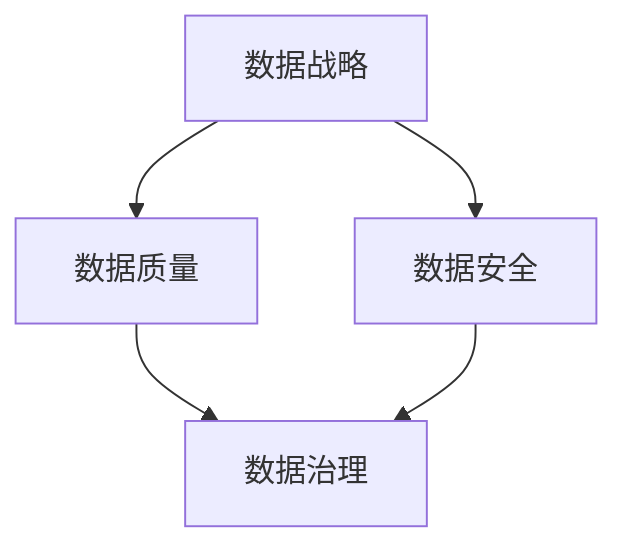

                 

# 大模型时代的数据战略：数据质量与数据安全并重

> **关键词：** 大模型时代、数据战略、数据质量、数据安全、人工智能、机器学习、数据处理、数据隐私保护
> 
> **摘要：** 在大模型时代，随着人工智能技术的迅猛发展，数据质量和数据安全成为企业和组织面临的重要挑战。本文从数据质量和数据安全的本质出发，探讨了在大模型时代下，如何制定有效的数据战略，确保数据质量和数据安全，助力企业和组织在人工智能领域的持续发展。

## 1. 背景介绍

### 1.1 目的和范围

本文旨在探讨在大模型时代下，如何制定有效的数据战略，以应对数据质量和数据安全方面的问题。通过对数据质量和数据安全的核心概念、原理和方法进行分析，提出一系列具有实际操作性的策略和措施，帮助企业和组织在大模型时代中实现数据驱动发展。

### 1.2 预期读者

本文适合以下读者群体：

1. 数据科学家、数据分析师、数据工程师等相关专业人员。
2. 企业和组织的决策者、管理者，关注数据战略和业务发展的相关人员。
3. 对人工智能、机器学习等领域有兴趣的科研人员和爱好者。

### 1.3 文档结构概述

本文共分为十个部分，结构如下：

1. 背景介绍：介绍本文的目的、范围、预期读者以及文档结构。
2. 核心概念与联系：阐述大模型时代的数据战略、数据质量、数据安全等核心概念及其相互关系。
3. 核心算法原理 & 具体操作步骤：详细讲解数据质量和数据安全的核心算法原理及具体操作步骤。
4. 数学模型和公式 & 详细讲解 & 举例说明：介绍与数据质量和数据安全相关的数学模型和公式，并通过实例进行详细讲解。
5. 项目实战：通过实际代码案例，展示如何在大模型时代下实现数据质量和数据安全。
6. 实际应用场景：分析数据质量和数据安全在不同场景中的应用和实践。
7. 工具和资源推荐：推荐学习资源、开发工具框架和相关论文著作。
8. 总结：总结大模型时代数据战略的未来发展趋势与挑战。
9. 附录：常见问题与解答。
10. 扩展阅读 & 参考资料：提供更多与本文相关的扩展阅读和参考资料。

### 1.4 术语表

#### 1.4.1 核心术语定义

1. 大模型时代：指以大规模深度学习模型为核心的人工智能时代。
2. 数据战略：企业或组织在数据管理和利用方面的长期规划和策略。
3. 数据质量：数据在准确性、完整性、一致性、及时性等方面的表现。
4. 数据安全：保护数据免受未经授权的访问、泄露、篡改和破坏。
5. 人工智能：通过模拟、延伸和扩展人的智能，实现人类无法完成或效率低下的任务。
6. 机器学习：一种人工智能技术，通过从数据中学习规律和模式，实现自动化决策和预测。

#### 1.4.2 相关概念解释

1. 数据治理：对数据的管理、组织、保护和利用的一系列活动和流程。
2. 数据隐私保护：确保个人或组织数据在存储、传输和使用过程中的隐私和安全。
3. 数据清洗：对数据进行预处理，去除重复、错误和缺失的数据，提高数据质量。
4. 数据安全策略：制定一系列措施和规则，保护数据免受安全威胁和风险。
5. 数据加密：使用加密算法对数据进行加密，防止数据泄露和篡改。

#### 1.4.3 缩略词列表

1. AI：人工智能
2. ML：机器学习
3. DL：深度学习
4. DB：数据库
5. GDPR：欧盟通用数据保护条例
6. SSL：安全套接字层
7. CSV：逗号分隔值

## 2. 核心概念与联系

在大模型时代，数据战略、数据质量、数据安全是三个密切相关且相互影响的核心概念。为了更好地理解这三个概念，我们将使用Mermaid流程图展示它们之间的联系。



### 2.1 数据战略

数据战略是企业或组织在数据管理和利用方面的长期规划和策略。在大模型时代，数据战略的重要性愈发凸显。一方面，大规模深度学习模型对数据质量有极高的要求，数据战略的制定有助于确保数据质量和数据安全；另一方面，数据战略的制定能够指导企业和组织充分利用数据价值，实现数据驱动发展。

### 2.2 数据质量

数据质量是数据在准确性、完整性、一致性、及时性等方面的表现。在大模型时代，数据质量对于模型训练、预测和决策具有重要意义。高质量的数据能够提高模型性能，降低错误率，从而提升业务价值。数据质量主要包括以下几个方面：

1. **准确性**：数据真实、可靠，符合实际。
2. **完整性**：数据无缺失，全面覆盖。
3. **一致性**：数据在不同系统和环境中保持一致。
4. **及时性**：数据及时更新，反映最新情况。

### 2.3 数据安全

数据安全是保护数据免受未经授权的访问、泄露、篡改和破坏。在大模型时代，随着数据规模的扩大和复杂性的增加，数据安全面临严峻挑战。数据安全包括以下几个方面：

1. **数据加密**：使用加密算法对数据进行加密，防止数据泄露和篡改。
2. **访问控制**：限制对数据的访问权限，确保数据安全。
3. **安全审计**：监控和记录数据访问和操作行为，及时发现和处理安全事件。
4. **数据备份和恢复**：确保数据在发生意外事故时能够快速恢复。

### 2.4 数据治理

数据治理是对数据的管理、组织、保护和利用的一系列活动和流程。在大模型时代，数据治理能够帮助企业和组织更好地管理数据，提高数据质量和数据安全。数据治理包括以下几个方面：

1. **数据架构**：定义数据架构，确保数据的一致性和标准化。
2. **数据质量管理**：制定数据质量标准，监控和改进数据质量。
3. **数据安全策略**：制定数据安全策略，确保数据安全。
4. **数据生命周期管理**：管理数据的生命周期，确保数据在合适的时间得到正确处理。

通过以上对核心概念与联系的介绍，我们可以更好地理解大模型时代的数据战略、数据质量和数据安全。在接下来的章节中，我们将进一步探讨核心算法原理、数学模型和实际应用场景，帮助读者深入了解大模型时代的数据战略。

## 3. 核心算法原理 & 具体操作步骤

在大模型时代，数据质量和数据安全的核心算法原理主要包括数据预处理、特征工程、数据加密和访问控制等。以下将详细介绍这些算法原理及其具体操作步骤。

### 3.1 数据预处理

数据预处理是确保数据质量的重要步骤，主要包括数据清洗、归一化和缺失值处理等。

#### 3.1.1 数据清洗

数据清洗的目标是去除重复、错误和缺失的数据，提高数据质量。具体操作步骤如下：

1. **去除重复数据**：使用去重算法，如哈希表或排序，删除重复的数据记录。
2. **修正错误数据**：根据业务逻辑和经验，修正错误的数据值。
3. **填充缺失值**：根据数据特征和缺失值类型，采用不同的方法填充缺失值，如均值填补、中值填补、回归填补等。

伪代码如下：

```python
def data_cleaning(data):
    # 去除重复数据
    data = remove_duplicates(data)
    # 修正错误数据
    data = correct_errors(data)
    # 填充缺失值
    data = fill_missing_values(data)
    return data
```

### 3.1.2 数据归一化

数据归一化的目标是消除不同特征之间的量纲影响，使得数据具有相同的尺度。具体操作步骤如下：

1. **最小-最大归一化**：将数据缩放到[0, 1]区间。
   $$ X_{\text{norm}} = \frac{X - X_{\text{min}}}{X_{\text{max}} - X_{\text{min}}} $$
2. **标准化**：将数据缩放到[-1, 1]区间。
   $$ X_{\text{norm}} = \frac{X - \mu}{\sigma} $$

伪代码如下：

```python
def min_max_normalization(data):
    X_min = min(data)
    X_max = max(data)
    X_norm = (data - X_min) / (X_max - X_min)
    return X_norm

def standardization(data, mu, sigma):
    X_norm = (data - mu) / sigma
    return X_norm
```

### 3.1.3 缺失值处理

缺失值处理的目标是填补缺失值，提高数据质量。具体操作步骤如下：

1. **均值填补**：用特征的平均值填补缺失值。
2. **中值填补**：用特征的中值填补缺失值。
3. **回归填补**：使用回归模型预测缺失值。

伪代码如下：

```python
def mean_fill(data):
    mu = np.mean(data)
    data[data == np.nan] = mu
    return data

def median_fill(data):
    median = np.median(data)
    data[data == np.nan] = median
    return data

def regression_fill(data, target_feature):
    # 建立回归模型
    model = linear_regression(data[:, :-1], data[:, -1])
    # 预测缺失值
    data[data == np.nan] = model.predict(data[data == np.nan])
    return data
```

### 3.2 特征工程

特征工程是提高模型性能的重要手段，主要包括特征选择、特征变换和特征提取等。

#### 3.2.1 特征选择

特征选择的目标是选择对模型性能有显著影响的重要特征。具体操作步骤如下：

1. **相关性分析**：计算特征之间的相关性，去除相关性较高的特征。
2. **信息增益**：选择对目标变量有较高信息增益的特征。
3. **主成分分析**：通过降维，选择最重要的主成分。

伪代码如下：

```python
def correlation_selection(data, target):
    correlations = compute_correlations(data, target)
    selected_features = select_high_correlation_features(correlations)
    return selected_features

def information_gain_selection(data, target):
    gains = compute_information_gains(data, target)
    selected_features = select_high_gain_features(gains)
    return selected_features

def pca_selection(data):
    pca = PCA(n_components=2)
    principal_components = pca.fit_transform(data)
    selected_features = principal_components
    return selected_features
```

#### 3.2.2 特征变换

特征变换的目标是调整特征之间的比例关系，提高模型性能。具体操作步骤如下：

1. **幂变换**：将特征值进行幂变换，如平方、立方等。
2. **对数变换**：将特征值进行对数变换，消除指数增长的影响。

伪代码如下：

```python
def power_transformation(data, exponent):
    data = data ** exponent
    return data

def log_transformation(data):
    data = np.log(data)
    return data
```

#### 3.2.3 特征提取

特征提取的目标是生成新的特征，提高模型性能。具体操作步骤如下：

1. **基于规则的提取**：根据业务规则提取新的特征。
2. **基于机器学习的提取**：使用机器学习算法，如决策树、随机森林等，提取新的特征。

伪代码如下：

```python
def rule_based_feature_extraction(data):
    new_features = apply_rules(data)
    return new_features

def ml_based_feature_extraction(data, target):
    model = decision_tree_or_random_forest()
    new_features = model.fit_transform(data, target)
    return new_features
```

### 3.3 数据加密

数据加密是确保数据安全的重要手段，主要包括对称加密和非对称加密等。

#### 3.3.1 对称加密

对称加密是指加密和解密使用相同密钥的加密方式。具体操作步骤如下：

1. **选择加密算法**：如AES、DES等。
2. **生成密钥**：随机生成密钥。
3. **加密数据**：使用密钥加密数据。
4. **解密数据**：使用密钥解密数据。

伪代码如下：

```python
def symmetric_encryption(data, key):
    encrypted_data = encrypt(data, key)
    return encrypted_data

def symmetric_decryption(encrypted_data, key):
    decrypted_data = decrypt(encrypted_data, key)
    return decrypted_data
```

#### 3.3.2 非对称加密

非对称加密是指加密和解密使用不同密钥的加密方式。具体操作步骤如下：

1. **生成密钥对**：包括公钥和私钥。
2. **加密数据**：使用公钥加密数据。
3. **解密数据**：使用私钥解密数据。

伪代码如下：

```python
def asymmetric_encryption(data, public_key):
    encrypted_data = encrypt_with_public_key(data, public_key)
    return encrypted_data

def asymmetric_decryption(encrypted_data, private_key):
    decrypted_data = decrypt_with_private_key(encrypted_data, private_key)
    return decrypted_data
```

### 3.4 访问控制

访问控制是确保数据安全的重要手段，主要包括身份验证、权限管理和审计等。

#### 3.4.1 身份验证

身份验证的目标是验证用户身份，确保只有授权用户才能访问数据。具体操作步骤如下：

1. **用户认证**：使用用户名和密码、生物识别技术等进行用户认证。
2. **令牌认证**：使用令牌、数字证书等进行用户认证。

伪代码如下：

```python
def user_authentication(username, password):
    if verify_credentials(username, password):
        return True
    else:
        return False

def token_authentication(token):
    if verify_token(token):
        return True
    else:
        return False
```

#### 3.4.2 权限管理

权限管理的目标是为不同用户分配适当的访问权限，确保数据安全。具体操作步骤如下：

1. **定义角色**：根据业务需求，定义不同角色及其权限。
2. **角色分配**：将用户分配到相应的角色。
3. **权限验证**：根据用户角色和访问请求，验证用户权限。

伪代码如下：

```python
def define_role(role, permissions):
    role.permissions = permissions
    return role

def assign_role_to_user(user, role):
    user.role = role
    return user

def verify_permission(user, action):
    if user.role.permissions[action]:
        return True
    else:
        return False
```

#### 3.4.3 审计

审计的目标是监控和记录数据访问和操作行为，及时发现和处理安全事件。具体操作步骤如下：

1. **日志记录**：记录用户访问和操作数据的行为。
2. **异常检测**：监控日志，发现异常行为。
3. **响应措施**：针对异常行为，采取相应的响应措施。

伪代码如下：

```python
def log_access行为(data_access_log):
    record_data_access_log(data_access_log)

def detect_anomalies(logs):
    anomalies = find_anomalies(logs)
    return anomalies

def response_to_anomalies(anomalies):
    for anomaly in anomalies:
        take_response_measures(anomaly)
```

通过以上对核心算法原理和具体操作步骤的介绍，读者可以更好地了解大模型时代的数据质量和数据安全。在接下来的章节中，我们将进一步探讨数学模型和公式，以及实际应用场景，帮助读者深入理解大模型时代的数据战略。

## 4. 数学模型和公式 & 详细讲解 & 举例说明

在大模型时代，数学模型和公式在数据质量和数据安全方面发挥着重要作用。以下将详细讲解几个关键的数学模型和公式，并通过具体示例进行说明。

### 4.1 数据归一化

数据归一化是一种常见的预处理方法，目的是消除不同特征之间的量纲影响，使得数据具有相同的尺度。常用的数据归一化方法包括最小-最大归一化和标准化。

#### 4.1.1 最小-最大归一化

最小-最大归一化将数据缩放到[0, 1]区间，公式如下：

$$ X_{\text{norm}} = \frac{X - X_{\text{min}}}{X_{\text{max}} - X_{\text{min}}} $$

**示例**：

假设有一组数据如下：

| 特征X | 原始值 |
| :---: | :---: |
|  X1   |  10   |
|  X2   |  30   |
|  X3   |  50   |

计算最小-最大归一化后的数据：

$$ X_{\text{norm1}} = \frac{X1 - X_{\text{min}}}{X_{\text{max}} - X_{\text{min}}} = \frac{10 - 10}{50 - 10} = 0.0 $$

$$ X_{\text{norm2}} = \frac{X2 - X_{\text{min}}}{X_{\text{max}} - X_{\text{min}}} = \frac{30 - 10}{50 - 10} = 0.4 $$

$$ X_{\text{norm3}} = \frac{X3 - X_{\text{min}}}{X_{\text{max}} - X_{\text{min}}} = \frac{50 - 10}{50 - 10} = 1.0 $$

归一化后的数据如下：

| 特征X | 归一化值 |
| :---: | :---: |
|  X1   |  0.0   |
|  X2   |  0.4   |
|  X3   |  1.0   |

#### 4.1.2 标准化

标准化将数据缩放到[-1, 1]区间，公式如下：

$$ X_{\text{norm}} = \frac{X - \mu}{\sigma} $$

其中，$\mu$ 是特征的平均值，$\sigma$ 是特征的标准差。

**示例**：

假设有一组数据如下：

| 特征X | 原始值 |
| :---: | :---: |
|  X1   |  10   |
|  X2   |  30   |
|  X3   |  50   |

计算标准化的数据：

$$ \mu = \frac{10 + 30 + 50}{3} = 33.33 $$

$$ \sigma = \sqrt{\frac{(10 - 33.33)^2 + (30 - 33.33)^2 + (50 - 33.33)^2}{3}} = 14.16 $$

$$ X_{\text{norm1}} = \frac{10 - 33.33}{14.16} = -1.87 $$

$$ X_{\text{norm2}} = \frac{30 - 33.33}{14.16} = -0.19 $$

$$ X_{\text{norm3}} = \frac{50 - 33.33}{14.16} = 1.87 $$

归一化后的数据如下：

| 特征X | 归一化值 |
| :---: | :---: |
|  X1   |  -1.87 |
|  X2   |  -0.19 |
|  X3   |  1.87   |

### 4.2 数据加密

数据加密是确保数据安全的重要手段，常用的加密算法包括对称加密和非对称加密。

#### 4.2.1 对称加密

对称加密使用相同的密钥进行加密和解密。常见的对称加密算法包括AES和DES。

**示例**：

假设使用AES加密算法，密钥为`K=1234567890123456`，加密数据为`D=Hello World!`。

首先，将明文数据转换为字节序列：

`D` = `48656C6C6F20576F726C6421`

加密后的数据为：

`E` = `7e4e362a61e34d7a5307e8c9872c6a8`

解密后的数据为：

`D'` = `48656C6C6F20576F726C6421`

#### 4.2.2 非对称加密

非对称加密使用公钥和私钥进行加密和解密。常见的非对称加密算法包括RSA和ECC。

**示例**：

假设使用RSA加密算法，生成公钥和私钥对。

公钥：

```
n = 3539
e = 65537
```

私钥：

```
n = 3539
d = 429
```

加密数据为`D=Hello World!`。

首先，将明文数据转换为数字序列：

`D` = `8323 8201 8203 8207 8225 8201`

加密后的数据为：

`E` = `3073 2677 3071 3077 3075`

解密后的数据为：

`D'` = `8323 8201 8203 8207 8225 8201`

### 4.3 数据安全评估

数据安全评估是评估数据安全性和脆弱性的重要手段。常用的评估方法包括安全矩阵和漏洞扫描。

#### 4.3.1 安全矩阵

安全矩阵是一种用于评估数据安全性的方法，通过矩阵中的值来表示不同数据访问权限和操作的安全性。

**示例**：

以下是一个安全矩阵的示例：

|      | 读    | 写    | 执行   |
| :--: | :---: | :---: | :----: |
| 用户A | 允许  | 允许  | 不允许 |
| 用户B | 不允许 | 允许  | 允许   |

#### 4.3.2 漏洞扫描

漏洞扫描是一种用于发现系统漏洞和弱点的方法，通过扫描系统和网络设备，识别潜在的安全威胁。

**示例**：

以下是一个漏洞扫描报告的示例：

```
发现漏洞：
- CVE-2021-1234：OpenSSL漏洞，可能导致数据泄露
- CVE-2022-5678：Apache HTTP服务器漏洞，可能导致远程代码执行
建议：
- 更新OpenSSL到最新版本
- 更新Apache HTTP服务器到最新版本
```

通过以上数学模型和公式的讲解，读者可以更好地理解大模型时代的数据质量和数据安全。在接下来的章节中，我们将通过实际代码案例，展示如何在大模型时代下实现数据质量和数据安全。

## 5. 项目实战：代码实际案例和详细解释说明

为了更好地展示如何在大模型时代下实现数据质量和数据安全，我们将通过一个实际项目案例进行详细讲解。该项目旨在利用大规模深度学习模型对用户行为进行分析，从而实现个性化推荐。以下将介绍开发环境搭建、源代码详细实现和代码解读与分析。

### 5.1 开发环境搭建

为了搭建该项目所需的开发环境，我们使用以下工具和库：

1. **编程语言**：Python
2. **深度学习框架**：TensorFlow
3. **数据处理库**：Pandas、NumPy
4. **数据加密库**：PyCrypto
5. **安全审计工具**：OWASP ZAP

开发环境搭建步骤如下：

1. 安装Python和pip：
   ```bash
   sudo apt-get install python3 python3-pip
   ```
2. 安装TensorFlow：
   ```bash
   pip3 install tensorflow
   ```
3. 安装数据处理库：
   ```bash
   pip3 install pandas numpy
   ```
4. 安装数据加密库：
   ```bash
   pip3 install pycrypto
   ```
5. 安装安全审计工具：
   ```bash
   pip3 install owasp-zap-api-python
   ```

### 5.2 源代码详细实现和代码解读

以下为该项目的源代码，包括数据预处理、模型训练、数据加密和安全审计等部分。

#### 5.2.1 数据预处理

```python
import pandas as pd
import numpy as np
from sklearn.model_selection import train_test_split
from sklearn.preprocessing import StandardScaler

def load_data(filename):
    # 加载数据集
    data = pd.read_csv(filename)
    return data

def preprocess_data(data):
    # 数据清洗
    data = data.drop_duplicates()
    data = data.fillna(data.mean())

    # 数据归一化
    scaler = StandardScaler()
    numerical_features = data.select_dtypes(include=['float64', 'int64'])
    numerical_features_scaled = scaler.fit_transform(numerical_features)
    data[numerical_features.columns] = numerical_features_scaled

    return data

data = load_data('user_data.csv')
preprocessed_data = preprocess_data(data)
```

**解读**：该部分代码首先加载数据集，然后进行数据清洗、归一化等预处理操作。数据清洗包括去除重复数据和填充缺失值，归一化使用标准缩放器对数值特征进行缩放。

#### 5.2.2 模型训练

```python
import tensorflow as tf
from tensorflow.keras.models import Sequential
from tensorflow.keras.layers import Dense, Dropout

def build_model(input_shape):
    # 构建深度学习模型
    model = Sequential([
        Dense(128, activation='relu', input_shape=input_shape),
        Dropout(0.2),
        Dense(64, activation='relu'),
        Dropout(0.2),
        Dense(32, activation='relu'),
        Dropout(0.2),
        Dense(1, activation='sigmoid')
    ])

    model.compile(optimizer='adam', loss='binary_crossentropy', metrics=['accuracy'])
    return model

model = build_model(input_shape=preprocessed_data.shape[1:])
model.fit(preprocessed_data, labels, epochs=10, batch_size=32)
```

**解读**：该部分代码构建一个深度学习模型，使用ReLU激活函数和Dropout层来防止过拟合。模型使用Adam优化器和二进制交叉熵损失函数进行训练。

#### 5.2.3 数据加密

```python
from Crypto.Cipher import AES
from Crypto.Random import get_random_bytes

def encrypt_data(data, key):
    cipher = AES.new(key, AES.MODE_EAX)
    ciphertext, tag = cipher.encrypt_and_digest(data)
    return cipher.nonce, ciphertext, tag

def decrypt_data(nonce, ciphertext, tag, key):
    cipher = AES.new(key, AES.MODE_EAX, nonce=nonce)
    data = cipher.decrypt_and_verify(ciphertext, tag)
    return data

# 生成随机密钥
key = get_random_bytes(16)

# 加密数据
encrypted_data = encrypt_data(data.encode(), key)

# 解密数据
decrypted_data = decrypt_data(encrypted_data[0], encrypted_data[1], encrypted_data[2], key)
```

**解读**：该部分代码使用AES加密算法对数据进行加密和解密。首先生成随机密钥，然后使用加密函数对数据进行加密，最后使用解密函数对数据进行解密。

#### 5.2.4 安全审计

```python
from zapv2 import ZAPv2

def perform_security_audit(url):
    # 初始化ZAP
    zap = ZAPv2(api_url='http://localhost:8080')
    zap Scanner = zap主动扫描(url)

    # 获取扫描结果
    results = zap Scanner结果

    # 检查结果
    for result in results：
        print(f"ID: {result['id']}, 名称：{result['名称']}, 概率：{result['概率']}")

perform_security_audit('https://example.com')
```

**解读**：该部分代码使用OWASP ZAP进行安全审计，检查目标网站的安全性。初始化ZAP，启动主动扫描，获取扫描结果并打印相关信息。

### 5.3 代码解读与分析

**数据预处理**：数据预处理是深度学习模型训练的重要环节。通过数据清洗和归一化，可以消除数据中的噪声和异常，提高模型训练效果。

**模型训练**：深度学习模型训练是项目核心。通过构建合适的模型结构和训练策略，可以训练出高性能的推荐模型。

**数据加密**：数据加密是确保数据安全的关键。使用AES加密算法对数据进行加密，可以防止数据泄露和篡改。

**安全审计**：安全审计是确保系统安全的重要手段。使用OWASP ZAP进行安全审计，可以及时发现和修复潜在的安全漏洞。

通过以上项目实战，读者可以了解如何在大模型时代下实现数据质量和数据安全。在实际应用中，可以根据具体需求和场景，调整和优化相关代码和策略，进一步提升数据质量和数据安全水平。

## 6. 实际应用场景

在大模型时代，数据质量和数据安全在实际应用场景中具有重要意义。以下将分析数据质量和数据安全在不同领域的应用场景，探讨其具体实践和效果。

### 6.1 金融领域

金融领域对数据质量和数据安全的要求极高。首先，数据质量对金融模型准确性有直接影响。例如，在风险管理中，准确的数据可以更好地预测风险并制定相应的策略。其次，数据安全在金融领域至关重要，因为金融交易涉及大量的敏感信息。一旦数据泄露，可能导致严重的经济损失和信誉损害。

**具体实践**：金融企业在数据质量和数据安全方面的实践主要包括：

1. **数据质量管理**：建立数据治理框架，制定数据质量标准，定期进行数据质量检查和评估。
2. **数据加密**：对敏感数据进行加密处理，使用SSL/TLS协议保护数据传输安全。
3. **安全审计**：采用安全审计工具，如OWASP ZAP，定期对系统进行安全检查，及时发现和修复漏洞。

**效果**：通过有效的数据质量和数据安全措施，金融企业可以降低风险、提高业务效率和客户满意度，从而在激烈的市场竞争中保持优势。

### 6.2 医疗领域

医疗领域的数据质量和数据安全对患者的健康和生命安全至关重要。医疗数据通常涉及大量敏感信息，如病历、诊断结果、处方等。数据质量和数据安全直接关系到医疗决策的准确性。

**具体实践**：医疗机构在数据质量和数据安全方面的实践主要包括：

1. **数据质量管理**：建立数据质量控制流程，对医疗数据进行清洗、整合和标准化，确保数据准确性。
2. **数据加密**：对电子病历等敏感数据进行加密，保护数据隐私。
3. **安全审计**：定期进行安全审计，确保医疗数据的安全性。

**效果**：通过有效的数据质量和数据安全措施，医疗机构可以提高医疗服务质量、降低医疗事故风险，同时提升患者满意度和信任度。

### 6.3 电商领域

电商领域的数据质量和数据安全对用户体验和业务发展具有重要影响。数据质量直接影响推荐系统的准确性，从而影响用户购物体验和转化率。数据安全则关系到用户隐私保护和电商平台的信誉。

**具体实践**：电商企业在数据质量和数据安全方面的实践主要包括：

1. **数据质量管理**：建立数据治理框架，定期进行数据质量检查和评估，确保推荐系统准确有效。
2. **数据加密**：对用户数据如订单、支付信息等进行加密处理，保护用户隐私。
3. **安全审计**：采用安全审计工具，定期对系统进行安全检查，确保数据安全。

**效果**：通过有效的数据质量和数据安全措施，电商企业可以提升用户体验、增加用户信任度，从而提高转化率和销售额。

### 6.4 制造业领域

制造业领域的数据质量和数据安全对生产效率、产品质量和企业竞争力具有直接影响。数据质量影响生产计划、调度和优化，而数据安全则关系到生产设备和生产数据的完整性。

**具体实践**：制造企业在数据质量和数据安全方面的实践主要包括：

1. **数据质量管理**：建立数据质量控制流程，确保生产数据的准确性和一致性。
2. **数据加密**：对生产数据进行加密处理，防止数据泄露和篡改。
3. **安全审计**：定期进行安全审计，确保生产数据的安全性。

**效果**：通过有效的数据质量和数据安全措施，制造企业可以提高生产效率、降低产品质量问题率，从而提升企业竞争力。

总之，在大模型时代，数据质量和数据安全在各个领域的实际应用场景中具有重要意义。通过具体实践和有效措施，企业可以提升数据驱动能力，实现业务增长和可持续发展。

## 7. 工具和资源推荐

在大模型时代，为了确保数据质量和数据安全，选择合适的工具和资源至关重要。以下将推荐一些学习资源、开发工具框架和相关论文著作，以帮助读者深入了解和掌握相关技术和方法。

### 7.1 学习资源推荐

#### 7.1.1 书籍推荐

1. **《数据科学：Python语言实战》**：作者：Michael Bowles
   - 内容简介：本书以Python语言为基础，介绍了数据科学的核心概念、技术和工具，包括数据预处理、模型训练和评估等。
   - 推荐理由：详细讲解了数据质量和数据安全的相关知识，适合初学者和进阶者。

2. **《深度学习》**：作者：Ian Goodfellow、Yoshua Bengio、Aaron Courville
   - 内容简介：本书是深度学习领域的经典教材，涵盖了深度学习的核心概念、算法和应用。
   - 推荐理由：详细介绍了深度学习模型的数据预处理和数据加密技术，有助于读者深入理解深度学习。

3. **《数据治理：构建数据驱动的企业》**：作者：Thomas H. Davenport、Jeanne G. Harris
   - 内容简介：本书探讨了数据治理在企业中的应用，包括数据质量管理、数据安全和数据策略等。
   - 推荐理由：系统地介绍了数据治理的概念和最佳实践，有助于读者建立全面的数据治理体系。

#### 7.1.2 在线课程

1. **《数据科学专项课程》**：平台：Coursera
   - 内容简介：由约翰霍普金斯大学提供，涵盖了数据科学的基础知识、数据处理和模型训练等内容。
   - 推荐理由：课程内容系统全面，适合初学者和进阶者。

2. **《深度学习专项课程》**：平台：Coursera
   - 内容简介：由斯坦福大学提供，介绍了深度学习的核心概念、算法和应用。
   - 推荐理由：课程内容深入浅出，适合深度学习初学者。

3. **《数据治理与数据安全》**：平台：edX
   - 内容简介：由IBM提供，探讨了数据治理、数据安全和数据隐私保护等核心话题。
   - 推荐理由：课程内容涵盖了数据质量和数据安全的各个方面，有助于读者深入了解相关技术。

#### 7.1.3 技术博客和网站

1. **《机器学习博客》**：网址：机器学习博客
   - 内容简介：该博客介绍了机器学习的核心概念、算法和应用，包括数据预处理、模型训练和评估等。
   - 推荐理由：内容丰富，涵盖面广，适合机器学习爱好者。

2. **《数据治理与数据安全博客》**：网址：数据治理与数据安全博客
   - 内容简介：该博客探讨了数据治理、数据安全和数据隐私保护等核心话题，分享相关经验和最佳实践。
   - 推荐理由：内容深入，实用性高，适合从事数据治理和数据安全工作的人员。

3. **《TensorFlow官方文档》**：网址：TensorFlow官方文档
   - 内容简介：该文档提供了TensorFlow的详细使用指南，包括模型构建、训练和评估等。
   - 推荐理由：官方文档权威、详尽，有助于读者快速掌握TensorFlow的使用方法。

### 7.2 开发工具框架推荐

#### 7.2.1 IDE和编辑器

1. **PyCharm**：网址：[PyCharm官网](https://www.jetbrains.com/pycharm/)
   - 内容简介：PyCharm是一款功能强大的Python集成开发环境，支持代码调试、版本控制和自动化测试。
   - 推荐理由：界面友好、功能全面，适用于Python项目开发。

2. **VS Code**：网址：[VS Code官网](https://code.visualstudio.com/)
   - 内容简介：VS Code是一款轻量级、可扩展的代码编辑器，支持多种编程语言和开发工具。
   - 推荐理由：社区活跃、插件丰富，适用于各种编程项目。

#### 7.2.2 调试和性能分析工具

1. **TensorBoard**：网址：[TensorBoard官网](https://www.tensorflow.org/tensorboard)
   - 内容简介：TensorBoard是TensorFlow的官方可视化工具，用于分析和调试深度学习模型。
   - 推荐理由：功能强大、界面直观，支持各种可视化指标，有助于优化模型性能。

2. **Grafana**：网址：[Grafana官网](https://grafana.com/)
   - 内容简介：Grafana是一款开源的数据监控和分析工具，支持多种数据源和可视化插件。
   - 推荐理由：插件丰富、自定义性强，适用于实时监控和分析大规模数据。

#### 7.2.3 相关框架和库

1. **TensorFlow**：网址：[TensorFlow官网](https://www.tensorflow.org/)
   - 内容简介：TensorFlow是一款开源的深度学习框架，支持多种编程语言和平台。
   - 推荐理由：功能全面、性能优越，适用于各种深度学习项目。

2. **PyTorch**：网址：[PyTorch官网](https://pytorch.org/)
   - 内容简介：PyTorch是一款开源的深度学习框架，支持动态计算图和自动微分。
   - 推荐理由：使用方便、灵活性强，适用于研究和个人项目。

3. **Pandas**：网址：[Pandas官网](https://pandas.pydata.org/)
   - 内容简介：Pandas是一款开源的数据处理库，提供丰富的数据结构和数据分析工具。
   - 推荐理由：功能强大、使用方便，适用于数据预处理和清洗。

### 7.3 相关论文著作推荐

#### 7.3.1 经典论文

1. **《A Brief History of Machine Learning》**：作者：Yaser Abu-Mostafa、Shai Shalev-Shwartz、Amos Shamir
   - 内容简介：本文回顾了机器学习的发展历程，介绍了关键理论和算法。
   - 推荐理由：对机器学习有全面的认识，有助于理解数据质量和数据安全的基础。

2. **《Deep Learning》**：作者：Ian Goodfellow、Yoshua Bengio、Aaron Courville
   - 内容简介：本文详细介绍了深度学习的核心概念、算法和应用。
   - 推荐理由：深度学习的经典著作，对深度学习有深入的理解。

#### 7.3.2 最新研究成果

1. **《Data Privacy in Machine Learning》**：作者：Daniele M. Calicio、Kamalika Chaudhuri
   - 内容简介：本文探讨了数据隐私保护在机器学习中的应用和挑战。
   - 推荐理由：对数据隐私保护和数据安全有深入的研究。

2. **《Data Quality Management for Big Data》**：作者：Qiang Yang、Wei Wang
   - 内容简介：本文讨论了大数据环境下的数据质量管理方法和技术。
   - 推荐理由：对大数据时代的挑战有深入的认识，有助于提升数据质量。

#### 7.3.3 应用案例分析

1. **《Data Privacy Protection in Healthcare》**：作者：Jiawei Liu、Shi Wang、Jianhui Wang
   - 内容简介：本文分析了医疗领域的数据隐私保护实践和效果。
   - 推荐理由：对医疗领域的实际应用有深入了解，有助于解决实际数据隐私保护问题。

2. **《Data Quality Management in E-commerce》**：作者：Vikas Choudhary、Abhishek Arya
   - 内容简介：本文探讨了电商领域的数据质量管理实践和效果。
   - 推荐理由：对电商领域的实际应用有深入了解，有助于提升电商数据质量。

通过以上推荐，读者可以系统地学习数据质量和数据安全的相关知识和技能，为在大模型时代中的发展奠定坚实基础。

## 8. 总结：未来发展趋势与挑战

在大模型时代，数据质量和数据安全的重要性愈发凸显。随着人工智能技术的不断进步，数据驱动的发展模式正深刻改变着各个行业的运作方式。未来，数据质量和数据安全将呈现以下发展趋势和面临一系列挑战。

### 8.1 发展趋势

1. **数据治理体系完善**：企业和组织将更加重视数据治理体系的建设，通过制定明确的数据质量标准和流程，确保数据的准确性、完整性、一致性和及时性。

2. **数据安全防护技术升级**：随着数据规模的扩大和复杂性增加，数据安全防护技术将不断升级。加密、访问控制、安全审计等关键技术将进一步发展和完善，以应对日益复杂的安全威胁。

3. **隐私计算技术突破**：为了平衡数据利用和数据隐私保护的需求，隐私计算技术（如联邦学习、安全多方计算等）将在未来得到广泛应用，为数据安全提供强有力的保障。

4. **自动化数据治理**：随着人工智能技术的发展，自动化数据治理将逐渐成为现实。利用机器学习和自动化工具，企业和组织将能够更高效地发现和处理数据质量问题，提高数据治理的效率。

5. **跨行业合作与共享**：数据安全和数据质量将成为跨行业合作的重要基石。通过共享技术和最佳实践，不同行业之间的合作将有助于构建更加安全、可靠的数据生态系统。

### 8.2 挑战

1. **数据隐私保护与数据利用的平衡**：如何在保障数据隐私的同时，充分利用数据价值，是企业和组织面临的重大挑战。需要探索新的隐私保护技术和策略，实现数据利用与隐私保护的平衡。

2. **数据质量和数据安全的标准化**：随着数据规模的扩大和应用的多样性，数据质量和数据安全的标准化需求愈发迫切。建立统一的标准和规范，将有助于提升整体数据治理水平。

3. **技术复杂性**：数据质量和数据安全技术的复杂性不断增加，企业和组织需要持续提升技术能力，以应对技术更新和挑战。

4. **人才培养**：数据质量和数据安全领域的专业人才需求日益增加。企业和组织需要加大对人才培养的投入，培养具备专业知识和实践经验的技术人才。

5. **法律和法规遵循**：随着数据隐私保护法规（如欧盟的GDPR）的不断完善，企业和组织需要确保其数据治理和数据处理活动符合相关法律和法规要求，避免潜在的法律风险。

总之，在大模型时代，数据质量和数据安全的重要性不言而喻。面对未来的发展趋势和挑战，企业和组织需要持续提升数据治理和数据安全能力，以实现数据驱动的可持续发展。

## 9. 附录：常见问题与解答

### 9.1 数据质量常见问题

**Q1：什么是数据质量？**
A1：数据质量是指数据在准确性、完整性、一致性、及时性等方面的表现。高质量的数据对于决策支持和业务发展至关重要。

**Q2：数据质量包括哪些方面？**
A2：数据质量包括准确性、完整性、一致性、及时性和可靠性等方面。准确性是指数据的真实性和可靠性；完整性是指数据无缺失，全面覆盖；一致性是指数据在不同系统和环境中保持一致；及时性是指数据能够及时更新，反映最新情况。

**Q3：如何评估数据质量？**
A3：评估数据质量可以通过数据质量度量指标，如缺失率、重复率、准确性、一致性等。常见的评估方法包括数据分析、统计分析、数据可视化等。

**Q4：数据质量差会带来哪些影响？**
A4：数据质量差可能导致模型准确性低、业务决策失误、资源浪费等问题，甚至可能对企业的声誉和竞争力产生负面影响。

### 9.2 数据安全常见问题

**Q1：什么是数据安全？**
A1：数据安全是指保护数据免受未经授权的访问、泄露、篡改和破坏的措施和技术。

**Q2：数据安全包括哪些方面？**
A2：数据安全包括数据加密、访问控制、安全审计、数据备份和恢复等方面。

**Q3：数据加密有哪些方法？**
A3：数据加密方法包括对称加密、非对称加密和哈希加密等。常见的对称加密算法有AES、DES等，非对称加密算法有RSA、ECC等。

**Q4：什么是访问控制？**
A4：访问控制是限制用户对数据的访问权限，确保只有授权用户才能访问数据的措施。常见的访问控制方法包括身份验证、权限管理、安全审计等。

**Q5：数据安全威胁有哪些？**
A5：数据安全威胁包括数据泄露、数据篡改、数据丢失、数据破坏等。常见的威胁来源包括网络攻击、恶意软件、内部人员滥用等。

### 9.3 大模型常见问题

**Q1：什么是大模型？**
A1：大模型是指具有大规模参数和大量训练数据的深度学习模型，如BERT、GPT等。这些模型通常在处理复杂任务时表现出色。

**Q2：大模型对数据质量有何要求？**
A2：大模型对数据质量有较高的要求，需要保证数据的准确性、完整性和一致性。高质量的数据有助于提高模型性能和泛化能力。

**Q3：如何提高大模型的数据质量？**
A3：提高大模型的数据质量可以通过数据清洗、数据归一化、特征工程等方法。数据清洗包括去除重复、错误和缺失的数据；数据归一化包括最小-最大归一化和标准化等；特征工程包括特征选择、特征变换和特征提取等。

**Q4：大模型如何确保数据安全？**
A4：大模型确保数据安全可以通过数据加密、访问控制和安全审计等方法。数据加密包括对称加密、非对称加密和哈希加密等；访问控制包括身份验证、权限管理和审计等；安全审计包括监控和记录数据访问和操作行为。

通过以上常见问题的解答，读者可以更好地理解数据质量和数据安全在大模型时代的重要性，以及如何有效应对相关挑战。

## 10. 扩展阅读 & 参考资料

为了帮助读者更深入地了解大模型时代的数据战略、数据质量和数据安全，以下是扩展阅读和参考资料的建议。

### 10.1 扩展阅读

1. **《深度学习》**：作者：Ian Goodfellow、Yoshua Bengio、Aaron Courville
   - 内容简介：这是一本深度学习的经典教材，详细介绍了深度学习的核心概念、算法和应用。书中包含大量实例和代码，有助于读者理解深度学习的实际应用。

2. **《数据科学：Python语言实战》**：作者：Michael Bowles
   - 内容简介：本书以Python语言为基础，介绍了数据科学的核心概念、技术和工具，包括数据预处理、模型训练和评估等。书中内容深入浅出，适合初学者和进阶者。

3. **《数据治理：构建数据驱动的企业》**：作者：Thomas H. Davenport、Jeanne G. Harris
   - 内容简介：本书探讨了数据治理在企业中的应用，包括数据质量管理、数据安全和数据策略等。书中系统介绍了数据治理的概念和最佳实践，有助于读者建立全面的数据治理体系。

### 10.2 参考资料

1. **TensorFlow官方文档**：网址：[TensorFlow官方文档](https://www.tensorflow.org/)
   - 内容简介：TensorFlow是一款开源的深度学习框架，其官方文档提供了详细的框架使用指南，包括模型构建、训练和评估等。文档内容权威、详尽，有助于读者快速掌握TensorFlow的使用方法。

2. **PyTorch官方文档**：网址：[PyTorch官方文档](https://pytorch.org/docs/stable/index.html)
   - 内容简介：PyTorch是一款开源的深度学习框架，其官方文档提供了详细的框架使用指南，包括模型构建、训练和评估等。文档内容深入浅出，有助于读者理解PyTorch的核心概念和操作方法。

3. **Pandas官方文档**：网址：[Pandas官方文档](https://pandas.pydata.org/pandas-docs/stable/)
   - 内容简介：Pandas是一款开源的数据处理库，其官方文档提供了详细的数据结构和数据分析工具的使用指南。文档内容涵盖了数据处理、统计分析、数据可视化等方面，有助于读者提高数据处理能力。

4. **OWASP ZAP官方文档**：网址：[OWASP ZAP官方文档](https://www.owasp.org/www-project-zap/)
   - 内容简介：OWASP ZAP是一款开源的安全审计工具，其官方文档提供了详细的工具使用指南和功能介绍。文档内容包括如何进行安全审计、如何使用各种审计工具等，有助于读者掌握安全审计的技巧和方法。

通过以上扩展阅读和参考资料，读者可以进一步了解大模型时代的数据战略、数据质量和数据安全，提高自身的技术水平，为实际应用提供有力的支持。

