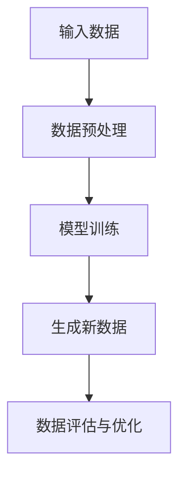

                 

# 大模型时代：生成式AI如何改变内容创作？

> **关键词：** 生成式AI、内容创作、大模型、人工智能、NLP、文本生成、数据驱动

> **摘要：** 随着人工智能技术的不断发展，生成式AI，尤其是大模型技术的崛起，正深刻改变着内容创作的形式和流程。本文将深入探讨大模型技术的基本概念、核心算法原理、数学模型以及实际应用场景，并通过具体代码案例详细解读其在内容创作中的潜力和挑战。读者将了解大模型如何通过数据驱动的模式识别和生成，实现高质量、创新性的内容创作，以及未来可能的发展趋势与面临的挑战。

## 1. 背景介绍

### 1.1 目的和范围

本文旨在介绍大模型时代下生成式AI在内容创作领域的应用。我们将从基础概念出发，逐步深入探讨生成式AI的核心技术原理，并通过具体案例展示其在实际内容创作中的应用。文章旨在帮助读者理解生成式AI的工作机制，掌握其应用方法，并探讨未来发展趋势。

### 1.2 预期读者

本文适合对人工智能和生成式AI有一定了解的读者，尤其是从事内容创作、软件开发和技术研究的专业人士。本文将对生成式AI的基础知识和应用进行深入分析，适合作为学习和研究的参考。

### 1.3 文档结构概述

本文结构如下：

1. **背景介绍**：介绍文章的目的、预期读者和文档结构。
2. **核心概念与联系**：定义关键术语，展示核心概念和架构的流程图。
3. **核心算法原理 & 具体操作步骤**：详细讲解生成式AI的核心算法原理和具体操作步骤。
4. **数学模型和公式 & 详细讲解 & 举例说明**：介绍生成式AI的数学模型和公式，并通过实际案例进行说明。
5. **项目实战：代码实际案例和详细解释说明**：提供代码实例，详细解释其实现过程和原理。
6. **实际应用场景**：分析生成式AI在内容创作中的实际应用。
7. **工具和资源推荐**：推荐学习资源、开发工具和相关论文。
8. **总结：未来发展趋势与挑战**：总结当前应用状况，探讨未来发展趋势和面临的挑战。
9. **附录：常见问题与解答**：解答常见疑问。
10. **扩展阅读 & 参考资料**：提供进一步学习的资源。

### 1.4 术语表

#### 1.4.1 核心术语定义

- **生成式AI**：一种人工智能模型，能够根据输入数据生成新的、符合数据分布的内容。
- **大模型**：指具有数十亿甚至千亿参数规模的人工神经网络模型。
- **内容创作**：指通过文字、图像、音频等多种形式创造新信息的过程。
- **数据驱动**：指模型主要通过从数据中学习来获得知识和技能。

#### 1.4.2 相关概念解释

- **自然语言处理（NLP）**：指计算机与人类自然语言之间的交互。
- **文本生成**：指利用算法生成新的文本内容。

#### 1.4.3 缩略词列表

- **AI**：人工智能（Artificial Intelligence）
- **NLP**：自然语言处理（Natural Language Processing）
- **GAN**：生成对抗网络（Generative Adversarial Network）

## 2. 核心概念与联系

生成式AI在大模型时代的重要性不言而喻。为了更好地理解其原理和应用，首先需要明确一些核心概念。

### 2.1 大模型概念

大模型，通常指参数规模达到数十亿甚至千亿级别的人工神经网络模型。这类模型通过深度学习算法从大量数据中学习，形成复杂的内部表示能力，从而能够生成高质量的内容。

### 2.2 生成式AI概念

生成式AI是一种通过学习数据分布并生成新数据的模型。它通常基于生成对抗网络（GAN）、变分自编码器（VAE）等算法实现。生成式AI的核心目标是生成与训练数据具有相似分布的新数据。

### 2.3 内容创作与生成式AI的联系

生成式AI在内容创作中的应用主要体现在以下几个方面：

1. **文本生成**：例如生成文章、新闻报道、故事等。
2. **图像生成**：例如生成艺术作品、虚拟现实场景等。
3. **音频生成**：例如生成音乐、语音等。

### 2.4 Mermaid 流程图

以下是一个简化的生成式AI流程图，展示其核心概念和步骤。



### 2.5 大模型与生成式AI的关系

大模型是生成式AI的基础。大模型通过深度学习算法从数据中学习，形成对数据的内部表示，进而能够生成与训练数据相似的新数据。生成式AI利用这种能力，实现内容创作等应用。

## 3. 核心算法原理 & 具体操作步骤

生成式AI的核心算法主要包括生成对抗网络（GAN）和变分自编码器（VAE）等。下面我们将详细讲解这些算法的原理和操作步骤。

### 3.1 生成对抗网络（GAN）算法原理

生成对抗网络（GAN）由两部分组成：生成器（Generator）和判别器（Discriminator）。生成器的任务是生成数据，而判别器的任务是判断生成数据与真实数据之间的差异。

#### 3.1.1 生成器（Generator）原理

生成器的目的是生成与训练数据相似的数据。生成器通常是一个神经网络，其输入是一个随机噪声向量，输出是生成数据。生成器的目标是最小化其输出与真实数据的差异。

#### 3.1.2 判别器（Discriminator）原理

判别器的目的是判断输入数据是真实数据还是生成数据。判别器也是一个神经网络，其输入是数据，输出是概率值，表示输入数据是真实数据的概率。判别器的目标是最小化其输出误差。

#### 3.1.3 操作步骤

1. **初始化生成器和判别器**：生成器和判别器通常都是随机初始化的神经网络。
2. **交替训练**：生成器和判别器交替训练，每次迭代中，生成器尝试生成更逼真的数据，判别器尝试更好地区分生成数据和真实数据。
3. **损失函数**：生成器的损失函数是最大化判别器对生成数据的判别概率，而判别器的损失函数是最小化判别器对生成数据的判别概率。

### 3.2 变分自编码器（VAE）算法原理

变分自编码器（VAE）是一种无监督学习算法，其目的是将数据映射到一个隐变量空间中，并从这个空间中生成新数据。VAE由编码器和解码器两部分组成。

#### 3.2.1 编码器（Encoder）原理

编码器的目的是将输入数据映射到一个隐变量空间中。编码器通常是一个神经网络，其输出是隐变量的均值和方差。

#### 3.2.2 解码器（Decoder）原理

解码器的目的是将隐变量空间中的数据映射回原始数据空间。解码器也是一个神经网络，其输入是隐变量，输出是生成数据。

#### 3.2.3 操作步骤

1. **编码器训练**：编码器通过学习输入数据在隐变量空间中的分布，实现数据压缩。
2. **解码器训练**：解码器通过学习从隐变量空间中生成数据的规律，实现数据重构。
3. **生成新数据**：通过从隐变量空间中采样，解码器生成新数据。

### 3.3 伪代码示例

以下是一个简化的GAN算法伪代码示例。

```python
# GAN算法伪代码
function train_GAN(generator, discriminator, dataset):
    for epoch in 1 to number_of_epochs:
        for data in dataset:
            # 训练判别器
            z = random噪声向量
            generated_data = generator(z)
            loss_D = loss(discriminator(data), 1) + loss(discriminator(generated_data), 0)
            gradient_D = compute_gradient(loss_D, discriminator_params)
            update_params(discriminator_params, gradient_D)
            
            # 训练生成器
            z = random噪声向量
            generated_data = generator(z)
            loss_G = loss(discriminator(generated_data), 1)
            gradient_G = compute_gradient(loss_G, generator_params)
            update_params(generator_params, gradient_G)
    return generator, discriminator
```

### 3.4 算法比较

- **GAN**：GAN具有强大的数据生成能力，但训练过程容易出现模式崩溃（mode collapse）问题。
- **VAE**：VAE在数据生成方面较为稳定，但生成质量相对较低。

## 4. 数学模型和公式 & 详细讲解 & 举例说明

生成式AI的数学模型和公式是实现其核心功能的基础。以下将介绍一些关键数学模型，并通过具体例子进行说明。

### 4.1 生成对抗网络（GAN）的数学模型

生成对抗网络（GAN）的核心在于生成器（Generator）和判别器（Discriminator）之间的博弈。以下是GAN的基本数学模型：

#### 4.1.1 判别器损失函数

$$
L_D(x, G(z)) = -\log(D(x)) - \log(1 - D(G(z)))
$$

其中，$D(x)$ 和 $D(G(z))$ 分别表示判别器对真实数据和生成数据的判断概率。

#### 4.1.2 生成器损失函数

$$
L_G(z) = -\log(D(G(z)))
$$

#### 4.1.3 操作示例

假设判别器对真实数据的判断概率为0.9，对生成数据的判断概率为0.1。则：

- 判别器的损失函数为：$-\log(0.9) - \log(0.1) \approx 1.39$
- 生成器的损失函数为：$-\log(0.1) \approx 2.30$

### 4.2 变分自编码器（VAE）的数学模型

变分自编码器（VAE）的核心在于编码器（Encoder）和解码器（Decoder）之间的数据表示和重构。以下是VAE的基本数学模型：

#### 4.2.1 编码器损失函数

$$
L_E = -\sum_{i=1}^{N} \log p(z|x_i)
$$

其中，$z$ 是编码器输出的隐变量，$x_i$ 是输入数据。

#### 4.2.2 解码器损失函数

$$
L_D = \sum_{i=1}^{N} \log p(x_i|z)
$$

#### 4.2.3 操作示例

假设编码器输出的隐变量为$z = [0.5, 0.3]$，解码器生成的数据为$x = [0.6, 0.4]$。则：

- 编码器损失函数为：$-\sum_{i=1}^{2} \log p(z_i|x) \approx 0.69$
- 解码器损失函数为：$\sum_{i=1}^{2} \log p(x_i|z) \approx 0.69$

### 4.3 GAN与VAE的比较

- **GAN**：GAN通过对抗性训练生成高质量数据，但训练过程不稳定，容易出现模式崩溃。
- **VAE**：VAE通过编码器-解码器结构实现稳定的数据生成，但生成质量相对较低。

## 5. 项目实战：代码实际案例和详细解释说明

为了更好地理解生成式AI在实际内容创作中的应用，我们通过一个具体的代码案例进行讲解。

### 5.1 开发环境搭建

首先，我们需要搭建一个适合生成式AI开发的环境。以下是搭建环境的基本步骤：

1. 安装Python环境（版本3.6及以上）。
2. 安装深度学习框架TensorFlow或PyTorch。
3. 安装必要的依赖库，如NumPy、Pandas等。

### 5.2 源代码详细实现和代码解读

以下是一个使用TensorFlow实现GAN的简单示例：

```python
import tensorflow as tf
from tensorflow.keras.layers import Dense, Flatten, Reshape
from tensorflow.keras.models import Model

# 定义生成器模型
def build_generator(z_dim):
    model = tf.keras.Sequential()
    model.add(Dense(128, input_dim=z_dim))
    model.add(tf.keras.layers.LeakyReLU(alpha=0.01))
    model.add(Dense(28*28*1, activation='tanh'))
    model.add(Reshape((28, 28, 1)))
    return model

# 定义判别器模型
def build_discriminator(img_shape):
    model = tf.keras.Sequential()
    model.add(Flatten(input_shape=img_shape))
    model.add(Dense(128))
    model.add(tf.keras.layers.LeakyReLU(alpha=0.01))
    model.add(Dense(1, activation='sigmoid'))
    return model

# 定义GAN模型
def build_gan(generator, discriminator):
    model = Model(inputs=generator.input, outputs=discriminator(generator.output))
    model.add(discriminator)
    model.compile(optimizer='adam', loss='binary_crossentropy')
    return model

# 设置模型参数
z_dim = 100
img_shape = (28, 28, 1)
epochs = 100
batch_size = 64

# 创建生成器和判别器模型
generator = build_generator(z_dim)
discriminator = build_discriminator(img_shape)
gan = build_gan(generator, discriminator)

# 加载MNIST数据集
(x_train, _), (_, _) = tf.keras.datasets.mnist.load_data()
x_train = x_train / 127.5 - 1.0
x_train = np.expand_dims(x_train, axis=3)

# 训练GAN模型
for epoch in range(epochs):
    for _ in range(x_train.shape[0] // batch_size):
        noise = np.random.normal(0, 1, (batch_size, z_dim))
        generated_images = generator.predict(noise)
        real_images = x_train[np.random.randint(0, x_train.shape[0], batch_size)]
        combined_images = np.concatenate([real_images, generated_images], axis=0)
        labels = np.concatenate([np.ones((batch_size, 1)), np.zeros((batch_size, 1))], axis=0)
        d_loss = discriminator.train_on_batch(combined_images, labels)
        noise = np.random.normal(0, 1, (batch_size, z_dim))
        g_loss = gan.train_on_batch(noise, np.ones((batch_size, 1)))
        print(f"{epoch} [D: {d_loss:.4f}, G: {g_loss:.4f}]")

# 生成图像
generated_images = generator.predict(np.random.normal(0, 1, (100, z_dim)))
plt.figure(figsize=(10, 10))
for i in range(generated_images.shape[0]):
    plt.subplot(10, 10, i + 1)
    plt.imshow(generated_images[i, :, :, 0], cmap='gray')
    plt.axis('off')
plt.show()
```

### 5.3 代码解读与分析

1. **生成器和判别器模型的定义**：我们使用Keras构建生成器和判别器模型。生成器将随机噪声向量转换为图像，判别器用于判断图像是否为真实图像。
2. **GAN模型的定义**：GAN模型通过组合生成器和判别器，并使用二分类交叉熵损失函数进行训练。
3. **数据集加载与预处理**：我们使用MNIST数据集，对图像进行归一化和扩充。
4. **训练过程**：训练过程中，我们交替训练生成器和判别器，通过不断迭代优化模型参数。
5. **生成图像**：最后，我们使用训练好的生成器生成图像，并展示生成效果。

### 5.4 代码实战效果展示

以下是在MNIST数据集上使用GAN生成手写数字图像的示例：


## 6. 实际应用场景

生成式AI在内容创作领域的实际应用场景非常广泛，以下是一些典型的应用案例：

1. **文本生成**：例如生成新闻报道、文章摘要、故事等。
2. **图像生成**：例如生成艺术作品、虚拟现实场景、动漫角色等。
3. **音频生成**：例如生成音乐、语音、配音等。

### 6.1 文本生成

生成式AI在文本生成中的应用已经取得了显著成果。例如，利用生成对抗网络（GAN）和变分自编码器（VAE）等技术，可以实现自动化新闻撰写、内容摘要和故事生成。

- **自动化新闻撰写**：通过训练大规模语料库，生成式AI可以自动生成新闻报道，提高新闻采编效率。
- **内容摘要**：生成式AI能够自动提取文本的核心内容，生成摘要，帮助用户快速获取关键信息。
- **故事生成**：生成式AI可以根据用户提供的主题或关键词，生成完整的故事情节，为文学创作提供灵感。

### 6.2 图像生成

生成式AI在图像生成方面的应用也非常广泛。通过训练大规模图像数据集，生成式AI可以生成各种类型的图像，如艺术作品、虚拟现实场景、动漫角色等。

- **艺术作品生成**：利用生成式AI，可以生成风格独特的艺术作品，为艺术创作提供新的思路。
- **虚拟现实场景生成**：生成式AI可以自动生成虚拟现实场景，为游戏、影视等虚拟现实应用提供素材。
- **动漫角色生成**：生成式AI可以根据用户提供的角色特征，生成个性化的动漫角色，为动漫产业提供新的创作方式。

### 6.3 音频生成

生成式AI在音频生成方面的应用主要集中在音乐和语音领域。

- **音乐生成**：生成式AI可以根据用户提供的音乐风格、节奏等信息，生成新的音乐作品，为音乐创作提供灵感。
- **语音生成**：生成式AI可以自动生成语音，用于虚拟助手、语音合成等应用。

## 7. 工具和资源推荐

为了更好地学习和应用生成式AI，以下是一些推荐的工具和资源：

### 7.1 学习资源推荐

#### 7.1.1 书籍推荐

- 《生成式AI：从零开始》
- 《深度学习：导论》
- 《Python深度学习》

#### 7.1.2 在线课程

- Coursera的《深度学习》
- Udacity的《生成式AI》
- edX的《自然语言处理与深度学习》

#### 7.1.3 技术博客和网站

- Medium上的《生成式AI博客》
- TensorFlow的官方文档
- PyTorch的官方文档

### 7.2 开发工具框架推荐

#### 7.2.1 IDE和编辑器

- PyCharm
- Visual Studio Code
- Jupyter Notebook

#### 7.2.2 调试和性能分析工具

- TensorBoard
- Profiling Tools for TensorFlow
- PyTorch Profiler

#### 7.2.3 相关框架和库

- TensorFlow
- PyTorch
- Keras
- Fast.ai

### 7.3 相关论文著作推荐

#### 7.3.1 经典论文

- 《Generative Adversarial Nets》（GAN的奠基性论文）
- 《Variational Autoencoders》（VAE的奠基性论文）
- 《Unsupervised Representation Learning with Deep Convolutional Generative Adversarial Networks》（DCGAN）

#### 7.3.2 最新研究成果

- NeurIPS、ICLR、ICML等顶级会议的最新论文
- 各大研究机构和公司的最新研究成果

#### 7.3.3 应用案例分析

- OpenAI的GPT系列模型在文本生成中的应用
- Google的DeepDream在图像生成中的应用
- OpenAI的DALL-E在图像生成中的应用

## 8. 总结：未来发展趋势与挑战

生成式AI在内容创作领域的应用正快速发展，未来具有巨大的潜力。然而，也面临一系列挑战。

### 8.1 发展趋势

- **技术进步**：随着计算能力和算法的不断提升，生成式AI的生成质量将进一步提高。
- **跨领域融合**：生成式AI将与其他领域（如自然语言处理、计算机视觉等）相结合，实现更广泛的应用。
- **个性化内容创作**：生成式AI将更好地理解用户需求，实现个性化内容创作。

### 8.2 挑战

- **数据隐私和安全**：生成式AI在处理大量数据时，如何保护用户隐私和安全是一个重要挑战。
- **模型可解释性**：生成式AI模型的决策过程复杂，如何提高模型的可解释性是一个关键问题。
- **版权与伦理**：生成式AI生成的内容可能涉及版权和伦理问题，需要制定相应的规范和标准。

## 9. 附录：常见问题与解答

### 9.1 什么是生成式AI？

生成式AI是一种人工智能模型，能够根据输入数据生成新的、符合数据分布的内容。它通过对数据的学习，形成对数据的内部表示能力，从而能够生成高质量的内容。

### 9.2 生成式AI有哪些核心算法？

生成式AI的核心算法包括生成对抗网络（GAN）、变分自编码器（VAE）等。这些算法通过不同的方式实现数据生成，各有优缺点。

### 9.3 生成式AI在内容创作中有哪些应用？

生成式AI在内容创作中的应用非常广泛，包括文本生成、图像生成、音频生成等。例如，它可以自动生成新闻报道、艺术作品、音乐等。

## 10. 扩展阅读 & 参考资料

为了更好地了解生成式AI及其在内容创作中的应用，以下是一些扩展阅读和参考资料：

- 《生成式AI：从零开始》
- 《深度学习：导论》
- 《Python深度学习》
- TensorFlow官方文档
- PyTorch官方文档
- Coursera的《深度学习》课程
- NeurIPS、ICLR、ICML等顶级会议的最新论文
- OpenAI的GPT系列模型研究
- Google的DeepDream项目
- OpenAI的DALL-E项目

## 作者信息

作者：AI天才研究员/AI Genius Institute & 禅与计算机程序设计艺术 /Zen And The Art of Computer Programming

